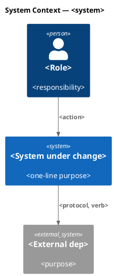
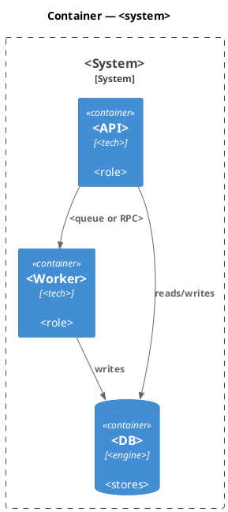
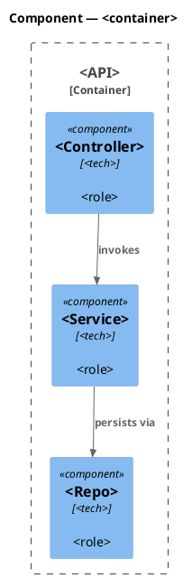
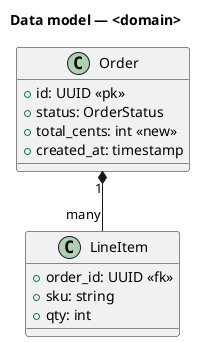
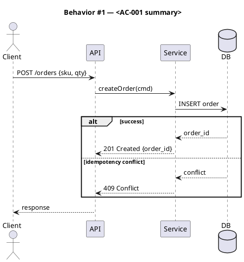
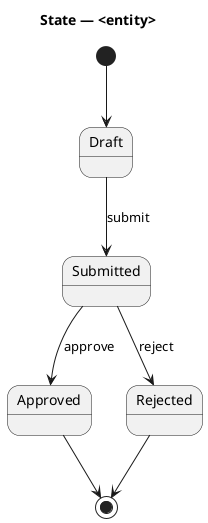
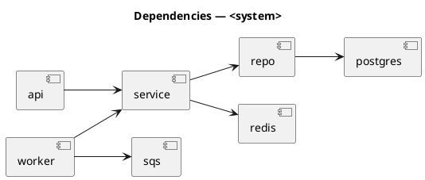

# <Spec — technical, short, specific>

<!--
Technical spec. Produced by the `spec` skill.

Guard-enforced invariants:
  - Required ## headings (artifact_template_guard):
        Goal, Design, Acceptance criteria, Test plan.
  - Required diagram kinds inside ```plantuml``` fences
    (spec_diagram_presence_guard, configured in project.json →
     artifacts.required_diagrams.spec):
        c4_context, c4_container, c4_component,
        sequence, class, dependency_graph.
  - Every ```plantuml``` fence must parse (plantuml_syntax_guard).

Approval: NEVER add "Status: Approved" — spec_approval_guard blocks it.
Approval is a token written by /approve-spec.
-->

## Context

| Input | Path |
|---|---|
| Intake | `docs/intake/<slug>.md` |
| BRD *(if any)* | `docs/brd/<slug>.md` |
| Scout *(if any)* | `docs/scout/<slug>.md` |
| Research *(if any)* | `docs/research/<slug>.md` |

## Goal

<One sentence. What the system does after this spec ships. Not why — the intake owns why.>

## Non-goals

- <Explicit exclusion. Keeps the spec from quietly growing.>

## Design

Diagrams are the contract. Prose is only for things a diagram cannot say.

### C4 — System context

Who interacts with the system, and which external systems it depends on.



### C4 — Container

Deployable units inside the system boundary and how they communicate.



### C4 — Component (changed containers only)

One diagram per container whose internals change. Skip containers that are untouched.



### Data model — class diagram

Entities, fields, and cardinality. Mark new/changed with `<<new>>` or `<<changed>>`.



#### Migration DDL

```sql
-- forward
ALTER TABLE orders ADD COLUMN total_cents int NOT NULL DEFAULT 0;
-- reverse
ALTER TABLE orders DROP COLUMN total_cents;
```

### Behavior — sequence per AC

One sequence diagram per acceptance criterion. The sequence is the contract: label every arrow with method + payload, include failure branches explicitly. Section anchors here (`§Behavior #N`) are referenced from the AC table.



### State — core entity *(only if stateful)*

Finite-state model. Omit the block if the system has no non-trivial state machine — but keep the heading so reviewers see the explicit choice.



### Dependencies — graph

Directed graph of build/runtime dependencies. Edge `A --> B` reads "A depends on B". The first line `' @kind dependency-graph` is a PlantUML comment that identifies the block to `spec_diagram_presence_guard`.



### Contracts

One row per endpoint / CLI command / message. Tables, not prose.

| Kind | Name | Input | Output | Errors | Idempotent |
|---|---|---|---|---|---|
| HTTP | `POST /orders` | `{sku, qty}` | `201 {order_id}` | 400, 409, 5xx | yes (`Idempotency-Key`) |
| Event | `order.created.v1` | `{order_id, total_cents}` | — | — | consumer de-dupes |

### Libraries and versions

Every entry must be confirmed via the `context7` MCP — no training-data recall for third-party APIs (seed.md § Context7 Rule).

| Library@version | Purpose | Key APIs | Confirmed via context7 |
|---|---|---|---|
| `<lib@x.y.z>` | `<use>` | `<api names>` | yes |

### Alternatives considered

| Alt | Summary | Rejected because |
|---|---|---|
| A | <description> | <reason> |
| B | <description> | <reason> |

## Design calls

When this spec's `write_set` intersects `project.json → tdd.ui_globs`, every UI surface needs a design call here. `/tdd` Step 6 reads each row, serializes it to a `task_brief`, and invokes `Skill(design-ui, task_brief)` once per row. design-ui then routes through `impeccable` for the actual design work.

If the write_set has no UI files, leave the section body as `*(none)*` — the required heading must still be present per `project.json → artifacts.required_sections.spec`. `spec_design_calls_guard` only fires (denies the write) when both conditions hold: write_set intersects ui_globs AND the section body is missing or empty.

| Slug | Intent | Target files | Write set | Register | References |
|---|---|---|---|---|---|
| settings-page | build a settings page that doesn't feel like a SaaS template | `app/settings/page.tsx` | `app/settings/**` | inherit | — |

For specs with no UI surface:

- *(none)*

## Acceptance criteria

Numbered, testable, traced. Each AC points to the §Behavior sequence that defines it.

| ID | Criterion (given / when / then) | Upstream AC | Sequence |
|---|---|---|---|
| AC-001 | given X, when Y, then Z | intake AC 1 | §Behavior #1 |
| AC-002 | given X, when Y, then Z | BR-001 | §Behavior #2 |

## Test plan

Scenarios by category. The `scenario` skill (invoked from `/tdd` or `/swarm-dispatch` workers) turns these into failing tests; main context decides the recipe before invocation. Every row must reference at least one AC (or an invariant the regression row defends).

| Category | Scenario | Expected | Covers |
|---|---|---|---|
| Golden path | <case> | <result> | AC-001 |
| Input boundary | empty / max / off-by-one / unicode | <result> | AC-001 |
| Contract violation | invalid type / missing field / unauthorized | <result> | AC-002 |
| Concurrency / ordering | <race, interleaving> | <result> | — |
| Failure mode | dep down / timeout / partial write | <result> | — |
| Regression trap | <invariant> | unchanged | — |

## Observability

| Signal | Name | Shape | Purpose |
|---|---|---|---|
| Log | `<event>` | fields: `<names>` | audit / debug |
| Metric | `<name>` | counter/histogram, labels: `<names>` | SLO |
| Alarm | `<name>` | `<metric + threshold + window>` | page target |

## Rollout

- **Feature flag**: `<flag.name>` — default off.
- **Migration order**: 1 DDL → 2 backfill → 3 dual-write → 4 read-swap → 5 cleanup.
- **Canary**: <percentage, duration, success signal>.

## Rollback

- **Kill-switch**: `<flag off | deploy revert | command>`.
- **Signal to roll back**: `<metric + threshold + window>` — must trip within 5 minutes of a bad rollout.

## Archive plan

When this spec ships, the `archive` skill (Phase 10.5) moves the following into `docs/archive/<ship-date>/<slug>/`. Defaults are the slug-matched artifacts; add any one-off files this work produced (e.g., migration scripts kept for reference) below. Advisory — the `archive` skill discovers slug-matched files automatically; this section documents the *bundle* for the human reviewer.

- Defaults *(automatic)*: intake, brd, scout, research, spec, spec-rendered/, spec approval, swarm plan + approval (if used), security reports (concatenated).
- Extras *(list any non-default files)*:
  - *(none)*

## Open questions

- <question — blocks approval until resolved>
