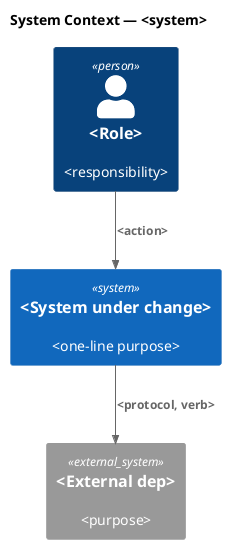
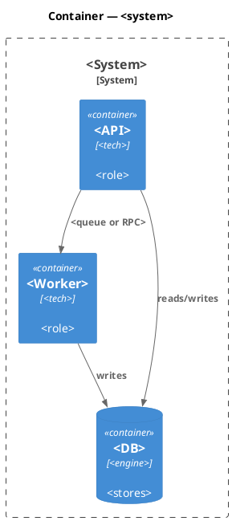
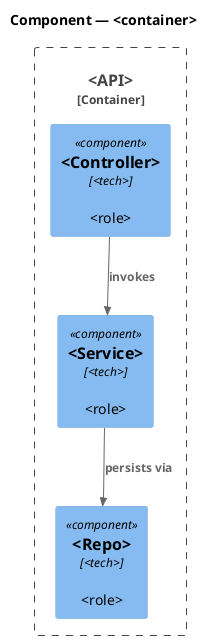
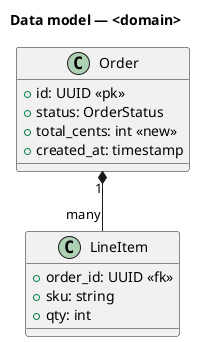
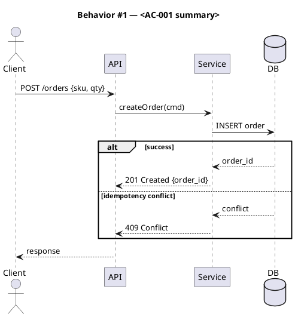
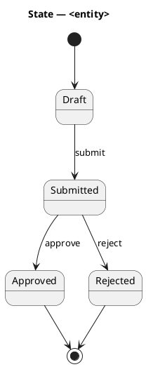
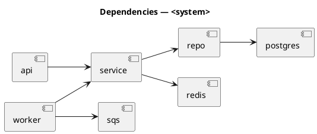

# <Spec — technical, short, specific>

<!--
Technical spec. Produced by the `spec` skill.

THIS FILE IS NOT AUTHORITATIVE. It holds skeletons and examples only.
Diagram authority is split by question (living-system-model-ef decision D3):
  - WHICH diagram kinds a spec must contain -> .claude/project.json ->
    artifacts.required_diagrams.spec. That key is what the guard reads; it wins.
  - THE SYSTEM'S STRUCTURAL MODEL (elements and views) -> docs/system/.
    Specs REFERENCE the corpus rather than re-deriving it.
  - THIS FILE -> shape and worked examples for an author. Editing a skeleton here
    changes no requirement and no model.
Each location answers a different question; none overrides another. Naming one
"the" authority would force the other two to lie.

Guard-enforced invariants:
  - Required ## headings (artifact_template_guard, configured in project.json →
    artifacts.required_sections.spec — that key is what the guard reads; it wins):
        Goal, Design, Design calls, System delta, Acceptance criteria, Test plan.
  - Required diagram kinds inside ```plantuml``` fences
    (spec_diagram_presence_guard, configured in project.json →
     artifacts.required_diagrams.spec):
        c4_context, c4_container, c4_component,
        sequence, class, dependency_graph.
  - Every ```plantuml``` fence must parse (plantuml_syntax_guard).

Approval: NEVER add "Status: Approved" — direction_approval_guard blocks it.
Approval is a token written by /approve-direction.
-->

## Context

| Input | Path |
|---|---|
| Intake | `docs/intake/<slug>.md` |
| BRD *(if any)* | `docs/brd/<slug>.md` |
| Scout *(if any)* | `docs/scout/<slug>.md` |
| Research *(if any)* | `docs/research/<slug>.md` |

**Write set**: `<globs the implementation will touch, in backticks, comma-separated>` — drives the diagram profile. A non-architectural write_set (e.g. only `.claude/skills/**`, `docs/**`, `*.md`, `tests/**`) requires the reduced diagram set; touching app source (`src/**`, `bin/**`) or a `security.sensitive_globs` path requires the full C4 set. Leave the placeholder unfilled to default to the full set. See `project.json → artifacts.diagram_profiles`.

## Goal

<One sentence. What the system does after this spec ships. Not why — the intake owns why.>

## Non-goals

- <Explicit exclusion. Keeps the spec from quietly growing.>

## Design

Diagrams are the contract. Prose is only for things a diagram cannot say.

**A spec is a diff against the central system spec.** The structural kinds — C4
Context, Container, Component — describe the system's standing shape, which
`docs/system/` already models. Satisfy them by REFERENCING an element instead of
redrawing it:

```
@ref element:<element-id>
```

One resolvable reference satisfies all three structural kinds. The behavioural
kinds (sequence, class, dependency graph) still have to be drawn here — they
describe THIS change, not the standing shape. A reference naming an element that
does not exist is refused by `spec_diagram_presence_guard`, and a malformed one
falls back to requiring the full diagram set: a typo must never buy a quieter spec
than referencing nothing at all. Element ids live in `docs/system/elements/`.

### C4 — System context

Who interacts with the system, and which external systems it depends on.


```plantuml
@startuml
!include <C4/C4_Context>
title System Context — <system>
Person(user, "<Role>", "<responsibility>")
System(sut, "<System under change>", "<one-line purpose>")
System_Ext(dep1, "<External dep>", "<purpose>")
Rel(user, sut, "<action>")
Rel(sut, dep1, "<protocol, verb>")
@enduml
```

### C4 — Container

Deployable units inside the system boundary and how they communicate.


```plantuml
@startuml
!include <C4/C4_Container>
title Container — <system>
System_Boundary(sut, "<System>") {
  Container(api, "<API>", "<tech>", "<role>")
  Container(worker, "<Worker>", "<tech>", "<role>")
  ContainerDb(db, "<DB>", "<engine>", "<stores>")
}
Rel(api, worker, "<queue or RPC>")
Rel(api, db, "reads/writes")
Rel(worker, db, "writes")
@enduml
```

### C4 — Component (changed containers only)

One diagram per container whose internals change. Skip containers that are untouched.


```plantuml
@startuml
!include <C4/C4_Component>
title Component — <container>
Container_Boundary(api, "<API>") {
  Component(ctrl, "<Controller>", "<tech>", "<role>")
  Component(svc,  "<Service>",    "<tech>", "<role>")
  Component(repo, "<Repo>",       "<tech>", "<role>")
}
Rel(ctrl, svc, "invokes")
Rel(svc, repo, "persists via")
@enduml
```

### Data model — class diagram

Entities, fields, and cardinality. Mark new/changed with `<<new>>` or `<<changed>>`.


```plantuml
@startuml
title Data model — <domain>
class Order {
  +id: UUID <<pk>>
  +status: OrderStatus
  +total_cents: int <<new>>
  +created_at: timestamp
}
class LineItem {
  +order_id: UUID <<fk>>
  +sku: string
  +qty: int
}
Order "1" *-- "many" LineItem
@enduml
```

#### Migration DDL

```sql
-- forward
ALTER TABLE orders ADD COLUMN total_cents int NOT NULL DEFAULT 0;
-- reverse
ALTER TABLE orders DROP COLUMN total_cents;
```

### Behavior — sequence per AC

One sequence diagram per acceptance criterion. The sequence is the contract: label every arrow with method + payload, include failure branches explicitly. Section anchors here (`§Behavior #N`) are referenced from the AC table.


```plantuml
@startuml
title Behavior #1 — <AC-001 summary>
actor Client
participant API
participant Service
database DB

Client -> API : POST /orders {sku, qty}
API -> Service : createOrder(cmd)
Service -> DB : INSERT order
alt success
  DB --> Service : order_id
  Service --> API : 201 Created {order_id}
else idempotency conflict
  DB --> Service : conflict
  Service --> API : 409 Conflict
end
API --> Client : response
@enduml
```

### State — core entity *(only if stateful)*

Finite-state model. Omit the block if the system has no non-trivial state machine — but keep the heading so reviewers see the explicit choice.


```plantuml
@startuml
title State — <entity>
[*] --> Draft
Draft --> Submitted : submit
Submitted --> Approved : approve
Submitted --> Rejected : reject
Approved --> [*]
Rejected --> [*]
@enduml
```

### Dependencies — graph

Directed graph of build/runtime dependencies. Edge `A --> B` reads "A depends on B". The first line `' @kind dependency-graph` is a PlantUML comment that identifies the block to `spec_diagram_presence_guard`.


```plantuml
@startuml
' @kind dependency-graph
title Dependencies — <system>
left to right direction
[api] --> [service]
[service] --> [repo]
[repo] --> [postgres]
[service] --> [redis]
[worker] --> [service]
[worker] --> [sqs]
@enduml
```

### Contracts

One row per endpoint / CLI command / message. Tables, not prose.

| Kind | Name | Input | Output | Errors | Idempotent |
|---|---|---|---|---|---|
| HTTP | `POST /orders` | `{sku, qty}` | `201 {order_id}` | 400, 409, 5xx | yes (`Idempotency-Key`) |
| Event | `order.created.v1` | `{order_id, total_cents}` | — | — | consumer de-dupes |

### Libraries and versions

Every entry must be confirmed against current docs — no training-data recall for third-party APIs. The `context7` MCP is the default source; a library's official docs / `llms.txt` or a pinned local cache also satisfy it (seed.md §2.5 Current-docs rule).

| Library@version | Purpose | Key APIs | Confirmed against current docs |
|---|---|---|---|
| `<lib@x.y.z>` | `<use>` | `<api names>` | yes |

### Alternatives considered

| Alt | Summary | Rejected because |
|---|---|---|
| A | <description> | <reason> |
| B | <description> | <reason> |

## Design calls

When this spec's `write_set` intersects `project.json → tdd.ui_globs`, every UI surface needs a design call here. `/tdd` Step 6 reads each row, serializes it to a `task_brief`, and invokes `Skill(design-ui, task_brief)` once per row. design-ui then routes through `impeccable` for the actual design work.

Every UI-surface row MUST declare two load-bearing cells (roadmap B1 quality floor):

- **Reference target** — the concrete rubric anchor the rendered surface is scored against: a URL, a committed mock/screenshot path (`docs/design/*.png`), a design-system component id, or a Figma frame. This is what the C4 design-judge captures-and-compares against, so it must be resolvable — not "make it look good".
- **Quality criteria** — one or more measurable, scoreable acceptance bars for the surface (layout-fidelity tolerance, contrast level, responsive breakpoints, motion budget, CLS ceiling). Each must be an observable property a judge can score, semicolon-separated.

If the write_set has no UI files, leave the section body as `*(none)*` — the required heading must still be present per `project.json → artifacts.required_sections.spec`. `spec_design_calls_guard` only fires (denies the write) when `write_set` intersects `tdd.ui_globs`; when it fires, every row needs a populated Reference target and Quality criteria (the shared `hooks/lib/design-calls.mjs` rule, applied identically by the guard and `/spec-lint`).

| Slug | Intent | Target files | Write set | Register | Reference target | Quality criteria |
|---|---|---|---|---|---|---|
| settings-page | build a settings page that doesn't feel like a SaaS template | `app/settings/page.tsx` | `app/settings/**` | inherit | `https://ref.figma.com/settings-v3` (or `docs/design/settings.png`) | layout matches reference ±5% spacing; text contrast ≥ WCAG AA; responsive at 360/768/1280; no CLS > 0.1 |

For specs with no UI surface:

- *(none)*

## System delta

What this spec changes about the standing model at `docs/system/`. The reference affordance
(`spec/SKILL.md` — citing an element id in place of a structural diagram) says what the model
*already* holds; this section says what *changes*. The two compose: cite the element, then declare
the delta against it.

One row per change. The verbs are the corpus's existing op vocabulary — `add`, `change`, `remove`.

- **Verb** — `add` for a governed-surface file the model does not yet anchor; `change` for an
  element whose shape this spec alters; `remove` for one it retires.
- **Element** — the element id under `docs/system/elements/`. For `add` it is the id to be created;
  for `change`/`remove` it must already resolve, or `/spec-lint` fails the row.
- **Anchor** — the repo-relative path or glob the element governs. For an `add` row this must fall
  inside `project.json → memory.architecture_map.governed_surface`.
- **Concept** — the owning concept under `docs/system/concepts/`.
- **Kind** — the diagram kind this element is witnessed by. There is deliberately no Witness column:
  the kind is authored, and the witness derives from it via `witness.bindingFor(kind)`. Authoring
  both would restate `project.json → memory.architecture_map.witnesses` where they agree and create a
  second source of truth where they do not.

| Verb | Element | Anchor | Concept | Kind |
|---|---|---|---|---|
| add | foo-guard | `.claude/hooks/foo_guard.mjs` | guard-substrate | c4_component |
| change | approval-anchor | `.claude/hooks/lib/approval.mjs` | consent-gates | class |

A spec that changes nothing about the model declares that explicitly:

- *(none)*

`*(none)*` is the only legal empty body — an absent heading is denied by `artifact_template_guard`,
and an empty table is a FAIL, because "I did not think about it" and "I thought about it and there is
no change" must not look the same on the page.

## Acceptance criteria

Numbered, testable, traced. Each AC points to the §Behavior sequence that defines it. The `Kind` column tags enforcement ACs — one of `preflight` / `smoke` / `error-mapping` — that Rollout prerequisites bind to via `enforced-by`; every other AC is `behavior`.

| ID | Criterion (given / when / then) | Kind | Upstream AC | Sequence |
|---|---|---|---|---|
| AC-001 | given X, when Y, then Z | behavior | intake AC 1 | §Behavior #1 |
| AC-002 | given X, when Y, then Z | preflight | BR-001 | §Behavior #2 |

## Test plan

Scenarios by category. The `scenario` skill (invoked from `/tdd` or `/swarm-dispatch` workers) turns these into failing tests; main context decides the recipe before invocation. Every row must reference at least one AC (or an invariant the regression row defends).

| Category | Scenario | Expected | Covers |
|---|---|---|---|
| Golden path | <case> | <result> | AC-001 |
| Input boundary | empty / max / off-by-one / unicode | <result> | AC-001 |
| Contract violation | invalid type / missing field / unauthorized | <result> | AC-002 |
| Concurrency / ordering | <race, interleaving> | <result> | — |
| Failure mode | dep down / timeout / partial write | <result> | — |
| Regression trap | <invariant> | unchanged | — |

## Observability

| Signal | Name | Shape | Purpose |
|---|---|---|---|
| Log | `<event>` | fields: `<names>` | audit / debug |
| Metric | `<name>` | counter/histogram, labels: `<names>` | SLO |
| Alarm | `<name>` | `<metric + threshold + window>` | page target |

## Rollout

### Prerequisites

Structured preconditions that must hold for this rollout. One row per prerequisite; each `enforced-by` MUST point to an enforcement-type AC (a Kind of `preflight` / `smoke` / `error-mapping`). `spec-rollout-enforceability-review` BLOCKs implementation entry (via the pre-implementation checkpoint) on a missing, dangling, or non-enforcement binding; a prerequisite left in free prose below is ADVISORY. If this rollout has no preconditions, keep the heading and write `- *(none)*` instead of a table.

| # | Prerequisite | enforced-by |
|---|---|---|
| 1 | `<precondition that must hold before/at rollout>` | AC-NNN |

- **Feature flag**: `<flag.name>` — default off.
- **Migration order**: 1 DDL → 2 backfill → 3 dual-write → 4 read-swap → 5 cleanup.
- **Canary**: <percentage, duration, success signal>.

## Rollback

- **Kill-switch**: `<flag off | deploy revert | command>`.
- **Signal to roll back**: `<metric + threshold + window>` — must trip within 5 minutes of a bad rollout.

## Archive plan

When this spec ships, the `archive` skill (Phase 10.5) moves the following into `docs/archive/<ship-date>/<slug>/`. Defaults are the slug-matched artifacts; add any one-off files this work produced (e.g., migration scripts kept for reference) below. Advisory — the `archive` skill discovers slug-matched files automatically; this section documents the *bundle* for the human reviewer.

- Defaults *(automatic)*: intake, brd, scout, research, spec, spec-rendered/, spec approval, swarm plan + approval (if used), security reports (concatenated).
- Extras *(list any non-default files)*:
  - *(none)*

## Open questions

- <question — blocks approval until resolved>
