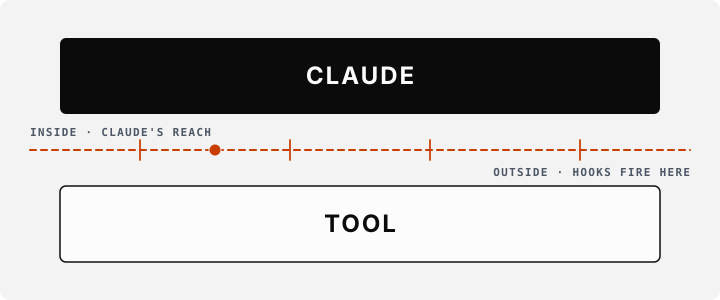

<div align="center">

<picture>
  <source media="(prefers-color-scheme: dark)" srcset="./.github/assets/logo-baseline.svg">
  <source media="(prefers-color-scheme: light)" srcset="./.github/assets/logo-baseline.svg">
  
</picture>

<br/><br/>

# Claude Code Baseline

A discipline layer for Claude Code. Hooks at every tool boundary, a workflow that runs from intake to commit, and a small constitution the agent cannot bypass.

<br/>

[](LICENSE)
[](https://github.com/friedbotstudio/baseline/commits/main)
[](https://github.com/friedbotstudio/baseline/releases)
[](https://github.com/friedbotstudio/baseline/actions/workflows/release.yml)
[](https://claude.com/claude-code)

[](#quickstart)
[](https://baseline.friedbotstudio.com/)

<br/>

[Why](#why-this-exists) · [What](#what-this-is) · [Quickstart](#quickstart) · [Inventory](#what-gets-installed) · [Enforcement](#how-the-enforcement-works) · [Install reference](#install-reference) · [Contributing](#contributing)

---

</div>

```bash
npx @friedbotstudio/create-baseline ./your-project
```

> [!WARNING]
> **Public alpha — under active development.** Expect breaking changes and shifting structural counts between releases. The constitution and the consent-gate semantics are stable; specifics in `docs/init/seed.md` §16 may move. Pin to a specific `@friedbotstudio/create-baseline@<version>` for repeatable installs across a team.

## Why this exists

Claude Code on a real codebase, left unattended, will eventually push to main without review, amend a published commit, mock the database in a test, or sign off on its own spec. None of these are bugs in Claude Code. They are the absence of an opinion your team already holds but has never written down anywhere the agent is obliged to obey it.

The baseline is that opinion, written down and enforced below the layer Claude can reach.

## What this is

A repository overlay. It installs **26 hooks** at Claude's tool boundaries, **58 skills**, **1 subagent**, **9 workflow tracks**, and **4 consent gates** you type yourself.

The hooks run as separate processes, outside Claude's tool boundary, before the tool call resolves. So _"don't push"_, _"don't `--amend`"_, _"don't self-approve specs"_ stop being instructions Claude may follow and become operations it cannot perform. It cannot disable a hook with a flag, cannot write its own consent marker, and cannot reorder a phase without an exception `/triage` records on disk.

<div align="center">
  
</div>


Three files carry the contract: `docs/init/seed.md` is the genesis prompt, `CLAUDE.md` is the in-session constitution, and the hooks and skills actuate both. Precedence runs `seed.md > CLAUDE.md > implementation`. Every claim points at a file you can open.

**Read the docs:** <https://baseline.friedbotstudio.com/>

## Quickstart

```bash
npx @friedbotstudio/create-baseline ./your-project
cd ./your-project
```

Then, inside Claude Code:

```bash
# 1. Configure the project. Runs the recommender, asks the questions,
#    flips .claude/project.json from configured: false to true.
/init-project

# 2. Triage a request. Picks the track, writes .claude/state/workflow.json
#    with any exceptions the request needs.
/triage "your request in plain English"

# 3. Run the pipeline. /harness chains every non-gated phase in one
#    invocation and yields at consent gates so you can review.
/harness
```

Three gates pause the workflow until you type the command yourself:

| Gate | When | What it authorizes |
| --- | --- | --- |
| `/approve-direction <slug>` | after intake | the build direction, before scout/research/spec. The spec is then machine-reviewed, not human-gated |
| `/approve-swarm <slug>` | after `/swarm-plan` | parallel dispatch into isolated worktrees |
| `/grant-commit` | before the commit lands | the workflow's commits. Under github-flow, a non-protected feature branch omits this gate: `/commit` pushes and opens a PR, handing back to you if either fails |

A fourth sits outside the pipeline: **`/grant-push`** opens a 5-minute window for `git push` on a protected branch (per `project.json → git.protected_branches`). Pushes on non-protected branches need no consent.

Each gate writes a short-lived consent marker via a UserPromptSubmit hook that runs _before_ Claude is invoked on the body. Claude cannot forge the marker; the write-boundary guard validates it on disk before letting the approval token through.

## What gets installed

| What | Count | Where it lives |
| --- | ---: | --- |
| **Hooks** on PreToolUse, PostToolUse, SessionStart, Stop, PreCompact, and UserPromptSubmit | 26 | `.claude/hooks/` |
| **Skills** across fifteen categories: artifact drafting, workflow phases, phase workers, spec helpers, orchestration, memory, navigation, phase helpers, generators, audit, alternate tracks, shared globals, maintenance, sprint, and roadmap | 58 | `.claude/skills/` |
| **Subagent** — `swarm-worker`, executes pre-decided recipes inside isolated git worktrees | 1 | `.claude/agents/` |
| **Workflow tracks** — `intake-full` (the full 11-phase pipeline), `spec-entry`, `tdd-quickfix`, `chore`, `freeform`, `epic`, `epic-child`, `org` and `power` (both opt-in, off by default). Two sub-tracks (`swarm-implementation`, `tdd-worker-chain`) are referenced by selector nodes inside the canonical set | 9 + 2 sub | `.claude/workflows.jsonl`, enforced by `track_guard` |
| **Consent gates** — three workflow-phase gates plus `/grant-push` at runtime. All user-typed, all structurally un-invokable by Claude | 3 + 1 | `consent_gate_grant` UserPromptSubmit hook |
| **MCP servers** declared in `.mcp.json` — `context7` (third-party API docs), `plantuml` (diagram render), `playwright` (cross-engine smoke), `sprint-channel` (coordination channel) | 4 | `.mcp.json` |

The roster counts are asserted by `audit-baseline` against `docs/init/seed.md` and the manifest on every build, and drift fails CI. The cross-doc scanner reads prose claims rather than table cells, so this table is maintained by hand against the same source of truth.

## How the enforcement works

The 26 hooks declared in `.claude/settings.json` fire at Claude's tool boundaries: PreToolUse for Bash / Write / Edit / MultiEdit, PostToolUse for the same, plus SessionStart, Stop, PreCompact, and UserPromptSubmit. Each is a Node ESM script (`.mjs`) invoked as a subprocess outside Claude's reach. Their output is JSON; their exit decides whether the tool call proceeds.

The architectural rule is short: **decisions live in main context; subagents only execute pre-decided recipes.** The baseline ships exactly one subagent, `swarm-worker`, and its only sanctioned use is parallel dispatch of fully-specified recipes inside isolated git worktrees during `/swarm-dispatch`. Every other capability that might have been a subagent (code authoring, scenario design, scouting, security review, prose writing, UI design) is a **skill** running in main context with full conversation visibility.

The full pipeline runs `intake → /approve-direction → scout → research → spec → tdd → simplify → security → integrate → document → archive → roadmap-sync → memory-flush → /grant-commit → commit`. The closing sequence matters: `archive` moves the workflow's artifacts into `docs/archive/<date>/<slug>/`, `roadmap-sync` flips the tasks this work landed, and `memory-flush` curates the session's memory candidates into the canonical files — all before `/grant-commit` opens the consent window and `commit` lands the change. A track may skip phases it declares no node for, but it cannot reorder them.

Tracks declared in `.claude/workflows.jsonl` are enforced at the write boundary by `track_guard`, and node ordering inside each track is binding. Two mechanisms may bypass a node: the `exceptions` array in `.claude/state/workflow.json`, written by `/triage` at workflow-creation time, and the post-`tdd` **right-size gate**, a mechanical, fail-open, additive-only oracle that may auto-skip a hard subset of `{simplify, document}` on a small diff, recording each skip in `auto_skipped[]`. It never skips `security` and never overrides an existing exception.

Projects declare their own tracks, or add nodes to the canonical ones, by editing their `.claude/workflows.jsonl`. Article IV's invariants (I1..I11) bind every track regardless of who wrote it: a track that omits `/grant-commit` before a `commit` node, or whose dependency graph contains a cycle, is rejected at triage time with a named error.

When the constitution and the implementation conflict, the constitution governs and the implementation gets corrected. When `seed.md` and the constitution conflict, `seed.md` governs and you stop and surface the drift before acting.

## Install reference

### Requirements

- **Node 18.17+** — the CLI runs as a Node script
- **`git`** — required for the commit phase, swarm worktrees, and the post-archive consent gate. Workflows on non-git projects auto-except `commit` and end at `/archive`
- **`java` (JDK 8+)** — needed by the `plantuml_syntax_guard` hook and `/spec-render`. Install fetches the SHA-pinned `plantuml.jar` (~19 MB); you supply the JVM. Skip with `--no-plantuml`, or pass `--require-plantuml` to make a missing Java a fatal install error

<details>
<summary><b>Install modes</b></summary>

```bash
# Default — install into a fresh or empty target
npx @friedbotstudio/create-baseline ./your-project

# Force-overwrite an existing install (interactive — type 'overwrite')
npx @friedbotstudio/create-baseline ./your-project --force

# Upgrade an existing install against a newer baseline version.
# In a TTY, each tier-1 customised file prompts: keep-mine / take-theirs /
# merge / abort; tier-2 files auto-merge via `git merge-file --diff3`;
# tier-3 files stage for the /upgrade-project skill to reconcile. In CI or
# piped stdout, every per-file action is reported with a user-facing label:
#   - adds new baseline files
#   - refreshes baseline files the user has not touched
#   - keeps customised files (exit 3 if any preserved)
#   - removes baseline files removed upstream that the user had not touched
#   - exit 4 if a mechanical merge produced conflict markers
#   - exit 5 if any tier-3 file was staged for /upgrade-project
npx @friedbotstudio/create-baseline upgrade ./your-project

# Preview without writing anything
npx @friedbotstudio/create-baseline ./your-project --dry-run

# Skip the install-time PlantUML jar download
npx @friedbotstudio/create-baseline ./your-project --no-plantuml

# Materialize a security-hardened target/.npmrc (opt-in)
npx @friedbotstudio/create-baseline ./your-project --with-npmrc

# Skip the CI/secrets posture (gitleaks pre-commit gate, scripts/ci
# helpers, branch-protection config)
npx @friedbotstudio/create-baseline ./your-project --no-ci-posture
```

By default the scaffolder writes inside `.claude/`, plus `CLAUDE.md`, `.mcp.json`, `docs/init/seed.md`, and a small CI posture set: `.githooks/pre-commit` (a gitleaks secrets gate), three `scripts/ci/` helpers, and a fill-in branch-protection config at `.github/branch-protection/main.json`.

If your project already runs its own secrets scanning or branch protection, pass `--no-ci-posture`: the install skips those files and sets `ci_posture.enabled: false` in `project.json`, and later upgrades will not re-deliver them or touch your own hooks.

Pass `--with-npmrc` to also drop `ignore-scripts=true` and `min-release-age=7` into `target/.npmrc`. Those defaults blunt the npm post-install-hook attack class and delay consumption of fresh malicious publishes. An existing `target/.npmrc` is preserved verbatim. Operators who already set these defaults in `~/.npmrc` do not need the flag.

</details>

<details>
<summary><b>Doctor — report drift on an existing install</b></summary>

```bash
# Report drift between a previously-installed target and its install snapshot.
# Counts matched / customised / missing / added files.
# Exit 0 clean, 1 if any baseline file is missing, 2 if no manifest.
npx @friedbotstudio/create-baseline doctor ./your-project

# Strict mode — print TAMPERED: shipped vs observed sha256 for every
# customised file and exit 1 on any drift.
npx @friedbotstudio/create-baseline doctor ./your-project --strict

# JSON mode — emit the structured report on stdout for CI parsers.
# Same exit codes; honours --strict.
npx @friedbotstudio/create-baseline doctor ./your-project --json
```

</details>

## Documentation

- **Docs site:** <https://baseline.friedbotstudio.com/> — overview, hook reference, skill index, workflow walkthrough, install reference
- **Constitution:** [`CLAUDE.md`](CLAUDE.md) — the in-session contract that binds Claude in this repository
- **Genesis:** [`docs/init/seed.md`](docs/init/seed.md) — the governing specification of the baseline
- **Product brief:** [`PRODUCT.md`](PRODUCT.md) — audience, voice, anti-references
- **Design system:** [`DESIGN.md`](DESIGN.md) — type, colour, spacing, motion vocabulary for the docs site

## Contributing

The baseline aims for a small, traceable surface. Contributions that make the structural enforcement _more_ reliable land easily: closing a hook gap, tightening a guard, fixing a regex, adding a missing test. Contributions that grow the surface need a stronger justification.

The **hook, skill, subagent, command, and MCP-server counts are constitutional.** Changing any of them requires, in order:

1. An amendment to `docs/init/seed.md` §4 (the genesis prompt)
2. A matching update in `CLAUDE.md` (the constitution)
3. The implementation change
4. A passing `node .claude/skills/audit-baseline/audit.mjs`, which checks all five for drift (the MCP check asserts servers by name rather than by count)

`/triage` picks the right track for your contribution. Most one-file fixes are chore-track; anything adding new behaviour goes through intake → spec.

Please read [`CODE-OF-CONDUCT.md`](CODE-OF-CONDUCT.md) before opening an issue or PR.

## Support and feedback

- **Issues:** <https://github.com/friedbotstudio/baseline/issues>
- **Docs:** <https://baseline.friedbotstudio.com/>

## Vulnerability reporting

Security disclosures go to **hello@friedbotstudio.com**. See [`SECURITY.md`](SECURITY.md) for the full policy and scope.

## License

Apache License 2.0. See [`LICENSE`](LICENSE).

## About

The Claude Code Baseline is built and maintained by [Friedbot Studio](https://friedbotstudio.com). We build the infrastructure that makes agentic tools usable on production systems: discipline layers, evaluation harnesses, and audit trails.
