# Spec — `create-baseline` npm CLI scaffolder (v0.2 root-as-package)

<!--
Technical spec. Produced by the `spec` skill.

Guard-enforced invariants:
  - Required ## headings: Goal, Design, Acceptance criteria, Test plan.
  - Required diagram kinds inside ```plantuml``` fences:
        c4_context, c4_container, c4_component, sequence, class, dependency_graph.
  - Every ```plantuml``` fence must parse.
-->

## Context

| Input | Path |
|---|---|
| Intake | `docs/intake/create-baseline-cli.md` |
| BRD *(if any)* | *(none — single-author OSS, not stakeholder-heavy)* |
| Scout *(if any)* | `docs/scout/create-baseline-cli.md` |
| Research *(if any)* | `docs/research/create-baseline-cli.md` |

The intake fixed 14 testable acceptance criteria. The scout confirmed the bootstrapping surface (no `package.json` / `bin/` / `scripts/` / `template/` exist at root) and inventoried the canonical `src/*.template.*` overlay sources that already pass `audit-baseline`. The research memo recommended **Candidate A — faithful v0.2 port, full feature set in one ship** with bash-driven build, and resolved the seven open questions with grounded references to Node v20 and current npm docs.

## Goal

Ship a zero-runtime-dependency, root-as-package npm CLI named `create-baseline` whose `bin/cli.js` materializes the Claude Code baseline (`.claude/`, `CLAUDE.md`, `.mcp.json`, `docs/init/seed.md`, plus `.claude/bin/{LICENSE,NOTICE}` for the deferred-fetch PlantUML jar) into a target directory in three modes (fresh / `--force` / `--merge`, all supporting `--dry-run`), with a sha256-keyed manifest enabling deterministic upgrades, with an opt-out-able install-time download of `plantuml-asl-1.2026.2.jar` from the upstream GitHub release (verified against a pinned sha256), while a `prepack`-fired `scripts/build-template.sh` regenerates the gitignored `template/` overlay from the live root before every tarball.

## Non-goals

- Auto-running `/init-project` after install — the CLI lays down files; the user runs `/init-project` themselves.
- Additive merge for `.claude/settings.json` `permissions.allow` / `permissions.deny` arrays — file-level merge only; documented limitation.
- Publishing under a scoped name — the package name is the unscoped `create-baseline`.
- A separate `--upgrade` flag — `--merge` is the upgrade path.
- A TUI, progress spinners, `chalk` / `inquirer` / `commander` — zero-dep stdlib only.
- `npm publish` orchestration itself — this spec covers building and packing; the publish gate is a separate decision.
- Windows support — bash-driven build assumes POSIX shell + `rsync` on the developer machine; users on any OS still run the shipped `bin/cli.js` (pure Node) without trouble.
- A GitHub Actions workflow — `.github/workflows/audit.yml` is named in `seed.md` §16 follow-up #2 and ships under a separate slug.
- Bundling the PlantUML jar bytes in the npm tarball — the jar is fetched at install time, not shipped. The 19 MB it would add to every download is unjustifiable when 99% of installs need ~1 KB of LICENSE/NOTICE plus a network call to the same upstream URL we'd be re-shipping bytes from.
- Wiring `plantuml_syntax_guard` and `/spec-render` to fall back to `java -jar .claude/bin/plantuml.jar` when system `plantuml` is absent — that integration ships under a separate chore-track slug. This spec only ensures the jar is present and verifiable on disk.
- A runtime dependency on a CLI prompts library (e.g., `@clack/prompts`) — see Alternatives Considered.

## Design

Diagrams are the contract. Prose is only for things a diagram cannot say.

### C4 — System context

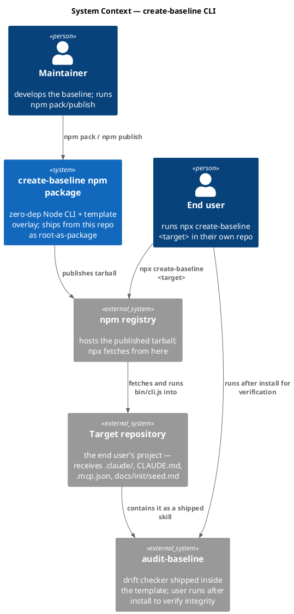
```plantuml
@startuml
!include <C4/C4_Context>
title System Context — create-baseline CLI

Person(maintainer, "Maintainer", "develops the baseline; runs npm pack/publish")
Person(enduser, "End user", "runs npx create-baseline <target> in their own repo")

System(cli, "create-baseline npm package", "zero-dep Node CLI + template overlay; ships from this repo as root-as-package")
System_Ext(npm_registry, "npm registry", "hosts the published tarball; npx fetches from here")
System_Ext(target_repo, "Target repository", "the end user's project — receives .claude/, CLAUDE.md, .mcp.json, docs/init/seed.md")
System_Ext(baseline_audit, "audit-baseline", "drift checker shipped inside the template; user runs after install to verify integrity")

Rel(maintainer, cli, "npm pack / npm publish")
Rel(cli, npm_registry, "publishes tarball")
Rel(enduser, npm_registry, "npx create-baseline <target>")
Rel(npm_registry, target_repo, "fetches and runs bin/cli.js into")
Rel(enduser, baseline_audit, "runs after install for verification")
Rel(target_repo, baseline_audit, "contains it as a shipped skill")
@enduml
```

### C4 — Container

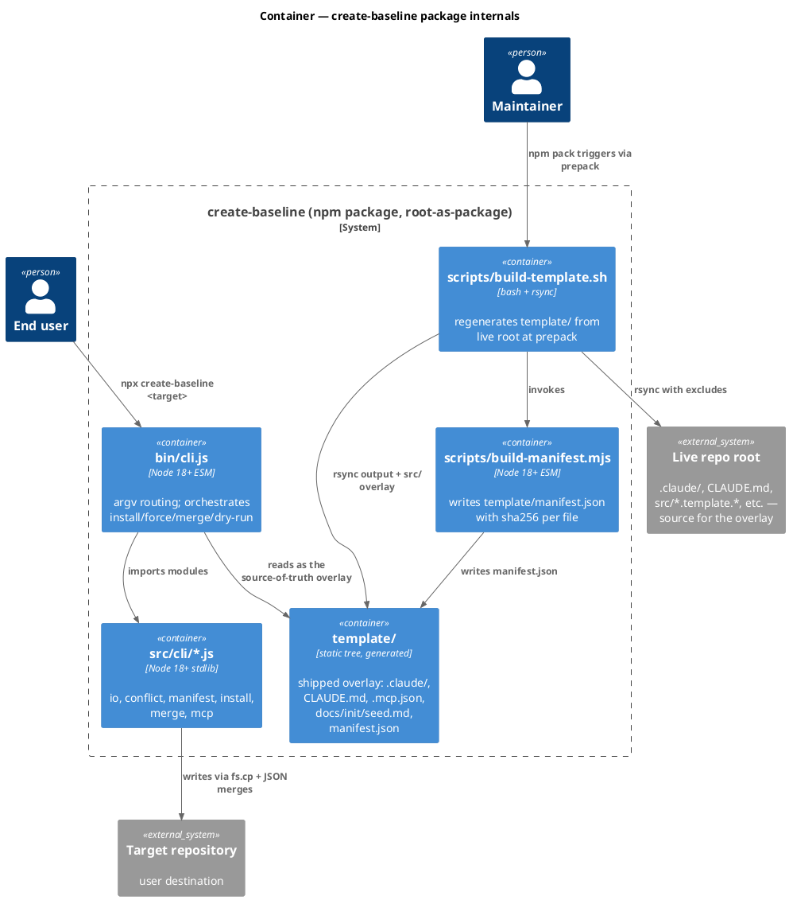
```plantuml
@startuml
!include <C4/C4_Container>
title Container — create-baseline package internals

Person(enduser, "End user")
Person(maintainer, "Maintainer")

System_Boundary(pkg, "create-baseline (npm package, root-as-package)") {
  Container(cli_bin, "bin/cli.js", "Node 18+ ESM", "argv routing; orchestrates install/force/merge/dry-run")
  Container(cli_src, "src/cli/*.js", "Node 18+ stdlib", "io, conflict, manifest, install, merge, mcp")
  Container(template, "template/", "static tree, generated", "shipped overlay: .claude/, CLAUDE.md, .mcp.json, docs/init/seed.md, manifest.json")
  Container(build_sh, "scripts/build-template.sh", "bash + rsync", "regenerates template/ from live root at prepack")
  Container(build_manifest, "scripts/build-manifest.mjs", "Node 18+ ESM", "writes template/manifest.json with sha256 per file")
}

System_Ext(live_root, "Live repo root", ".claude/, CLAUDE.md, src/*.template.*, etc. — source for the overlay")
System_Ext(target_repo, "Target repository", "user destination")

Rel(maintainer, build_sh, "npm pack triggers via prepack")
Rel(build_sh, live_root, "rsync with excludes")
Rel(build_sh, template, "rsync output + src/ overlay")
Rel(build_sh, build_manifest, "invokes")
Rel(build_manifest, template, "writes manifest.json")
Rel(enduser, cli_bin, "npx create-baseline <target>")
Rel(cli_bin, cli_src, "imports modules")
Rel(cli_bin, template, "reads as the source-of-truth overlay")
Rel(cli_src, target_repo, "writes via fs.cp + JSON merges")
@enduml
```

### C4 — Component (changed containers only)

The only container with internals worth diagramming is `bin/cli.js` + `src/cli/*.js`. The build scripts and `template/` are flat.

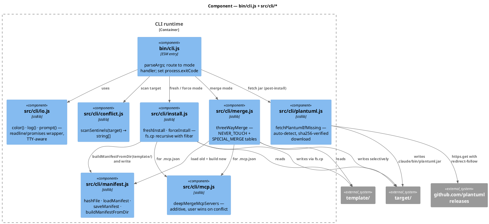
```plantuml
@startuml
!include <C4/C4_Component>
title Component — bin/cli.js + src/cli/*

Container_Boundary(runtime, "CLI runtime") {
  Component(entry, "bin/cli.js", "ESM entry", "parseArgs; route to mode handler; set process.exitCode")
  Component(io, "src/cli/io.js", "stdlib", "color() · log() · prompt() — readline/promises wrapper, TTY-aware")
  Component(conflict, "src/cli/conflict.js", "stdlib", "scanSentinels(target) → string[]")
  Component(manifest, "src/cli/manifest.js", "stdlib", "hashFile · loadManifest · saveManifest · buildManifestFromDir")
  Component(install, "src/cli/install.js", "stdlib", "freshInstall · forceInstall — fs.cp recursive with filter")
  Component(merge, "src/cli/merge.js", "stdlib", "threeWayMerge — NEVER_TOUCH + SPECIAL_MERGE tables")
  Component(mcp, "src/cli/mcp.js", "stdlib", "deepMergeMcpServers — additive, user wins on conflict")
  Component(plantuml, "src/cli/plantuml.js", "stdlib", "fetchPlantumlIfMissing — auto-detect, sha256-verified download")
}

System_Ext(template, "template/")
System_Ext(target, "target/")
System_Ext(github, "github.com/plantuml releases")

Rel(entry, io, "uses")
Rel(entry, conflict, "scan target")
Rel(entry, install, "fresh / force mode")
Rel(entry, merge, "merge mode")
Rel(entry, plantuml, "fetch jar (post-install)")
Rel(install, manifest, "buildManifestFromDir(template/) and write")
Rel(install, mcp, "for .mcp.json")
Rel(merge, manifest, "load old + build new")
Rel(merge, mcp, "for .mcp.json")
Rel(install, template, "reads")
Rel(merge, template, "reads")
Rel(install, target, "writes via fs.cp")
Rel(merge, target, "writes selectively")
Rel(plantuml, github, "https.get with redirect-follow")
Rel(plantuml, target, "writes .claude/bin/plantuml.jar")
@enduml
```

### Data model — class diagram

No persistent database. The data shapes are in-memory contracts between modules and the on-disk JSON manifest. Every entity is `<<new>>` (this is bootstrapping).

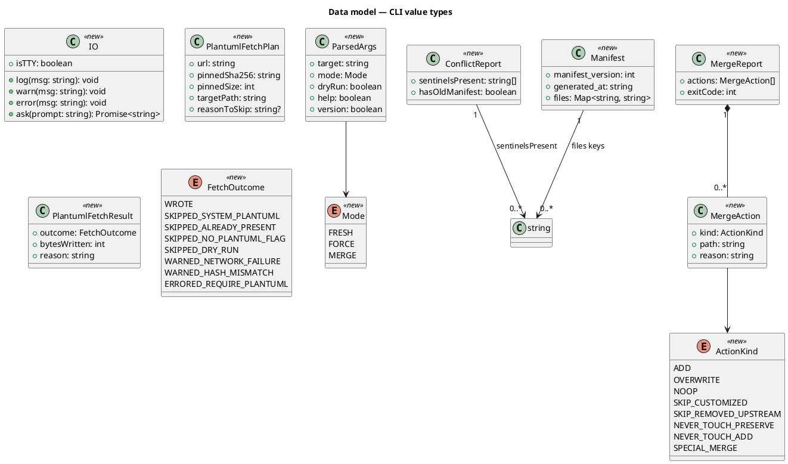
```plantuml
@startuml
title Data model — CLI value types

class ParsedArgs <<new>> {
  +target: string
  +mode: Mode
  +dryRun: boolean
  +help: boolean
  +version: boolean
}

enum Mode <<new>> {
  FRESH
  FORCE
  MERGE
}

class ConflictReport <<new>> {
  +sentinelsPresent: string[]
  +hasOldManifest: boolean
}

class Manifest <<new>> {
  +manifest_version: int
  +generated_at: string
  +files: Map<string, string>
}

class MergeAction <<new>> {
  +kind: ActionKind
  +path: string
  +reason: string
}

enum ActionKind <<new>> {
  ADD
  OVERWRITE
  NOOP
  SKIP_CUSTOMIZED
  SKIP_REMOVED_UPSTREAM
  NEVER_TOUCH_PRESERVE
  NEVER_TOUCH_ADD
  SPECIAL_MERGE
}

class MergeReport <<new>> {
  +actions: MergeAction[]
  +exitCode: int
}

class IO <<new>> {
  +isTTY: boolean
  +log(msg: string): void
  +warn(msg: string): void
  +error(msg: string): void
  +ask(prompt: string): Promise<string>
}

class PlantumlFetchPlan <<new>> {
  +url: string
  +pinnedSha256: string
  +pinnedSize: int
  +targetPath: string
  +reasonToSkip: string?
}

class PlantumlFetchResult <<new>> {
  +outcome: FetchOutcome
  +bytesWritten: int
  +reason: string
}

enum FetchOutcome <<new>> {
  WROTE
  SKIPPED_SYSTEM_PLANTUML
  SKIPPED_ALREADY_PRESENT
  SKIPPED_NO_PLANTUML_FLAG
  SKIPPED_DRY_RUN
  WARNED_NETWORK_FAILURE
  WARNED_HASH_MISMATCH
  ERRORED_REQUIRE_PLANTUML
}

ConflictReport "1" --> "0..*" string : sentinelsPresent
Manifest "1" --> "0..*" string : files keys
MergeReport "1" *-- "0..*" MergeAction
MergeAction --> ActionKind
ParsedArgs --> Mode
@enduml
```

#### Migration DDL

N/A — no persistent database. The manifest is a flat JSON file managed in-process by `src/cli/manifest.js`. Its schema is versioned (`manifest_version: 1`) and frozen for v0.2:

```json
{
  "manifest_version": 1,
  "generated_at": "2026-04-28T12:00:00.000Z",
  "files": {
    ".claude/CLAUDE.md": "<sha256-hex>",
    ".claude/hooks/setup_guard.sh": "<sha256-hex>",
    "...": "..."
  }
}
```

Schema upgrade path: bump `manifest_version` and add a migration in `src/cli/manifest.js#loadManifest` that reads the prior version and returns the new shape. v0.2 ships with `manifest_version: 1` only; no compatibility branches yet.

### Behavior — sequence per AC

One sequence per AC. Each labels the relevant module boundary so the swarm-plan can derive component dependencies.

#### §Behavior #1 — Fresh install on empty target

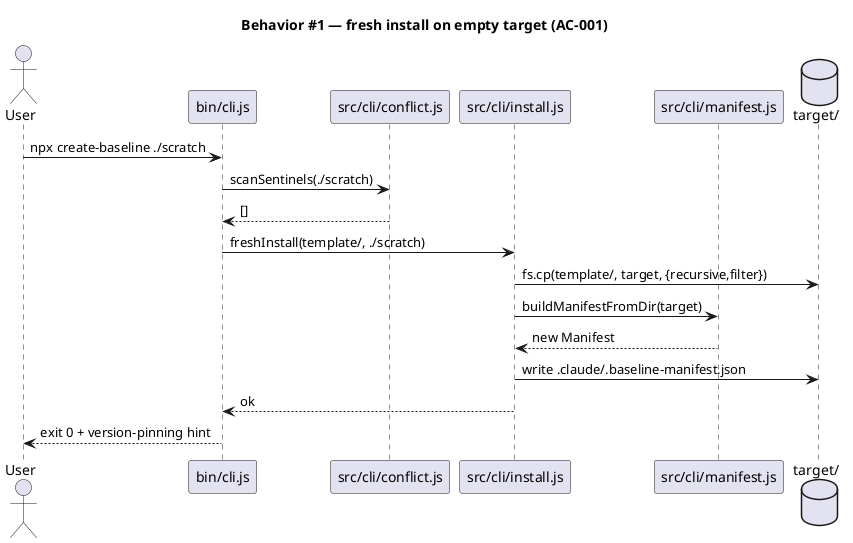
```plantuml
@startuml
title Behavior #1 — fresh install on empty target (AC-001)
actor User
participant "bin/cli.js" as Cli
participant "src/cli/conflict.js" as Conflict
participant "src/cli/install.js" as Install
participant "src/cli/manifest.js" as Manifest
database "target/" as Target

User -> Cli : npx create-baseline ./scratch
Cli -> Conflict : scanSentinels(./scratch)
Conflict --> Cli : []
Cli -> Install : freshInstall(template/, ./scratch)
Install -> Target : fs.cp(template/, target, {recursive,filter})
Install -> Manifest : buildManifestFromDir(target)
Manifest --> Install : new Manifest
Install -> Target : write .claude/.baseline-manifest.json
Install --> Cli : ok
Cli --> User : exit 0 + version-pinning hint
@enduml
```

#### §Behavior #2 — Sentinel conflict, no flags → refuse

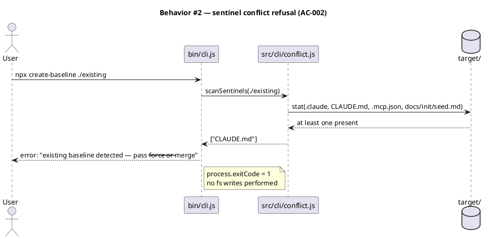
```plantuml
@startuml
title Behavior #2 — sentinel conflict refusal (AC-002)
actor User
participant "bin/cli.js" as Cli
participant "src/cli/conflict.js" as Conflict
database "target/" as Target

User -> Cli : npx create-baseline ./existing
Cli -> Conflict : scanSentinels(./existing)
Conflict -> Target : stat(.claude, CLAUDE.md, .mcp.json, docs/init/seed.md)
Target --> Conflict : at least one present
Conflict --> Cli : ["CLAUDE.md"]
Cli --> User : error: "existing baseline detected — pass --force or --merge"
note right of Cli : process.exitCode = 1\nno fs writes performed
@enduml
```

#### §Behavior #3 — `--force` with confirmation overwrites unconditionally

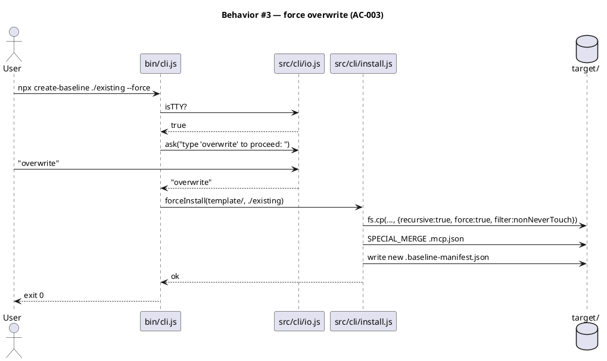
```plantuml
@startuml
title Behavior #3 — force overwrite (AC-003)
actor User
participant "bin/cli.js" as Cli
participant "src/cli/io.js" as IO
participant "src/cli/install.js" as Install
database "target/" as Target

User -> Cli : npx create-baseline ./existing --force
Cli -> IO : isTTY?
IO --> Cli : true
Cli -> IO : ask("type 'overwrite' to proceed: ")
User -> IO : "overwrite"
IO --> Cli : "overwrite"
Cli -> Install : forceInstall(template/, ./existing)
Install -> Target : fs.cp(..., {recursive:true, force:true, filter:nonNeverTouch})
Install -> Target : SPECIAL_MERGE .mcp.json
Install -> Target : write new .baseline-manifest.json
Install --> Cli : ok
Cli --> User : exit 0
@enduml
```

#### §Behavior #4 — `--force` in non-TTY → abort

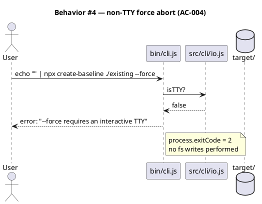
```plantuml
@startuml
title Behavior #4 — non-TTY force abort (AC-004)
actor User
participant "bin/cli.js" as Cli
participant "src/cli/io.js" as IO
database "target/" as Target

User -> Cli : echo "" | npx create-baseline ./existing --force
Cli -> IO : isTTY?
IO --> Cli : false
Cli --> User : error: "--force requires an interactive TTY"
note right of Cli : process.exitCode = 2\nno fs writes performed
@enduml
```

#### §Behavior #5 — `--merge` three-way merge

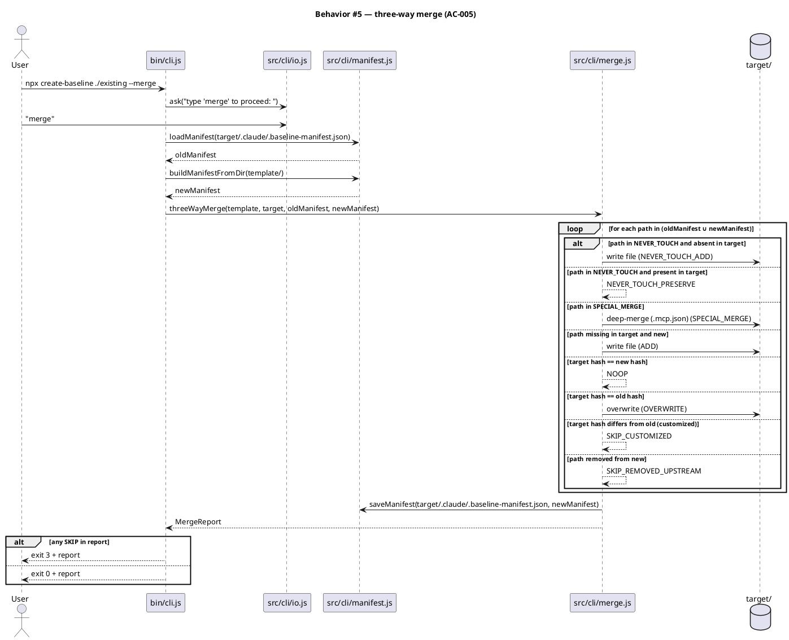
```plantuml
@startuml
title Behavior #5 — three-way merge (AC-005)
actor User
participant "bin/cli.js" as Cli
participant "src/cli/io.js" as IO
participant "src/cli/manifest.js" as Manifest
participant "src/cli/merge.js" as Merge
database "target/" as Target

User -> Cli : npx create-baseline ./existing --merge
Cli -> IO : ask("type 'merge' to proceed: ")
User -> IO : "merge"
Cli -> Manifest : loadManifest(target/.claude/.baseline-manifest.json)
Manifest --> Cli : oldManifest
Cli -> Manifest : buildManifestFromDir(template/)
Manifest --> Cli : newManifest
Cli -> Merge : threeWayMerge(template, target, oldManifest, newManifest)

loop for each path in (oldManifest ∪ newManifest)
  alt path in NEVER_TOUCH and absent in target
    Merge -> Target : write file (NEVER_TOUCH_ADD)
  else path in NEVER_TOUCH and present in target
    Merge --> Merge : NEVER_TOUCH_PRESERVE
  else path in SPECIAL_MERGE
    Merge -> Target : deep-merge (.mcp.json) (SPECIAL_MERGE)
  else path missing in target and new
    Merge -> Target : write file (ADD)
  else target hash == new hash
    Merge --> Merge : NOOP
  else target hash == old hash
    Merge -> Target : overwrite (OVERWRITE)
  else target hash differs from old (customized)
    Merge --> Merge : SKIP_CUSTOMIZED
  else path removed from new
    Merge --> Merge : SKIP_REMOVED_UPSTREAM
  end
end

Merge -> Manifest : saveManifest(target/.claude/.baseline-manifest.json, newManifest)
Merge --> Cli : MergeReport
alt any SKIP in report
  Cli --> User : exit 3 + report
else
  Cli --> User : exit 0 + report
end
@enduml
```

#### §Behavior #6 — `.mcp.json` additive deep-merge

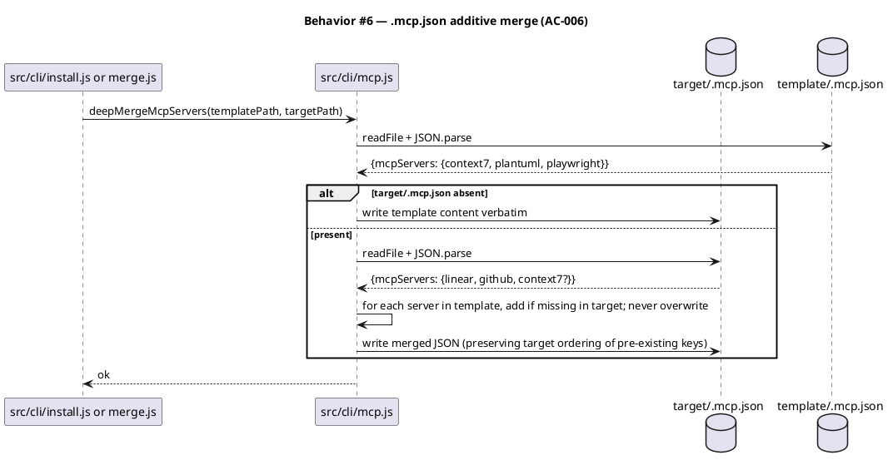
```plantuml
@startuml
title Behavior #6 — .mcp.json additive merge (AC-006)
participant "src/cli/install.js or merge.js" as Caller
participant "src/cli/mcp.js" as McpMerge
database "target/.mcp.json" as TgtMcp
database "template/.mcp.json" as TplMcp

Caller -> McpMerge : deepMergeMcpServers(templatePath, targetPath)
McpMerge -> TplMcp : readFile + JSON.parse
TplMcp --> McpMerge : {mcpServers: {context7, plantuml, playwright}}
alt target/.mcp.json absent
  McpMerge -> TgtMcp : write template content verbatim
else present
  McpMerge -> TgtMcp : readFile + JSON.parse
  TgtMcp --> McpMerge : {mcpServers: {linear, github, context7?}}
  McpMerge -> McpMerge : for each server in template, add if missing in target; never overwrite
  McpMerge -> TgtMcp : write merged JSON (preserving target ordering of pre-existing keys)
end
McpMerge --> Caller : ok
@enduml
```

#### §Behavior #7 — `.claude/project.json` NEVER_TOUCH

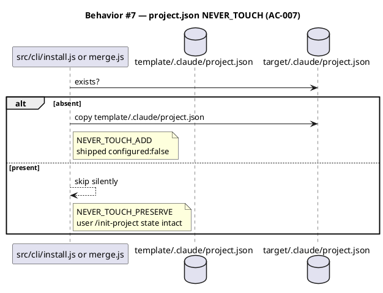
```plantuml
@startuml
title Behavior #7 — project.json NEVER_TOUCH (AC-007)
participant "src/cli/install.js or merge.js" as Caller
database "template/.claude/project.json" as TplPj
database "target/.claude/project.json" as TgtPj

Caller -> TgtPj : exists?
alt absent
  Caller -> TgtPj : copy template/.claude/project.json
  note right of Caller : NEVER_TOUCH_ADD\nshipped configured:false
else present
  Caller --> Caller : skip silently
  note right of Caller : NEVER_TOUCH_PRESERVE\nuser /init-project state intact
end
@enduml
```

#### §Behavior #8 — Manifest write after successful run

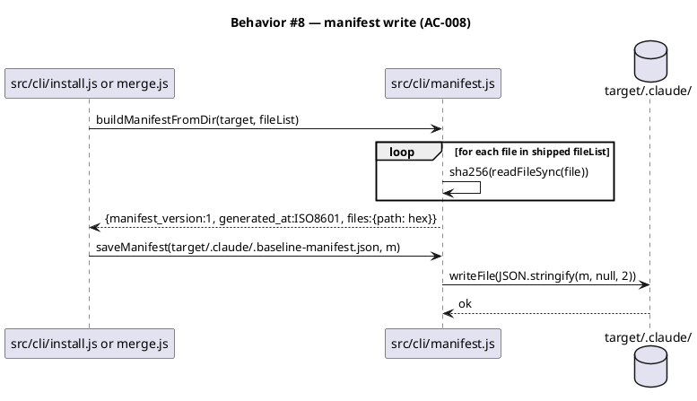
```plantuml
@startuml
title Behavior #8 — manifest write (AC-008)
participant "src/cli/install.js or merge.js" as Caller
participant "src/cli/manifest.js" as Manifest
database "target/.claude/" as TgtClaude

Caller -> Manifest : buildManifestFromDir(target, fileList)
loop for each file in shipped fileList
  Manifest -> Manifest : sha256(readFileSync(file))
end
Manifest --> Caller : {manifest_version:1, generated_at:ISO8601, files:{path: hex}}
Caller -> Manifest : saveManifest(target/.claude/.baseline-manifest.json, m)
Manifest -> TgtClaude : writeFile(JSON.stringify(m, null, 2))
TgtClaude --> Manifest : ok
@enduml
```

#### §Behavior #9 — `npm pack` tarball shape

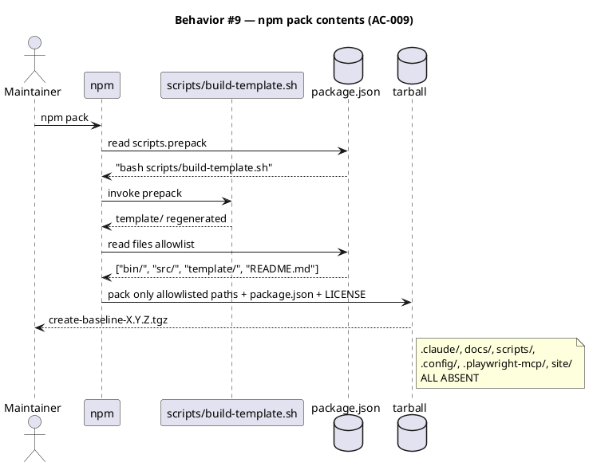
```plantuml
@startuml
title Behavior #9 — npm pack contents (AC-009)
actor Maintainer
participant "npm" as Npm
participant "scripts/build-template.sh" as Build
database "package.json" as Pj
database "tarball" as Tarball

Maintainer -> Npm : npm pack
Npm -> Pj : read scripts.prepack
Pj --> Npm : "bash scripts/build-template.sh"
Npm -> Build : invoke prepack
Build --> Npm : template/ regenerated
Npm -> Pj : read files allowlist
Pj --> Npm : ["bin/", "src/", "template/", "README.md"]
Npm -> Tarball : pack only allowlisted paths + package.json + LICENSE
Tarball --> Maintainer : create-baseline-X.Y.Z.tgz
note right of Tarball : .claude/, docs/, scripts/,\n.config/, .playwright-mcp/, site/\nALL ABSENT
@enduml
```

#### §Behavior #10 — Zero runtime dependencies

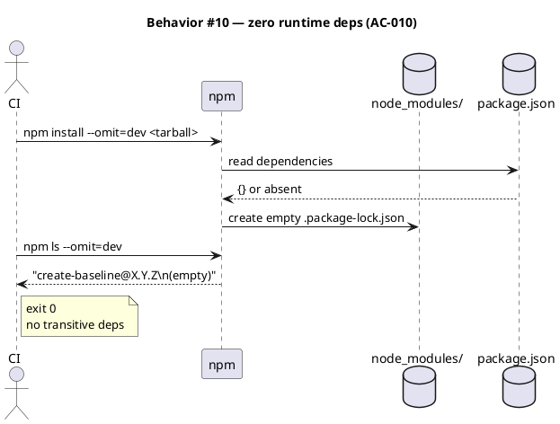
```plantuml
@startuml
title Behavior #10 — zero runtime deps (AC-010)
actor CI
participant "npm" as Npm
database "node_modules/" as Nm
database "package.json" as Pj

CI -> Npm : npm install --omit=dev <tarball>
Npm -> Pj : read dependencies
Pj --> Npm : {} or absent
Npm -> Nm : create empty .package-lock.json
CI -> Npm : npm ls --omit=dev
Npm --> CI : "create-baseline@X.Y.Z\\n(empty)"
note right of CI : exit 0\nno transitive deps
@enduml
```

#### §Behavior #11 — `scripts/build-template.sh` flow

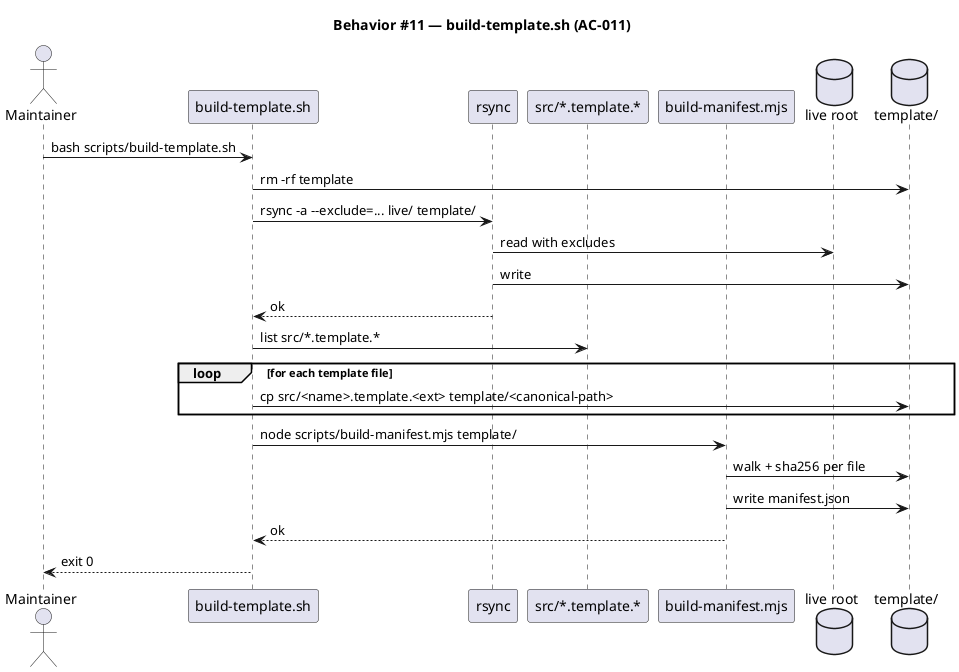
```plantuml
@startuml
title Behavior #11 — build-template.sh (AC-011)
actor Maintainer
participant "build-template.sh" as Sh
participant "rsync" as Rsync
participant "src/*.template.*" as SrcTpl
participant "build-manifest.mjs" as Mfst
database "live root" as Live
database "template/" as Tpl

Maintainer -> Sh : bash scripts/build-template.sh
Sh -> Tpl : rm -rf template
Sh -> Rsync : rsync -a --exclude=... live/ template/
Rsync -> Live : read with excludes
Rsync -> Tpl : write
Rsync --> Sh : ok
Sh -> SrcTpl : list src/*.template.*
loop for each template file
  Sh -> Tpl : cp src/<name>.template.<ext> template/<canonical-path>
end
Sh -> Mfst : node scripts/build-manifest.mjs template/
Mfst -> Tpl : walk + sha256 per file
Mfst -> Tpl : write manifest.json
Mfst --> Sh : ok
Sh --> Maintainer : exit 0
@enduml
```

#### §Behavior #12 — `audit-baseline` against post-build `template/`

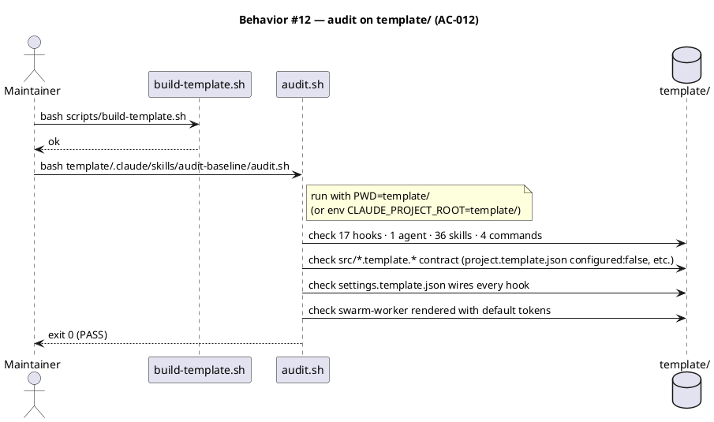
```plantuml
@startuml
title Behavior #12 — audit on template/ (AC-012)
actor Maintainer
participant "build-template.sh" as Build
participant "audit.sh" as Audit
database "template/" as Tpl

Maintainer -> Build : bash scripts/build-template.sh
Build --> Maintainer : ok
Maintainer -> Audit : bash template/.claude/skills/audit-baseline/audit.sh
note right of Audit : run with PWD=template/\n(or env CLAUDE_PROJECT_ROOT=template/)
Audit -> Tpl : check 17 hooks · 1 agent · 36 skills · 4 commands
Audit -> Tpl : check src/*.template.* contract (project.template.json configured:false, etc.)
Audit -> Tpl : check settings.template.json wires every hook
Audit -> Tpl : check swarm-worker rendered with default tokens
Audit --> Maintainer : exit 0 (PASS)
@enduml
```

#### §Behavior #13 — `prepack` regeneration idempotency

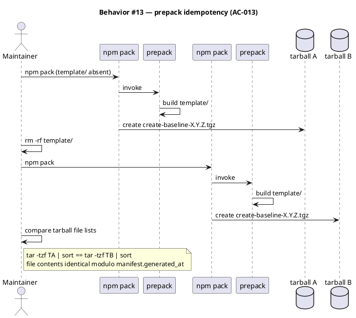
```plantuml
@startuml
title Behavior #13 — prepack idempotency (AC-013)
actor Maintainer
participant "npm pack" as NpmA
participant "prepack" as PpA
participant "npm pack" as NpmB
participant "prepack" as PpB
database "tarball A" as TA
database "tarball B" as TB

Maintainer -> NpmA : npm pack (template/ absent)
NpmA -> PpA : invoke
PpA -> PpA : build template/
NpmA -> TA : create create-baseline-X.Y.Z.tgz
Maintainer -> Maintainer : rm -rf template/
Maintainer -> NpmB : npm pack
NpmB -> PpB : invoke
PpB -> PpB : build template/
NpmB -> TB : create create-baseline-X.Y.Z.tgz
Maintainer -> Maintainer : compare tarball file lists
note right of Maintainer : tar -tzf TA | sort == tar -tzf TB | sort\nfile contents identical modulo manifest.generated_at
@enduml
```

#### §Behavior #15 — Deferred PlantUML jar fetch with sha256 verification

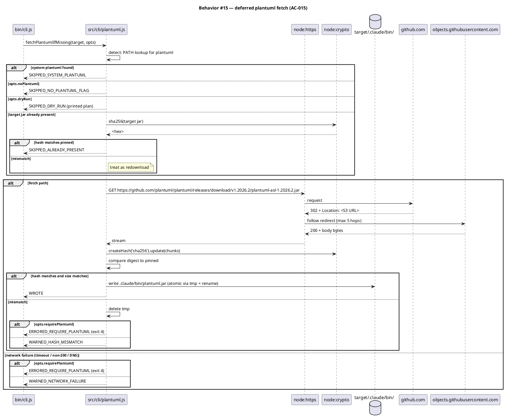
```plantuml
@startuml
title Behavior #15 — deferred plantuml fetch (AC-015)
participant "bin/cli.js" as Cli
participant "src/cli/plantuml.js" as Pf
participant "node:https" as Https
participant "node:crypto" as Crypto
database "target/.claude/bin/" as TgtBin
participant "github.com" as GH
participant "objects.githubusercontent.com" as S3

Cli -> Pf : fetchPlantumlIfMissing(target, opts)
Pf -> Pf : detect: PATH lookup for plantuml
alt system plantuml found
  Pf --> Cli : SKIPPED_SYSTEM_PLANTUML
else opts.noPlantuml
  Pf --> Cli : SKIPPED_NO_PLANTUML_FLAG
else opts.dryRun
  Pf --> Cli : SKIPPED_DRY_RUN (printed plan)
else target jar already present
  Pf -> Crypto : sha256(target jar)
  Crypto --> Pf : <hex>
  alt hash matches pinned
    Pf --> Cli : SKIPPED_ALREADY_PRESENT
  else mismatch
    note right of Pf : treat as redownload
  end
end

alt fetch path
  Pf -> Https : GET https://github.com/plantuml/plantuml/releases/download/v1.2026.2/plantuml-asl-1.2026.2.jar
  Https -> GH : request
  GH --> Https : 302 + Location: <S3 URL>
  Https -> S3 : follow redirect (max 5 hops)
  S3 --> Https : 200 + body bytes
  Https --> Pf : stream
  Pf -> Crypto : createHash('sha256').update(chunks)
  Pf -> Pf : compare digest to pinned
  alt hash matches and size matches
    Pf -> TgtBin : write .claude/bin/plantuml.jar (atomic via tmp + rename)
    Pf --> Cli : WROTE
  else mismatch
    Pf -> Pf : delete tmp
    alt opts.requirePlantuml
      Pf --> Cli : ERRORED_REQUIRE_PLANTUML (exit 4)
    else
      Pf --> Cli : WARNED_HASH_MISMATCH
    end
  end
else network failure (timeout / non-200 / DNS)
  alt opts.requirePlantuml
    Pf --> Cli : ERRORED_REQUIRE_PLANTUML (exit 4)
  else
    Pf --> Cli : WARNED_NETWORK_FAILURE
  end
end
@enduml
```

#### §Behavior #16 — `audit-baseline` against fresh install

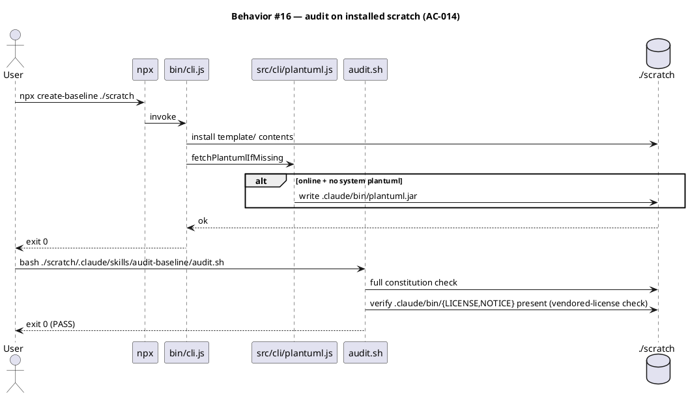
```plantuml
@startuml
title Behavior #16 — audit on installed scratch (AC-014)
actor User
participant "npx" as Npx
participant "bin/cli.js" as Cli
participant "src/cli/plantuml.js" as Pf
participant "audit.sh" as Audit
database "./scratch" as Scratch

User -> Npx : npx create-baseline ./scratch
Npx -> Cli : invoke
Cli -> Scratch : install template/ contents
Cli -> Pf : fetchPlantumlIfMissing
alt online + no system plantuml
  Pf -> Scratch : write .claude/bin/plantuml.jar
end
Scratch --> Cli : ok
Cli --> User : exit 0
User -> Audit : bash ./scratch/.claude/skills/audit-baseline/audit.sh
Audit -> Scratch : full constitution check
Audit -> Scratch : verify .claude/bin/{LICENSE,NOTICE} present (vendored-license check)
Audit --> User : exit 0 (PASS)
@enduml
```

### Dependencies — graph

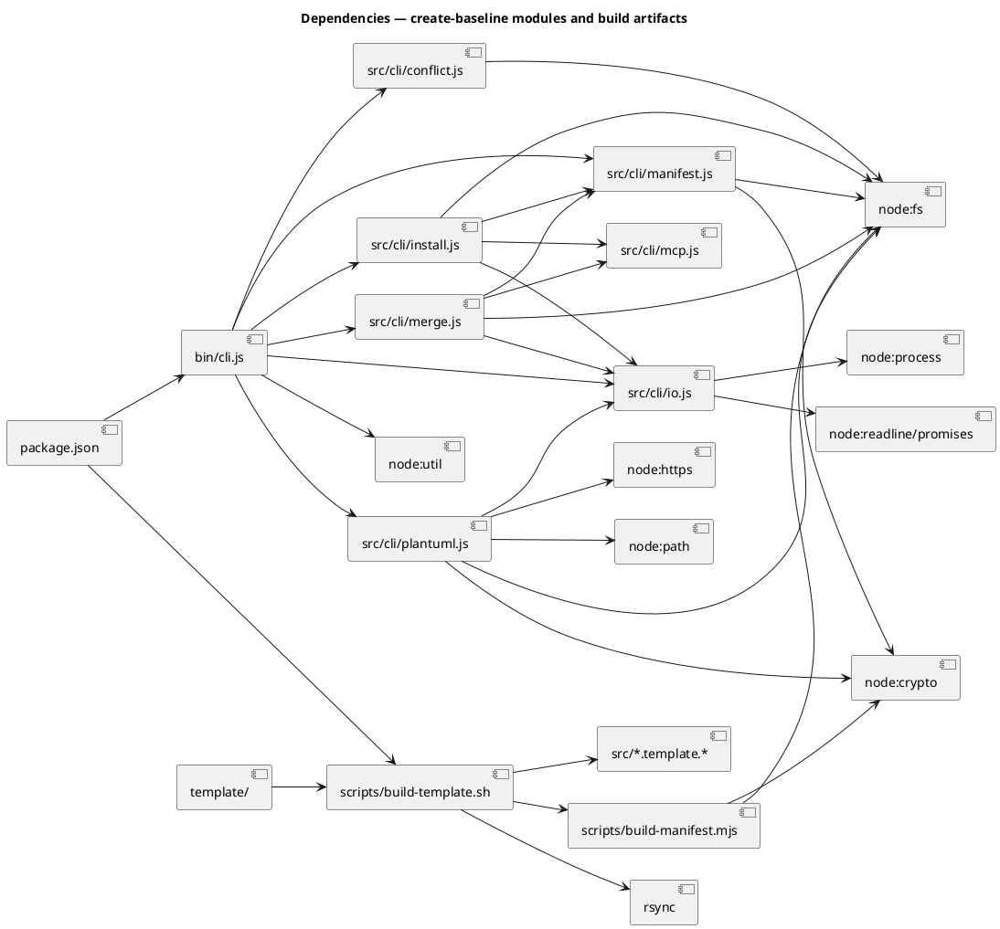
```plantuml
@startuml
' @kind dependency-graph
title Dependencies — create-baseline modules and build artifacts

left to right direction

[bin/cli.js] --> [src/cli/io.js]
[bin/cli.js] --> [src/cli/conflict.js]
[bin/cli.js] --> [src/cli/install.js]
[bin/cli.js] --> [src/cli/merge.js]
[bin/cli.js] --> [src/cli/manifest.js]

[src/cli/install.js] --> [src/cli/manifest.js]
[src/cli/install.js] --> [src/cli/mcp.js]
[src/cli/install.js] --> [src/cli/io.js]

[src/cli/merge.js] --> [src/cli/manifest.js]
[src/cli/merge.js] --> [src/cli/mcp.js]
[src/cli/merge.js] --> [src/cli/io.js]

[src/cli/conflict.js] --> [node:fs]
[src/cli/manifest.js] --> [node:crypto]
[src/cli/manifest.js] --> [node:fs]
[src/cli/install.js] --> [node:fs]
[src/cli/merge.js] --> [node:fs]
[src/cli/io.js] --> [node:readline/promises]
[src/cli/io.js] --> [node:process]
[bin/cli.js] --> [node:util]
[bin/cli.js] --> [src/cli/plantuml.js]
[src/cli/plantuml.js] --> [node:https]
[src/cli/plantuml.js] --> [node:crypto]
[src/cli/plantuml.js] --> [node:fs]
[src/cli/plantuml.js] --> [node:path]
[src/cli/plantuml.js] --> [src/cli/io.js]

[scripts/build-template.sh] --> [rsync]
[scripts/build-template.sh] --> [src/*.template.*]
[scripts/build-template.sh] --> [scripts/build-manifest.mjs]
[scripts/build-manifest.mjs] --> [node:crypto]
[scripts/build-manifest.mjs] --> [node:fs]

[package.json] --> [bin/cli.js]
[package.json] --> [scripts/build-template.sh]
[template/] --> [scripts/build-template.sh]
@enduml
```

### Write sets per component (for swarm-plan compatibility)

The swarm scheduler requires pairwise-disjoint write sets per wave. The components below are the unit of swarm work; `/swarm-plan` MAY group dependent ones into the same wave but never assigns the same path to two components in one wave.

| Component | Write set | Depends on |
|---|---|---|
| **C1 — package.json** | `package.json`, `.gitignore` | — |
| **C2 — IO module** | `src/cli/io.js` | — |
| **C3 — Conflict scan** | `src/cli/conflict.js` | — |
| **C4 — Manifest module** | `src/cli/manifest.js` | — |
| **C5 — MCP merge** | `src/cli/mcp.js` | — |
| **C6 — Install module** | `src/cli/install.js` | C2, C4, C5 |
| **C7 — Merge module** | `src/cli/merge.js` | C2, C4, C5 |
| **C8 — CLI entry** | `bin/cli.js` | C2, C3, C6, C7, C11 |
| **C9 — Build script** | `scripts/build-template.sh`, `scripts/build-manifest.mjs` | — |
| **C10 — README split** | `README.md` (trim), `DESIGN.md` (extend) | — |
| **C11 — PlantUML fetcher** | `src/cli/plantuml.js` | C2 |
| **C12 — Vendored license files** | `.claude/bin/LICENSE`, `.claude/bin/NOTICE` | — |
| **C13 — Audit-baseline extension** | `.claude/skills/audit-baseline/audit.sh` | — |

Wave plan target: {C1, C2, C3, C4, C5, C9, C10, C12, C13} → {C6, C7, C11} → {C8}. `/swarm-plan` derives the actual waves from this table.

### Contracts

| Kind | Name | Input | Output | Errors | Idempotent |
|---|---|---|---|---|---|
| CLI | `npx create-baseline <target>` | positional `target` (path), no flags | exit 0 + new tree + manifest | exit 1 if sentinel present, exit 2 if argv invalid | yes (idempotent on empty target) |
| CLI | `npx create-baseline <target> --force` | positional `target`, interactive prompt confirms `overwrite` | exit 0 | exit 2 if non-TTY, exit 1 if user declines, exit 2 if argv invalid | yes (overwrites unconditionally) |
| CLI | `npx create-baseline <target> --merge` | positional `target`, interactive prompt confirms `merge` | exit 0 (clean) or exit 3 (skips reported) | exit 2 if non-TTY, exit 1 if user declines, exit 2 if argv invalid | yes (deterministic given hashes) |
| CLI | `npx create-baseline <target> --dry-run` | combinable with any mode | prints intended actions; exit 0 (informational) | exit 2 if argv invalid | yes (no writes) |
| CLI | `npx create-baseline <target> --no-plantuml` | combinable with any mode | skip jar fetch entirely; no warning | exit 2 if argv invalid | yes |
| CLI | `npx create-baseline <target> --require-plantuml` | combinable with any mode | network/hash failure → exit 4 | exit 4 on jar fetch failure; exit 2 if argv invalid; mutually exclusive with `--no-plantuml` | yes (deterministic) |
| CLI | `npx create-baseline --help` / `--version` | — | help text / version string | — | yes |
| File | `<target>/.claude/.baseline-manifest.json` | — | JSON `{manifest_version:1, generated_at, files{path:sha256}}` | — | yes (deterministic given input fileset) |
| File | `<target>/.claude/bin/plantuml.jar` | — | 19,395,808-byte Apache-licensed jar from upstream pinned URL | sha256 mismatch → not written | yes (fetched only if missing or hash-mismatched) |
| File | `<target>/.claude/bin/LICENSE` | — | Apache 2.0 text (~11 KB) | — | yes |
| File | `<target>/.claude/bin/NOTICE` | — | attribution + URL + pinned sha256 + deferred-fetch framing (~1 KB) | — | yes |
| Script | `bash scripts/build-template.sh` | live root layout | `template/` dir + `template/manifest.json` | exits non-zero if rsync/cp/manifest fails | yes (full rebuild each run) |
| Lifecycle | `prepack` (in `package.json`) | — | invokes `build-template.sh` before tarball | propagates non-zero exit | yes |

### Libraries and versions

Every entry confirmed via `context7` MCP per Article VI.5 (recorded in `docs/research/create-baseline-cli.md`).

| Library@version | Purpose | Key APIs | Confirmed via context7 |
|---|---|---|---|
| `node@>=18.17.0` (verified against v20 LTS docs) | runtime | `node:util` `parseArgs({ args, options, strict, allowPositionals })` | yes — `/websites/nodejs_latest-v20_x` |
| `node@>=18.17.0` | prompts | `node:readline/promises` `createInterface({input,output})`, `rl.question(prompt)`, `rl.close()` | yes — same |
| `node@>=18.17.0` | TTY check | `node:process` `process.stdin.isTTY` | yes — same |
| `node@>=18.17.0` | filesystem copy | `node:fs/promises` `cp(src, dest, {recursive, force, filter, errorOnExist})` | yes — same |
| `node@>=18.17.0` | hashing | `node:crypto` `createHash('sha256').update(buf).digest('hex')` | yes — same |
| `node@>=18.17.0` | jar download | `node:https` `https.get(url, cb)`, `res.on('data')`, manual 302 Location-header follow (max 5 hops) | yes — same |
| `node@>=18.17.0` | path joining | `node:path` `path.join`, `path.resolve` | yes — same |
| `node@>=20.0.0` (optional) | tests | `node:test` `describe`/`it`/`test`, `--test-reporter spec\|tap`, exit code 1 on any failure | yes — same |
| `npm@>=8` (publish-time only) | packaging | `package.json` `bin`, `files`, `engines`, `scripts.prepack` | yes — `/websites/npmjs` |
| `rsync` (POSIX, build-time only) | overlay copy | `-a --exclude=...` | not on context7 — POSIX standard |
| `plantuml-asl@1.2026.2` (deferred fetch, end-user runtime only) | diagram rendering for hooks/render | `java -jar plantuml.jar -checkonly -pipe` | upstream artifact; sha256 pinned at `c348f6a26d999f81fd05b5d49834bb70df9cf35fab0939c4edecb0909e64022b`, 19,395,808 bytes, Apache 2.0 |

### Alternatives considered

| Alt | Summary | Rejected because |
|---|---|---|
| Candidate B — phased ship (fresh + force only on day one; `--merge` later) | Smaller first ship (~300 LOC), faster review | Splits the spec across two slugs without a deadline forcing the split; merge logic is the riskiest piece and shipping it later doesn't make it easier — it just delays the test signal |
| Candidate C — pure-Node build (drop bash; replace `rsync` with `fs.cp` filter) | Removes rsync dep, Windows-friendly | Diverges from the existing five-script bash convention (`validate.sh`, `swarm_merge.sh`, `render.sh`, `lint.sh`, `archive.sh`); Windows portability is YAGNI today |
| `commander` / `yargs` for argv | Familiar UX | Violates zero-runtime-dep constraint; `node:util` `parseArgs` is sufficient |
| `chalk` / `picocolors` for colors | Pretty terminals | Same; ANSI escapes are 4 lines of vanilla JS |
| `@clack/prompts` for interactive UX | Polished spinners + framed output, native cancel handling, idiomatic for `create-*` scaffolders | (a) prompt surface is two text inputs with deliberate friction-by-design — clack's `confirm()` arrow-key UX would actively undermine the safety design; (b) breaks the zero-runtime-dep value prop permanently and sets a precedent ("but it's so small" applies equally to chalk/ora next); (c) revisitable in v0.3 if the prompt surface grows past 5+ interactive steps |
| `vitest` for tests | Better DX, snapshot support | Adds 60+ MB devDependency surface for features this CLI doesn't need; `node:test` covers all needs |
| Bundle the PlantUML jar in the npm tarball | Offline install, no network at install time | 19 MB to every download; the jar is already publicly hosted by upstream — we'd be re-shipping bytes for which the upstream URL is the canonical source; deferred-fetch with sha256 pin + soft-fail keeps tarball at ~250 KB and gives stronger provenance |

## Acceptance criteria

| ID | Criterion (given / when / then) | Upstream AC | Sequence |
|---|---|---|---|
| AC-001 | Given an empty target directory, when the user runs `npx create-baseline <target>`, the CLI exits 0 and writes the full baseline tree (`.claude/`, `CLAUDE.md`, `.mcp.json`, `docs/init/seed.md`) plus `.claude/.baseline-manifest.json` | intake AC 1 | §Behavior #1 |
| AC-002 | Given a target containing any of the four sentinel paths, when the user runs `npx create-baseline <target>` without `--force` or `--merge`, the CLI exits 1 and writes nothing | intake AC 2 | §Behavior #2 |
| AC-003 | Given a conflict scenario, when the user runs with `--force` and types `overwrite` (case-insensitive) at the prompt, the CLI overwrites every non-NEVER_TOUCH path and exits 0 | intake AC 3 | §Behavior #3 |
| AC-004 | Given AC-003 in a non-TTY context, when the prompt cannot read a confirmation, the CLI exits 2 without writing | intake AC 4 | §Behavior #4 |
| AC-005 | Given a target with an existing `.baseline-manifest.json`, when the user runs `--merge` and types `merge`, the CLI performs three-way merge per the action table; exit 3 if any SKIP_CUSTOMIZED in report, else 0 | intake AC 5 | §Behavior #5 |
| AC-006 | Given any mode, when `.mcp.json` is written, the CLI performs additive `mcpServers` deep-merge: keys absent in target are added; keys present are preserved verbatim; no key deleted | intake AC 6 | §Behavior #6 |
| AC-007 | Given any mode, when target has no `.claude/project.json`, the CLI writes the canonical template; when present, the CLI leaves it untouched silently | intake AC 7 | §Behavior #7 |
| AC-008 | Given a successful run (exit 0 or 3), when the run completes, the target's `.claude/.baseline-manifest.json` contains `{manifest_version:1, generated_at:ISO8601, files:{<rel-path>:<sha256-hex>}}` for every shipped file | intake AC 8 | §Behavior #8 |
| AC-009 | Given a clean checkout, when `npm pack` runs, the resulting tarball contains exactly `bin/`, `src/`, `template/` (which itself contains `template/.claude/bin/{LICENSE,NOTICE}` but **not** `plantuml.jar`), `README.md`, `package.json`, and `LICENSE` (root, when present); `.claude/` (live), `docs/` (other than what's inside `template/`), `scripts/`, `site/`, `.config/`, `.playwright-mcp/`, `node_modules/`, and any `*.jar` all absent | intake AC 9 (amended) | §Behavior #9 |
| AC-010 | Given the package as published, when `npm ls --omit=dev` runs inside an installed copy, the dependency tree contains zero runtime dependencies | intake AC 10 | §Behavior #10 |
| AC-011 | Given the live root, when `bash scripts/build-template.sh` runs, it executes (a) full rsync with documented exclude list (which **explicitly excludes `.claude/bin/plantuml.jar`** but includes `.claude/bin/LICENSE` and `.claude/bin/NOTICE`), (b) `src/*.template.*` overlay onto canonical destinations, (c) `build-manifest.mjs` to write `template/manifest.json` reflecting the post-overlay state | intake AC 11 (amended) | §Behavior #11 |
| AC-012 | Given the post-build `template/`, when `audit-baseline` is run rooted at `template/`, all baseline invariants pass (17 hooks, 1 agent, 36 skills, 4 commands; src/ overlay contract; settings wiring; swarm-worker rendered; vendored-license check now extended to require `.claude/bin/{LICENSE,NOTICE}`) | intake AC 12 (amended) | §Behavior #12 |
| AC-013 | Given the build script as the source of `template/`, when `template/` is removed and `npm pack` is rerun, the tarball file list and content hashes (excluding `manifest.json` `generated_at`) are identical to the previous tarball | intake AC 13 | §Behavior #13 |
| AC-014 | Given a fresh install via `npx create-baseline ./scratch` with network available and no system `plantuml`, when `audit-baseline` is run inside `./scratch`, all baseline invariants pass and `.claude/bin/plantuml.jar` is present with the pinned sha256 | intake AC 14 (amended) | §Behavior #16 |
| AC-015 | Given no system `plantuml` on PATH and a missing `<target>/.claude/bin/plantuml.jar`, when the CLI runs in any mode (without `--no-plantuml`), it fetches `https://github.com/plantuml/plantuml/releases/download/v1.2026.2/plantuml-asl-1.2026.2.jar` (following up to 5 Location redirects), verifies sha256 against the pinned `c348f6a26d999f81fd05b5d49834bb70df9cf35fab0939c4edecb0909e64022b` and size 19,395,808 bytes, and writes the jar atomically to `<target>/.claude/bin/plantuml.jar`. On any failure (network/non-200/hash mismatch/size mismatch) it emits a single warning naming the upstream URL, leaves no partial file on disk, and continues; if `--require-plantuml` is set, the same failures exit 4 instead | new (deferred-fetch resolution) | §Behavior #15 |
| AC-016 | Given any one of: system `plantuml` on PATH **OR** `--no-plantuml` flag set **OR** `<target>/.claude/bin/plantuml.jar` already present with matching pinned sha256 **OR** `--dry-run` flag set, when the CLI runs, no network call to github.com occurs, no warning is emitted (`--dry-run` prints the plan), and the FetchOutcome is one of `SKIPPED_SYSTEM_PLANTUML` / `SKIPPED_NO_PLANTUML_FLAG` / `SKIPPED_ALREADY_PRESENT` / `SKIPPED_DRY_RUN` respectively — covered by the skip-branch alts in the same diagram as AC-015 | new (opt-out resolution) | §Behavior #15 |

## Test plan

The `scenario` skill turns these rows into failing tests. Every row references an AC or names the invariant it defends. Test framework: `node:test`. Test files live under `tests/*.test.mjs`; fixtures under `tests/fixtures/`.

| Category | Scenario | Expected | Covers |
|---|---|---|---|
| Golden path | `npx create-baseline ./tmpA` on empty dir | exit 0; all sentinel paths exist; `.baseline-manifest.json` present with valid sha256 per file | AC-001, AC-008 |
| Golden path | `--force` on conflicted dir with TTY + correct word | exit 0; tree replaced | AC-003 |
| Golden path | `--merge` on conflicted dir with TTY + correct word, no customizations | exit 0; tree updated; manifest refreshed | AC-005 |
| Golden path | `--dry-run --merge` on conflicted dir | exit 0; printed action list; **no fs writes** | new (intake OQ resolution) |
| Input boundary | `target` is `.` (current dir) | resolved to `process.cwd()`; otherwise normal | AC-001 |
| Input boundary | `target` already exists as a file | exit 2 with clear error | AC-001 (edge) |
| Input boundary | empty `mcpServers` in target — additive merge | template servers added; structure preserved | AC-006 |
| Input boundary | target has only one of four sentinel paths (e.g., only `.mcp.json`) | exit 1 — refused | AC-002 |
| Input boundary | confirmation word with mixed case (`Overwrite`, `MERGE`) | accepted (case-insensitive) | AC-003, AC-005 |
| Contract violation | unknown flag `--foo` | `parseArgs` strict throws `ERR_PARSE_ARGS_UNKNOWN_OPTION`; exit 2 | new (argv hygiene) |
| Contract violation | `--force` and `--merge` both passed | exit 2 with clear error | new (argv hygiene) |
| Contract violation | non-TTY `--force` (`echo "" \| node bin/cli.js ./x --force`) | exit 2 | AC-004 |
| Contract violation | non-TTY `--merge` | exit 2 | AC-004 (analog) |
| Contract violation | confirmation word incorrect (`yes`) at force prompt | exit 1 (user abort) | AC-003 |
| Three-way merge | target file unchanged since old manifest, new content differs | OVERWRITE; file replaced | AC-005 |
| Three-way merge | target file customized (hash differs from old) | SKIP_CUSTOMIZED; file unchanged; exit 3 | AC-005 |
| Three-way merge | new file present in new manifest only | ADD; file written | AC-005 |
| Three-way merge | file removed in new manifest, present in target unchanged | SKIP_REMOVED_UPSTREAM; file unchanged; exit 3 | AC-005 |
| Three-way merge | first-time merge (no old manifest in target) | every existing file SKIP_CUSTOMIZED; new files ADD; emit "use --force for clean reset" hint | new (UX safety, design doc §70) |
| NEVER_TOUCH | target has `.claude/project.json` (configured: true) before `--force` | preserved verbatim post-run | AC-007 |
| NEVER_TOUCH | target lacks `.claude/project.json` before `--force` | written from template (configured: false) | AC-007 |
| SPECIAL_MERGE | target `.mcp.json` has user-added `linear` server | post-run still has `linear` plus the three baseline servers | AC-006 |
| SPECIAL_MERGE | target `.mcp.json` overrides `context7` env vars | user override preserved verbatim | AC-006 |
| Manifest | hash determinism — run build twice on identical input | every `files[path]` hash identical | AC-008, AC-013 |
| Manifest | `generated_at` is valid ISO8601 with millisecond precision | `new Date(m.generated_at).toISOString() === m.generated_at` | AC-008 |
| Build script | rsync exclude list — `.claude/state/`, `.claude/settings.local.json`, `src/`, `docs/<phase>/` (except `docs/init/seed.md`), `node_modules/`, `.playwright-mcp/`, `.config/`, `site/`, `template/` itself absent in template/ | AC-011 |
| Build script | overlay step — `template/CLAUDE.md` byte-equals `src/CLAUDE.template.md`, etc. for all six template files | AC-011 |
| Build script | manifest reflects post-overlay state (template hashes, not live root) | hash of `template/CLAUDE.md` == hash of `src/CLAUDE.template.md` | AC-011 |
| Audit | `audit.sh` rooted at `template/` post-build | exit 0 (PASS) | AC-012 |
| Audit | `audit.sh` rooted at fresh install (`npx create-baseline ./scratch && cd ./scratch`) | exit 0 (PASS) | AC-014 |
| Tarball | `tar -tzf create-baseline-*.tgz \| sort` matches expected file list | identical | AC-009 |
| Tarball | `package.json` `dependencies` empty/absent in published tarball | confirmed via `tar -xzf … package.json && jq` | AC-010 |
| Tarball | repacked-from-clean idempotency — `rm -rf template && npm pack` twice produces same content hashes | identical (modulo `generated_at`) | AC-013 |
| Concurrency / ordering | two simultaneous `npx create-baseline ./tmp` invocations | undefined behavior — document as not-supported in README | regression trap |
| Failure mode | rsync fails mid-build (simulated by inducing read error on a fixture file) | exit non-zero from `build-template.sh`; `template/` left in partial state with clear error | AC-011 (defensive) |
| Failure mode | target dir not writable | clear error mentioning permissions; exit non-zero | new (UX) |
| Regression trap | `seed.md` § Generated stamp must NOT appear in shipped `template/docs/init/seed.md` | grep returns no match | AC-012 (audit invariant) |
| Regression trap | shipped `template/.claude/project.json` has `configured: false` | invariant from src/project.template.json | AC-012 (audit invariant) |
| Regression trap | shipped `template/.claude/agents/swarm-worker.md` is rendered (no `{{NAME}}` etc.) | grep returns no match for `{{` | new (intake OQ resolution) |
| PlantUML fetch — golden | offline-detect (mock `which plantuml` returns `/usr/local/bin/plantuml`) | no network call; FetchOutcome = SKIPPED_SYSTEM_PLANTUML | AC-016 |
| PlantUML fetch — happy | mock https.get returns 200 with fixture jar bytes matching pinned sha256 | jar written; FetchOutcome = WROTE | AC-015 |
| PlantUML fetch — redirect | mock https.get returns 302 → 302 → 200 (3-hop redirect) with valid bytes | jar written after following Location; FetchOutcome = WROTE | AC-015 |
| PlantUML fetch — redirect loop | mock https.get returns 302 forever | abort after 5 hops; FetchOutcome = WARNED_NETWORK_FAILURE; no partial file | AC-015 |
| PlantUML fetch — non-200 | mock https.get returns 503 | FetchOutcome = WARNED_NETWORK_FAILURE; warning emitted; install continues | AC-015 |
| PlantUML fetch — DNS / connection error | mock https.get raises ECONNREFUSED | FetchOutcome = WARNED_NETWORK_FAILURE; install continues | AC-015 |
| PlantUML fetch — sha256 mismatch | mock https.get returns 200 with corrupted bytes | FetchOutcome = WARNED_HASH_MISMATCH; tmp file deleted; no partial jar on disk | AC-015 |
| PlantUML fetch — size mismatch | mock https.get returns 200 with valid hash but wrong byte count (impossible in practice; defensive) | FetchOutcome = WARNED_HASH_MISMATCH; treated as integrity failure | AC-015 |
| PlantUML fetch — `--require-plantuml` + network failure | mock https.get returns 503; flag set | exit code 4; CLI fails | AC-015 |
| PlantUML fetch — `--require-plantuml` + sha256 mismatch | mock https.get returns 200 with corrupted bytes; flag set | exit code 4 | AC-015 |
| PlantUML fetch — `--no-plantuml` flag | flag set; no system plantuml | no network call; FetchOutcome = SKIPPED_NO_PLANTUML_FLAG | AC-016 |
| PlantUML fetch — already present | target has `.claude/bin/plantuml.jar` with pinned sha256 | no network call; FetchOutcome = SKIPPED_ALREADY_PRESENT | AC-016 |
| PlantUML fetch — already present but corrupted | target has jar with wrong sha256 | redownload; FetchOutcome = WROTE (or WARNED on second-stage failure) | AC-015 |
| PlantUML fetch — `--dry-run` | dry-run flag set; no system plantuml | no network call; plan printed; FetchOutcome = SKIPPED_DRY_RUN | AC-016 |
| PlantUML fetch — mutually exclusive flags | `--no-plantuml --require-plantuml` together | exit 2 with clear error | new (argv hygiene) |
| Vendored licenses | `.claude/bin/LICENSE` matches canonical Apache 2.0 text | exact match against bundled fixture | AC-012 |
| Vendored licenses | `.claude/bin/NOTICE` includes upstream URL, version `1.2026.2`, pinned sha256, deferred-fetch framing | grep all four substrings | AC-012 |
| Audit-baseline extension | `bash audit.sh` against a tree missing `.claude/bin/LICENSE` | exit 1 with vendored-license failure | AC-012 |

## Observability

The CLI is a one-shot command, not a long-running service. There are no metrics or alarms. The signals that matter are the exit code and the stdout/stderr report.

| Signal | Name | Shape | Purpose |
|---|---|---|---|
| Log | install summary | stdout: `Installed manifest version 1 to <target> · <N> files` | confirmation + version-pinning hint (intake OQ #5 resolution) |
| Log | merge report | stdout: per-action lines (`ADD`, `OVERWRITE`, `SKIP`, `NOOP`) plus a count summary | merge-mode visibility and CI scraping |
| Log | error | stderr: prefix `Error: ` + message | failure surfacing |
| Log | plantuml fetch warning | stderr: `Warning: PlantUML jar fetch failed (<reason>); install continued. Run later with --require-plantuml to retry, or set system plantuml on PATH.` | soft-fail visibility |
| Log | plantuml fetch dry-run plan | stdout: `Would fetch <URL> (sha256 c348… 19,395,808 bytes) → <target>/.claude/bin/plantuml.jar` | dry-run transparency |
| Exit code | 0 | clean run | success |
| Exit code | 1 | user abort or no-flags-but-conflict | refusal |
| Exit code | 2 | argv error or non-TTY where TTY required or mutually exclusive flags | usage error |
| Exit code | 3 | merge had skipped customizations (`SKIP_*`) | CI signal that merge was partial |
| Exit code | 4 | `--require-plantuml` set and jar fetch failed (network or sha256) | CI signal that integrity-mandated fetch failed |

## Rollout

This is a new package; no production rollout in the traditional sense. The phased deploy steps:

- **Step 1 — local pack & smoke test.** `npm pack` in this repo; `npx --yes ./create-baseline-*.tgz /tmp/scratch`; `bash /tmp/scratch/.claude/skills/audit-baseline/audit.sh` exits 0. (AC-014.)
- **Step 2 — internal dogfood.** Maintainer installs into a known-empty target and exercises `--force` + `--merge` paths against fixture customizations.
- **Step 3 — npm publish at version `0.1.0`** under unscoped name `create-baseline`. 2FA on the publishing account is mandatory (out-of-spec but called out in intake OQ #8 resolution; surface in `/document`).
- **Step 4 — README install instructions go live.** Update root `README.md` (or its trimmed npm-tarball variant per intake OQ #1 resolution: trim to install + quickstart, migrate deep architecture to `DESIGN.md`).
- **Step 5 — seed.md §16 follow-up #1 marked resolved** ("Bootstrap `package.json` for the planned `npx create-baseline` CLI").
- **Step 6 — vendored-license artifacts on disk.** `.claude/bin/{LICENSE,NOTICE}` land as part of the implementation phase (component C12); `audit-baseline` is extended in C13 to require both. NOTICE explicitly names the deferred-fetch model with the pinned sha256 in-file, so a future PlantUML version bump must update both the constant in `src/cli/plantuml.js` and the NOTICE in lockstep.
- **Migration order**: not applicable — no existing users, no DB, no parallel system.
- **Canary**: not applicable — npm publish is binary; users opt in by running `npx`. The first published version is implicitly its own canary.
- **Feature flag**: not applicable — the CLI is the feature.

## Rollback

- **Kill-switch**: `npm deprecate create-baseline@0.1.0 "<reason — point users at the previous-good version or 'broken; do not use'>"`. The deprecation message is shown to anyone running `npx` against that version, prompting them to upgrade or pin lower. Available immediately, no republish needed.
- **Hard revert** (within 72-hour grace window): `npm unpublish create-baseline@0.1.0` removes the version; users on it must reinstall. Not available after 72 hours per npm policy.
- **Forward-fix**: publish `0.1.1` reverting the broken behavior, then deprecate `0.1.0`.
- **Signal to roll back**: any of the following observed in the first 7 days post-publish:
  - A user-filed issue showing `audit-baseline` failing on a fresh install. Threshold: **1 confirmed report** (this is structural correctness, not a percentage SLO).
  - `npm audit` flags a CVE in any transitive dep (none expected — package has zero deps — but a `node:` API CVE could matter).
  - A reproducible data-loss scenario in `--force` or `--merge` (e.g., `.claude/project.json` accidentally overwritten despite NEVER_TOUCH).
- A successful fetch that writes corrupted bytes (sha256 collision is impossible at this scale; the realistic concern is a logic bug that bypasses the verify path). Threshold: **1 confirmed report**.
- The pinned PlantUML release URL becoming a 404 (upstream removes old releases). Threshold: **1 confirmed report** + manual verification. Mitigation is a forward-fix to `src/cli/plantuml.js` constants; doesn't block other CLI functionality.
- **Detection window**: 5 minutes is not meaningful for an npm CLI. The realistic detection window is **24 hours from the first report**, which is the npm-deprecate latency target in this rollback plan.

## Archive plan

When this spec ships, `archive` (Phase 10.5) bundles the slug-matched artifacts into `docs/archive/<ship-date>/create-baseline-cli/`.

- Defaults *(automatic)*: `docs/intake/create-baseline-cli.md`, `docs/scout/create-baseline-cli.md`, `docs/research/create-baseline-cli.md`, `docs/specs/create-baseline-cli.md`, `docs/specs/_rendered/create-baseline-cli/` (if `/spec-render` ran), `.claude/state/spec_approvals/create-baseline-cli.md.approval`, `.claude/state/swarm/create-baseline-cli.json` + approval (if used), `docs/security/create-baseline-cli-<date>.md` (if `/security` produced one).
- Extras *(non-default files belonging to this work)*:
  - `docs/create-baseline.md` — the v0.2 design distillation that fed this spec. **Decision needed**: archive into the bundle (its content is now superseded by this approved spec) or retain as a living document. Recommend archive — once this spec is approved, `docs/create-baseline.md` becomes a historical artifact, not a forward-looking design doc.

## Open questions

- **`docs/create-baseline.md` post-spec status**: archive into the bundle (treat as historical) or keep at root as a living design summary? The spec subsumes its content; recommendation under Archive plan is to archive. Reviewer call.
- **`docs/<phase>/` exclude list for the build script**: enumerate phase dirs by name (current `docs/create-baseline.md` §90 approach) or generalize to "everything under `docs/` except `docs/init/seed.md`"? Generalization avoids future maintenance when a new phase dir is added; enumeration is more explicit. Recommend generalization. Reviewer call before TDD wave 1.
- **`package.json` `version` field — initial value**: `0.1.0` (matches semver "early development" convention) or `0.0.1` (pre-pre-release)? Affects rollback messaging. Recommend `0.1.0` per the §Rollout step naming above.
- **Test fixtures shape**: `tests/fixtures/<scenario>/{template,target}/` (one fixture per scenario) vs. a single `tests/fixtures/template-snapshot/` plus per-scenario test setup that mutates a copy. Recommend the latter — DRY, easier to keep the snapshot fresh. Reviewer call.
- **README split for npm consumers** (intake OQ #1 resolved direction): trim root `README.md` to install + quickstart, migrate deep architecture to `DESIGN.md`. Reviewer should confirm the trim line — concretely, which sections move out of `README.md`.
- **Manifest `generated_at` precision**: ISO8601 with millisecond precision (`.toISOString()`) is the natural Node default. AC-008 says "ISO8601 timestamp" without specifying precision. Recommend millisecond. Reviewer call.
- **`audit-baseline` invocation rooted at `template/`**: the current `audit.sh` resolves paths relative to `CLAUDE_PROJECT_ROOT` or `pwd`. AC-012 requires running rooted at `template/` — confirm the existing script accepts `cd template && bash .claude/skills/audit-baseline/audit.sh` without modification, or budget a small audit.sh patch into this slug. Reviewer call before TDD wave 2 lands the build script.
- **PlantUML fetch — Java availability detection**: this spec only writes the jar to disk. Whether `java` is on the user's PATH is *not* checked here — out of scope. The follow-up chore that wires `plantuml_syntax_guard` to `java -jar .claude/bin/plantuml.jar` will own that detection. Confirm the boundary is acceptable for v0.2 (i.e., a user with no Java will end up with a useless 19 MB file, which is fine because the `plantuml_syntax_guard` already runs in guide mode without complaint when system `plantuml` is also absent — same UX failure mode as today).
- **PlantUML fetch — proxy / corporate network support**: `node:https.get` honors `HTTPS_PROXY` only via `https.Agent` configuration; the default behavior does not. Some users behind corporate proxies will see network failures and need either to set system `plantuml` or pass `--no-plantuml`. Decide whether to document this in the README or budget proxy-aware fetch for v0.3. Recommend documenting only — proxy support is a substantial add for a niche case.
- **NOTICE file authoring source**: do we author `.claude/bin/NOTICE` from scratch or copy-with-attribution from PlantUML's upstream `NOTICE` (if it exists in the `plantuml-asl` distribution)? Apache 2.0 §4(d) requires that any pre-existing NOTICE file in the upstream be preserved in derivative works. Quick check at implementation time: extract the jar, look for `META-INF/NOTICE.txt` or similar, and propagate. If absent, author cleanly. Reviewer call deferrable to TDD wave 1.
