# Spec — Astro 5.x rebuild of `site/` with SEO and React islands

## Context

| Input | Path |
|---|---|
| Intake | `docs/intake/site-react-ssg-seo.md` |
| BRD *(if any)* | *(none)* |
| Scout *(if any)* | `docs/scout/site-react-ssg-seo.md` |
| Research *(if any)* | `docs/research/site-react-ssg-seo.md` |

## Goal

After this spec ships, `site/` is a self-contained Astro 5.x source tree whose `npm run build:site` emits a fully static, multi-page production output (homepage + Hooks + Memory + Skills/Core + Skills/Third-party + Swarm) deployable behind a vanilla nginx server, with per-page SEO metadata, sitemap/robots, JSON-LD, zero JS on pages without interactive islands, and design tokens sourced exclusively from `DESIGN.md`.

## Non-goals

- **No backend, no SSR-at-request-time.** The output is a static directory.
- **No CMS integration.** All content authored in this repo as `.astro` and `.mdx` files.
- **No analytics, no client-side search, no comments, no auth.**
- **No theming layer.** Single-theme light, per `DESIGN.md`.
- **No replatforming of `DESIGN.md`.** It is the contract; this spec consumes it.
- **No per-hook / per-skill / per-command granular pages.** Page set is fixed at intake.
- **No deletion of brand binaries.** `brandmark*.*` and `favicon/**` are inputs, not work.
- **No carry-over of `site/index.html` or `site/assets/src/app.jsx` content verbatim.** Visual reference only — content is reauthored into the multi-page structure.
- **No new third-party UI libraries** beyond what Astro/`@astrojs/react`/React ship.
- **No site-build deps in the npm CLI tarball.** Astro/React land in root `devDependencies`; `package.json → files` already excludes `site/`.

## Design

Diagrams are the contract. Prose is only for things a diagram cannot say.

### C4 — System context

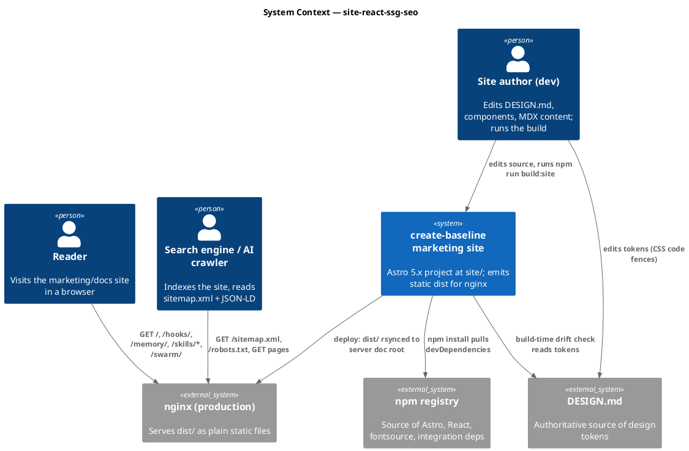

### C4 — Container

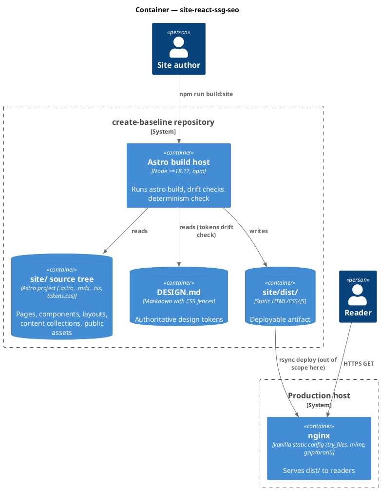

### C4 — Component (changed containers only)

Two containers change in this spec: the **Astro build host** (new build pipeline) and the **`site/` source tree** (re-laid out from scratch). The diagram below covers the build host's component composition; the source-tree layout is documented in the **Source layout** subsection below the diagram.

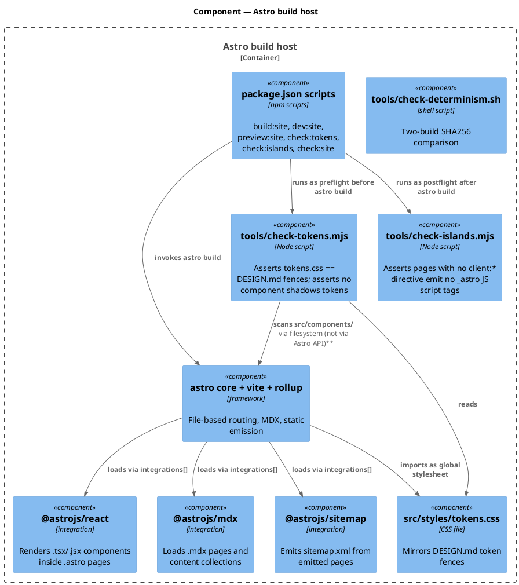

#### Source layout (committed)

```
site/
├── package.json            # workspace member; Astro/React/integration devDependencies
├── astro.config.mjs        # integrations + site URL + build.format='directory'
├── tsconfig.json           # extends "astro/tsconfigs/strict"
├── src/
│   ├── pages/
│   │   ├── index.astro            # → /
│   │   ├── hooks.mdx              # → /hooks/
│   │   ├── memory.mdx             # → /memory/
│   │   ├── skills.astro           # → /skills/   (index linking core + third-party)
│   │   ├── skills/
│   │   │   ├── core.mdx           # → /skills/core/
│   │   │   └── third-party.mdx    # → /skills/third-party/
│   │   └── swarm.mdx              # → /swarm/
│   ├── layouts/
│   │   └── Page.astro             # head/meta/JSON-LD/topnav/footer wrapper
│   ├── components/
│   │   ├── Masthead.astro
│   │   ├── Topnav.astro
│   │   ├── ToC.astro              # static-render (no client:*)
│   │   ├── Sidebar.astro          # static-render shell; injects island for scroll-spy
│   │   ├── PipelineSubway.tsx
│   │   ├── MemoryFlowPlate.tsx
│   │   ├── HookBoundaryGrid.tsx
│   │   ├── SkillCatalog.tsx
│   │   ├── DevWindow.astro
│   │   └── islands/
│   │       ├── CopyButton.tsx     # client:visible
│   │       └── ScrollSpy.tsx      # client:idle (powers Sidebar)
│   ├── content/
│   │   ├── config.ts              # defineCollection + zod schema
│   │   └── ref/                   # MDX content collection (frontmatter-typed)
│   ├── styles/
│   │   ├── tokens.css             # mirrors DESIGN.md (single source via drift check)
│   │   ├── reset.css
│   │   └── global.css
│   └── seo/
│       ├── buildMeta.ts           # per-page <title>/description/canonical/OG/Twitter helper
│       └── jsonld.ts              # WebSite / WebPage / SoftwareApplication generators
├── public/
│   ├── brandmark.png              # moved from site/assets/brandmark.png
│   ├── brandmark@2x.png
│   ├── brandmark.svg
│   ├── favicon/
│   │   ├── favicon.ico
│   │   ├── favicon-16x16.png
│   │   ├── favicon-32x32.png
│   │   ├── apple-touch-icon.png
│   │   ├── android-chrome-192x192.png
│   │   ├── android-chrome-512x512.png
│   │   └── site.webmanifest       # corrected: full icon paths + name + short_name
│   ├── og/
│   │   └── default.png            # 1200×630 OG image (authored asset)
│   └── robots.txt
├── tools/
│   ├── check-tokens.mjs
│   ├── check-islands.mjs
│   ├── check-determinism.sh
│   └── nginx.sample.conf
└── dist/                          # build output (gitignored, excluded from npm tarball)
```

The repo root `package.json` becomes an npm workspace declaring `site` as a member; site-build dependencies live in `site/package.json` and hoist to root `node_modules` per the locked default. `site/index.html` and `site/assets/src/app.jsx` are deleted as part of this work; `site/assets/brandmark*` and `site/assets/favicon/**` are *moved* (not re-encoded) to `site/public/`.

### Data model — class diagram

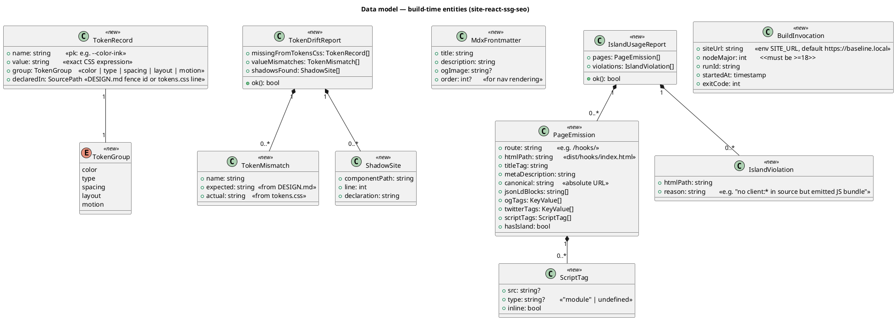

#### Migration DDL

N/A — this is a static-build project. No relational store. The "data model" above is the build-time / verification-script data shape; it lives in TypeScript types under `site/tools/` and `site/src/seo/`.

### Behavior — sequence per AC

Six sequence diagrams cover the 14 intake ACs, consolidated where flows overlap. Each AC in the spec's AC table cites the §Behavior anchor that defines its contract.

#### §Behavior #1 — `npm run build:site` end-to-end

Covers intake AC #1, AC #2, AC #3, AC #4, AC #12, AC #14.

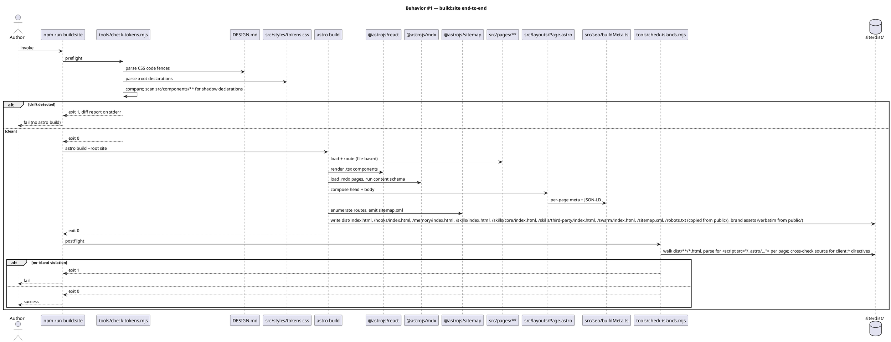

#### §Behavior #2 — Token edit propagation (AC #6) and shadow rejection (AC #8)

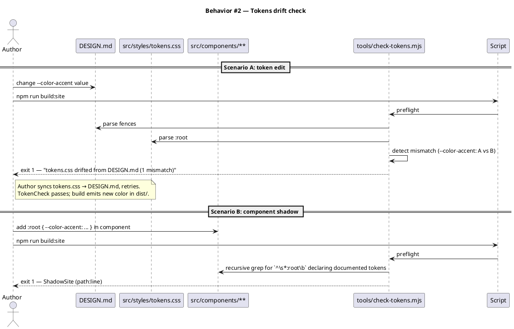

#### §Behavior #3 — Build determinism (AC #7)

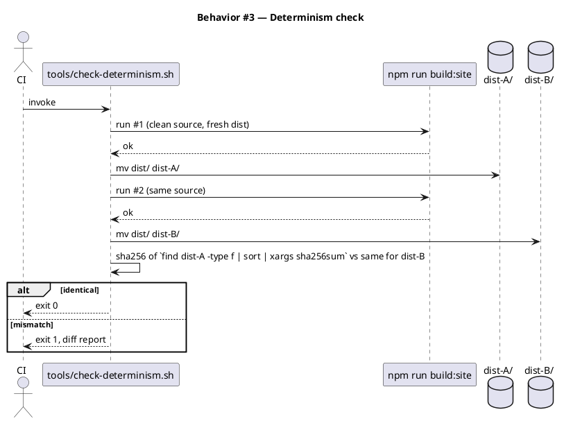

#### §Behavior #4 — Reader fetches a page over vanilla nginx (AC #5, #9, #13, #14)

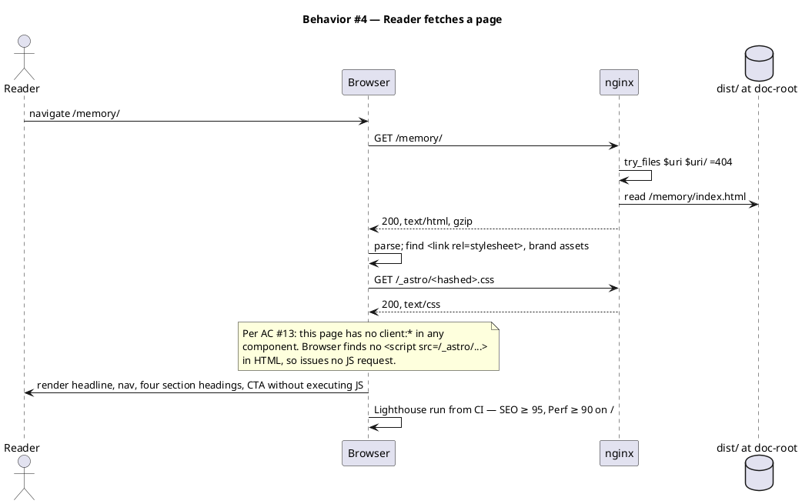

#### §Behavior #5 — Brand asset pass-through (AC #10)

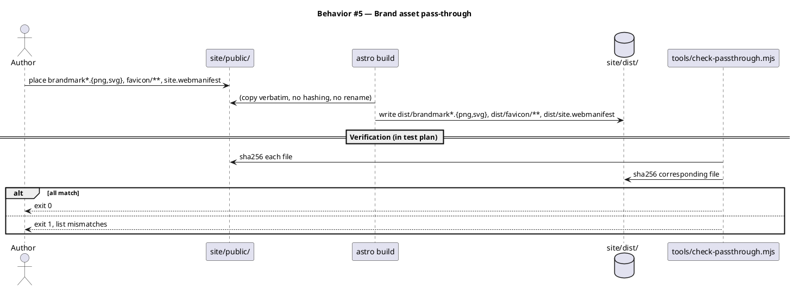

#### §Behavior #6 — `npm pack` excludes site dist (AC #11)

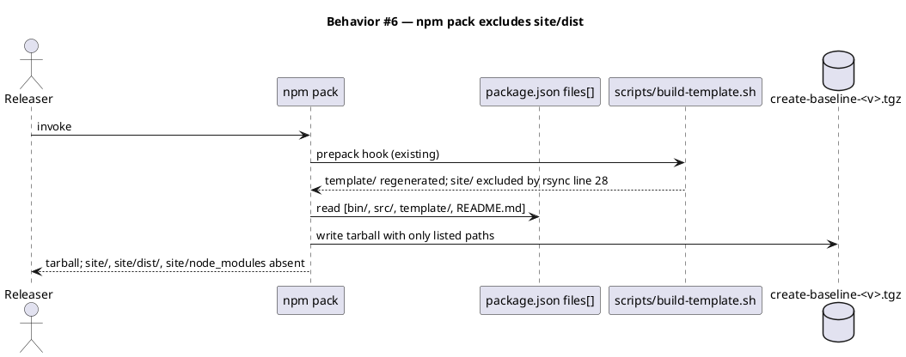

### State — core entity

This system has no non-trivial state machine. The build pipeline is straight-line; the production runtime is a static file server. Heading retained per template convention.

### Dependencies — graph

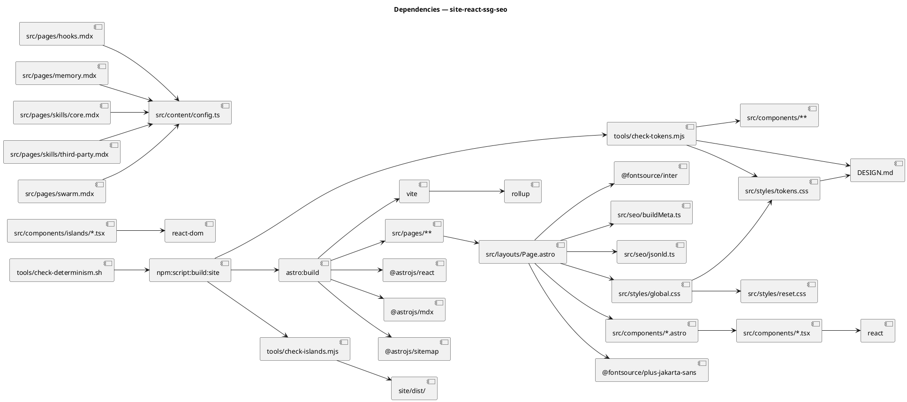

The graph is acyclic. Read-direction is "uses": `A --> B` means A depends on B at build time. No cycles exist between source modules and the build pipeline (all dependencies flow from the script entrypoints downward).

### Contracts

| Kind | Name | Input | Output | Errors | Idempotent |
|---|---|---|---|---|---|
| npm script | `build:site` | source tree, `SITE_URL` env | `site/dist/**`, exit 0 | exit 1 from drift / build / island check | yes (deterministic) |
| npm script | `dev:site` | — | `astro dev` server on a free port | — | yes |
| npm script | `preview:site` | requires prior `build:site` | `astro preview` server serving `site/dist/` | exit 1 if `dist/` missing | yes |
| npm script | `check:tokens` | source tree | exit 0 if clean | exit 1 + diff report on drift / shadow | yes |
| npm script | `check:islands` | requires `site/dist/` | exit 0 if clean | exit 1 + violation report | yes |
| npm script | `check:site` | source tree | exit 0 | exit 1 from any sub-check | yes |
| Node script | `tools/check-tokens.mjs` | `DESIGN.md`, `src/styles/tokens.css`, `src/components/**` | `TokenDriftReport` JSON to stdout in `--json`, human report otherwise | exit 1 on drift | yes |
| Node script | `tools/check-islands.mjs` | `site/dist/**/*.html` + glob of source pages with their `client:*` use | `IslandUsageReport` JSON | exit 1 on violation | yes |
| Shell script | `tools/check-determinism.sh` | clean repo, `npm run build:site` runnable | exit 0 if two runs match | exit 1 + sha256 diff | yes |
| HTTP | `GET /` (and any page) | URL | `200` text/html, gzipable; `<title>`, `<meta name="description">`, `<link rel="canonical">`, OG, Twitter, JSON-LD | nginx-level only (404 for unknown URL via `try_files … =404`) | yes (static) |
| HTTP | `GET /sitemap.xml` | URL | `200` application/xml | — | yes |
| HTTP | `GET /robots.txt` | URL | `200` text/plain | — | yes |

### Libraries and versions

The lockfile is currently empty. Versions below are pinned to the **current major** as of 2026-04-29 per context7 confirmation; the implementer pins exact patch versions to `site/package.json` during `/tdd`. Update this table if any major bumps before approval.

| Library@version | Purpose | Key APIs | Confirmed via context7 |
|---|---|---|---|
| `astro@^5` | SSG core; file-based routing; islands | `defineConfig`, `client:load`, `client:idle`, `client:visible`, `client:media`, `client:only`, `astro:content`, `defineCollection`, `glob` loader | `/withastro/docs` — "Client Directives Overview", "Hydrate interactive components with client directives", "Configure content collection loader for MDX files" |
| `@astrojs/react@^4` | React renderer for `.tsx` islands | `react()` integration | `/withastro/docs` — "Configure React integration in astro.config.mjs" |
| `@astrojs/mdx@^4` | MDX support + content collections | `mdx()` integration, `syntaxHighlight`, `shikiConfig`, `remarkPlugins`, `rehypePlugins` | `/withastro/docs` — "Configure MDX integration in astro.config.mjs" |
| `@astrojs/sitemap@^3` | sitemap.xml generation from emitted routes | `sitemap()` integration; requires `site` field in `defineConfig` | `/withastro/docs` — "Configure sitemap integration in astro.config.mjs" / "Usage" |
| `react@^19` | React renderer | `useState`, `useEffect`, `useRef`, `useCallback`, `useId` | `/reactjs/react.dev` — current release stream (versions list `v19_1_1`, `v19_2_0`) |
| `react-dom@^19` | Client mount for islands | (loaded by `@astrojs/react` automatically) | same |
| `@fontsource/plus-jakarta-sans@^5` | Self-hosted Plus Jakarta Sans (display) | per-weight CSS imports | npm registry / fontsource docs |
| `@fontsource/inter@^5` | Self-hosted Inter (body) | per-weight CSS imports | npm registry / fontsource docs |
| `vite@^7` *(transitive via Astro)* | Asset pipeline; deterministic Rollup build | (consumed by Astro) | `/vitejs/vite` — current release stream |

### Alternatives considered

| Alt | Summary | Rejected because |
|---|---|---|
| Vike + React (Vite-native meta-framework, `prerender: true`) | Single-component-language (`.tsx` only), Vite-based SSG | AC #13 ("zero JS on no-island pages") is opt-out per page in Vike vs default-on in Astro. Every page becomes a vigilance decision rather than a structural guarantee. |
| Vite + DIY (`react-dom/server` + custom routing) | Smallest dep footprint; full control | Re-implements routing, sitemap, MDX, content schema, dev-server — explicit YAGNI inversion (seed.md § VI.4). Saves bytes installed; loses ergonomics; loses MDX out of the box. |
| Next.js / Gatsby | React-everywhere SSG/SSR | Fight the framework to satisfy AC #13; Gatsby in maintenance; Next.js default deploy target is Vercel, not nginx. |
| Eleventy + bolted-on React islands | Lean static generator with React via web-component wrapper | Intake says "proper React"; the React story is bolt-on (`<is-land>` web-component), components don't compose naturally. |

## Acceptance criteria

| ID | Criterion (given / when / then) | Upstream AC | Sequence |
|---|---|---|---|
| AC-001 | given a clean checkout, when the operator runs `npm run build:site`, then `site/dist/` is emitted as fully static HTML/CSS/JS with no JSX/Babel runtime referenced anywhere in the dist | intake AC #1 | §Behavior #1 |
| AC-002 | given the dist, when any HTML file is inspected, then it carries a unique `<title>`, unique `<meta name="description">`, `<link rel="canonical">` matching its deploy URL, and Open Graph + Twitter Card meta (image, title, description, url, type) referencing assets that exist in the dist | intake AC #2 | §Behavior #1 |
| AC-003 | given the dist root, when inspected, then `sitemap.xml` lists every emitted HTML page with its canonical URL, and `robots.txt` is present | intake AC #3 | §Behavior #1 |
| AC-004 | given any emitted HTML page, when parsed, then it contains at least one valid JSON-LD block whose `@type` is appropriate (`/`: `WebSite` and `SoftwareApplication`; reference pages: `WebPage`) and validates against schema.org | intake AC #4 | §Behavior #1 |
| AC-005 | given the production build of the homepage, when Lighthouse runs against it in mobile profile, then SEO score ≥ 95 and Performance score ≥ 90 | intake AC #5 | §Behavior #4 |
| AC-006 | given a token (`--color-*`, `--font-*`, `--space-*`, `--motion-*`) is changed in `DESIGN.md` and the operator syncs `src/styles/tokens.css`, when `npm run build:site` runs, then the new value is reflected in dist with no component edits | intake AC #6 | §Behavior #2 |
| AC-007 | given two consecutive `npm run build:site` invocations on the same source tree, when the resulting `dist/` directories are compared, then `sha256sum` of `find dist -type f | sort` is byte-identical | intake AC #7 | §Behavior #3 |
| AC-008 | given a CI run, when `npm run check:tokens` executes, then it passes when no component file under `src/components/**` declares a `:root { --… }` block redefining a token documented in `DESIGN.md`; and it fails (exit 1, naming the path:line) otherwise | intake AC #8 | §Behavior #2 |
| AC-009 | given the deployed homepage, when it is fetched and rendered with JS disabled, then the headline, primary navigation, the four section headings (Principle / Pipeline / Memory / Adoption), and the primary CTA copy are all visible in the DOM | intake AC #9 | §Behavior #4 |
| AC-010 | given the source brand assets at `site/public/brandmark*.{png,svg}` and `site/public/favicon/**`, when the build runs, then those exact bytes appear at `site/dist/brandmark*.{png,svg}` and `site/dist/favicon/**` (sha256 equal; no rename, no re-encoding, no hash suffix) | intake AC #10 | §Behavior #5 |
| AC-011 | given the source tree, when `npm pack` runs at repo root, then the resulting tarball contains no path under `site/` (CLI scaffolder package surface unchanged) | intake AC #11 | §Behavior #6 |
| AC-012 | given the build, when `site/dist/` is inspected, then it contains: `/index.html`, `/hooks/index.html`, `/memory/index.html`, `/skills/index.html`, `/skills/core/index.html`, `/skills/third-party/index.html`, `/swarm/index.html` (URL shape committed per `astro.config.mjs → build.format='directory'`) | intake AC #12 | §Behavior #1 |
| AC-013 | given any emitted HTML page whose source uses no `client:*` directive, when its HTML is inspected, then no `<script>` tag references a path under `/_astro/` (Astro chunk dir) and no inline `<script>` declares React component code | intake AC #13 | §Behavior #1, §Behavior #4 |
| AC-014 | given the dist served via `tools/nginx.sample.conf` (vanilla static config: `try_files $uri $uri/ =404;`, mimetype mapping, gzip/brotli only), when an integration test fetches every emitted page + `sitemap.xml` + `robots.txt`, then every fetch returns 200 with the expected content-type | intake AC #14 | §Behavior #4 |
| AC-015 | given `site/public/favicon/site.webmanifest`, when inspected, then it has populated `name` and `short_name` fields and icon `src` paths that resolve at the deploy root (e.g., `/favicon/android-chrome-192x192.png`, not `/android-chrome-192x192.png`) | spec-introduced (resolves the scout-flagged webmanifest bug — intake question "Webmanifest disposition") | §Behavior #5 |

## Test plan

The `scenario` skill writes failing tests against this plan during `/tdd`. Categories below; main context decides recipes when invoking `scenario`.

| Category | Scenario | Expected | Covers |
|---|---|---|---|
| Golden path | `npm run build:site` on a clean checkout | exit 0; `site/dist/` non-empty | AC-001 |
| Page set | dist contains all 7 listed `index.html` files | each path exists, non-empty | AC-012 |
| SEO meta | for each emitted page, parse with `cheerio`; assert title/description/canonical/OG/Twitter present and unique | all assertions pass | AC-002 |
| Sitemap & robots | `dist/sitemap.xml` lists all 7 pages with canonical URLs; `dist/robots.txt` exists | parsable XML, all 7 `<loc>` entries present, robots.txt parses | AC-003 |
| JSON-LD | for each page, find `<script type="application/ld+json">`, JSON.parse, validate `@type` against expectation table | parses, type matches | AC-004 |
| Lighthouse | run Lighthouse mobile profile against `astro preview` of the homepage | SEO ≥ 95, Performance ≥ 90 | AC-005 |
| Token propagation | change `--color-accent` in `DESIGN.md` + `tokens.css`, rebuild, grep dist CSS for new value | new value present | AC-006 |
| Determinism | run `tools/check-determinism.sh` | exit 0 | AC-007 |
| Token drift (negative) | change `--color-accent` in `tokens.css` only (skip `DESIGN.md`) → run `check:tokens` | exit 1, message names `--color-accent` | AC-006 / AC-008 |
| Token shadow (negative) | add `:root { --color-accent: red }` in `src/components/Foo.astro`, run `check:tokens` | exit 1, message names path:line | AC-008 |
| No-JS critical content | parse `dist/index.html` with `cheerio` (no JS), assert presence of headline text, nav, the four section headings, CTA | all assertions pass | AC-009 |
| Brand pass-through | sha256 each file under `site/public/brandmark*` + `site/public/favicon/**` against same path under `site/dist/` | hashes equal | AC-010 |
| npm pack contents | run `npm pack --dry-run --json`; assert no `files[].path` matches `site/` | passes | AC-011 |
| No-island JS | run `tools/check-islands.mjs`; for each page with no `client:*` in its source, assert dist HTML has no `<script src="/_astro/...">` | exit 0 | AC-013 |
| Island present (positive) | a page that *does* use `client:visible CopyButton` emits exactly the expected `_astro/*.js` script tag | exit 0; script present | AC-013 (positive case) |
| nginx vanilla servability | start nginx on a temp port with `tools/nginx.sample.conf`, fetch every page + sitemap + robots, assert 200 + Content-Type | all pass | AC-014 |
| Webmanifest correctness | parse `dist/favicon/site.webmanifest` as JSON; assert `name`, `short_name` non-empty; assert each icon `src` resolves with HEAD against the test server | passes | AC-015 |
| Input boundary | run `build:site` with `SITE_URL` unset (default), with trailing slash, with no-trailing-slash | each produces a valid sitemap with the matching canonical scheme | AC-002, AC-003 |
| Failure mode | corrupt `tokens.css` (invalid CSS) | `astro build` fails with a clear parser error; preflight token check still flags drift | AC-001 (failure) |
| Regression trap | running `npm pack --dry-run` after this work produces the same file set as before | unchanged | AC-011 |

## Observability

Static deployment; signals are limited and build-time.

| Signal | Name | Shape | Purpose |
|---|---|---|---|
| Log | `build:site` stdout | structured per-stage timing (preflight, astro, postflight) | dev / CI debug |
| Log | `check-tokens.mjs --json` | `TokenDriftReport` JSON | CI gate evidence |
| Log | `check-islands.mjs --json` | `IslandUsageReport` JSON | CI gate evidence |
| Metric | Lighthouse CI scores | numeric SEO + Performance per page | regression detection |
| Alarm | CI failure on any `check:*` non-zero exit | (CI-native) | block bad merges |

There is no production runtime to instrument; nginx access logs are the operator's responsibility and out of scope for this spec.

## Rollout

- **Feature flag**: not applicable — the deployment is a static directory swap. Rollout is "deploy or don't."
- **Migration order**:
  1. Land this PR (Astro project + checks + brand-asset move + `site/index.html` + `site/assets/src/app.jsx` deleted).
  2. Update `.claude/project.json → workflow.artifacts.document` from `null` to `site/dist/**` (so `/document` runs against the rendered site).
  3. Operator runs `npm run build:site` locally; verifies dist; rsyncs `site/dist/` to nginx doc root.
  4. Operator points DNS / config at the new doc root.
- **Canary**: not applicable for a static marketing site; if the operator wants a canary, run the new build to a sibling URL first.

## Rollback

- **Kill-switch**: revert the Git/file change at the operator's source-of-truth (no git locally, so the operator restores the prior `site/dist/` from the previous deploy bundle); nginx serves the prior bytes.
- **Signal to roll back**: any Lighthouse SEO score < 90 or Performance < 80 on the homepage in CI; any 5xx rate > 0.1% over 5 min in nginx access logs (operator-monitored).

## Archive plan

When this spec ships, the `archive` skill (Phase 10.5) bundles the following into `docs/archive/<ship-date>/site-react-ssg-seo/`:

- Defaults *(automatic)*: `docs/intake/site-react-ssg-seo.md`, `docs/scout/site-react-ssg-seo.md`, `docs/research/site-react-ssg-seo.md`, `docs/specs/site-react-ssg-seo.md`, `docs/specs/_rendered/site-react-ssg-seo/` (if `/spec-render` was run), `.claude/state/spec_approvals/site-react-ssg-seo.md.approval`, swarm plan + approval if used, security report if `/security` ran.
- Extras *(non-default files)*:
  - *(none)*

## Open questions

- **`SITE_URL` placeholder for early dev.** The implementer must commit a default in `astro.config.mjs` so builds don't fail when `SITE_URL` is unset. Proposed default: `https://baseline.local` (resolves AC #2 / AC #3 absolute-URL emission). Confirm before approval, or accept the default.
- **OG image source.** `site/public/og/default.png` (1200×630) is referenced from AC #2 but the image itself is an authored asset. Implementer composes it during `/tdd` from existing brandmark + headline; alternative is a reviewer commits the asset before approval. Either works; flagging so the asset is not forgotten.
- **`@fontsource` font weights.** `DESIGN.md` cites Plus Jakarta Sans 500/700/800 and Inter 400/500/600/700. Implementer pins exactly those weights via `@fontsource/plus-jakarta-sans/{500,700,800}.css` + `@fontsource/inter/{400,500,600,700}.css`. Surface here so the reviewer can ratify the weight set.
