# Spec — design-ui as a pure `impeccable` orchestrator with structural design-task routing

<!--
Technical spec. Produced by the `spec` skill.

Guard-enforced invariants:
  - Required ## headings (artifact_template_guard):
        Goal, Design, Acceptance criteria, Test plan.
  - Required diagram kinds inside ```plantuml``` fences
    (spec_diagram_presence_guard, configured in project.json →
     artifacts.required_diagrams.spec):
        c4_context, c4_container, c4_component,
        sequence, class, dependency_graph.
  - Every ```plantuml``` fence must parse (plantuml_syntax_guard).

Approval: NEVER add "Status: Approved" — spec_approval_guard blocks it.
Approval is a token written by /approve-spec.
-->

## Context

| Input | Path |
|---|---|
| Intake | `docs/intake/design-ui-orchestrator.md` |
| BRD *(if any)* | — *(internal refactor; no cross-functional stakeholders)* |
| Scout *(if any)* | `docs/scout/design-ui-orchestrator.md` |
| Research *(if any)* | `docs/research/design-ui-orchestrator.md` |

## Goal

`design-ui` becomes a pure orchestrator: it captures intent, classifies it, translates it to a sequence of `impeccable` subcommand invocations, runs them in main context with persisted state, and returns a structured report. Every design task inside a workflow phase routes through `design-ui`; `design-ui` always invokes `impeccable` for the underlying design move. The vendored `impeccable` skill stays untouched. The structural commitment lands as CLAUDE.md Article X.2.

## Non-goals

- Editing the vendored `impeccable` skill (`.claude/skills/impeccable/**`). Article IX vendoring discipline preserved.
- Adding new `impeccable` subcommands. The existing ~20-command vocabulary is the design vocabulary; `design-ui` is a router over it, not a vocabulary extender.
- Changing how individual `impeccable` subcommands behave.
- Adding a write-boundary hook to detect direct UI file writes outside the design lane. Article X.2 + `spec_design_calls_guard` + `/tdd` Step 6 form the structural enforcement; per-write hooks are overreach.
- Parallel orchestration. Sequential `impeccable` invocation per recipe step; multi-threaded execution is out of scope for v1.
- Backward compatibility with `design-ui` v1's code-writing role. Zero current callers (verified by scout grep); clean break.

## Design

Diagrams are the contract. Prose is only for things a diagram cannot say.

### C4 — System context

Who interacts with the system, and which external systems it depends on.

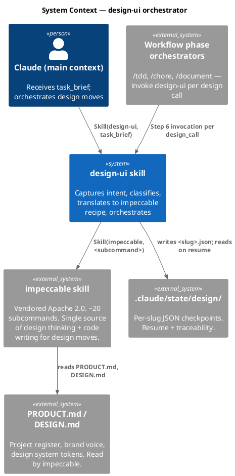

### C4 — Container

Deployable units inside the system boundary and how they communicate. "Containers" here are the file-level artifacts the refactor produces or edits.

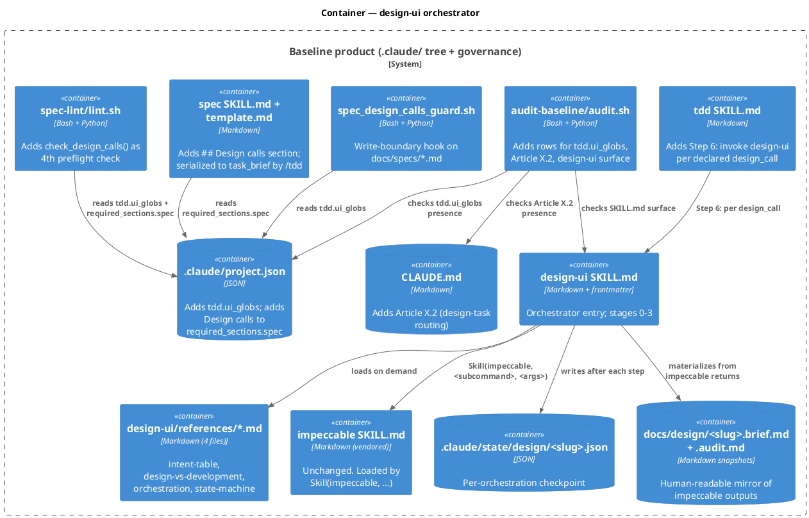

### C4 — Component (changed container: `design-ui` skill internals)

The four stages of the orchestrator + the thin-glue writer.

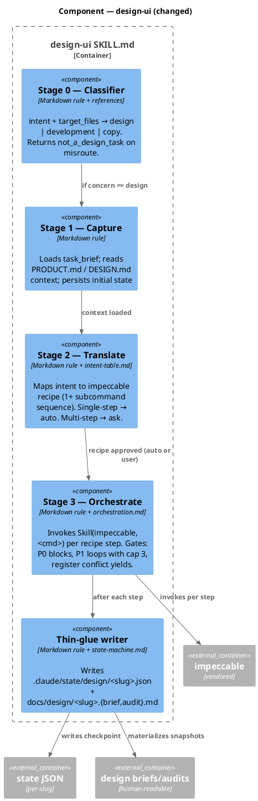

### Data model — class diagram

The shapes that flow through design-ui. No SQL — these are JSON / Markdown contracts.

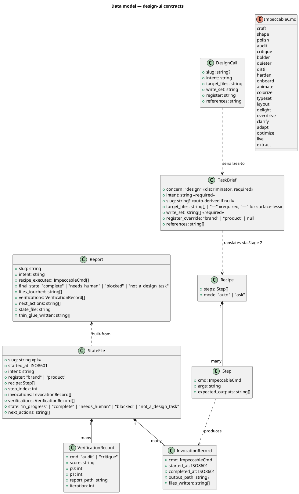

No migration DDL — there is no SQL database. Class shapes are JSON validated by the new tests; spec table rows are Markdown validated by `spec-lint` + the new hook.

### Behavior — sequence per AC

One sequence per acceptance criterion. The sequence is the contract.

#### §Behavior #1 — AC-1: non-design intent returns `not_a_design_task`

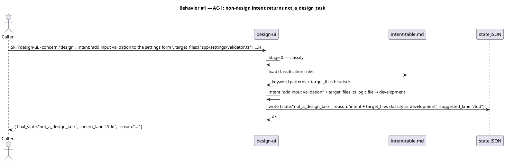

#### §Behavior #2 — AC-2: multi-step recipe asks for approval

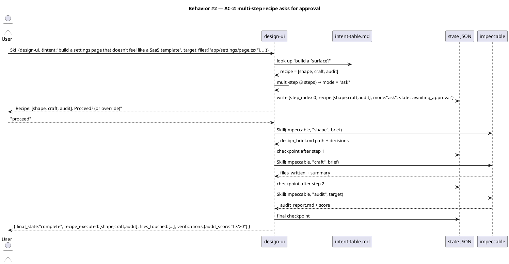

#### §Behavior #3 — AC-3: single-step recipe auto-executes

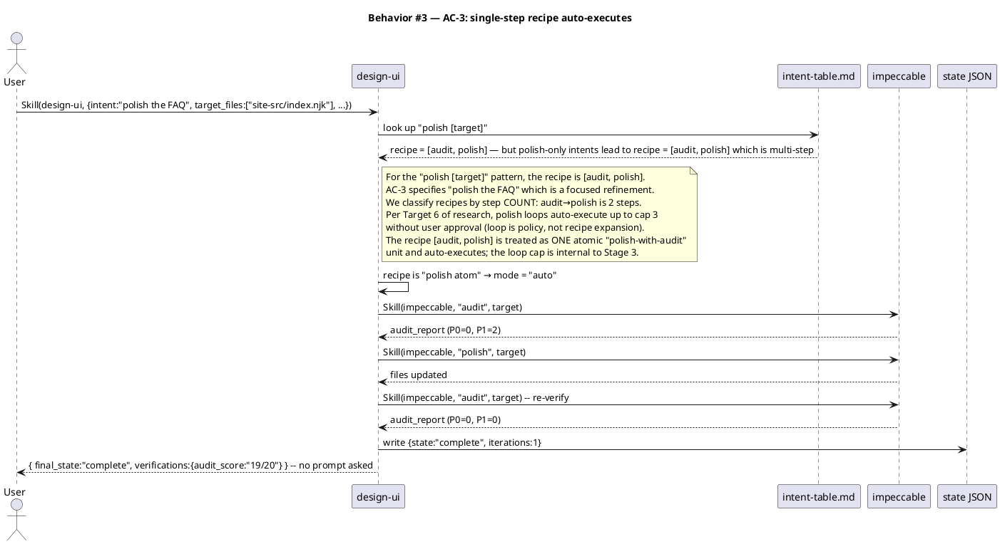

#### §Behavior #4 — AC-4: spec-lint rejects UI spec without `design_calls[]`

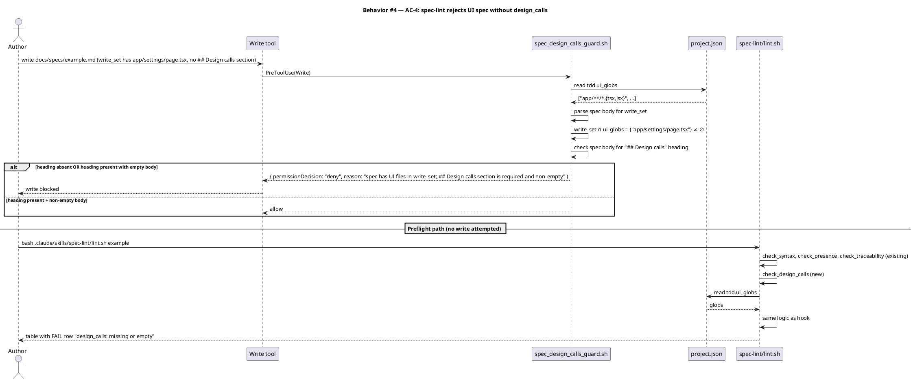

#### §Behavior #5 — AC-5: `/tdd` Step 6 invokes design-ui per design_call

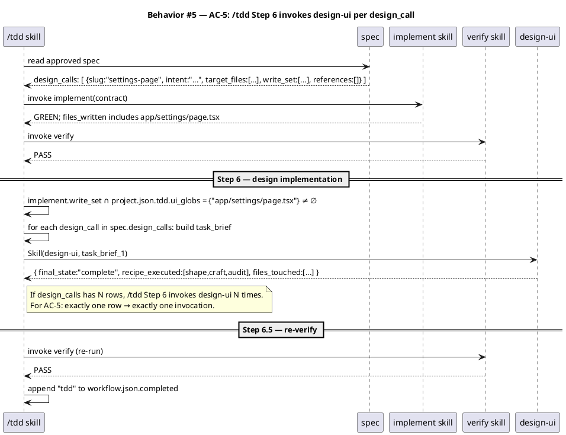

#### §Behavior #6 — AC-6: loop cap on `audit → polish` at iteration 3

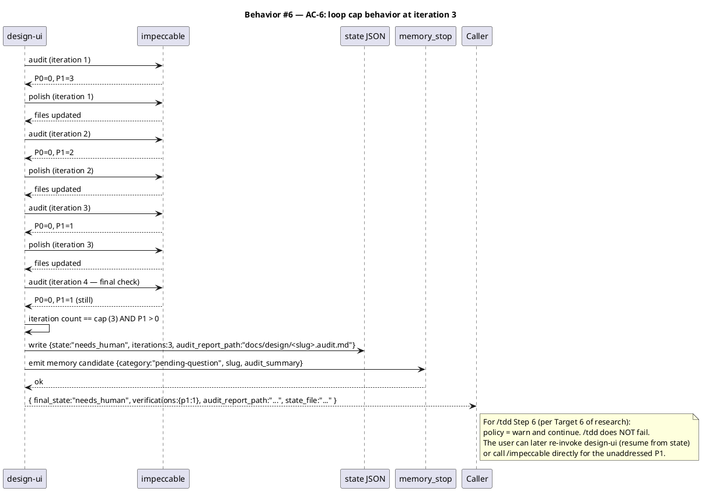

#### §Behavior #7 — AC-7: resume from `.claude/state/design/<slug>.json`

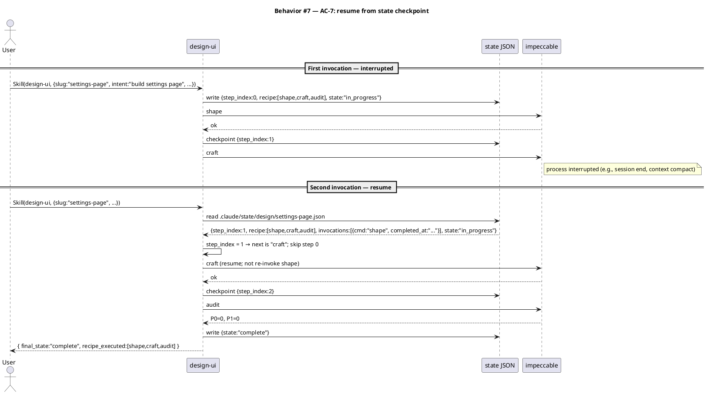

#### §Behavior #8 — AC-8, AC-9, AC-10: verification phase (drift, audit, full tests)

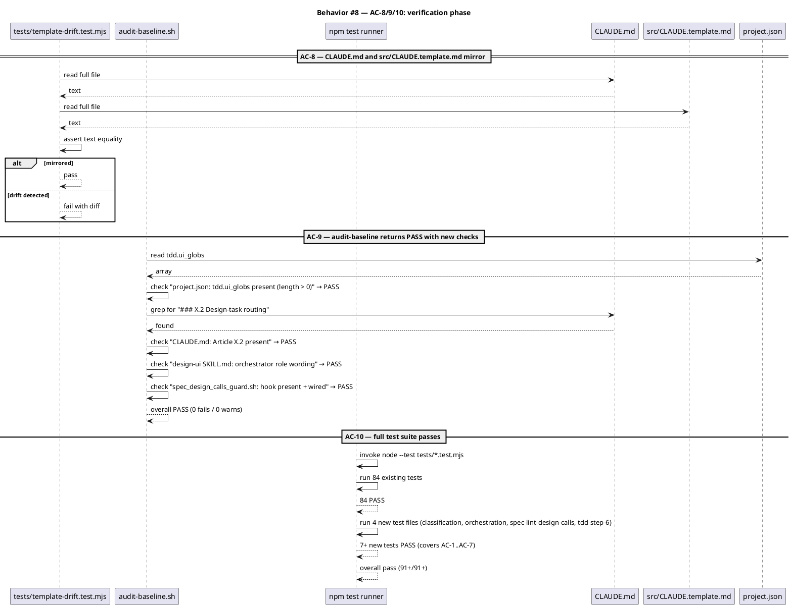

### Dependencies — graph

Directed graph of dependencies. Edge `A --> B` reads "A depends on B".

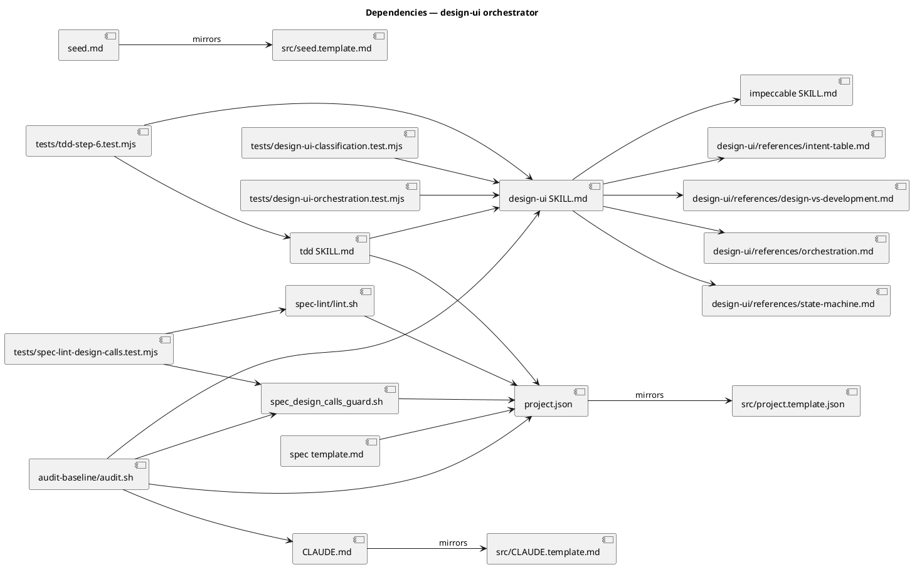

### Contracts

The Skill invocation surface, the spec table row shape, and the state file shape.

| Kind | Name | Input | Output | Errors | Idempotent |
|---|---|---|---|---|---|
| Skill | `Skill(design-ui, task_brief)` | `TaskBrief` JSON | `Report` JSON (final_state, recipe_executed, files_touched, verifications, state_file) | `not_a_design_task` (Stage 0 misroute), `blocked` (target file missing, register conflict) | yes — resume from state |
| Spec table row | `## Design calls` row | columns: Slug, Intent, Target files, Write set, Register, References | one `TaskBrief` after column-to-field mapping | spec-lint rejects rows where Target files is empty AND intent is not surface-less; rejects rows with missing required fields | n/a |
| Hook decision | `spec_design_calls_guard.sh` PreToolUse | `{file_path, tool_input.content, ...}` | `{permissionDecision: allow | deny, permissionDecisionReason}` | deny when `write_set ∩ ui_globs ≠ ∅` AND no non-empty `## Design calls` body | n/a |
| Lint check | `check_design_calls` in `spec-lint/lint.sh` | spec text + project.json | `("PASS"|"FAIL"|"SKIP", detail_string)` tuple | same logic as hook; preflight-only (no write block) | yes |
| State file | `.claude/state/design/<slug>.json` | written by design-ui after each step | `StateFile` JSON | malformed JSON triggers blocked state on resume | reads/writes are append-on-step |

#### Spec table → task_brief serialization

The `## Design calls` section in a spec is a Markdown table. Each row serializes to one `TaskBrief`:

| Spec column | task_brief field | Notes |
|---|---|---|
| Slug | `slug` | optional; if blank or `—`, design-ui derives kebab-case from intent's first noun phrase |
| Intent | `intent` | required; natural-language |
| Target files | `target_files` | required; comma-separated paths or `—` for surface-less |
| Write set | `write_set` | required; comma-separated globs; broader than target_files |
| Register | `register_override` | `brand` / `product` / `inherit` (= null) |
| References | `references` | optional; comma-separated URLs or paths or `—` |

The `concern: "design"` field is implicit — `/tdd` Step 6 stamps it when building the task_brief. design-ui's Stage 0 asserts it.

### Libraries and versions

Every entry must be confirmed via the `context7` MCP — no training-data recall for third-party APIs.

| Library@version | Purpose | Key APIs | Confirmed via context7 |
|---|---|---|---|
| *(none)* | This refactor is purely internal architecture: Markdown skill definitions, Bash + Python hook, JSON config, JSON state files. No third-party library APIs are introduced. | — | not applicable |

The existing internal dependencies (Node test runner from Node 22+, Python 3.x for hook implementations, Bash for hook scaffolding) are already in use across the codebase and are confirmed by the test suite running today (84 tests passing). This spec does not introduce a new dependency.

### Alternatives considered

| Alt | Summary | Rejected because |
|---|---|---|
| Extend `artifact_template_guard` for `design_calls` enforcement (Target 1 / A) | One hook handles both required-sections and the conditional design_calls check | Mixes concerns: the hook becomes a flat-list check WITH conditional rule (parse write_set, intersect with ui_globs) — undermines the "one hook, one rule" pattern |
| Extend `spec_diagram_presence_guard` (Target 1 / B) | Cheaper than a new hook | Concept mismatch — diagram presence is not the same concern as design call presence |
| Preflight-only via `spec-lint` (Target 1 / D) | No new hook; relies on `/spec-lint` invocation | Loses write-boundary enforcement; a non-conforming spec can persist if the user skips lint |
| Empty `ui_globs` default (Target 2 / A) | Pure opt-in via `/init-project` | Silent under-enforcement in project-agnostic mode (sanctioned by Article III) |
| `/init-project`-derived defaults (Target 2 / C) | Most precise per detected stack | Same project-agnostic-mode gap as A; defers tailoring to a step many users skip |
| Pure LLM classification at Stage 0 (Target 3 / C) | Most flexible for edge cases | Undermines AC-1/2/3 determinism; tests become probabilistic |
| Inline intent table in SKILL.md (Target 4 / A) | One file to read | Skill-context budget — 18-row table loaded on every invocation when only ~3 rows are hot path |
| `### Design calls` subsection under `## Design` (Target 5 / B) | Groups material together | `artifact_template_guard` only checks `##` headings; enforcement would need a hook change |
| Caller-only return (Target 6 / A) | Simplest; no state, no memory | Loses resume capability and long-term knowledge capture |
| State-checkpoint yield (Target 6 / B) | Mirrors workflow gates | Awkward double-yield inside `/tdd` (which is itself a phase); UX cost too high |
| Pure memory-candidate (Target 6 / C) | Captures knowledge | Doesn't block or surface the immediate failure |

The synthesis is in the chosen design: hybrid hook + spec-lint (T1), stack-neutral default with `/init-project` override (T2), keyword + target_files heuristic (T3), external references file (T4), top-level `## Design calls` section (T5), hybrid return + state + memory (T6).

## Design calls

This spec's `write_set` does not intersect `project.json → tdd.ui_globs` (defaults proposed: `app/**/*.{tsx,jsx}`, `components/**/*.{tsx,jsx,vue,svelte}`, `pages/**/*.{tsx,jsx,vue,svelte}`, `src/**/*.{tsx,jsx,vue,svelte}`, `**/*.html`, `**/*.css`, `**/*.scss`, `**/*.njk`). The refactor touches Markdown skill files, Bash hooks, JSON config, and Node test files — none match a UI glob.

- *(none)*

This section is the canonical demonstration of the rule: a non-UI spec carries the section heading with an empty `*(none)*` body, satisfying `artifact_template_guard`'s unconditional required-section check while the new `spec_design_calls_guard` recognizes no conditional fire (intersection is empty).

## Acceptance criteria

Numbered, testable, traced. Each AC points to the §Behavior sequence that defines it.

| ID | Criterion (given / when / then) | Upstream AC | Sequence |
|---|---|---|---|
| AC-001 | given `task_brief` with intent `"add input validation to the settings form"` and target_files `["app/settings/validator.ts"]`, when `Skill(design-ui, …)` is invoked, then design-ui returns `{ final_state: "not_a_design_task", correct_lane: "/tdd" }` and persists the classification reason in state. | intake AC-1 | §Behavior #1 |
| AC-002 | given `task_brief` with intent `"build a settings page that doesn't feel like a SaaS template"`, when `Skill(design-ui, …)` is invoked, then design-ui produces recipe `["shape", "craft", "audit"]` and yields to the user for approval before invoking impeccable. | intake AC-2 | §Behavior #2 |
| AC-003 | given `task_brief` with intent `"polish the FAQ"` against an existing surface, when `Skill(design-ui, …)` is invoked, then design-ui executes the polish atom `[audit, polish, audit]` without asking; iteration count = 1 on success. | intake AC-3 | §Behavior #3 |
| AC-004 | given a spec at `docs/specs/example.md` whose body declares `write_set: ["app/settings/page.tsx"]` matching `tdd.ui_globs`, AND whose body lacks a `## Design calls` heading with non-empty content, when a Write/Edit/MultiEdit fires on the spec file, then `spec_design_calls_guard.sh` returns `permissionDecision: deny` with a reason naming the missing section. The preflight `check_design_calls` function in `spec-lint/lint.sh` reports the same as `FAIL`. | intake AC-4 | §Behavior #4 |
| AC-005 | given a `/tdd` run whose `implement` step writes one file matching `tdd.ui_globs` AND whose approved spec declares exactly one entry in `## Design calls`, when `/tdd` reaches Step 6, then `Skill(design-ui, task_brief)` is invoked exactly once with the row's serialized task_brief; on its return, `/tdd` re-invokes `verify` and proceeds to Step 7. | intake AC-5 | §Behavior #5 |
| AC-006 | given a design-ui orchestration where three consecutive `polish` iterations fail to clear P1 down to zero (per `impeccable audit`), when the fourth audit still reports P1 ≥ 1, then design-ui terminates with `final_state: "needs_human"`, persists `.claude/state/design/<slug>.json`, materializes `docs/design/<slug>.audit.md`, emits a memory candidate, and does NOT run a fourth `polish`. | intake AC-6 | §Behavior #6 |
| AC-007 | given a `.claude/state/design/<slug>.json` with `step_index: 1, recipe: ["shape","craft","audit"], invocations: [{cmd:"shape", completed_at:"…"}]`, when `Skill(design-ui, {slug:"…"})` is invoked, then design-ui reads the state, skips step 0 (shape), and resumes at step 1 (craft). | intake AC-7 | §Behavior #7 |
| AC-008 | given the refactor has landed, when `tests/template-drift.test.mjs` runs, then `CLAUDE.md` and `src/CLAUDE.template.md` are byte-equal (Article X.2 lands in both). | intake AC-8 | §Behavior #8 |
| AC-009 | given the refactor has landed, when `bash .claude/skills/audit-baseline/audit.sh` runs, then exit code is 0 and the report shows `fails=0 warns=0`. New rows pass: `project.json: tdd.ui_globs present`, `CLAUDE.md: Article X.2 present`, `design-ui SKILL.md: orchestrator role`, `spec_design_calls_guard.sh: hook present + wired`. | intake AC-9 | §Behavior #8 |
| AC-010 | given the refactor has landed, when `npm test` runs, then all 84 existing tests pass AND the 4 new test files (≥ 7 new tests covering AC-001 through AC-007) pass. | intake AC-10 | §Behavior #8 |

## Test plan

Scenarios by category. The `scenario` skill turns these into failing tests; main context decides the recipe before invocation. Every row references at least one AC.

| Category | Scenario | Expected | Covers |
|---|---|---|---|
| Golden path | `task_brief` with design intent + UI target_files | `final_state: "complete"`, impeccable invoked | AC-002, AC-003 |
| Golden path | `task_brief` with intent classified as design via target_files (CSS-only) | recipe executed | AC-002 |
| Classification | non-design intent + non-UI target_files | `final_state: "not_a_design_task"`, lane="/tdd" | AC-001 |
| Classification | ambiguous intent + UI target_files | classifies as design via target_files heuristic | AC-001 |
| Classification | design intent + no target_files (surface-less) | classifies as design; recipe resolves to `extract` or `live` | AC-001 |
| Recipe — single-step | intent `"polish the FAQ"` | recipe atom `[audit, polish, audit]` auto-executes; mode = "auto" | AC-003 |
| Recipe — multi-step | intent `"build a settings page"` | recipe `[shape, craft, audit]`; mode = "ask" | AC-002 |
| Spec-lint | spec with UI write_set + no `## Design calls` | hook DENY, lint FAIL | AC-004 |
| Spec-lint | spec with UI write_set + `## Design calls` with `*(none)*` body | hook DENY, lint FAIL (body must be non-empty when conditional fires) | AC-004 |
| Spec-lint | spec with UI write_set + `## Design calls` with one row | hook ALLOW, lint PASS | AC-004 |
| Spec-lint | spec with non-UI write_set + no `## Design calls` heading | hook ALLOW (no conditional fire); lint PASS | AC-004 |
| `/tdd` Step 6 | spec with one design_call row + implement's write_set intersects ui_globs | design-ui invoked exactly once | AC-005 |
| `/tdd` Step 6 | spec with zero design_call rows + implement's write_set has no UI files | design-ui not invoked | AC-005 |
| `/tdd` Step 6 | spec with two design_call rows + UI write_set | design-ui invoked exactly twice, in order | AC-005 |
| Loop cap | audit P1=2 → polish → audit P1=1 → polish → audit P1=1 → polish → audit P1=1 | `final_state: "needs_human"` at iteration 3 | AC-006 |
| Loop cap | audit P1=2 → polish → audit P1=0 | `final_state: "complete"` at iteration 1; loop terminates early | AC-006 |
| State / resume | invoke twice with same slug, second time after first interrupted at step 1 | second invocation skips step 0, resumes at step 1 | AC-007 |
| State / resume | invoke with slug whose state file is malformed JSON | `final_state: "blocked"` with reason | AC-007 |
| Drift | edit `CLAUDE.md` to add X.2 without mirroring | `template-drift.test.mjs` fails | AC-008 |
| Drift | both files in sync after refactor | test passes | AC-008 |
| Audit | run `audit-baseline.sh` after refactor | exit 0; new checks PASS | AC-009 |
| Audit | drop `tdd.ui_globs` from project.json | new check FAIL | AC-009 |
| Audit | remove Article X.2 from CLAUDE.md | new check FAIL | AC-009 |
| Full suite | `npm test` after refactor | all 84 existing + ≥ 7 new pass | AC-010 |
| Regression trap | existing test files keep passing | unchanged | AC-010 |

New test files:
1. `tests/design-ui-classification.test.mjs` — Stage 0 classification cases (AC-001, AC-002 mode detection, AC-003 mode detection). ≥ 6 tests.
2. `tests/design-ui-orchestration.test.mjs` — Stage 3 orchestration: recipe execution, loop cap, resume from state, blocked states. ≥ 5 tests covering AC-006 and AC-007.
3. `tests/spec-lint-design-calls.test.mjs` — hook + lint rule: deny on missing section, allow when satisfied, no-fire when non-UI write_set. ≥ 4 tests for AC-004.
4. `tests/tdd-step-6.test.mjs` — `/tdd` Step 6 invocation logic: one design_call → one invocation; zero design_calls → no invocation; multiple → ordered invocations. ≥ 3 tests for AC-005.

Total new tests: 18+ (exceeds the 7 AC minimum from AC-010).

## Observability

| Signal | Name | Shape | Purpose |
|---|---|---|---|
| Log | `.claude/state/design/<slug>.json` | per-orchestration JSON; fields: state, step_index, invocations[], verifications[], next_actions | audit trail; resume; post-mortem |
| Log | `docs/design/<slug>.brief.md` | Markdown snapshot of impeccable shape's output | human-readable design intent record |
| Log | `docs/design/<slug>.audit.md` | Markdown snapshot of impeccable audit's report | scored audit history per orchestration |
| Metric | audit_score | tracked in state file's `verifications[]` | trend of design quality over iterations within one slug |
| Metric | iterations_to_complete | counter inside state's `verifications[]` length | detects designs that consistently hit the loop cap |
| Memory | `_pending.md` candidate | emitted by `memory_stop` when state == "needs_human" | long-term capture of design issues for `/memory-flush` |

There are no production-style alarms — this is internal architecture, not a service.

## Rollout

- **Feature flag**: none. Binary land. The change is contained inside the baseline product and ships as one PR. Adopting projects pick up the change on the next `npx create-baseline --merge`.
- **Migration order** (the build sequence locked in the spec ARGUMENTS):
  1. Write `.claude/skills/design-ui/references/intent-table.md`, `design-vs-development.md`, `orchestration.md`, `state-machine.md`.
  2. Rewrite `.claude/skills/design-ui/SKILL.md` (replaces v1 wholesale).
  3. Add `tdd.ui_globs` to `.claude/project.json` and `src/project.template.json` with the stack-neutral defaults.
  4. Add `## Design calls` section to `.claude/skills/spec/template.md`. Add `"Design calls"` to `.claude/project.json → artifacts.required_sections.spec` AND `src/project.template.json` mirror.
  5. Add `check_design_calls` function to `.claude/skills/spec-lint/lint.sh`.
  6. Create `.claude/hooks/spec_design_calls_guard.sh`, `chmod +x`, wire into `.claude/settings.json` under the existing `PreToolUse / Write|Edit|MultiEdit` hooks block, mirror to `src/settings.template.json`.
  7. Add Article X.2 to `CLAUDE.md`; mirror to `src/CLAUDE.template.md` in the same commit.
  8. Update `docs/init/seed.md` §4 entries for `design-ui` and `impeccable` to reflect the new orchestrator relationship. Update §4.1 hook count `20 → 21`. Mirror to `src/seed.template.md`.
  9. Update `.claude/skills/audit-baseline/audit.sh`: EXPECTED_HOOKS gains `spec_design_calls_guard`. New checks: `project.json: tdd.ui_globs present`, `CLAUDE.md: Article X.2 present`, `src/CLAUDE.template.md: Article X.2 mirrors`, `design-ui SKILL.md: orchestrator role wording`.
  10. Add the four new test files. Run `npm test` until green.
  11. Run `bash .claude/skills/audit-baseline/audit.sh` until PASS / 0 fails / 0 warns.
- **Canary**: not applicable (internal architecture; no service traffic).
- **Documentation**: `/document` phase updates CLAUDE.md Appendix B skill index, the rendered site if any of the docs pages mention `design-ui`, and the README if it does.

## Rollback

- **Kill-switch**: `git revert <commit>`. Single-commit work; revert is atomic.
- **No data migration**: state files at `.claude/state/design/` are gitignored. Stranded JSON files after rollback are harmless (no remaining readers in the reverted state).
- **Signal to roll back**: `npm test` failure post-merge OR `bash .claude/skills/audit-baseline/audit.sh` returning non-zero post-merge. Detection within minutes of the merge via the existing CI pattern (test suite + audit gate).

## Archive plan

When this spec ships, the `archive` skill (Phase 10.5) moves the following into `docs/archive/<ship-date>/design-ui-orchestrator/`:

- Defaults *(automatic)*: intake, scout, research, spec, spec-rendered/, spec approval, security report (if generated).
- Extras *(list any non-default files)*:
  - *(none)*

## Open questions

- None block approval. The 6 open questions from the intake were resolved in research; the 1 latent question from research (task_brief schema) was resolved before this spec was drafted. The spec is internally complete.
