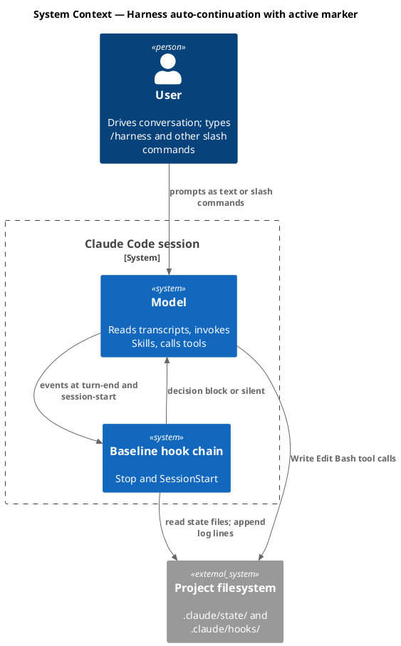
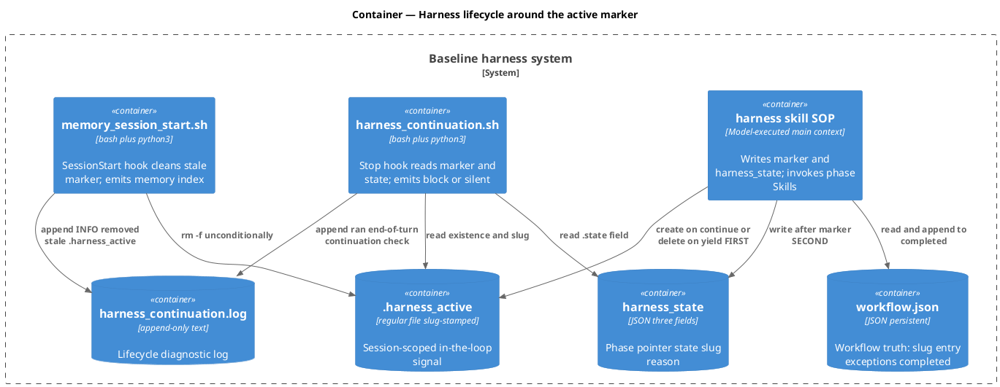
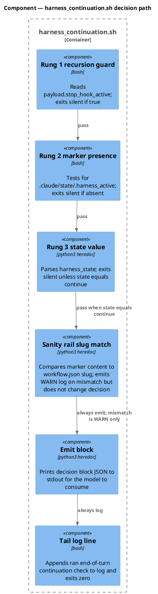
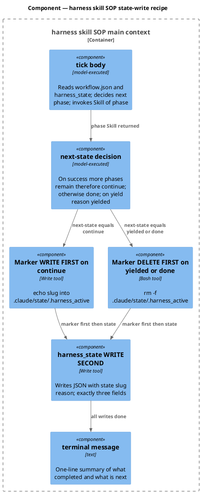
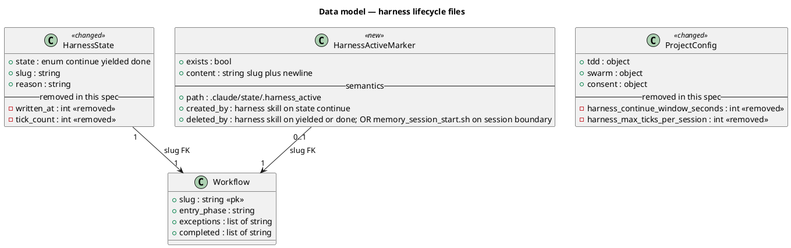
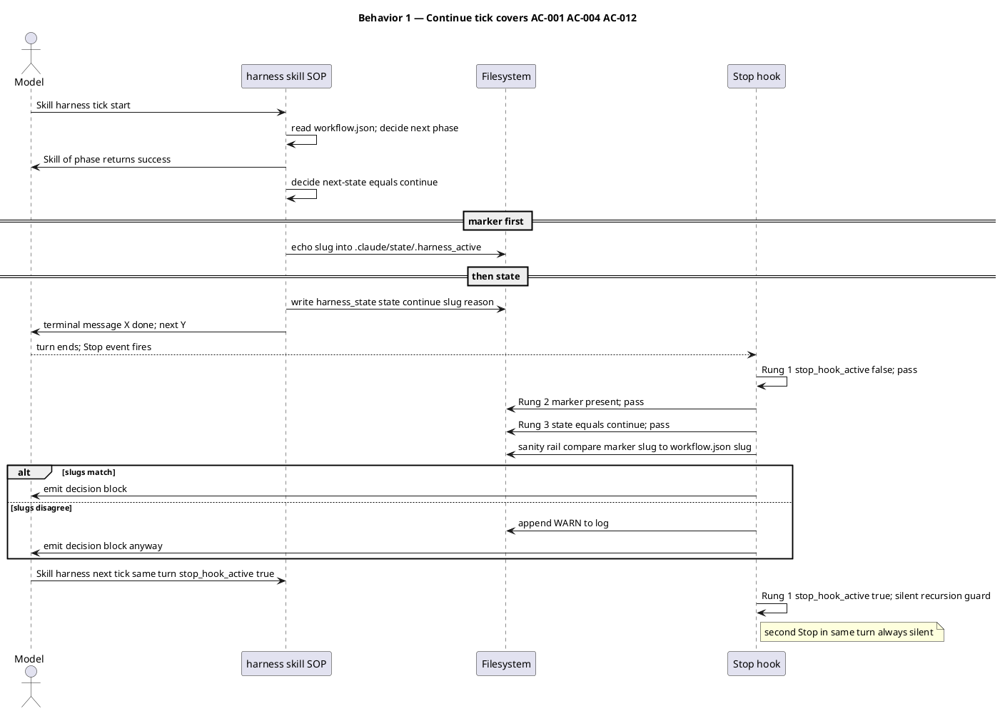
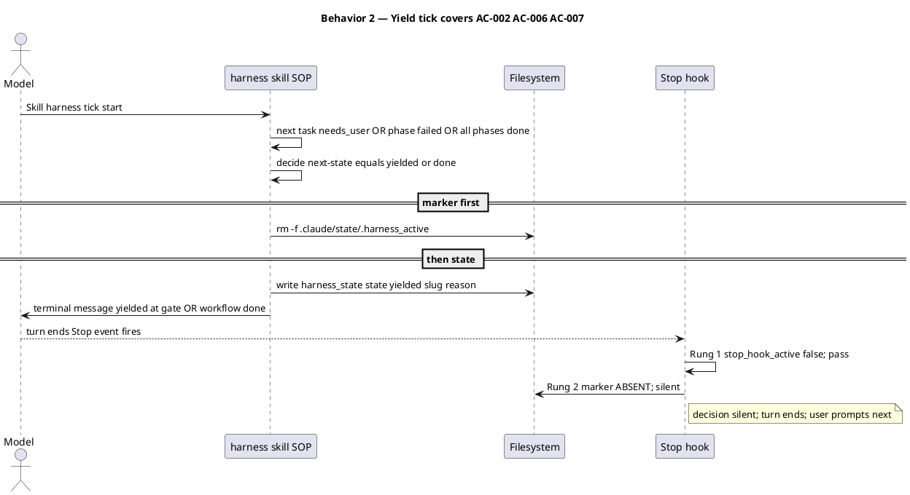
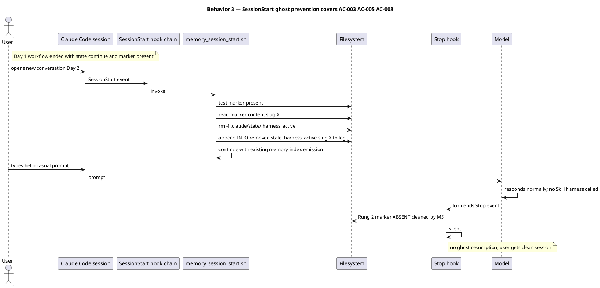
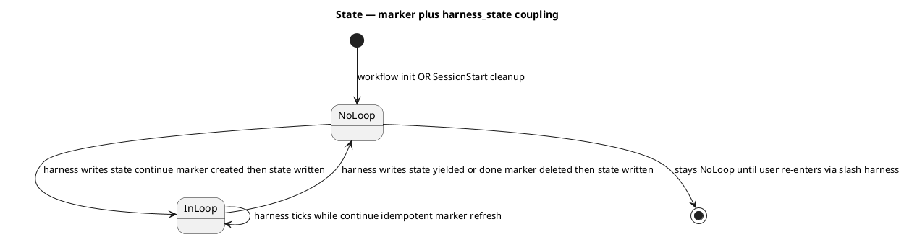
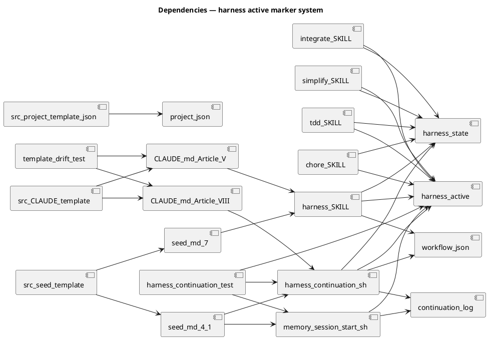

# Spec — Session-scoped active marker replaces the harness_continuation freshness window

<!--
Technical spec. Produced by the `spec` skill.

Guard-enforced invariants:
  - Required ## headings (artifact_template_guard): Goal, Design, Acceptance criteria, Test plan.
  - Required diagram kinds inside ```plantuml``` fences:
        c4_context, c4_container, c4_component, sequence, class, dependency_graph.
  - Every ```plantuml``` fence must parse (plantuml_syntax_guard).

Approval: NEVER add "Status: Approved" — spec_approval_guard blocks it.
-->

## Context

| Input | Path |
|---|---|
| Intake | `docs/intake/harness-active-marker.md` |
| BRD | *(none)* |
| Scout | `docs/scout/harness-active-marker.md` |
| Research | `docs/research/harness-active-marker.md` — all 8 questions decided |

## Goal

`harness_continuation.sh` decides "emit block or stay silent" using three rungs (recursion guard, active marker present, state=continue) instead of five (recursion, file present, state, freshness, tick cap). A session-scoped slug-stamped marker file at `.claude/state/.harness_active` answers "are we in the loop right now?" directly, replacing wall-clock freshness as the discriminator.

## Non-goals

- Transcript-inspection alternatives rejected in research as overengineering.
- `session_id`-payload-based alternatives rejected as adding Claude Code payload dependency.
- Concurrent-tick races — no real concurrency on this codebase.
- A new SessionStart hook — we extend `memory_session_start.sh`.
- A `/harness --abort` slash command — user already has control via any non-`/harness` prompt.
- State-vocab renames — keep `continue` / `yielded` / `done` triad.
- Tunables for the new mechanism — marker existence IS the decision; no knobs.

## Design

Diagrams are the contract. Prose is only for things a diagram cannot say.

### C4 — System context



### C4 — Container



### C4 — Component (changed containers only)





### Data model — class diagram



#### Migration DDL

No relational schema. The migration is file and key removal:

```
Forward:
  1. Each of 5 SKILL.md files (harness, chore, integrate, simplify, tdd) update the state-write recipe to:
     a. ALWAYS marker op FIRST — create on continue, delete on yielded or done.
     b. THEN write harness_state with {state, slug, reason} only.
  2. harness_continuation.sh — drop window and cap reads, drop Rungs 4 (freshness) and 5 (tick cap); add Rung 2 (marker presence) before Rung 3 (state value); add slug-mismatch WARN logging.
  3. memory_session_start.sh — prepend a bash stanza that does rm -f .claude/state/.harness_active and appends INFO removed stale .harness_active to harness_continuation.log if the file existed.
  4. .claude/project.json and src/project.template.json — remove the top-level harness key entirely.
  5. CLAUDE.md and src/CLAUDE.template.md — Article V paragraph amend; Article VIII hook-table row rewrite; byte-equal mirrors.
  6. docs/init/seed.md and src/seed.template.md — section 4.1 intro and section 4.1 hook-table row and section 7 auto-continuation paragraph; src section 16 reservation untouched.
  7. tests/harness_continuation.test.mjs — delete 2 tests, rewrite 1 test, add 5 tests.

Reverse:
  - Revert the PR. Stale marker on disk gets cleaned by next SessionStart.
  - Old harness_state shape (with written_at/tick_count) tolerated by new hook — extra fields ignored.
  - New harness_state shape (3 fields) tolerated by old hook — defaults apply on missing fields.
  - Forward-compat is symmetric in both directions.
```

### Behavior — sequence per AC

Three sequences cover the operational paths. AC rows map to specific sequences in the AC table below.







### State — core entity *(only if stateful)*



### Dependencies — graph



### Contracts

| Kind | Name | Input | Output | Errors | Idempotent |
|---|---|---|---|---|---|
| File | `.claude/state/.harness_active` | n/a — presence is the signal | exists iff in the loop; absent iff not in the loop | n/a | yes |
| File | `.claude/state/harness_state` | n/a | JSON `{state, slug, reason}` — exactly 3 keys | malformed JSON → hook silent | yes — overwrite each write |
| Bash op | marker create | slug | `echo "<slug>" > .claude/state/.harness_active` | n/a | yes |
| Bash op | marker delete | none | `rm -f .claude/state/.harness_active` | no error on absent | yes |
| Hook | `harness_continuation.sh` | Stop payload (stdin JSON) | stdout: block JSON or empty | internal failure → silent exit 0 | yes |
| Hook | `memory_session_start.sh` extended | SessionStart payload | unchanged stdout; side effect: removes marker if present | internal failure on marker op → silent | yes |
| Log row | `harness_continuation.log` lifecycle | n/a | append-only lines: `<ts> ran end-of-turn continuation check` OR `<ts> INFO removed stale .harness_active slug=X` OR `<ts> WARN slug mismatch marker=X workflow=Y` | n/a | append-only |

### Libraries and versions

| Library@version | Purpose | Key APIs | Confirmed via context7 |
|---|---|---|---|
| bash (Apple `/bin/bash` 3.2+ / GNU 4+) | Hook execution | `[ -f ]`, `rm -f`, `echo`, env var passing | n/a — stdlib |
| python3 ≥ 3.8 stdlib | JSON parse + regex in hook heredoc | `json.loads`, `os.path.exists`, `time.strftime`, `re.search` | n/a — stdlib; in use across audit.sh and every hook today |
| node:test (Node ≥ 18.17) | Test runner | `describe`, `it`, `before`, `after`, `assert/strict` | already in use across 21 test files |
| node:fs/promises (Node ≥ 18.17) | Test fixtures | `mkdtemp`, `writeFile`, `rm` | already in use in `tests/harness_continuation.test.mjs` |
| node:child_process (Node ≥ 18.17) | Test invocation of hooks | `execFileSync` | already in use in `tests/harness_continuation.test.mjs` |

No third-party API is introduced. All tooling is stdlib or already-imported in the repo.

### Alternatives considered

| Alt | Summary | Rejected because |
|---|---|---|
| A2 — state first marker second | Inverse write order: harness_state first, then marker | Partial-write on continue-tick leaves state continue plus no marker → hook silent → missed continuation. Exactly the failure mode the redesign is fixing. |
| A3 — collapse into single file | `loop_active` boolean inside `harness_state`; one atomic write | Conflates session-scope ephemeral with phase-pointer persistent intent. The user explicitly rejected this conflation during the conversation. |
| Transcript inspection | Stop hook reads transcript_path; checks last assistant message for Skill harness | Surveyed and rejected as overengineering for a question a marker file answers directly. |
| `session_id` field match | Stamp session_id in harness_state; hook compares to payload session_id | Adds dependency on Claude Code exposing session_id in Stop payload. Marker approach is payload-independent. |
| Bump continue_window_seconds to 60 to 120 seconds | Half-measure: widen the window without redesign | Treats symptom (file write latency) not root cause (wrong-shape abstraction). User explicitly rejected this. |

## Design calls

This spec's write set touches only hooks, skill prose, constitution markdown, project.json, and test files. None intersect `project.json → tdd.ui_globs`. No UI surface.

- *(none)*

## Acceptance criteria

| ID | Criterion (given / when / then) | Upstream AC | Sequence |
|---|---|---|---|
| AC-001 | Given the harness skill writes `harness_state` with `state: continue`, when the write completes, then `.claude/state/.harness_active` exists with contents slug followed by newline. | intake AC1 | Behavior 1 |
| AC-002 | Given the harness skill writes `harness_state` with `state: yielded` for any reason — gate, integrate failure, phase error, done — when the write completes, then `.claude/state/.harness_active` does not exist. | intake AC2 | Behavior 2 |
| AC-003 | Given a SessionStart event fires, when `memory_session_start.sh` runs, then any pre-existing `.claude/state/.harness_active` is removed regardless of contents. | intake AC3 | Behavior 3 |
| AC-004 | Given state continue AND marker exists AND stop_hook_active absent, when `harness_continuation.sh` runs, then it emits decision block JSON to stdout and exits 0. | intake AC4 | Behavior 1 |
| AC-005 | Given state continue AND marker absent — for example post-SessionStart — when the hook runs, then it stays silent: exit 0 with no stdout. | intake AC5 | Behavior 3 |
| AC-006 | Given state yielded AND marker absent, when the hook runs, then it stays silent. | intake AC6 | Behavior 2 |
| AC-007 | Given stop_hook_active true in payload, when the hook runs, then it stays silent regardless of marker and state values. | intake AC7 | Behavior 1 — recursion-guard turn |
| AC-008 | Given marker exists but its slug content disagrees with `workflow.json → slug`, when the hook runs, then it appends one WARN line to `harness_continuation.log` AND continues the three-rung decision unchanged. | intake AC8 | Behavior 1 — sanity rail |
| AC-009 | Given the harness skill writes `harness_state`, when the file is inspected, then it contains only the keys state, slug, reason — no written_at, no tick_count. | intake AC9 | Behavior 1, Behavior 2 |
| AC-010 | Given the redesign has shipped, when `.claude/project.json` is parsed, then the top-level `harness` key is absent; `src/project.template.json` matches; audit-baseline does not assert `harness.*` keys. | intake AC10 | invariant check |
| AC-011 | Given a clean dev tree post-edit, when `bash .claude/skills/audit-baseline/audit.sh` runs, then it exits 0 with zero FAIL rows. | intake AC11 | binding regression check |
| AC-012 | Given two consecutive Stop events within a single user turn — first fire without stop_hook_active, second fire with stop_hook_active true — when the hook runs on each, then the first emits block and the second stays silent. | intake AC12 | Behavior 1 |

## Test plan

Every test lives in `tests/harness_continuation.test.mjs`. Existing fixture pattern (`createTempProject`, `writeHarnessState`, `invokeHook`, `defaultPayload`) is reused. SessionStart tests invoke `memory_session_start.sh` directly via `execFileSync`.

| Category | Scenario | Expected | Covers |
|---|---|---|---|
| Golden path rewrite | `test_stop_hook_emits_block_when_state_is_continue_and_marker_present` rename of `_fresh_and_under_cap` | exit 0; stdout contains decision block JSON | AC-004 |
| Golden path new | `test_stop_hook_silent_when_marker_absent` | exit 0; stdout empty when state continue but no marker | AC-005 |
| Golden path keep | `test_stop_hook_silent_when_stop_hook_active_true` | exit 0; stdout empty | AC-007 |
| Boundary keep | `test_stop_hook_silent_when_harness_state_missing` | exit 0; stdout empty | defensive — preserves existing |
| Boundary keep | `test_stop_hook_silent_when_harness_state_malformed_json` | exit 0; stdout empty | defensive |
| Boundary keep | `test_stop_hook_silent_when_state_is_yielded` | exit 0; stdout empty | AC-006 |
| Boundary delete | `test_stop_hook_silent_when_written_at_is_stale` | DELETE — mechanism removed | n/a |
| Boundary delete | `test_stop_hook_silent_when_tick_count_at_cap` | DELETE — mechanism removed | n/a |
| Sanity rail new | `test_stop_hook_logs_warn_on_slug_mismatch` | marker contents wrong-slug; workflow slug right-slug; WARN appended; decision unchanged | AC-008 |
| State shape new | `test_harness_state_is_3_fields_only` in post-refactor invariants block | asserts keys exactly state slug reason | AC-009 |
| Project config new | `test_project_json_has_no_harness_key` in post-refactor invariants block | reads project.json; asserts harness absent | AC-010 |
| SessionStart cleanup new | `test_memory_session_start_removes_stale_marker` in new describe block | seed marker; invoke memory_session_start.sh; assert marker removed AND INFO log line appended | AC-003 |
| In-turn chain new | `test_stop_hook_chain_within_turn` | first invocation stop_hook_active false emits block; second invocation stop_hook_active true silent | AC-012 |
| Regression trap binding | audit-baseline exits 0 on clean post-edit tree | full audit PASS | AC-011 |

## Implementation files

| Path | Change |
|---|---|
| `.claude/hooks/harness_continuation.sh` | Rewrite the python heredoc body. Drop window and cap reads at current lines 65-77. Drop Rung 4 freshness check at 80-86. Drop Rung 5 tick-cap check at 88-95. Add bash-level Rung 2 marker presence check after current Rung 1: `[ -r "$STATE_DIR/.harness_active" ] || exit 0`. Inside the python heredoc add a slug-mismatch sanity check: read marker, compare to `workflow.json.slug`, log WARN to `harness_continuation.log` if disagree; do not change decision. Update header comment block from Five-rung silence ladder to Three-rung gate. |
| `.claude/hooks/memory_session_start.sh` | Add a new bash stanza near the top, after `read_payload` at line 14 and before the python heredoc at line 24. If `[ -f "$CLAUDE_DOTDIR/state/.harness_active" ]`, read its slug content into a local var, `rm -f` the file, and append a one-line entry to `$LOG_DIR/harness_continuation.log` of the form `<ts> INFO removed stale .harness_active slug X`. |
| `.claude/skills/harness/SKILL.md` | Rewrite Per-tick atomicity section. State-file shape JSON block drops `written_at` and `tick_count` — 3 keys only. Add explicit marker-then-state ordering instruction: on continue echo slug into `.claude/state/.harness_active` FIRST then write harness_state; on yielded or done `rm -f .claude/state/.harness_active` FIRST then write harness_state. Remove the Tunables in project.json harness block entirely. |
| `.claude/skills/chore/SKILL.md` | Update line ~84 state-write recipe — drop `written_at` and `tick_count` from the write; add marker create/delete-FIRST instruction. |
| `.claude/skills/integrate/SKILL.md` | Update line ~51 same way. |
| `.claude/skills/simplify/SKILL.md` | Update lines 60 continue branch and 61 yielded branch same way. |
| `.claude/skills/tdd/SKILL.md` | Update line 83 same way. |
| `CLAUDE.md` | Article V Per-tick atomicity para at line ~105 amend: mention marker as session-scope signal alongside state. Article VIII hook-table row for harness_continuation at line 200 rewrite from 5-rung wording to 3-rung gate. Drop references to `harness.continue_window_seconds` and `harness.max_ticks_per_session`. |
| `src/CLAUDE.template.md` | Byte-identical mirror of CLAUDE.md edits. template-drift.test.mjs enforces. |
| `docs/init/seed.md` | Section 4.1 intro at line 141 mention marker. Section 4.1 hook-table row at line 167 rewrite to 3-rung. Section 7 Auto-continuation para at line 358 drop fresh written_at and tick_count under cap clauses; mention marker. |
| `src/seed.template.md` | Mirror of seed.md edits. Section 16 reservation preserved. Audit enforces. |
| `.claude/project.json` | Remove the top-level `harness` key entirely. No children remain after subkey removal per research Q4. |
| `src/project.template.json` | Mirror. |
| `tests/harness_continuation.test.mjs` | DELETE 2 tests: `test_stop_hook_silent_when_written_at_is_stale`, `test_stop_hook_silent_when_tick_count_at_cap`. REWRITE 1 — happy-path test loses `_fresh_and_under_cap` suffix. ADD 5 tests per Test plan: marker_absent, slug_mismatch, harness_state_is_3_fields, project_json_has_no_harness_key, in_turn_chain. ADD new describe block with `test_memory_session_start_removes_stale_marker`. |

## Observability

| Signal | Name | Shape | Purpose |
|---|---|---|---|
| Log | `harness_continuation.log` | append-only lines — `<ts> ran end-of-turn continuation check`, `<ts> INFO removed stale .harness_active slug X`, `<ts> WARN slug mismatch marker X workflow Y` | Diagnostic source of truth for harness lifecycle |
| Log | `memory_session_start.log` | unchanged | Existing memory-index emission diagnostics |
| Metric | n/a | — | Hook-level; no runtime aggregation |
| Alarm | CI gate | audit-baseline non-zero on PR | Block merge if audit fails |

## Rollout

- **Feature flag**: *(none)* — governance plus hook prose, not toggleable runtime behavior.
- **Migration order**: 1) update 5 SKILL.md state-write recipes; 2) update `harness_continuation.sh` decision logic; 3) update `memory_session_start.sh` with marker-cleanup stanza; 4) update CLAUDE.md plus src/CLAUDE.template.md byte-equal; 5) update seed.md plus src/seed.template.md; 6) remove `harness` key from project.json plus src/project.template.json; 7) update tests/harness_continuation.test.mjs (delete 2, rewrite 1, add 5); 8) run audit-baseline to confirm zero FAIL.
- **Canary**: n/a — single internal PR; create-baseline not yet npm-published.

## Rollback

- **Kill-switch**: revert the PR. Any in-flight `.harness_active` marker on disk is cleaned by the next SessionStart — idempotent. Any `harness_state` written in the new 3-field shape is readable by old code which reads only `.state`. Any `harness_state` written in the old 5-field shape is readable by new code — extra fields ignored. Forward-compat is symmetric.
- **Signal to roll back**: any reproducible audit-baseline failure post-merge tracing to the new hook OR an in-turn chain regression — a `state: continue` write that consistently fails to fire a block on the next Stop event. Detection window under 5 minutes: audit fails in CI immediately; in-turn chain regressions show up on the first /harness use post-merge.

## Archive plan

- Defaults *(automatic)*: intake, scout, research, spec, spec-rendered/, spec approval. No swarm plan since non-git workflow.
- Extras *(non-default)*:
  - *(none)*

## Open questions

- None blocking. Research decided all 8 implementation questions. The spec adopts every recommendation verbatim. `/approve-spec` may proceed once the reviewer has read the diagrams and ACs.
