# Spec — harness auto-continuation across non-yield workflow phases

<!--
Technical spec. Produced by the `spec` skill.

Guard-enforced invariants:
  - Required ## headings (artifact_template_guard, project.json → artifacts.required_sections.spec):
        Goal, Design, Design calls, Acceptance criteria, Test plan.
  - Required diagram kinds inside ```plantuml``` fences
    (spec_diagram_presence_guard, configured in project.json →
     artifacts.required_diagrams.spec):
        c4_context, c4_container, c4_component,
        sequence, class, dependency_graph.
  - Every ```plantuml``` fence must parse (plantuml_syntax_guard).

Approval: NEVER add "Status: Approved" — spec_approval_guard blocks it.
Approval is a token written by /approve-spec.
-->

## Context

| Input | Path |
|---|---|
| Intake | `docs/intake/harness-auto-continuation.md` |
| BRD | *(none — internal architecture)* |
| Scout | `docs/scout/harness-auto-continuation.md` |
| Research | `docs/research/harness-auto-continuation.md` |

## Goal

After this spec ships, the 11-phase workflow advances autonomously through every non-gated phase using a Stop-event hook plus a single-file state machine; the user types nothing between non-gated phases, and the only user-prompt boundaries are consent gates and integrate-failure-needs-spec-change decisions.

## Non-goals

- Not changing the semantics of consent gates A/B/C (`/approve-spec`, `/approve-swarm`, `/grant-commit`). They remain structurally un-forge-able per Article IV.
- Not editing any vendored skill (`impeccable`, `humanizer`, `code-structure`, `documentation`, `technical-tutorials`, `copywriting`, `claude-automation-recommender`) — Article IX.
- Not adding a new subagent — Article II reserves subagents for `/swarm-dispatch` only; auto-continuation runs in main context.
- Not changing the byte format of `.claude/state/last_test_result`. The `verify_pass_guard` hook reads line 1 of this file as the single source of truth.
- Not introducing a polling loop or sleep-based continuation. The mechanism is event-driven via the Stop hook.
- Not changing the `swarm-dispatch` worker subagent model — workers have their own turn-loop and do not exhibit the parent-SOP-resume pause.

## Design

Diagrams are the contract. Prose is only for things a diagram cannot say.

### C4 — System context

Who interacts with the system, and which external systems it depends on.

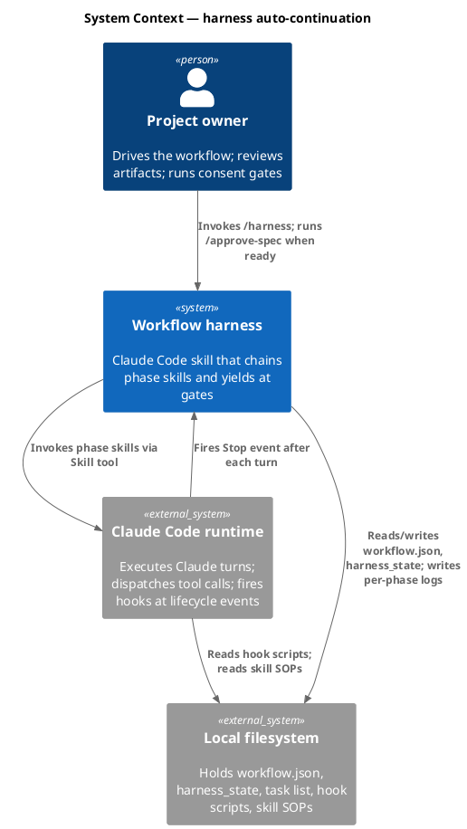

### C4 — Container

Deployable units inside the system boundary and how they communicate.

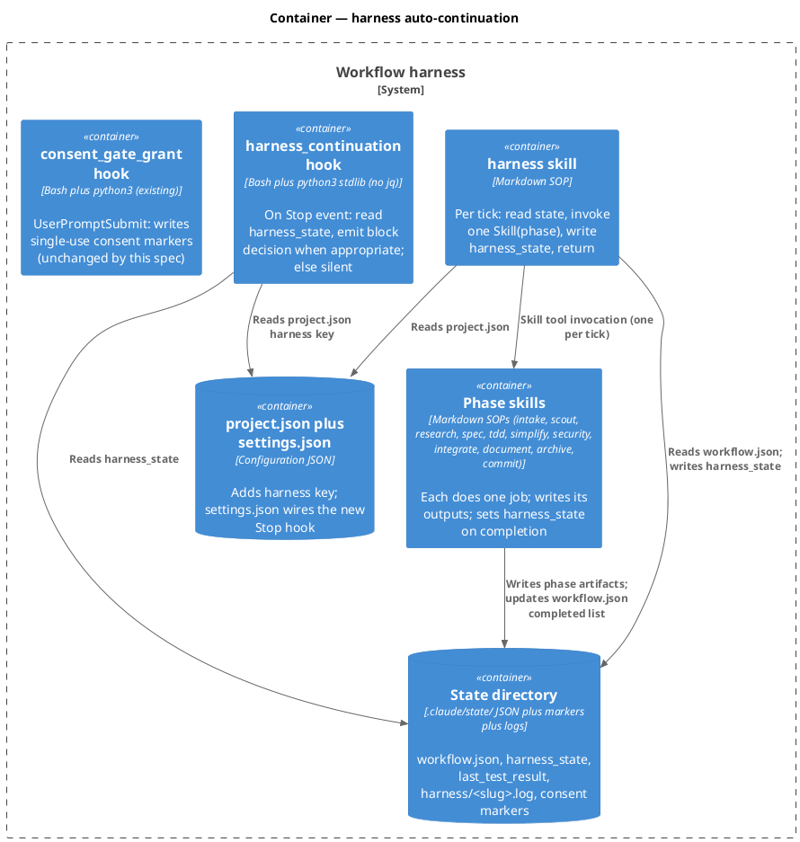

### C4 — Component (changed containers only)

#### Component: harness skill (per-tick lifecycle)

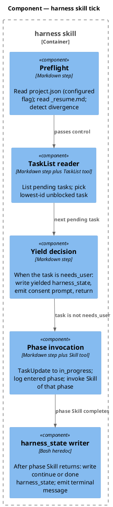

#### Component: harness_continuation Stop hook (5-rung detection ladder)

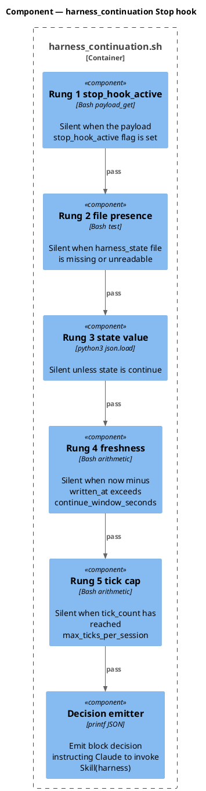

#### Component: tdd coordinator (decomposition source)

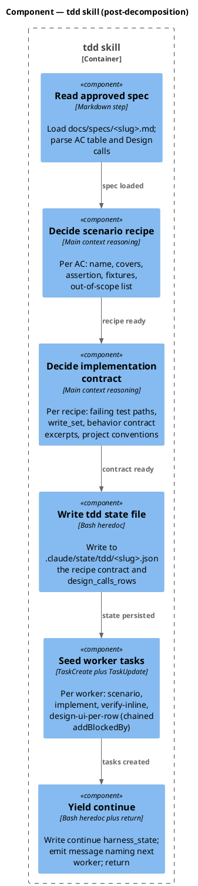

### Data model — class diagram

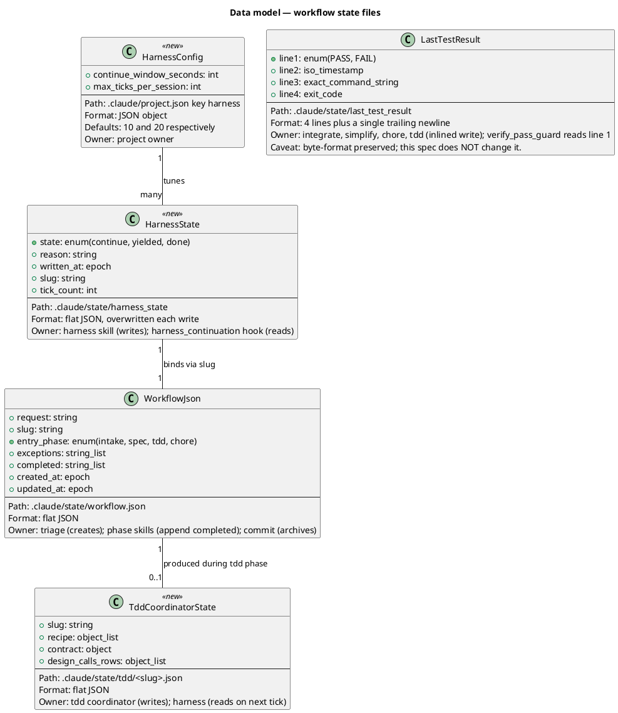

#### File-state mutations (DDL equivalent)

This work has no database. The "DDL" is a set of file-state mutations applied atomically when this spec lands.

```sql
-- forward (paths relative to project root)
CREATE FILE .claude/hooks/harness_continuation.sh
  WITH MODE 0755
  WITH CONTENT (see Behavior #1 plus Component: harness_continuation);

UPDATE .claude/settings.json
  SET hooks.Stop = APPEND_HOOK("harness_continuation.sh")
  AFTER hook "memory_stop.sh";

UPDATE .claude/project.json
  ADD KEY "harness" = {
    "continue_window_seconds": 10,
    "max_ticks_per_session": 20
  };

UPDATE .claude/skills/harness/SKILL.md
  DELETE FRONTMATTER KEY "disable-model-invocation"
  REPLACE SOP BODY (per Component: harness skill tick);

UPDATE .claude/skills/verify/SKILL.md
  ADD FRONTMATTER KEY "disable-model-invocation: true"
  REPLACE BODY (contract-only doc describing the 4-line last_test_result format);

UPDATE .claude/skills/integrate/SKILL.md
  REPLACE STEP 2 (was: "Invoke verify")
  WITH inlined verify ops plus harness_state write (per Behavior #1);

UPDATE .claude/skills/simplify/SKILL.md
  REPLACE STEP 5 (was: "Invoke Skill(verify)")
  WITH inlined verify ops;

UPDATE .claude/skills/chore/SKILL.md
  REPLACE STEP 4 (was: "Invoke Skill(verify)")
  WITH inlined verify ops;

UPDATE .claude/skills/tdd/SKILL.md
  REPLACE BODY (was: 8 steps nesting Skill(scenario, implement, verify, design-ui))
  WITH thin coordinator (per Component: tdd coordinator);

UPDATE .claude/skills/audit-baseline/audit.sh
  ADD "harness_continuation" TO EXPECTED_HOOKS set
  UPDATE COMMENT "(3)" to "(4)" for lifecycle hooks section;

UPDATE CLAUDE.md
  REWRITE Article V "user-only" paragraph plus Step 1 of /harness section
  ADD ROW TO Article VIII hook table (harness_continuation, Stop, Art. V);

UPDATE docs/init/seed.md
  REWRITE 4.1 header "(21 total)" to "(22 total)" plus update component breakdown
  ADD ROW TO 4.1 hook table for harness_continuation;

UPDATE README.md
  REPLACE line near 14 "21 baseline hooks" with "22 baseline hooks"
  REPLACE line near 308 LAYOUT TREE COMMENT "21 hook scripts" with "22 hook scripts";

-- reverse (rollback)
DELETE FILE .claude/hooks/harness_continuation.sh;
REVERT all UPDATEs above to prior content via git checkout (or, on non-git
projects, restore from the docs/archive bundle this spec's run produced).
```

### Behavior — sequence per AC

Each sequence is the contract. Section anchors here are referenced from the Acceptance criteria table.

#### Behavior #1 — auto-continuation happy path (AC-001)

The user is silent between non-gated phases. After `/integrate` stamps PASS, the next phase fires on the same turn via the Stop hook.

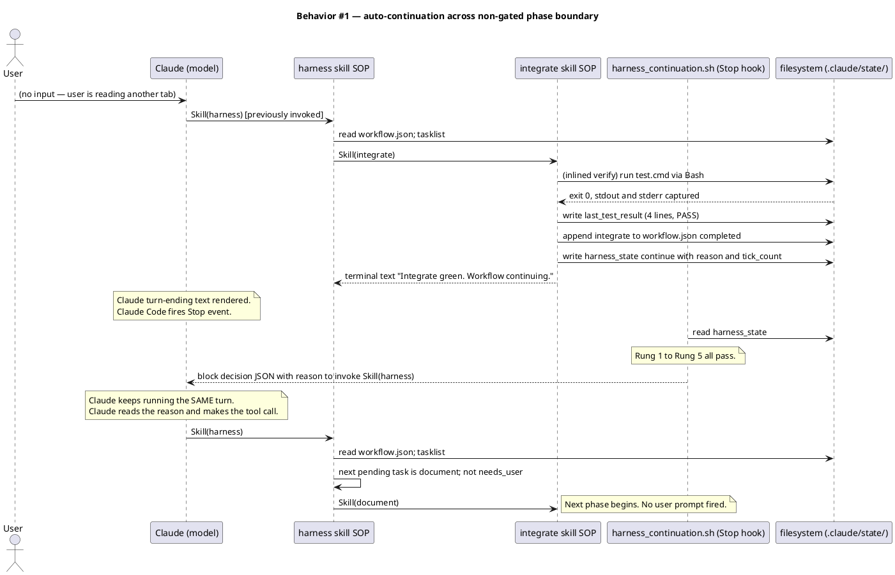

#### Behavior #2 — gate yield (AC-002)

After `/spec` writes the spec, harness yields at the consent gate; the Stop hook stays silent.

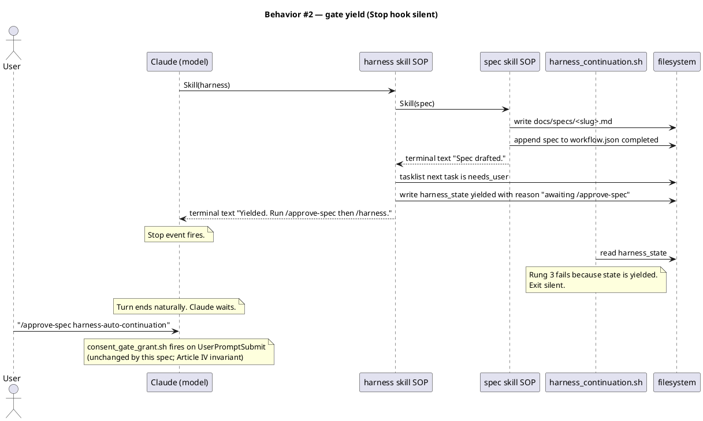

#### Behavior #3 — tdd decomposition (AC-004)

`/tdd` becomes a thin coordinator. Workers (scenario, implement, verify-inline, design-ui) run as separate harness ticks.

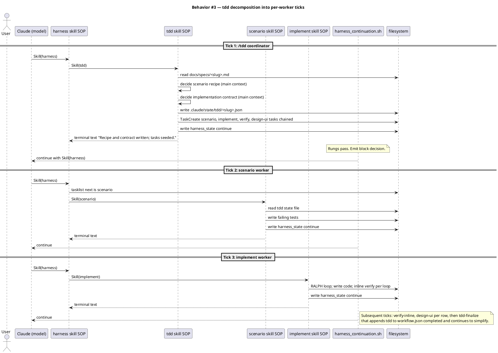

### State — core entity

The `HarnessState` finite-state model.

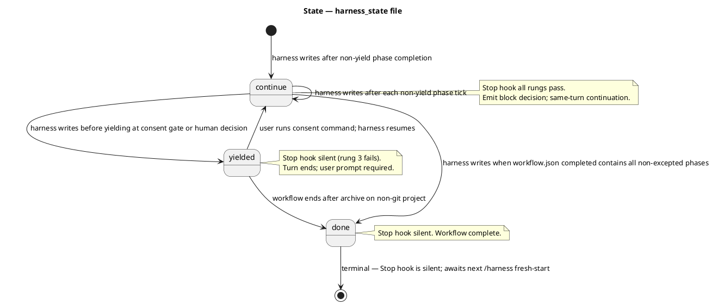

### Dependencies — graph

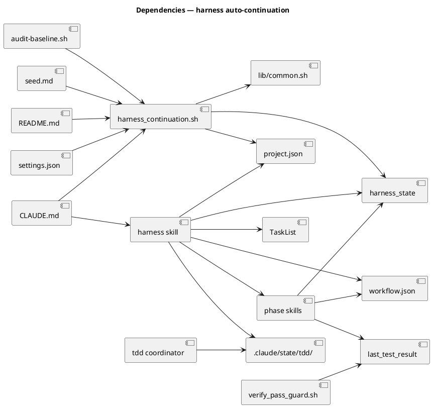

### Contracts

| Kind | Name | Input | Output | Errors | Idempotent |
|---|---|---|---|---|---|
| Hook | `harness_continuation.sh` (Stop event) | JSON payload on stdin (`session_id`, `transcript_path`, `cwd`, optional `stop_hook_active`) | Stdout: empty (silent) OR `{"decision":"block","reason":"..."}` | Hook exit non-zero is treated as hook failure; treat all internal failures as silent (exit 0) | yes (re-reading harness_state yields the same decision) |
| File | `.claude/state/harness_state` | — | Flat JSON `{state, reason, written_at, slug, tick_count}` | Missing or unparseable: Stop hook silent | yes (overwrite each write) |
| Config | `.claude/project.json` `harness` key | — | `{continue_window_seconds: int (default 10), max_ticks_per_session: int (default 20)}` | Missing keys use defaults | yes |
| File | `.claude/state/tdd/<slug>.json` | — | Flat JSON `{recipe[], contract, design_calls_rows[]}` | Missing on tdd-worker tick: harness surfaces error to user; abort tdd | yes (overwrite each write) |
| File | `.claude/state/last_test_result` | — | 4 lines: PASS or FAIL, ISO timestamp, exact command, exit code, trailing newline | Byte format unchanged from current; verify_pass_guard reads line 1 | yes (overwrite each write) |

### Libraries and versions

This work uses only the Bash and python3 standard library substrate already used by every hook script. No third-party libraries are added. The `context7` MCP confirmation requirement does not apply because no third-party APIs are introduced.

| Library@version | Purpose | Key APIs | Confirmed via context7 |
|---|---|---|---|
| bash@5.x (system) | Hook script substrate | `[[ ... ]]`, parameter expansion, heredocs | n/a (system shell) |
| python3@3.x (system) | JSON parsing, file ops | `json.load`, `json.dump`, `pathlib.Path`, `datetime` | n/a (stdlib) |
| Claude Code hook contract | Stop event JSON I/O | `decision: "block"`, `reason`, `stop_hook_active` | yes via the claude-code-guide subagent on 2026-05-12; sources: [Claude Code Hooks Reference](https://code.claude.com/docs/en/hooks), [hook-development SKILL.md](https://github.com/anthropics/claude-code/blob/main/plugins/plugin-dev/skills/hook-development/SKILL.md) |

### Alternatives considered

| Alt | Summary | Rejected because |
|---|---|---|
| A | Stop hook emits `hookSpecificOutput.additionalContext` to inject text into Claude's NEXT turn; user must prompt to fire next turn | Not auto-continuation. The user would still need to type something between phases. Same problem as the bug. |
| B | Stop hook returns `decision: "block"` but with a vague reason like "continue silently" and no Skill(harness) directive | Claude has no instruction for what to do; behavior is unspecified. Stop hook control of continuation depends on the reason being a concrete directive. |
| C | Rebuild every parent SOP so its post-Skill step is itself a forced tool call (the original "structural SOP-text patch" plan) | Doesn't scale to the 13 risky sites identified in scout; brittle to future refactors; doesn't address the user's principle that "skills are independent, harness chains." |
| D | Move verify into its own workflow phase (option c from earlier conversation: workers become harness ticks AND get phase-level visibility in workflow.json) | track_guard.sh and project.json workflow.phases churn; conditional invocation (design-ui only when ui_globs intersect; verify multiple times per RALPH iteration) doesn't fit phase-ordering model. Confirmed at OQ-5 (research). |
| E | Add a per-tick marker file `.harness_tick` instead of using harness_state.written_at freshness | Extra state file; redundant with information already in harness_state; harness must clean up marker on every yield path (easy to miss). |
| F | Walk the session transcript inside the Stop hook to confirm "last assistant tool_use was Skill(harness)" | Parse cost on every Stop event. Doubles transcript walks (memory_stop.sh already walks it). On large sessions (50 MB or larger), risk of hook timeout. harness_state freshness check is structurally equivalent and O(1). |

## Design calls

This spec's `write_set` does not intersect `project.json → tdd.ui_globs`. The intersection check:

- `write_set` paths: `.claude/skills/{harness,verify,integrate,simplify,chore,tdd}/SKILL.md`, `.claude/hooks/harness_continuation.sh`, `.claude/settings.json`, `.claude/project.json`, `.claude/skills/audit-baseline/audit.sh`, `CLAUDE.md`, `docs/init/seed.md`, `README.md`.
- `tdd.ui_globs`: `site-src/**`, `app/**/*.{tsx,jsx}`, `components/**/*.{tsx,jsx,vue,svelte}`, `pages/**/*.{tsx,jsx,vue,svelte}`, `src/**/*.{tsx,jsx,vue,svelte}`, `**/*.html`, `**/*.css`, `**/*.scss`, `**/*.njk`.

Intersection: none. No UI surfaces touched. `spec_design_calls_guard` permits the spec without a populated table.

- *(none)*

## Acceptance criteria

| ID | Criterion (given / when / then) | Upstream AC | Sequence |
|---|---|---|---|
| AC-001 | Given an open workflow at any non-gated, non-excepted phase, when that phase's skill stamps completion (writes `harness_state.state == "continue"`), then the next user prompt is NOT required; the Stop hook emits `decision:block` and Claude invokes `Skill(harness)` on the same turn. Evidence: session JSONL of this slug's `/integrate` run shows zero `type:"user"` events between integrate completion and document start. | intake AC-001 | §Behavior #1 |
| AC-002 | Given a phase whose next pending task carries `metadata.needs_user == true`, when the phase ends, then harness writes `harness_state.state == "yielded"` and the Stop hook stays silent (rung 3 fails). Evidence: session JSONL shows the user's `/approve-spec` prompt as the immediately-following `type:"user"` event. | intake AC-002 | §Behavior #2 |
| AC-003 | Given the post-refactor codebase, `grep '^disable-model-invocation:' .claude/skills/harness/SKILL.md` returns no match; `grep -F '"user-only"' CLAUDE.md` returns no match in the context of `/harness`. | intake AC-003 | §Behavior #1 (model invokes Skill(harness)) |
| AC-004 | Given a `/tdd` invocation in the post-refactor codebase, `grep -E 'Skill\((scenario\|implement\|verify\|design-ui)\)' .claude/skills/tdd/SKILL.md` returns no match. A `/tdd` run on a fixture spec produces 4 or more entries in `.claude/state/harness/<slug>.log` (entered scenario, entered implement, etc.) and 4 or more mid-workflow TaskCreate entries. | intake AC-004 | §Behavior #3 |
| AC-005 | Given a caller of inlined verify (integrate, simplify, chore), the post-run `.claude/state/last_test_result` is byte-identical to the format spec: PASS or FAIL line, ISO timestamp line, exact command line, exit code line, trailing newline. `verify_pass_guard.sh` continues to read line 1 successfully. `grep -F 'Skill(verify)' .claude/skills/{integrate,simplify,chore,tdd}/SKILL.md` returns no match. | intake AC-005 | §Behavior #1 (inlined verify) |
| AC-006 | The `harness_continuation.sh` script contains no string matching `_approval_grant` or `_consent_grant`. Article IV consent gates (spec_approval_guard, swarm_approval_guard, git_commit_guard, consent_gate_grant) remain unmodified. Pre-existing approval-guard tests still pass. | intake AC-006 | §Behavior #2 (consent_gate_grant unchanged) |
| AC-007 | `bash .claude/skills/audit-baseline/audit.sh` exits 0. `EXPECTED_HOOKS` set contains `harness_continuation`. The (3) to (4) comment update is present. CLAUDE.md Article VIII hook table has the new row. seed.md 4.1 header reads "(22 total)" with 4 lifecycle hooks. README.md count references updated to 22. | intake AC-007 | — |
| AC-008 | `node --test --test-reporter=spec tests/*.test.mjs` exits 0 with 104 or more passing tests (the pre-refactor baseline). New tests cover the Stop-hook five-rung ladder, the harness_state write protocol, and the gate-yield silence behavior. | intake AC-008 | — |
| AC-009 | Across this slug's full happy-path run (`/intake` through `/archive`), the session JSONL contains exactly one user prompt that is a consent-gate slash command (`/approve-spec harness-auto-continuation`). Any other user prompts in the run are user-volunteered (review or inspection prompts), not bug-symptom "continue" prompts. Evidence: session JSONL post-archive analysis. | intake AC-009 | §Behavior #1 plus §Behavior #2 |
| AC-010 | The Stop hook is safe to fire when no harness work is in progress: silent when `.claude/state/harness_state` is missing, malformed, stale (older than `continue_window_seconds`), or absent of `state == "continue"`. Unit tests cover each silent case. | intake AC-010 | §Component: harness_continuation Stop hook |

## Test plan

Scenarios by category. The `scenario` skill turns these into failing tests; the test layout matches the existing `tests/*.test.mjs` convention.

| Category | Scenario | Expected | Covers |
|---|---|---|---|
| Golden path | Stop hook fires after harness writes continue state with fresh written_at and tick_count under cap | emits block decision JSON to stdout; exit 0 | AC-001 |
| Golden path | tdd coordinator writes tdd state file and seeds N worker tasks; harness next tick invokes scenario | tdd state file present; N TaskList entries with addBlockedBy chain | AC-004 |
| Golden path | Inlined verify writes last_test_result from integrate context | file is 4 lines plus trailing newline; line 1 is PASS or FAIL | AC-005 |
| Input boundary | Stop hook fires with stop_hook_active true on input payload | silent (exit 0, no stdout) | AC-010 |
| Input boundary | Stop hook fires with harness_state missing | silent | AC-010 |
| Input boundary | Stop hook fires with harness_state malformed (truncated JSON) | silent; log line in `.claude/state/logs/harness_continuation.log` | AC-010 |
| Input boundary | Stop hook fires with state yielded | silent | AC-002, AC-010 |
| Input boundary | Stop hook fires with state continue but written_at older than continue_window_seconds | silent | AC-010 |
| Input boundary | Stop hook fires with state continue and tick_count at or above max_ticks_per_session | silent plus warning log line | AC-010 |
| Contract violation | harness frontmatter contains `disable-model-invocation: true` after refactor | test asserts absence | AC-003 |
| Contract violation | any post-refactor parent skill contains `Skill(verify)` text | test asserts absence | AC-005 |
| Concurrency / ordering | Two harness ticks in the same turn: first writes continue state; Stop hook fires; second tick reads same state file | second tick reads the LATEST harness_state (the second write overwrites the first) | AC-001 |
| Failure mode | harness_state write fails (simulated read-only filesystem) | phase skill surfaces error to user; harness does NOT write a stale state; turn ends; user re-invokes /harness manually | AC-001 (negative case) |
| Failure mode | verify-inline test command times out at project.json test.timeout_seconds | exit code 124 (timeout); last_test_result records FAIL with exit 124; harness writes yielded state with reason "verify FAIL needs user decision" | AC-005 plus Integrate-failure decision tree |
| Regression trap | verify_pass_guard.sh continues to read last_test_result line 1 and emit allow or block correctly | unchanged behavior; existing verify_pass_guard tests still pass | AC-005, AC-006 |
| Regression trap | consent_gate_grant.sh, spec_approval_guard.sh, swarm_approval_guard.sh, git_commit_guard.sh unchanged | byte-diff against pre-refactor versions returns no diff | AC-006 |
| Regression trap | `bash .claude/skills/audit-baseline/audit.sh` exits 0 | pass | AC-007 |
| Regression trap | end-to-end: this slug's own run produces exactly one consent-gate user prompt across the workflow | session JSONL grep | AC-001, AC-002, AC-009 |

## Observability

| Signal | Name | Shape | Purpose |
|---|---|---|---|
| Log | `harness_continuation` | one line per Stop fire: `<ISO ts> harness_continuation <decision> [tick_count] [reason]` written to `.claude/state/logs/harness_continuation.log` | Audit which Stop events fired vs stayed silent; reconstruct workflow runs |
| Log | `harness` | per-tick entry to `.claude/state/harness/<slug>.log`: `<ISO ts> entered <phase>` or `completed <phase>` or `yielded at <gate>` | Track phase transitions across a workflow; visible in audit plus post-mortem |
| File state | `harness_state` | The state file itself doubles as observability: `cat .claude/state/harness_state` shows the most recent tick's decision | Live debugging during workflow runs |
| Tick counter | `harness_state.tick_count` | int per workflow run | Detect runaway loops; cap enforced at rung 5 |

There are no metrics or alarms in this design. This is in-process workflow orchestration with no production SLO. The observability surface is logs plus a state file inspectable via `cat`.

## Rollout

- **Feature flag**: none. This is an architectural refactor of an internal workflow harness; there is no user-traffic split to gate. The change ships in one commit (or one archive bundle on this non-git project).
- **Migration order**:
  1. Add `.claude/hooks/harness_continuation.sh` (new hook script).
  2. Update `.claude/settings.json` to wire the new hook in the Stop event list.
  3. Update `.claude/project.json` to add the `harness` key with default values.
  4. Update `.claude/skills/audit-baseline/audit.sh` (`EXPECTED_HOOKS` set plus comment update). **Audit-baseline begins passing.**
  5. Update `.claude/skills/harness/SKILL.md` (frontmatter flip plus SOP rewrite).
  6. Update `.claude/skills/verify/SKILL.md` (frontmatter add plus body rewrite to contract-only).
  7. Update `.claude/skills/{integrate,simplify,chore}/SKILL.md` (inline verify in each).
  8. Update `.claude/skills/tdd/SKILL.md` (thin coordinator).
  9. Update `CLAUDE.md` (Article V plus Article VIII).
  10. Update `docs/init/seed.md` (4.1 header plus table row).
  11. Update `README.md` (line near 14, line near 308).
- **Canary**: none. The first end-to-end run of the new harness is the canary, observed live during this slug's `/integrate` to `/document` to `/archive` sequence.
- **First-run validation**: the user observes auto-continuation on this slug's own integrate phase. If the Stop hook fails to fire, falls back to manual /harness re-invocation (the existing model).

## Rollback

- **Kill-switch**: revert by removing the `harness_continuation` entry from `.claude/settings.json` hooks Stop list. The Stop hook stops firing; harness reverts to user-driven re-invocation (the existing pre-refactor model). Other files can stay in the refactored state without breaking — the rest of the changes (verify inlining, tdd decomposition, frontmatter flip) function independently of the Stop hook.
- **Full rollback**: restore all 11 files listed in §Migration DDL to their pre-refactor content via the docs/archive bundle from this run (`docs/archive/<date>/harness-auto-continuation/`). Run `bash .claude/skills/audit-baseline/audit.sh` to confirm the baseline is back to the 21-hook configuration.
- **Signal to roll back**: any of the following observed within the first run after refactor:
  - Stop hook fires in a loop (tick_count cap not preventing runaway).
  - Stop hook emits `decision:block` at a consent-gate boundary (gate yield broken).
  - `audit-baseline.sh` exits non-zero post-refactor.
  - `verify_pass_guard.sh` blocks a legitimate verify write (last_test_result format mismatch).
- **Detection window**: the first full workflow run (this slug's own `/integrate` to `/archive`) is the detection window. If any of the four signals above trip, roll back before the next workflow.

## Archive plan

When this spec ships, the `archive` skill (Phase 10.5) moves the following into `docs/archive/<ship-date>/harness-auto-continuation/`. The slug-matched defaults are the standard bundle.

- Defaults *(automatic — slug-matched)*: `intake.md`, `scout.md`, `research.md`, `spec.md`, `spec-rendered/` (if `/spec-render` produced output), `security.md` (Phase 8 output).
- Extras *(non-default files)*:
  - *(none)*

## Open questions

Issues that came up during spec drafting; they DO NOT block approval but should be resolved during implementation or named as follow-ups.

- **OQ-A — `continue_window_seconds` exact default.** Research recommended 10 s. Spec confirms 10 s for the initial implementation; tunable via `project.json` harness.continue_window_seconds. If 10 s proves too tight on slow filesystems, bump to 30 s without a spec change.
- **OQ-B — `max_ticks_per_session` exact default.** Spec sets 20. A typical workflow run has around 11 phase ticks plus worker decompositions during /tdd; 20 leaves headroom. If real-world runs approach 20 routinely, revisit.
- **OQ-C — Article V exact prose.** Spec captures the contract change (auto-continuation, model-invokable harness, Stop-hook-driven advance). `/document` polishes the actual replacement paragraph; this spec does not draft the precise new sentence.
- **OQ-D — `tdd-step-6.test.mjs` post-decomposition shape.** The current test asserts `/tdd` Step 6's design-ui per-row invocation. After decomposition, the test should assert (a) `/tdd` coordinator writes the expected tdd state file given a fixture spec with design_calls_rows; (b) the harness's next tick reads it and invokes design-ui per row. Implementation refines the assertion shape; spec only commits to the decomposition contract.
- **OQ-E — `harness_state` write failure handling.** If a phase skill cannot write `harness_state` (disk full, permission denied), the skill returns normally; harness_state remains in its prior state; the Stop hook reads stale state and (because `written_at` is too old per rung 4) stays silent. The user observes the workflow paused, types `/harness` to resume manually. This is the safe degradation path. No special error handling needed inside the phase skill beyond the normal "log plus return" pattern.
- **OQ-F — README/seed.md prose mentions of "21 hooks".** Spec lists lines near 14 and 308 of `README.md` and the 4.1 header in `seed.md`. `/document` should grep for any other count references (e.g., docstrings inside src/ that mention "21 hooks") and update them in lockstep.
- **OQ-G — `harness_continuation_grace_seconds` vs `continue_window_seconds` naming.** Research used the former; spec uses the latter for parallelism with `consent.gate_marker_ttl_seconds`. Implementation may pick either; spec names the latter.
- **OQ-H — Loop detection across sessions.** If a workflow yielded mid-run and the user comes back days later, the `harness_state` written_at is stale, so the first Stop hook event sees state continue but stale written_at and stays silent. The user has to type `/harness` to resume. This is correct behavior; spec confirms it.
