# Spec — Harness internal loop (replace Stop-hook-driven re-firing)

<!--
Technical spec. Produced by the `spec` skill.
Guard-enforced invariants: required ## headings + required diagram kinds.
Approval: NEVER add "Status: Approved" — spec_approval_guard blocks it.
-->

## Context

| Input | Path |
|---|---|
| Intake | *(excepted — context inline below)* |
| BRD *(if any)* | *(none)* |
| Scout *(if any)* | *(excepted — see below)* |
| Research *(if any)* | *(excepted — root cause already proven)* |

**Inline context** (substitutes for excepted intake/scout/research):

- **Bug, with proof**: `.claude/state/logs/harness_continuation.log` shows the failure mode on 2026-05-12 — line at `20:06:06Z INFO emit: decision=block (all rungs passed)` (tick 1 → 2 auto-continued cleanly) immediately followed by `20:08:43Z silent: rung1 stop_hook_active=true` (tick 2 → 3 went silent because Claude Code sets `stop_hook_active=true` on the 2nd Stop event of a turn after the 1st returned `decision:block`). The current Article V contract — "exactly one Skill(phase) call per tick" with Stop-hook-driven re-firing — therefore chains at most one non-gated phase boundary per user `/harness` invocation.
- **Files in scope** (write_set):
  - `.claude/skills/harness/SKILL.md` — the harness SOP rewrites.
  - `CLAUDE.md` (Article V) — constitutional text.
  - `src/CLAUDE.template.md` — byte-mirror of CLAUDE.md, per Article XI.
  - `docs/init/seed.md` §6.5 + §4.1 — genesis text referencing the per-tick rule.
  - `tests/harness_continuation.test.mjs` — invariant assertions over harness/SKILL.md + CLAUDE.md text after the redesign.
- **Files not in scope** (deliberate non-touches): `.claude/hooks/harness_continuation.sh` (already correct; its three-rung gate degrades to safety-net role with zero code change), `.claude/skills/triage/SKILL.md` (task seeding semantics unchanged).
- **Precedent**: `skill-ownership.log` 17:10:41Z PAUSED → 18:07:40Z RESUMED pattern. Same playbook applies here: the paused npm-publish-prep workflow snapshot at `.claude/state/workflow.npm-publish-prep.paused.json` is restored after this lands.

## Goal

`Skill(harness)` loops internally through every non-gated phase boundary until it hits a consent gate, an integrate-failure-needs-spec-change, a phase-skill failure, or workflow done — so one user `/harness` invocation drives the workflow to its next user-required pause.

## Non-goals

- **Hook behavior change.** `.claude/hooks/harness_continuation.sh` is already correct per its three-rung contract (verified by `/tmp/harness_probe.sh` — 12/12 cases pass). The redesign repurposes it as a *safety net* (fires only when the harness was interrupted mid-loop, leaving `state=continue` + marker present); no code edit.
- **Stop-hook-payload workaround.** We do not investigate or rely on undocumented Claude Code escape hatches for `stop_hook_active`. The flag is by design; we work around it by not depending on multiple Stop events per turn.
- **TaskList semantics change.** Task seeding by `/triage`, task `needs_user` flags, `addBlockedBy` chains — all preserved.
- **Audit-baseline counts.** Hook count stays 22; skill count stays 36; subagent count stays 1. No skill added or removed.
- **Cross-session loop continuation.** The internal loop is bounded by a single model turn; if it exits mid-loop, the safety net surfaces a user prompt — we don't try to span model-turn boundaries with the loop itself.

## Design

Diagrams are the contract. Prose is only for things a diagram cannot say.

### C4 — System context

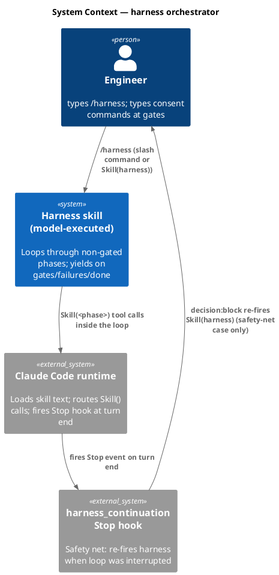

### C4 — Container

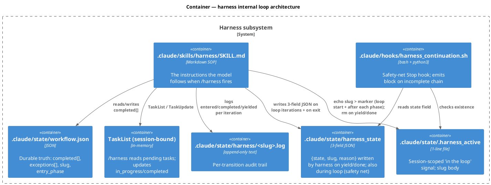

### C4 — Component (changed containers only)

The only changed container is `.claude/skills/harness/SKILL.md`. Internal structure (logical, not physical — the SOP is a single markdown file).

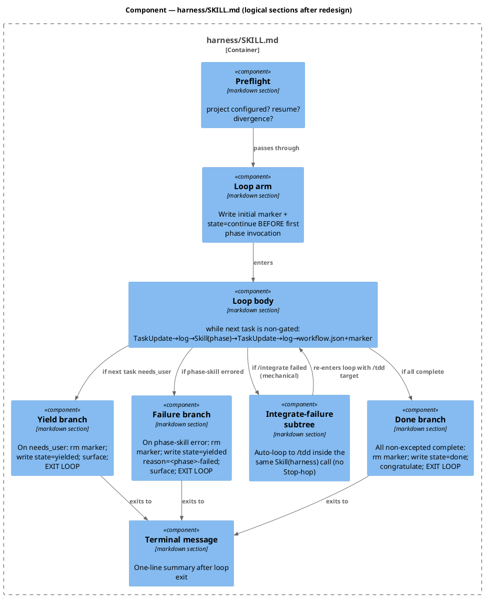

### Data model — class diagram

State contracts (no DDL — file-system state, not relational).

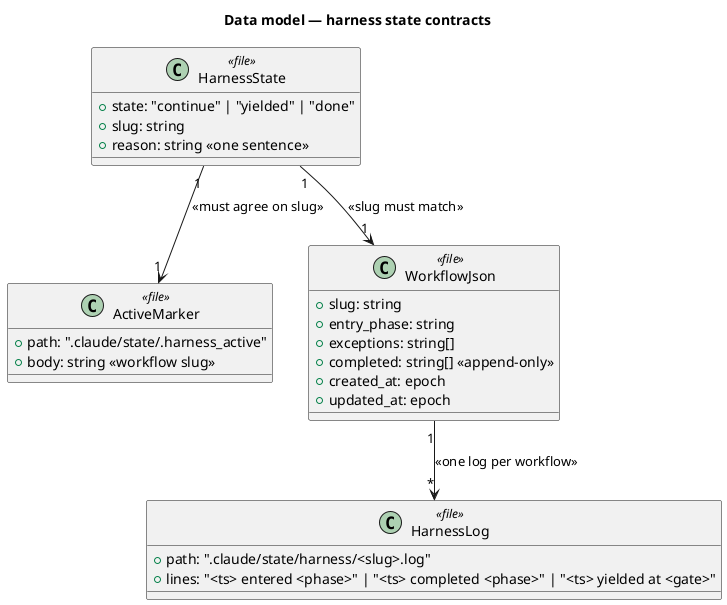

#### Migration DDL

```sql
-- forward
-- No schema migration. File contracts unchanged: HarnessState still {state, slug, reason}
-- (3 fields, no written_at, no tick_count); ActiveMarker semantics preserved (slug content,
-- created/refreshed on continue, rm'd on yielded/done); WorkflowJson append-only completed[].

-- reverse
-- No reverse migration: file shapes unchanged. Rollback is git-revert (or manual revert
-- on non-git) of the markdown files, not state migration.
```

### Behavior — sequence per AC

#### §Behavior #1 — Loop chains through non-gated phases inside one user turn (AC-001)

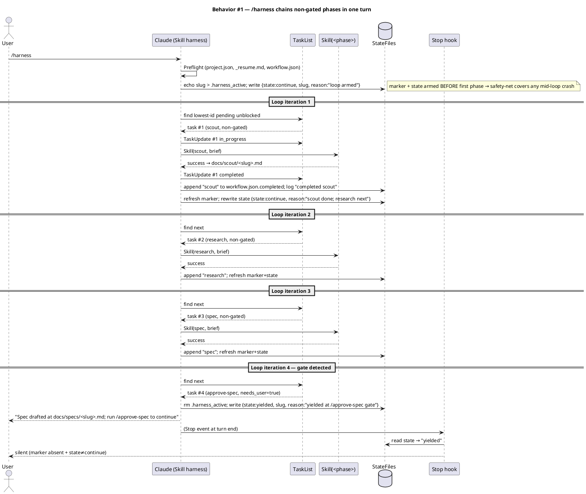

#### §Behavior #2 — Yield at consent gate (AC-002)

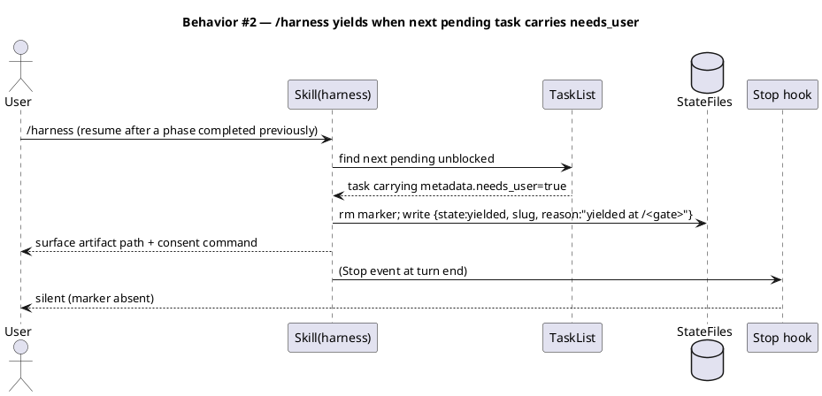

#### §Behavior #3 — Workflow complete (AC-003)

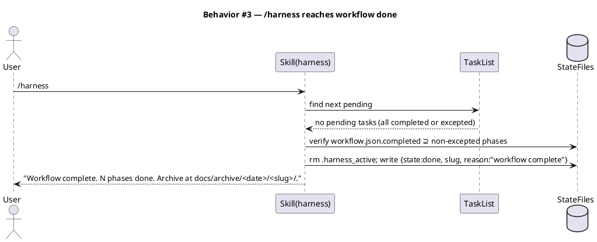

#### §Behavior #4 — Phase-skill failure mid-loop (AC-004)

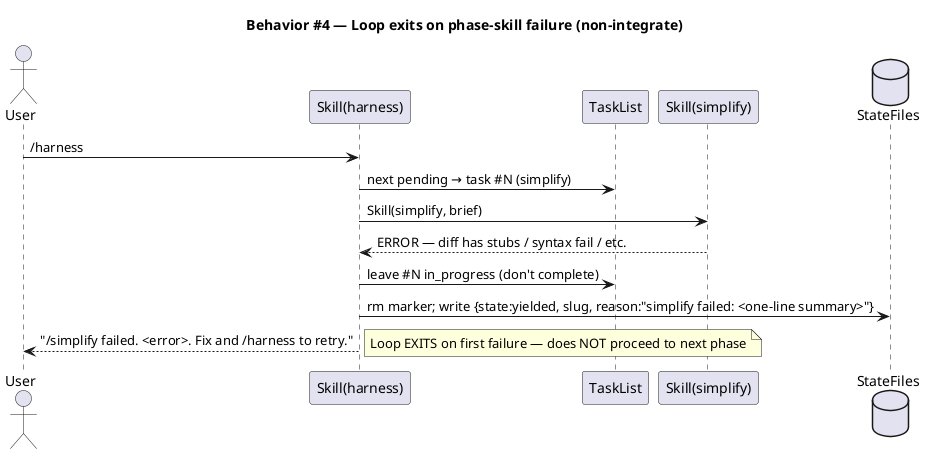

#### §Behavior #5 — Integrate-failure auto-loop inside one user turn (AC-005)

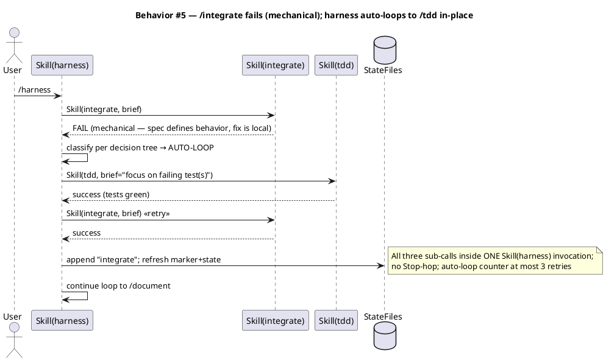

#### §Behavior #6 — Safety net: model exits mid-loop, hook re-fires harness (AC-006)

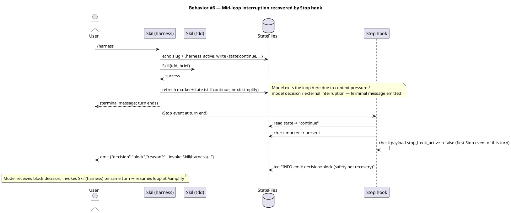

### State — harness state machine (per `/harness` invocation)

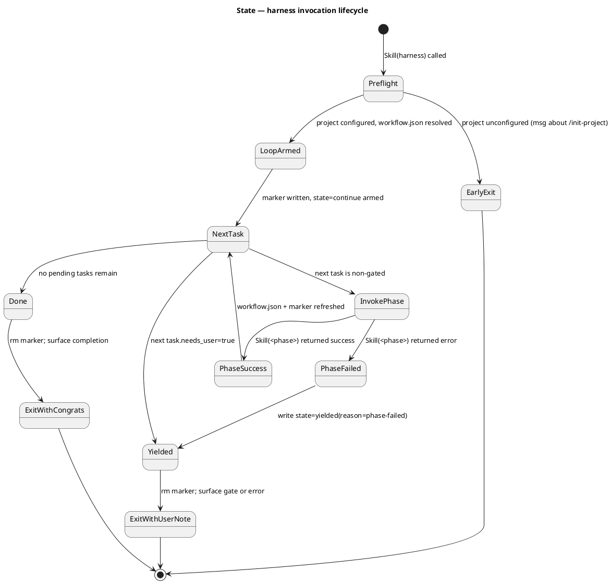

### Dependencies — graph

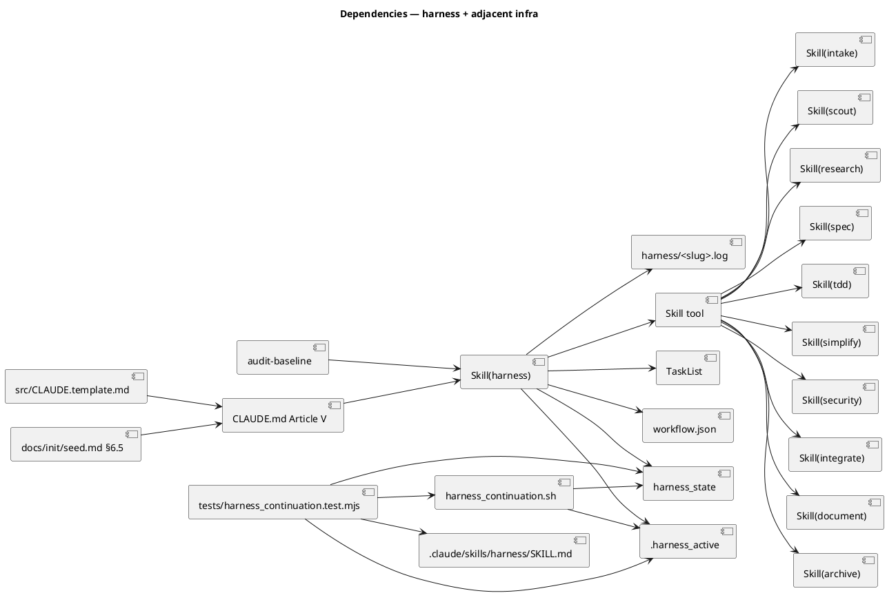

### Contracts

| Kind | Name | Input | Output | Errors | Idempotent |
|---|---|---|---|---|---|
| Slash | `/harness` | none (uses `.claude/state/workflow.json`) | one-line terminal status + on-disk side effects | unconfigured project; missing workflow.json on resume | yes (re-running on same yielded state surfaces same message) |
| Skill | `Skill(harness)` | optional brief; usually empty | side effects: TaskList updates, workflow.json append, log lines, marker + state file writes, terminal message | phase-skill failure surfaces via state=yielded | yes |
| File | `.claude/state/harness_state` | written by `Skill(harness)` only | `{state, slug, reason}` (exactly 3 fields) | malformed JSON → hook silent (degrades safely) | n/a (overwritten per write) |
| File | `.claude/state/.harness_active` | written by `Skill(harness)` only | one-line slug body | none | n/a |
| File | `.claude/state/workflow.json → completed[]` | append-only by `Skill(harness)` | array of completed phase names | duplicate append (idempotency check on each iteration) | yes |
| Hook | `harness_continuation.sh` (Stop event) | hook payload JSON (`stop_hook_active`, etc.) | `{"decision":"block",...}` OR silent | none (errors → silent) | yes |

### Libraries and versions

| Library@version | Purpose | Key APIs | Confirmed via context7 |
|---|---|---|---|
| *(none — no third-party APIs introduced)* | — | — | n/a |

The redesign is a pure SOP rewrite in markdown plus test additions. The hook stays bash+python3 (standard library only). No `npm install` / no `pip install`.

### Alternatives considered

| Alt | Summary | Rejected because |
|---|---|---|
| A | Document the one-phase-per-turn cap as the contract; rewrite Article V to say `/harness` advances by one phase per user invocation | The user explicitly chose to FIX rather than DOCUMENT the cap. Operationally the cap multiplies user friction (10-phase workflow = 10 user `/harness` keystrokes) and hides the design intent (auto-continuation) behind a documentation patch. |
| B | Investigate a Claude Code Stop-hook escape hatch (some way for the hook to return `block` without flipping `stop_hook_active`) | `stop_hook_active` is documented behavior intended to prevent infinite Stop-hook loops; no escape hatch exists in the current Claude Code Stop-hook payload. Even if one were found, depending on it would tie this baseline to undocumented runtime semantics. |
| C *(selected)* | Have `Skill(harness)` loop internally through non-gated phases until it hits a gate / failure / done; the hook becomes a safety net for incomplete chains | Honors the original design intent (one user keystroke drives to next user-required pause). Keeps the hook as a defense-in-depth signal. Pure SOP rewrite — no new dependencies, no hook code change. Same playbook the project has used for prior harness redesigns (`harness-active-marker` workflow precedent). |
| D | Remove the `harness_continuation` hook entirely | Loses the safety net — a model that exits mid-loop (context pressure, runtime kill, etc.) would leave the workflow silently stranded with `state=continue` and the user wouldn't be prompted to resume. The hook adds ~zero cost when not firing and is a real recovery path when it does. |

## Design calls

*(none — no UI write_set intersection)*

## Acceptance criteria

| ID | Criterion (given / when / then) | Upstream AC | Sequence |
|---|---|---|---|
| AC-001 | Given a fresh `workflow.json` whose entry phase has ≥ 2 non-gated phases before the first gate, when the user types `/harness` once, then every non-gated phase up to (and not including) the first `needs_user=true` task is `completed` in `workflow.json` and on the TaskList **inside a single user turn** — no further `/harness` invocations required between non-gated phases. | inline req | §Behavior #1 |
| AC-002 | Given a TaskList whose lowest-id unblocked pending task carries `metadata.needs_user=true`, when `Skill(harness)` reaches that iteration, then the marker is removed, `harness_state` is written with `state=yielded` and a one-sentence `reason` naming the gate, and the terminal message names the consent command for the user to run. | inline req | §Behavior #2 |
| AC-003 | Given a `workflow.json` whose `completed[]` already contains every non-excepted phase (or becomes complete during the loop), when the loop exhausts pending tasks, then the marker is removed, `harness_state` is written with `state=done`, and the terminal message confirms the workflow is complete. | inline req | §Behavior #3 |
| AC-004 | Given a non-`/integrate` phase skill that returns an error (e.g., `/simplify` fails on a stub-containing diff), when invoked inside the loop, then the task remains `in_progress` (not marked `completed`), `workflow.json.completed[]` is NOT appended, the marker is removed, `harness_state` is written with `state=yielded` and `reason=<phase> failed: <summary>`, and the loop exits without invoking subsequent phases. | inline req | §Behavior #4 |
| AC-005 | Given `/integrate` returns a mechanical failure (per the integrate-failure decision tree's auto-loop criteria) inside the loop, when `Skill(harness)` classifies the failure, then it invokes `Skill(tdd)` with a focused brief and re-invokes `Skill(integrate)` — all inside the same `Skill(harness)` call — capped at 3 retries; on still-red after 3, the loop exits via §Behavior #4. | inline req | §Behavior #5 |
| AC-006 | Given a `/harness` invocation that exits the loop mid-flow without writing `state=yielded` or `state=done` (so the on-disk state is `{state:continue}` with marker present), when the Stop event fires at turn end, then `harness_continuation.sh` emits `{"decision":"block",...}` (all three rungs pass: `stop_hook_active` absent on first Stop of turn, marker exists, state==continue), causing the model to invoke `Skill(harness)` on the same turn and resume the loop where it left off. | inline req | §Behavior #6 |
| AC-007 | Given the audit-baseline script runs after the redesign lands, when it walks the canonical sets (22 hooks, 36 skills, 1 subagent), then it reports PASS — counts are unchanged; the `Skill(harness)` slug is still owner: baseline; CLAUDE.md and `src/CLAUDE.template.md` are still byte-equal. | inline req | n/a (audit, not a sequence) |
| AC-008 | Given `tests/harness_continuation.test.mjs` runs under `node --test`, when the new post-refactor invariants execute, then they assert: (a) harness/SKILL.md contains language describing the internal loop (e.g., regex matching "loop" + "non-gated"); (b) harness/SKILL.md does NOT contain the deprecated phrase "exactly one `Skill(<phase>)` call per tick"; (c) CLAUDE.md Article V text matches the redesign; (d) CLAUDE.md and `src/CLAUDE.template.md` are byte-equal (regression trap). All pre-existing tests on the hook (12+ existing cases) continue to pass unchanged. | inline req | n/a (text invariants) |

## Test plan

| Category | Scenario | Expected | Covers |
|---|---|---|---|
| Golden path | `/harness` on the resumed `npm-publish-prep` workflow drives through `/research` → `/spec` in one user turn | Both phases appended to `workflow.json.completed`, then yields at `/approve-spec` gate | AC-001, AC-002 |
| Golden path | `/harness` on a chore-only workflow (no consent gates) drives to `done` in one turn | `state=done`, marker absent | AC-003 |
| Failure mode | Inject a deliberate `/simplify` failure (e.g., add a stub line to a recently-written file) | Loop exits with `state=yielded reason="simplify failed: ..."`; subsequent phases not invoked | AC-004 |
| Concurrency / ordering | `/integrate` mechanical failure path | `Skill(tdd)` invoked + `/integrate` retried inside same `Skill(harness)` call; ≤ 3 retries | AC-005 |
| Safety net | Simulate mid-loop interruption: manually write `{state:continue,...}` + marker, then trigger a Stop event in a test harness | Hook emits `decision=block` (existing test `test_stop_hook_emits_block_when_state_is_continue_and_marker_present` covers this) | AC-006 |
| Regression trap | All 12 existing `harness_continuation` hook tests must continue passing | hook behavior unchanged | AC-006 |
| Contract trap | `test_harness_state_is_3_fields_only` continues passing after redesign | state shape preserved | AC-007 |
| Text invariant | grep `harness/SKILL.md` for new "loop" language + absence of deprecated "one Skill call per tick" | regex matches present + absent strings as specified | AC-008 |
| Mirror invariant | `diff CLAUDE.md src/CLAUDE.template.md` returns empty | byte-equal after both edits | AC-008 |
| Audit | `bash .claude/skills/audit-baseline/audit.sh` exits 0 | PASS unchanged | AC-007 |

## Observability

| Signal | Name | Shape | Purpose |
|---|---|---|---|
| Log | `.claude/state/harness/<slug>.log` | append-only text, one line per transition | per-workflow audit trail; reads "entered <phase>" / "completed <phase>" / "yielded at <gate>" / "PAUSED ..." / "RESUMED ..." |
| Log | `.claude/state/logs/harness_continuation.log` | append-only text, INFO/WARN lines | hook decision audit; INFO lines for emit/silent reasons; WARN for slug mismatch (informational, not gating) |
| State | `.claude/state/harness_state` | 3-field JSON | the harness's externally-visible state for hook + cross-session resume |
| Marker | `.claude/state/.harness_active` | 1-line file | session-scoped "in the loop" signal |
| Alarm | *(none — internal infra, no SLO)* | — | — |

## Rollout

- **Feature flag**: none. This is a constitutional contract change; no parallel codepath.
- **Migration order**: 1) write tests asserting new invariants (RED phase); 2) rewrite harness/SKILL.md + CLAUDE.md Article V; 3) byte-mirror to src/CLAUDE.template.md; 4) update seed.md §6.5 + §4.1 text where applicable; 5) tests turn GREEN; 6) audit-baseline PASS; 7) integrate; 8) document; 9) archive; 10) restore `workflow.npm-publish-prep.paused.json` → `workflow.json` to resume the paused workflow.
- **Canary**: not applicable — the user is the canary; the next `/harness` invocation after this lands proves AC-001 in practice.

## Rollback

- **Kill-switch**: revert the file edits. On non-git: copy the archived `harness-internal-loop` bundle's prior versions back into place, OR restore from the user's external backup of `.claude/skills/harness/SKILL.md` + `CLAUDE.md` + `src/CLAUDE.template.md` + `docs/init/seed.md`.
- **Signal to roll back**: `/harness` invocations consistently fail to advance (e.g., the loop crashes on every workflow), OR audit-baseline starts failing post-merge. The user notices within the first post-merge `/harness` run; rollback is manual file revert (no production canary metric to trip).

## Archive plan

- Defaults *(automatic)*: spec, spec approval, security report (if any). Note: intake/scout/research are in `exceptions` for this workflow, so no slug-matched files exist in those directories to archive.
- Extras *(list any non-default files)*:
  - *(none)*

## Open questions

- *(none — design space is settled by the root-cause proof; no unresolved design choices remain)*
