# Spec — npm-publish-prep (pre-publish verification + runbook)

<!--
Technical spec. Produced by the `spec` skill.
Guard-enforced invariants: required ## headings + required diagram kinds.
Approval: NEVER add "Status: Approved" — spec_approval_guard blocks it.
-->

## Context

| Input | Path |
|---|---|
| Intake | `docs/intake/npm-publish-prep.md` |
| BRD *(if any)* | *(none)* |
| Scout *(if any)* | `docs/scout/npm-publish-prep.md` |
| Research *(if any)* | `docs/research/npm-publish-prep.md` |

## Goal

A maintainer runs `npm run publish:check` against the current tree, reads its green output naming each verification that passed, follows `docs/runbooks/npm-publish.md`, and ships the first `create-baseline` to npm with documented rollback recourse.

## Non-goals

- CI integration. No GitHub Actions, no PR-gated publish — non-git project today.
- Automated version-bump tooling (standard-version, changesets, release-please).
- Multi-package / workspaces support.
- `npm publish --provenance` (deferred pending CI/OIDC).
- Replacing the existing `tests/` suite — new smoke is additive.

## Design

Diagrams are the contract. Prose is only for things a diagram cannot say.

### C4 — System context

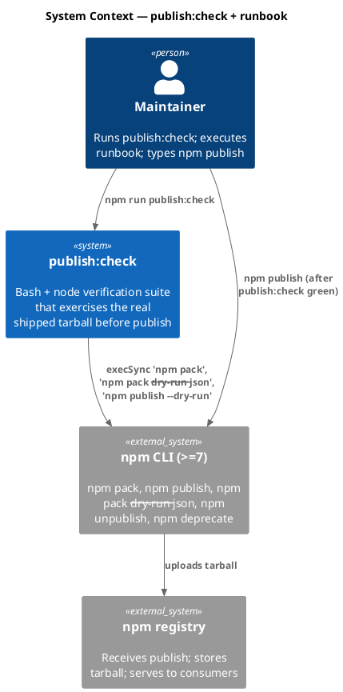

### C4 — Container

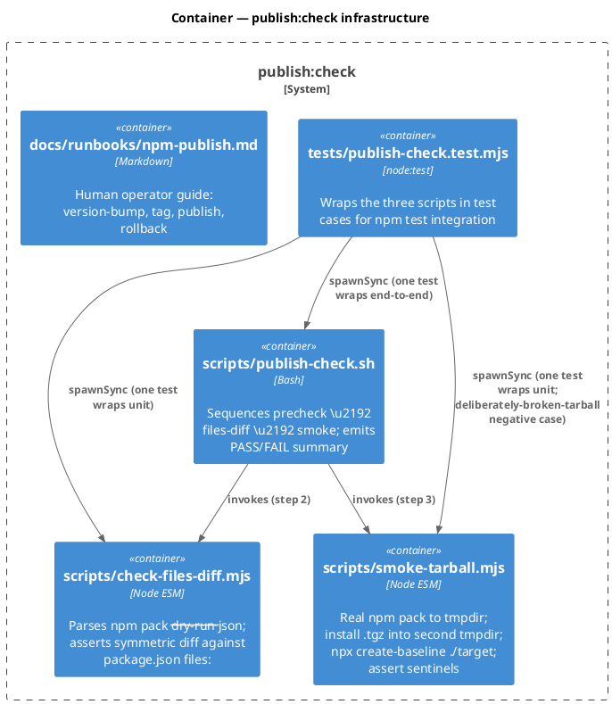

### C4 — Component (changed containers only)

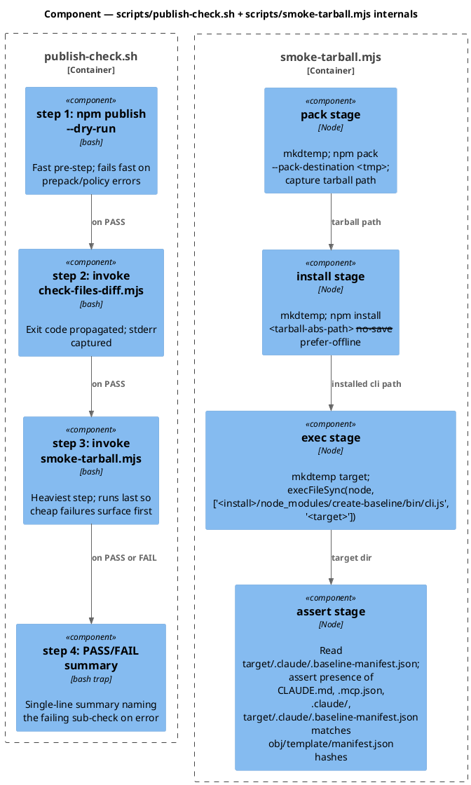

### Data model — class diagram

File-structure model (no DDL — file-system state).

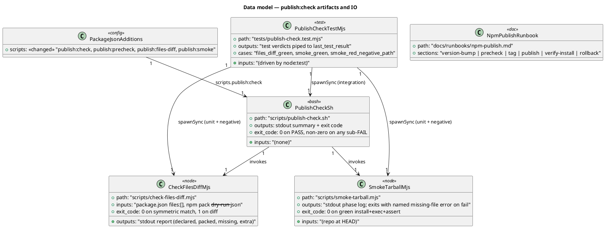

#### Migration DDL

```sql
-- forward
-- File-system only; no schema migration.
-- New files: scripts/publish-check.sh, scripts/check-files-diff.mjs,
--   scripts/smoke-tarball.mjs, tests/publish-check.test.mjs,
--   docs/runbooks/npm-publish.md.
-- Modified: package.json (add 4 scripts: publish:check, publish:precheck,
--   publish:files-diff, publish:smoke).

-- reverse
-- Delete the 5 new files; remove the 4 added scripts from package.json.
-- No state migration required.
```

### Behavior — sequence per AC

#### §Behavior #1 — publish:check exits 0 on the current tree (AC-001)

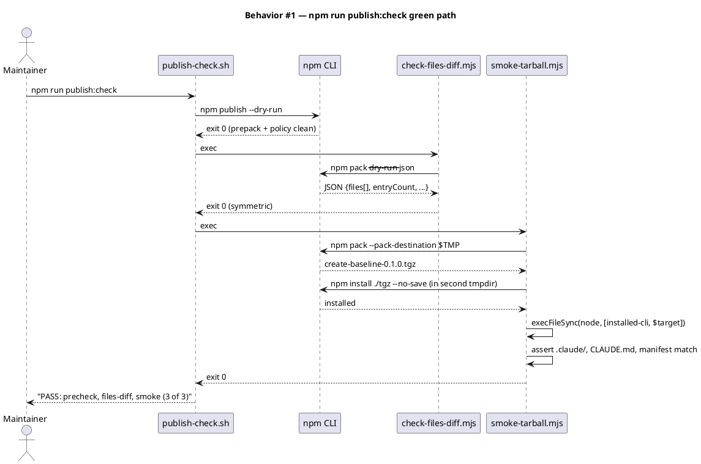

#### §Behavior #2 — Every `files:` declared prefix is present + non-empty in the packed tarball (AC-002)

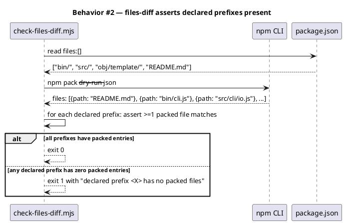

#### §Behavior #3 — Smoke catches a deliberately-broken tarball (AC-003)

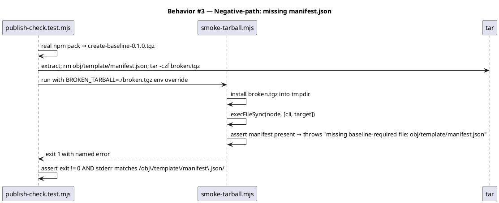

#### §Behavior #4 — Runbook is operator-actionable cold (AC-004)

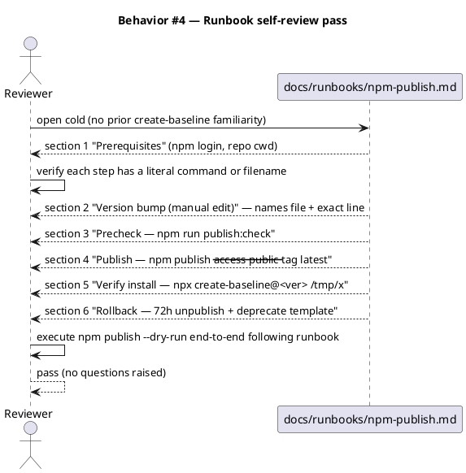

#### §Behavior #5 — Rollback section captures unpublish policy + deprecate template + version-bump strategy (AC-005)

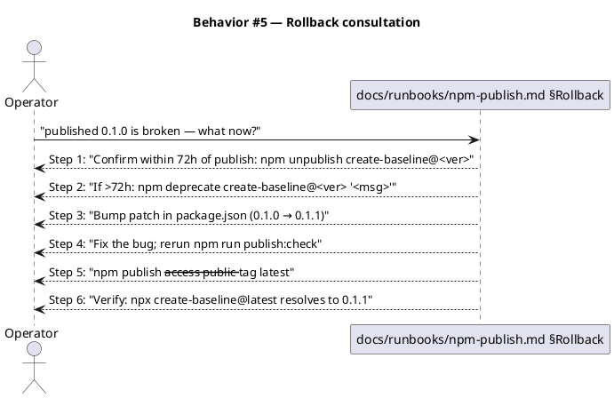

#### §Behavior #6 — Smoke installs into a fresh tmpdir and exercises create-baseline end-to-end (AC-006)

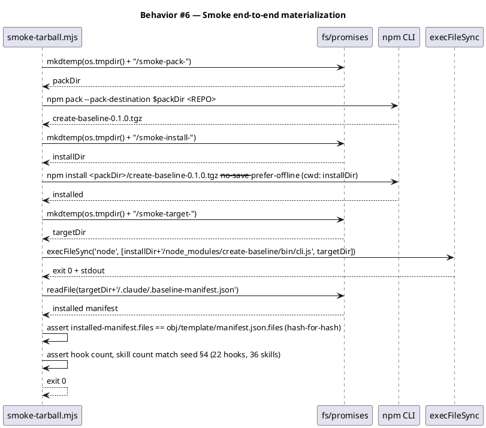

#### §Behavior #7 — files-diff reports declared-not-packed AND packed-not-declared (AC-007)

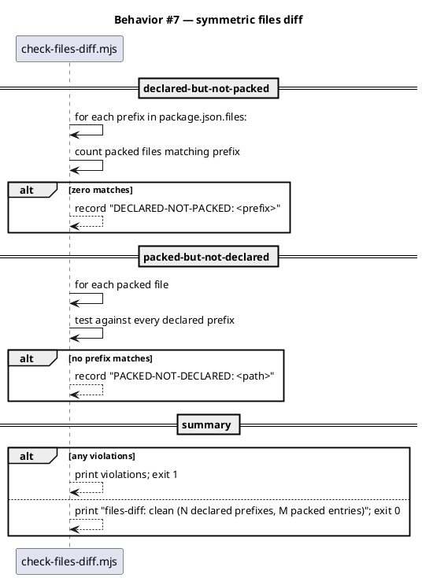

#### §Behavior #8 — Wrapping orchestrator surfaces failing sub-check by name (AC-008)

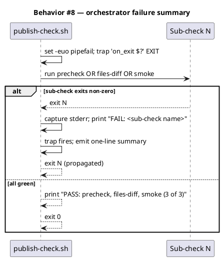

### State — finite-state model

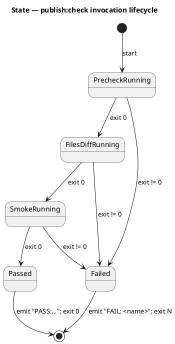

### Dependencies — graph

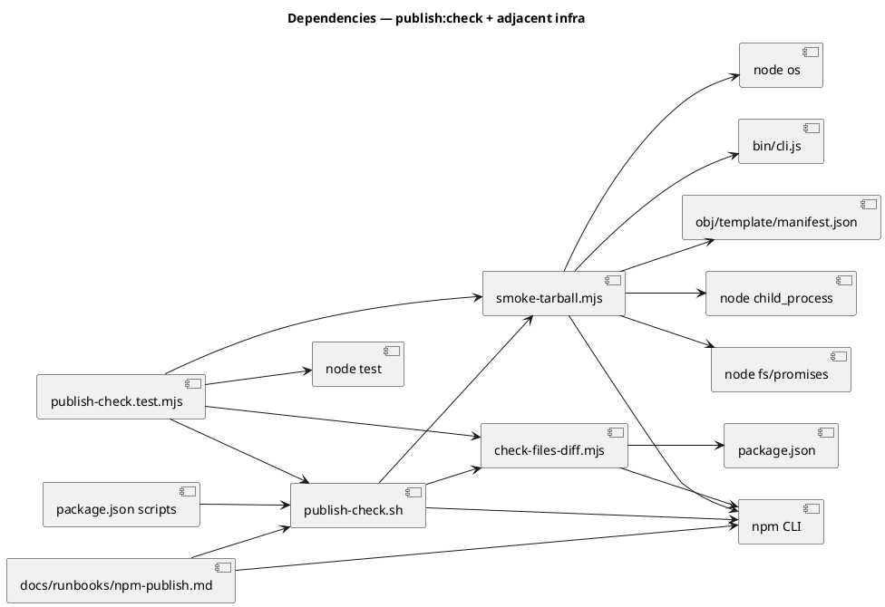

### Contracts

| Kind | Name | Input | Output | Errors | Idempotent |
|---|---|---|---|---|---|
| CLI | `npm run publish:check` | none (reads repo CWD) | stdout per-check summary; exit 0 PASS / non-zero FAIL | failing sub-check exits non-zero with `FAIL: <name>` line | yes |
| Script | `scripts/publish-check.sh` | none | as above | propagates sub-check exit code | yes |
| Script | `scripts/check-files-diff.mjs` | reads `package.json` + runs `npm pack --dry-run --json` | stdout report; exit 0 on symmetric, 1 on diff | reports declared-not-packed and packed-not-declared | yes |
| Script | `scripts/smoke-tarball.mjs` | none (operates against repo at CWD) | stdout phase log; exit 0 on green | named missing-file errors on broken-tarball case | yes (uses mktemp per run) |
| Test | `tests/publish-check.test.mjs` | driven by `node --test` | test verdicts | spawnSync subprocess errors propagate | yes |
| Doc | `docs/runbooks/npm-publish.md` | (read-only) | step-by-step actions for human operator | n/a | n/a |
| pkg | `package.json → scripts.publish:check` | none | `bash scripts/publish-check.sh` | n/a | yes |

### Libraries and versions

| Library@version | Purpose | Key APIs | Confirmed via context7 |
|---|---|---|---|
| `npm@11.11.0` | CLI tool (preinstalled) | `npm pack`, `npm pack --dry-run --json`, `npm pack --pack-destination <dir>`, `npm publish --dry-run`, `npm install <tarball>`, `npm unpublish`, `npm deprecate` | no (local `npm help` is authoritative for the installed CLI; verified empirically in this repo) |
| `node@>=18.17.0` | Runtime (engines.node) | `fs/promises.mkdtemp`, `os.tmpdir`, `child_process.execFileSync`, `child_process.execSync`, `node:test`, `node:assert/strict` | no (Node stdlib; established pattern in `tests/cli.test.mjs`, `tests/install.test.mjs`) |

Zero new runtime or dev dependencies introduced.

### Alternatives considered

| Alt | Summary | Rejected because |
|---|---|---|
| A | `npm pack --dry-run` alone (no real pack) as the smoke test | `--dry-run` skips `prepack`, so it doesn't audit the real published artifact — defeats the whole purpose |
| B | `verdaccio` private-registry mock for publish simulation | Adds heavy devDependency + new operational surface (config, port); no incremental coverage over real-`npm pack` |
| C | `npm-packlist` programmatic library for files-diff | Reinvents what `npm pack --dry-run --json` already exposes from the same internal library; YAGNI |
| D | Bash-only `publish:check` orchestrator (no node helpers) | Bash JSON parsing requires `jq` (new dep) or fragile sed/awk; node already in the toolchain |
| E | Pure-node orchestrator (no bash) | Loses bash's idiomatic per-step `set -e` + `trap` summary; AC-008's "one-line FAIL: <name>" is harder to format cleanly |

## Design calls

*(none — no UI write_set intersection with `project.json → tdd.ui_globs`)*

## Acceptance criteria

| ID | Criterion (given / when / then) | Upstream AC | Sequence |
|---|---|---|---|
| AC-001 | given current repo at HEAD, when `npm run publish:check` runs, then exit 0 and a one-line summary names every passed check | intake AC 1 | §Behavior #1 |
| AC-002 | given current repo at HEAD, when `npm pack` runs and tarball is inspected, then every prefix in `package.json → files:` has at least one non-empty packed file | intake AC 2 | §Behavior #2 |
| AC-003 | given a tarball with `obj/template/manifest.json` deliberately removed, when smoke runs against it, then exit non-zero with error naming the missing file (not a generic ENOENT) | intake AC 3 | §Behavior #3 |
| AC-004 | given `docs/runbooks/npm-publish.md`, when a cold reviewer (no prior create-baseline familiarity) reads it, then they can execute a dry-run publish without asking questions | intake AC 4 | §Behavior #4 |
| AC-005 | given a broken published version, when operator consults rollback section, then they find the 72h `npm unpublish` policy, `npm deprecate` template, version-bump strategy, and ordered steps | intake AC 5 | §Behavior #5 |
| AC-006 | given the smoke test, when it runs from a fresh `mktemp -d`, then it installs the tarball, invokes create-baseline against an empty target dir, and asserts the materialized baseline matches the manifest hash-for-hash and the canonical counts | intake AC 6 | §Behavior #6 |
| AC-007 | given `package.json → files:`, when files-diff runs, then it reports declared-not-packed AND packed-not-declared violations (symmetric) | intake AC 7 | §Behavior #7 |
| AC-008 | given any sub-check fails, when the wrapping `publish:check` exits, then exit code is non-zero and a one-line `FAIL: <name>` summary appears in stdout/stderr | intake AC 8 | §Behavior #8 |

## Test plan

| Category | Scenario | Expected | Covers |
|---|---|---|---|
| Golden path | `publish:check` runs on current tree | exit 0; stdout names 3 PASS checks | AC-001 |
| Golden path | `check-files-diff.mjs` on current tree | exit 0; "files-diff: clean (N, M)" | AC-002, AC-007 |
| Golden path | `smoke-tarball.mjs` on current tree | exit 0; phases log; assertions pass | AC-006 |
| Input boundary | `check-files-diff.mjs` when a `files:` prefix has zero packed matches (synthetic empty-dir) | exit 1; "DECLARED-NOT-PACKED: <prefix>" | AC-002 |
| Input boundary | `check-files-diff.mjs` when packed file is not under any declared prefix (synthetic) | exit 1; "PACKED-NOT-DECLARED: <path>" | AC-007 |
| Contract violation | `smoke-tarball.mjs` against a tarball missing `obj/template/manifest.json` (negative-path fixture) | exit non-zero; stderr matches /obj\/template\/manifest\.json/ | AC-003 |
| Concurrency / ordering | not applicable | — | — |
| Failure mode | `publish-check.sh` when sub-check #2 fails | exit non-zero; "FAIL: files-diff" surfaces; sub-check #3 NOT invoked | AC-008 |
| Failure mode | `publish-check.sh` when sub-check #3 fails | exit non-zero; "FAIL: smoke" surfaces | AC-008 |
| Regression trap | `tests/npm-pack-tarball.test.mjs` continues to pass unchanged | `site/` exclusion still asserted | existing |
| Regression trap | All 132 existing node tests continue to pass | full suite green | existing |
| Operator simulation | one-time `runbook walkthrough` self-review | reviewer executes `npm publish --dry-run` per runbook end-to-end | AC-004 |
| Operator simulation | rollback consultation simulation | reviewer locates 5-step rollback in <30 seconds | AC-005 |

## Observability

| Signal | Name | Shape | Purpose |
|---|---|---|---|
| Log | stdout from `publish-check.sh` | append-only text; per-step "PASS: <name>" or "FAIL: <name>" lines + final summary | operator reads it during publish |
| Log | stderr from sub-scripts | captured + surfaced by orchestrator on failure | operator triage |
| Alarm | *(none — operator-driven, no SLO)* | — | — |

## Rollout

- **Feature flag**: none. New tooling additive; doesn't alter existing test commands or publish behavior.
- **Migration order**: (1) write failing tests in `tests/publish-check.test.mjs` (RED); (2) implement `scripts/check-files-diff.mjs`; (3) implement `scripts/smoke-tarball.mjs`; (4) implement `scripts/publish-check.sh`; (5) wire `package.json` scripts; (6) write `docs/runbooks/npm-publish.md`; (7) `npm test` GREEN; (8) `npm run publish:check` exits 0; (9) audit-baseline PASS.
- **Canary**: not applicable. Maintainer's first invocation of `npm run publish:check` is the canary.

## Rollback

- **Kill-switch**: revert the 5 new files + the 4 added scripts in `package.json`. No state to roll back.
- **Signal to roll back**: `npm run publish:check` consistently false-positives (passes on a known-broken tree) OR false-negatives (fails on a known-good tree). Operator notices during first real use; reverting is a 1-commit file-revert on non-git this means manual restoration from the archive bundle.

## Archive plan

- Defaults *(automatic)*: intake, scout, research, spec, spec approval, security report (if any). The runbook at `docs/runbooks/npm-publish.md` is the *product* of this workflow and STAYS in place after archive (it's not an in-flight artifact).
- Extras *(list any non-default files)*:
  - *(none — the runbook is product, the scripts are product; neither gets archived)*

## Open questions

- *(none — design is settled by the research recommendations; no unresolved choices remain)*
