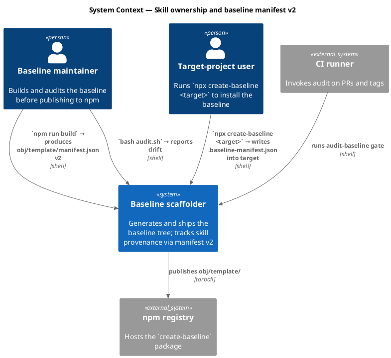
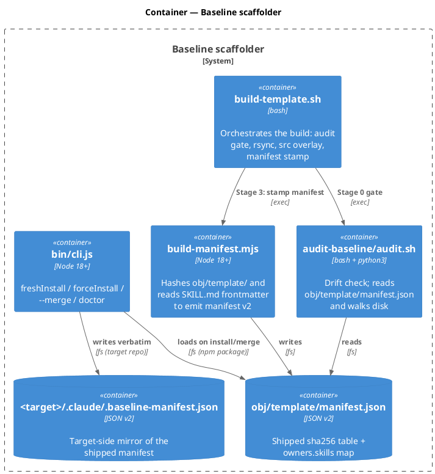
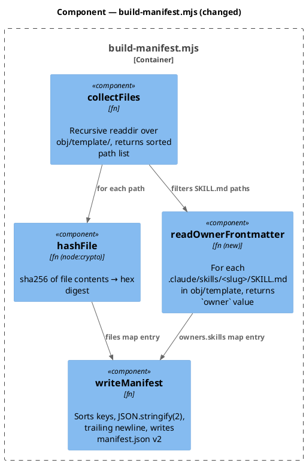
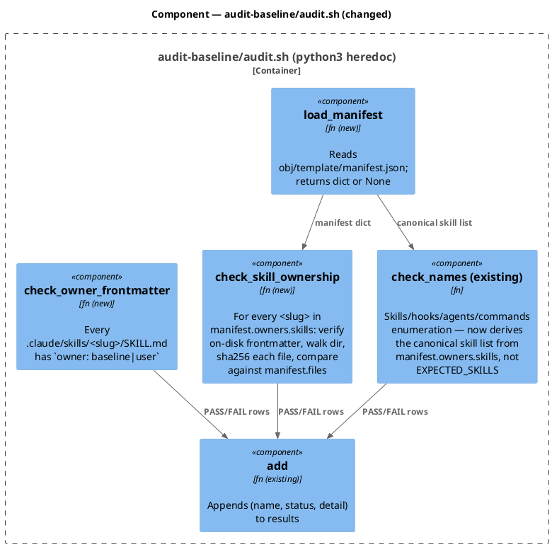
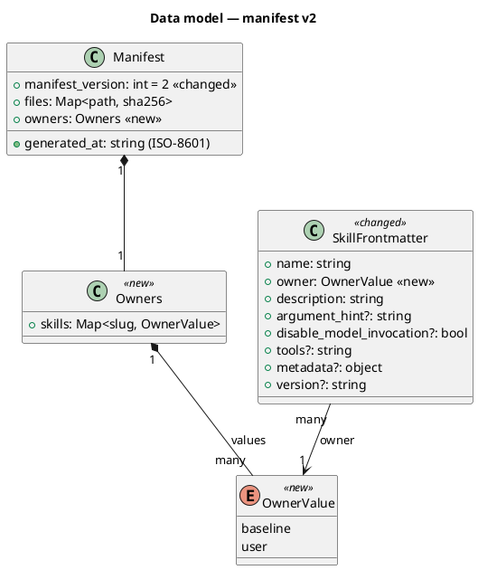
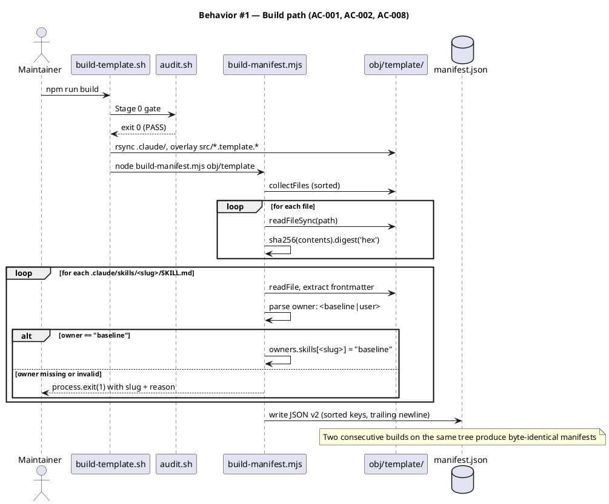
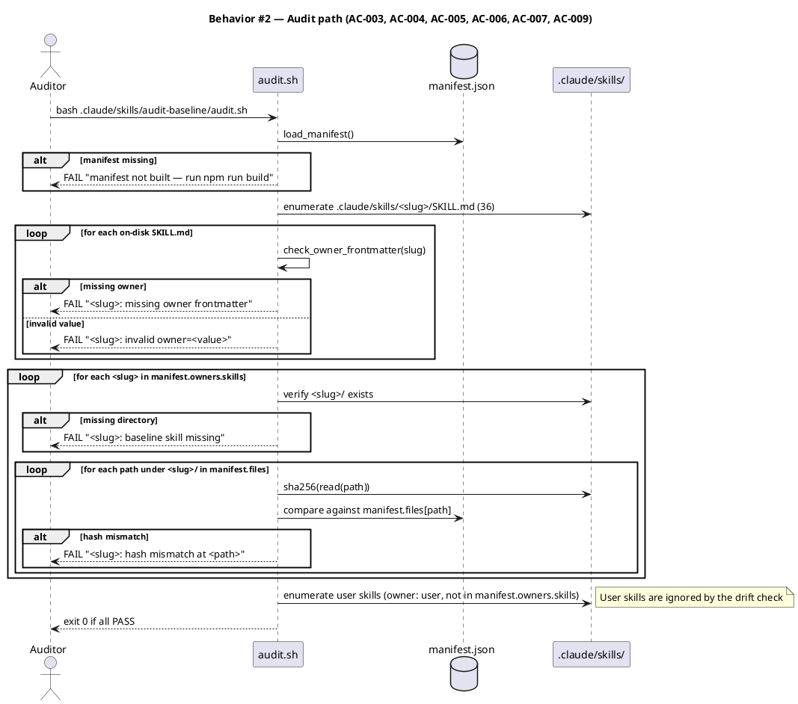
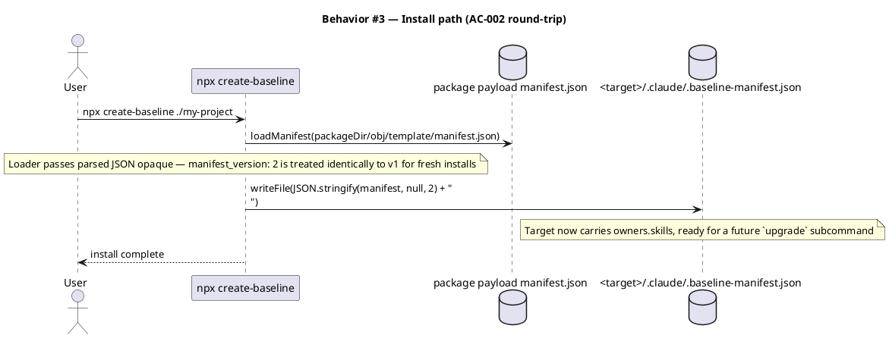
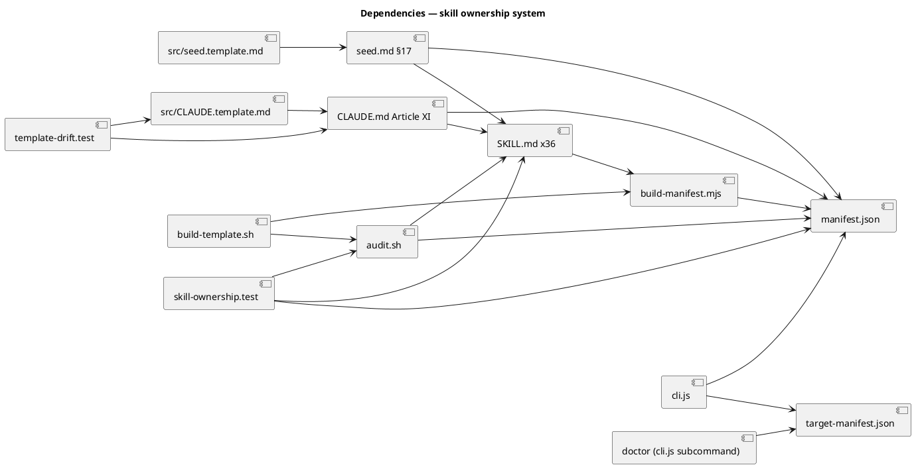

# Spec — Skill ownership and the baseline manifest v2

<!--
Technical spec. Produced by the `spec` skill.

Guard-enforced invariants:
  - Required ## headings (artifact_template_guard):
        Goal, Design, Acceptance criteria, Test plan.
  - Required diagram kinds inside ```plantuml``` fences
    (spec_diagram_presence_guard, configured in project.json →
     artifacts.required_diagrams.spec):
        c4_context, c4_container, c4_component,
        sequence, class, dependency_graph.
  - Every ```plantuml``` fence must parse (plantuml_syntax_guard).

Approval: NEVER add "Status: Approved" — spec_approval_guard blocks it.
Approval is a token written by /approve-spec.
-->

## Context

| Input | Path |
|---|---|
| Intake | `docs/intake/skill-ownership.md` |
| BRD *(if any)* | *(none)* |
| Scout *(if any)* | `docs/scout/skill-ownership.md` |
| Research *(if any)* | `docs/research/skill-ownership.md` (recommends Candidate B) |

## Goal

Every baseline-owned skill declares `owner: baseline` in its SKILL.md frontmatter, and the shipped manifest gains an `owners.skills` map so the audit can detect drift in any baseline skill (frontmatter loss, file tampering, missing directory) against a single canonical source produced by the build.

## Non-goals

- The `npx create-baseline upgrade` subcommand. The manifest format must permit it; the subcommand itself is a separate workflow.
- Provenance for non-skill assets (hooks, commands, MCP servers, settings.json, project.json). Skills first.
- Cryptographic integrity guarantees. The lock is for drift detection, not supply-chain attestation.
- Per-skill aggregate (merkle) hashes. The existing per-file `files` map in the manifest already covers every file in every skill directory.
- `doctor` learning about `owners` — research flagged this as upgrade-flavored and deferred.

## Design

Diagrams are the contract. Prose is only for things a diagram cannot say.

### C4 — System context

Who interacts with the baseline manifest system and which external surfaces it touches.



### C4 — Container

Deployable units inside the baseline scaffolder and how they communicate around the manifest.



### C4 — Component (changed containers only)

Two containers change: `build-manifest.mjs` (gains frontmatter reader + owners emitter) and `audit-baseline/audit.sh` (gains the manifest-driven skill-ownership check; drops `EXPECTED_SKILLS`).





### Data model — class diagram

The manifest file is a JSON document. `<<new>>` marks fields introduced in v2.



#### Migration DDL

No relational schema — the "migration" is a JSON-format bump and 36 frontmatter additions.

```
Forward migration:
  1. Add `owner: baseline` directly after `name:` in each of the 36 baseline SKILL.md files.
  2. Bump scripts/build-manifest.mjs to emit manifest_version: 2 with the new top-level `owners` field.
  3. Delete EXPECTED_SKILLS from .claude/skills/audit-baseline/audit.sh; derive the canonical skill set from manifest.owners.skills.

Reverse migration:
  1. Restore EXPECTED_SKILLS in audit.sh.
  2. Revert build-manifest.mjs to manifest_version: 1, drop `owners` block.
  3. Drop the `owner:` frontmatter line from each baseline SKILL.md.

  Target repos installed during the rolled-out window can rerun `npx create-baseline --merge` to refresh .baseline-manifest.json.
```

### Behavior — sequence per AC

One sequence diagram per behaviour the ACs assert. Three sequences cover the three execution paths (build, audit, install); the ACs map onto them via the AC table.







### State — core entity *(only if stateful)*

No non-trivial state machine — the manifest is generated, written, and read; there is no mid-state lifecycle. Section retained per template convention so the reviewer sees the explicit choice.

### Dependencies — graph

Directed graph of build/runtime/governance dependencies. `A --> B` reads "A depends on B". Verified acyclic.



### Contracts

| Kind | Name | Input | Output | Errors | Idempotent |
|---|---|---|---|---|---|
| CLI | `node scripts/build-manifest.mjs <template-dir>` | template dir path | `manifest.json` v2 written to `<template-dir>/manifest.json` | exit 1 if any SKILL.md has missing/invalid `owner:`; exit 2 if usage wrong | yes (deterministic) |
| CLI | `bash .claude/skills/audit-baseline/audit.sh` | none (reads `CLAUDE_PROJECT_DIR` or `pwd`) | stdout: PASS/FAIL/WARN table; exit 0 if all PASS, 1 if any FAIL | n/a | yes (read-only) |
| Frontmatter key | `owner` in `.claude/skills/<slug>/SKILL.md` | one of `baseline`, `user` (unquoted, lowercase) | n/a | audit FAIL on missing or other values | n/a |
| Manifest field | `manifest.owners.skills` | n/a (read at audit time) | `Map<slug, "baseline"\|"user">` | audit FAIL if a baseline-listed slug is missing on disk or has hash drift | n/a |
| File | `obj/template/manifest.json` | n/a | JSON v2 (see class diagram) | n/a | n/a |

### Libraries and versions

| Library@version | Purpose | Key APIs | Confirmed via context7 |
|---|---|---|---|
| `node:crypto` (Node ≥ 18.17) | sha256 file hashing | `createHash('sha256').update(buf).digest('hex')` | yes — `/websites/nodejs_latest-v22_x_api → crypto.createHash` |
| `node:fs/promises` (Node ≥ 18.17) | recursive readdir, readFile, writeFile | `readdir({ withFileTypes: true })`, `readFile`, `writeFile` | yes — confirmed against same source as `build-manifest.mjs` already uses |
| `python3 ≥ 3.8` (stdlib only) | audit-side parse + hash | `json.loads`, `hashlib.sha256`, `re.search`, `pathlib.Path` | n/a (Python stdlib, used throughout audit.sh today) |

### Alternatives considered

| Alt | Summary | Rejected because |
|---|---|---|
| A — Frontmatter only, no manifest changes | Audit derives the baseline-skill set from on-disk frontmatter; no manifest update. | Cannot satisfy AC-004 (hash-mismatch detection inside SKILL.md content) — frontmatter alone signals presence, not content drift. |
| C — Parallel `.claude/baseline.lock.json` alongside `.baseline-manifest.json` | A second lock file focused on skill provenance + per-skill aggregate (merkle) hash. | Adds a second on-disk artifact overlapping the existing manifest; new shipped path requires `template-payload.test.mjs` ALLOWED_PREFIXES change; per-skill aggregate hash adds complexity (canonical merkle definition) that per-file hashes already provide for free. |
| D — Replace `.baseline-manifest.json` with a new format | Subsume the existing manifest into a new richer artifact. | Breaks existing CLI install/merge/doctor flows that already work; the v2 bump on the existing manifest achieves the same result with one schema change instead of a format swap. |

## Design calls

This spec's write set is `scripts/build-manifest.mjs`, `.claude/skills/audit-baseline/audit.sh`, `.claude/skills/*/SKILL.md`, `bin/cli.js`, `tests/*.test.mjs`, `CLAUDE.md`, `src/CLAUDE.template.md`, `docs/init/seed.md`, `src/seed.template.md`. None of these intersect `project.json → tdd.ui_globs` (which lists `site-src/**`, frontend assets, and rendered HTML). No UI surface to design.

- *(none)*

## Acceptance criteria

| ID | Criterion (given / when / then) | Upstream AC | Sequence |
|---|---|---|---|
| AC-001 | Given any `.claude/skills/<slug>/SKILL.md`, when a static enumeration script reads its frontmatter, then the `owner` key is present and its value is exactly `baseline` or `user`. | intake AC 1 | §Behavior #1 |
| AC-002 | Given a clean checkout, when `scripts/build-template.sh` runs, then `obj/template/manifest.json` (which the CLI mirrors verbatim to `<target>/.claude/.baseline-manifest.json` on install) carries `manifest_version: 2` and a populated `owners.skills` map. | intake AC 2 | §Behavior #1, §Behavior #3 |
| AC-003 | Given a clean checkout immediately after the build, when `bash .claude/skills/audit-baseline/audit.sh` runs, then it exits 0 and the lock-vs-disk skill-ownership check reports zero drift. | intake AC 3 | §Behavior #2 |
| AC-004 | Given a clean checkout, when the content of any baseline SKILL.md is mutated (one byte changed) without regenerating the manifest, then `audit-baseline` exits non-zero and the failure message names the affected slug and the literal string `hash mismatch`. | intake AC 4 | §Behavior #2 |
| AC-005 | Given a clean checkout plus a new directory `.claude/skills/user-example/SKILL.md` with `owner: user` frontmatter, when `audit-baseline` runs, then it exits 0 — user-owned skills are ignored by the lock check. | intake AC 5 | §Behavior #2 |
| AC-006 | Given a clean checkout where the `owner:` field is removed from one baseline SKILL.md, when `audit-baseline` runs, then it exits non-zero and the failure message names the affected slug and the literal string `missing owner frontmatter`. | intake AC 6 | §Behavior #2 |
| AC-007 | Given a clean checkout where `docs/init/seed.md` no longer contains §17 or `CLAUDE.md` no longer contains Article XI, when `audit-baseline` runs, then it exits non-zero and the failure message names which document is missing which citation. | intake AC 7 | §Behavior #2 |
| AC-008 | Given two consecutive `scripts/build-template.sh` runs on the same source tree, when their `obj/template/manifest.json` outputs are diffed, then the diff is empty. | intake AC 8 | §Behavior #1 |
| AC-009 | Given a clean checkout where a baseline-owned skill listed in `manifest.owners.skills` no longer exists on disk, when `audit-baseline` runs, then it exits non-zero and the failure message names the missing slug and the literal string `baseline skill missing`. | intake AC 9 | §Behavior #2 |

## Test plan

| Category | Scenario | Expected | Covers |
|---|---|---|---|
| Golden path | Build from clean tree, then audit | manifest v2 with `owners.skills` of size 36 (one per baseline skill); audit exits 0 | AC-001, AC-002, AC-003 |
| Golden path | Build twice on identical tree; diff manifests | byte-identical | AC-008 |
| Golden path | Install into temp target; assert `.baseline-manifest.json` carries `owners.skills` | mirror verbatim | AC-002 |
| Input boundary | SKILL.md with `owner: BASELINE` (uppercase) | audit FAIL "invalid owner=BASELINE" | AC-001 |
| Input boundary | SKILL.md with `owner: "baseline"` (quoted) | audit FAIL "invalid owner=\"baseline\"" — only unquoted lowercase allowed | AC-001 |
| Input boundary | SKILL.md with no frontmatter block at all | audit FAIL "missing owner frontmatter" | AC-006 |
| Contract violation | Mutate one byte of a baseline `SKILL.md` content (body, not frontmatter) | audit FAIL with `<slug>` and `hash mismatch` | AC-004 |
| Contract violation | Mutate one byte of a baseline skill's `references/*.md` | audit FAIL with `<slug>` and `hash mismatch` | AC-004 |
| Contract violation | Remove `owner:` line from a baseline SKILL.md | audit FAIL "missing owner frontmatter <slug>" | AC-006 |
| Contract violation | Delete a baseline skill directory (e.g., `.claude/skills/spec/`) | audit FAIL "<slug>: baseline skill missing" | AC-009 |
| Contract violation | Remove §17 from seed.md | audit FAIL "seed.md missing §17 citation" | AC-007 |
| Contract violation | Remove Article XI from CLAUDE.md | audit FAIL "CLAUDE.md missing Article XI citation" | AC-007 |
| Failure mode | Audit run before `npm run build` (obj/template missing) | audit FAIL with actionable message naming `npm run build` | AC-003 |
| Failure mode | manifest_version: 1 manifest at target (older install) | `doctor` and `--merge` continue to work (v1 still tolerated by loader) | AC-002 |
| Independence | Add `.claude/skills/user-example/SKILL.md` with `owner: user` | audit exits 0; user-example not in `owners.skills` | AC-005 |
| Regression trap | EXPECTED_SKILLS removed; canonical list derived from manifest only | no second source of truth for baseline-skill names | (governance — research) |
| Regression trap | All 36 baseline SKILL.md frontmatter keys in declaration order: `name`, `owner`, then existing keys | the new `owner:` line is always at position 2 (after `name:`) | AC-001 |

## Observability

| Signal | Name | Shape | Purpose |
|---|---|---|---|
| Log | `audit-baseline` stdout table | rows `(name, status, detail)` — existing format | Drift surface for maintainer/CI |
| Log | `build-manifest.mjs` stderr | one-line per skipped/invalid frontmatter, `<slug>: <reason>` | Pre-publish failure surface |
| Metric | n/a | — | No runtime — build-time only |
| Alarm | CI gate | `audit-baseline` non-zero exit on PR | Block merge |

## Rollout

- **Feature flag**: *(none)* — governance change, not behaviour change. Either passes audit or doesn't.
- **Migration order**: 1) Add `owner: baseline` to 36 SKILL.md (parallelizable by skill category if swarm-routed); 2) update `build-manifest.mjs` to emit v2; 3) delete `EXPECTED_SKILLS` from `audit.sh`; 4) add `owners` check function; 5) add Article XI + §17 citations; 6) mirror `CLAUDE.md` → `src/CLAUDE.template.md`. All in one PR.
- **Canary**: n/a — single internal PR; `create-baseline` is not yet npm-published, so no external blast radius.

## Rollback

- **Kill-switch**: revert the PR. `manifest_version` reverts to 1; `EXPECTED_SKILLS` reinstated; 36 frontmatter `owner:` lines removed; Article XI + §17 removed.
- **Signal to roll back**: any `audit-baseline` failure after PR merge that traces to the new check function and cannot be fixed forward within one working day, OR any `bin/cli.js` install/merge regression caused by the manifest v2 shape change. Detection window: < 5 min (audit failure is visible immediately in CI).

## Implementation files

Write set the spec commits to (consumed by `/tdd` and, if sharded, `/swarm-plan`):

| Path | Change |
|---|---|
| `scripts/build-manifest.mjs` | Add frontmatter reader; populate `owners.skills`; bump `manifest_version` from 1 to 2; fail with exit 1 if any baseline SKILL.md has missing or invalid `owner:`. |
| `.claude/skills/audit-baseline/audit.sh` | Delete `EXPECTED_SKILLS`. Add `load_manifest()` helper. Add `check_skill_ownership()` (frontmatter + hash). Add `check_constitutional_citations()` for §17 / Article XI. Derive canonical skill set from `manifest.owners.skills` in all existing `check_names` invocations. |
| `.claude/skills/<slug>/SKILL.md` × 36 | Insert `owner: baseline` directly after `name:` (one line per file). |
| `bin/cli.js` | Verify the manifest loader treats `manifest_version: 2` opaquely. If today's code asserts `manifest_version === 1` anywhere, change to `manifest_version >= 1` (forward-compatible). |
| `tests/skill-ownership.test.mjs` *(new)* | Covers AC-001 through AC-009 in the categories listed in Test plan. |
| `tests/manifest.test.mjs` | Extend to assert v2 shape (`owners.skills` present and well-formed). |
| `tests/doctor.test.mjs` | Confirm `doctor` continues to pass with v2 manifest at the target. No new `owners` surfacing (deferred to upgrade). |
| `tests/template-payload.test.mjs` | No change. Confirm in CI; no new shipped path. |
| `tests/template-drift.test.mjs` | No new MIRROR_PAIRS entry. `src/CLAUDE.template.md` ↔ `CLAUDE.md` already mirrored; Article XI is part of that mirror. |
| `CLAUDE.md` | Add Article XI (Skill provenance and the baseline manifest). Add one row to the Article VIII hook table reflecting the new audit check (no new hook). |
| `src/CLAUDE.template.md` | Mirror Article XI verbatim (template-drift enforces). |
| `docs/init/seed.md` | Add §17 (Skill provenance) referencing `manifest.owners.skills`, the audit's new check, and the `owner:` frontmatter convention. Update §4.3 prose to mention the convention. |
| `src/seed.template.md` | Mirror §17, preserving the §16 reservation. |

## Archive plan

- Defaults *(automatic)*: intake, scout, research, spec, spec-rendered/, spec approval, swarm plan + approval (if used). No security report planned (the audit gate suffices and security review is excluded by this work being a governance / build-time change with no runtime attack surface).
- Extras *(non-default)*:
  - *(none)*

## Open questions

- Should the audit attempt to rebuild `obj/template/manifest.json` if it is missing (e.g., `node scripts/build-manifest.mjs obj/template` from inside the audit), or should missing-manifest be a hard FAIL that tells the maintainer to run `npm run build` first? Spec position: hard FAIL. The audit is read-only; coupling it to the build creates chicken-and-egg cycles in CI.
- Should `doctor` surface `owners.skills` to the user (e.g., "you modified 3 baseline skills")? Spec position: defer to a future `upgrade` subcommand; `doctor` keeps its current per-file drift output. Research flagged this as upgrade-flavored.
- Article placement — is XI correct, or should §4.3 of seed.md and Article IX of CLAUDE.md absorb the convention? Spec position: new Article XI / §17 because Article IX is project memory, and conflating memory with skill provenance has a clear cost (the existing memory rules — re-verify before citing, size-cap 500, etc. — do not apply to provenance metadata).
- Should the frontmatter `owner:` line be enforced at *position 2* (immediately after `name:`) or just "anywhere in frontmatter"? Spec position: position 2, because audit then has a stable line to grep and any future hook can validate placement cheaply.
- Migration tactic at /tdd: solo (single diff against 36 files) vs swarm-shard (by skill category — artifact/phases/workers/helpers/orchestration/globals/audit/alt = 8 waves). Spec position: harness decides per `swarm.min_tasks_worth_swarming` (default 3); with 8 logical components this likely routes to swarm. Component count (`grep -cE '^\s*Component\(' docs/specs/skill-ownership.md`) is currently 7 in this draft — borderline. Final decision is harness's at Phase 6.
