# Memory lifecycle closure — resolution semantics, stale listing, canonical sweep

<!--
Technical spec. Produced by the `spec` skill.

Guard-enforced invariants:
  - Required ## headings: Goal, Design, Design calls, Acceptance criteria, Test plan.
  - Required diagram kinds: c4_context, c4_container, c4_component, sequence, class, dependency_graph.
  - Every ```plantuml``` fence must parse.
-->

## Context

| Input | Path |
|---|---|
| Intake | `docs/intake/memory-lifecycle-closure.md` |
| Scout | `docs/scout/memory-lifecycle-closure.md` |
| Research | `docs/research/memory-lifecycle-closure.md` (Candidate B adopted) |

## Goal

`/memory-flush` and `memory_session_start.sh` together close the lifecycle loop on canonical memory entries: structured-resolution fields (`resolved-at:` on `pending-questions.md`, `superseded-at:` on the other five canonical files) auto-close on sweep; body-prose resolution phrases surface for once-per-entry user confirmation; and the session-start index lists the top 5 stale entries by oldest `last-touched` instead of only counting them.

## Non-goals

- No new memory file, no new hook, no new skill. Article VIII hook count and Article XI skill count stay at 22 and 36.
- No backfill of pre-schema entries (no `source:` field, no verbatim block) — Q-001 and the pre-2026-05-01 entries are grandfathered; their schema drift is a separate concern (intake Open Q #1).
- No audit enforcement of the new fields' shape or the mutual-exclusion invariant between `resolved-at:` and `superseded-at:`. The audit's binding role (AC-7) stays at file-presence + frontmatter-presence + entry-count > 0.
- No existing canonical entry is actually closed in this commit — the schema and sweep ship without invalidating anything currently on disk; closure happens organically as future work touches each file.
- No `dry-run` mode on `/memory-flush`, no batch confirm UX. Confirmation is once-per-entry (research Open Q #3).

## Design

Diagrams are the contract. Prose is only for things a diagram cannot say.

### C4 — System context

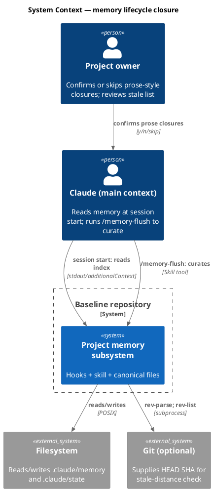

### C4 — Container

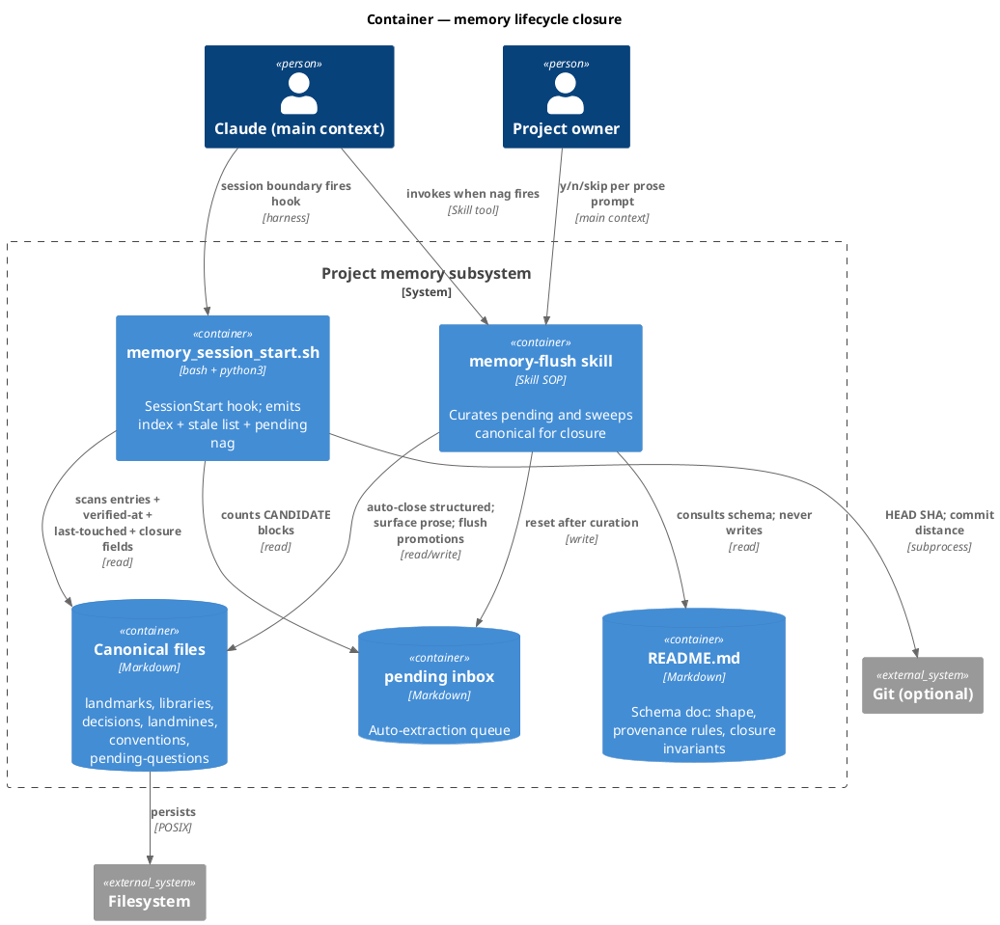

### C4 — Component (changed containers only)

Only `memory_session_start.sh` and the `memory-flush` skill change internals. The schema doc and canonical files gain documented fields but their structure (frontmatter plus `##` entries plus key/value lists) is unchanged.

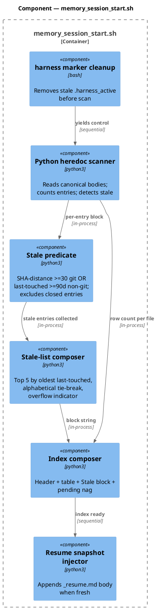

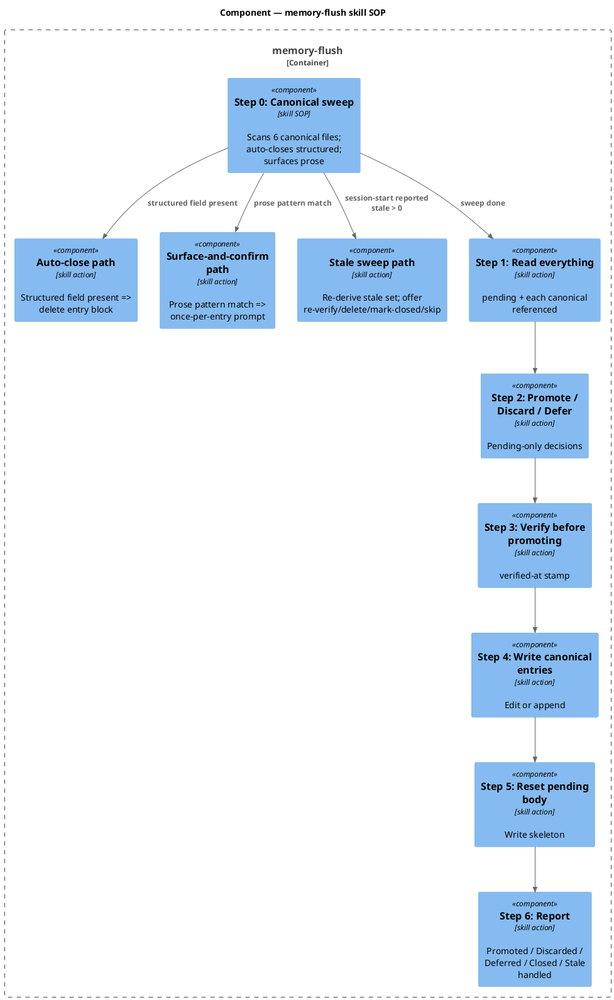

### Data model — class diagram

Entities here are markdown structures, not database tables. Each canonical entry is a level-2 heading block; fields are markdown list items shaped `- <key>: <value>`. The `<<new>>` markers below are the optional fields this spec adds.

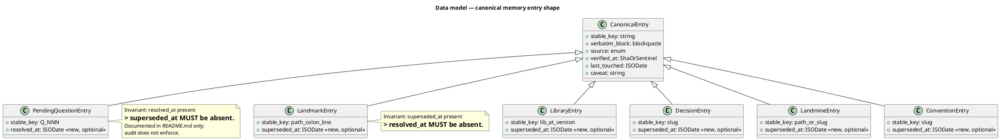

#### Schema delta (README.md)

No DDL — the persistence layer is markdown. The schema delta is documented in `.claude/memory/README.md`:

```markdown
## Closure fields (new)

Two optional, register-specific closure fields:

| File | Field | Semantics |
|---|---|---|
| `pending-questions.md` | `resolved-at: <ISO date>` | The question has been answered; entry is closed. |
| `landmarks.md`, `libraries.md`, `decisions.md`, `landmines.md`, `conventions.md` | `superseded-at: <ISO date>` | The fact is no longer true; entry is closed. |

**Per-file invariant**: on `pending-questions.md`, `superseded-at:` MUST NOT appear; on the other five canonical files, `resolved-at:` MUST NOT appear. Mutually exclusive at the file level. Not enforced by audit — documented invariant only.

**Lifecycle**: presence of either field causes `/memory-flush` Step 0 to delete the entry block on its next run (auto-close). Body-prose mentions of "Resolution path taken", "Resolved by/on/at", or "Superseded by/at/on" cause `/memory-flush` Step 0 to surface the entry for once-per-entry user confirmation; only `y` deletes the block.

**Stale ≠ closed.** An entry with a stale `verified-at:` is *unverified*, not *closed*. SessionStart counts unverified entries; closure is a separate, deliberate signal.
```

### Behavior — sequence per AC

One sequence per AC. AC-3, AC-5, AC-8 share §Behavior SessionStart since they describe the same hook path. AC-1, AC-2 share §Behavior FlushStep0. AC-4 has its own. AC-6 is a regression invariant. AC-7 is verified by re-running the audit.

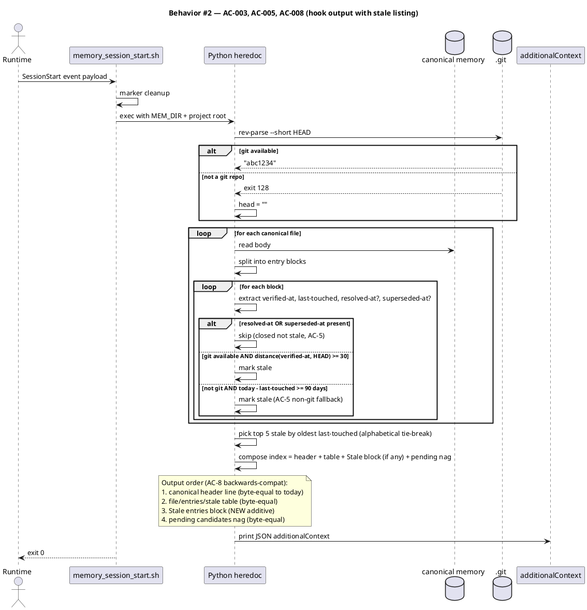

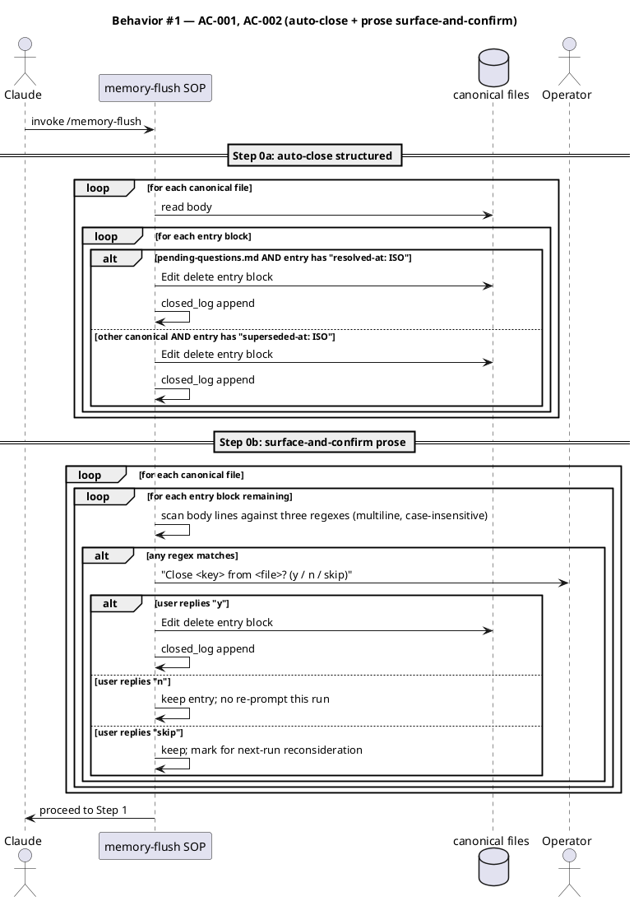

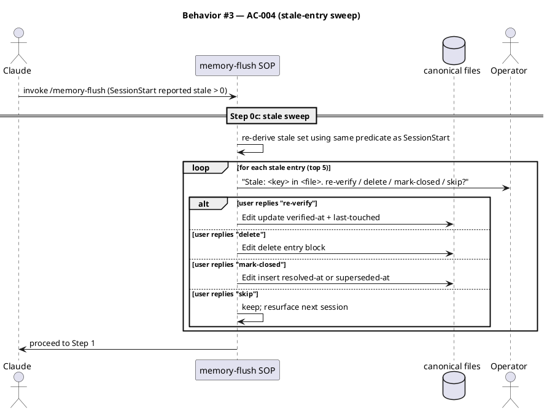

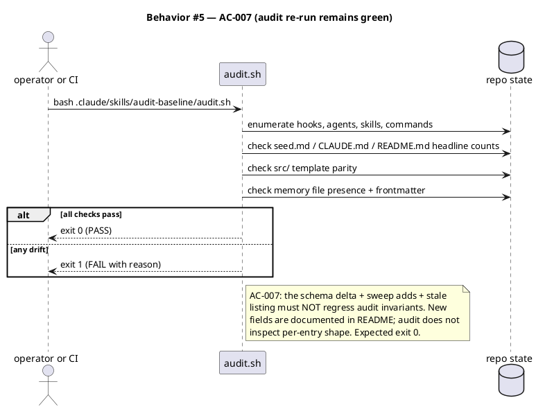

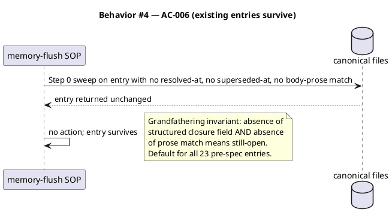

### State — core entity

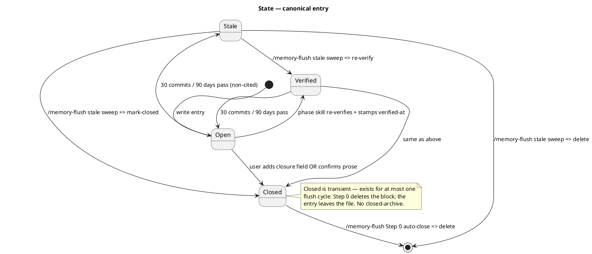

### Dependencies — graph

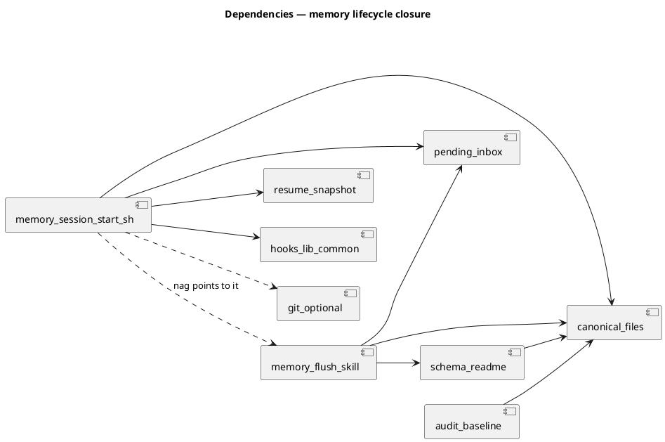

### Contracts

| Kind | Name | Input | Output | Errors | Idempotent |
|---|---|---|---|---|---|
| Hook | `memory_session_start.sh` (SessionStart) | Stdin JSON `{source, ...}` | Stdout JSON `{hookSpecificOutput: {hookEventName, additionalContext}}` | silent exit 0 on any internal error | yes (same input yields same output) |
| Skill | `/memory-flush` | None (reads disk) | Terminal report with Promoted/Discarded/Deferred/Closed/Stale-handled counts | per-prompt graceful; user may abort | no (each run can close different entries) |
| File | Canonical entry closure field | `- resolved-at: <ISO>` OR `- superseded-at: <ISO>` | n/a | malformed date: hook ignores closure status; entry stays open | yes (field is static fact) |

### Libraries and versions

| Library@version | Purpose | Key APIs | Confirmed via context7 |
|---|---|---|---|
| `python@3.x` (stdlib only) | parsing, dates, subprocess | `re.search`, `re.findall`, `re.split`, `Path.read_text`, `subprocess.check_output`, `datetime.fromisoformat`, `datetime.now(tz=timezone.utc)` | n/a — Python stdlib; already in use throughout `memory_session_start.sh` |
| `bash` builtins | shell glue | `[ -d ]`, `[ -f ]`, `read_payload` from `hooks/lib/common.sh` | n/a — POSIX |

No third-party library; context7 not invoked.

### Alternatives considered

| Alt | Summary | Rejected because |
|---|---|---|
| A | Universal `resolved-at:` on all six canonical files; structured-only detection | Drops AC-2 prose surface-and-confirm. Doesn't catch the Q-002 incident pattern. Field name "resolved" is semantically wrong for `landmarks.md` (a file gets invalidated, not resolved). |
| C | New `/memory-prune` skill separate from `/memory-flush` | YAGNI: one concrete use case. Article XI skill count goes 36→37 and ~6 file touches before the new skill body exists. Sweep logic is < 100 lines; doesn't need its own skill until SOP crosses ~200 lines. |

## Design calls

The files this work modifies are listed in §Rollout step 1-3. None of them intersect `project.json → tdd.ui_globs`. No UI surface.

- *(none)*

## Acceptance criteria

| ID | Criterion | Upstream AC | Sequence |
|---|---|---|---|
| AC-001 | Given a pending-questions entry carries `resolved-at: <ISO>`, OR a non-pending-questions canonical entry carries `superseded-at: <ISO>`, when `/memory-flush` runs, the entry's `##` block is removed and the `Closed (M)` line in the terminal report lists it. | intake AC-1 | §Behavior #1 |
| AC-002 | Given a canonical entry body matches any of three regexes (R1: `^(\s*-\s*)?\*\*?Resolution\s+(path\s+taken\|by\|date)\b` / R2: `^Superseded\s+(by\|at\|on)\b` / R3: `^Resolved\s+(by\|on\|at)\b`), case-insensitive multiline, AND no structured closure field is present, when `/memory-flush` runs, the skill surfaces one prompt per entry — `"Close <key> from <file>? (y / n / skip)"` — and acts on the reply: y deletes, n keeps and does-not-resurface-this-run, skip keeps and marks for next-run reconsideration. | intake AC-2 | §Behavior #1 |
| AC-003 | Given at least one canonical entry's `verified-at:` SHA is ≥ 30 commits behind HEAD (git) OR `last-touched:` is ≥ 90 days behind today (non-git), AND the entry has no closure field, when `memory_session_start.sh` fires, output includes a `## Stale entries` block listing top 5 by oldest `last-touched`, alphabetical by `<file>:<key>` on tie, with `… and N more` overflow indicator when stale-count > 5. | intake AC-3 | §Behavior #2 |
| AC-004 | Given SessionStart reported stale entries, when the user runs `/memory-flush`, Step 0c iterates the same stale set (re-derived from disk) and offers per-entry `re-verify / delete / mark-closed / skip` prompts. | intake AC-4 | §Behavior #3 |
| AC-005 | Given an entry has `resolved-at:` or `superseded-at:` set AND its `verified-at:` SHA is otherwise stale, when `memory_session_start.sh` computes the stale count, the entry is NOT counted as stale. Closure short-circuits decay. | intake AC-5 | §Behavior #2 |
| AC-006 | Given a canonical entry has no closure field and no body-prose regex match, when any of session-start / `/memory-flush` Step 0 / decay runs, the entry survives unchanged. | intake AC-6 | §Behavior #4 |
| AC-007 | Given the spec lands as defined, when `.claude/skills/audit-baseline/audit.sh` runs, it exits 0 (no count drift, no missing-file, no frontmatter regression). | intake AC-7 | §Behavior #5 |
| AC-008 | Given `memory_session_start.sh` output gains new lines, when an old `_resume.md` snapshot is re-injected, the canonical header line `HEAD: <sha> · total entries: N · stale (>=30 commits old): M` and the per-file table stay byte-equal to today's output; new Stale-entries block is added BELOW the table and ABOVE the pending-candidates nag. | intake AC-8 | §Behavior #2 |

## Test plan

Fixture-based integration tests, not unit tests on the SOP. Each fixture builds a stubbed `.claude/memory/` directory under a tempdir and exercises the hook + skill end-to-end against it.

| Category | Scenario | Expected | Covers |
|---|---|---|---|
| Golden path | Fixture: `pending-questions.md` entry with `resolved-at: 2026-05-01`; run flush simulator | Entry block removed; `Closed (1)` in report; file otherwise byte-equal | AC-001 |
| Golden path | Fixture: `landmarks.md` entry with `superseded-at: 2026-05-01`; run flush simulator | Entry block removed; `Closed (1)` in report | AC-001 |
| Input boundary | Fixture: `resolved-at:` with invalid date (`2026-13-99`) | Hook tolerates; entry remains open. Skill SOP surfaces the malformed value to operator. | AC-001 |
| Input boundary | Fixture: `resolved-at:` on `landmarks.md` (wrong file for field) | Hook ignores; skill SOP flags violation but does NOT delete (per-file invariant violation). | AC-001 (invariant) |
| Golden path | Fixture: `pending-questions.md` entry body contains `**Resolution path taken (2026-04-29):** ...` and no structured field; flush with stubbed reply `y` | Prompt surfaced once; on `y` removed; on `n` kept; on `skip` kept and re-prompts next run | AC-002 |
| Contract violation | Fixture: body contains `Resolved by Alice 2026-05-01` (R3 match, anchored) | Same flow as R1 | AC-002 |
| Contract violation | Fixture: body contains free-form word "resolved" mid-sentence (no anchor match) | NO surface prompt — regex anchored to line start | AC-002 |
| Golden path | Fixture: 7 entries spread across 3 files, ages 100, 95, 90, 50, 40, 30, 5 days (non-git tree); run hook simulator | Output contains Stale-entries block listing 5 oldest (100/95/90/50/40); no overflow indicator (only 5 stale, not >5) | AC-003 |
| Input boundary | Fixture: 8 entries stale; expect top-5 + `… and 3 more` | Block lists 5 + overflow | AC-003 |
| Input boundary | Fixture: 5 entries with identical `last-touched`; expect alphabetical `<file>:<key>` order | Block lists in alphabetical order | AC-003 |
| Golden path | Fixture: 2 stale entries; pre-stage SessionStart output; flush with stubbed replies `re-verify` then `delete` | First entry's `verified-at` + `last-touched` refreshed; second entry's block removed | AC-004 |
| Contract violation | Stale-sweep reply = `mark-closed` on a `pending-questions.md` entry | Entry gains `resolved-at: <today>`; entry NOT deleted this run; next run auto-closes | AC-004 |
| Regression trap | Fixture: entry has `resolved-at: 2026-05-01` AND `verified-at:` 50 commits behind HEAD | Hook does NOT count it as stale | AC-005 |
| Regression trap | Fixture: entry has neither closure field, no prose match, `verified-at: HEAD`; run all three paths | Entry unchanged through hook, flush Step 0, flush Step 0c | AC-006 |
| Regression trap | Fixture: pre-spec entry with no `source:`, no `verbatim:`, no closure field | Entry survives — grandfathering invariant | AC-006 |
| Failure mode | Run `bash .claude/skills/audit-baseline/audit.sh` against the changed repo | Exit 0; count lines match seed.md / CLAUDE.md / README.md headline claims | AC-007 |
| Regression trap | Diff hook output against today's output for an unchanged memory tree | Header line + table byte-equal; only NEW lines below the table | AC-008 |
| Regression trap | Old `_resume.md` from a pre-spec session, re-injected at fresh session | Hook does not crash; resume body appended below the new index format | AC-008 |

**Test runner.** Project's binding test is `bash .claude/skills/audit-baseline/audit.sh` (per `project.json → test.cmd`). The audit verifies presence and shape but does NOT execute the fixture-based tests above. The fixture tests are new and shipped as small bash + python harnesses next to the modified files (`.claude/skills/memory-flush/tests/run.sh`, `.claude/hooks/memory_session_start.test.sh`). These exit non-zero on any failure; runnable manually during `/tdd` and `/integrate`. The audit's PASS verdict (AC-7) remains the binding `last_test_result` stamp.

## Observability

| Signal | Name | Shape | Purpose |
|---|---|---|---|
| Log | hook log line | stderr: `memory_session_start emitted memory index` (existing, unchanged) | Confirms hook ran |
| Skill report | `/memory-flush` terminal output | `Promoted (N) / Discarded (M) / Deferred (K) / Closed (P) / Stale handled (Q)` | User-visible summary per run |

No new metrics, no new alarms. Memory subsystem is local-only.

## Rollout

- **Feature flag**: none. Edit-in-place; ship the three file edits + the two test harnesses in one chore-track commit.
- **Migration order**: 1. update `.claude/memory/README.md` (schema doc). 2. update `.claude/skills/memory-flush/SKILL.md` (Step 0 added). 3. update `.claude/hooks/memory_session_start.sh` (stale-list + closure-exclusion). 4. add fixture-based tests. 5. run audit + tests → PASS. 6. `/grant-commit` and `/commit` are non-applicable (non-git tree); workflow ends at `/archive`.
- **Canary**: n/a — single-operator project. The next `/memory-flush` and next session-start are the canary.

## Rollback

- **Kill-switch**: revert the three changed files to pre-spec content and delete the two fixture-test harnesses. There is no flag because there is no flag plumbing — the new behavior is unconditional once the files change.
- **Signal to roll back**: any of (a) audit returns non-zero on fresh session-start, (b) the hook output's header line drifts byte-non-equal from today's format (AC-8 violation visible in a session-start diff), (c) `/memory-flush` deletes an entry the user did not approve (AC-2 / AC-6 violation — obvious in the same turn). Manual detection; no automated rollback signal.

## Archive plan

- Defaults *(automatic)*: intake, scout, research, spec, spec-rendered/ (if generated), spec approval, security report (if produced).
- Extras *(list any non-default files)*:
  - *(none)*

## Open questions

- *(none)*  — research's 5 open questions are resolved in the §Design body and §Acceptance criteria table.
