# Spec — supply-chain hardening (Tier 1 + 2 + 3)

<!--
Technical spec. Produced by the `spec` skill.
Guard-enforced invariants: required ## headings + required diagram kinds.
Approval: NEVER add "Status: Approved" — spec_approval_guard blocks it.
-->

## Context

| Input | Path |
|---|---|
| Intake | *(excepted — Snyk article + gap analysis is intake-equivalent; see Context below)* |
| BRD *(if any)* | *(none)* |
| Scout *(if any)* | *(excepted — touchpoints listed inline)* |
| Research *(if any)* | *(excepted — three primary sources reviewed; findings inline)* |

**Primary sources reviewed**:
- Snyk, *TanStack npm Packages Compromised* (CVE-2026-45321, GHSA-g7cv-rxg3-hmpx) — `https://snyk.io/blog/tanstack-npm-packages-compromised/`
- NVD + GHSA, *tj-actions/changed-files* (CVE-2025-30066) — `https://nvd.nist.gov/vuln/detail/CVE-2025-30066`, `https://github.com/advisories/GHSA-mrrh-fwg8-r2c3`
- Adnan Khan, *The monsters in your build cache: GitHub Actions cache poisoning* (2024-05-06, updated 2025-01) — `https://adnanthekhan.com/2024/05/06/the-monsters-in-your-build-cache-github-actions-cache-poisoning/`

**Cross-cutting patterns extracted from the three attacks**:

| Pattern | Used by |
|---|---|
| `/proc/<pid>/mem` runner-memory dump to extract tokens | TanStack, tj-actions, Adnan's PoC |
| Mutable git tags retroactively pointed at malicious commits | tj-actions root cause |
| GitHub Actions cache poisoning with 6-hour token validity | TanStack delivery, Adnan's research |
| `gist.githubusercontent.com` as exfil / second-stage host | TanStack second stage, tj-actions first stage |
| Injected `optionalDependencies` with `prepare` script | TanStack payload delivery into target tarball |
| Valid SLSA L3 provenance on malicious build | TanStack ("first documented npm worm with valid attestation"), Adnan's "Most Devious Backdoor" PoC |
| Three-layer obfuscation + daemonization + persistent hooks | TanStack |
| Specific targeting of `.claude/` project files for persistence | TanStack |

**Touchpoints in our codebase** (scout-equivalent):
- `scripts/check-files-diff.mjs` — extend with package.json integrity + executable allowlist
- `scripts/smoke-tarball.mjs` — extend with installed-tree hash verification
- `tests/publish-check.test.mjs` — extend with negative-path coverage for each new check
- `docs/runbooks/npm-publish.md` — substantial additions
- `src/.npmrc.template` — **new** pristine ship-time file
- `scripts/build-template.sh` — overlay the new template into `obj/template/`
- `bin/cli.js` + `src/cli/doctor.js` — strengthen `doctor` for verify use case (design call below)
- `package.json` — pin devDependencies to exact versions

## Goal

When a maintainer runs `npm run publish:check`, the script catches every TanStack-style attack vector that's mechanically detectable at pack time (injected deps, prepare scripts, surprise executables, hash drift). When a downstream user runs `npx create-baseline verify <target>`, the CLI exits non-zero if any byte of the materialized baseline has been tampered with after install. When an operator follows the updated runbook, they explicitly check for the dead-man's-switch indicators Snyk documented before any credential operation.

## Non-goals

- **Sigstore / cosign signing of our published tarball.** Operator keypair management is out of scope; deferred until we have CI.
- **CI pipeline.** This workflow does not add GitHub Actions; the runbook documents future-CI invariants but does not implement them.
- **Provenance generation.** `npm publish --provenance` requires OIDC; deferred until CI exists. The runbook documents the limitations of provenance (both Snyk and Adnan agree it attests build, not authorization).
- **Two-person publish rule.** Operational policy, not technical control; deferred.
- **Rebuilding from scratch on every install.** Out of scope; the verify command compares against the shipped manifest, it does not re-build.
- **Real-time exfiltration detection.** Egress monitoring (Harden-Runner / Step Security) is footnoted in the runbook but not implemented.

## Design

Diagrams are the contract. Prose is only for things a diagram cannot say.

### Design call — `verify` subcommand vs. strengthen `doctor`

**Selected**: strengthen the existing `doctor` subcommand. Rationale:
- `doctor` already reads `.baseline-manifest.json` and reports matched / customized / missing / added paths against the install snapshot.
- The new behavior — flag a `customized` path as `FAIL` rather than informational when the user has not declared an opt-out, AND surface the named files prominently — is a contract change, not a new surface.
- Keeps the CLI surface at four modes (default install, `--force`, `--merge`, `doctor`) instead of five.
- Operators expecting "did the baseline tamper" will already reach for `doctor`; making it stricter matches that mental model.

`doctor` gains a new flag `--strict` (default `false` for backwards compatibility; `true` is what `npm run baseline:verify` invokes via a target-project npm script the user wires up).

### C4 — System context

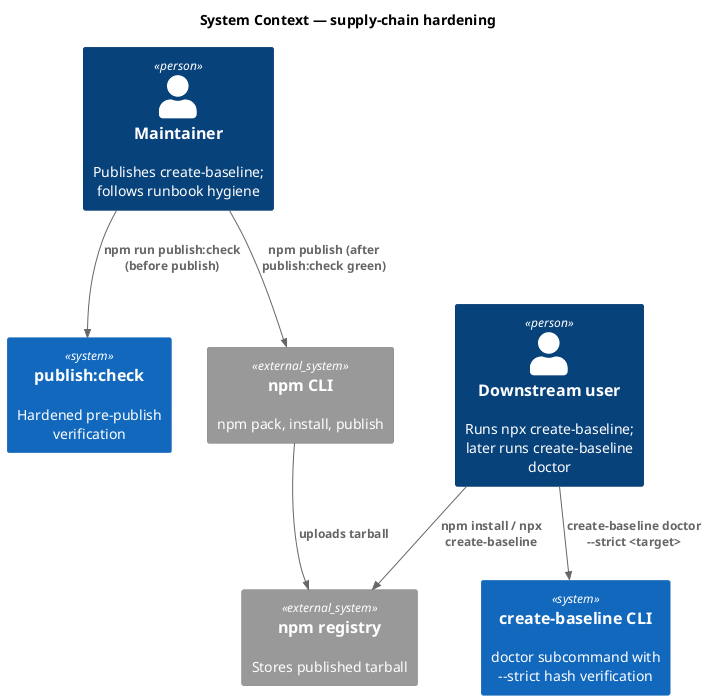

### C4 — Container

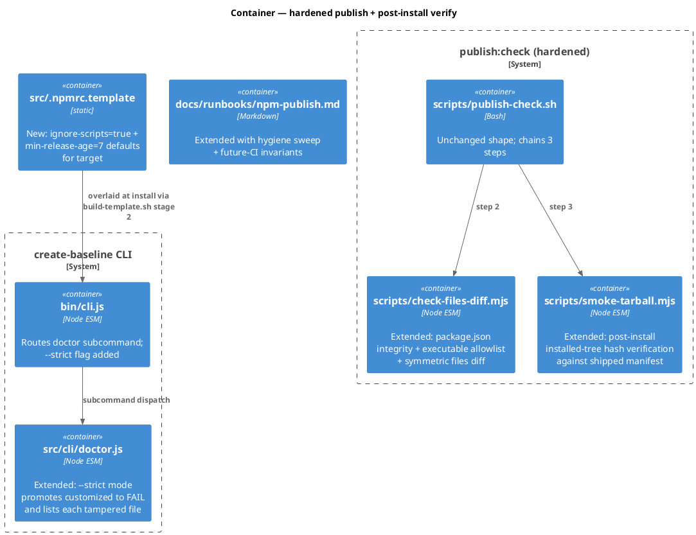

### C4 — Component (changed containers only)

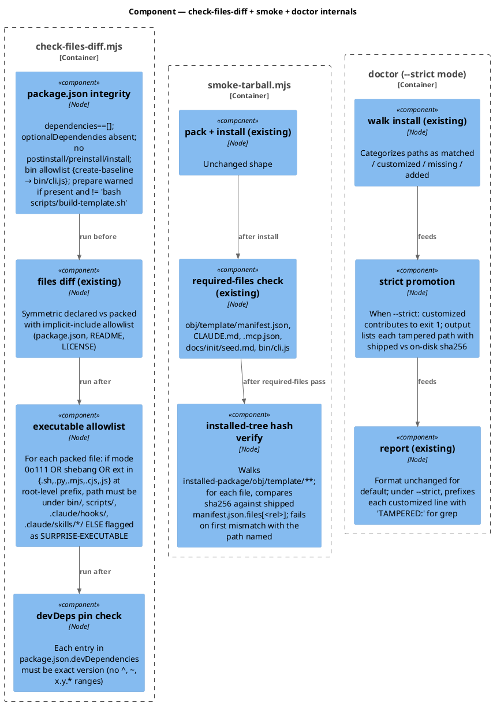

### Data model — class diagram

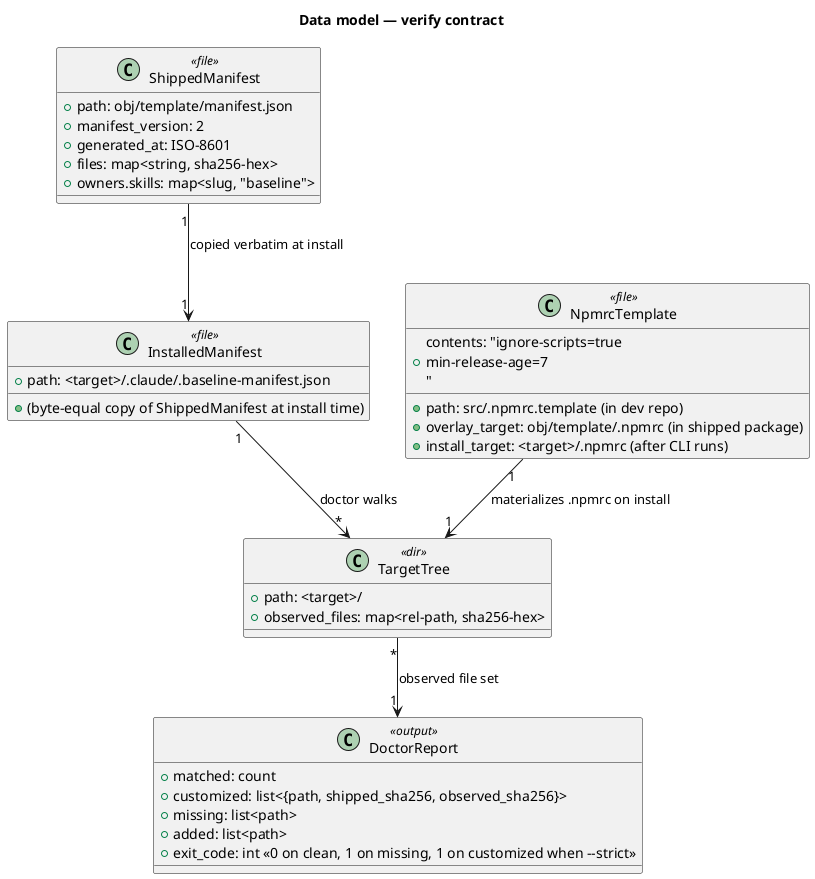

#### Migration DDL

```sql
-- forward
-- File-system only; no schema migration.
-- New files:
--   src/.npmrc.template (overlay source)
-- Modified files:
--   scripts/check-files-diff.mjs (+ 4 sub-checks)
--   scripts/smoke-tarball.mjs (+ installed-tree hash verify)
--   src/cli/doctor.js (+ --strict mode)
--   bin/cli.js (route --strict flag to doctor)
--   tests/publish-check.test.mjs (+ 6 cases)
--   tests/doctor.test.mjs (+ 2 cases for --strict)
--   scripts/build-template.sh (overlay .npmrc template in stage 2)
--   docs/runbooks/npm-publish.md (substantial new sections)
--   package.json (devDependencies pinned to exact versions; @11ty/eleventy@3.1.5, nunjucks@3.2.4)

-- reverse
-- Delete src/.npmrc.template and the overlay line in build-template.sh.
-- Revert the script + test edits.
-- Restore ^-range devDependency entries.
```

### Behavior — sequence per AC

#### §Behavior #1 — Files-diff catches injected optionalDependencies (AC-001)

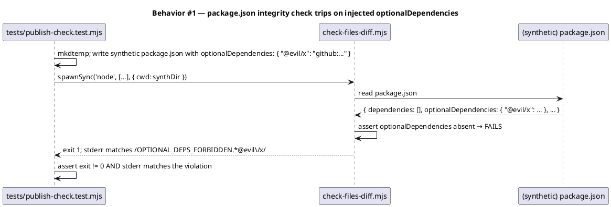

#### §Behavior #2 — Files-diff catches injected postinstall script (AC-002)

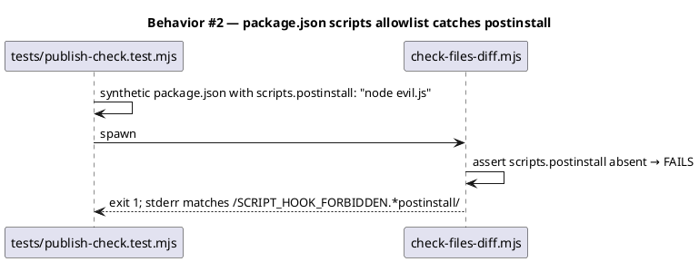

#### §Behavior #3 — Files-diff catches surprise executable (AC-003)

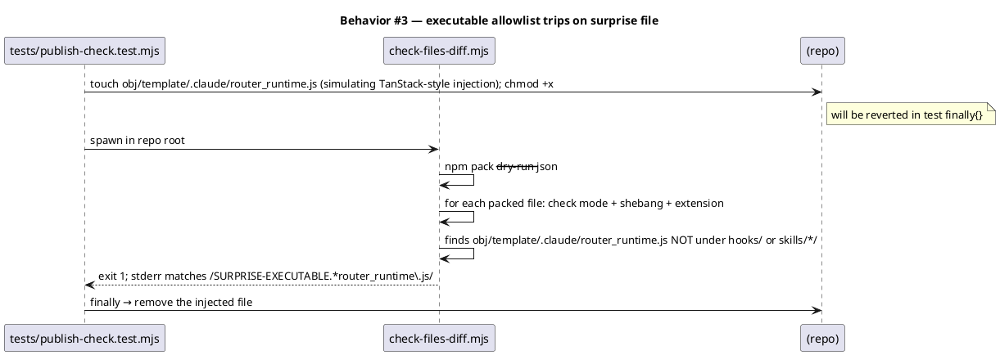

#### §Behavior #4 — Smoke catches manifest-hash drift between shipped and installed (AC-004)

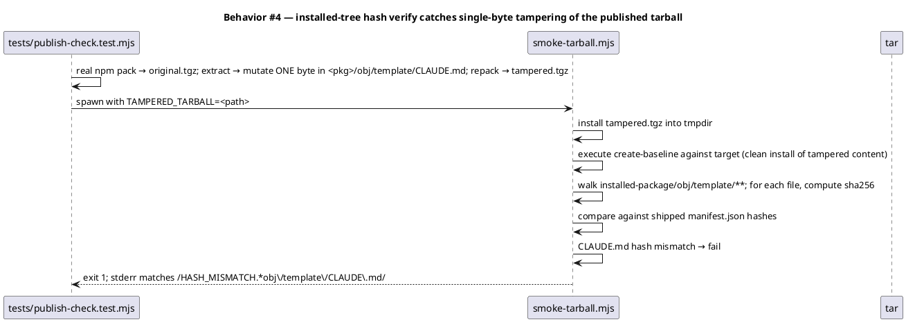

#### §Behavior #5 — devDependency exact-version check (AC-005)

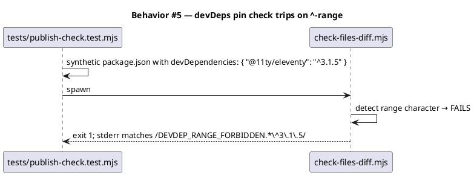

#### §Behavior #6 — doctor --strict surfaces tampered file as FAIL (AC-006)

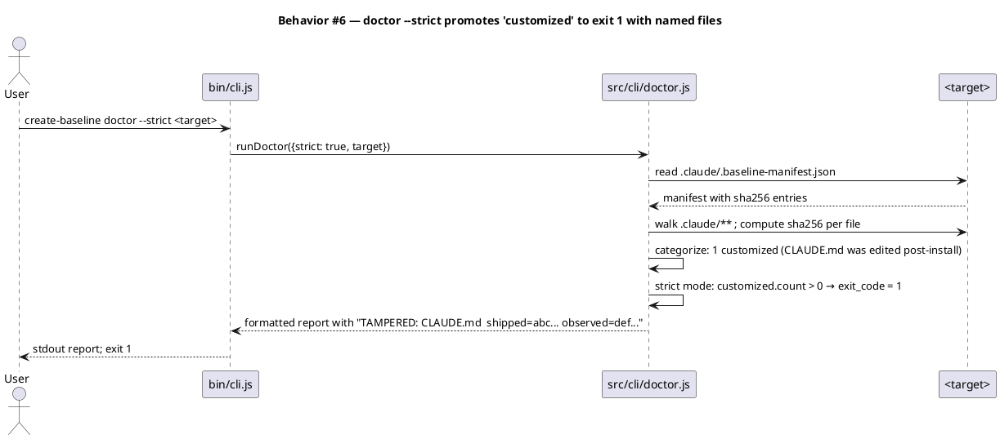

#### §Behavior #7 — npx create-baseline materializes target/.npmrc (AC-007)

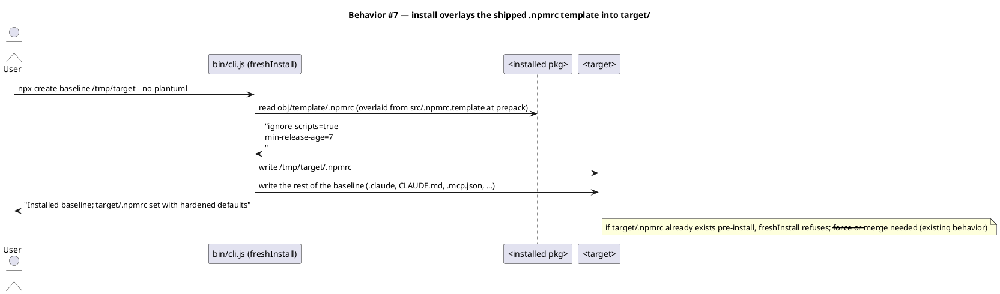

#### §Behavior #8 — runbook hygiene sweep covers Snyk-documented IOCs (AC-008)

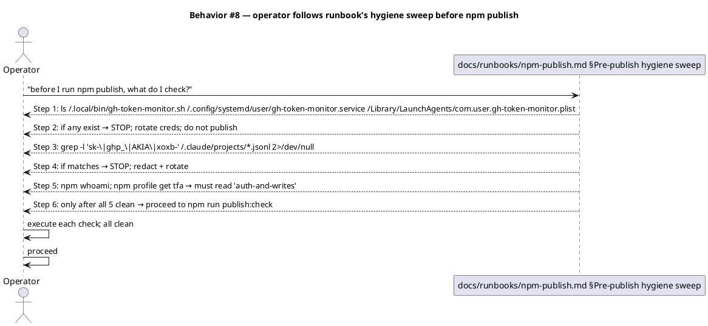

### State — `doctor --strict` exit-code state machine

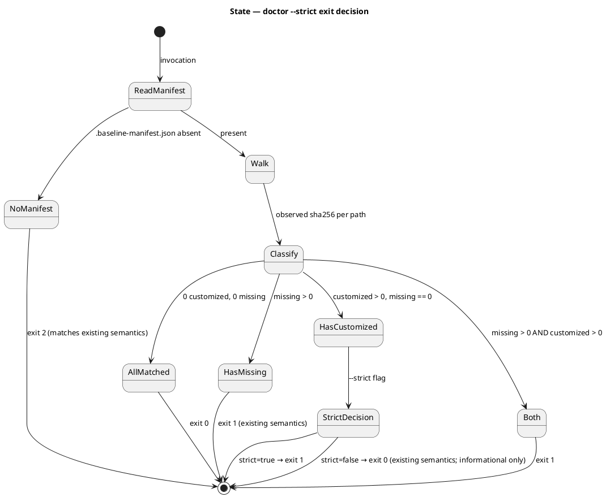

### Dependencies — graph

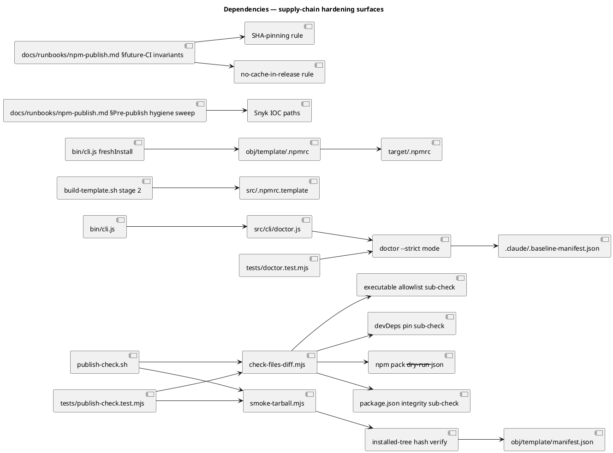

### Contracts

| Kind | Name | Input | Output | Errors | Idempotent |
|---|---|---|---|---|---|
| CLI | `create-baseline doctor [<target>] [--strict]` | optional target dir; optional flag | stdout report categorizing paths | `--strict` exits 1 on any `customized` | yes |
| CLI | `npm run publish:check` (unchanged shape) | repo CWD | summary line | new failure modes via extended sub-checks | yes |
| File | `<target>/.npmrc` | written by `freshInstall` from `obj/template/.npmrc` | `ignore-scripts=true\nmin-release-age=7\n` | refuses overwrite without `--force`/`--merge` | yes |
| File | `obj/template/.npmrc` | overlaid in build-template.sh stage 2 from `src/.npmrc.template` | as above | n/a | yes |
| Script | `scripts/check-files-diff.mjs` (extended) | reads package.json + npm pack JSON | report; exit codes: 0 clean, 1 violation | new violation codes: `OPTIONAL_DEPS_FORBIDDEN`, `SCRIPT_HOOK_FORBIDDEN`, `BIN_PATH_FORBIDDEN`, `SURPRISE-EXECUTABLE`, `DEVDEP_RANGE_FORBIDDEN`, plus existing | yes |
| Script | `scripts/smoke-tarball.mjs` (extended) | repo CWD | phase log; exit codes: 0 clean, 1 violation | new violation: `HASH_MISMATCH: <path>` | yes |
| Doc | `docs/runbooks/npm-publish.md` (extended) | (read-only) | step-by-step actions | n/a | n/a |

### Libraries and versions

| Library@version | Purpose | Key APIs | Confirmed via context7 |
|---|---|---|---|
| `node@>=18.17.0` | Runtime (engines.node) | `fs/promises`, `crypto.createHash('sha256')`, `child_process.execFileSync`, `node:test` | no (stdlib; established pattern) |
| `npm@11.11.0` | CLI tool (preinstalled) | `npm pack --dry-run --json` (files[].mode field used for the executable check) | no (local `npm help`; verified empirically) |
| `@11ty/eleventy@3.1.5` (pinned this workflow) | site build (devDep only; not shipped) | `eleventy.config.cjs` integration unchanged | no |
| `nunjucks@3.2.4` (pinned this workflow) | site templating (devDep only; not shipped) | implicit via Eleventy | no |

Zero new runtime or dev dependencies introduced. The two existing devDeps are pinned exact, not added.

### Alternatives considered

| Alt | Summary | Rejected because |
|---|---|---|
| A | New `create-baseline verify <target>` subcommand instead of strengthening `doctor` | Adds a fifth CLI surface for behavior `doctor` is already designed to do; cognitive overhead for downstream users. Selected path: extend `doctor` with `--strict`. |
| B | Sign published tarball with cosign + verify on install | Requires operator keypair management out of band; cosign isn't a runtime dep. Deferred to a future workflow once CI exists (where ephemeral keys via Sigstore OIDC are cheap). |
| C | Embed a Trusted Signing Identity (a public key) in the CLI; refuse install if registry tarball doesn't match | Same key-management problem; chicken-and-egg with first publish (which key signs version 0.1.0?). Deferred. |
| D | Auto-rotate the shipped manifest's `generated_at` to a deterministic value (no wall clock) so two builds produce byte-identical manifests | Useful for reproducible-build verification, but the smoke test reads the live shipped manifest, not a pinned hash. Out of scope; potential future workflow. |
| E | Ship `npm-shrinkwrap.json` alongside the package | Locks the downstream's npm install, but we have zero runtime deps so it adds nothing today. Worth revisiting if we ever take a runtime dep. |
| F | Use a separate `runtime` and `tools` package split (mono-publish) | Premature; we have one CLI today. |

## Design calls

*(none — no UI write_set intersection with `project.json → tdd.ui_globs`)*

## Acceptance criteria

| ID | Criterion (given / when / then) | Upstream | Sequence |
|---|---|---|---|
| AC-001 | Given a synthetic `package.json` with `optionalDependencies: { "@evil/x": "github:..." }`, when `node check-files-diff.mjs` runs in that cwd, then exit non-zero with stderr matching `/OPTIONAL_DEPS_FORBIDDEN.*@evil\/x/`. | TanStack injected-optionalDeps vector | §Behavior #1 |
| AC-002 | Given a synthetic `package.json` with `scripts.postinstall: "node evil.js"`, when files-diff runs, then exit non-zero with stderr matching `/SCRIPT_HOOK_FORBIDDEN.*postinstall/`. Same check fires on `preinstall`, `install`. Note: `prepare` is allowed only when its value is exactly `bash scripts/build-template.sh`. | TanStack prepare-script vector + npm install-hook RCE class | §Behavior #2 |
| AC-003 | Given a synthetic file at `obj/template/.claude/router_runtime.js` chmod +x (TanStack-style injection), when files-diff runs on the real repo, then exit non-zero with stderr matching `/SURPRISE-EXECUTABLE.*router_runtime\.js/`. Allowlist: `bin/`, `scripts/`, `.claude/hooks/`, `.claude/skills/*/`. The check examines mode bits AND shebang AND extension (`.sh`, `.py`, `.mjs`, `.cjs`, `.js`). | TanStack persistence via `.claude/router_runtime.js` | §Behavior #3 |
| AC-004 | Given a real `npm pack`-produced tarball with ONE byte mutated in `<pkg>/obj/template/CLAUDE.md` then repacked, when `smoke-tarball.mjs` runs with `TAMPERED_TARBALL=<path>` env override, then exit non-zero with stderr matching `/HASH_MISMATCH.*obj\/template\/CLAUDE\.md/`. | Post-publish tampering / cache poisoning of the install path | §Behavior #4 |
| AC-005 | Given a synthetic `package.json` whose `devDependencies` carries a `^`-range value, when files-diff runs, then exit non-zero with stderr matching `/DEVDEP_RANGE_FORBIDDEN/`. The check rejects any of `^`, `~`, `*`, `x`, `>`, `<`, ` ` (space-separated), `||`. Exact pins like `3.1.5` pass. Git URLs and file URLs fail with a separate code `DEVDEP_NON_REGISTRY`. | Dev-dep supply-chain hardening | §Behavior #5 |
| AC-006 | Given an installed baseline at `<target>` where `<target>/CLAUDE.md` has been edited post-install (one byte changed), when `create-baseline doctor --strict <target>` runs, then exit 1 with stdout matching `/TAMPERED: CLAUDE\.md.*shipped=[0-9a-f]{64}.*observed=[0-9a-f]{64}/`. Without `--strict`, the same case exits 0 (existing behavior preserved). | Post-install tampering detection | §Behavior #6 |
| AC-007 | Given a fresh empty target dir, when `node bin/cli.js <target> --no-plantuml` runs against the current published-style installed package (or an `npm install ./<tarball>` of it), then `<target>/.npmrc` exists and contains exactly `ignore-scripts=true\nmin-release-age=7\n` (no extra blank lines, no comments, no BOM). | Defense-in-depth: ship hardened npm defaults to downstreams | §Behavior #7 |
| AC-008 | Given `docs/runbooks/npm-publish.md` after this workflow lands, when an operator reads the "Pre-publish hygiene sweep" section, then the section names — verbatim, character-for-character — these paths: `~/.local/bin/gh-token-monitor.sh`, `~/.config/systemd/user/gh-token-monitor.service`, `~/Library/LaunchAgents/com.user.gh-token-monitor.plist`; AND the section contains a `grep` command pattern that scans `~/.claude/projects/*.jsonl` for credential-like substrings (`sk-`, `ghp_`, `AKIA`, `xoxb-`). | Snyk-documented IOC paths must travel into our docs | §Behavior #8 |
| AC-009 | Given `docs/runbooks/npm-publish.md` after this workflow lands, when an operator reads the "Future-CI invariants" section, then it contains: (a) the rule "third-party Actions MUST be pinned to a 40-character commit SHA, never to tag refs" with the tj-actions CVE-2025-30066 citation; (b) the rule "release workflows MUST set `cache: false` on `setup-*` actions and MUST NOT use `actions/cache`" with the SLSA L3 quote from Adnan's paper; (c) a footnote naming `step-security/harden-runner` as an egress-monitoring evaluation candidate. | Forward-looking CI hygiene from research | n/a (text invariant) |
| AC-010 | Given the test suite after this workflow lands, when `npm test` runs, then all 142 pre-existing tests pass + the new tests added by this workflow pass; audit-baseline reports PASS; `npm run publish:check` exits 0 against the current repo. | Regression discipline | n/a (integration) |

## Test plan

| Category | Scenario | Expected | Covers |
|---|---|---|---|
| Golden path | publish:check on current tree | exit 0; PASS summary | AC-010 |
| Golden path | doctor (no --strict) on fresh-installed target | exit 0; matched count == manifest entries; customized == 0 | AC-006 baseline (no regression) |
| Input boundary | files-diff on synthetic pkg with `optionalDependencies` | exit 1; OPTIONAL_DEPS_FORBIDDEN named | AC-001 |
| Input boundary | files-diff on synthetic pkg with `postinstall` | exit 1; SCRIPT_HOOK_FORBIDDEN.postinstall | AC-002 |
| Input boundary | files-diff on synthetic pkg with `preinstall` | exit 1; SCRIPT_HOOK_FORBIDDEN.preinstall | AC-002 |
| Input boundary | files-diff on synthetic pkg with `install` script | exit 1; SCRIPT_HOOK_FORBIDDEN.install | AC-002 |
| Input boundary | files-diff on synthetic pkg with `prepare` != allowlisted value | exit 1; PREPARE_NOT_ALLOWLISTED | AC-002 boundary |
| Contract violation | files-diff with `obj/template/.claude/router_runtime.js` chmod +x injected then reverted | exit 1; SURPRISE-EXECUTABLE.router_runtime.js | AC-003 |
| Contract violation | files-diff on synthetic pkg with `devDependencies: { "x": "^1.0.0" }` | exit 1; DEVDEP_RANGE_FORBIDDEN | AC-005 |
| Contract violation | files-diff on synthetic pkg with `devDependencies: { "x": "github:foo/bar" }` | exit 1; DEVDEP_NON_REGISTRY | AC-005 |
| Contract violation | smoke against tampered tarball (1 byte mutated in CLAUDE.md, repacked) | exit 1; HASH_MISMATCH:obj/template/CLAUDE.md | AC-004 |
| Behavior | doctor --strict on installed target with one byte mutated in CLAUDE.md | exit 1; "TAMPERED: CLAUDE.md" with shipped+observed sha256 | AC-006 |
| Behavior | doctor --strict on clean installed target | exit 0 | AC-006 |
| Behavior | npx create-baseline → target/.npmrc exists with exact required contents | file exists; bytes match exactly | AC-007 |
| Text invariant | runbook contains the 3 Snyk IOC paths verbatim | regex match per AC-008 | AC-008 |
| Text invariant | runbook contains future-CI invariants section with SHA-pinning + cache rules | regex match per AC-009 | AC-009 |
| Regression trap | All 142 pre-existing tests pass | full suite green | AC-010 |
| Regression trap | audit-baseline overall PASS | fails=0 warns=0 | AC-010 |

## Observability

| Signal | Name | Shape | Purpose |
|---|---|---|---|
| Log | stdout from `publish-check.sh` | unchanged shape; new failure codes propagate | operator triage |
| Log | stdout from `doctor --strict` | new `TAMPERED:` prefix per offending file | post-install audit |
| Log | stderr from `check-files-diff.mjs` | new violation codes documented in script header | publish-time triage |
| Alarm | *(none — operator-driven, no SLO)* | — | — |

## Rollout

- **Feature flag**: none for Tier 1/Tier 2 (additive). For Tier 3, the `--strict` flag is opt-in (default `false`) so existing `doctor` callers keep their semantics.
- **Migration order**: (1) write failing tests RED; (2) extend check-files-diff with the 4 new sub-checks; (3) extend smoke-tarball with the hash verify; (4) extend doctor with --strict; (5) write src/.npmrc.template + add overlay line to build-template.sh; (6) pin devDependencies in package.json; (7) extend the runbook with hygiene-sweep + future-CI sections; (8) `npm test` GREEN; (9) `npm run publish:check` exits 0; (10) audit-baseline PASS.
- **Canary**: not applicable — operator runs `publish:check` before each release; first invocation post-merge is the canary.

## Rollback

- **Kill-switch**: revert the script + spec + runbook edits; delete `src/.npmrc.template` and the corresponding stage-2 cp line. `doctor` retains backwards-compat semantics without `--strict`.
- **Signal to roll back**: `publish:check` consistently false-positives (refuses a known-good tree), OR `doctor --strict` flags drift that does not exist. Operator notices on first run; rollback is file-revert.

## Archive plan

- Defaults *(automatic)*: spec, spec approval, security report (concatenated). Note: intake/scout/research are in `exceptions` for this workflow.
- Extras *(list any non-default files)*:
  - *(none — runbook updates are product; src/.npmrc.template is product; scripts changes are product)*

## Open questions

- *(none — research-driven scope; design call resolved; ACs cover the named threat models)*
