# GA4 instrumentation — Friedbot Studio site

<!--
Technical spec produced by the `spec` skill.
Required sections: Goal, Design, Design calls, Acceptance criteria, Test plan.
Required diagrams: c4_context, c4_container, c4_component, sequence, class, dependency_graph.
Approval is the token written by `/approve-spec`. Do not write Status: Approved here.
-->

## Context

| Input | Path |
|---|---|
| Intake | `docs/intake/ga4-instrumentation.md` |
| Scout | `docs/scout/ga4-instrumentation.md` |
| Research | `docs/research/ga4-instrumentation.md` |

## Goal

Every production page of the Friedbot Studio site loads gtag.js with Measurement ID `G-MYCZFYXE38` and fires three named interactions (`select_content` for CTAs, `copy_install_command` for the install copy button, and Enhanced Measurement's built-in `click` for outbound links to `friedbotstudio.com`) visible in GA4 Realtime within 30s of the user gesture; dev builds emit no gtag request.

## Non-goals

- **Cookie-consent UX**. No banner, no Consent Mode v2 default-denied flow in this iteration. The follow-up workflow `ga4-consent-mode` (to be triaged separately) will add it. Risk acknowledged in Rollout.
- **Custom outbound-link code**. The footer's `friedbotstudio.com` link is measured via GA4's Enhanced Measurement `click` event, configured server-side in the GA4 property admin. No client-side selector or listener is added for outbound clicks.
- **Tracking every `<button>` element**. The site's only native `<button>` elements are `cli-strip` (instrumented as copy) and `nav-toggle` (UI mechanical — explicitly excluded). The "CTAs" are the four `.btn-primary` / `.btn-secondary` anchors marked with a new `data-cta` attribute.
- **Performance optimization or Core Web Vitals work** — owned by iteration 2 via `/optimize-seo`.
- **BigQuery export, audiences, funnels, conversion modeling configuration** — out of scope.
- **Server-side / Measurement Protocol tracking** — client-side gtag.js only.

## Design

Diagrams are the contract. Prose appears only where a diagram cannot say it.

### C4 — System context

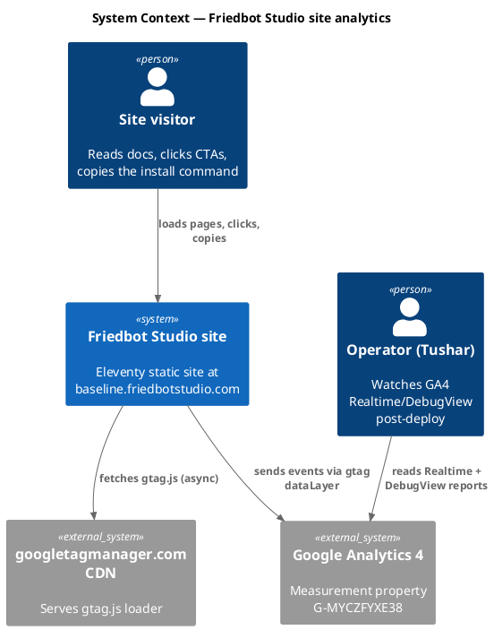

### C4 — Container

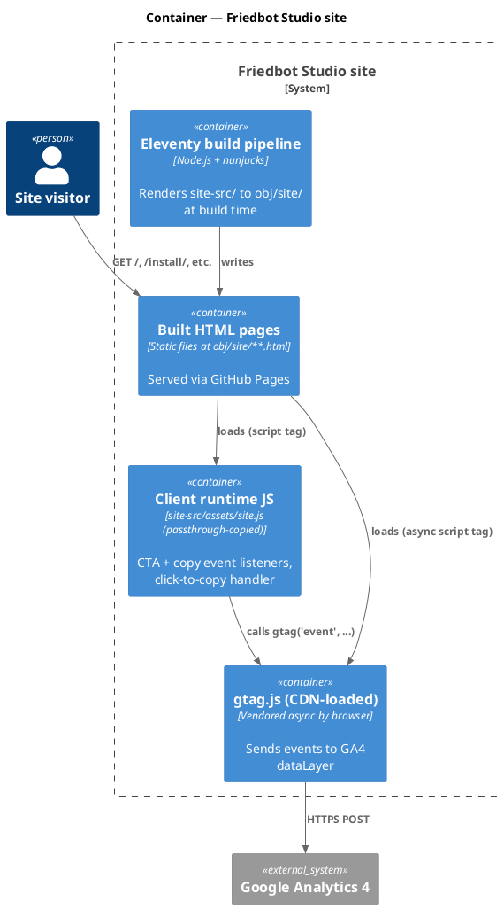

### C4 — Component (eleventy_build internals — the only container that changes)

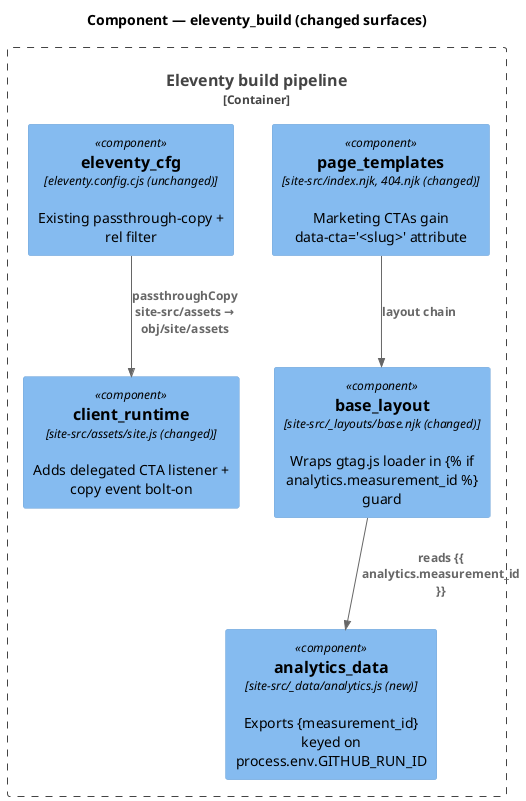

### Data model — class diagram

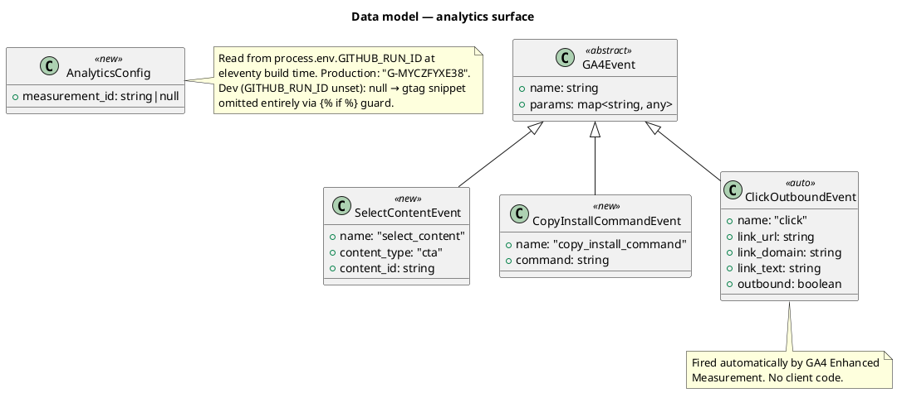

No migration DDL — no persistent storage owned by this work.

### Behavior — sequence per AC

#### §Behavior #1 — Build emits gtag loader to every prod HTML page (AC-001)

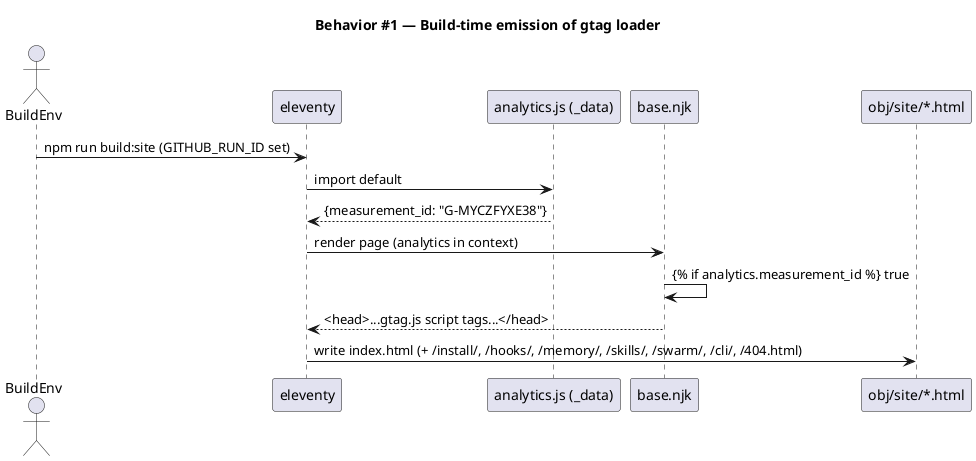

#### §Behavior #2 — Visitor loads prod page; gtag fires page_view (AC-002)

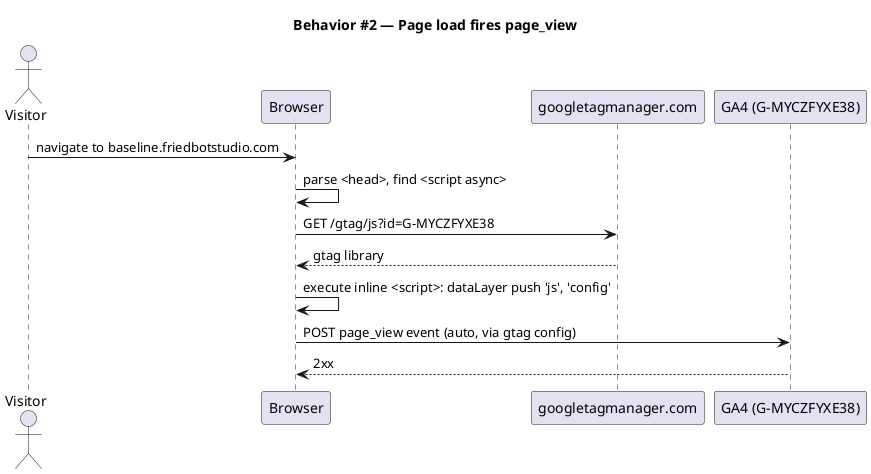

#### §Behavior #3 — Visitor clicks a CTA; select_content fires (AC-003)

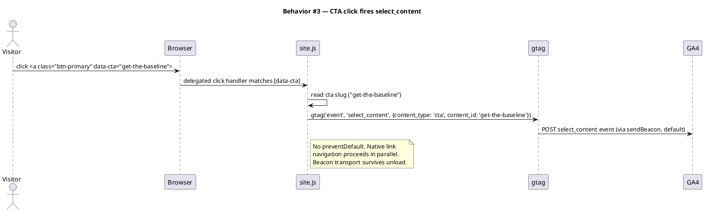

#### §Behavior #4 — Visitor clicks cli-strip; copy_install_command fires (AC-004); no double-count

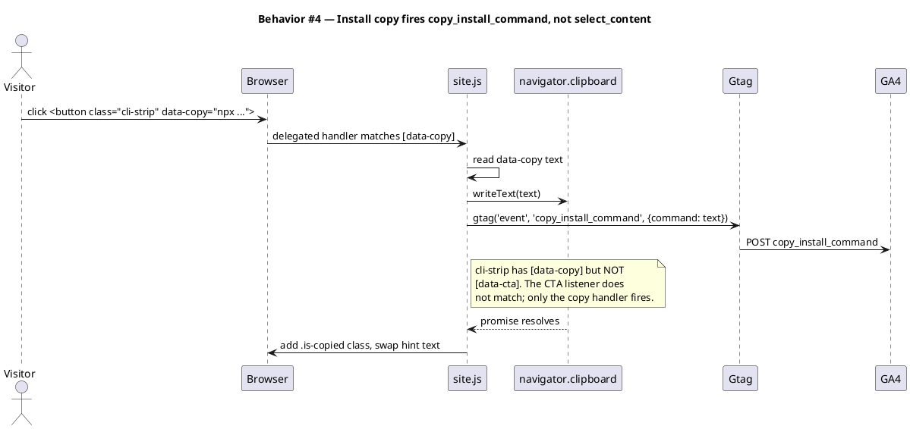

#### §Behavior #5 — Visitor clicks footer friedbotstudio.com link (AC-005)

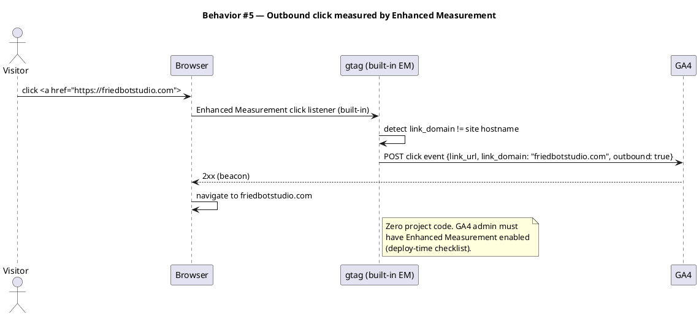

#### §Behavior #6 — Dev preview loads page; no gtag request (AC-006)

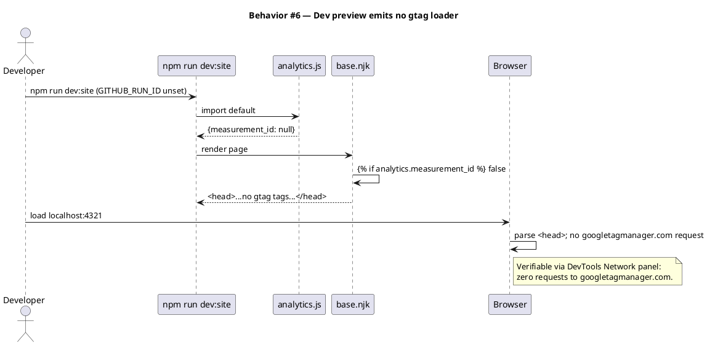

### Dependencies — graph

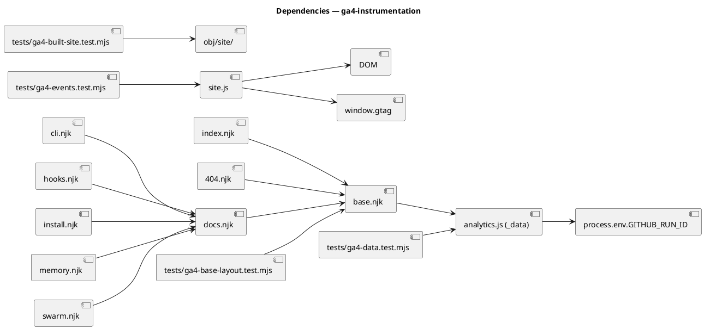

### Contracts

| Kind | Name | Input | Output | Errors | Idempotent |
|---|---|---|---|---|---|
| Data file | `site-src/_data/analytics.js` | env (`GITHUB_RUN_ID`) | `{measurement_id: string\|null}` | — | yes (pure function of env) |
| Template guard | `` in `base.njk` | render context | head-fragment with/without gtag tags | — | yes (declarative) |
| JS listener | delegated `click` on `[data-cta]` | DOM click event | `gtag('event', 'select_content', …)` | gtag undefined → silent no-op | no (user gesture) |
| JS listener | bolt-on inside `[data-copy]` handler | DOM click event | `gtag('event', 'copy_install_command', …)` + clipboard write | gtag undefined → silent no-op | no (user gesture) |
| GA4 event (auto) | `click` (Enhanced Measurement) | outbound anchor click | event sent to GA4 | — | no (user gesture) |

### Libraries and versions

| Library@version | Purpose | Key APIs | Confirmed via context7 |
|---|---|---|---|
| `gtag.js@latest` (CDN-loaded, versionless) | Client GA4 event firing | `gtag('js', new Date())`, `gtag('config', 'G-…')`, `gtag('event', name, params)` | yes — `/websites/developers_google_analytics_devguides` |
| `eleventy@2.x` (per package.json) | Static site build, data-file convention | `_data/*.js` ESM default-export, `` njk guard | n/a — internal pattern, no version-specific API risk |
| Node `node:test` runner (built-in) | Test execution | `describe`, `it`, dynamic ESM import with cache-bust suffix per `conventions.md → test-esm-env-cache-bust` | n/a — built-in |

### Alternatives considered

| Alt | Summary | Rejected because |
|---|---|---|
| Consent Mode v2 default-denied (no banner) | Set `gtag('consent', 'default', {…denied…})` before config | Defeats iteration 1 goal: GA4 returns modeled estimates only; we want actual events |
| Custom outbound listener with `event_callback` | Bind a `click` handler on `a[href*="friedbotstudio.com"]` | Adds code; Enhanced Measurement already fires the same shape with `link_domain` |
| `select_content` for the copy event | Multiplex copy + CTA into one recommended event | Loses dashboard clarity for the primary conversion proxy |
| `<button>` selector for all buttons | Listen on every `<button>` element | Only 2 native `<button>`s exist; one is UI-mechanical (`nav-toggle`), the other is `cli-strip` (already a copy event). Selector matches nothing useful |
| Hand-coded per-page snippet | Add the gtag block to each page template separately | Drift risk; one missed page breaks AC-001 |

## Design calls

This spec's write_set intersects `site-src/**` (in `tdd.ui_globs`). Per Article X.2, every UI surface gets a design call.

| Slug | Intent | Target files | Write set | Register | References |
|---|---|---|---|---|---|
| gtag-snippet-placement | place gtag loader in base.njk head without breaking existing font preconnects, console-signature IIFE, or perceived load performance | `site-src/_layouts/base.njk` | `site-src/_layouts/base.njk` | inherit | DESIGN.md "quiet authority"; existing preconnects at base.njk:8-10 |
| cta-data-attribute-pass | add `data-cta="<slug>"` to the 4 marketing CTAs without changing their visual surface (no class additions, no copy edits, no layout shift) | `site-src/index.njk:17-18`, `site-src/404.njk:15-16` | `site-src/index.njk`, `site-src/404.njk` | inherit | Article X.1 (CTA copy unchanged), existing `.btn-primary` / `.btn-secondary` styles at site-src/assets/site.css:334-347 |

The `cli-strip` button surface is *not* a design call — it already exists, its visual treatment is settled, and we are only adding a hidden `gtag('event', …)` call inside the existing JS handler. No DOM change, no CSS change, no copy change.

## Acceptance criteria

| ID | Criterion (given / when / then) | Upstream AC | Sequence |
|---|---|---|---|
| AC-001 | Given a production build (`GITHUB_RUN_ID` set), when `npm run build:site` runs, then every HTML file in `obj/site/` contains exactly one `googletagmanager.com/gtag/js?id=G-MYCZFYXE38` occurrence. | intake AC-1, AC-2 | §Behavior #1 |
| AC-002 | Given a built prod page loaded in a browser, when the page parses, then `window.dataLayer` exists, both `js` and `config` calls are pushed, and a network request to `googletagmanager.com/gtag/js?id=G-MYCZFYXE38` fires. | intake AC-2 | §Behavior #2 |
| AC-003 | Given a prod page with `<a data-cta="get-the-baseline">`, when the user clicks it, then `gtag('event', 'select_content', {content_type: 'cta', content_id: 'get-the-baseline'})` is called exactly once. | intake AC-3 | §Behavior #3 |
| AC-004 | Given the landing page, when the user clicks the cli-strip button, then `gtag('event', 'copy_install_command', {command: 'npx @friedbotstudio/create-baseline@latest .'})` is called exactly once AND `gtag('event', 'select_content', …)` is NOT called. | intake AC-4 | §Behavior #4 |
| AC-005 | Given the footer link to `friedbotstudio.com`, when the user clicks it, then GA4's Enhanced Measurement `click` event fires with `link_domain == 'friedbotstudio.com'`. (Verified manually post-deploy; no client-side test — the event firing is owned by GA4's loader.) | intake AC-5 | §Behavior #5 |
| AC-006 | Given a dev preview (`GITHUB_RUN_ID` unset), when any page is loaded, then no request to `googletagmanager.com` is fired and no `<script src*="googletagmanager">` tag exists in the page source. | intake AC-6 | §Behavior #6 |
| AC-007 | Given the production site post-deploy, when the operator triggers each of (page load, CTA click, copy command, outbound link), then all four event types appear in GA4 Realtime or DebugView within 30 seconds. | intake AC-7 | (manual — deploy-time checklist) |

## Test plan

| Category | Scenario | Expected | Covers |
|---|---|---|---|
| Golden path | `tests/ga4-data.test.mjs` — dynamic import of `_data/analytics.js` with `GITHUB_RUN_ID='gha-123'` | `{measurement_id: 'G-MYCZFYXE38'}` | AC-001 |
| Golden path | `tests/ga4-data.test.mjs` — dynamic import with `GITHUB_RUN_ID` unset | `{measurement_id: null}` | AC-006 |
| Golden path | `tests/ga4-base-layout.test.mjs` — structural read of `base.njk` | template contains the `` block wrapping the gtag tags; the literal `googletagmanager.com/gtag/js?id={{ analytics.measurement_id }}` string is present | AC-001 |
| Golden path | `tests/ga4-built-site.test.mjs` — walk `obj/site/**.html` after `npm run build:site` with `GITHUB_RUN_ID` set | every HTML page has exactly one `googletagmanager.com/gtag/js?id=G-MYCZFYXE38` match | AC-001 |
| Golden path | `tests/ga4-built-site.test.mjs` — walk `obj/site/**.html` after build with `GITHUB_RUN_ID` unset | zero pages contain `googletagmanager.com` | AC-006 |
| Golden path | `tests/ga4-events.test.mjs` (jsdom) — synthesize click on `<a data-cta="x">` | one call to `window.gtag('event', 'select_content', {content_type: 'cta', content_id: 'x'})` | AC-003 |
| Golden path | `tests/ga4-events.test.mjs` (jsdom) — synthesize click on `<button data-copy="npx ...">` | one call to `window.gtag('event', 'copy_install_command', {command: 'npx ...'})` AND zero calls to `select_content` for the same click | AC-004 |
| Input boundary | `tests/ga4-events.test.mjs` — click on element with both `data-cta` AND `data-copy` (synthetic, doesn't occur in real DOM) | the copy handler wins; no `select_content` fires | AC-004 (regression trap on the double-count guard) |
| Input boundary | `tests/ga4-events.test.mjs` — click on `<a>` with neither `data-cta` nor `data-copy` | zero gtag calls | AC-003 |
| Failure mode | `tests/ga4-events.test.mjs` — `window.gtag` undefined when click happens | no exception thrown; handler is a silent no-op | regression trap (gtag may fail to load) |
| Regression trap | `tests/ga4-data.test.mjs` — the existing `tests/site-build-id.test.mjs` env-cache-bust convention is honored | each `import()` call uses a unique `?t=…` query suffix per `conventions.md → test-esm-env-cache-bust` | invariant |
| Regression trap | `tests/ga4-base-layout.test.mjs` — `<title>`, `<meta description>`, font preconnects, console-signature IIFE all still present in `base.njk` | the gtag insertion did not displace prior head content | invariant |

## Observability

| Signal | Name | Shape | Purpose |
|---|---|---|---|
| External metric | GA4 Realtime "Event count by event name" | counters for `page_view`, `select_content`, `copy_install_command`, `click` | confirms wiring post-deploy |
| External metric | GA4 DebugView (when `debug_mode: true` param sent) | event timeline per session | dev/QA validation without polluting prod data |
| Local log | `console.warn` if `window.gtag` is undefined at click time | one-line warning | dev-visible signal that the loader failed; not surfaced in tests |

## Rollout

- **Feature flag**: none. The `GITHUB_RUN_ID` env presence IS the prod gate (per established convention with `_data/build.js`); local dev = no events, CI build = events.
- **Migration order**: 1 add `_data/analytics.js` → 2 wrap gtag snippet in `base.njk` head → 3 add `data-cta` to 4 marketing CTAs → 4 add JS listeners to `site.js` → 5 add test suite → 6 deploy via existing CI flow.
- **Canary**: not applicable for a static-site analytics-only change. Production canary is the first GA4 Realtime check after the first prod deploy.
- **Deploy-time operator checklist** (verify in GA4 admin BEFORE first prod deploy):
  1. Property `G-MYCZFYXE38` exists and is a Web stream.
  2. Enhanced Measurement is **enabled** (Admin → Data Streams → Web stream → gear icon → all toggles default-on, especially `click` for outbound).
  3. The stream's hostname includes `baseline.friedbotstudio.com`.
- **Known risk (acknowledged)**: shipping without a cookie-consent banner. The follow-up workflow `ga4-consent-mode` adds Consent Mode v2 + banner; tracked here, not blocking.

## Rollback

- **Kill-switch**: in GA4 admin, pause data collection on the stream OR set `process.env.GITHUB_RUN_ID` unset in the deploy pipeline (rebuilds without the gtag snippet). Either action breaks the prod measurement loop within one deploy cycle.
- **Signal to roll back**: GA4 Realtime fails to show any events ≥ 30 minutes post first prod deploy. Roll back the commit, investigate locally, re-deploy.

## Archive plan

When this spec ships, the `archive` skill (Phase 10.5) moves the bundle to `docs/archive/<ship-date>/ga4-instrumentation/`. Defaults are slug-matched:

- Defaults *(automatic)*: intake, scout, research, spec, spec-rendered/, spec approval, security report (concatenated if multi-file).
- Extras *(non-default files)*:
  - *(none)*

## Open questions

- *(none — all upstream open questions resolved by research recommendations + spec decisions)*
