# Semantic-release automation — push-driven npm publish with main (latest) and next (prerelease) channels

## Context

| Input | Path |
|---|---|
| Intake | `docs/intake/semantic-release-automation.md` |
| BRD *(if any)* | *(none — single-maintainer, no cross-functional surface)* |
| Scout *(if any)* | `docs/scout/semantic-release-automation.md` |
| Research *(if any)* | `docs/research/semantic-release-automation.md` |
| **Supersedes** | `docs/specs/release-workflow.md` (the prior manual-dispatch spec; this work archives that spec's bundle on landing and re-asserts every load-bearing invariant from it) |

## Goal

After this spec ships, every push (or merged PR) to `main` cuts a stable npm release on the `@latest` dist-tag and redeploys Pages; every push to `next` cuts a `-next.N` prerelease on the `@next` dist-tag and skips Pages; the bump type is derived from conventional commits (`fix:` → patch, `feat:` → minor, `feat!:`/`BREAKING CHANGE:` → major); changelog, git tag, GitHub Release, and PR comments are generated automatically; OIDC trusted publishing + auto-provenance is preserved; the manually-dispatched `workflow_dispatch` path is retained for `mode: docs-only` only.

## Non-goals

- **Replacement of install-smoke.** It runs post-publish on every release as the final canary; its contract is unchanged.
- **SHA-pinning, harden-runner, or per-job `permissions:` discipline changes.** Every third-party action stays pinned to a 40-char SHA with a trailing `# vX.Y.Z` comment; `step-security/harden-runner` is the first step of every job; `permissions: {}` is the workflow baseline.
- **Long-lived `NPM_TOKEN`.** OIDC trusted publishing stays. The npmjs.com trusted-publisher registration is a one-time human prerequisite (Rollout step 2).
- **Per-PR snapshot releases.** Only `main` and `next` produce releases.
- **Enabling branch protection on `main`.** Deferred to a follow-up; this spec ships against unprotected `main` and documents the GitHub-App migration in the runbook callout.
- **Conventional-commit-driven `bump_type` `workflow_dispatch`.** The auto-flow replaces the manual choice; manual emergency publishes go through the runbook's operator-workstation fallback, not a workflow dispatch.
- **Per-branch concurrency.** Concurrency stays per-workflow (`release-${{ github.workflow }}`) so `main` and `next` releases serialize globally — eliminates race on the GitHub Release API.
- **Replacement of the four-sweep operator-machine hygiene check** in the runbook. Those apply to workstation publishes, not the hosted runner; the runbook scopes them accordingly.

## Design

Diagrams are the contract. Prose only documents what a diagram cannot say.

### C4 — System context

Who triggers a release, and which external systems the workflow touches.

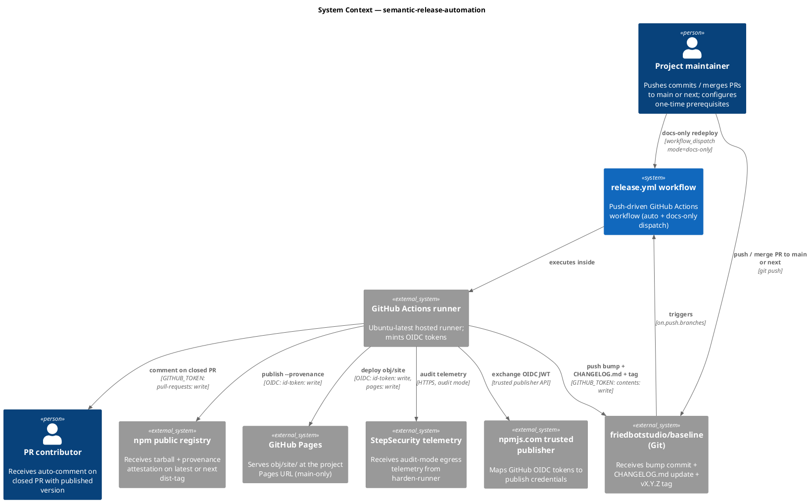

### C4 — Container

Deployable units inside the workflow boundary.

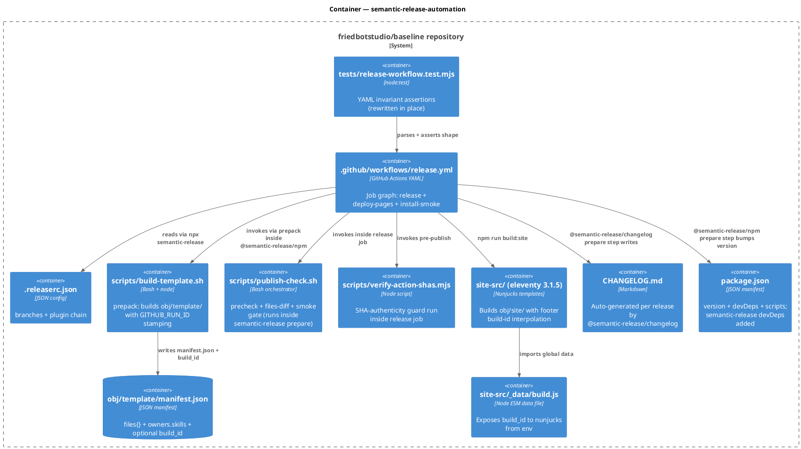

### C4 — Component (the release.yml workflow)

The job graph inside the workflow YAML — three jobs, three permission scopes.

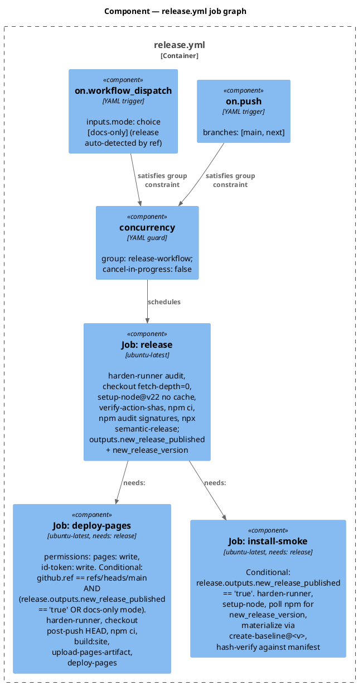

### Data model — class diagram

Configuration shape changes: new `.releaserc.json`, modified `package.json`, optional `CHANGELOG.md` (auto-created).

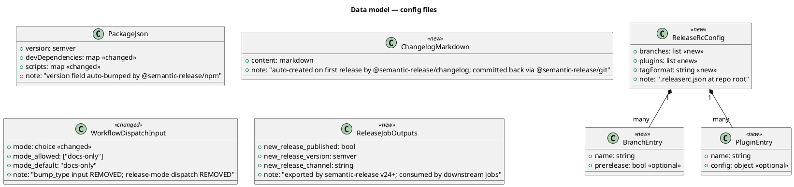

#### Migration DDL (config delta)

```sql
-- forward: file-level migrations (.releaserc.json is JSON; semantics expressed as comments)
-- (1) NEW FILE: /.releaserc.json with branches + plugins (see Contracts row "releaserc-config")
-- (2) NEW FILE: /CHANGELOG.md (auto-created by @semantic-release/changelog on first release)
-- (3) NEW DEVDEPS in /package.json:
--       "semantic-release": "<EXACT_VERSION>",
--       "@semantic-release/changelog": "<EXACT_VERSION>",
--       "@semantic-release/git": "<EXACT_VERSION>"
--     Exact pinning is enforced by scripts/check-files-diff.mjs:128 (DEVDEP_RANGE_FORBIDDEN).
-- (4) CHANGED SCRIPT in /package.json:
--       "release": "semantic-release"  (new entry)
-- (5) CHANGED FIELD in /.github/workflows/release.yml:
--       on: REPLACE workflow_dispatch-only WITH push.branches=[main,next] + workflow_dispatch(mode=docs-only)
--       inputs: REMOVE bump_type; REMOVE mode=release
--       jobs: COLLAPSE build-verify + publish-npm + push-bump INTO single release job; KEEP deploy-pages + install-smoke as downstream jobs
-- (6) NEW GIT TAG: v0.1.0 at the current HEAD of main (pre-rollout step) — anchors semantic-release's "last release" pointer

-- reverse
-- (1) git rm /.releaserc.json
-- (2) git rm /CHANGELOG.md (or retain; consumers tolerate)
-- (3) Remove semantic-release devDeps from /package.json
-- (4) Remove the "release" script from /package.json
-- (5) Restore prior .github/workflows/release.yml from git history
-- (6) git tag -d v0.1.0 && git push origin :refs/tags/v0.1.0 (only if not yet published to npm under that exact tag)
```

### Behavior — sequence per AC

Each sequence is the contract. `==` dividers separate the AC segment(s) the sequence satisfies.

#### §Behavior #1 — push to `main` with `feat:` (AC-001, AC-006, AC-007, AC-009, AC-012)

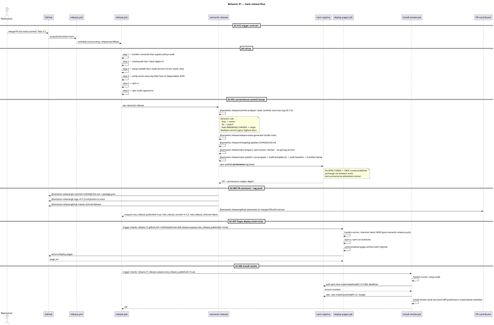

#### §Behavior #2 — push to `next` with `feat:` (AC-002, AC-006, AC-008, AC-009)

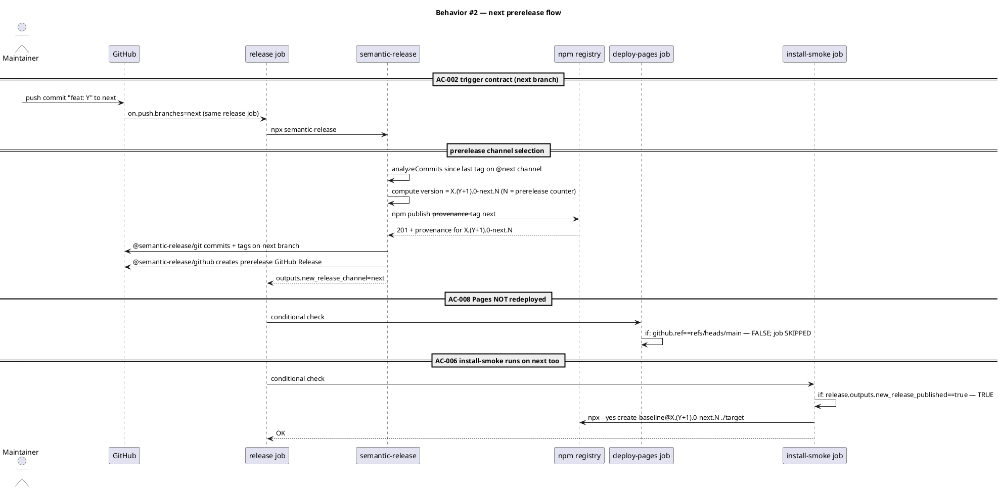

#### §Behavior #3 — no-release-necessary (AC-005)

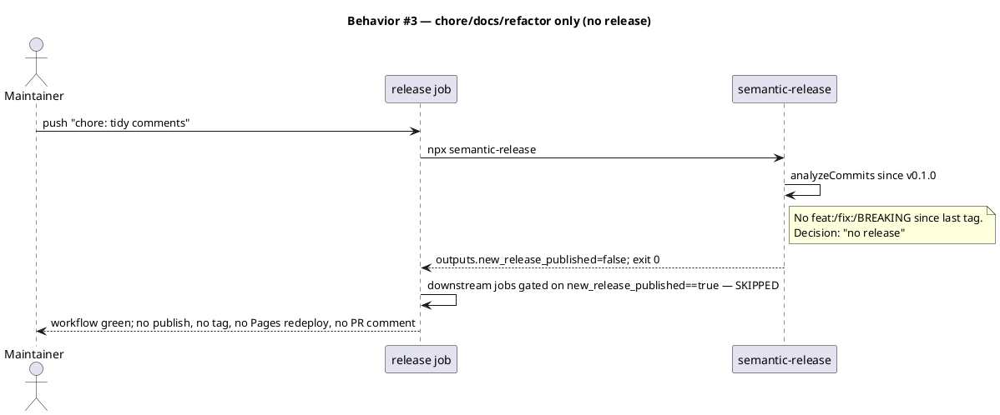

#### §Behavior #4 — workflow_dispatch docs-only (AC-011)

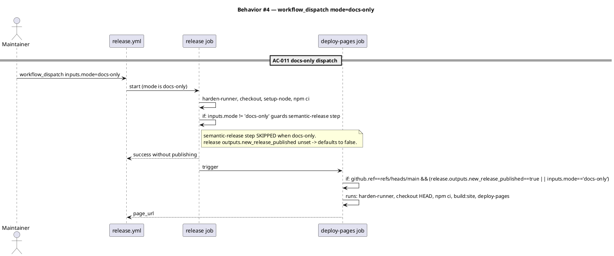

#### §Behavior #5 — first-run forcing function (AC-010)

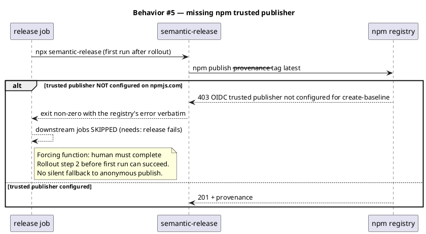

#### §Behavior #6 — static YAML invariants (AC-012, AC-013)

These are invariants on the source YAML, asserted by `tests/release-workflow.test.mjs` at `npm test` time. Modeled as one sequence so the AC table can point to a real diagram.

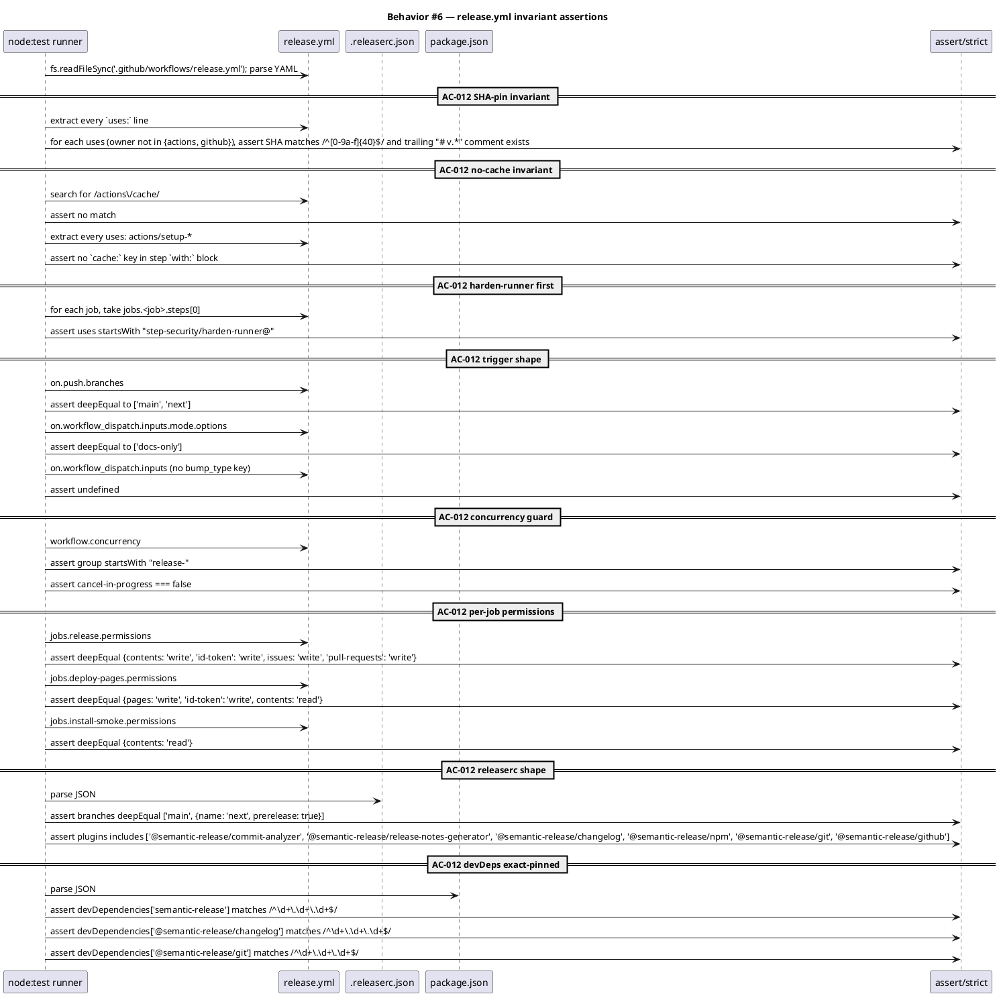

### State — release run (per push)

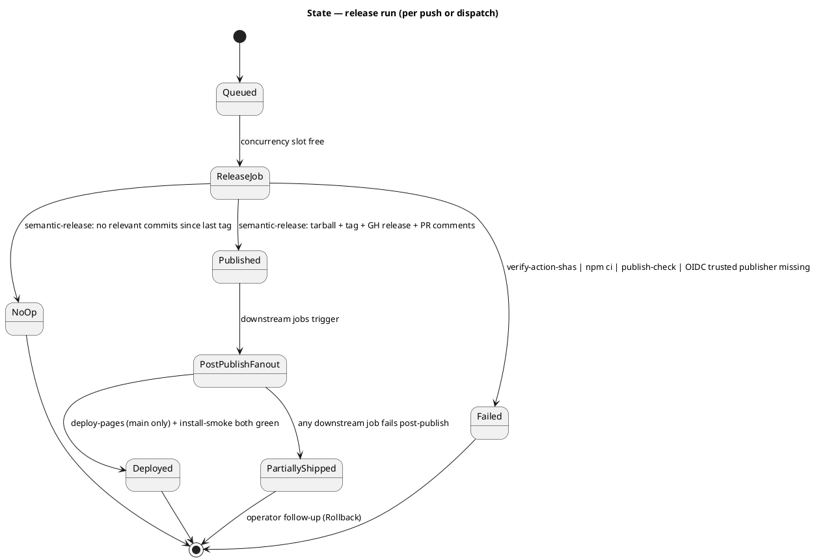

### Dependencies — graph

Directed graph of build/runtime dependencies. Edge `A --> B` reads "A depends on B".

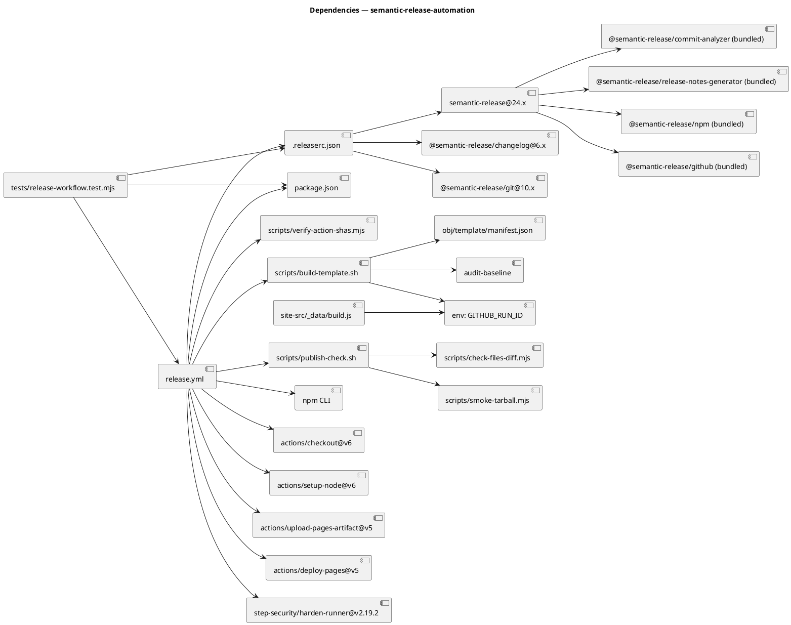

### Contracts

| Kind | Name | Input | Output | Errors | Idempotent |
|---|---|---|---|---|---|
| Workflow trigger | `on.push.branches` | push to `main` or `next` | a workflow run | n/a | no (each push may produce a new published version) |
| Workflow trigger | `on.workflow_dispatch` | `mode: docs-only` | a docs-only workflow run | input outside `[docs-only]` rejected by GH | yes (re-deploy is harmless) |
| CLI | `npx semantic-release` | env (GITHUB_TOKEN, OIDC available), git history, `.releaserc.json` | stdout: run report; sets env vars NEW_RELEASE_PUBLISHED, NEW_RELEASE_VERSION, NEW_RELEASE_CHANNEL; exit 0 | exit non-zero on any plugin failure (verifyConditions, publish, github, npm-trusted-publisher-missing) | yes for a given commit history + tag state |
| File | `.releaserc.json` | n/a (config) | n/a | n/a | yes |
| File | `CHANGELOG.md` | git history since last tag | markdown entry prepended by `@semantic-release/changelog` | n/a | yes |
| Shell | `scripts/verify-action-shas.mjs` | `.github/workflows/*.yml` | exit 0 + "verified" lines | exit 1 + named drift on stderr | yes |
| Shell | `scripts/publish-check.sh` | env (`PUBLISH_CHECK_SIMULATE_FAIL`) | exit 0 + `PASS: ... (3 of 3)` on stdout; exit non-zero + `FAIL: <step> (exit <code>)` on stderr | per sub-check | yes |
| CLI | `npm publish --provenance` (via `@semantic-release/npm`) | OIDC JWT (audience npm), package.json + obj/template/ | 201 + provenance attestation on registry | 403 OIDC trusted publisher not configured (AC-010); 409 version exists; 5xx registry | no (version is single-use) |
| GitHub API | `actions/deploy-pages@v5` | uploaded artifact `github-pages` | `outputs.page_url` | non-zero on Pages config missing | yes (re-deploy harmless) |
| Git | `@semantic-release/git push` to main/next | bumped commit + CHANGELOG + tag | success on fast-forward | failure on branch protection block (deferred) | no |
| GitHub API | `@semantic-release/github` create release + comment | release notes + tag | `release_url` | non-zero on token-scope missing | no (release is unique) |

### Libraries and versions

Every API confirmed via the `context7` MCP. Recorded versions reflect what the docs index covers at this writing; the implementer pins exact at TDD time against the lockfile.

| Library@version | Purpose | Key APIs | Confirmed via |
|---|---|---|---|
| `semantic-release@24.x` | release orchestrator | CLI: `npx semantic-release`; env exports: `NEW_RELEASE_PUBLISHED`, `NEW_RELEASE_VERSION`, `NEW_RELEASE_CHANNEL` | context7 `/websites/semantic-release_gitbook_io` |
| `@semantic-release/commit-analyzer` (bundled) | analyzeCommits → bump type | conventional-commits preset; `fix:` → patch, `feat:` → minor, `feat!:`/`BREAKING CHANGE:` → major | context7 plugins-list |
| `@semantic-release/release-notes-generator` (bundled) | generateNotes | conventional-changelog template | context7 plugins-list |
| `@semantic-release/changelog@6.x` | verifyConditions + prepare | writes/updates `CHANGELOG.md` at repo root | context7 plugins-list |
| `@semantic-release/npm` (bundled) | verifyConditions + prepare + publish | OIDC trusted-publishing path; auto-provenance via `npm publish --provenance` when `id-token: write` present and `NPM_TOKEN` absent | context7 `/websites/semantic-release_gitbook_io` → §Trusted publishing and npm provenance |
| `@semantic-release/git@10.x` | verifyConditions + prepare | commits + tags + pushes `CHANGELOG.md` + `package.json` back to the source branch | context7 plugins-list |
| `@semantic-release/github` (bundled) | verifyConditions + publish + success | creates GitHub Release; comments on closed PRs; requires `issues: write` + `pull-requests: write` + `contents: write` | context7 `/websites/semantic-release_gitbook_io` → §Basic GitHub Actions Workflow |
| `actions/checkout@v6` | repo checkout | `fetch-depth: 0` required (semantic-release needs full history) | context7 `/actions/checkout` |
| `actions/setup-node@v6` | node setup | `node-version: 22`; no `cache:` key (rejected at runtime) | context7 `/actions/setup-node` |
| `actions/upload-pages-artifact@v5` | Pages bundle | `path: obj/site` | docs/specs/release-workflow.md (already verified) |
| `actions/deploy-pages@v5` | Pages deploy | `environment.name: github-pages` | docs/specs/release-workflow.md (already verified) |
| `step-security/harden-runner@v2.19.2` | egress audit | `egress-policy: audit`; first step every job | docs/specs/release-workflow.md (already verified) |
| `npm` (bundled with Node 22) | `npm ci`, `npm audit signatures`, `npm publish` | OIDC trusted publishing | context7 `/websites/semantic-release_gitbook_io` |

### Alternatives considered

| Alt | Summary | Rejected because |
|---|---|---|
| Candidate A (single `release` job) | One job runs semantic-release end-to-end + builds site + deploys Pages + install-smoke | Widens the OIDC-bearing job's permission surface — both npm and Pages id-token audiences would live in one job; the prior spec deliberately split them. Candidate B preserves that defensive depth. |
| `cycjimmy/semantic-release-action` wrapper | Use a third-party action wrapper instead of `npx semantic-release` | One more action to SHA-pin and verify; the docs canonical path is `npx semantic-release` invoked directly; wrapper offers no needed ergonomic gain. |
| `release-please` | Google's release-please opens a PR for each release that maintainers merge to publish | Doesn't match user's "automate fully" requirement; gate moves back to the PR-merge step. |
| Hybrid: `workflow_dispatch` + auto-bump | Keep manual dispatch but auto-compute bump_type from commits | Doesn't match user's "fully automate" requirement; user explicitly chose push-driven over dispatch. |
| Per-branch concurrency | `group: release-${{ github.ref }}` | Allows main + next to race on GitHub Release API; risk doesn't justify the wall-clock gain (releases are infrequent). |
| Pre-bump Pages deploy (deploy then publish) | Deploy Pages from pre-bump commit, then publish to npm | Site would lag by one version on every release; deploying after publish keeps page footer's build_id in sync with the published version. |
| Drop install-smoke | Trust the publish step's exit code as the canary | Loses the post-publish-materialization check — the only place that catches "published tarball does not match what create-baseline materializes". Catastrophic on a poisoned release. |
| Skip pre-tag v0.1.0 | Let semantic-release synthesize the first release from full history | First CHANGELOG entry would list 100+ unrelated commits; on-disk version is already 0.1.0, so anchoring there is honest. |

## Design calls

This spec's write_set (`.github/workflows/release.yml`, `.releaserc.json`, `package.json`, `CHANGELOG.md`, `tests/release-workflow.test.mjs`, `docs/runbooks/npm-publish.md`, `docs/specs/semantic-release-automation.md`) does not intersect `project.json → tdd.ui_globs` (`site-src/**`, `app/**/*.{tsx,jsx}`, `components/**`, `pages/**`, `src/**/*.{tsx,jsx,vue,svelte}`, `**/*.html`, `**/*.css`, `**/*.scss`, `**/*.njk`). No UI surface changes.

- *(none)*

## Acceptance criteria

Numbered, testable, traced. Each AC points to a `§Behavior` sequence.

| ID | Criterion (given / when / then) | Upstream AC | Sequence |
|---|---|---|---|
| AC-001 | Given a merge commit on `main` with a `feat:` prefix and no prior `feat:`/`feat!:` since the last tag, when the workflow runs, then semantic-release publishes a minor bump to npm with dist-tag `latest`, generates release notes in a GitHub Release, updates `CHANGELOG.md`, commits the bumped `package.json` + `CHANGELOG.md` back to `main`, and tags `vX.(Y+1).0` | intake AC 1 | §Behavior #1 |
| AC-002 | Given a merge commit on `next` with a `feat:` prefix, when the workflow runs, then semantic-release publishes a minor prerelease (`vX.(Y+1).0-next.N`) to npm with dist-tag `next`, creates a prerelease GitHub Release, updates `CHANGELOG.md` on `next`, commits + tags on `next`, and does NOT deploy Pages | intake AC 2 + AC 8 | §Behavior #2 |
| AC-003 | Given a `fix:` commit on `main` (or `next`) with no `feat:`/`feat!:` since the last tag, when the workflow runs, then the bump is patch (`vX.Y.(Z+1)` on main; `vX.Y.(Z+1)-next.N` on next) | intake AC 3 | §Behavior #1 (analyzeCommits decision rule) + §Behavior #2 (next variant) |
| AC-004 | Given a `feat!:` commit or any commit with `BREAKING CHANGE:` in the footer, when the workflow runs, then the bump is major (`v(X+1).0.0` on main; `v(X+1).0.0-next.N` on next) | intake AC 4 | §Behavior #1 (analyzeCommits decision rule) |
| AC-005 | Given a commit prefixed with `chore:`, `docs:`, `style:`, `refactor:`, `test:`, or `ci:` and no `feat:`/`fix:`/breaking commit since the last tag, when the workflow runs, then semantic-release reports "no release" and exits 0 without publishing, tagging, or committing; downstream jobs are skipped via `release.outputs.new_release_published == 'true'` gate | intake AC 5 | §Behavior #3 |
| AC-006 | Given a release publishes successfully, when `install-smoke` runs, then the tarball materializes via `npx create-baseline ./target` and the hash check via `scripts/install-smoke-verify.mjs` passes against the published manifest | intake AC 6 | §Behavior #1 + §Behavior #2 |
| AC-007 | Given a release publishes on `main`, when the workflow completes, then `obj/site/` is built fresh against the bumped `package.json` from the post-semantic-release HEAD and deployed to GitHub Pages | intake AC 7 | §Behavior #1 |
| AC-008 | Given a release publishes on `next`, when the workflow completes, then `deploy-pages` is SKIPPED (predicate `github.ref == 'refs/heads/main' && (...)` is false) | intake AC 8 | §Behavior #2 |
| AC-009 | Given a PR is merged into `main` (or `next`) and the release publishes, when the workflow completes, then `@semantic-release/github` comments on the closed PR with the published version number | intake AC 9 | §Behavior #1 + §Behavior #2 |
| AC-010 | Given the npmjs.com trusted-publisher registration has NOT been configured for `create-baseline` + `release.yml`, when the first run attempts `npm publish`, then the publish step fails with the registry's OIDC error (non-zero exit), downstream jobs are skipped via `needs: release`, and no anonymous-publish fallback occurs | intake AC 10 | §Behavior #5 |
| AC-011 | Given the workflow is invoked via `workflow_dispatch` with `mode=docs-only`, when the run completes, then the `release` job runs setup steps but skips `npx semantic-release` (gated on `inputs.mode != 'docs-only'`); `deploy-pages` runs (gated on `inputs.mode == 'docs-only' OR new_release_published == 'true'`); `install-smoke` is SKIPPED (gated on `new_release_published == 'true'`) | intake AC 11 | §Behavior #4 |
| AC-012 | Given the release workflow YAML, `.releaserc.json`, and `package.json` are inspected by `tests/release-workflow.test.mjs`, when the test runs, then every invariant in §Behavior #6 passes: SHA-pin format, no `actions/cache`, no `cache:` key on `setup-*`, harden-runner first step in every job, trigger shape (`push.branches=[main,next]`, dispatch mode=`[docs-only]`, no `bump_type`), concurrency (`group=release-workflow`, `cancel-in-progress=false`), per-job permissions, `.releaserc.json` branches + plugin chain, devDeps exact-pinned | intake AC 12 | §Behavior #6 |
| AC-013 | Given the new workflow + config + devDeps land, when `audit-baseline` (`project.json → test.cmd`) runs, then it continues to PASS — no Article XI manifest drift, no skill/hook count drift, no constitutional-citation drift | intake AC 13 | §Behavior #6 (regression invariant) |

## Test plan

| Category | Scenario | Expected | Covers |
|---|---|---|---|
| Golden path | `tests/release-workflow.test.mjs` parses `.github/workflows/release.yml` and asserts `on.push.branches == ['main', 'next']` and `on.workflow_dispatch.inputs.mode.options == ['docs-only']` | pass | AC-012 |
| Golden path | YAML test asserts `jobs.release.steps` contains `npx semantic-release` step with `GITHUB_TOKEN: ${{ secrets.GITHUB_TOKEN }}` env and `if: inputs.mode != 'docs-only'` gate | pass | AC-001, AC-011 |
| Golden path | `.releaserc.json` parses to `{branches: ['main', {name: 'next', prerelease: true}], plugins: [...]}` with the six expected plugins in correct order | pass | AC-001, AC-002 |
| Input boundary | YAML test asserts `on.workflow_dispatch.inputs.bump_type` is `undefined` (input removed) | pass | AC-011 |
| Input boundary | YAML test asserts `on.workflow_dispatch.inputs.mode.options` has exactly one entry (`docs-only`); `release` is NOT in the list | pass | AC-011 |
| Input boundary | YAML test asserts every job has `runs-on: ubuntu-latest` | pass | invariant |
| Contract violation | YAML test asserts `jobs.release.permissions` is exactly `{contents: write, id-token: write, issues: write, pull-requests: write}` | pass | AC-009, AC-010 |
| Contract violation | YAML test asserts every `uses:` outside `actions/*` and `github/*` matches `/^.+@[0-9a-f]{40}\s*#\s*v[0-9.]+/` | pass | AC-012 |
| Contract violation | YAML test asserts `release.yml` does NOT contain `actions/cache`, and no `actions/setup-*` step has a `cache:` key | pass | AC-012 |
| Contract violation | YAML test asserts `jobs.<each>.steps[0].uses` startsWith `step-security/harden-runner@` | pass | AC-012 |
| Contract violation | `package.json` devDeps test asserts `semantic-release`, `@semantic-release/changelog`, `@semantic-release/git` match `/^\d+\.\d+\.\d+$/` (no `^` / `~`) | pass | AC-012 |
| Concurrency / ordering | YAML test asserts `concurrency.group == 'release-${{ github.workflow }}'` (string-prefix-match-safe) and `cancel-in-progress === false` | pass | AC-012 |
| Concurrency / ordering | YAML test asserts `jobs.deploy-pages.needs == 'release'` and `jobs.install-smoke.needs == 'release'` | pass | AC-007, AC-008, AC-011 |
| Failure mode | YAML test asserts `jobs.deploy-pages.if` includes `github.ref == 'refs/heads/main'` AND (`needs.release.outputs.new_release_published == 'true'` OR `inputs.mode == 'docs-only'`) | pass | AC-007, AC-008, AC-011 |
| Failure mode | YAML test asserts `jobs.install-smoke.if` includes `needs.release.outputs.new_release_published == 'true'` (no docs-only allowance) | pass | AC-011 |
| Failure mode | Semantic-release dry-run scenario (synthesized fixture repo): commit-message classifier maps `fix:` → patch, `feat:` → minor, `feat!:` → major; `chore:` → no release. Asserted by invoking `npx semantic-release --dry-run` against the fixture and parsing output | pass | AC-001, AC-002, AC-003, AC-004, AC-005 |
| Regression trap | `tests/runbook-text.test.mjs` — updated for new flow but still passes after the runbook rewrite | pass | invariant |
| Regression trap | `tests/template-payload.test.mjs`, `tests/template-drift.test.mjs`, `tests/manifest.test.mjs`, `tests/build-template.test.mjs`, `tests/build-template-build-id.test.mjs` — all unchanged; pass | pass | invariant |
| Regression trap | `tests/publish-check.test.mjs`, `tests/check-files-diff.test.mjs` — unchanged; pass | pass | invariant |
| Regression trap | `tests/install-smoke-verify.test.mjs`, `tests/smoke-tarball.test.mjs`, `tests/verify-action-shas.test.mjs` — unchanged; pass | pass | AC-006 |
| Regression trap | `bash .claude/skills/audit-baseline/audit.sh` exits 0 (no audit drift introduced by the new workflow, `.releaserc.json`, devDeps, or test rewrite) | pass | AC-013 |

## Observability

CI surface, not application runtime — "observability" here means what the operator and downstream auditors can see post-run.

| Signal | Name | Shape | Purpose |
|---|---|---|---|
| Log | GitHub Actions run log per job | structured per `step.name` + `step.outcome` | operator debug |
| Log | `npx semantic-release` stdout | analyze-commits decision, version computed, plugins run, publish stdout, tag pushed, GH release URL, PR comment IDs | post-mortem on a bad release |
| Output | `jobs.release.outputs.new_release_published` | boolean string | gates downstream jobs |
| Output | `jobs.release.outputs.new_release_version` | semver string | consumed by install-smoke for `npm view` poll |
| Output | `jobs.release.outputs.new_release_channel` | `latest` or `next` | observability only; not gating |
| Output | `outputs.page_url` from `deploy-pages` | URL string | operator confirms Pages live at expected URL |
| Metric (external) | `npm view create-baseline --json` → `dist.attestations.provenance` | object | auditor confirms SLSA L3 provenance landed |
| Metric (external) | `npm view create-baseline dist-tags` | `{latest: "...", next: "..."}` | confirms channel routing |
| Telemetry | harden-runner audit-mode egress log | per-run; HTTP/DNS calls observed | follow-up data for v2 block-mode allowlist |
| Alarm | (none) | n/a | push-driven; the merger of the PR is the on-call |

## Rollout

1. **Land all changes in one commit** (the workflow is non-functional without the supporting changes; the supporting changes are no-ops without the workflow):
   - `.github/workflows/release.yml` (rewritten)
   - `.releaserc.json` (new)
   - `package.json` (new devDeps + `release` script)
   - `tests/release-workflow.test.mjs` (rewritten in place)
   - `docs/runbooks/npm-publish.md` (rewritten for auto-flow; manual fallback preserved; branch-protection migration callout added)
   - `docs/specs/semantic-release-automation.md` (this spec)
   - The prior `docs/specs/release-workflow.md` is archived (Phase 10.5) but NOT deleted by this work — it remains in `docs/archive/<date>/release-workflow/`.
2. **One-time human prerequisites** (must complete before first push-driven run):
   - **npm trusted publisher**: on `npmjs.com → packages → create-baseline → Settings → Trusted Publishers`, add `friedbotstudio/baseline` + workflow filename `release.yml` (must match exactly) + environment (none).
   - **Pre-tag `v0.1.0`**: from a clean checkout, `git tag v0.1.0 <commit-of-current-0.1.0> && git push origin v0.1.0`. Anchors semantic-release's "last release" pointer. The current commit is the HEAD of `main` at landing time (the on-disk `package.json` already reads `0.1.0`).
   - **Pages source**: Repo Settings → Pages → Source = "GitHub Actions" (already in place from prior workflow; re-verify).
   - **2FA mode**: `npm profile get tfa` reads `auth-and-writes` (already in place).
   - **`next` branch**: create empty branch from `main`: `git checkout -b next && git push -u origin next` (lazy: create when first prerelease is desired).
3. **First release**: after landing + prerequisites, merge a PR with a `feat:` or `fix:` prefix. First run will:
   - Read commits since `v0.1.0` (the anchor tag)
   - Cut `v0.1.1` (if fix) or `v0.2.0` (if feat)
   - Update `CHANGELOG.md`, publish, tag, push back, deploy Pages, install-smoke
   - If trusted publisher is misconfigured: AC-010 forcing-function fires; first run fails with the OIDC error. Operator fixes and re-runs (e.g., manual `workflow_dispatch` with `mode: docs-only` won't re-trigger publish — the operator must push another commit OR force a re-run of the failed run from the Actions UI).
4. **Branch-protection migration (deferred)**: when `main` protection lands, the default `GITHUB_TOKEN` will be rejected by `@semantic-release/git`'s push. Migration path documented in runbook §"GitHub App migration": provision GitHub App `release-bot` with `contents: write` on this repo only; add as exempt actor on the branch rule; replace `GITHUB_TOKEN: ${{ secrets.GITHUB_TOKEN }}` env in the release step with a step that exchanges the App private key for a token. Out of scope for this work.
5. **Dependabot coordination**: the two open Dependabot PRs (`first-party-actions`, `security-actions`) will conflict with the rewritten workflow. Plan: rebase post-merge; close-and-reopen is also fine (Dependabot will re-file against the new file).

## Rollback

- **Workflow-level kill-switch**: disable `release.yml` via Actions UI ("Disable workflow"). No further push or dispatch can run.
- **Per-release rollback** (when a specific version is broken post-publish): see `docs/runbooks/npm-publish.md` § "Step 6 — Rollback" — `npm unpublish` within 72h, `npm deprecate` after.
- **Repo rollback**: `git revert <bump-commit>` from a clean tree + push to main. semantic-release on the next push will NOT re-cut the same version (the tag still exists), but will analyze new commits and cut the next appropriate bump.
- **Spec-level revert**: restore the prior `.github/workflows/release.yml` (manual dispatch + `bump_type`) from git history; remove `.releaserc.json` + `CHANGELOG.md` (or leave; consumers tolerate); revert `package.json` devDep additions; restore prior `tests/release-workflow.test.mjs`. The runbook's manual fallback (`npm publish` from operator workstation) remains operational throughout.
- **Signal to roll back within 5 min**:
  - `install-smoke` HASH_MISMATCH → roll back the published version (within 72h `unpublish`, after deprecate). Time-to-trip: ~3–5 min after push.
  - `@semantic-release/git` push rejected (branch protection turned on without GitHub App migration) → restore workflow concurrency lock so subsequent pushes don't pile up; operator complete the App migration before re-running.

## Archive plan

When this spec ships:

- Defaults *(automatic)*: `docs/intake/semantic-release-automation.md`, `docs/scout/semantic-release-automation.md`, `docs/research/semantic-release-automation.md`, `docs/specs/semantic-release-automation.md`, `docs/specs/semantic-release-automation.rendered/` (after `/spec-render`), spec approval token, security report (after Phase 8).
- Extras *(non-default files to bundle)*:
  - `docs/specs/release-workflow.md` (superseded predecessor — moves to `docs/archive/<date>/release-workflow/` per the prior workflow's archive bundle, since both share the date)
  - `docs/specs/release-workflow.rendered/` (predecessor's rendered diagrams)
  - `docs/runbooks/npm-publish.md` (rewritten in place; not archived — runbooks are living docs)

## Open questions

- **OQ-S1**: `@semantic-release/git`'s default `assets` config commits both `package.json` AND `CHANGELOG.md`. Should `obj/template/manifest.json` (bumped at prepack time by `build-template.sh` with the `gha-${GITHUB_RUN_ID}` build_id) also be committed back? Spec recommendation: **no** — `obj/template/manifest.json` is a build artifact that regenerates from source on every run; committing the GHA-run-id-stamped manifest to source confuses developers (they'd see a `gha-12345` build_id in their local manifest after pulling, which is wrong for their environment). The `prepack` rebuilds on every publish; consumers get the right manifest in the tarball.
- **OQ-S2**: Should the `release` job retain the `workflow_dispatch` `mode: docs-only` *if* it removes all semantic-release steps when docs-only? Spec recommendation: **yes, retained, with the `if: inputs.mode != 'docs-only'` gate on semantic-release-bearing steps**. The release job's setup (checkout + setup-node + npm ci) is needed for the site build that deploy-pages job will use (via re-checkout of post-push HEAD). The single-flow simplifies the YAML vs. branching into a separate docs-only job.
- **OQ-S3**: `@semantic-release/changelog` defaults to a `CHANGELOG.md` at repo root. Should the spec rename to `docs/CHANGELOG.md` (cleaner repo root)? Spec recommendation: **no** — npm/GitHub tooling expects `CHANGELOG.md` at repo root; renaming breaks discovery.
- **OQ-S4**: Should the spec call out specific `semantic-release` minor/patch versions, or leave the exact pin to the implementer at `/tdd` time? Spec recommendation: **leave to implementer** — pick latest stable at `npm view semantic-release version` time; the `tests/release-workflow.test.mjs` enforces *that it's exact-pinned*, not *which exact version*. Implementer records the chosen version in the test fixture's expected-shape assertions.
