# Spec — branch-aware git consent policy + /grant-push gate (JS pilot)

## Context

| Input | Path |
|---|---|
| Intake | `docs/intake/branch-aware-git-policy.md` |
| Scout | `docs/scout/branch-aware-git-policy.md` |
| Research | `docs/research/branch-aware-git-policy.md` |

## Goal

Replace `git_commit_guard`'s unconditional `git push` hard-block with branch-aware consent enforcement (commit and push gated by `project.json → git.protected_branches` glob membership and `git.branch_pattern` regex), add a `/grant-push` consent gate symmetric with `/grant-commit`, and port both touched hooks from Bash + python3 to standalone Node ESM modules as a JS-port pilot.

## Non-goals

- Porting the other 20 bash hooks to JS (separate intake — this is the pilot).
- Cryptographic signing of consent markers (structural unforgeability stays the model).
- Remote-side push enforcement (server-side hooks; out of scope).
- Multi-repo policy inheritance.
- Closing Q-003 fully (Bash-matcher regex over-match) — narrowed by dropping the `git push` leg from `FORBIDDEN_RE`, but the over-match class on other forbidden ops survives.
- Adding `picomatch` as an npm dependency — a hand-rolled minimal glob matcher (~15 LOC) lives in `lib/common.mjs` so hooks have zero npm-install dependency.

## Design

Diagrams are the contract. Prose is only for things a diagram cannot say.

### C4 — System context

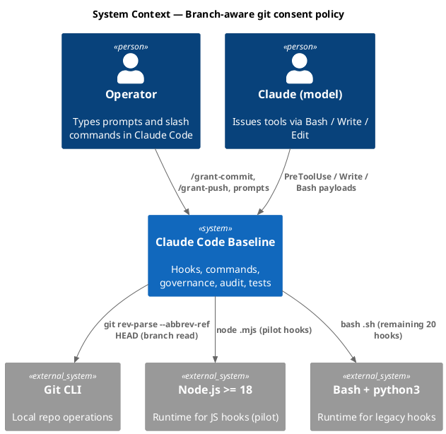

### C4 — Container

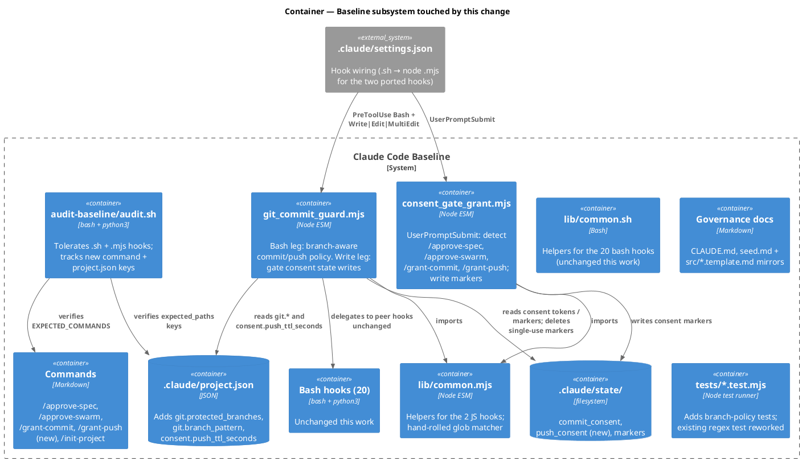

### C4 — Component (changed containers only)

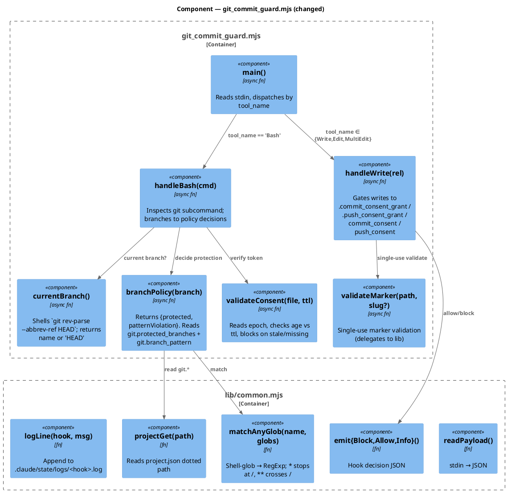

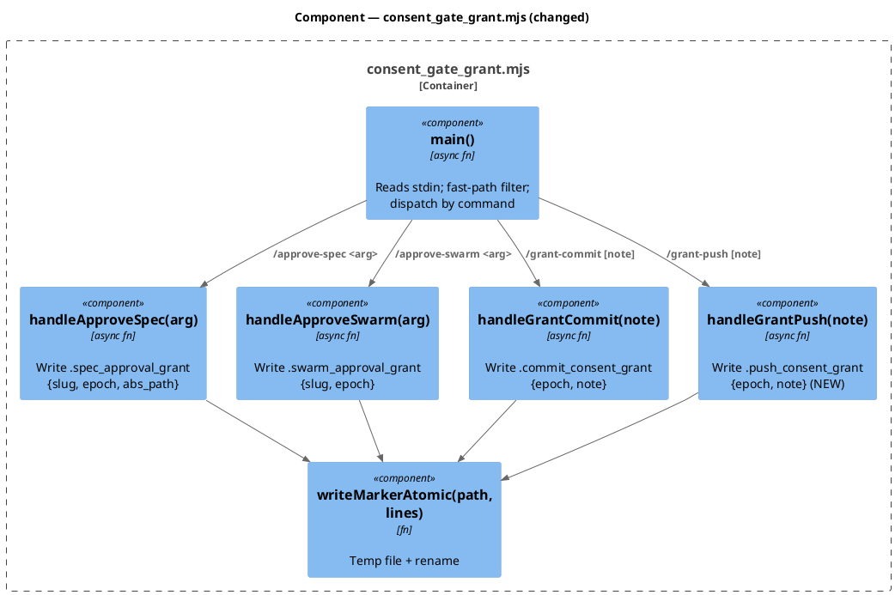

### Data model — class diagram

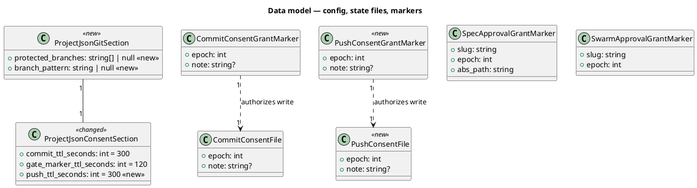

#### Configuration delta (`project.json`)

```jsonc
// .claude/project.json — added at top level alongside "consent", "tdd", etc.
{
  "consent": {
    "commit_ttl_seconds": 300,
    "gate_marker_ttl_seconds": 120,
    "push_ttl_seconds": 300            // NEW — default matches commit
  },
  "git": {                             // NEW — entire block
    "protected_branches": null,        // null = every branch protected; or e.g. ["main", "release/*"]
    "branch_pattern": null             // null = no naming check; or e.g. "^(feat|fix|chore|docs)/[a-z0-9-]+$"
  }
}
```

No SQL DDL — this baseline has no database. The class diagram models JSON config + filesystem-backed state files; the JSON delta above is the config-side migration analog, the filesystem delta below is the state-side analog.

#### Filesystem state delta

New files written at runtime (no migration; created on first use by the JS hooks).

| Path | Created by | Read by | Lifetime | Line shape |
|---|---|---|---|---|
| `.claude/state/push_consent` | `/grant-push` slash-command body (via gate-validated Write) | `git_commit_guard.mjs` Bash leg on `git push` | Persists until next `/grant-push` overwrites OR TTL expires (300s default) | Line 1: epoch (int). Line 2: optional note. |
| `.claude/state/.push_consent_grant` | `consent_gate_grant.mjs` (UserPromptSubmit) | `git_commit_guard.mjs` Write leg, validates + deletes on first allow | Single-use; TTL = `consent.gate_marker_ttl_seconds` (120s default) | Line 1: epoch (int). Line 2: optional note. |

No files are removed by this change. The two new files are inert if the JS hooks are later removed (no other reader); they self-clean on session-start sweep per `memory_session_start` hook conventions.

#### Forward / reverse migration

- **Forward**: ship the JS hooks + lib + new commands. The new JSON keys default to `null`/300 (covered in `project.json` delta above); the new state files come into existence the first time `/grant-push` is invoked. No data migration step.
- **Reverse**: `git revert` restores the bash hooks. The orphaned state files (`push_consent`, `.push_consent_grant`) become unreferenced; they self-clean on the next session-start sweep. Operators can remove them manually with `rm -f .claude/state/push_consent .claude/state/.push_consent_grant` if desired. No data corruption risk — these files are runtime caches, not durable state.

### Behavior — sequence per AC

#### §Behavior #1 — Commit policy (covers AC-001, AC-002, AC-006, AC-007)

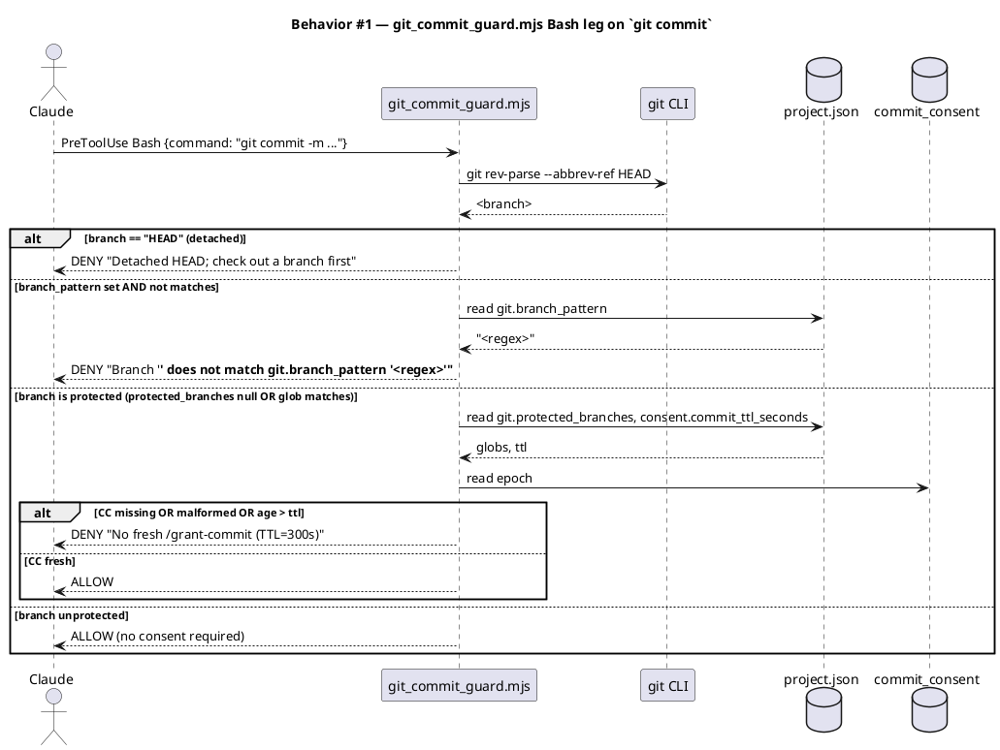

#### §Behavior #2 — Push policy (covers AC-003, AC-004)

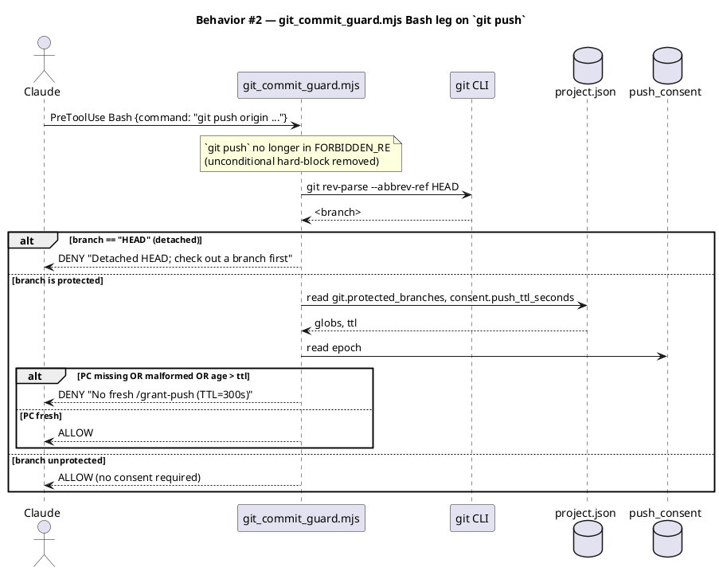

#### §Behavior #3 — `/grant-push` UserPromptSubmit marker write (covers AC-008)

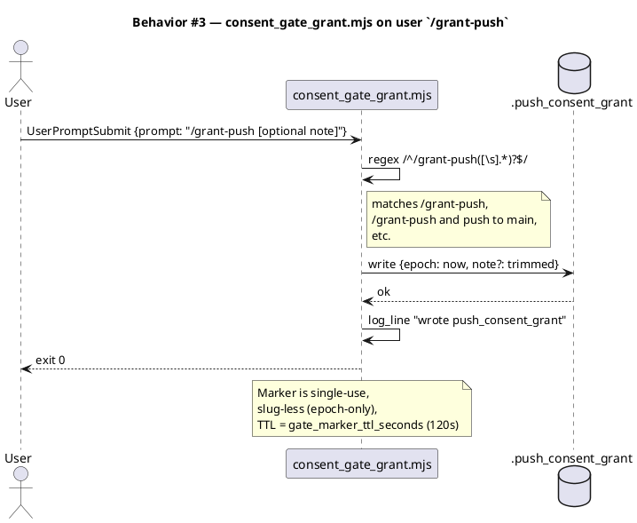

#### §Behavior #4 — Write-gate on `push_consent` (covers AC-009, AC-010)

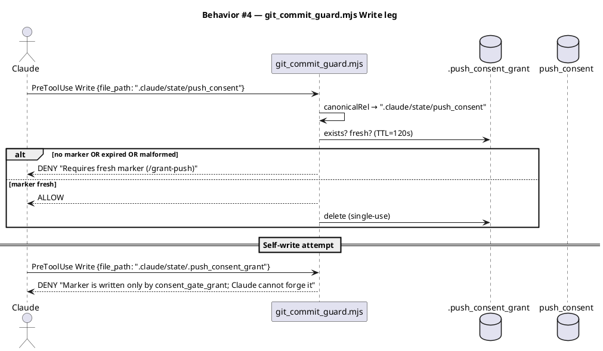

#### §Behavior #5 — Detached-HEAD refusal (covers AC-005)

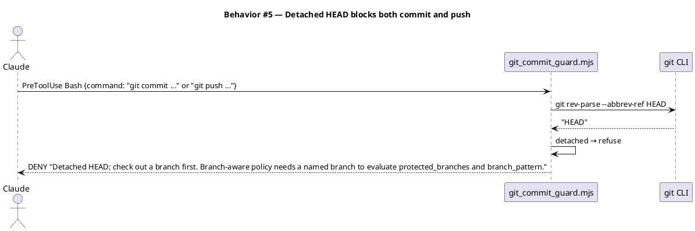

#### §Behavior #6 — Configuration loading and defaults (covers AC-011, AC-012)

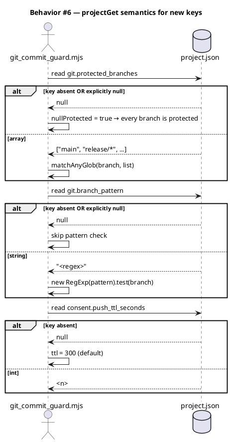

#### §Behavior #7 — Audit-baseline tolerance for mixed `.sh`/`.mjs` hooks (covers AC-015, AC-016, AC-020)

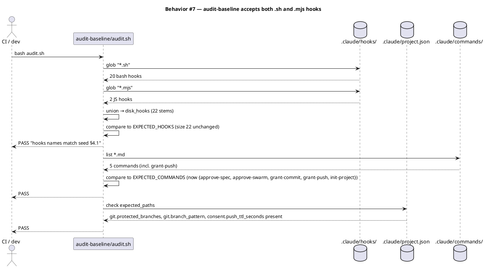

#### §Behavior #8 — Structural verification by the test suite (covers AC-013, AC-014, AC-019, AC-020)

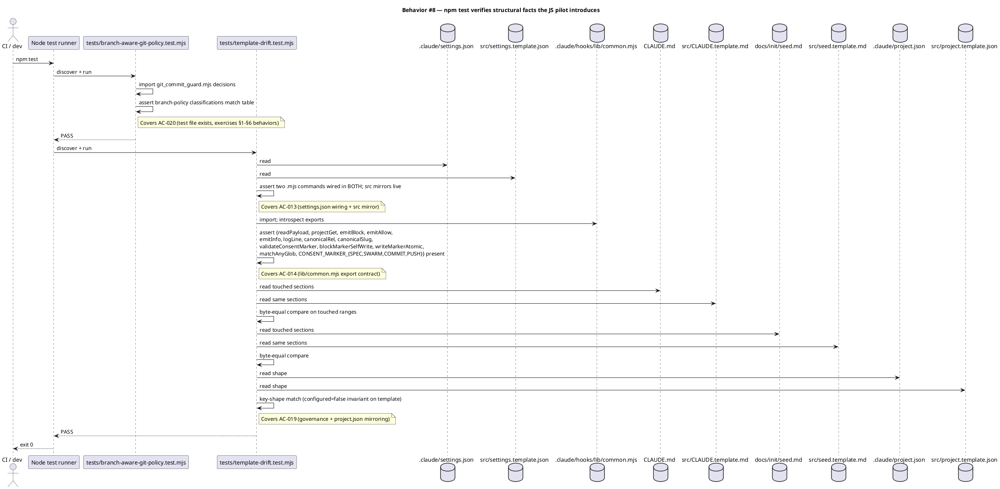

### Dependencies — graph

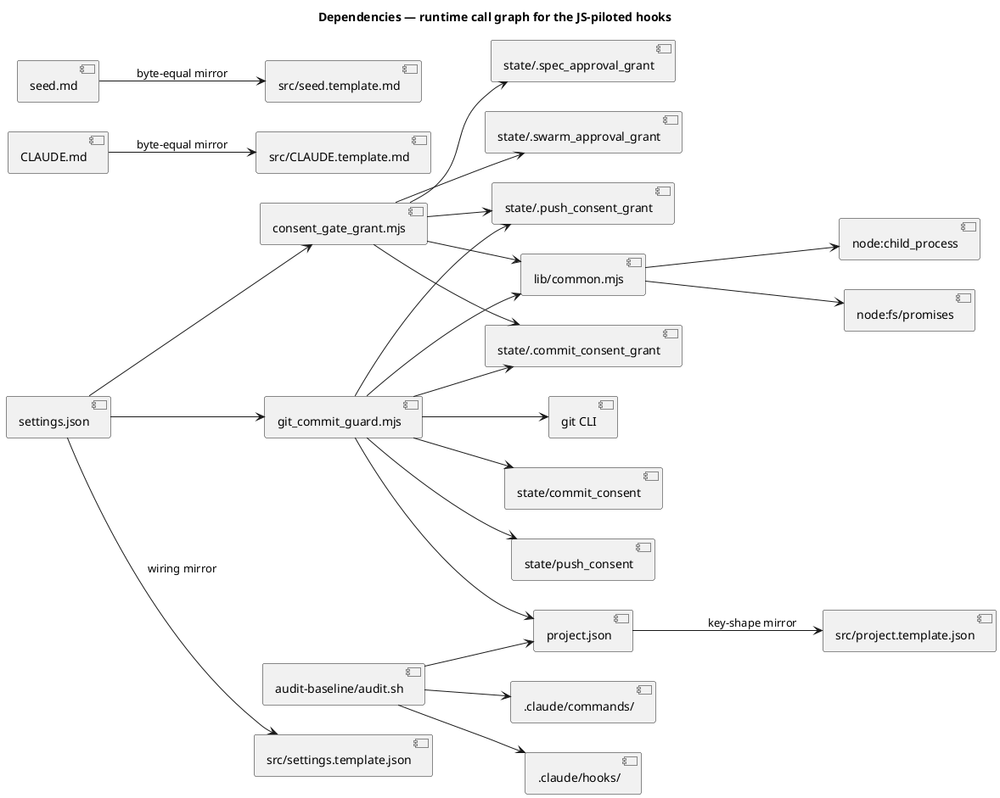

### Contracts

| Kind | Name | Input | Output | Errors | Idempotent |
|---|---|---|---|---|---|
| Hook (PreToolUse Bash) | `git_commit_guard.mjs` (Bash leg) | hook payload JSON on stdin | exit 0 (allow) or `{"hookSpecificOutput":{"permissionDecision":"deny",…}}` on stdout | none — every path resolves to allow or deny | yes — pure function of inputs + state |
| Hook (PreToolUse Write) | `git_commit_guard.mjs` (Write leg) | hook payload JSON on stdin | exit 0 (allow) or deny JSON | none | yes |
| Hook (UserPromptSubmit) | `consent_gate_grant.mjs` | hook payload JSON on stdin | exit 0 (always) + side-effect: marker write | none | no — every fire writes a fresh marker |
| Slash command | `/grant-push [note]` | user-typed prompt | UserPromptSubmit fires hook; command body writes `.claude/state/push_consent` | refuses on non-git repo (precheck) | yes — repeated grants overwrite |
| State file | `.claude/state/push_consent` | epoch on line 1, optional note on line 2 | — | read-side: malformed → DENY | n/a (file) |
| State file | `.claude/state/.push_consent_grant` | epoch on line 1, optional note on line 2 | — | single-use; deleted on first allow | n/a (file) |
| Config | `project.json → git.protected_branches` | `string[] \| null` (default null) | matcher input | invalid type → treat as null + WARN | n/a |
| Config | `project.json → git.branch_pattern` | `string \| null` (default null) | regex source | invalid regex → treat as null + WARN | n/a |
| Config | `project.json → consent.push_ttl_seconds` | `int` (default 300) | TTL seconds | non-int → use default + WARN | n/a |

### Libraries and versions

No third-party JavaScript libraries. The pilot deliberately stays on Node stdlib for portability and zero install-time fetches.

| Library@version | Purpose | Key APIs | Confirmed via context7 |
|---|---|---|---|
| `node@>=18` (stdlib) | runtime | `fs/promises.readFile/writeFile/rename/unlink`, `child_process.execFile`, `process.stdin`, `path` | n/a (stdlib) |
| `git@>=2.30` (CLI) | branch identity | `git rev-parse --abbrev-ref HEAD`, `git rev-parse --is-inside-work-tree` | confirmed via `/git/htmldocs` context7 lookup in research phase |

### Alternatives considered

| Alt | Summary | Rejected because |
|---|---|---|
| A | Keep hooks in Bash + python3; only swap the regex | Touches the same two hook files twice (once for policy, once when the eventual JS port lands). Misses the cheapest moment to pilot the port. |
| B | Add `picomatch` as an npm dependency | Requires `node_modules/picomatch` present at hook execution. A user-installed baseline (via `npx @friedbotstudio/create-baseline`) does not necessarily have `node_modules` populated; gating hook behavior on `npm install` is brittle. Hand-rolled ~15 LOC matcher in `lib/common.mjs` covers our exact need (shell-glob, `*` doesn't cross `/`, `**` does). |
| C | Vendor `picomatch` into `.claude/hooks/lib/vendor/` | Same end result as B with a larger LOC delta. Hand-rolled wins on transparency. |
| D | Always-protected on detached HEAD (research recommendation) | User chose stricter "refuse all writes" — ambiguous state surfaces as explicit error instead of policy-by-default. |
| E | `/grant-push` combined with `/grant-commit` | Conflates two distinct consent decisions; the user explicitly rejected the combined-form in Q-004's option (c). |
| F | Block both commit and push on `branch_pattern` violation | Asymmetry preferred: naming discipline matters at branch creation; pushing pre-existing off-pattern branches must still work (rename / cleanup workflows). |
| G | Track runtime state files (`push_consent`) in audit | Audit's grain is source-tree shape, not runtime contents. `commit_consent` is not tracked today; mirror that. |

## Design calls

This work touches no UI surface (`project.json → tdd.ui_globs` includes `site-src/**`, `**/*.html`, `**/*.css`, etc.; the write_set in this spec is all hook scripts, governance markdown, JSON config, and test files).

- *(none)*

## Acceptance criteria

| ID | Criterion (given / when / then) | Upstream AC | Sequence |
|---|---|---|---|
| AC-001 | given `git.protected_branches: null` and current branch is any name not `HEAD`, when Claude attempts `git commit`, then the guard requires a fresh `commit_consent` token (zero-regression on default config) | intake AC 1 | §Behavior #1 |
| AC-002 | given `git.protected_branches: ["main"]` and current branch is `feat/foo`, when Claude attempts `git commit`, then the guard allows the commit with no consent token required | intake AC 3 | §Behavior #1 |
| AC-003 | given `git.protected_branches: null` and current branch is any name not `HEAD`, when Claude attempts `git push`, then the guard requires a fresh `push_consent` token (no longer an unconditional hard-block) | intake AC 2 | §Behavior #2 |
| AC-004 | given `git.protected_branches: ["main"]` and current branch is `feat/foo`, when Claude attempts `git push origin feat/foo`, then the guard allows the push with no consent token required | intake AC 7 | §Behavior #2 |
| AC-005 | given current branch reads as the literal string `HEAD` (detached state), when Claude attempts either `git commit` or `git push`, then the guard denies with the message "Detached HEAD; check out a branch first" | new (research decision) | §Behavior #5 |
| AC-006 | given `git.branch_pattern: "^(feat\|fix\|chore\|docs\|refactor)/[a-z0-9-]+$"` and current branch is `random-name`, when Claude attempts `git commit`, then the guard denies with the configured pattern surfaced in the message | intake AC 8 | §Behavior #1 |
| AC-007 | given `git.branch_pattern: null`, when Claude attempts `git commit` on any branch name (including off-convention ones), then the guard performs no naming check | intake AC 9 | §Behavior #6 |
| AC-008 | when the user types `/grant-push` (with or without an inline note) in a prompt, `consent_gate_grant` writes `.claude/state/.push_consent_grant` with `epoch` on line 1 and optional note on line 2 | intake AC 10 | §Behavior #3 |
| AC-009 | given a fresh `.push_consent_grant` marker (≤ `consent.gate_marker_ttl_seconds`) and Claude attempts to Write `.claude/state/push_consent`, the Write leg of `git_commit_guard.mjs` allows the write and deletes the marker (single-use) | intake AC 11 | §Behavior #4 |
| AC-010 | given Claude attempts to Write `.claude/state/.push_consent_grant` (the marker itself) or Write `.claude/state/push_consent` with no fresh marker, the Write leg blocks | intake AC 12 | §Behavior #4 |
| AC-011 | given `project.json` has no `git` block at all, the guard treats both `git.protected_branches` and `git.branch_pattern` as `null` (every-branch-protected, no naming check) — zero regression on upgrade from a baseline without the new keys | intake AC + backward-compat note | §Behavior #6 |
| AC-012 | given `project.json` has `consent.push_ttl_seconds` absent, the guard uses the default 300s for `push_consent` freshness | intake AC 13 | §Behavior #6 |
| AC-013 | `.claude/settings.json` and `src/settings.template.json` wire `git_commit_guard.mjs` and `consent_gate_grant.mjs` via `node $CLAUDE_PROJECT_DIR/.claude/hooks/<name>.mjs`; both files parse as JSON and contain the new command strings | new (JS pilot) | §Behavior #8 |
| AC-014 | `.claude/hooks/lib/common.mjs` exists, exports `readPayload`, `projectGet`, `emitBlock`/`emitAllow`/`emitInfo`, `logLine`, `canonicalRel`, `canonicalSlug`, `validateConsentMarker`, `blockMarkerSelfWrite`, `writeMarkerAtomic`, `matchAnyGlob`, plus `CONSENT_MARKER_{SPEC,SWARM,COMMIT,PUSH}` constants and their `_REL` siblings | new (JS pilot) | §Behavior #8 |
| AC-015 | `.claude/skills/audit-baseline/audit.sh` enumerates hooks via `*.sh` ∪ `*.mjs`; `EXPECTED_HOOKS` size stays 22; PASS on `hooks names match seed §4.1` | new (audit tolerance) | §Behavior #7 |
| AC-016 | `audit.sh` adds `grant-push` to `EXPECTED_COMMANDS` (now size 5) and `git.protected_branches`, `git.branch_pattern`, `consent.push_ttl_seconds` to `expected_paths`; `cmds_claimed` regex bumps from "three consent gates" to "four consent gates"; audit reports 0 FAIL | new (audit accounting) | §Behavior #7 |
| AC-017 | `CLAUDE.md` Articles IV, VII, VIII reflect: (a) `/grant-push` listed alongside `/grant-commit` in Article IV gate enumeration, (b) Article VII rewritten to point to branch-aware policy rather than "user names the operation", (c) Article VIII `git_commit_guard` row describes branch-aware behavior + push consent, (d) Article VIII `consent_gate_grant` row lists four commands. Q-004's constitutional disagreement is resolved. Verification: audit-baseline count-claim sweep (mechanical) + human review of the diff | intake AC 14 | §Behavior #7 |
| AC-018 | `docs/init/seed.md` §4 hook + command + state tables, §6 (consent model), §11 (git rules), §13 (smoke tests) all reflect the new policy; §13 smoke list replaces "Attempt `git push` → hard-blocked regardless of consent" with branch-aware variants. Verification: audit-baseline count-claim sweep + human review | intake AC 15 | §Behavior #7 |
| AC-019 | `src/CLAUDE.template.md` and `src/seed.template.md` are byte-equal mirrors of the live files for the sections this change touches; `src/project.template.json` carries the new keys with `null` defaults and `configured: false` invariant preserved | intake AC 17 | §Behavior #8 |
| AC-020 | A new test file `tests/branch-aware-git-policy.test.mjs` exercises each branch-policy decision (the §Behavior #1–#6 diagrams) by importing the JS hooks directly and asserting on emitted decisions. The existing `tests/git-commit-guard-regex.test.mjs` is replaced — the new tests cover every retained `FORBIDDEN_RE` case plus the new branch-aware logic | new (test coverage) | §Behavior #8 |
| AC-021 | `.claude/memory/pending-questions.md` Q-004 entry is marked closed with a pointer to this spec and the closing commit SHA; the entry is moved to a "Closed questions" tail section OR deleted per Article IX (document-phase decision) | intake closing | *no runtime sequence — verified by document-phase review* |

## Test plan

| Category | Scenario | Expected | Covers |
|---|---|---|---|
| Golden path | `git.protected_branches: null`, on `main`, `git commit` with fresh `/grant-commit` token | ALLOW | AC-001 |
| Golden path | `git.protected_branches: ["main"]`, on `feat/foo`, `git commit` with no token | ALLOW (unprotected branch) | AC-002 |
| Golden path | `git.protected_branches: null`, on `main`, `git push` with fresh `/grant-push` token | ALLOW | AC-003 |
| Golden path | `git.protected_branches: ["main"]`, on `feat/foo`, `git push origin feat/foo` with no token | ALLOW | AC-004 |
| Golden path | `/grant-push` typed → `.push_consent_grant` written; Write `.push_consent` succeeds; marker deleted | both writes succeed, marker absent after | AC-008, AC-009 |
| Golden path | `git.branch_pattern` set, on conforming branch `feat/widget-foo`, `git commit` | ALLOW | AC-007 (negation) |
| Input boundary | `git.protected_branches: ["release/*"]`, branch `release/1.0` | matches (protected) | AC-002 (glob) |
| Input boundary | `git.protected_branches: ["release/**"]`, branch `release/1.0/rc1` | matches (deep glob) | AC-002 (`**` depth) |
| Input boundary | `git.protected_branches: ["release/*"]`, branch `release/1.0/rc1` | does NOT match (single `*` doesn't cross `/`) | AC-002 (semantic) |
| Input boundary | empty list `git.protected_branches: []` | no branch is protected | AC-002 (edge) |
| Input boundary | `git.protected_branches: null` with `git` block absent entirely | every branch protected (AC-011 backward compat) | AC-011 |
| Contract violation | `git commit` on protected branch with no `commit_consent` file | DENY with consent-missing message | AC-001 |
| Contract violation | `git commit` on protected branch with `commit_consent` older than TTL | DENY with expired message | AC-001 |
| Contract violation | `git commit` on off-pattern branch (`branch_pattern` set) | DENY with pattern surfaced | AC-006 |
| Contract violation | Claude Write `.claude/state/.push_consent_grant` directly | DENY (self-forgery) | AC-010 |
| Contract violation | Claude Write `.claude/state/push_consent` without fresh marker | DENY | AC-010 |
| Failure mode | `git rev-parse --abbrev-ref HEAD` returns `"HEAD"` (detached) | DENY both commit and push | AC-005 |
| Failure mode | `git rev-parse` exits non-zero (not in a repo) | guard short-circuits to allow (Article VII applicability is git-conditional) | AC-005 (negation) |
| Failure mode | `project.json` is missing | guard treats every config as default-null/300; behavior matches absent-keys path | AC-011, AC-012 |
| Failure mode | `git.branch_pattern` is set to invalid regex | guard emits WARN, treats as null (no naming check) | AC-007 (degraded) |
| Concurrency | Two PreToolUse Bash invocations during the same TTL window | both ALLOW (token is multi-use until expiry) | AC-001 (TTL semantics) |
| Concurrency | UserPromptSubmit fires `/grant-commit` and `/grant-push` in the same prompt | both markers written | AC-008 (UserPromptSubmit fires once per turn, writes both) |
| Regression trap | All retained `FORBIDDEN_RE` cases from `git-commit-guard-regex.test.mjs` (the non-push set) | classified identically by the JS implementation | AC-020 |
| Regression trap | Audit-baseline runs against the rebuilt tree | 0 FAIL | AC-015, AC-016 |
| Regression trap | `tests/template-drift.test.mjs` after governance edits | passes (src mirrors live) | AC-019 |

## Observability

| Signal | Name | Shape | Purpose |
|---|---|---|---|
| Log | `git_commit_guard.log` line `BLOCKED forbidden git op` | text line | audit / debug; retained for the bash-leg legacy ops still in FORBIDDEN set |
| Log | `git_commit_guard.log` line `BLOCKED commit unprotected/protected; branch=<b>` | text line | trace which policy path fired |
| Log | `git_commit_guard.log` line `BLOCKED push unprotected/protected; branch=<b>` | text line | trace push policy |
| Log | `git_commit_guard.log` line `BLOCKED detached HEAD` | text line | catch operator-error states |
| Log | `git_commit_guard.log` line `ALLOWED commit age=<n>s` | text line | confirm consent worked |
| Log | `consent_gate_grant.log` line `wrote push_consent_grant note=<n>` | text line | confirm marker write |
| Metric | n/a | — | no metric stack in this baseline; logs are the observability surface |
| Alarm | n/a | — | audit-baseline failure in CI is the equivalent alarm |

## Rollout

- **Feature flag**: not applicable — defaults preserve current behavior. `git.protected_branches: null` and `git.branch_pattern: null` and missing-key paths all reproduce today's strict policy for commits, and the new push-consent path requires `/grant-push` (a 1-prompt operator change) where previously push was a hard error. Effective rollout = "this is now allowed where it wasn't"; no risky behavior change for users on defaults.
- **Migration order**: 1. land JS hooks + lib + tests; 2. flip settings.json wiring to call `node ... .mjs`; 3. delete the old `.sh` versions of the two ported hooks; 4. update governance docs + src/ templates in the same commit so audit passes; 5. re-run audit-baseline locally before commit.
- **Canary**: not applicable — single-operator baseline. Smoke-test the §13 enumeration on the dogfood project after merge (the genuine validation is the audit-baseline CI run plus a manual `/grant-commit` + `/grant-push` cycle on a feature branch).

## Rollback

- **Kill-switch**: `git revert <commit-sha>` returns the bash hooks and the unconditional push hard-block. State files `push_consent` and `.push_consent_grant` are inert if the JS hooks are gone (no other reader); they self-clean on next session-start sweep.
- **Signal to roll back**: audit-baseline reports a FAIL that cannot be patched within one commit (e.g., a hook count drift, a manifest mismatch, a count claim that no longer reconciles). Or: a hook stops firing because Node isn't on PATH in the user's environment (unlikely — Node is already a baseline dep — but a real failure surface).

## Archive plan

- Defaults *(automatic, slug-matched)*: intake, scout, research, spec, spec approval, security report (when phase 8 runs).
- Extras *(non-slug-named files this work bundles)*:
  - *(none)*

## Open questions

- **Closing Q-004 in the same commit vs document phase.** AC-021 leaves the placement to the document phase. Reviewer should confirm: is the canonical close "delete the question" or "move to a Closed-questions section"? `.claude/memory/README.md` may have the convention.
- **Test placement for the JS port.** New test at `tests/branch-aware-git-policy.test.mjs` or `tests/git-commit-guard.test.mjs`? The latter is more discoverable; the former groups by feature. Reviewer picks.
- **Glob library footprint vs portability.** The spec commits to hand-rolled matcher (~15 LOC) in `lib/common.mjs` to avoid `node_modules` dependency. If a future intake adds `picomatch` for other reasons (e.g., a UI tool), this hand-rolled matcher would become a candidate for consolidation. Not a blocker now.
- **Disable-model-invocation for `/grant-push`.** Confirmed: the new `.claude/commands/grant-push.md` carries `disable-model-invocation: true` in frontmatter, matching `/grant-commit`. This is a hard invariant from intake constraints; surfaced here so reviewer doesn't miss it.
