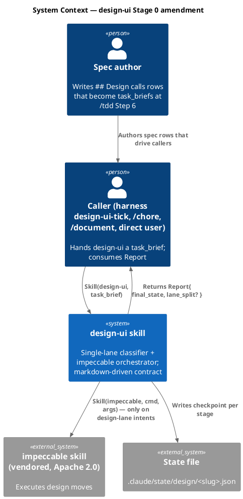
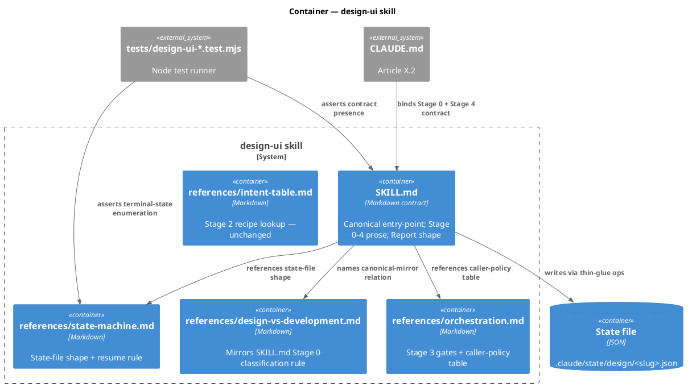
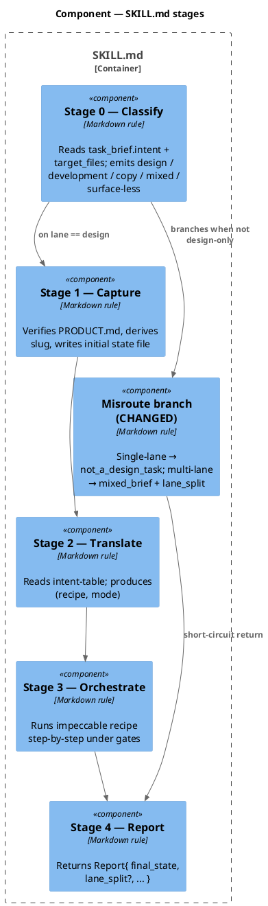
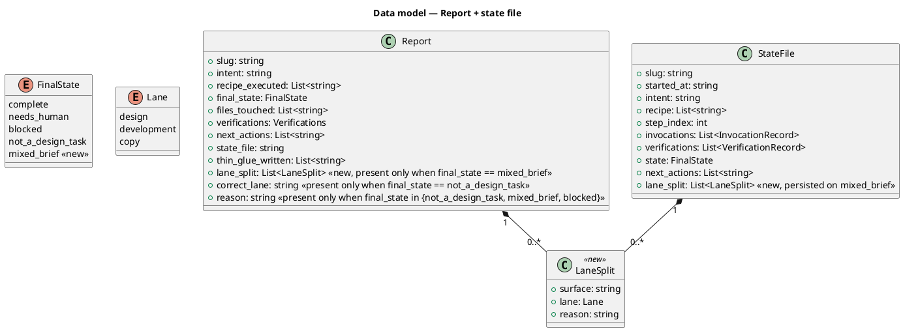
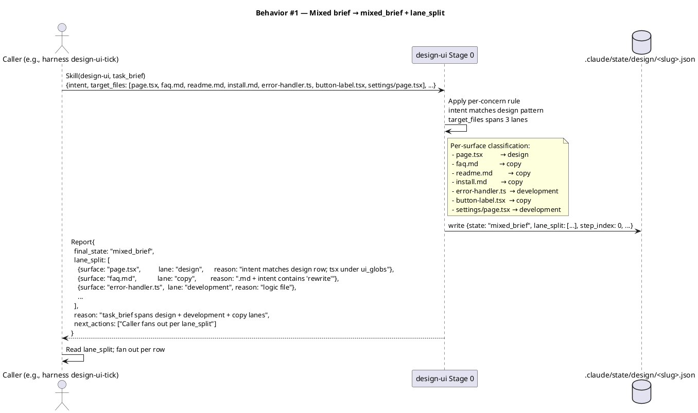
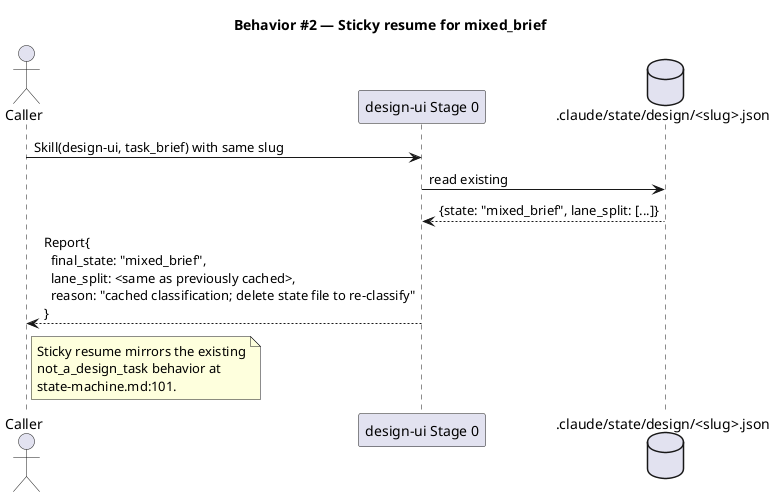
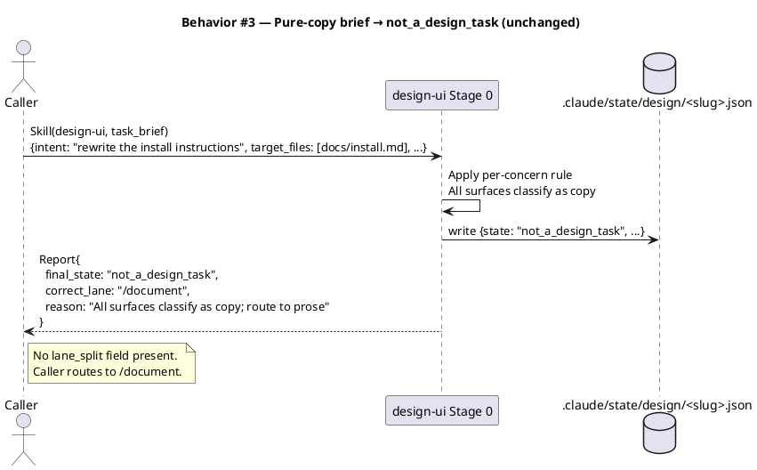
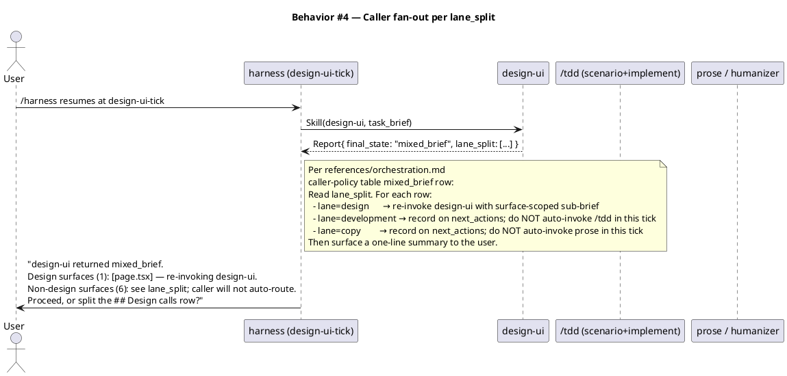
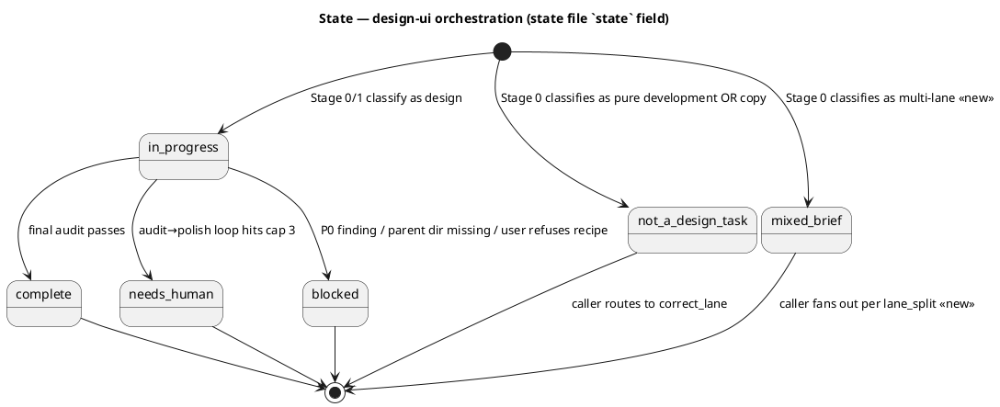
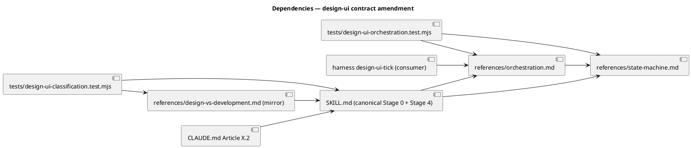

# design-ui mixed_brief — Stage 0 structured decomposition for multi-lane briefs

## Context

| Input | Path |
|---|---|
| Intake | — (excepted at triage; Q-007 is the source) |
| BRD *(if any)* | — |
| Scout *(if any)* | `docs/scout/design-ui-mixed-brief.md` |
| Research *(if any)* | — (excepted at triage; no third-party API involved) |
| Memory source | `.claude/memory/pending-questions.md` Q-007 |

## Goal

`design-ui` Stage 0 emits a new terminal state `mixed_brief` with a structured `lane_split` array when a `task_brief` spans multiple lanes, instead of collapsing to `not_a_design_task` or asking the user interactively. Single-lane misroutes still return `not_a_design_task` (backwards-compatible).

## Non-goals

- design-ui does NOT execute any lane when it returns `mixed_brief`. It only classifies and reports. The architectural commitment from Article X.2 (design-ui is single-lane) is preserved.
- The vendored `impeccable` skill is not touched (Article IX).
- `/tdd`, `/chore`, `/document`, `prose`, and `scenario` are not edited in this spec. Only design-ui's contract changes; callers consume the new shape via the canonical caller-policy table in `references/orchestration.md` (which they already read today for `complete` / `needs_human` / `blocked` / `not_a_design_task`).
- Article X.2's Stage-0 row gets a wording amendment, but Article X.2's overall lane-routing policy is unchanged.

## Design

Diagrams are the contract.

### C4 — System context



### C4 — Container

The "system" is the design-ui skill on disk. Its "containers" are the markdown files that together form the skill's contract.



### C4 — Component (changed container only: SKILL.md)



### Data model — class diagram



#### Migration DDL

No database. The state-file shape is JSON; the migration is in-prose and lazy: existing state files (none ship in git; the directory is gitignored) continue to validate without the `lane_split` field; new mixed-brief classifications write the field. No backfill.

```sql
-- forward (in-prose, state-machine.md enum update):
-- ALTER ENUM FinalState ADD VALUE 'mixed_brief';
-- ALTER STATEFILE ADD OPTIONAL FIELD lane_split List<LaneSplit>;
-- reverse:
-- ALTER ENUM FinalState DROP VALUE 'mixed_brief';
-- ALTER STATEFILE DROP OPTIONAL FIELD lane_split;
```

### Behavior — sequence per AC

#### §Behavior #1 — Stage 0 classifies mixed brief, returns mixed_brief + lane_split



#### §Behavior #2 — Re-invocation with same slug returns cached lane_split (sticky resume)



#### §Behavior #3 — Single-lane misroute still returns not_a_design_task (backwards-compat)



#### §Behavior #4 — Caller policy: fan out on mixed_brief



The "do NOT auto-invoke" choice for non-design lanes is deliberate: auto-routing into `/tdd` and `prose` from inside a design-ui-tick would expand the tick's blast radius beyond its declared write_set and bypass the spec author's ability to split their `## Design calls` row deliberately. Surfacing keeps the spec author in control.

### State — core entity

The state file's `state` field is a finite-state model. The amendment adds one terminal state.



### Dependencies — graph

Edge `A --> B` reads "A depends on B" (A reads or cites B; changes to B force re-verification of A).



### Contracts

The skill exposes one orchestration contract. The amendment changes the Report shape only.

| Kind | Name | Input | Output | Errors | Idempotent |
|---|---|---|---|---|---|
| Skill | `Skill(design-ui, task_brief)` | `task_brief` per SKILL.md schema (concern, intent, slug?, target_files, write_set, register_override?, references?) | `Report{ slug, intent, recipe_executed, final_state ∈ {complete, needs_human, blocked, not_a_design_task, mixed_brief}, files_touched, verifications, next_actions, state_file, thin_glue_written, lane_split?, correct_lane?, reason? }` | Returned as `final_state: "blocked"` with `reason` | Yes (same slug → cached Report; sticky for terminal states) |

`lane_split` is present only when `final_state == "mixed_brief"`; `correct_lane` only when `final_state == "not_a_design_task"`; `reason` is present on all non-success terminal states.

### Libraries and versions

| Library@version | Purpose | Key APIs | Confirmed via context7 |
|---|---|---|---|
| *(none — markdown contract amendment; no third-party APIs)* | — | — | n/a |

### Alternatives considered

| Alt | Summary | Rejected because |
|---|---|---|
| Auto-decompose at Stage 0 | design-ui itself splits the brief, invokes design portions via impeccable, also routes non-design surfaces into `/tdd` / `prose` | Couples design-ui to `/tdd` and `prose` input contracts; collapses Article X.2's per-lane structural separation; violates "design-ui stays single-lane" guardrail |
| Per-surface `mixed_brief: true` flag in `task_brief` | Caller declares upfront; design-ui returns results per-lane | Same coupling problem; pushes lane modeling into the input schema; doubles the API surface |
| Status quo + better error message | Keep returning `not_a_design_task` but with a richer prose `reason` describing the mixed-lane case | Doesn't structurally help callers; they still have to re-classify by reading prose |
| Hard-block: refuse mixed briefs | Return `final_state: "blocked"`; force spec author to split the `## Design calls` row | Too rigid for ad-hoc direct-user invocations; pushes friction onto every caller including main-context exploration |
| Auto-execute design lane, record others on `next_actions` | design-ui runs the design portion of a mixed brief, surfaces non-design on next_actions | Expands the tick's blast radius beyond its declared write_set; reduces caller agency to defer the design portion |

## Design calls

Implementation write_set: `.claude/skills/design-ui/SKILL.md`, `.claude/skills/design-ui/references/{design-vs-development,orchestration,state-machine}.md`, `CLAUDE.md`, `tests/design-ui-classification.test.mjs`, `tests/design-ui-orchestration.test.mjs`. None intersect `project.json → tdd.ui_globs` — markdown-only contract amendment, no UI surface.

- *(none)*

## Acceptance criteria

| ID | Criterion (given / when / then) | Upstream AC | Sequence |
|---|---|---|---|
| AC-001 | Given a `task_brief` whose target_files span ≥ 2 lanes per the per-concern rule in `design-vs-development.md`, when Stage 0 classifies, then design-ui returns `Report{ final_state: "mixed_brief", lane_split: [...], reason }` and writes `state: "mixed_brief"` to the state file | Q-007 | §Behavior #1 |
| AC-002 | Given a `mixed_brief` Report, when the caller reads `lane_split`, then every entry has shape `{ surface: string, lane: "design"\|"development"\|"copy", reason: string }` and `lane_split.length == target_files.length` (one row per surface) | Q-007 | §Behavior #1 |
| AC-003 | Given Stage 0 has classified a brief as `mixed_brief`, when design-ui returns, then no `Skill(impeccable, ...)` was invoked and no product code was written for this invocation | architectural guardrail | §Behavior #1 |
| AC-004 | Given a state file at `.claude/state/design/<slug>.json` with `state: "mixed_brief"`, when design-ui is re-invoked with the same slug, then it returns the cached Report (sticky resume) without re-running Stage 0 | scout risk: sticky resume mirroring | §Behavior #2 |
| AC-005 | Given a `task_brief` whose target_files all classify as a single non-design lane (pure copy OR pure development), when Stage 0 classifies, then design-ui returns `Report{ final_state: "not_a_design_task", correct_lane, reason }` — the existing single-lane misroute path is unchanged | backwards-compat | §Behavior #3 |
| AC-006 | Given `.claude/skills/design-ui/references/state-machine.md`, when read, then it documents `mixed_brief` in the `state` enum (line ~24), in the terminal-state table (lines ~80–88), and in the resume-logic block (mirrors the `not_a_design_task` sticky rule) | scout: three-place sync | static doc check |
| AC-007 | Given `.claude/skills/design-ui/references/orchestration.md`, when read, then the caller-policy table has a row for `mixed_brief` declaring: "Read `lane_split`. For lane=design rows, re-invoke design-ui with a scoped sub-brief. For lane=development and lane=copy rows, record on `next_actions` and surface a one-line summary to the user; do NOT auto-invoke `/tdd` or `prose` in this tick." | scout: caller-policy required | §Behavior #4 |
| AC-008 | Given `.claude/skills/design-ui/SKILL.md`, when read, then Stage 4's Report shape (around line 120) lists `"mixed_brief"` among `final_state` values, declares the optional `lane_split` field, and Stage 0's prose (around lines 44–61) names the two-branch misroute (single-lane vs multi-lane) | scout: SKILL.md is canonical | §Behavior #1 |
| AC-009 | Given `.claude/skills/design-ui/references/design-vs-development.md`, when read, then the file's Misroute-handling block names SKILL.md as the canonical source and documents itself as the mirror; the prior "Mixed → return to step 1 with the user surfaced; ask which concern they mean" rule is replaced by a pointer to the SKILL.md `mixed_brief` return | scout: drift risk | §Behavior #1 |
| AC-010 | Given `CLAUDE.md`, when read, then Article X.2's Stage-0-misroute row (line 264) names BOTH `not_a_design_task` (single-lane misroute) AND `mixed_brief` (multi-lane misroute with structured `lane_split`), preserving the constitutional binding | scout: Article X.2 drift | static doc check |
| AC-011 | Given `tests/design-ui-classification.test.mjs`, when run, then it asserts (in addition to existing assertions) that SKILL.md mentions `mixed_brief` in its Stage 0 prose and documents the `lane_split` field; and `tests/design-ui-orchestration.test.mjs` asserts that `mixed_brief` appears in state-machine.md's terminal-state enumeration | scout: enumerated test | §Behavior #1 + §Behavior #4 |

## Test plan

Skill amendment; no executable runtime. Tests are static doc assertions over markdown files via `tests/design-ui-*.test.mjs`.

| Category | Scenario | Expected | Covers |
|---|---|---|---|
| Golden path | Mixed brief (1 design + 5 copy + 1 dev) hits Stage 0 — assertion: SKILL.md prose describes the `lane_split` return for multi-lane briefs | `lane_split` field documented; `mixed_brief` literal appears in Stage 0 + Stage 4 | AC-001, AC-002, AC-008 |
| Golden path | Caller-policy table row for `mixed_brief` exists | row asserts fan-out behavior including the "do NOT auto-invoke" clause | AC-007 |
| Input boundary | Single-lane misroute (pure copy: `["docs/install.md"]`) | `not_a_design_task` literal still appears in SKILL.md as the single-lane misroute terminal | AC-005 |
| Input boundary | Surface-less brief (intent="tokens" with empty target_files) | unchanged from current behavior — still routes per intent-table.md (not relevant to mixed_brief) | regression — AC-005 stays passing |
| Contract violation | State-file `state` enum must include both `not_a_design_task` and `mixed_brief` literally | state-machine.md enum line + terminal-state table both name both states | AC-006 |
| Contract violation | Constitution: CLAUDE.md Article X.2 row 1 mentions both `not_a_design_task` and `mixed_brief` | regex finds both literals on the same Article X.2 row | AC-010 |
| Concurrency / ordering | n/a — markdown contract has no concurrency | — | — |
| Failure mode | Re-invocation with same slug after `mixed_brief` returns cached Report | state-machine.md resume-logic explicitly says: "Present and `state` is `mixed_brief` → return the existing Report; the misroute is sticky for this slug" | AC-004 |
| Regression trap | The four pre-existing terminal-state literals (`complete`, `needs_human`, `blocked`, `not_a_design_task`) all still appear in state-machine.md | unchanged | regression — existing `design-ui-orchestration.test.mjs:67` enumeration still passes |
| Regression trap | All seven `task_brief` schema fields (`concern`, `intent`, `slug`, `target_files`, `write_set`, `register_override`, `references`) still documented in SKILL.md | unchanged | regression — existing `design-ui-classification.test.mjs` test_when_design_ui_skill_md_then_documents_task_brief_schema |
| Regression trap | The 3-iteration cap text in orchestration.md still parses for the existing orchestration test | unchanged | regression — existing `design-ui-orchestration.test.mjs` cap-3 test |

### Test file updates

- `tests/design-ui-classification.test.mjs`
  - **Extend** existing test `test_when_design_ui_skill_md_exists_then_describes_stage_0_classification` to also assert `mixed_brief` appears in SKILL.md (in addition to `not_a_design_task`).
  - **Add** new test `test_when_design_ui_skill_md_then_documents_lane_split_field` asserting `lane_split` is named in the Stage 4 Report shape and described with the `{ surface, lane, reason }` shape.
  - **Add** new test `test_when_design_vs_development_md_then_designates_skill_md_as_canonical` asserting the file body contains language like "canonical" referring to SKILL.md (e.g., "SKILL.md is the canonical source; this file mirrors it").
- `tests/design-ui-orchestration.test.mjs`
  - **Extend** existing test `test_when_state_machine_md_then_documents_terminal_states` to add `'mixed_brief'` to the loop at line 67 (so the array is `['complete', 'needs_human', 'blocked', 'not_a_design_task', 'mixed_brief']`).
  - **Add** new test `test_when_state_machine_md_then_documents_mixed_brief_sticky_resume` asserting the resume-logic block explicitly mentions `mixed_brief` as sticky.
  - **Add** new test `test_when_orchestration_md_then_has_mixed_brief_caller_policy_row` asserting the caller-policy table contains a row keyed on `mixed_brief` with prose mentioning `lane_split`, "fan out", and "do NOT auto-invoke" (or equivalent regex).

## Observability

| Signal | Name | Shape | Purpose |
|---|---|---|---|
| State-file `state` | `state: "mixed_brief"` in `.claude/state/design/<slug>.json` | enum value | Inspect post-hoc which orchestrations were mixed |
| Harness log | `entered design-ui-tick` / `completed design-ui-tick` in `.claude/state/harness/<slug>.log` | text lines | Confirm the tick ran and returned cleanly |
| Memory pending | Q-007 closed in `pending-questions.md` with `CLOSED <date>` block | markdown | Audit trail for the design decision |

No metrics, no alarms — this is a contract amendment to a developer-tool skill, not a runtime-observable system.

## Rollout

- **Feature flag**: none. Skill amendments take effect at the next read; the skill is interpreted prose, not compiled code.
- **Migration order**: 1. Update `SKILL.md` Stage 0 + Stage 4 → 2. Update `references/state-machine.md` enum + terminal-state table + resume block → 3. Update `references/orchestration.md` caller-policy table → 4. Update `references/design-vs-development.md` to point at SKILL.md as canonical → 5. Update `CLAUDE.md` Article X.2 row → 6. Update tests. Order is significant: tests assert the prose presence, so prose must precede test edits in commit-order; but inside a single commit, both must be present and consistent.
- **Canary**: n/a. The very next `Skill(design-ui)` invocation observes the new contract.

## Rollback

- **Kill-switch**: `git revert <commit>`. The seven affected files revert atomically.
- **Signal to roll back**: any of `tests/design-ui-*.test.mjs` failing after the change is merged, OR a workflow that hits Stage 0 mid-flight and observes a Report shape that doesn't match its caller-policy table reading. Detection window: < 5 minutes (the next `/integrate` run).

## Archive plan

- Defaults *(automatic)*: scout, spec, spec-rendered/, spec approval.
- Extras *(list any non-default files)*:
  - *(none)*

## Open questions

- *(none — the three decisions flagged in scout risks are resolved here:)*
  - **Caller action for `mixed_brief`**: fan out per `lane_split`; design-ui does NOT auto-execute the design lane in the same invocation (preserves caller agency, keeps tick blast-radius bounded). See §Behavior #4 + AC-007.
  - **Sticky-on-resume**: mirrors `not_a_design_task` — re-invocation with the same slug returns the cached Report. Delete the state file to re-classify. See §Behavior #2 + AC-004.
  - **Canonical source for misroute prose**: `SKILL.md` Stage 0 is canonical; `references/design-vs-development.md` mirrors. See AC-008 + AC-009.
