# Backlog memory bucket — intent extraction + canonical file

<!--
Technical spec. Produced by the `spec` skill.
Guard-enforced invariants: required headings + diagrams + parseable PlantUML.
Approval: written by /approve-spec, not by this file.
-->

## Context

| Input | Path |
|---|---|
| Intake | `docs/intake/backlog-memory-bucket.md` |
| Scout | `docs/scout/backlog-memory-bucket.md` |
| Research | `docs/research/backlog-memory-bucket.md` |

write_set: `.claude/hooks/memory_stop.sh`, `.claude/memory/backlog.md`, `.claude/memory/README.md`, `.claude/skills/memory-flush/SKILL.md`, `.claude/skills/memory-flush/sweep.py`, `.claude/skills/memory-flush/tests/run.sh`, `.claude/hooks/memory_session_start.sh`, `.claude/hooks/tests/memory_stop_intent_test.sh`, `.claude/skills/audit-baseline/audit.sh`, `src/memory/backlog.template.md`, `site-src/memory.njk`, `docs/init/seed.md`

## Goal

The Stop-event memory hook extracts future-intent statements from each turn's user and assistant text, emits them as backlog candidates into `_pending.md`, and `/memory-flush` promotes the keepers into a new canonical `backlog.md` file alongside the existing six.

## Non-goals

- Building the `/pm` skill that will consume `backlog.md`. This spec ships the bucket, not the consumer.
- Auto-promoting backlog items to intakes — promotion to a workflow remains a manual user action.
- Introducing a new slash command for capture. Capture is automatic via the existing `memory_stop.sh` extraction path.
- Replacing `pending-questions.md`. Open questions awaiting user answer remain a separate register; backlog tracks future-work intent.
- Heuristic / NLP-based intent classification. Per the user's verbatim constraint, only anchored line-start regex patterns are in scope.

## Design

Diagrams are the contract. Prose only for things a diagram cannot say.

### C4 — System context

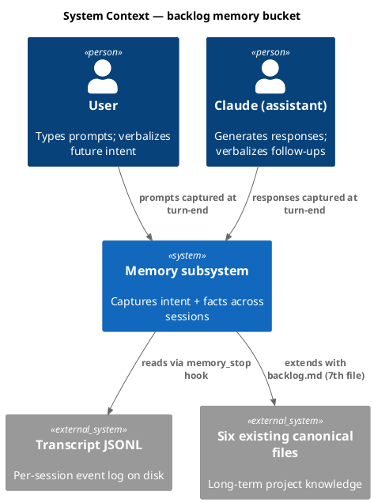

### C4 — Container

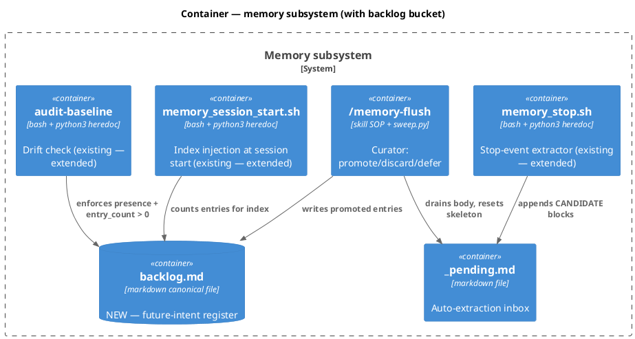

### C4 — Component (changed containers only)

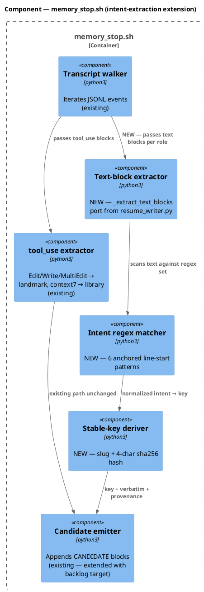

### Data model — class diagram

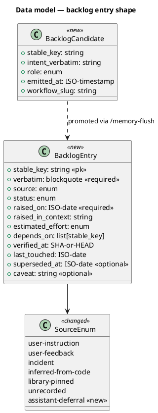

#### Migration "DDL"

This codebase has no SQL database; the equivalent is the markdown frontmatter contract. The change set:

```text
-- forward --
1. CREATE FILE  .claude/memory/backlog.md
   with frontmatter: owners=[/memory-flush]  category=future-work intent  size-cap=500
                     key=<slug>-<4char-hash>  verifies-against=none  stale-exempt=true
   body: ONE bootstrap entry (## bootstrap) with status=dropped + superseded-at=<today>
         so auto-close removes it on first /memory-flush sweep post-install.

2. CREATE FILE  src/memory/backlog.template.md
   pristine frontmatter only; ZERO entries (per audit.sh:451-473 pristine-template rule).

3. EXTEND ENUM .claude/memory/README.md → Source provenance table
   ADD VALUE  assistant-deferral  WITH  verbatim:=Required

4. EXTEND LIST .claude/skills/audit-baseline/audit.sh → EXPECTED_MEMORY_FILES
   ADD  "backlog"

5. EXTEND LIST .claude/skills/memory-flush/sweep.py → CANONICAL_FILES
   ADD  "backlog"
   ADD STALE_EXEMPT_FILES = {"backlog"}  (new constant)
   GUARD is_stale(name=...): returns False when name in STALE_EXEMPT_FILES

6. EXTEND LIST .claude/hooks/memory_session_start.sh → canonical
   ADD  "backlog"
   GUARD _is_stale(name=...): returns False when name == "backlog"

7. EXTEND BODY .claude/hooks/memory_stop.sh → python3 heredoc
   ADD  INTENT_PATTERNS, ROLE_FILTERS, normalize_intent, derive_key
   ADD  text-block extraction pass alongside existing tool_use pass

-- reverse --
Delete backlog.md + backlog.template.md.
Revert enum add, list adds, guard adds, heredoc extension.
Both forward and reverse are reviewable in a single commit; no data migration.
```

### Behavior — sequence per AC

#### Behavior #1 — User-prompt intent → backlog candidate (AC-001)

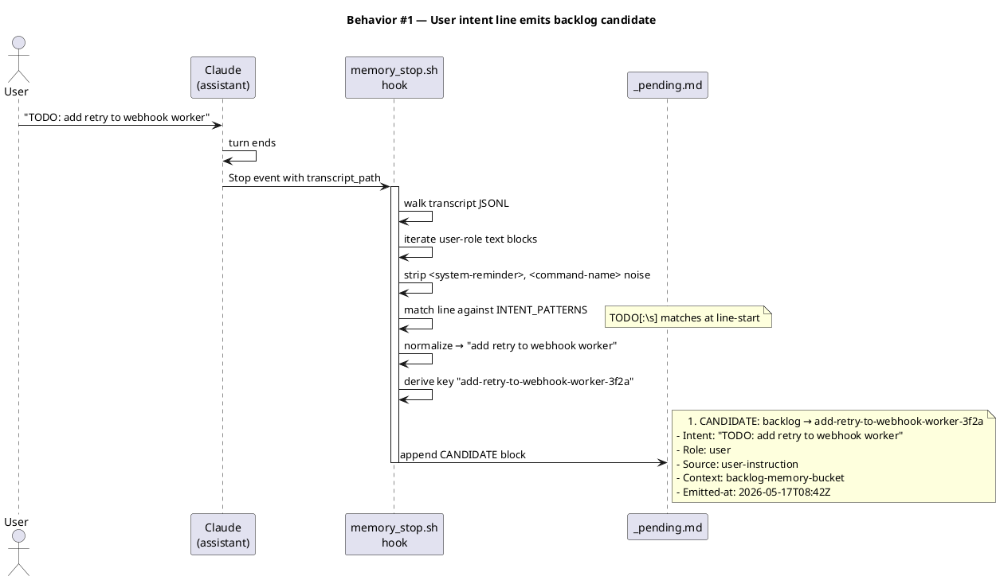

#### Behavior #2 — Assistant-text intent → backlog candidate with distinct provenance (AC-002)

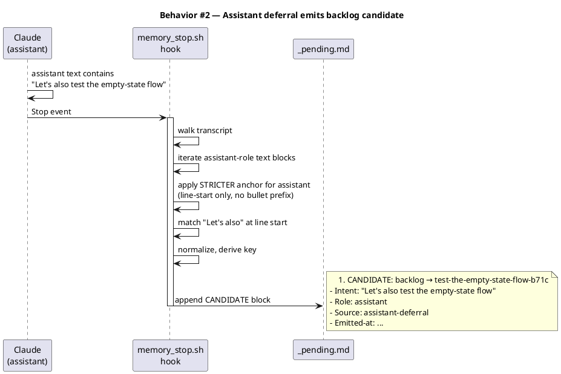

#### Behavior #3 — Mid-sentence non-intent suppressed (AC-003)

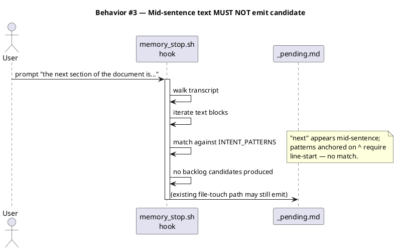

#### Behavior #4 — File-touch extraction parity preserved (AC-004)

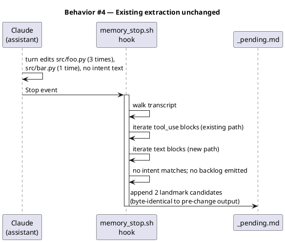

#### Behavior #5 — `/memory-flush` promotes backlog candidate to backlog.md (AC-005)

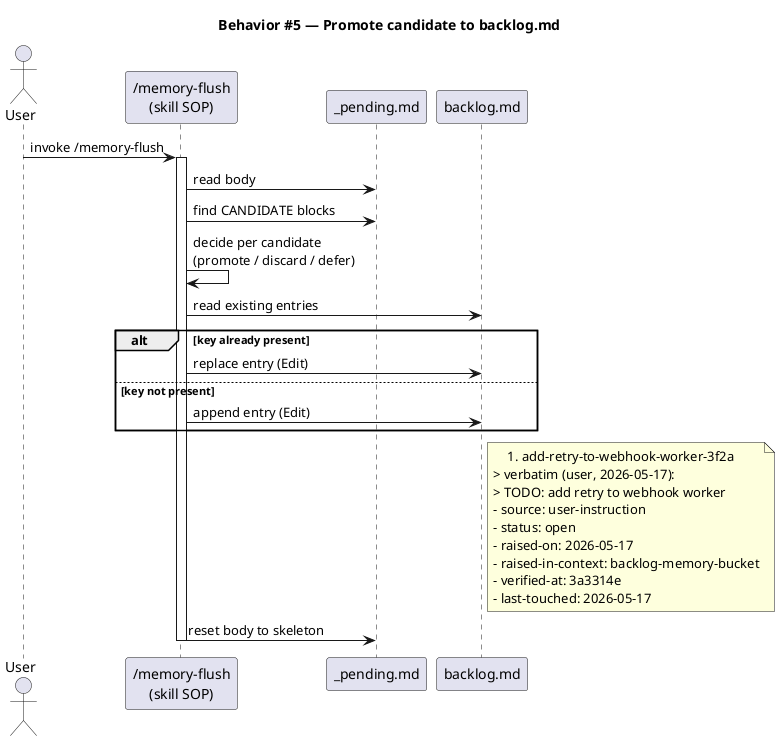

#### Behavior #6 — `backlog.md` bootstrap entry auto-closes on first flush (AC-006)

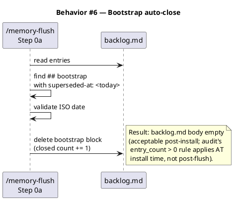

#### Behavior #7 — `README.md` schema documents backlog (AC-007)

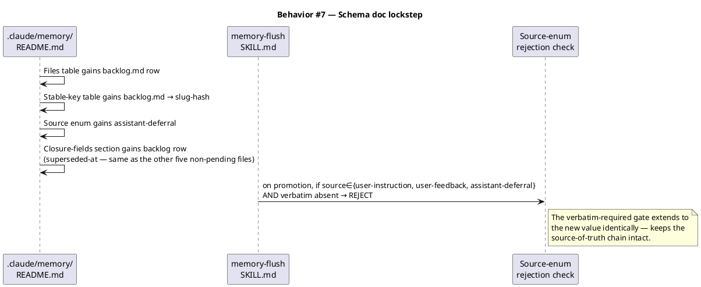

#### Behavior #8 — `audit-baseline` recognizes backlog.md (AC-008)

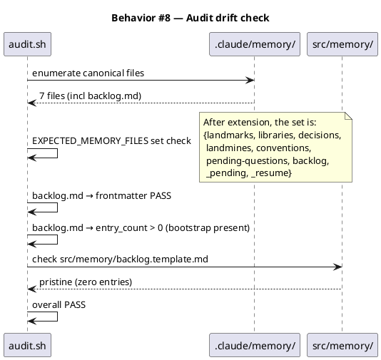

#### Behavior #9 — Backlog entries stale-exempt (AC-009)

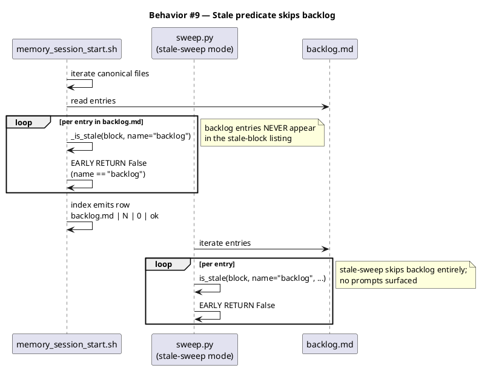

#### Behavior #10 — Dedup key collision resistance (AC-010)

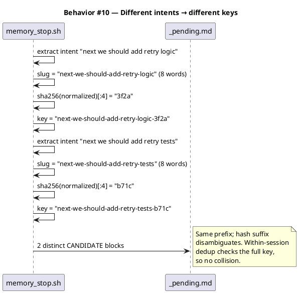

### State — backlog entry lifecycle

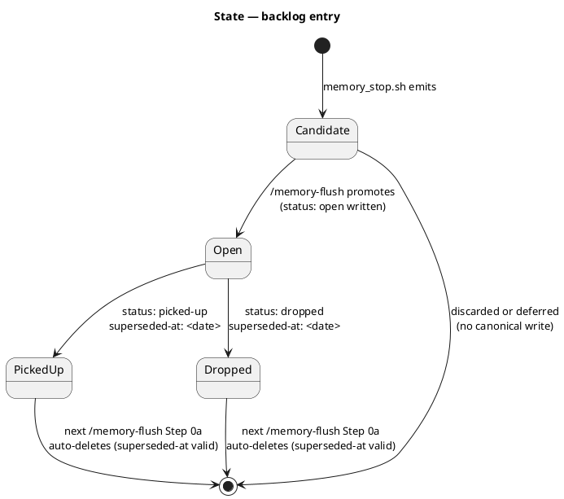

### Dependencies — graph

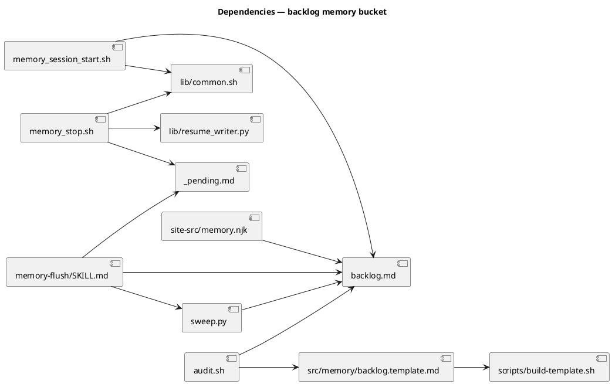

The graph is acyclic — every edge points from a consumer to a producer/data store.

### Contracts

| Kind | Name | Input | Output | Errors | Idempotent |
|---|---|---|---|---|---|
| Hook event | `memory_stop.sh` Stop event | `{transcript_path, ...}` JSON on stdin | side-effect: append to `_pending.md` | non-blocking; logs to stderr | yes (existing-key dedup) |
| Markdown file | `.claude/memory/backlog.md` | n/a | canonical entries with stable keys | n/a | yes (replace-on-key-match in `/memory-flush`) |
| Markdown candidate | `## CANDIDATE: backlog → <key>` block | n/a | new block in `_pending.md` body | n/a | within-session dedup keyed on stable_key |
| Python helper | `normalize_intent(text)` in `memory_stop.sh` heredoc | string | lowercased, whitespace-collapsed, trigger-stripped string | n/a | yes |
| Python helper | `derive_key(intent)` in `memory_stop.sh` heredoc | normalized string | `<8-word-kebab>-<4-char-sha256>` | n/a | yes |
| Audit check | `EXPECTED_MEMORY_FILES` in `audit.sh` | n/a | set with `"backlog"` added | check FAIL if missing on disk | n/a |

### Libraries and versions

No external libraries. Every API used is in the Python 3 standard library (`re`, `hashlib`, `json`, `os`, `sys`, `pathlib`, `datetime`) or already in the existing hook helpers (`payload_get`, `_extract_text_blocks` shape). The codebase contract (`conventions.md → hook-script-shape`) forbids non-stdlib deps in hook scripts.

| Library@version | Purpose | Key APIs | Confirmed via context7 |
|---|---|---|---|
| Python 3 stdlib (system-installed) | regex matching, hashing | `re.compile`, `re.MULTILINE`, `hashlib.sha256` | n/a (stdlib) |

### Alternatives considered

| Alt | Summary | Rejected because |
|---|---|---|
| Keyword whitelist + `\b` word-boundary matching | Higher recall via anywhere-in-text matching | False positive class identical to `pending-questions.md → Q-003` (regex-over-command-string). Violates user's verbatim "only obvious future-intent phrasings should match" constraint. |
| Heuristic intent scorer | Sentence scoring + threshold | No precedent for stat-style scoring in this codebase; thresholds drift; tests harder to write deterministically. |
| `inferred-from-code` for assistant-derived backlog | Reuse existing source enum value | Semantic collision — `inferred-from-code` means "derived from reading code," not from chat. The verbatim is N/A for it; backlog assistant-derived entries have a verbatim. |
| New `picked-up-at:` + `dropped-at:` closure fields | Explicit closure register for status transitions | Two new fields vs zero — `superseded-at` already covers both transitions semantically ("no longer the open intent"). Body `status:` field disambiguates picked-up vs dropped. |
| Hash-only stable key | 8-char sha256 prefix | Curator UX poor — `## CANDIDATE: backlog → 3f2ac891` is opaque; must read body to know intent. |
| Slug-only stable key | First 8 normalized words | Same-prefix collisions: "next we should add retry logic" and "next we should add retry tests" both slug to `next-we-should-add-retry`. Within-session dedup over-collapses. |

## Design calls

The write_set intersects `tdd.ui_globs` via `site-src/memory.njk`. The change adds one row to the canonical-file table (6 → 7), updates two prose mentions ("Six" → "Seven"), and may need a corresponding snippet in the code-block illustrations further down. A row addition is not a pure copy change — table column widths, vertical rhythm, and the figcaption layout may shift. Per CLAUDE.md Article X.2, design-ui is the dispatcher: it owns the design/development/copy classification at Stage 0 and routes per the result. The spec does not pre-classify.

| Slug | Intent | Target files | Write set | Register | References |
|---|---|---|---|---|---|
| memory-njk-7th-canonical | Audit `site-src/memory.njk` after adding a 7th canonical-file row + lockstep prose updates. Verify table layout, column widths, and vertical rhythm hold; ensure the new row honors copy-register em-dash discipline (CLAUDE.md X.1) and the figcaption's "six canonical files" phrasing updates cleanly. Apply visual polish if the row addition exposes layout breakage. Concurrently update the two `Six` → `Seven` prose mentions and any code-block illustration that lists the canonical files. | `site-src/memory.njk` | `site-src/memory.njk` | design | CLAUDE.md Article X.2 (design-ui dispatches); CLAUDE.md X.1 (em-dash ban applies inside the rendered surface) |

## Acceptance criteria

Numbered, testable, traced. Each AC points to the §Behavior sequence that defines it.

| ID | Criterion (given / when / then) | Upstream AC | Sequence |
|---|---|---|---|
| AC-001 | given a user prompt containing `TODO: add retry to webhook worker` (or any other anchored line-start intent pattern), when the assistant's turn ends, then `memory_stop.sh` appends a `## CANDIDATE: backlog → <slug-hash>` block to `_pending.md` carrying the user's verbatim text, role=user, source=user-instruction, ISO timestamp, and active workflow slug as context | intake AC-1 | §Behavior #1 |
| AC-002 | given an assistant response with a line-leading `Let's also test the empty-state flow`, when the turn ends, then `memory_stop.sh` appends a backlog candidate with role=assistant, source=assistant-deferral, and the assistant's verbatim sentence | intake AC-2 | §Behavior #2 |
| AC-003 | given a turn whose only text contains `the next section of the document is` mid-sentence (or any other non-line-anchored occurrence of a trigger phrase), when the turn ends, then no backlog candidate is emitted | intake AC-3 | §Behavior #3 |
| AC-004 | given a turn that edits three source files and writes no future-intent text, when the turn ends, then the file-touch landmark candidates emit byte-identically to the pre-change output (golden-fixture parity) and no spurious backlog candidate appears | intake AC-4 | §Behavior #4 |
| AC-005 | given `_pending.md` contains a `## CANDIDATE: backlog → <key>` block, when the user runs `/memory-flush` and promotes the candidate, then `backlog.md` gains a canonical entry with `status: open`, `raised-on: <date>`, `raised-in-context: <slug>`, `verified-at: <SHA-or-HEAD>`, `last-touched: <date>`, and a verbatim blockquote | intake AC-5 | §Behavior #5 |
| AC-006 | given a fresh install where `backlog.md` is created with a bootstrap entry (`## bootstrap`, `status: dropped`, `superseded-at: <today>`), when `/memory-flush` Step 0a runs for the first time, then the bootstrap entry is auto-deleted (`closed += 1` in the action report) | intake AC-6 (refined) | §Behavior #6 |
| AC-007 | given `.claude/memory/README.md`, when the implementation lands, then the Files table includes a `backlog.md` row, the stable-key table lists `backlog.md → <slug>-<4char-hash>`, the Source provenance table includes `assistant-deferral` with `verbatim: Required`, and the Closure fields section lists `backlog.md` as using `superseded-at:` | intake AC-7 | §Behavior #7 |
| AC-008 | given the binding `project.json → test.cmd` (`bash .claude/skills/audit-baseline/audit.sh`), when the implementation lands, then the audit exits 0 (PASS) with `backlog.md` recognized as the 7th canonical file and `src/memory/backlog.template.md` recognized as the pristine template | intake AC-8 | §Behavior #8 |
| AC-009 | given a `backlog.md` entry whose `verified-at:` SHA is 60+ commits behind HEAD, when `memory_session_start.sh` runs OR `/memory-flush` Step 0c stale-sweep runs, then the entry is NOT classified as stale (zero stale count for `backlog.md` in the index; zero surface prompts in stale-sweep) | NEW (design constraint surfaced in research Q4) | §Behavior #9 |
| AC-010 | given two distinct intents whose first 8 normalized words are identical (e.g., "next we should add retry logic" vs "next we should add retry tests"), when both pass through `derive_key()`, then the resulting stable keys differ (the 4-char sha256 hash suffix disambiguates) | NEW (design constraint surfaced in research Q5) | §Behavior #10 |
| AC-011 | given a backlog candidate with `source: user-instruction` or `source: assistant-deferral` whose body lacks a `verbatim:` blockquote, when `/memory-flush` attempts to promote it, then the promotion is rejected and the candidate stays in `_pending.md` for re-curation | NEW (verbatim-required gate extension) | §Behavior #7 |
| AC-012 | given the `memory_stop.sh` hook runs on a transcript with no intent matches, when the hook completes, then `_pending.md` is byte-identical for the backlog section to its pre-change state (regression trap) | NEW (regression trap) | §Behavior #4 |

## Test plan

Scenarios by category. The `scenario` skill (invoked from `/tdd`) turns these into failing tests; every row references at least one AC.

| Category | Scenario | Expected | Covers |
|---|---|---|---|
| Golden path | User prompt `TODO: foo bar baz` at line start | one backlog candidate with key `foo-bar-baz-<4hash>` (TODO trigger stripped from slug) | AC-001 |
| Golden path | Assistant text `Let's also handle empty inputs` at line start | candidate with `source: assistant-deferral`, distinct key | AC-002 |
| Golden path | All six trigger patterns at line start | six candidates emitted with distinct keys | AC-001, AC-002 |
| Input boundary | Trigger phrase inside `<system-reminder>` block | no candidate emitted (noise filter applies) | AC-003 |
| Input boundary | Trigger phrase inside `<command-name>` injection | no candidate | AC-003 |
| Input boundary | Trigger phrase mid-sentence, no line-start anchor | no candidate (AC-003 mid-sentence guard) | AC-003 |
| Input boundary | Trigger phrase at start of indented bullet (`  - TODO: foo`) | candidate emitted (bullet-prefix anchor matches) | AC-001 |
| Input boundary | Empty intent text after trigger strip ("`TODO: `" alone) | no candidate (zero-content intents discarded) | AC-001 |
| Input boundary | Intent text 200+ chars | candidate with full verbatim; slug truncated to 8 words; hash from full text | AC-010 |
| Contract violation | Backlog candidate promoted via `/memory-flush` without verbatim | promotion rejected; candidate stays in `_pending.md` | AC-011 |
| Contract violation | Backlog entry with `superseded-at:` malformed date (`2026-13-99`) | entry NOT auto-deleted; report flags malformed (existing AC-001 of memory-lifecycle-closure spec) | AC-009 + sweep.py:170-197 existing path |
| Concurrency / ordering | Same intent text appears 3 times in one turn (user, then assistant repeats it twice) | within-session dedup: 1 candidate per role-source (user-instruction once, assistant-deferral once = 2 candidates total) | AC-001, AC-002 |
| Concurrency / ordering | Two distinct intents with same 8-word prefix | two distinct candidates (hash disambiguator) | AC-010 |
| Failure mode | `transcript_path` missing from payload | hook exits 0 cleanly (existing failure handling preserved) | AC-004 |
| Failure mode | `_pending.md` missing | hook exits 0 cleanly (existing guard at memory_stop.sh:28) | AC-004 |
| Failure mode | Transcript file malformed JSONL | hook continues (existing per-line try/except at memory_stop.sh:67-74); no crash, no backlog emit | AC-004, AC-012 |
| Regression trap | File-touch extraction byte-identical pre/post change on intent-free turn | `_pending.md` diff is empty in the landmark section | AC-004, AC-012 |
| Regression trap | `audit-baseline` PASS exit 0 with backlog.md added | overall PASS, all 7 canonical files recognized | AC-008 |
| Regression trap | `_resume.md` snapshot still emits cleanly post-change | no error in `lib/resume_writer.py` invocation | AC-004 |
| Regression trap | `memory_session_start.sh` index shows `backlog.md | N | 0 | ok` regardless of `verified-at` age | stale count for backlog stays 0 | AC-009 |
| Regression trap | Existing `pending-questions.md → resolved-at:` auto-close still works | AC-001 of memory-lifecycle-closure spec still PASS | (pre-existing invariant) |
| Schema | `README.md` source-enum table contains exactly 7 values post-change | one new row (`assistant-deferral`) | AC-007 |
| Schema | `src/memory/backlog.template.md` has frontmatter only, zero `##` entries | audit's pristine-template check PASS | AC-008 |
| Lockstep | `site-src/memory.njk` table has 7 canonical-file rows; "Six" replaced with "Seven" in the two prose locations | rendered site lockstep with disk reality | AC-007 (sibling) |
| Lockstep | `docs/init/seed.md:114` reads `7 canonical files`, line 165 mentions intent-text extraction in `memory_stop` description | seed.md lockstep with audit's EXPECTED_MEMORY_FILES | AC-007 (sibling) |

## Observability

The change is hook + memory + skill; no production runtime metrics. Operability signals:

| Signal | Name | Shape | Purpose |
|---|---|---|---|
| Log | `memory_stop: appended <N> candidate(s) ...` | existing stderr log line; extended to count backlog candidates separately | curator debug (already emits via memory_stop.sh:160-163) |
| Log | `.claude/state/logs/memory_stop.log` per-hook log file | timestamp + summary line per turn | runtime debug |
| Audit | `audit-baseline` overall status | PASS or FAIL with detail | regression detector wired to `project.json → test.cmd` |
| Index | `memory_session_start.sh` table row `backlog.md | N | 0 | ok` | per-file entry count + stale count | session-start health check |

No new metrics, no new alarms. The audit IS the alarm.

## Rollout

- **Feature flag**: none. This is a hook + memory schema change; binary on/off through the commit itself.
- **Migration order**: 1 add `backlog.md` (with bootstrap entry) → 2 extend hooks/sweep/audit → 3 update README/seed/site-njk in lockstep → 4 add tests → 5 audit pass → 6 commit.
- **Canary**: not applicable for in-repo tooling. The next `/memory-flush` invocation post-merge exercises the bootstrap auto-close (Behavior #6).

## Rollback

- **Kill-switch**: revert the commit. Single commit, atomic.
- **Signal to roll back**: `bash .claude/skills/audit-baseline/audit.sh` exits non-zero post-merge, OR `/memory-flush` rejects the bootstrap entry's auto-close, OR existing memory-flush tests (`.claude/skills/memory-flush/tests/run.sh`) regress.
- **Detection window**: immediate — the audit runs as `project.json → test.cmd` so `/integrate` Phase 9 catches any regression before commit.

## Archive plan

When this spec ships, the `archive` skill (Phase 10.5) moves the following into `docs/archive/<ship-date>/backlog-memory-bucket/`. Defaults are auto-discovered by slug; extras are advisory.

- Defaults *(automatic)*: intake, scout, research, spec, spec-rendered/, spec approval token.
- Extras *(list any non-default files)*:
  - *(none — every artifact is slug-named)*

## Open questions

- **OQ-1** (research-OQ-1 carried forward, deferred): Should the `superseded-at:` auto-close on backlog preserve the entry's verbatim and status in a transition log so the future `/pm` skill can reconstruct history? **Resolution path**: defer to the `/pm` workflow; `git log .claude/memory/backlog.md` is sufficient until `/pm` defines its own historical query surface. Decision recorded; not blocking.

- **OQ-2** (rate limit): Should `memory_stop.sh` cap backlog candidates per turn? Research recommended 3. **Resolution**: No cap. The hook emits every match the regex set finds. Silent signal loss is the worst failure mode for an automatic capture system — capping protects against problems the design already solves elsewhere: precision is handled by anchored line-start regexes (research Q1), repeat-suppression is handled by within-session stable-key dedup (AC-010), and curator overwhelm is bounded by `/memory-flush` Phase 10.6 reviewing per-block. If real usage shows volume is genuinely excessive, the right knob is tightening the regex set (precision tuning), not truncating output. Resolved.

- **OQ-3** (bootstrap format): The bootstrap entry is `## bootstrap` with `status: dropped` + `superseded-at: <install-date>`. Adopted as the AC-006 contract. Resolved.

- **OQ-4** (dangling [[links]]): Accept dangling `depends-on:` links per existing convention. Resolved.

- **OQ-5** (audit in AC): Made AC-008 the audit-pass binding criterion. Resolved.
