# Pre-commit changelog skill (keepachangelog 1.0.0) + responsive bento-grid SVG redesign

<!--
Technical spec. Produced by the `spec` skill.

Guard-enforced invariants:
  - Required ## headings (artifact_template_guard): Goal, Design, Acceptance criteria, Test plan.
  - Required diagram kinds inside ```plantuml``` fences (spec_diagram_presence_guard):
        c4_context, c4_container, c4_component, sequence, class, dependency_graph.
  - Every ```plantuml``` fence must parse (plantuml_syntax_guard).

Approval is the token written by /approve-spec to .claude/state/spec_approvals/<slug>.approval.
-->

## Context

| Input | Path |
|---|---|
| Intake | `docs/intake/changelog-skill-and-responsive-svgs.md` |
| Scout | `docs/scout/changelog-skill-and-responsive-svgs.md` |
| Research | `docs/research/changelog-skill-and-responsive-svgs.md` |

The intake captured 11 ACs and 8 OQs. Scout pinned the touchpoints across five surfaces (commit-chain ordering, constitution byte-mirror, new-skill registration, website + SVG, memory + audit invariants) and surfaced that the architecture SVG is **inline** in `site-src/index.njk`, not a standalone asset. Research surfaced three load-bearing candidate sets and resolved the secondary OQs as a matrix; this spec adopts the recommended candidates (A3 / B2 / C2) and the matrix decisions verbatim except where called out below.

Article precedence is enforced — CLAUDE.md Article IV (phase ordering), Article VIII (hook wiring), Article X.1 (em-dash ban on `site-src/**` surfaces), Article XI (skill manifest) — and byte-mirror invariants between `CLAUDE.md` ↔ `src/CLAUDE.template.md` and `docs/init/seed.md` ↔ `src/seed.template.md` SHALL be preserved across every edit this spec drives.

## Goal

After this spec ships, every git-project workflow ends with a `changelog` step between `/grant-commit` and `/commit` that appends keepachangelog 1.0.0–shaped entries to `CHANGELOG.md`'s `## [Unreleased]` section; the architecture diagram on the public docs site renders as a responsive bento grid down to a 320 px viewport; and the source backlog ticket auto-closes via `source_backlog_keys` stamp-closure.

## Non-goals

- Replacing `@semantic-release/changelog` at release time. Semantic-release retains ownership of `CHANGELOG.md` version-block insertion; the new skill only curates the Unreleased section.
- Modifying the npm release pipeline, `/grant-push` flow, branch-aware consent policy, or the conventional-commit `releaseRules` in `.releaserc.json`.
- Introducing a new consent gate (gate D). The existing `/grant-commit` token authorizes both the changelog step and the commit step.
- Picking up `commit-consent-ttl-too-tight-for-humanizer-flow-8917`. The new skill is designed to fit inside the existing 300 s TTL window with headroom.
- Auditing or redesigning the six hero SVGs at `site-src/_includes/hero-symbols/`. Carried as a follow-up chore.

## Design

Diagrams are the contract. Prose is reserved for what a diagram cannot say.

### C4 — System context

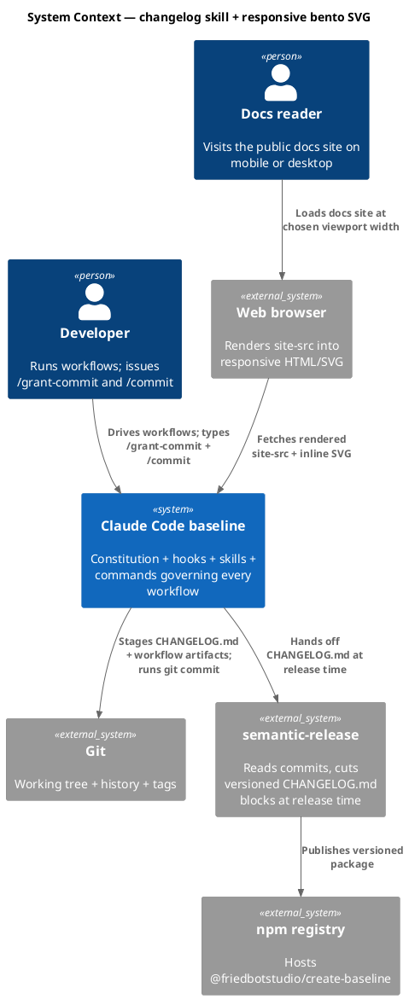

### C4 — Container

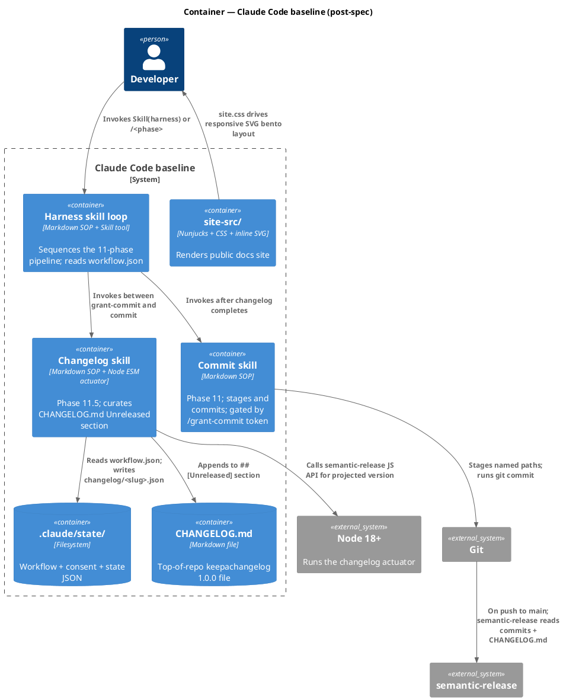

### C4 — Component (Changelog skill internals)

This is the only container whose internals are NEW. Existing containers (commit, harness) grow one prereq line / ordering row but their component layout is unchanged.

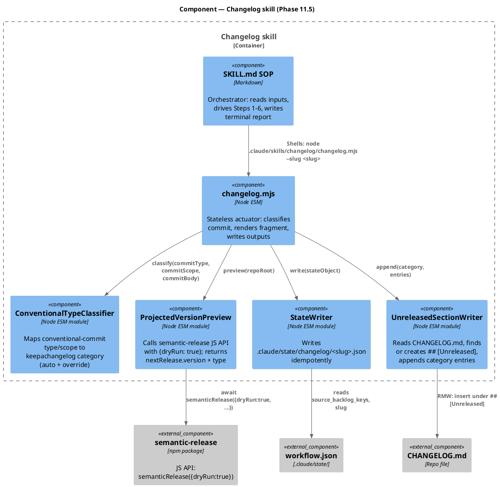

### Data model — class diagram

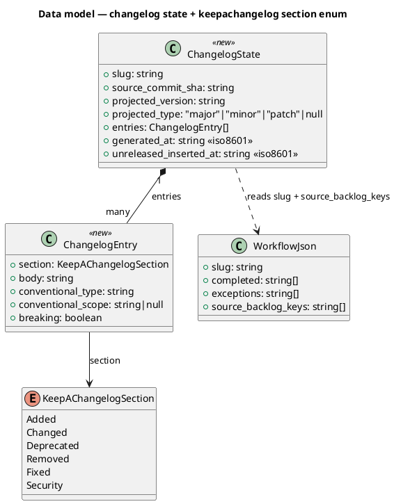

No SQL DDL: state is filesystem JSON, schema enforced by the actuator's JSON-Schema validation at write time.

### Behavior — sequence per AC

#### §Behavior #1 — Harness invokes changelog between gate C and commit (AC-001 / AC-002 / AC-008)

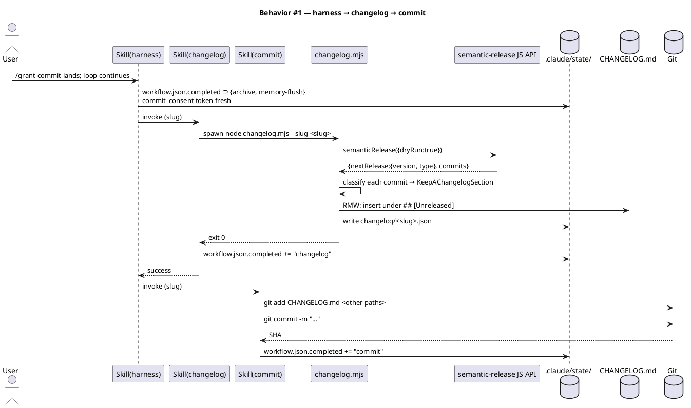

#### §Behavior #2 — Non-git short-circuit (AC-003)

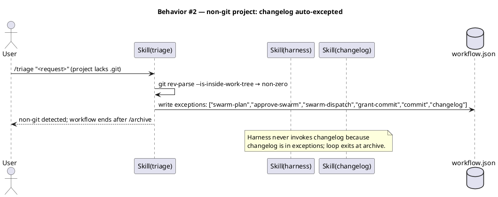

#### §Behavior #3 — source_backlog_keys stamp-closure (AC-009)

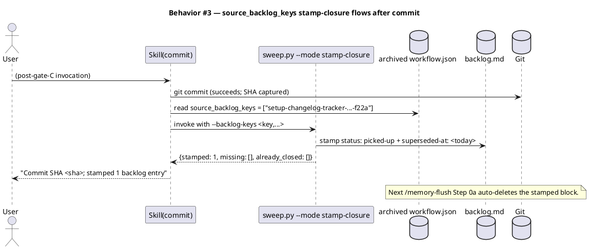

#### §Behavior #4 — Consent expired during changelog step (AC-010)

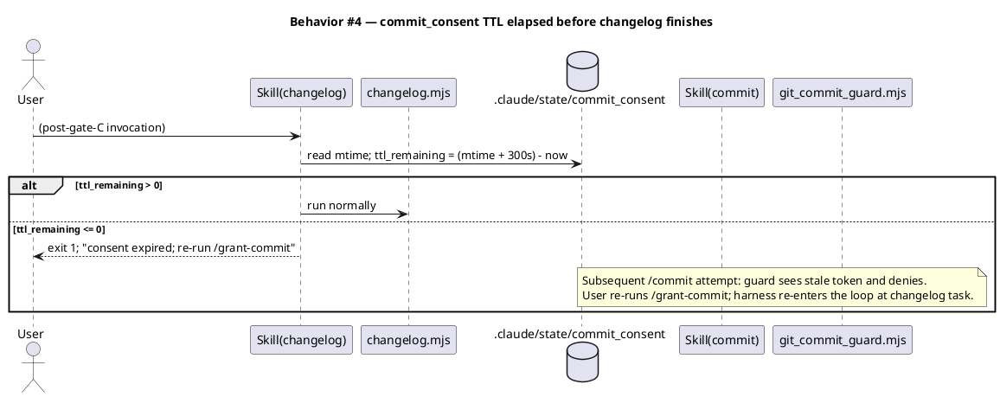

#### §Behavior #5 — TaskList re-seed after session boundary (AC-011)

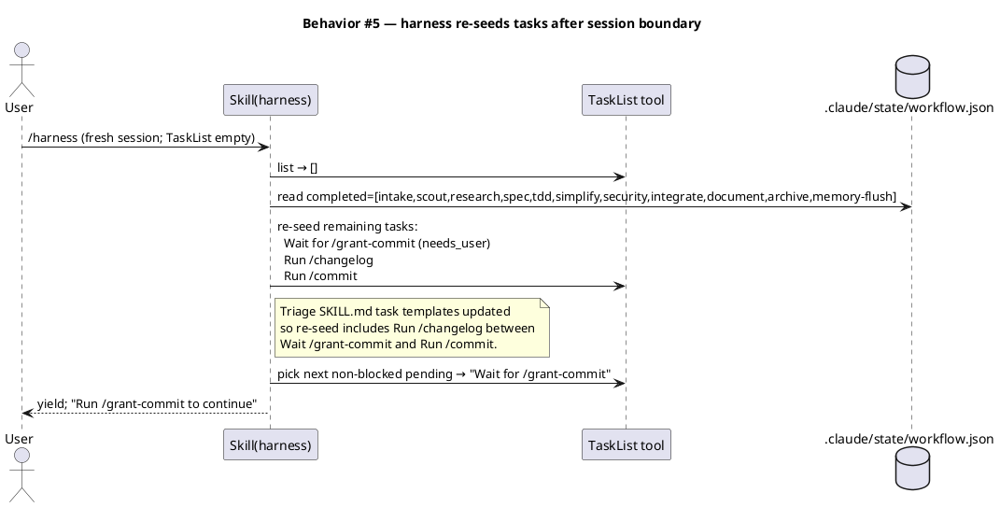

#### §Behavior #6 — Ad-hoc projected-version preview (matrix OQ4)

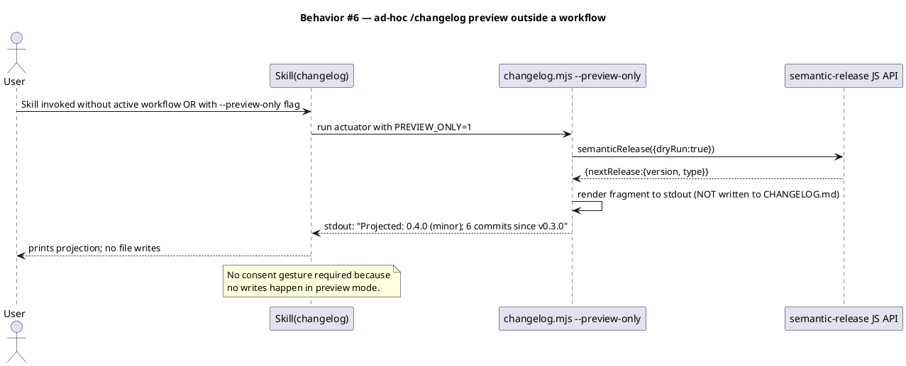

### Dependencies — graph

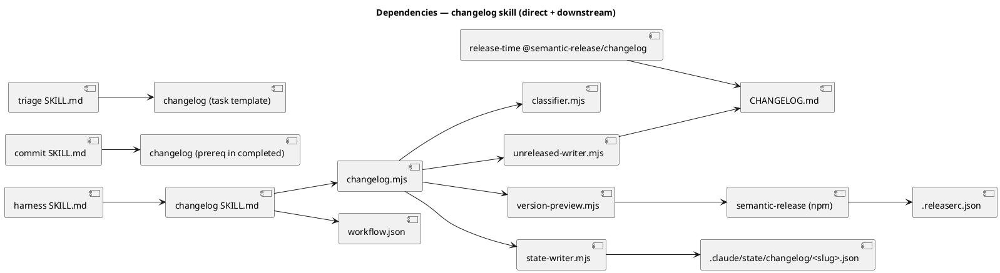

The graph is acyclic. The release-time `@semantic-release/changelog` plugin and the new local skill both write `CHANGELOG.md`, but at disjoint times (per-commit vs. per-release), so there is no runtime cycle.

### State — core entity

Stateful: `.claude/state/changelog/<slug>.json` is written on every successful changelog invocation. Re-invocation rewrites idempotently (the actuator deletes its prior `## [Unreleased]` insertions matching `entries[].section + entries[].body` before re-appending, to prevent duplication on harness re-entry).

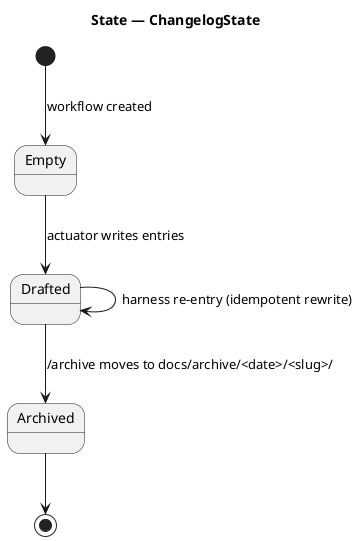

### Contracts

| Kind | Name | Input | Output | Errors | Idempotent |
|---|---|---|---|---|---|
| CLI | `node .claude/skills/changelog/changelog.mjs --slug <slug>` | `--slug`, optional `--preview-only`, optional `--project-root <path>` | exit 0 + state file written; or exit 1 with stderr reason | exit 1 = consent expired / git error / semantic-release error; exit 2 = bad arguments | yes — rewrites match the actuator's prior write |
| Skill | `Skill(changelog, slug)` | `slug` | terminal report on stdout; harness reads exit code | inherits actuator exit codes | yes |
| File | `CHANGELOG.md` | RMW under `## [Unreleased]` | section grows with category sub-headings | absent file → actuator creates with skeleton | yes |
| File | `.claude/state/changelog/<slug>.json` | object matching `ChangelogState` class | persisted JSON | invalid JSON → actuator exits 1 | yes |

### Libraries and versions

| Library@version | Purpose | Key APIs | Confirmed via context7 |
|---|---|---|---|
| `semantic-release@latest` (devDep, version per package.json) | Projected-version preview via JS API | `semanticRelease({ dryRun: true }, { cwd, env, stdout, stderr })` returning `{ lastRelease, commits, nextRelease, releases }` or `null` | yes — `/semantic-release/semantic-release` `js-api.md` |
| `@semantic-release/changelog@6.0.3` (devDep, pinned in package.json) | Release-time CHANGELOG.md insertion (existing; no code changes) | `prepare` step; `{ changelogFile: "CHANGELOG.md" }` config | yes — `/semantic-release/semantic-release` plugin chain reference. ⚠ Unreleased-section preservation behavior NOT documented in context7 — verified by Test plan integration test `keepachangelog-unreleased-preserved.test.mjs` |
| Node.js@>=18.17.0 (engines) | Runtime for the Node ESM actuator | `node:fs/promises`, `child_process` (none — JS API used instead) | n/a — stdlib |

### Alternatives considered

| Alt | Summary | Rejected because |
|---|---|---|
| A1 | Inline keepachangelog block in commit message body; semantic-release parses at release | Humanizer coupling; multi-category awkward; loses skill/commit separation of concerns |
| A2 | Per-commit side files at `.changelog/<sha>.md` | Needs custom release-time assembler; pulls workflow away from current `.releaserc.json` baseline |
| B1 | Shell `npx semantic-release --dry-run --no-ci` and regex-parse stdout | 2-5s latency; brittle regex against undocumented prose format; counts against 300s consent TTL |
| B3 | Re-implement `releaseRules` locally in Node | YAGNI violation; semantic-release analyzer behavior drifts silently |
| C1 | Keep linear flowchart, viewBox-only responsive | Misses the bento brief (intake AC7) |
| C3 | Two SVGs (mobile + desktop) toggled by CSS display | Doubles authoring + maintenance; caption duplication |

## Design calls

The write_set intersects `tdd.ui_globs` (`site-src/**`, `**/*.njk`, `**/*.css`). Two design surfaces:

| Slug | Intent | Target files | Write set | Register | References |
|---|---|---|---|---|---|
| `architecture-svg-bento-grid-responsive` | Redesign the inline architecture SVG in `site-src/index.njk:180-259` as an **asymmetric bento-grid composition** at desktop and a vertical stack at mobile (≤ 768 px). Direction pinned by the user at spec-review time: hero cell for `spec` (the central decision point), tall right-side cell for `tdd`, paired cells for `archive + memory-flush` and for `changelog + commit`, small cells for the upstream chain (`intake / scout / research`) and the gate annotations (`gateA / gateC`). `/grant-push` runtime gate sits below. The user's reviewed sketch is captured under § Bento direction below — `/design-ui` may refine the exact spans but SHALL preserve the hero-`spec` + paired-cells intent. Use external CSS custom properties for cell coordinates with `@media`-driven overrides. Single SVG asset, two layout regimes. Preserve a11y `<title>` + caption. | `site-src/index.njk`, `site-src/assets/site.css` | `site-src/index.njk`, `site-src/assets/site.css` | inherit (technical-aesthetic, not marketing) | research C2; intake AC6 + AC7; scout finding "SVG is inline"; user pinning 2026-05-18 |
| `site-narrative-new-phase-mention` | Update the four user-facing pages (`index.njk` lede + caption, `install.njk` Phase 11 row, `skills/core.njk` commit/changelog row, `memory.njk` Phase 10.6 sibling sentence) to name the new phase in the correct ordering. Article X.1 em-dash ban applies. | `site-src/index.njk`, `site-src/install.njk`, `site-src/skills/core.njk`, `site-src/memory.njk` | same | copy (intake AC5) | scout pinned the four pages; humanizer pass per `prose` skill |

The SKILL.md frontmatter prose, the constitution amendment, and the seed.md edit are internal governance and NOT in scope of design-ui (per CLAUDE.md X.1 + X.2). The Article IV table update and the `_data/baseline.json` count fields are mechanical edits, not design.

### Bento direction (user-pinned 2026-05-18)

The user reviewed and accepted the asymmetric direction below at gate-A review time. `/design-ui` Stage 0 uses this as the starting brief, NOT a from-scratch design exercise. Specific span dimensions, gutters, and typography choices remain at the `impeccable` lens's discretion.

```
+-------+-------+----------------+-------+
| intake| scout |    SPEC       | TDD   |
+---+---+-------+----------------+---+---+
|gA |       integrate           | gC|   |
+---+--------+-------+----------+---+   |
| simplify   |security|  archive+    cl |
+------------+-------+   mem-flush  commit|
                     |              |    |
                     +--------------+----+
   (rough sketch; design-ui pins exact geometry)
```

Invariants `/design-ui` SHALL preserve:
- `spec` cell is the visual hero (largest area or strongest emphasis).
- `tdd` is a tall right-side cell (vertical emphasis).
- `archive + memory-flush` are visually paired (adjacent, similar size).
- `changelog + commit` are visually paired (the new phase's pairing carries the workflow's new ordering).
- Gates `A` / `C` are small inline cells annotated with the consent command.
- `/grant-push` sits outside the phase pipeline as a runtime gate (visual treatment distinct from the phase cells).
- Same SVG element used at 320 px and 1920 px (single inline source — no display:none toggle).

## Acceptance criteria

| ID | Criterion (given / when / then) | Upstream AC | Sequence |
|---|---|---|---|
| AC-001 | Given an active workflow on a git project with `archive` + `memory-flush` in `workflow.json → completed` AND a fresh `commit_consent` token, when the harness loop advances past `/grant-commit`, then the changelog skill runs BEFORE `/commit` and writes keepachangelog-shaped entries under `## [Unreleased]` in `CHANGELOG.md`. | intake AC1 | §Behavior #1 |
| AC-002 | Given the changelog skill has run, when `/commit` stages the diff, then the modified `CHANGELOG.md` is included in the commit (staged via `commit/SKILL.md` Step 3's named-path add list). | intake AC2 | §Behavior #1 |
| AC-003 | Given `commit` is in `workflow.json → exceptions` (non-git project), when the harness reaches the post-archive phase, then `changelog` is also in `exceptions`, the skill is not invoked, and `workflow.json → completed` does NOT contain `"changelog"`. | intake AC3 | §Behavior #2 |
| AC-004 | Given `CLAUDE.md` Article IV is updated with the new "Phase 11.5" sub-row AND `src/CLAUDE.template.md` byte-mirrors AND `docs/init/seed.md` mirror is updated, when `audit-baseline/audit.sh` runs, then exit code 0 with all byte-mirror + count-claim + Article XI / §17 / X.2 invariants passing. | intake AC4 | (mechanical; covered by audit test) |
| AC-005 | Given the website narrative under `site-src/**` describes the workflow pipeline, when the site is built post-ship via `npm run build:site`, then the new phase appears in the correct ordering on `index.njk` / `install.njk` / `skills/core.njk` / `memory.njk` AND the rendered prose contains zero em dashes (Article X.1). | intake AC5 | (audited by `prose`/`humanizer` pass + Playwright text-content check) |
| AC-006 | Given the architecture SVG is rendered at viewport width 320 px, when the page loads, then the SVG fits inside the viewport with zero horizontal scroll AND every text label has computed font-size ≥ 12 px at rendered scale. | intake AC6 | (Playwright snapshot test at 320 px) |
| AC-007 | Given the architecture SVG is rendered at viewport width 1920 px, when the page loads, then the SVG uses a bento-grid composition (≥ 3 cells with non-uniform spans) rather than a strictly linear axis AND it is the same source SVG element used at 320 px (single asset, responsive layout). | intake AC7 | (Playwright snapshot test at 1920 px + DOM check that there is one `<svg>` element on the page) |
| AC-008 | Given a future workflow runs end-to-end on a git project, when `/commit` completes, then `workflow.json → completed` contains `"changelog"` immediately before `"commit"`. | intake AC8 | §Behavior #1 |
| AC-009 | Given `workflow.json → source_backlog_keys` names the changelog tracker entry, when `/commit` Step 6 fires, then `sweep.py --mode stamp-closure` stamps `setup-changelog-tracker-for-unpushed-commits-f22a` with `status: picked-up` + `superseded-at: <today>` AND the next `/memory-flush` Step 0a auto-closes the entry. | intake AC9 | §Behavior #3 |
| AC-010 | Given the changelog skill is invoked when the `commit_consent` token has expired, when the actuator runs, then no fragment is written, the actuator exits 1 with stderr "consent expired", and a subsequent `/commit` attempt is denied by `git_commit_guard`. | intake AC10 | §Behavior #4 |
| AC-011 | Given a fresh session boundary mid-workflow (TaskList empty), when the harness re-seeds from `workflow.json → completed + exceptions + entry_phase`, then the seeded tasks include `Run /changelog` between `Wait for /grant-commit` and `Run /commit`. | intake AC11 | §Behavior #5 |
| AC-012 | Given an ad-hoc invocation of the changelog skill (no active workflow, or `--preview-only` flag), when the skill runs, then it prints a projected-version line + a draft fragment to stdout, writes NO files, and requires no consent gesture. | new — matrix OQ4 | §Behavior #6 |
| AC-013 | Given the release-time `@semantic-release/changelog` plugin runs after the changelog skill has populated `## [Unreleased]`, when the plugin inserts a new versioned block, then the `## [Unreleased]` heading remains at the top of the file with an empty body (or — if the plugin destroys it — a post-prepare hook re-inserts the heading). | new — addresses the ⚠ verification gap from research | (integration test `keepachangelog-unreleased-preserved.test.mjs`) |

## Test plan

| Category | Scenario | Expected | Covers |
|---|---|---|---|
| Golden path | Harness reaches post-archive on a git workflow; changelog runs; fragment lands; commit picks up CHANGELOG.md in stage list | `## [Unreleased]` grows; `workflow.json → completed = [..., "changelog", "commit"]` | AC-001, AC-002, AC-008 |
| Golden path | Multi-commit workflow with mixed `feat` + `fix` types | All entries classified to their derived sections; no entry dropped | AC-001 |
| Input boundary | Empty git diff (no commits since last release) | Actuator writes no entries; `## [Unreleased]` body stays empty; exit 0 | AC-001 |
| Input boundary | First-ever invocation on a repo with no `CHANGELOG.md` | Actuator creates skeleton: `# Changelog\n\n## [Unreleased]\n` | AC-001 |
| Input boundary | Commit with `feat!: ...` (breaking) | Entry written to `Changed` with `**BREAKING:**` body prefix; projected type forced to `minor` (per `.releaserc.json` cap) | AC-001 |
| Contract violation | Actuator invoked with `--slug` referring to nonexistent workflow.json | exit 2; stderr names the missing file | (regression trap) |
| Contract violation | Actuator invoked when `commit_consent` is absent (never granted) | exit 1; stderr "consent absent" | AC-010 |
| Concurrency / ordering | Harness mid-loop re-entry (same slug, second invocation) | Actuator re-renders entries; no duplicate insertion under `## [Unreleased]`; state file rewritten idempotently | (idempotency invariant) |
| Failure mode | semantic-release JS API throws (e.g. detached HEAD, missing tag) | Actuator catches; logs reason; exit 1; CHANGELOG.md NOT written | (failure trap) |
| Failure mode | `CHANGELOG.md` is read-only (filesystem error) | exit 1; stderr names the file | AC-001 |
| Regression trap | Non-git project — harness skips the changelog task entirely | TaskList does not contain a `Run /changelog` task; `workflow.json → completed` excludes `"changelog"`; no error | AC-003 |
| Regression trap | audit-baseline runs after spec ships | exit 0; all byte-mirror + count-claim checks pass | AC-004 |
| Regression trap | Article X.1 em-dash scan over the new site-src content | zero em dashes in user-facing additions | AC-005 |
| Integration | `@semantic-release/changelog` preserves `## [Unreleased]` when prepending a versioned block | Plugin's output retains the heading; the heading body is empty after release; per-commit entries appear in the NEW versioned block | AC-013 |
| Visual | Playwright snapshot at 320 / 768 / 1920 px against the live `obj/site` build | No horizontal scroll at 320 px; bento layout at 1920 px; single `<svg>` element selector matches at both | AC-006, AC-007 |
| State | Source backlog stamp-closure end-to-end | `backlog.md` entry gains `status: picked-up` + `superseded-at: <today>`; next `/memory-flush` auto-deletes it | AC-009 |
| State | TaskList re-seed across session boundary | After clearing TaskList and re-invoking `/harness`, the seeded task list contains `Run /changelog` in the correct position | AC-011 |
| Ad-hoc | Skill invoked with `--preview-only` outside a workflow | stdout carries `Projected: ...` line; no files written; exit 0 | AC-012 |

Test files that ship:

- `.claude/skills/changelog/tests/run.sh` — aggregate runner (pattern: `memory-flush/tests/run.sh`).
- `.claude/skills/changelog/tests/golden-path_test.sh`
- `.claude/skills/changelog/tests/non-git-shortcircuit_test.sh`
- `.claude/skills/changelog/tests/consent-expired_test.sh`
- `.claude/skills/changelog/tests/idempotent-reentry_test.sh`
- `.claude/skills/changelog/tests/preview-only_test.sh`
- `.claude/skills/changelog/tests/keepachangelog-unreleased-preserved_test.mjs` — Node ESM integration test that drives `@semantic-release/changelog`'s prepare step against a fixture tempdir.
- Playwright snapshot test under `site-src/_tests/architecture-svg-responsive.spec.mjs` (or wherever the site builds run; deferred to `/tdd` Step 2 to pin the exact path).

## Observability

| Signal | Name | Shape | Purpose |
|---|---|---|---|
| Log | `.claude/state/harness/<slug>.log` line `entered changelog` / `completed changelog` | text | Workflow audit trail |
| Log | `.claude/state/changelog/<slug>.json` written timestamp | JSON field `generated_at` | Idempotency + cross-session resume |
| Log | actuator stderr on failure | text reason | Operator debug |

No metrics, no alarms. The skill runs at workflow time on a single developer's laptop; the natural debug surface is the harness log + stderr.

## Rollout

- **Feature flag**: none. This ship lands the new phase atomically; no per-user opt-in.
- **Bootstrap rule**: this workflow's OWN `/commit` runs the OLD chain (`/grant-commit` → `/commit` directly) because the new `changelog` skill doesn't exist on disk yet during this workflow's archive→commit window. Future workflows on the post-ship HEAD use the new chain.
- **Single-commit delivery**: per CLAUDE.md preference for `/commit` discipline. All file changes from this spec land in one commit.
- **Phase numbering**: keep Phase 11 unified in Article IV; append "Phase 11.5 — Changelog" sub-row, mirroring the existing 10.5 / 10.6 pattern. No downstream renumbering.
- **CHANGELOG.md migration**: a one-line `sed` migration runs during `/tdd` to rewrite existing `# [version]` headings to `## [version]` (keepachangelog 1.0.0 calls for two hashes). Migration is part of the single commit.

## Rollback

- **Kill-switch**: revert the single commit. Because the new phase is additive and gated behind `commit/SKILL.md:8`'s prereq + harness ordering + triage task templates, removing the skill directory + reverting the four constitution / template / harness / triage edits restores the old chain exactly.
- **Signal to roll back**: a workflow on a fresh post-ship HEAD fails at the new phase with no recoverable path (consent TTL blown out, actuator throws an un-anticipated error). The 5-minute detection window is implicit — `/commit` either succeeds or doesn't, within seconds of `/grant-commit`.
- **Forward-fix discipline**: prefer forward-fix over revert if the failure mode is a misclassification (entries land in wrong keepachangelog section). A revert is reserved for the new phase causing pipeline failure.

## Archive plan

When this spec ships, `archive` (Phase 10.5) moves the slug-matched artifacts to `docs/archive/2026-05-18/changelog-skill-and-responsive-svgs/`.

- Defaults *(automatic)*: `docs/intake/`, `docs/scout/`, `docs/research/`, `docs/specs/`, `docs/security/` (if produced), spec approval token, the rendered spec diagrams under `docs/specs/<slug>-rendered/`.
- Extras *(list any non-default files)*:
  - `.claude/state/changelog/<slug>.json` — included so the bundle has the actual fragment data the commit shipped with.

**Public-docs surfaces this workflow modifies (for `/document` Step 2 reflexive trigger)**:
- `site-src/index.njk` — the architecture SVG redesign + the §III caption + the §III lede sentence about gate ordering.
- `site-src/install.njk` — the "Git (optional)" table row mentioning Phase 11.
- `site-src/skills/core.njk` — the `commit` skill row + new sibling row for `changelog`.
- `site-src/memory.njk` — the sentence pinning `/memory-flush` to Phase 10.6.
- `site-src/_data/baseline.json` — structured count fields (phases stays at 11; the new step is a sub-phase 11.5 so the count does not change).

`/document` Step 2's classifier MUST treat behavior changes here as triggering a docs-site update even when the diff already contains the relevant site-src files (avoiding the regression captured in backlog entry `document-phase-public-site-update-trigger-5e07`).

## Open questions

- **OQ-1 (RESOLVED at gate-A review, 2026-05-18)**: bento direction pinned to asymmetric with hero-`spec` + paired `archive+memory-flush` + paired `changelog+commit`. See § Design calls → Bento direction. `/design-ui` Stage 0 refines geometry only.
- **OQ-2 (deferred to integration test)**: whether `@semantic-release/changelog` 6.0.3 preserves the `## [Unreleased]` heading when it prepends a versioned block. AC-013 + the dedicated integration test resolve this empirically before `/integrate` stamps verify PASS.
- **OQ-3 (deferred to `/research` follow-up if needed)**: should the actuator import `semantic-release` as a `dependencies` entry (so consumer projects of `npx @friedbotstudio/create-baseline` get it) or stay as `devDependencies` (so the ad-hoc preview only works on dev-installed projects)? The intake's non-goal "NOT modifying the npm release pipeline" suggests devDeps-only; revisit if the user surface becomes painful.
- **OQ-4 (deferred to `/document` Phase 10 by user pinning 2026-05-18)**: copy register for the new phase on `site-src/skills/core.njk` resolved during the documentation phase. The `prose` skill chooses bullet placement and Article X.1 em-dash discipline.

## User pinnings (gate-A review 2026-05-18)

Recorded so downstream phases inherit the decisions without re-asking:

| Decision | Value | Affects |
|---|---|---|
| Phase 6 routing | **Solo** — no swarm regardless of component count | `/tdd` skill bypasses swarm-eligibility check; `workflow.json → swarm_override: "solo"` records this for resume sessions |
| Bento layout direction | **Asymmetric** with hero-`spec` + paired phases | `/design-ui` Stage 0 starts from the captured sketch |
| Skills page placement | **Defer to `/document` Phase 10** | `prose` skill decides bullet vs sentence-under-commit at copy-register time |
| CHANGELOG.md format migration | **In this workflow's commit** | `/tdd` includes the one-line `sed` (`# [version]` → `## [version]`) in the same commit |
