# Spec — Auto-resume the harness after consent gates

## Context

| Input | Path |
|---|---|
| Intake | `docs/intake/harness-auto-resume-after-consent-gate.md` |
| Scout | `docs/scout/harness-auto-resume-after-consent-gate.md` |
| Research | `docs/research/harness-auto-resume-after-consent-gate.md` |

## Goal

When a workflow is armed and the user runs a consent slash command that satisfies the current gate, the `harness_continuation` Stop hook detects the fresh consent and emits a block decision in the same turn, prompting an automatic `Skill(harness)` re-invocation without the user typing `/harness`.

## Non-goals

- Not removing the consent gates. User-typed slash commands remain mandatory; `consent_gate_grant` (UserPromptSubmit) continues to be the only writer of `.<gate>_grant` markers.
- Not auto-fabricating consent. The user still types `/approve-spec`, `/approve-swarm`, `/grant-commit`, or `/grant-push`.
- Not modifying `consent_gate_grant.mjs`. The signal "consent was just granted" is derived from on-disk mtime comparison, not a new marker file.
- Not changing the existing three-rung gate's logic for the `state == "continue"` (mid-loop-interrupted) path. Rung 4 is **disjunctive**, not a replacement.
- Not bundling the open `migrate-bash-python-heredocs-to-javascript-d454` JS port of `harness_continuation.sh` (resolved OQ-3 from research). This spec ships rung 4 in the existing bash+python form; the migration workflow subsumes it later.
- Not touching any UI surface. `write_set` does not intersect `project.json → tdd.ui_globs`, so the Design calls section is empty by design.

## Design

Diagrams are the contract. Prose appears only when a diagram cannot say the thing.

### C4 — System context

The harness orchestrates a project's local workflow. The Claude Code runtime fires lifecycle hooks (UserPromptSubmit, Stop) around each model turn. The user authorizes gates via slash commands.

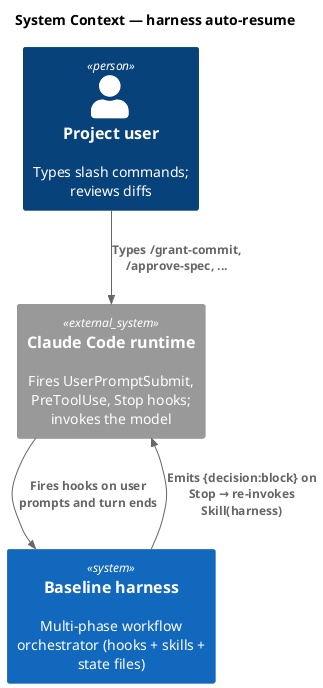

### C4 — Container

Containers inside the harness boundary are the hooks (event-driven scripts), the harness skill (model-invoked SOP), the slash commands (markdown bodies), and the state files (durable + session-scoped). The change is localized to `harness_continuation.sh`.

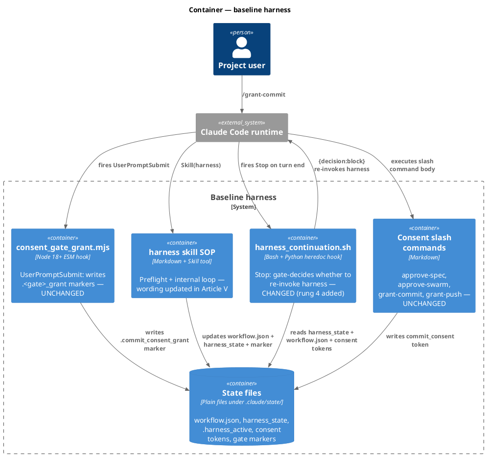

### C4 — Component (harness_continuation.sh internals)

The hook's gate is a chain of rungs. Today (3-rung conjunctive); after the spec (3-rung conjunctive OR rung 4).

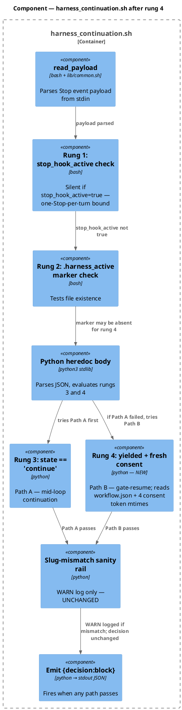

Note on rung 2 in the rung-4 path: the marker is **absent** at consent time (the harness deleted it when it yielded). So the 4-rung gate is structured as:

```
emit iff rung1 AND ((rung2 AND rung3) OR rung4_with_marker_optional)
```

That is: rung 1 (`stop_hook_active` absent) is conjunctive against everything. Path A requires marker AND state=continue. Path B does not require the marker — it derives its signal from fresh consent + state=yielded.

### Data model — class diagram

The "data" here is the set of state files the hook reads. No SQL; the diagram documents file shapes and which the new path adds to its read set.

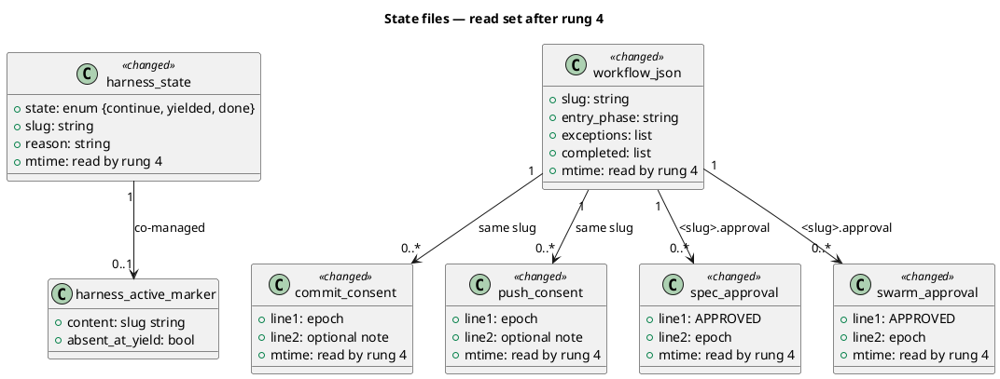

#### Migration DDL

```sql
-- forward: no schema change; rung 4 reads existing state-file shapes.
-- Behavioral migration: extend tests/harness_continuation.test.mjs with rung-4 cases.

-- reverse: revert the Python heredoc body in harness_continuation.sh to the
-- 3-rung gate; revert test additions.
```

### Behavior — sequence per AC

#### §Behavior #1 — Happy path: auto-resume after /grant-commit

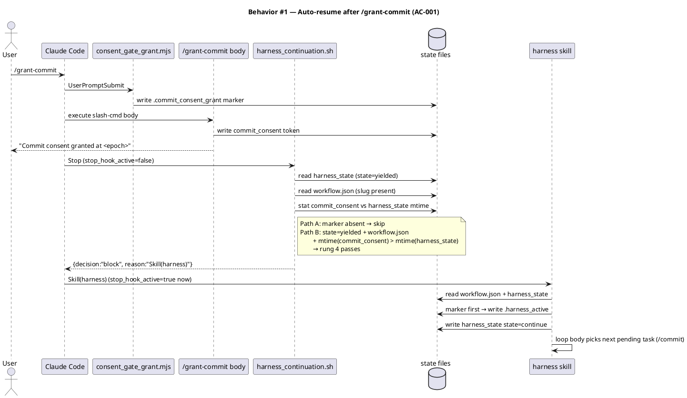

#### §Behavior #2 — Auto-resume after /approve-spec

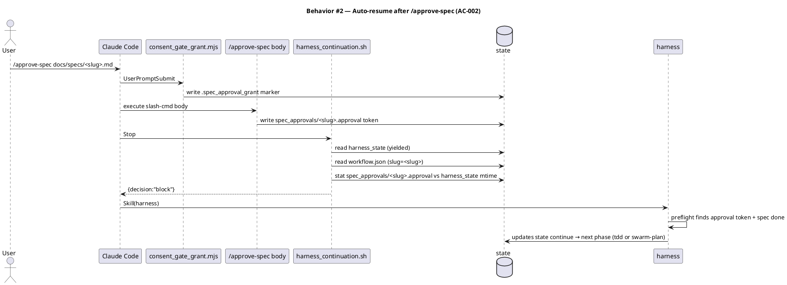

#### §Behavior #3 — Auto-resume after /approve-swarm

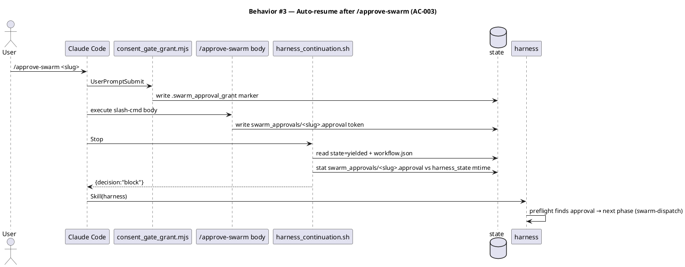

#### §Behavior #4 — /grant-push idempotent no-op

When a workflow is mid-flight and the user runs `/grant-push`, rung 4 fires because `push_consent` is newer than `harness_state`. Harness re-enters preflight, but `push` is not a workflow phase — no task advances. Harness re-yields at the prior gate (or to `done` if the prior gate was the final one).

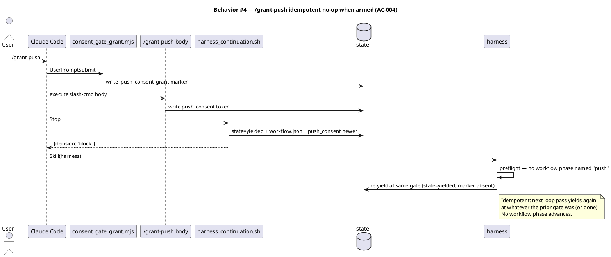

#### §Behavior #5 — Disarmed: consent without workflow.json is a no-op

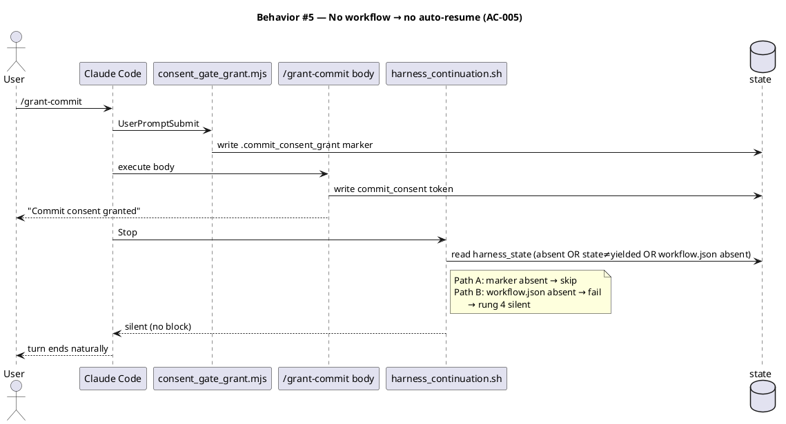

#### §Behavior #6 — Gate-mismatch consent rejected upstream

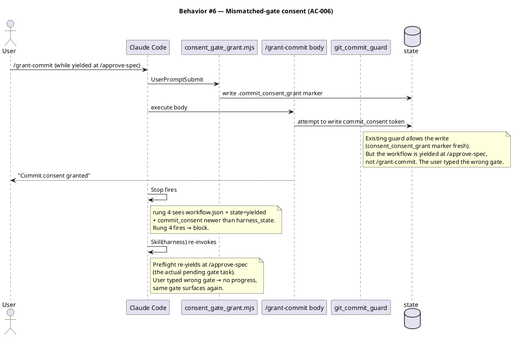

#### §Behavior #7 — Explicit /harness after consent is idempotent

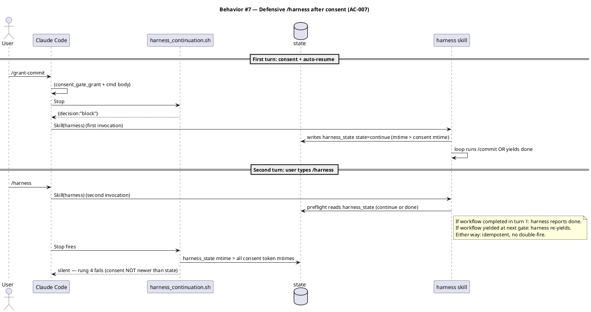

#### §Behavior #8 — Slug-mismatch sanity rail preserved

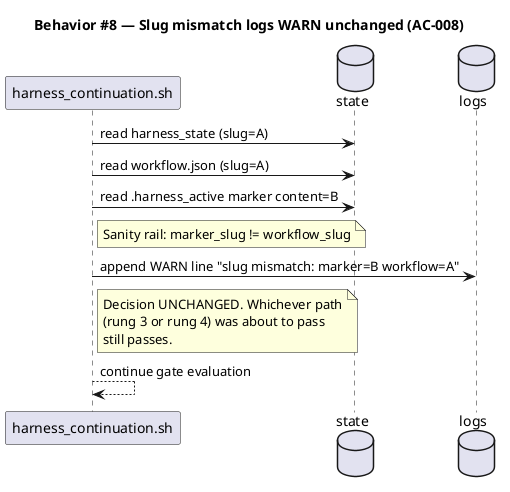

#### §Behavior #9 — Stop hook silent when state=continue+marker (rung 3 untouched)

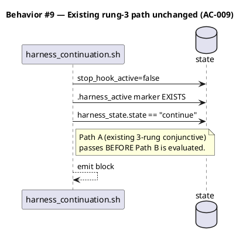

### State — core entity

The harness_state file's `state` field has been documented since the active-marker redesign. Rung 4 reads but does not write this field.

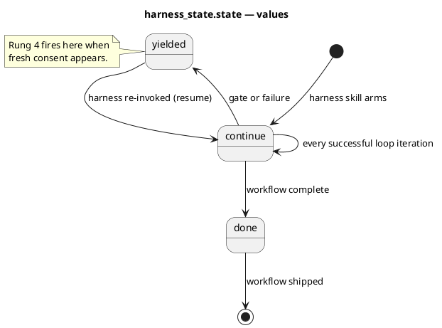

### Dependencies — graph

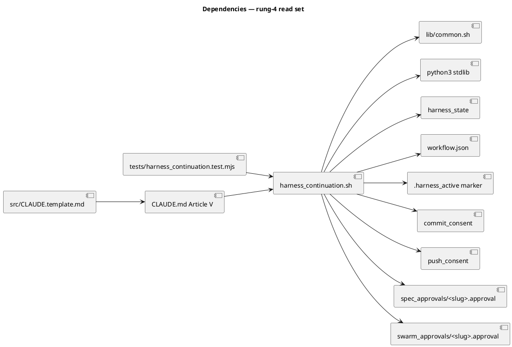

### Contracts

| Kind | Name | Input | Output | Errors | Idempotent |
|---|---|---|---|---|---|
| Hook | `harness_continuation.sh` Stop | JSON payload via stdin (`stop_hook_active`, `session_id`, `transcript_path`, `cwd`) + state files | stdout: empty (silent) OR `{"decision":"block","reason":"…"}` | Silent on any internal error (`exit 0`) | Yes — bounded once per turn by `stop_hook_active` |
| Predicate | rung 4 (NEW) | `harness_state.state=="yielded"` AND `workflow.json` exists AND `slug` readable AND `mtime(any of 4 consent tokens) > mtime(harness_state)` | true → emit block; false → continue to rung-1/2/3 gate | Missing files → false; unreadable JSON → false | Stateless |
| File scan | consent-token mtime check | path set: `{commit_consent, push_consent, spec_approvals/<slug>.approval, swarm_approvals/<slug>.approval}` | bool: any-exists-AND-newer-than-harness_state | Missing path → skip that path | Stateless |

### Libraries and versions

No third-party libraries are added. The change uses only Node.js stdlib (test fixtures: `node:fs`, `node:fs/promises`, `node:child_process`, `node:test`) and Python stdlib (the heredoc body: `json`, `os`, `sys`, `time`).

| Library@version | Purpose | Key APIs | Confirmed via context7 |
|---|---|---|---|
| `node:fs/promises` (Node 18+ stdlib) | Test fixture mtime control | `fs.utimes(path, atime, mtime)` | n/a (stdlib; pinned by `package.json` engines) |
| `node:child_process` (Node 18+ stdlib) | Invoke hook from tests | `spawnSync(cmd, args, opts)` | n/a (stdlib) |
| `python3` stdlib | Hook heredoc body | `json.load`, `os.path.getmtime`, `os.path.exists` | n/a (stdlib) |

### Alternatives considered

| Alt | Summary | Rejected because |
|---|---|---|
| A | Each consent slash command body chains `Skill(harness)` after writing its token | 4 separate insertion points → drift risk; test fixture pattern doesn't exist for slash-command bodies (would require extracting a unit-testable helper); slug-mismatch WARN moves to new helper, fragmenting that safety. Centralization wins. |
| C | `consent_gate_grant.mjs` arms a new `.harness_resume_pending` marker; Stop hook reads it | Strictly dominated by B — same Stop hook still has to fire (it's the only lifecycle event between consent and turn end), so this option adds `consent_gate_grant.mjs` edits AND a new marker file with its own cleanup story without gaining any capability. |

## Design calls

`write_set` does not intersect `project.json → tdd.ui_globs`. No UI surface is touched.

- *(none)*

## Acceptance criteria

| ID | Criterion (given / when / then) | Upstream AC | Sequence |
|---|---|---|---|
| AC-001 | given an armed workflow yielded at /grant-commit, when the user runs `/grant-commit`, then within the same user turn `harness_continuation.sh` emits `{decision:block}` and `Skill(harness)` is invoked, advancing the workflow to `/commit` without a second user prompt | intake AC-3 | §Behavior #1 |
| AC-002 | given an armed workflow yielded at /approve-spec, when the user runs `/approve-spec <path>`, then within the same turn rung 4 fires and the harness advances to `/tdd` (or `/swarm-plan`) | intake AC-1 | §Behavior #2 |
| AC-003 | given an armed workflow yielded at /approve-swarm, when the user runs `/approve-swarm <slug>`, then within the same turn rung 4 fires and the harness advances to `/swarm-dispatch` | intake AC-2 | §Behavior #3 |
| AC-004 | given an armed workflow at any state, when the user runs `/grant-push`, then rung 4 fires and `Skill(harness)` is invoked; harness preflight detects "push" is not a workflow phase and yields again at the same prior gate (idempotent no-op) | intake AC-4 | §Behavior #4 |
| AC-005 | given no `workflow.json` exists, when the user runs any consent slash command, then `harness_continuation.sh` stays silent (rung 4 fails on `workflow.json` absence) and the consent command behaves identically to today | intake AC-4 | §Behavior #5 |
| AC-006 | given an armed workflow yielded at gate X, when the user runs a consent command for gate Y (Y≠X), then rung 4 fires anyway (consent token newer than harness_state); harness preflight detects the mismatch (no Y task is at the head of the pending queue) and re-yields at X | intake AC-5 | §Behavior #6 |
| AC-007 | given the auto-resume mechanism just fired, when the user defensively types `/harness` on the next turn, then no double-fire occurs because `mtime(harness_state) > mtime(consent_token)` after rung 4's first fire — rung 4 stays silent on the second Stop | intake AC-6 | §Behavior #7 |
| AC-008 | given rung 4 fires AND the `.harness_active` marker slug disagrees with `workflow.json → slug`, then a WARN line is logged to `harness_continuation.log` AND the decision is unchanged (block still emitted). The existing sanity rail is unaffected by rung 4 | intake AC-7 | §Behavior #8 |
| AC-009 | given `stop_hook_active=true` on the Stop event, when the hook fires, then it stays silent regardless of rung 4 conditions (the bounded-once-per-turn semantic is preserved) | intake AC-7 | §Behavior #9 |
| AC-010 | given a state where rung 3's path passes (state=continue + marker present), when the hook fires, then it emits block via the existing path BEFORE rung 4 is evaluated (Path A takes precedence; rung 4 is the fallback) | intake AC-7 | §Behavior #9 |
| AC-011 | given the `audit-baseline` script, when it runs after the change, then it passes — count claims unchanged (still 22 hooks, 1 agent, 36 skills, 5 commands), hash drift covers the modified `harness_continuation.sh` after manifest rebuild | intake AC-9 | §Behavior #9 |
| AC-012 | given CLAUDE.md Article V before the change said `"the user runs the consent command, then /harness again"`, when the change ships, then Article V's wording is updated to describe the auto-resume mechanism, AND `src/CLAUDE.template.md` mirrors the same wording (audit checks `src/CLAUDE.template.md: Article X.2 mirrors`) | intake (implied AC) | §Behavior #1 |

## Test plan

| Category | Scenario | Expected | Covers |
|---|---|---|---|
| Golden path | armed workflow, state=yielded, commit_consent mtime newer than harness_state, no marker, no stop_hook_active | `{decision:"block"}` emitted | AC-001 |
| Golden path | armed workflow, state=yielded, spec_approvals/<slug>.approval newer | `{decision:"block"}` emitted | AC-002 |
| Golden path | armed workflow, state=yielded, swarm_approvals/<slug>.approval newer | `{decision:"block"}` emitted | AC-003 |
| Golden path | armed workflow, state=yielded, push_consent newer | `{decision:"block"}` emitted (harness preflight handles the no-op) | AC-004 |
| Input boundary | workflow.json absent + state=yielded + consent fresh | silent | AC-005 |
| Input boundary | workflow.json present + state=continue + marker present (rung 3 path) | `{decision:"block"}` emitted via Path A | AC-010 |
| Input boundary | workflow.json present + state=done + consent fresh | silent (state must be exactly "yielded" for rung 4) | AC-007 |
| Input boundary | all 4 consent token files absent | silent | AC-005 |
| Input boundary | a consent token exists BUT mtime ≤ mtime(harness_state) | silent | AC-007 |
| Contract violation | stop_hook_active=true + all rung-4 conditions otherwise met | silent | AC-009 |
| Contract violation | malformed harness_state JSON | silent | AC-005 |
| Contract violation | workflow.json present but missing `slug` field | rung 4 still passes if any consent token newer (slug is informational for the warn rail) | AC-006 |
| Concurrency / ordering | consent token written, then harness_state rewritten by harness skill, then Stop fires | rung 4 silent (state mtime now > consent mtime) | AC-007 |
| Failure mode | spec_approvals/ directory missing entirely | silent on that path; falls through to other 3 paths | AC-005 |
| Slug mismatch | rung 4 path passes + marker slug != workflow slug | block emitted + WARN logged | AC-008 |
| Regression trap | every existing test in `tests/harness_continuation.test.mjs` (8 cases) | unchanged behavior | AC-010 |
| Regression trap | `bash .claude/skills/audit-baseline/audit.sh` exits 0 after manifest rebuild | PASS | AC-011 |
| Article-V mirror | `src/CLAUDE.template.md` Article V matches `CLAUDE.md` Article V (audit check) | byte-equal mirror | AC-012 |

## Observability

| Signal | Name | Shape | Purpose |
|---|---|---|---|
| Log | `harness_continuation.log` INFO `emit: decision=block (rung 4 passed)` | one line per fire | audit; distinguish rung-3 from rung-4 path |
| Log | `harness_continuation.log` INFO `silent: rung4 no fresh consent` | one line per evaluation | debug "why didn't auto-resume fire?" |
| Log | `harness_continuation.log` WARN `slug mismatch: marker=X workflow=Y` | one line on mismatch | sanity rail — unchanged |
| Log | `harness/<slug>.log` `entered <phase>` / `completed <phase>` | per loop iteration | trace auto-resume's downstream effects |

No metrics or alarms — this is a local-tooling hook, not a production runtime path.

## Rollout

- **Feature flag**: none. The change is mechanically additive (rung 4 is disjunctive with rung-3) and cannot regress existing behavior. A flag would be ceremony without value.
- **Migration order**: 1) extend `harness_continuation.sh` Python body to evaluate rung 4. 2) extend `tests/harness_continuation.test.mjs` with 6+ new cases (one per AC-style scenario). 3) update `CLAUDE.md` Article V. 4) update `src/CLAUDE.template.md` to mirror. 5) regenerate `obj/template/manifest.json` (Article XI hash drift). 6) run `bash .claude/skills/audit-baseline/audit.sh` — must exit 0.
- **Canary**: not applicable (local hook). Validation is the test suite + a manual exercise of one full intake-track workflow with both gates (approve-spec + grant-commit) to confirm auto-resume fires twice.

## Rollback

- **Kill-switch**: revert the Python heredoc body in `.claude/hooks/harness_continuation.sh` to the 3-rung form. Tests + CLAUDE.md Article V + `src/CLAUDE.template.md` revert as a single commit.
- **Signal to roll back**: existing tests in `tests/harness_continuation.test.mjs` regress, OR the audit-baseline script reports drift after the change, OR a user-reported workflow that previously yielded cleanly now misbehaves (double-fire, wrong-gate auto-resume, etc.). Any of these → revert within the next workflow cycle (no automated detection — this is a developer-tools change, not a production SLO).

## Archive plan

When this spec ships, `archive` (Phase 10.5) moves the slug-matched artifacts to `docs/archive/<date>/harness-auto-resume-after-consent-gate/`.

- Defaults *(automatic)*: intake, scout, research, spec, spec approval token, security report.
- Extras *(non-default)*:
  - *(none)*

## Open questions

All six research-stage OQs are resolved by this spec:

- **OQ-1 (resolved)**: rung 4 scans exactly four canonical paths — `commit_consent`, `push_consent`, `spec_approvals/<workflow_slug>.approval`, `swarm_approvals/<workflow_slug>.approval`. PASS if ANY exists AND its mtime > mtime(harness_state). Workflow slug is read from `workflow.json → slug`.
- **OQ-2 (resolved)**: `/grant-push` participates. Rung 4 scans `push_consent`. Harness preflight handles the "push is not a workflow phase" case as an idempotent no-op (re-yields at the prior gate). See §Behavior #4.
- **OQ-3 (resolved)**: Ship rung 4 inline in the existing bash+python heredoc form. The JS migration (`migrate-bash-python-heredocs-to-javascript-d454`) is a separate workflow; bundling here would scope-creep both.
- **OQ-4 (resolved)**: Article V wording. Replace the existing "Resume after a `needs_user` yield" paragraph with: *"After yielding at a consent gate, the harness skill writes `state: yielded` and removes `.harness_active`. The user runs the consent slash command in their next prompt; `consent_gate_grant.mjs` writes the gate marker (outside Claude's tool boundary), the command body writes the consent token, and the `harness_continuation` Stop hook detects fresh consent (rung 4: workflow.json present + state=yielded + a consent-token mtime newer than harness_state). The hook emits `{decision:"block"}`, and `Skill(harness)` is re-invoked in the same turn. The user does not type `/harness` to resume."*
- **OQ-5 (resolved)**: Idempotency under explicit `/harness` is guaranteed by mtime arithmetic: after rung-4's first fire, the harness writes `harness_state` (mtime now > consent token mtime), so rung 4 fails on the next Stop. Codified as AC-007 + §Behavior #7.
- **OQ-6 (resolved)**: Test fixtures use `fs.utimes(path, atime, mtime)` explicitly with crafted second-resolution timestamps to avoid relying on natural creation order. The existing test infrastructure (`spawnSync` against the hook from a tmp dir) accommodates this without changes.
