# memory-flush as workflow Phase 10.6 — end-of-workflow memory curation

<!--
Technical spec. Produced by the `spec` skill.

Guard-enforced invariants:
  - Required ## headings (artifact_template_guard):
        Goal, Design, Acceptance criteria, Test plan.
  - Required diagram kinds inside ```plantuml``` fences
    (spec_diagram_presence_guard, configured in project.json →
     artifacts.required_diagrams.spec):
        c4_context, c4_container, c4_component,
        sequence, class, dependency_graph.
  - Every ```plantuml``` fence must parse (plantuml_syntax_guard).

Approval: NEVER add "Status: Approved" — spec_approval_guard blocks it.
Approval is a token written by /approve-spec.
-->

## Context

| Input | Path |
|---|---|
| Intake | `docs/intake/memory-flush-phase.md` |
| BRD *(if any)* | — |
| Scout | `docs/scout/memory-flush-phase.md` |
| Research | `docs/research/memory-flush-phase.md` |

## Goal

The harness loop runs `/memory-flush` as Phase 10.6 between `/archive` (Phase 10.5) and `/grant-commit` (Phase 11) on every workflow track (intake / spec / tdd / chore), so pending memory candidates accumulated during the workflow are triaged with full conversation context, canonical memory writes ship in the same commit as the work that motivated them, and the working tree is pristine at end-of-task.

## Non-goals

- Re-tuning the `memory_stop.sh` candidate-extraction signal threshold. Noise-floor work is a separate follow-up.
- Changing the `_pending.md` storage format or its `.gitignore` exclusion.
- Adding Phase 10.6 to `/rca` (out-of-band postmortem). `/rca` does not accumulate workflow-scoped pending state.
- Modifying `/memory-flush` Step 0–6 internal contract. The skill's curation logic stays; only its invocation context (now a workflow phase) and an empty-pending fast-path are added.
- Replacing the SessionStart hook's `MEMORY.md` index injection. The index table stays; only the "K candidates pending" prose nag changes.
- Introducing a new consent gate, new hook, new subagent, or new top-level workflow phase. The "11-phase" headline survives; 10.6 is a sub-phase like 10.5.

## Design

Diagrams are the contract. Prose is only for things a diagram cannot say.

### C4 — System context

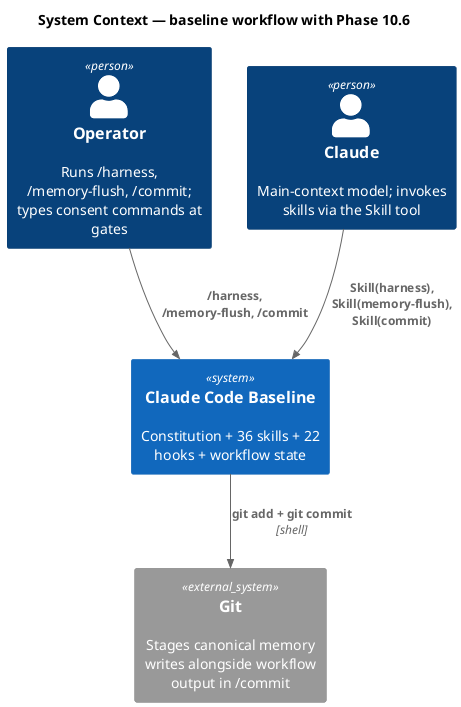

### C4 — Container

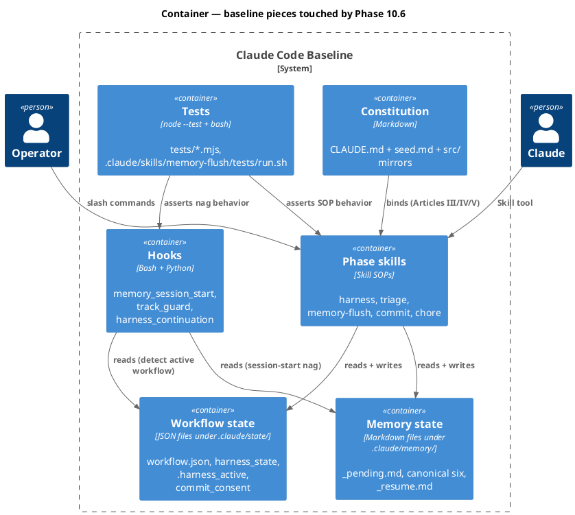

### C4 — Component (changed containers only)

#### Component view: phase skills

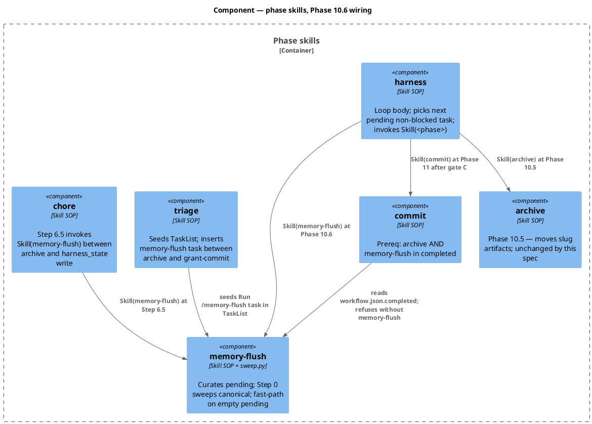

#### Component view: memory-flush internals

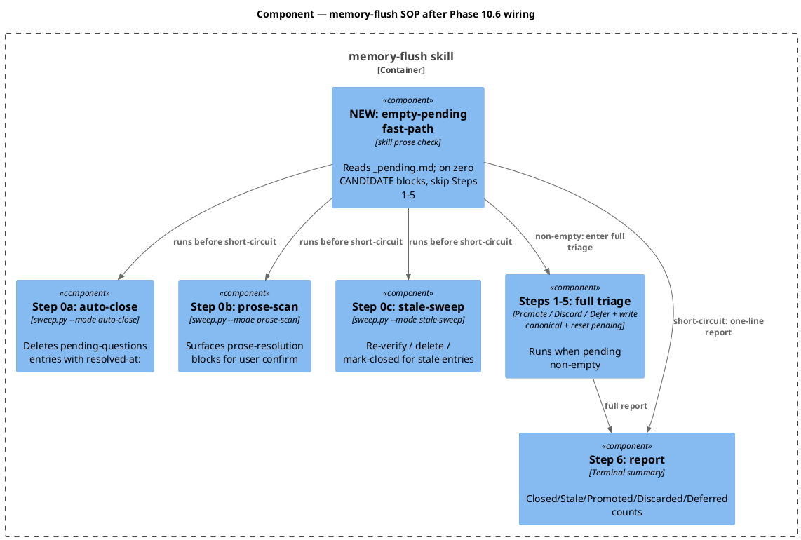

### Data model — class diagram

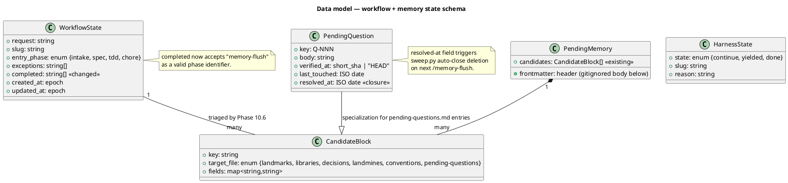

#### Migration DDL

```sql
-- forward (conceptual — no SQL schema; the "DDL" is data-shape changes in markdown files)

-- workflow.json's `completed` array gains "memory-flush" as a valid value.
-- No schema validator exists; consumers (harness, commit, chore) treat the array
-- as free-form append-only.

-- pending-questions.md Q-001 gains a `- resolved-at: 2026-05-17` line in its body.
-- This is data, not schema. The schema for the resolved-at field was added by
-- the memory-lifecycle-closure spec (2026-05-13, archived).

-- reverse
-- Drop "memory-flush" string from any workflow.json `completed` arrays via git
-- revert of this workflow's commit.
-- Remove the `- resolved-at: 2026-05-17` line from Q-001 via the same revert.
```

### Behavior — sequence per AC

#### §Behavior #1 — harness chains through Phase 10.6 (AC-001)

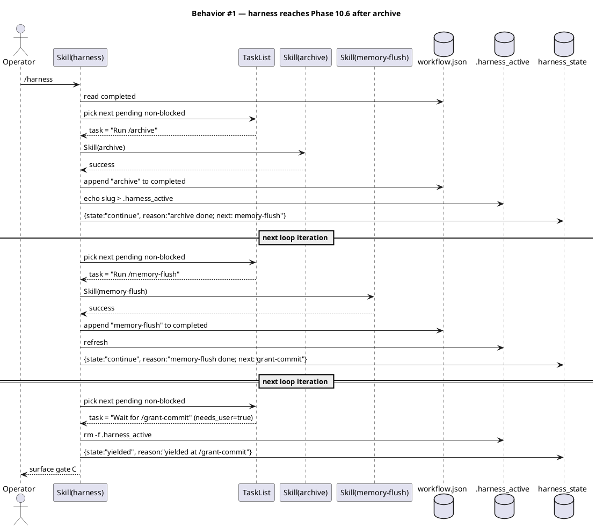

#### §Behavior #2 — idempotent no-op on empty pending (AC-002)

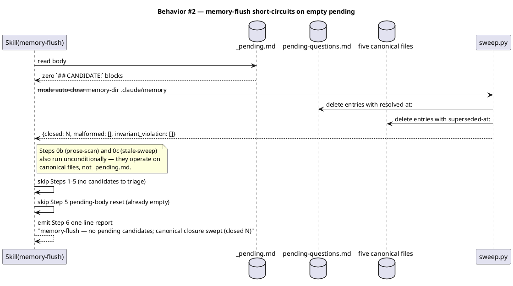

#### §Behavior #3 — full triage on populated pending; Q-001 auto-closes (AC-003, AC-013)

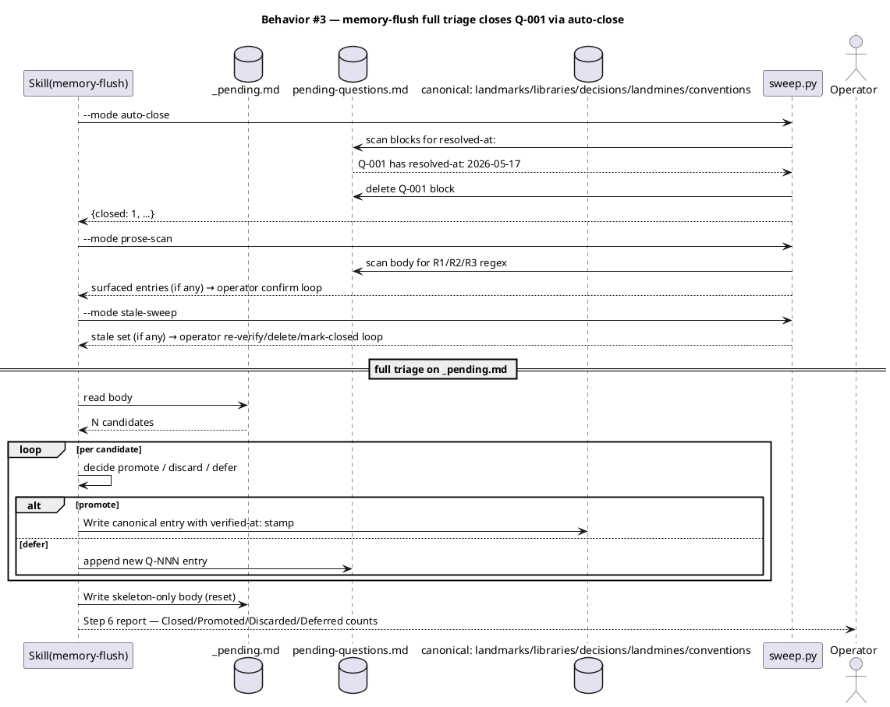

#### §Behavior #4 — co-located commit + pristine tree (AC-004, AC-005)

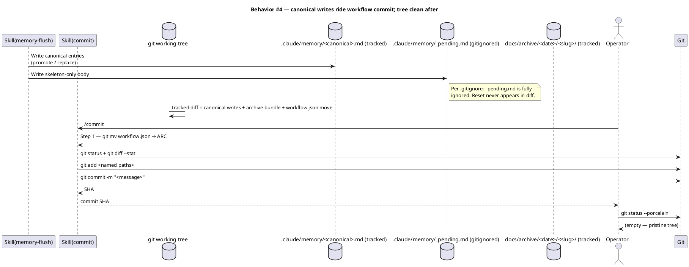

#### §Behavior #5 — triage seeding inserts Phase 10.6 task (AC-006)

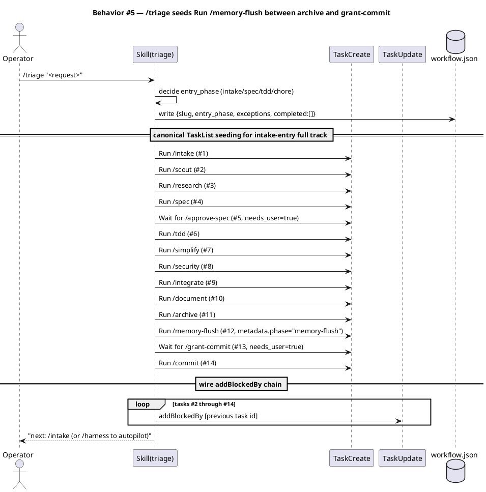

#### §Behavior #6 — SessionStart nag decision tree (AC-007, AC-008, AC-009)

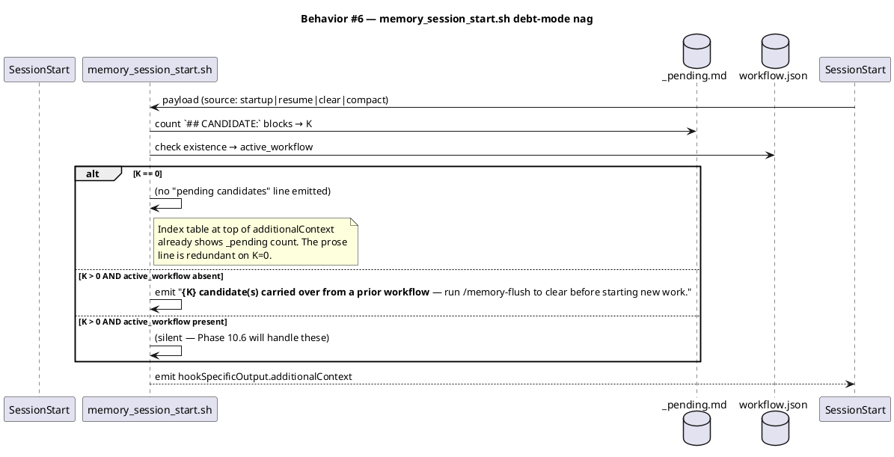

#### §Behavior #7 — commit prereq gate (AC-011)

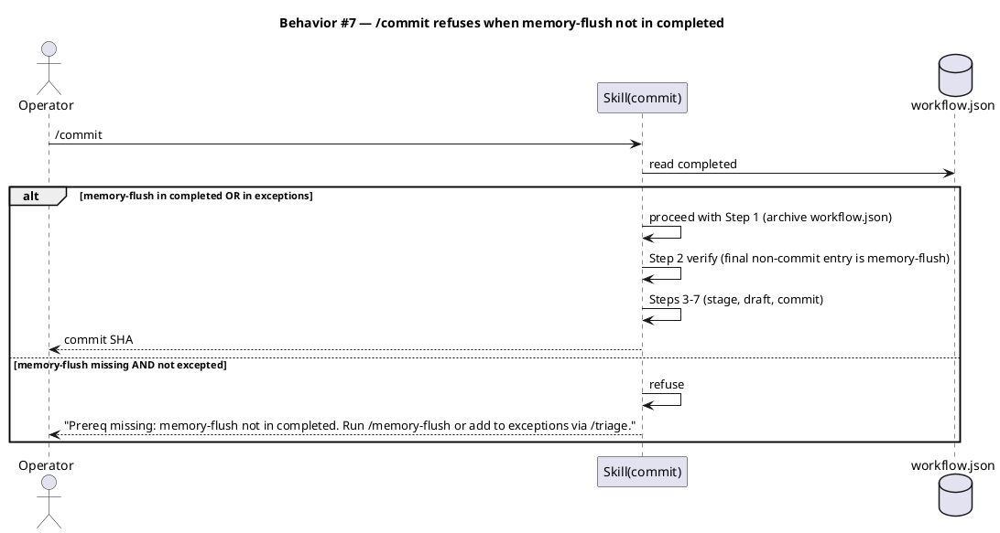

### State — _pending.md lifecycle

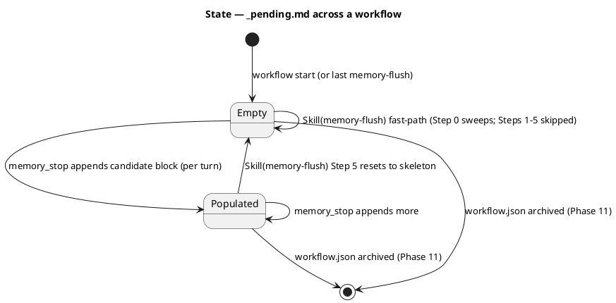

### Dependencies — graph

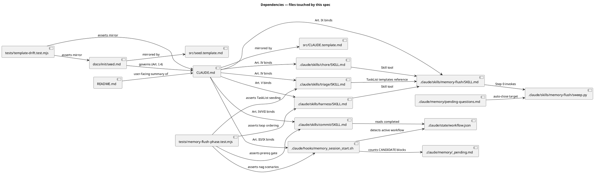

### Contracts

| Kind | Name | Input | Output | Errors | Idempotent |
|---|---|---|---|---|---|
| Skill | `Skill(memory-flush)` invoked as Phase 10.6 | none (skill reads `_pending.md`, canonical six, `workflow.json`) | success (after Step 0 sweep + optional Steps 1–5 + Step 6 report) | size-cap exceeded on canonical write → fail; canonical-file write IO error → fail | yes (running twice in a row produces the same end state) |
| Hook | `memory_session_start.sh` SessionStart | hook payload `.source` ∈ {startup, resume, clear, compact} | stdout JSON `{hookSpecificOutput: {hookEventName, additionalContext}}` | malformed memory files → silent (advisory only) | yes (read-only side effect of marker cleanup which is itself idempotent) |
| Skill | `Skill(commit)` (changed prereq) | `workflow.json` with `archive` AND `memory-flush` in `completed` (or in `exceptions`); `commit_consent` token fresh | commit SHA + appends `"commit"` to `completed` (moot — workflow.json archived in Step 1) | missing prereq → refusal with named gap | yes per workflow (once `commit` runs, workflow.json is gone) |
| Skill | `Skill(chore)` (changed Step 6.5) | `workflow.json` with `entry_phase: "chore"` | appends `"chore"`, `"archive"`, `"memory-flush"`, and any conditional phases to `completed` | per-step failure surfaces as harness_state yielded | no — chore is single-pass per workflow |
| Skill | `Skill(triage)` (changed TaskList templates) | request string | `workflow.json` + 14-task TaskList chain (for intake-entry, git-project, all phases) with `Run /memory-flush` between archive and grant-commit | malformed request → ask user to clarify | yes (re-run replaces or appends per existing rules) |

### Libraries and versions

No third-party libraries are introduced by this spec. The change is internal to the baseline (markdown SOPs + bash hook + mjs tests).

| Library@version | Purpose | Key APIs | Confirmed via context7 |
|---|---|---|---|
| — | — | — | n/a (no library APIs in scope) |

### Alternatives considered

| Alt | Summary | Rejected because |
|---|---|---|
| A | Phase 10.4 (between document and archive) — slug artifacts still at original paths | Reorders the archive-is-last convention; gains no co-located commit benefit (canonical writes don't go in the archive bundle anyway); recovery from mid-curation failure leaves a dirty `docs/<phase>/` tree |
| B | Phase 11a (after /commit) — memory writes in a separate follow-up commit | Breaks "co-located commit" property; introduces memory-debt tail; a workflow that crashes after /commit but before 11a leaves canonical drift |
| C | Chore-track conditional memory-flush (only when diff touches certain paths) | Multiplies chore's decision graph (already has 3 conditional phases); silent-skip bug surface; asymmetric with TDD/spec tracks |
| D | Harness-side empty-pending detection (skip Skill invocation) | Splits responsibility; ad-hoc `/memory-flush` invocation needs its own check anyway; Step 0 canonical sweep silently skipped (regresses memory-lifecycle-closure auto-close) |
| E | New `/q-close <Q-NNN>` slash command for inline closure | YAGNI — single-use case right now; adds command count + audit surface |
| F | Use `.harness_active` marker as active-workflow signal in the hook | Session-local; misses "user started workflow via /intake directly, never ran /harness"; inconsistent with how triage/harness/track_guard think about active workflow |

## Design calls

No UI surfaces in this spec's write_set. Verified against `project.json → tdd.ui_globs`:

- `site-src/**` — not touched.
- `app/**/*.{tsx,jsx}` — not touched.
- `components/**/*.{tsx,jsx,vue,svelte}` — not touched.
- `pages/**/*.{tsx,jsx,vue,svelte}` — not touched.
- `src/**/*.{tsx,jsx,vue,svelte}` — not touched.
- `**/*.html`, `**/*.css`, `**/*.scss`, `**/*.njk` — not touched.

Write_set: markdown (CLAUDE.md, src/CLAUDE.template.md, seed.md, src/seed.template.md, skill SOPs, intake/scout/research/spec, pending-questions.md, README.md), bash (memory_session_start.sh), and JavaScript test files (tests/*.mjs, .claude/skills/memory-flush/tests/run.sh). None of these match ui_globs.

- *(none)*

## Acceptance criteria

| ID | Criterion (given / when / then) | Upstream AC | Sequence |
|---|---|---|---|
| AC-001 | Given a workflow with `entry_phase=intake` (or any non-excepted entry) on a git project, when the harness loop completes `/archive`, the next pending TaskList task is `Run /memory-flush for <slug>` (blockedBy archive, blocking grant-commit) and `Skill(harness)` invokes `Skill(memory-flush)` before yielding at the grant-commit gate. | intake AC-1 | §Behavior #1 |
| AC-002 | Given a workflow where `_pending.md` body has zero `## CANDIDATE:` blocks at Phase 10.6, when `Skill(memory-flush)` is invoked, it completes with success in ≤ 3 tool-call equivalents (read pending; invoke sweep.py auto-close+prose-scan+stale-sweep; emit one-line Step 6 report), surfaces no per-candidate prompts, and `workflow.json → completed` gains `"memory-flush"`. | intake AC-2 | §Behavior #2 |
| AC-003 | Given a workflow where `_pending.md` body has N≥1 candidates at Phase 10.6, when `Skill(memory-flush)` is invoked, it executes Step 0 (auto-close + prose-scan + stale-sweep), Steps 1–5 (read canonical, decide per candidate, verify, write, reset), and Step 6 (report). At end, `_pending.md` body matches the skeleton-only shape (zero `## CANDIDATE:` blocks). | intake AC-3 | §Behavior #3 |
| AC-004 | Given a workflow that completes through `/commit`, when `git show --name-only HEAD` is run immediately after, any `.claude/memory/<canonical>.md` files modified by Phase 10.6 appear in the same commit as the workflow's primary changes. `_pending.md` body content does NOT appear in the diff (gitignored). | intake AC-4 | §Behavior #4 |
| AC-005 | Given a workflow that completes through `/commit`, when `git status --porcelain` is run immediately after, the output is empty. | intake AC-5 | §Behavior #4 |
| AC-006 | Given `/triage` for any new workflow with `entry_phase ∈ {intake, spec, tdd}` on a git project, when the TaskList is seeded, exactly one task with `metadata.phase == "memory-flush"` exists in the chain, `addBlockedBy` the `/archive` task and `addBlocks` the `Wait for /grant-commit` task. For `entry_phase == chore`, the task lives between the chore task and the grant-commit wait. | intake AC-6 | §Behavior #5 |
| AC-007 | Given a session start where `_pending.md` body has K≥1 candidates AND `.claude/state/workflow.json` is absent, when `memory_session_start.sh` fires, the emitted `additionalContext` includes a line of the form `**{K} candidate(s) carried over from a prior workflow** — run \`/memory-flush\` to clear before starting new work.` | intake AC-7 | §Behavior #6 |
| AC-008 | Given a session start where `_pending.md` body has zero candidates, when `memory_session_start.sh` fires, no "pending candidates" prose line appears in `additionalContext`. The index table at the top still shows the zero count. | intake AC-8 | §Behavior #6 |
| AC-009 | Given a session start where `_pending.md` body has K≥1 candidates AND `workflow.json` exists, when `memory_session_start.sh` fires, no "pending candidates" prose line appears in `additionalContext`. | intake AC-9 | §Behavior #6 |
| AC-010 | Given the post-change tree, when CLAUDE.md, `src/CLAUDE.template.md`, `docs/init/seed.md`, `src/seed.template.md`, `.claude/skills/harness/SKILL.md`, and `.claude/skills/triage/SKILL.md` are scanned for phase-ordering enumerations, every enumeration names `memory-flush` as Phase 10.6 between `archive` (10.5) and `commit` (11). | intake AC-10 | covered by `tests/template-drift.test.mjs` + AC-001 sequence |
| AC-011 | Given `Skill(commit)`, when invoked with `workflow.json → completed` containing `archive` but NOT `memory-flush` (and `memory-flush` not in `exceptions`), it refuses with an error naming the missing prereq. When `memory-flush` is in `completed`, it proceeds. | intake AC-11 | §Behavior #7 |
| AC-012 | Given the post-change tree, when `bash .claude/skills/audit-baseline/audit.sh` is run, exit status is 0 (PASS) with no new FAIL lines introduced relative to pre-change baseline. | intake AC-12 | covered by audit run during `/integrate` |
| AC-013 | Given the post-change tree, when `.claude/memory/pending-questions.md` is read, Q-001 is either absent (deleted by auto-close after Phase 10.6) or carries a `Resolution:` line referencing `docs/specs/memory-flush-phase.md`. | intake AC-13 | §Behavior #3 |

## Test plan

Binding test: `bash .claude/skills/audit-baseline/audit.sh` (per `project.json → test.cmd`). The audit verifies structural invariants (counts, names, hooks wired, mirrors present, citations present). Additional fixture-based tests under `tests/memory-flush-phase.test.mjs` exercise the behavioral ACs via `node --test`. The audit's PASS verdict stamps `last_test_result`; the .mjs tests run in CI via `npm test` and as part of the integrate phase.

| Category | Scenario | Expected | Covers |
|---|---|---|---|
| Golden path | Workflow runs `/triage` → `/harness`; reaches Phase 10.6 after archive; runs memory-flush; yields at grant-commit | TaskList chain has `Run /memory-flush` between archive and grant-commit; `workflow.json → completed` includes `"memory-flush"` before `commit` | AC-001, AC-006 |
| Golden path | `Skill(memory-flush)` invoked with `_pending.md` body empty | Returns success; `_pending.md` body unchanged (already empty); `workflow.json → completed` gains `"memory-flush"`; Step 6 one-line report emitted | AC-002 |
| Golden path | `Skill(memory-flush)` invoked with 3 candidate blocks in `_pending.md` | All 3 candidates decided (promote / discard / defer); `_pending.md` body reset to skeleton; canonical writes carry `verified-at:` stamp; Q-001 with `resolved-at:` deleted | AC-003, AC-013 |
| Golden path | Workflow completes through `/commit` | `git show --name-only HEAD` includes canonical memory file changes; `_pending.md` not in diff; `git status --porcelain` is empty | AC-004, AC-005 |
| Input boundary | SessionStart with K=0 candidates, no workflow.json | No "pending candidates" line in `additionalContext` | AC-008 |
| Input boundary | SessionStart with K=5 candidates, workflow.json absent | Line: `**5 candidates carried over from a prior workflow** — run \`/memory-flush\` to clear before starting new work.` | AC-007 |
| Input boundary | SessionStart with K=5 candidates, workflow.json present | No "pending candidates" line in `additionalContext` (silent) | AC-009 |
| Contract violation | `Skill(commit)` invoked with `archive` in completed but `memory-flush` absent and not excepted | Refusal with named missing prereq; no commit produced | AC-011 |
| Contract violation | `Skill(memory-flush)` Step 4 attempts to grow a canonical file past `size-cap: 500` | Skill prunes oldest unverified entries in same write OR fails the phase (per current SKILL.md constraint) | preserves existing AC from memory-flush SKILL.md |
| Concurrency / ordering | Memory-flush attempts to run before archive (e.g., bad TaskList seeding) | TaskList's `addBlockedBy` chain prevents this; harness picks lowest-id non-blocked, archive runs first | AC-001 |
| Failure mode | Canonical file write IO error during Step 4 | Phase yields with `harness_state.state: "yielded"`, `reason: "memory-flush failed: <one-line>"`; workflow.json `completed` NOT updated | preserves existing harness failure pattern |
| Regression trap | Constitution + mirror byte-equivalence after edits | `tests/template-drift.test.mjs` passes | AC-010 |
| Regression trap | `audit-baseline` exit 0 after the change | Audit reports zero FAILs | AC-012 |
| Regression trap | Phase ordering arrow chains in CLAUDE.md / harness/SKILL.md / triage/SKILL.md / README.md / seed.md mention `memory-flush` between archive and commit | grep-based assertion in `tests/memory-flush-phase.test.mjs` | AC-010 |

## Observability

The baseline has no runtime metric/log/alarm machinery; phase outcomes surface via on-disk state and the additional-context emitted at SessionStart. The "observability" entries here are the on-disk artifacts that prove correct execution.

| Signal | Name | Shape | Purpose |
|---|---|---|---|
| Log | `.claude/state/harness/<slug>.log` | `<ISO ts> entered memory-flush` / `<ISO ts> completed memory-flush` | proves Phase 10.6 fired in the loop |
| File-mutation | `.claude/state/workflow.json → completed` | array gains `"memory-flush"` | proves harness recorded the phase |
| File-mutation | `.claude/memory/_pending.md` body | shrinks to skeleton after Phase 10.6 | proves curation ran |
| Hook output | `memory_session_start.sh` additionalContext | absence or presence of debt-mode nag line | proves the three-scenario decision tree (AC-007, AC-008, AC-009) |

## Rollout

- **Feature flag**: none. Constitutional + skill-SOP changes apply atomically once the workflow's `/commit` lands.
- **Migration order**: 1. constitution edits (CLAUDE.md, seed.md, mirrors) → 2. skill SOP edits (harness, triage, memory-flush, commit, chore) → 3. hook edit (memory_session_start.sh) → 4. pending-questions.md Q-001 `resolved-at:` field → 5. new test file (tests/memory-flush-phase.test.mjs) → 6. existing test file append (.claude/skills/memory-flush/tests/run.sh) → 7. README.md line 67 update → 8. run audit + tests → PASS → 9. `/integrate` re-stamps `last_test_result` → 10. `/document` updates any user-facing docs → 11. `/archive` → 12. `/memory-flush` (Phase 10.6 self-demonstration; closes Q-001 via auto-close) → 13. `/grant-commit` → 14. `/commit`.
- **Canary**: n/a — single-operator project. The next `/triage` + `/harness` run after commit is the canary; if any phase chain misbehaves, the workflow's own logs surface it.

## Rollback

- **Kill-switch**: `git revert <commit-sha>` of this workflow's commit. Restores CLAUDE.md / seed.md / mirrors / skill SOPs / hook / Q-001 / tests / README to the pre-change state in one operation.
- **Signal to roll back**: any of (a) `tests/template-drift.test.mjs` fails on a fresh clone after the commit lands, (b) `bash .claude/skills/audit-baseline/audit.sh` exits non-zero on a fresh clone, (c) the first post-commit workflow's `/harness` loop refuses to invoke memory-flush despite the task being seeded, (d) the SessionStart hook emits the legacy "before any workflow phase work" wording instead of the debt-mode wording. Manual detection in all cases (single-operator project); no automated rollback signal. Detection window: within the operator's next `/harness` invocation, typically minutes.

## Archive plan

When this spec ships, the `archive` skill (Phase 10.5) moves the following into `docs/archive/<ship-date>/memory-flush-phase/`.

- Defaults *(automatic)*: `docs/intake/memory-flush-phase.md`, `docs/scout/memory-flush-phase.md`, `docs/research/memory-flush-phase.md`, `docs/specs/memory-flush-phase.md`, the rendered diagrams under `docs/specs/memory-flush-phase.rendered/` (if generated), `.claude/state/spec_approvals/memory-flush-phase.approval`. No swarm plan / approval (solo TDD route). No security report (security phase will run; output goes to `docs/security/memory-flush-phase-<date>.md`).
- Extras *(list any non-default files)*:
  - *(none)*

## Open questions

- None blocking approval. The research memo locked all six structural axes; the spec's three "open questions" from research are answered in this spec:
  - Test framework: `node --test` per existing `tests/*.test.mjs` pattern; no new harness.
  - Audit-baseline assertion shape: out of scope; audit count claims aren't affected, and a "memory-flush in harness/triage/chore phase chains" check would duplicate `tests/memory-flush-phase.test.mjs` AC-010 regression trap.
  - Recovery from Phase 10.6 failure: yields like any other non-integrate phase failure — `harness_state.state: "yielded"`, `reason: "memory-flush failed: <one-line summary>"`; operator investigates; re-run resumes from the failed task.
