# Spec — Close three loops in the workflow rails

## Context

| Input | Path |
|---|---|
| Intake | `docs/intake/workflow-loop-closing-hygiene.md` |
| Scout | `docs/scout/workflow-loop-closing-hygiene.md` |
| Research | `docs/research/workflow-loop-closing-hygiene.md` |

## Goal

After this spec ships, three loops close automatically: (1) the `ac008` test fixture regenerates via a committed helper script with HEAD normalized to the `n/a` sentinel; (2) `/tdd`'s worker chain gains a `drift-check-tick` that cross-checks every approved-spec AC against the implementation diff, stopping the workflow with `state: yielded` on `≥ 1 unresolved` items; (3) `/commit` invokes a new `sweep.py --mode stamp-closure` after `git commit` succeeds, which writes `status: picked-up` + `superseded-at: <today>` to each backlog entry named in `workflow.json → source_backlog_keys` — same workflow, no lag.

The three recommendations from the research memo (1A, 2C, 3B + HEAD option (i)) are baked into this spec. Reviewers SHOULD spot-and-override any pick at `/approve-spec` by editing this spec before granting approval.

## Non-goals

- **Not regenerating other stale fixtures** across the repo. Only `ac008_byte_equal_reference.txt` is in scope.
- **Not building a generalized drift detection framework.** Drift covers exactly two artifact shapes: numbered ACs in the spec's acceptance-criteria table, and rows in the spec's design-calls table. C4 components, dependency-graph nodes, class-diagram entities — out of scope.
- **Not adding a new workflow phase.** Drift is a worker step inside `/tdd`'s seeded chain (recommendation 1A), not a `/drift` phase between `/tdd` and `/simplify`. `project.json → workflow.phases` is unchanged.
- **Not auto-looping the drift analysis.** Unlike `/integrate`'s 3-retry auto-loop on mechanical bugs, drift failures stop-and-surface. Drift signals scope drift or missed AC — both warrant human review, not auto-retry.
- **Not extending `/triage`'s natural-language parsing** to detect free-form `Source: backlog entry <key>` lines. The contract is the structured `source_backlog_keys: []` array in `workflow.json`.
- **Not retroactively migrating existing backlog entries.** Only entries named in `workflow.json → source_backlog_keys` from this workflow onward are stamped.
- **Not touching any UI surface.** `write_set` does not intersect `project.json → tdd.ui_globs`; the `## Design calls` section body is `*(none)*` by design.
- **Not bundling the open `migrate-bash-python-heredocs-to-javascript-d454` JS port.** sweep.py and the regen helper script remain bash + python in this workflow; the migration is its own follow-on workflow.

## Design

Diagrams are the contract. Prose appears only when a diagram cannot say the thing.

**Architectural picks (baked in from research; overridable at `/approve-spec`):**

- **Goal 1 (fixture regen)** — recommendation **3B**: committed helper script at `.claude/hooks/tests/fixtures/regenerate-ac008.sh`. **HEAD option (i)**: the fixture's first non-header line is `HEAD: \`n/a\``; the test extraction layer normalizes the captured HEAD to `n/a` before comparison.
- **Goal 2 (drift analysis placement)** — recommendation **1A**: extend `/tdd`'s seeded worker chain with one new `drift-check-tick` task between the last `design-ui-tick` (or `verify-tick` if no design rows) and `tdd-finalize`. The check is inlined by the harness via a python helper at `.claude/skills/tdd/drift_check.py`; no new SKILL.md, no `workflow.phases` edit, no `triage` template edit.
- **Goal 3 (backlog auto-flip surface)** — recommendation **2C**: extend `sweep.py` with `--mode stamp-closure --backlog-keys k1,k2,...`. `/commit` invokes the new mode after `git commit` succeeds and before workflow exit. Closure is visible in the same workflow's commit; the next `/memory-flush` Step 0a auto-deletes the stamped entries per the existing closure-trigger contract.

### C4 — System context

Who interacts with the system, and which external systems it depends on.

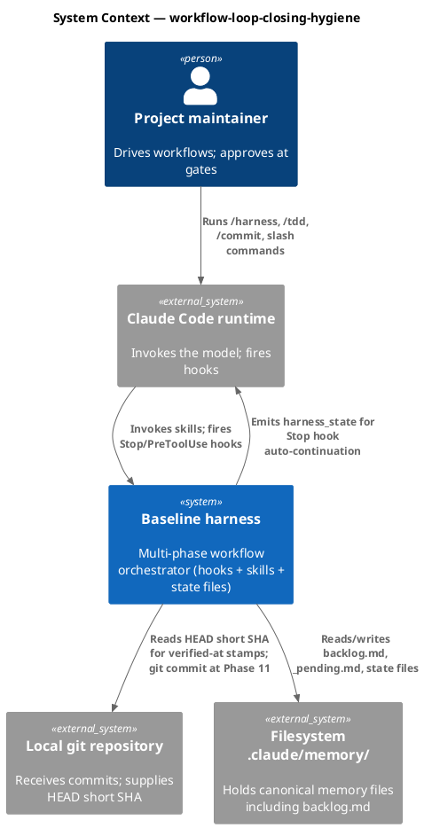

### C4 — Container

Containers inside the harness boundary that change in this spec. Unchanged containers are omitted.

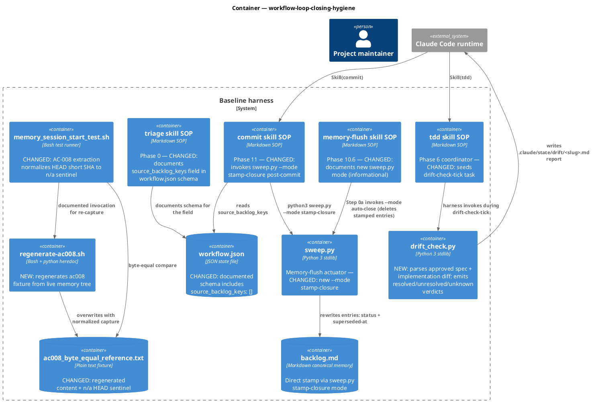

### C4 — Component (changed containers only)

#### Component — tdd worker chain (after drift-check-tick added)

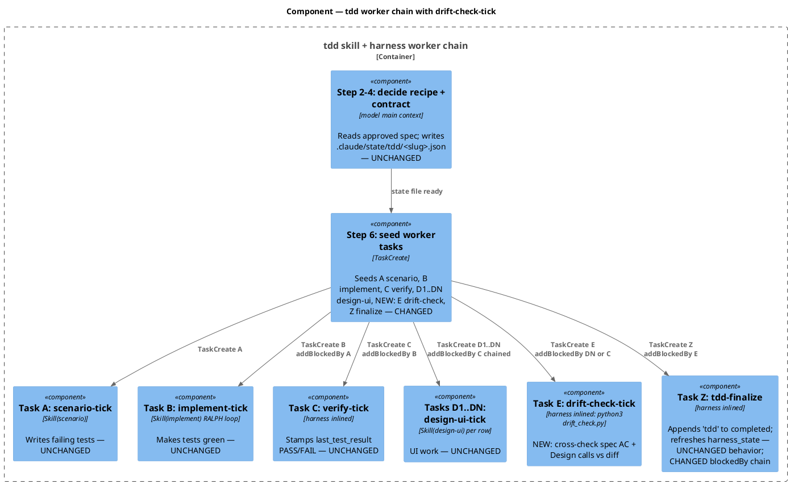

#### Component — sweep.py with stamp-closure mode

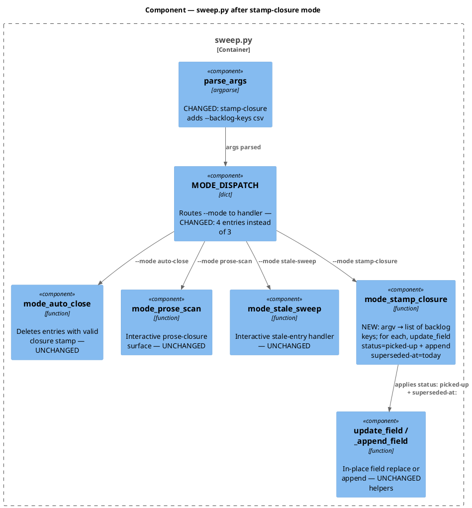

### Data model — class diagram

The "data" here is the shape of state files and memory entries this spec touches. No SQL schema (no database); the class diagram documents structured file shapes and which fields are new/changed.

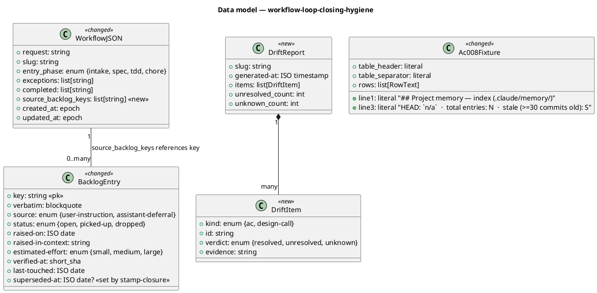

#### Migration DDL

No SQL. The schema additions are JSON-shape additions to `workflow.json` and a new key in `sweep.py`'s `MODE_DISPATCH` dict. Forward and reverse migrations are git-only:

```
-- forward
1. Add `source_backlog_keys: []` documentation to triage/SKILL.md and the workflow.json template comment block.
2. Add `mode_stamp_closure` function + `--backlog-keys` arg to sweep.py.
3. Add `drift_check.py` helper to .claude/skills/tdd/.
4. Update .claude/skills/tdd/SKILL.md Step 6 to seed Task E (drift-check-tick) before Task Z.
5. Update .claude/skills/commit/SKILL.md to invoke sweep.py --mode stamp-closure after git commit succeeds (Step 6 new).
6. Regenerate ac008_byte_equal_reference.txt via the new helper script; commit alongside the script.
7. Update memory_session_start_test.sh AC-008 extraction to normalize HEAD short SHA to "n/a" sentinel.
8. Regenerate obj/template/manifest.json with new hashes.

-- reverse
1. Revert each of the above changes in reverse order. The new files (drift_check.py, regenerate-ac008.sh) are deleted; the modified files revert to prior commits.
2. backlog.md entries stamped by stamp-closure stay stamped — they're harmless and the next /memory-flush sweep cleans them.
3. workflow.json with source_backlog_keys field stays valid — readers that don't know the field simply ignore it.
```

### Behavior — sequence per AC group

One sequence diagram per behaviorally distinct AC group. Section anchors here (`§Behavior #N`) are referenced from the AC table.

#### §Behavior #1 — Goal 1: fixture regen via helper script (AC-001)

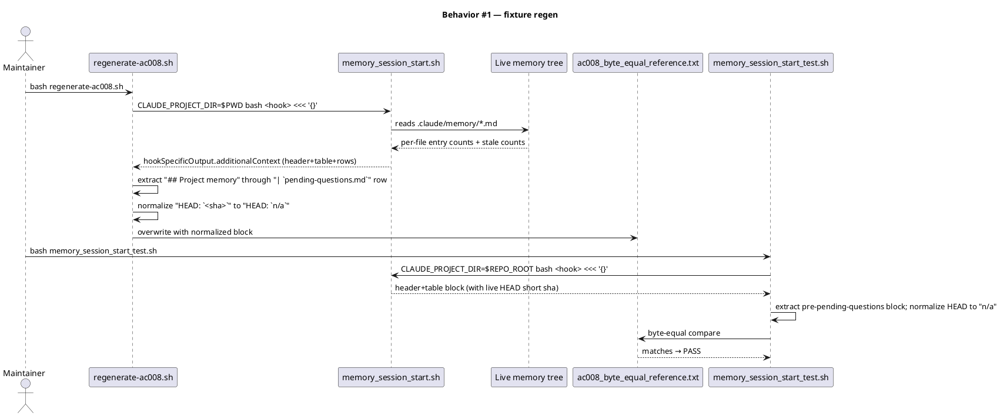

#### §Behavior #2 — Goal 2: drift-check-tick happy path (AC-002, AC-004, AC-011)

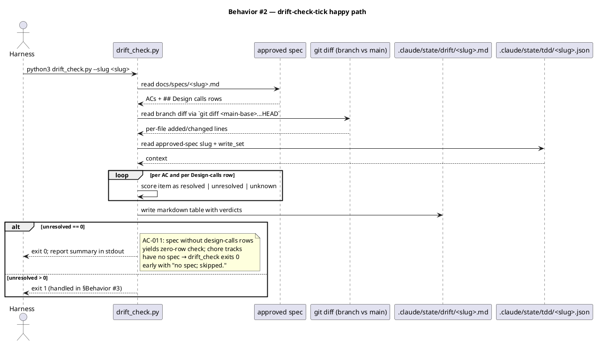

#### §Behavior #3 — Goal 2: drift-check-tick yields on unresolved (AC-003)

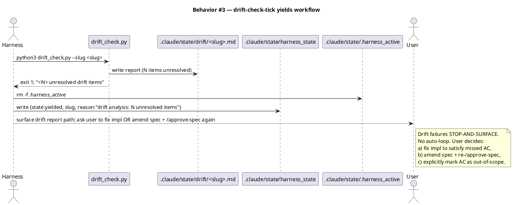

#### §Behavior #4 — Goal 3: stamp-closure via sweep.py (AC-005, AC-006, AC-007)

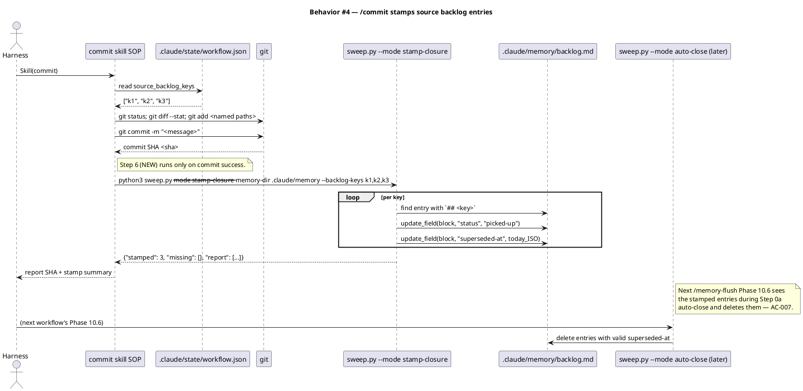

#### §Behavior #5 — Goal 3: dogfood — this workflow stamps its own three source keys (AC-009)

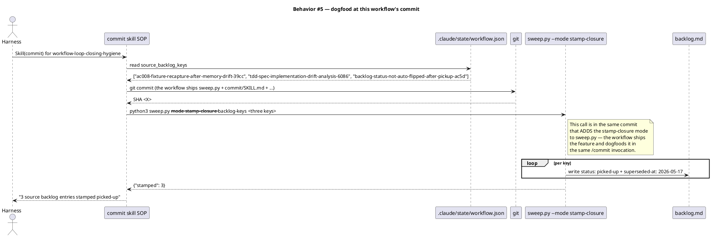

#### §Behavior #6 — Goal 3: no-op when source_backlog_keys is empty/missing (AC-008, AC-010)

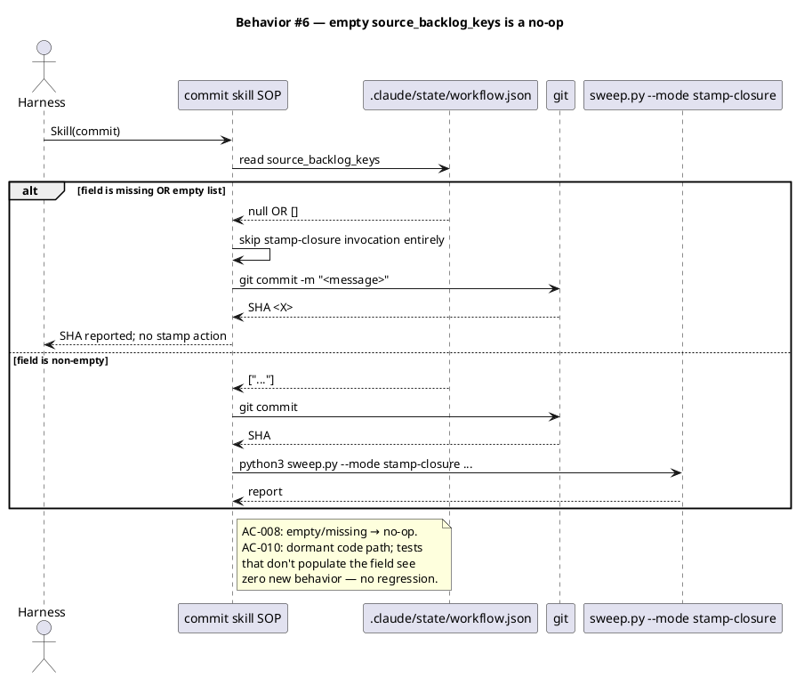

### State — workflow state machine *(no change)*

The harness state machine is unchanged. The drift-check-tick is a new task inside an existing worker chain (`/tdd`'s); the harness loop's resume conditions are unchanged. Documenting that the spec is aware:

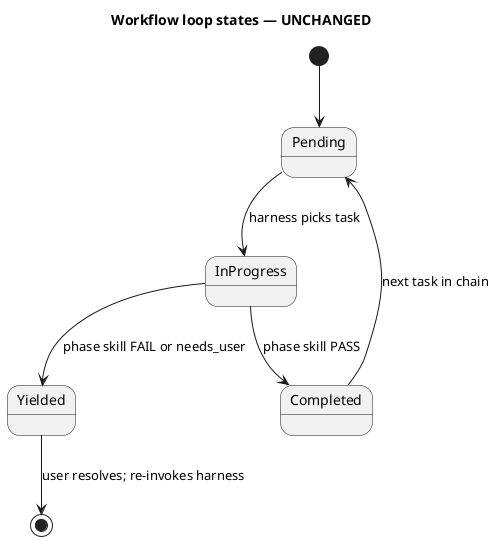

### Dependencies — graph

Directed acyclic graph of files added/changed by this spec. Edge `A --> B` reads "A depends on B at build time or runtime."

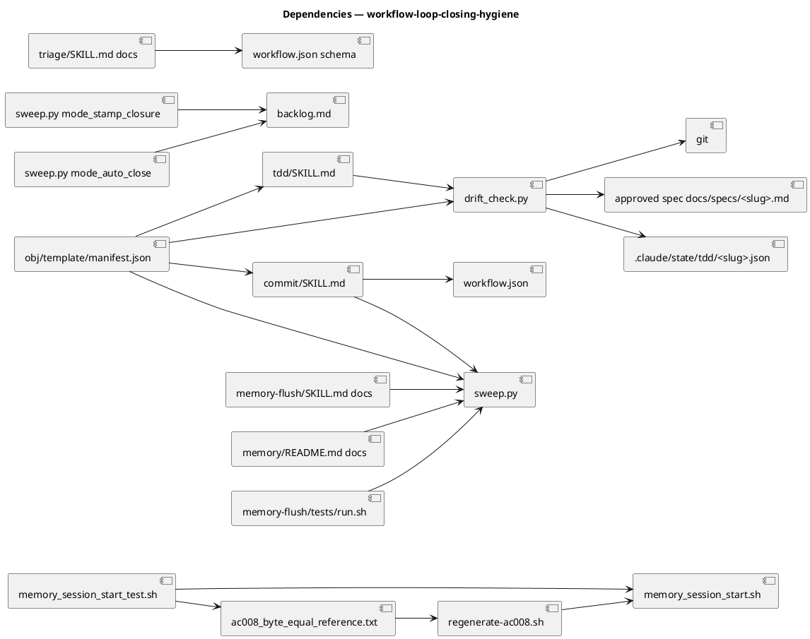

### Contracts

One row per public callable / data file shape this spec defines or changes.

| Kind | Name | Input | Output | Errors | Idempotent |
|---|---|---|---|---|---|
| CLI | `python3 sweep.py --mode stamp-closure --memory-dir <path> --backlog-keys k1,k2,...` | `--memory-dir` path, `--backlog-keys` csv | JSON `{"stamped": N, "missing": [keys], "already_closed": [keys]}` | non-zero exit on filesystem error; missing keys recorded in `missing` list (NOT an error) | yes — re-running on already-stamped entries leaves `status: picked-up` unchanged and rewrites `superseded-at:` to today (deterministic) |
| CLI | `python3 .claude/skills/tdd/drift_check.py --slug <slug>` | `--slug` workflow slug | exit 0 on zero-unresolved; exit 1 on `≥ 1 unresolved`; writes `.claude/state/drift/<slug>.md` | non-zero on missing spec/diff/state; exit 2 reserved for tool errors | yes — re-running produces identical report for unchanged diff |
| Helper | `bash .claude/hooks/tests/fixtures/regenerate-ac008.sh` | none (CWD must be repo root) | overwrites `.claude/hooks/tests/fixtures/ac008_byte_equal_reference.txt`; writes diff summary to stdout | non-zero exit on hook crash or extraction failure | yes — same tree state → identical bytes (HEAD normalized to `n/a`) |
| Data | `workflow.json → source_backlog_keys` | — | `list[string]` — backlog stable keys this workflow picks up | absent ≡ empty list; absent entries (in backlog.md) recorded but not errored | n/a |
| Data | `.claude/state/drift/<slug>.md` | — | drift report markdown with `\| kind \| id \| verdict \| evidence \|` table | n/a | n/a |

### Libraries and versions

This spec adds no third-party libraries. All implementation uses bash (existing), python3 stdlib (existing), and the project's own helper modules. No `context7` lookups are required.

| Library@version | Purpose | Key APIs | Confirmed via context7 |
|---|---|---|---|
| *(none — internal only)* | — | — | n/a |

### Alternatives considered

| Alt | Summary | Rejected because |
|---|---|---|
| 1B (new `/drift` phase) | Drift as its own phase between `/simplify` and `/integrate` | Large rails-amendment footprint; chore tracks need explicit exception; governance count in CLAUDE.md Appendix B shifts. Recommendation 1A delivers the same correctness at a fraction of the footprint. |
| 1C (extend `/integrate`) | Drift inside `/integrate` between test run and verdict | Blurs the "tests = mechanical correctness; drift = structural correctness" boundary the intake calls out. `/integrate` is the binding-verdict skill; adding a second verdict either breaks the `verify_pass_guard` line-1 contract or makes integrate a two-verdict skill. Recommendation 1A keeps integrate single-purpose. |
| 2A (`_pending.md` candidate route) | `/commit` emits `## CANDIDATE: backlog-closure`; next workflow's `/memory-flush` Step 0a sweeps | 1-workflow lag for visible closure; dogfood AC (intake AC#9) fails unless re-worded. Recommendation 2C delivers same-workflow closure through the deterministic actuator. |
| 2B (`/commit` writes `backlog.md` directly) | `/commit` calls `update_field` directly, bypassing sweep.py | Introduces a new direct-write boundary from a non-memory-flush skill. Recommendation 2C routes through the deterministic actuator instead — `/commit` invokes sweep.py rather than writing canonical memory itself. |
| 3A (inline bash one-liner) | Regen logic only in the implementer's session history | Drift is a recurring class of bug; not having a re-usable regen tool guarantees future re-discovery of the same problem. Recommendation 3B commits a re-runnable script. |
| 3C (`--regenerate` flag on the test runner) | Test runner doubles as regen tool when invoked with a flag | Footgun — a test runner that silently rewrites the fixture on a flag is a CI hazard. Recommendation 3B keeps regen in a separate script with no shared code path with the test invocation. |
| HEAD option (ii) baked-in SHA | Capture the live HEAD short SHA into the fixture | Brittle — test fails on every other commit. Recommendation HEAD option (i) (`n/a` sentinel) matches today's bytes and is independent of HEAD. |
| HEAD option (iii) literal `HEAD` | Fixture contains `HEAD: \`HEAD\`` | Changes today's bytes unnecessarily. The `n/a` sentinel already matches the current fixture's first non-header line. |

## Design calls

This spec's `write_set` (`.claude/skills/**`, `.claude/hooks/**`, `.claude/memory/*.md`, `obj/template/manifest.json`) does NOT intersect `project.json → tdd.ui_globs` (`site-src/**`, `app/**`, `components/**`, `pages/**`, `**/*.html`, `**/*.css`, `**/*.scss`, `**/*.njk`). There is no UI surface in scope. The `spec_design_calls_guard` hook allows an empty section body when this condition holds. Per CLAUDE.md Article X.2, no `Skill(design-ui, ...)` invocations are required from `/tdd` Step 6 for this work.

- *(none)*

## Acceptance criteria

Numbered, testable, traced. Each AC points to the §Behavior sequence that defines it.

| ID | Criterion (given / when / then) | Upstream AC | Sequence |
|---|---|---|---|
| AC-001 | given `.claude/hooks/tests/fixtures/ac008_byte_equal_reference.txt` exists, when `bash .claude/hooks/tests/fixtures/regenerate-ac008.sh` runs against the live `.claude/memory/` tree, then the file contains the header+table block byte-equal to the live hook output with `HEAD: \`n/a\`` sentinel, and `bash .claude/hooks/tests/memory_session_start_test.sh` exits 0 with AC-008 case PASS. | intake AC#1 | §Behavior #1 |
| AC-002 | given an approved spec at `docs/specs/<slug>.md` contains N numbered ACs and a `## Design calls` table with M rows, when `python3 .claude/skills/tdd/drift_check.py --slug <slug>` runs against the implementation diff, then `.claude/state/drift/<slug>.md` contains one row per AC and per design-call row, each tagged `resolved`, `unresolved`, or `unknown`, with no item omitted. | intake AC#2 | §Behavior #2 |
| AC-003 | given `drift_check.py` finds `≥ 1 unresolved` items, when the workflow reaches the next phase boundary inside `/tdd`'s worker chain, then the harness writes `harness_state` with `{state: "yielded", slug, reason: "drift analysis: <N> unresolved items"}`, surfaces the report path, and does NOT auto-loop to `/tdd`. | intake AC#3 | §Behavior #3 |
| AC-004 | given `drift_check.py` finds zero `unresolved` items (all `resolved` or `unknown`), when the workflow proceeds, then `unknown`-tagged items are listed as advisory in the report (no separate phase output) and the workflow continues to `/simplify`. | intake AC#4 | §Behavior #2 |
| AC-005 | given `.claude/state/workflow.json → source_backlog_keys` is non-empty AND each named key exists in `.claude/memory/backlog.md` at `status: open`, when `/commit` Step 5 (`git commit`) succeeds, then Step 6 invokes `python3 .claude/skills/memory-flush/sweep.py --mode stamp-closure --memory-dir .claude/memory --backlog-keys <csv>`, which writes `status: picked-up` and appends `superseded-at: <today-ISO>` to each named entry. | intake AC#5 | §Behavior #4 |
| AC-006 | given the chosen fix surface is recommendation 2C, when `/commit` runs the stamp-closure invocation, then no direct write to `backlog.md` happens from `commit/SKILL.md` — `sweep.py` is the only writer. | intake AC#6 (resolved as 2C) | §Behavior #4 |
| AC-007 | given a backlog entry has been stamped `superseded-at: <ISO>` by the stamp-closure call, when the next `/memory-flush` Phase 10.6 Step 0a (`--mode auto-close`) runs, then the entry is deleted per the existing `superseded-at:` closure-trigger contract. | intake AC#7 | §Behavior #4 |
| AC-008 | given `workflow.json → source_backlog_keys` is absent OR `[]`, when `/commit` runs, then Step 6's stamp-closure invocation is skipped entirely (no sweep.py call) and `/commit` proceeds without error. | intake AC#8 | §Behavior #6 |
| AC-009 | given this workflow's `workflow.json → source_backlog_keys` contains exactly `["ac008-fixture-recapture-after-memory-drift-39cc", "tdd-spec-implementation-drift-analysis-6086", "backlog-status-not-auto-flipped-after-pickup-ac5d"]`, when this workflow's own `/commit` completes, then all three entries in `.claude/memory/backlog.md` are stamped with `status: picked-up` and `superseded-at: <today>`. (Dogfood — this commit ships sweep.py's stamp-closure mode AND uses it on itself.) | intake AC#9 | §Behavior #5 |
| AC-010 | given a workflow that did NOT populate `source_backlog_keys` (any pre-existing workflow), when `/integrate` runs the full test suite after this spec lands, then no test regresses — the new stamp-closure code path is dormant when the field is absent. | intake AC#10 | §Behavior #6 |
| AC-011 | given this spec adds no new entry to `project.json → workflow.phases`, when `/triage` writes a fresh `workflow.json` for a new workflow after this spec lands, then the phase list rendered by `triage` and the task chain seeded by `/tdd` are identical in count and order to a workflow before this spec, plus exactly one new task (`drift-check-tick`) inside the `/tdd` worker chain. | intake AC#11 | §Behavior #2 |

## Test plan

Scenarios by category. The `scenario` skill (invoked from `/tdd` worker chain) turns these into failing tests; main context decides the recipe before invocation. Every row references at least one AC.

| Category | Scenario | Expected | Covers |
|---|---|---|---|
| Golden path | `regenerate-ac008.sh` invoked against the current memory tree | overwrites fixture; subsequent test PASS | AC-001 |
| Golden path | `drift_check.py` on a spec with all ACs resolved | report has 0 unresolved; exit 0 | AC-002, AC-004 |
| Golden path | `drift_check.py` on a spec with 1 AC unresolved | report has 1 unresolved; exit 1 | AC-003 |
| Golden path | `sweep.py --mode stamp-closure` with valid keys | entries stamped; JSON report counts match | AC-005, AC-006 |
| Golden path | `sweep.py --mode auto-close` on entries previously stamped via stamp-closure | entries deleted | AC-007 |
| Golden path | this workflow's `/commit` execution | three named backlog entries stamped | AC-009 |
| Input boundary | `drift_check.py` on a workflow with no spec (chore track) | exit 0 with "no spec; skipped" message; no report file | AC-002, AC-011 |
| Input boundary | `sweep.py --mode stamp-closure --backlog-keys ""` (empty list) | report has `stamped: 0`; exit 0 | AC-008 |
| Input boundary | `sweep.py --mode stamp-closure --backlog-keys nonexistent-key` | report has `missing: ["nonexistent-key"]`; exit 0 | AC-008 |
| Input boundary | `regenerate-ac008.sh` on a memory tree with zero entries | fixture contains header + table with all `0` counts; HEAD `n/a` | AC-001 |
| Contract violation | `drift_check.py --slug nonexistent-slug` | exit 2 (tool error); no partial report written | AC-002 |
| Contract violation | `sweep.py --mode stamp-closure` without `--backlog-keys` | argparse error; exit 2 | AC-005 |
| Concurrency / ordering | `/commit` Step 5 (`git commit`) fails BEFORE Step 6 (stamp-closure) | stamp-closure NOT invoked; backlog entries stay `status: open` | AC-005 (negative path) |
| Concurrency / ordering | `/commit` Step 5 succeeds; Step 6 (stamp-closure) filesystem error | git commit lands; commit reports the stamp failure; entries can be stamped manually | AC-005 (recovery path) |
| Failure mode | `regenerate-ac008.sh` invoked on non-git project | HEAD line correctly `n/a` (matches sentinel); fixture writes successfully | AC-001 |
| Failure mode | `drift_check.py` when git diff is empty (no changes vs base) | every AC tagged `unresolved` (no impl evidence); exit 1 | AC-003 |
| Regression trap | workflow without `source_backlog_keys` runs full pipeline | no behavior change; tests unchanged | AC-008, AC-010 |
| Regression trap | existing memory-flush tests at `.claude/skills/memory-flush/tests/run.sh` | all existing tests PASS after sweep.py extension | AC-007 |
| Regression trap | existing memory_session_start_test.sh AC-003/AC-005/AC-007 cases | PASS after HEAD-normalization edit (only AC-008 logic changes) | AC-001 |
| Regression trap | `audit-baseline` audit | exit 0 after manifest regeneration with new files | AC-011 |

## Observability

| Signal | Name | Shape | Purpose |
|---|---|---|---|
| Log | `.claude/state/drift/<slug>.md` | markdown report (per-AC verdict + evidence) | Drift audit trail per workflow |
| Log | `.claude/state/harness/<slug>.log` line `drift-check yielded: <N> unresolved` | text log line | Workflow-level drift visibility |
| stdout | `sweep.py --mode stamp-closure` JSON | `{"stamped": N, "missing": [], "already_closed": []}` | Closure-stamp outcome at `/commit` time |
| File | `backlog.md` entries with `status: picked-up` + `superseded-at: <ISO>` | structured fields | Durable record of which entries each workflow picked up |
| Test verdict | `.claude/state/last_test_result` | four-line PASS/FAIL | Existing — unchanged contract |

No new metrics, alarms, or external monitoring. This is internal baseline plumbing; observability is via state files and logs.

## Rollout

- **Feature flag**: none. The changes are baseline-internal; rollout is the commit that lands this spec's implementation.
- **Migration order**:
  1. Add `drift_check.py` helper.
  2. Add `mode_stamp_closure` + tests to `sweep.py`.
  3. Add `regenerate-ac008.sh` helper script.
  4. Regenerate `ac008_byte_equal_reference.txt` via the new script.
  5. Update `memory_session_start_test.sh` AC-008 extraction to normalize HEAD.
  6. Update `tdd/SKILL.md` to seed drift-check-tick task.
  7. Update `commit/SKILL.md` to invoke stamp-closure post-commit.
  8. Update `triage/SKILL.md`, `memory-flush/SKILL.md`, `memory/README.md` docs.
  9. Regenerate `obj/template/manifest.json` hashes.
  10. `/commit` (this workflow) — exercises the dogfood AC #9.
- **Canary**: this workflow itself. If this workflow's drift-check-tick passes and its `/commit` stamps the three source backlog keys, the rollout is good.

## Rollback

- **Kill-switch**: `git revert <this-spec's commit SHA>`. All changes are within the baseline's own files; no production services, no external state.
- **Signal to roll back**: any of the following observed within one workflow after this spec ships —
  - drift-check-tick fires false-positive `unresolved` on a workflow that satisfies its spec (`drift_check.py` is buggy);
  - `sweep.py --mode stamp-closure` corrupts a `backlog.md` entry (wrong field write);
  - `regenerate-ac008.sh` output fails the byte-equality test on the same tree state (regen is non-deterministic);
  - any existing test in the audit or memory-flush test suites regresses.
- **Recovery**: stamped backlog entries that should not have been closed can be unstamped manually (delete the `superseded-at:` line; restore `status: open`). The git revert restores prior code; manual fixup of memory is one Edit per affected entry.

## Archive plan

When this spec ships, the `archive` skill (Phase 10.5) moves the following into `docs/archive/<ship-date>/workflow-loop-closing-hygiene/`. Default slug-matched artifacts are discovered automatically:

- Defaults *(automatic)*: intake, scout, research, spec, spec approval, security report (if `/security` runs), drift report.
- Extras *(non-default files)*:
  - `.claude/state/drift/workflow-loop-closing-hygiene.md` — the drift report generated by this workflow's own `drift-check-tick`. Archived as evidence the dogfood AC #2/#4 passed.

## Open questions

- **OQ-1.** What is the deterministic mapping rule from an AC's prose to "resolved" evidence in the diff? Candidates: (a) literal AC identifier (`AC-005`) appears in a test name or assertion docstring in the diff; (b) at least one new test in the diff references the AC's `§Behavior #N` anchor by text; (c) the AC's `given/when/then` keywords each appear in at least one test name. Choice affects `drift_check.py`'s parser. **Recommendation**: (a) for simplicity, with fallback to (b) when (a) is empty.
- **OQ-2.** What counts as `unknown` evidence (intake Q3, Q4)? Candidates: (a) tests mention the AC but no assertion fails would catch a regression — the diff is text-equivalent to "the AC is documented but not enforced"; (b) the AC mentions a behavior that's verified by a pre-existing test (not in the diff). (b) is the common case; flagging it as `unknown` instead of `resolved` would surface noise. **Recommendation**: `unknown` reserved for ambiguous cases — pre-existing test coverage counts as `resolved`.
- **OQ-3.** Does `drift_check.py` need access to the implementation's RUN-TIME state, or only the STATIC diff? The recommendation throughout assumes static — parse the spec, parse the diff, score. Dynamic verification (run the impl and check the AC's behavior fires) is out of scope (that's `/integrate`'s role). **Recommendation**: static only; defer dynamic to `/integrate`.
- **OQ-4.** The `## Design calls` section in this spec is `*(none)*` (no UI). When `drift_check.py` runs on this spec, the Design calls verdicts table is empty. Should the empty case render as `(no design calls — skipped)` or just an empty section? **Recommendation**: explicit "no design calls — skipped" message in the report, so the absence is observable.
- **OQ-5.** When a workflow has `source_backlog_keys: [...]` BUT one named key doesn't exist in `backlog.md` (e.g., the entry was manually deleted before commit), what does `stamp-closure` do? Candidates: (a) error (exit non-zero, block commit); (b) record in `missing: [...]` list and continue. The contracts table commits to (b) — a missing key is recorded, not an error. The reasoning: a missing entry is observable but the commit shouldn't be blocked by stale workflow.json state. Spec author confirms this is correct.
- **OQ-6.** Should `regenerate-ac008.sh` write the new fixture only if its content differs from current, or always overwrite? **Recommendation**: always overwrite (idempotent — same bytes if tree state matches, different bytes if tree drifted). Git's diff catches no-op rewrites.
