# Spec — Branded TUI for create-baseline (install / upgrade / doctor)

<!--
Technical spec. Produced by the `spec` skill.

Guard-enforced invariants:
  - Required ## headings (artifact_template_guard):
        Goal, Design, Design calls, Acceptance criteria, Test plan.
  - Required diagram kinds inside ```plantuml``` fences
    (spec_diagram_presence_guard):
        c4_context, c4_container, c4_component, sequence, class,
        dependency_graph.
  - Every ```plantuml``` fence must parse (plantuml_syntax_guard).

Approval: NEVER add "Status: Approved" — spec_approval_guard blocks it.
Approval is a token written by /approve-spec.
-->

## Context

| Input | Path |
|---|---|
| Intake | `docs/intake/branded-cli-tui.md` |
| BRD *(if any)* | — |
| Scout | `docs/scout/branded-cli-tui.md` |
| Research | `docs/research/branded-cli-tui.md` |

## Goal

The `create-baseline` CLI presents install, upgrade, and doctor flows as a single branded product surface in the terminal — using `@clack/prompts` primitives in Friedbot Studio house style — while preserving today's plain-text output for non-TTY (CI / piped) invocations and every existing flag-driven behavior.

## Non-goals

- No rewrite of install / merge / doctor *business logic*. The TUI is a presentation layer on top of the existing pure data functions (`freshInstall`, `forceInstall`, `threeWayMerge`, `runDoctor`).
- No telemetry or phone-home behavior added by this work.
- No authoring of a TUI framework — `@clack/prompts` is the only sanctioned new dependency.
- No global `--no-tty` flag. Detection is per-invocation via `process.stdout.isTTY` (rendering) and `process.stdin.isTTY` (prompts); CI/non-TTY auto-degrades to today's plain output.
- No change to `audit-baseline`'s drift-check logic. Only `doctor`'s presentation layer changes.
- No `init-project` TUI in this scope — separate intake if pursued.
- No `.baseline-manifest.json` schema change. The three-way-merge algorithm in `src/cli/merge.js` is unchanged at the data level.

## Design

Diagrams are the contract. Prose is only for things a diagram cannot say.

### C4 — System context

Who interacts with the CLI, and which external systems it depends on.

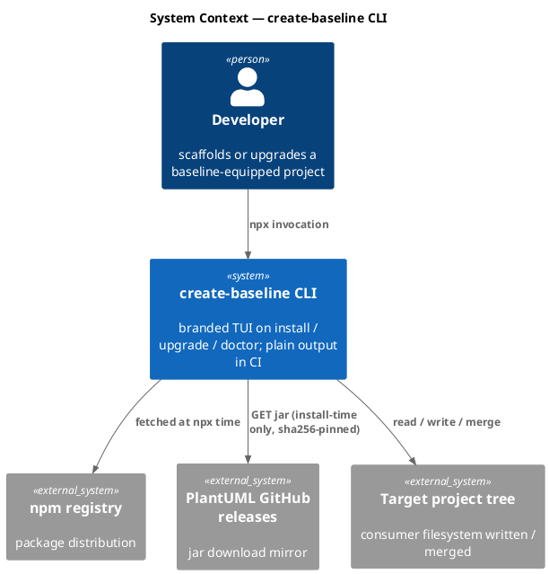

### C4 — Container

Deployable units inside the CLI package and how they communicate.

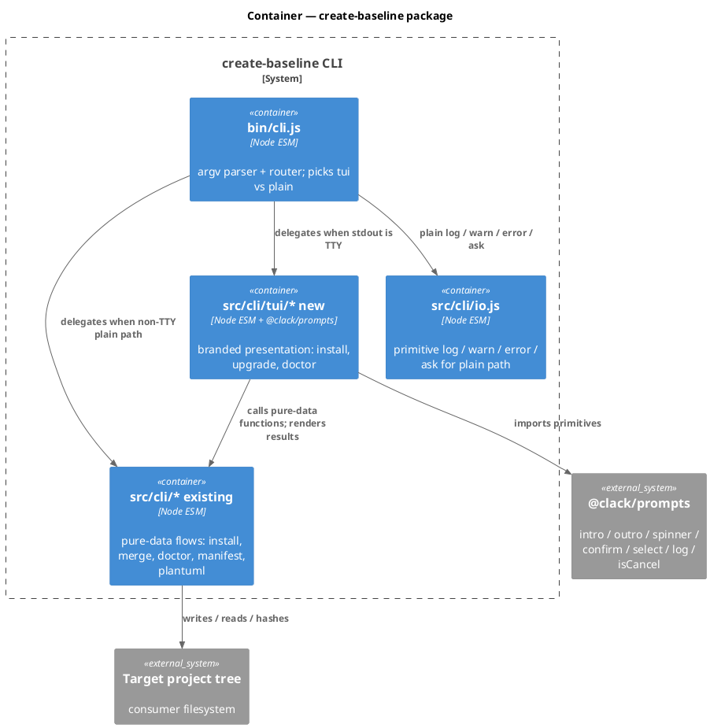

### C4 — Component (changed container only)

Only `src/cli/` changes; component view of the new `tui/` subtree plus router seam.

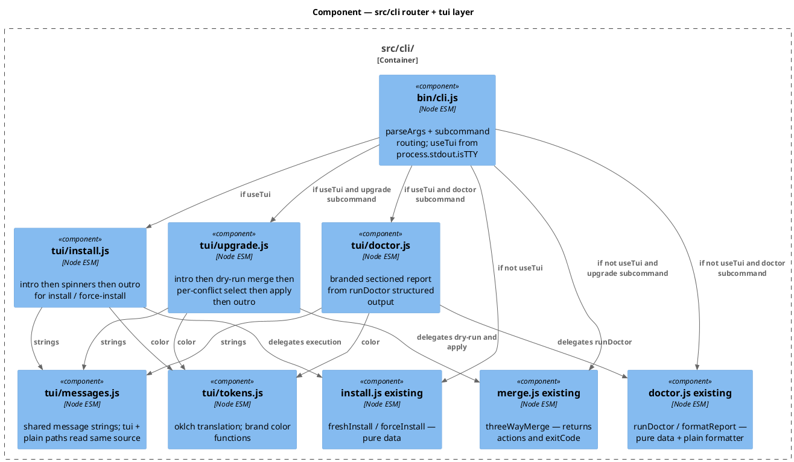

### Data model — class diagram

This is a CLI; there is no persistent data store. The "data model" is the in-memory shapes the TUI consumes from the pure-data layer.

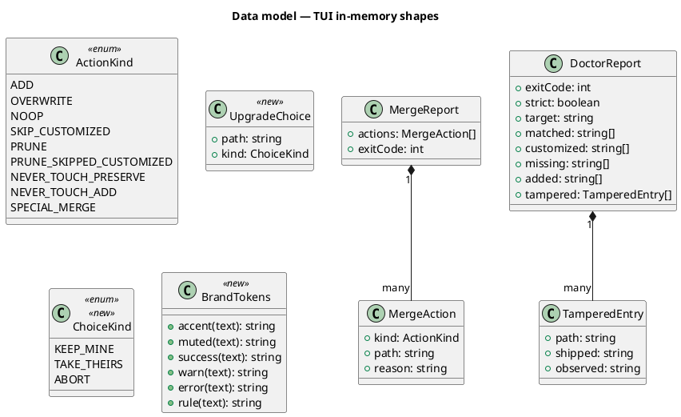

#### Migration DDL

N/A — CLI has no persistent data store. The data model above is in-memory only; the only on-disk schema affected is `.claude/.baseline-manifest.json` and that schema is unchanged by this spec.

### Behavior — sequence per AC

One sequence per acceptance criterion. The sequence is the contract.

#### §Behavior #1 — branded install in TTY

Covers AC-001.

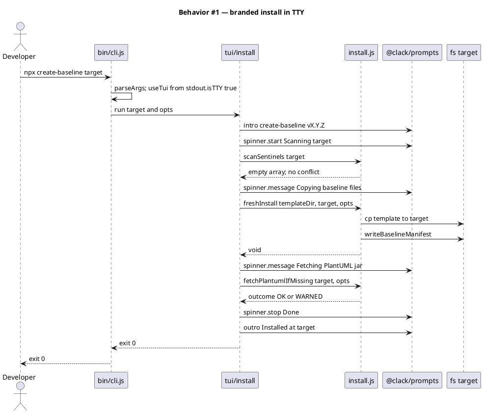

#### §Behavior #2 — non-TTY install plain fallback

Covers AC-002.

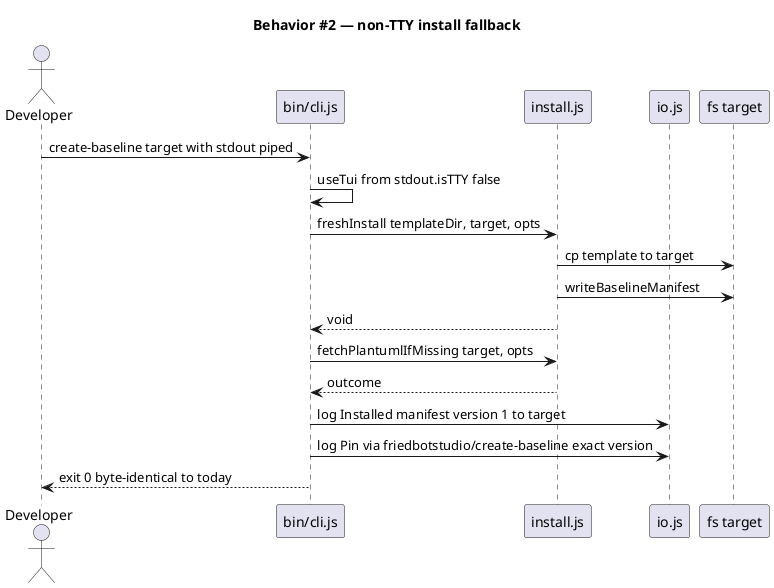

#### §Behavior #3 — upgrade interactive conflict resolution

Covers AC-003. The upgrade subcommand replaces today's merge flag.

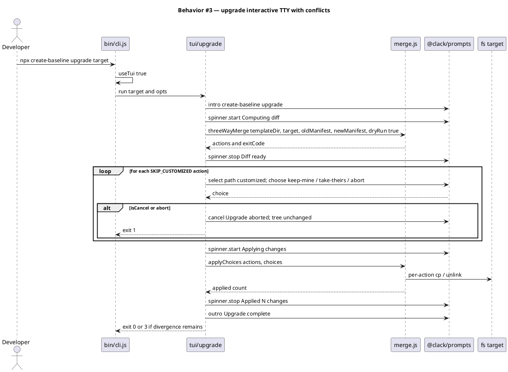

#### §Behavior #4 — upgrade non-TTY parity

Covers AC-004. In non-TTY, the upgrade subcommand reproduces today's merge behavior exactly (no interactivity; SKIP_CUSTOMIZED actions exit 3).

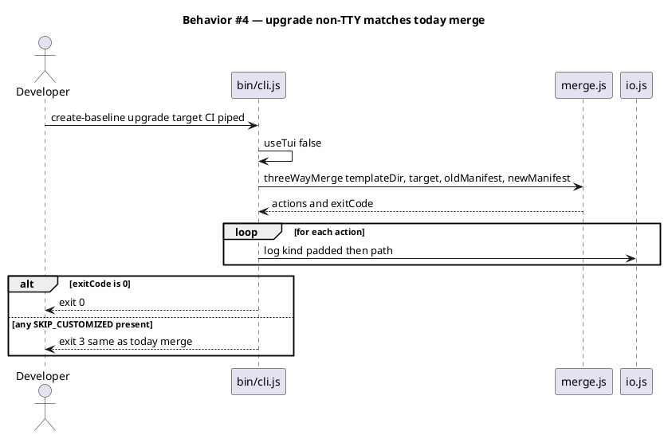

#### §Behavior #5 — branded doctor and JSON mode

Covers AC-005 and AC-012 (the json rider for CI consumers).

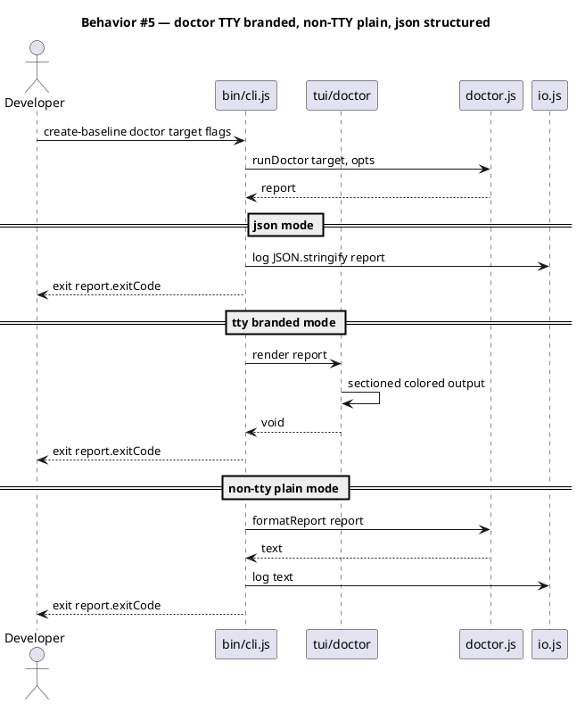

#### §Behavior #6 — merge removal and flag back-compat

Covers AC-006 and AC-007. The merge flag is hard-removed; previously-supported install flags remain operative on the install path.

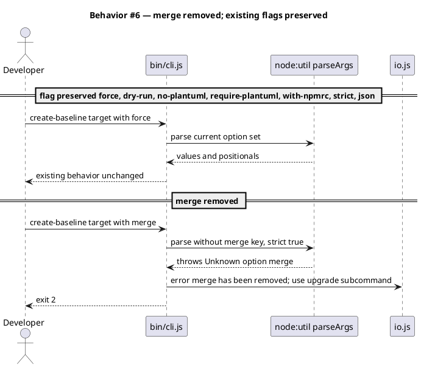

#### §Behavior #7 — build-/process-time invariants

Covers AC-008 (single runtime dep), AC-009 (description claim retired), AC-010 (audit-baseline passes), AC-011 (design-ui handoff). These are verified at build / CI time, not runtime; the sequence shows the verifier rather than a request flow.

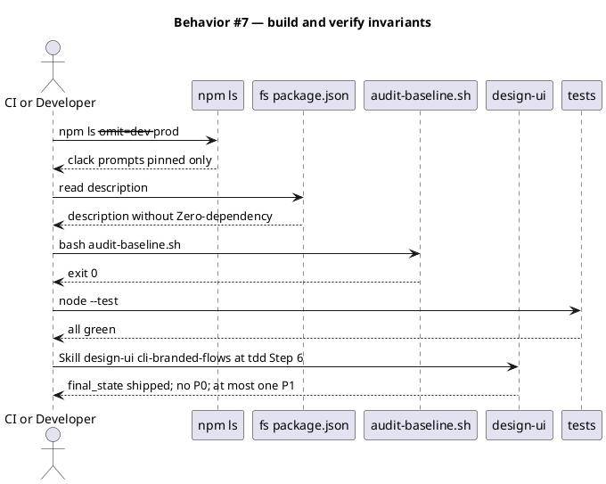

### State — core entity

Omitted by deliberate choice. The CLI is stateless per invocation. The upgrade flow does have a small in-conversation state (per-file user choice), but it lives in a single `Map<path, ChoiceKind>` populated synchronously by the `select` loop and consumed once; a finite-state diagram would be ceremony without value.

### Dependencies — graph

Directed and acyclic. Edge `A --> B` reads "A depends on B".

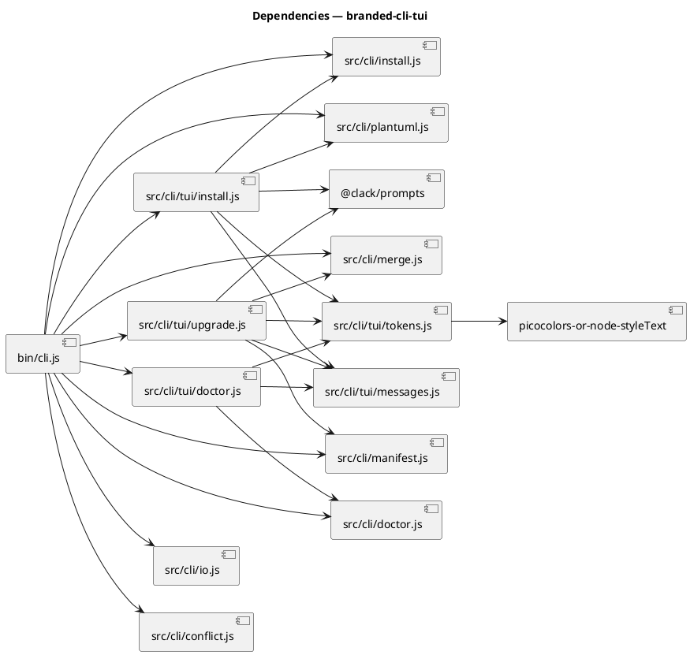

### Contracts

| Kind | Name | Input | Output | Errors | Idempotent |
|---|---|---|---|---|---|
| CLI | `create-baseline <target> [...flags]` | target path; `--force`, `--dry-run`, `--no-plantuml`, `--require-plantuml`, `--with-npmrc` | stdout (branded TTY or plain non-TTY); exit 0/1/2/4 | conflict without `--force`; bad flag combo | no (writes filesystem) |
| CLI | `create-baseline upgrade [target] [--dry-run]` | target path (default `.`); `--dry-run` | stdout; exit 0/1/2/3 | no manifest at target; bad flags; abort | dry-run yes; run no |
| CLI | `create-baseline doctor [target] [--strict] [--json]` | target path (default `.`); `--strict`, `--json` | stdout (branded TTY / plain / JSON); exit 0/1/2 | no manifest | yes |
| Module | `tui.install.run({target, opts})` | target + opts | `Promise<number>` (exit code) | propagates from `freshInstall` / `forceInstall` / `fetchPlantumlIfMissing` | no |
| Module | `tui.upgrade.run({target, opts})` | target + opts | `Promise<number>` | abort, no-manifest, propagates from `threeWayMerge` | dry-run only |
| Module | `tui.doctor.render(report)` | `DoctorReport` | `void` (writes stdout) | none — pure render | yes |
| Module | `tui.tokens.{accent,muted,success,warn,error,rule}(text)` | string | string (ANSI-coloured) | none | yes |

### Libraries and versions

| Library@version | Purpose | Key APIs | Confirmed via context7 |
|---|---|---|---|
| `@clack/prompts` @ pinned-at-impl-time (latest `0.x` major) | Terminal prompt primitives + log / spinner / intro / outro | `intro`, `outro`, `cancel`, `spinner` (`start` / `message` / `stop` / `error` / `cancel`), `confirm`, `select`, `multiselect`, `text`, `note`, `log.{info,success,step,warn,error,message}`, `isCancel`, `group` | yes — `/bombshell-dev/clack` |

The exact semver pin (e.g., `0.X.Y`) is locked at `/tdd` Step 0 against `npm view @clack/prompts version` and recorded in `package.json` + this spec's revision (a one-line note appended below the table).

### Alternatives considered

| Alt | Summary | Rejected because |
|---|---|---|
| A — wrap `io.js` to delegate to clack when TTY | Rewrite `io.log/warn/error` to dispatch to `clack.log.*` when stdout is a TTY; existing call sites stay unchanged. | `io.log` is also called from non-flow contexts ("Installed manifest version 1 to …", error toasts). Wrapping it pulls clack into surfaces where plain output is deliberate; the visual rhythm bleeds into single-line status messages. Diff is smallest but blast radius is largest. |
| B — per-flow `tui` modules (chosen) | Add `src/cli/tui/install.js` / `upgrade.js` / `doctor.js`; `bin/cli.js` routes to tui vs plain by `process.stdout.isTTY`; clack stays scoped to the tui subtree. | Selected. |
| C — Presenter interface with TTY/Plain implementations | One interface (`intro`, `step`, `progress`, `confirm`, `select`, `outro`); two implementations; flows take a `presenter` parameter. | Premature for three flows of ~30 lines each. The interface drift cost outweighs the duplication cost at this scale. Reconsider if a 4th branded flow lands within one release cycle (e.g., `init-project` redesign) — then C becomes the natural shape and we revisit. |

## Design calls

Per Article X.2, every UI design task originating inside a workflow phase routes through `Skill(design-ui)`, which invokes `Skill(impeccable)` for the underlying design move. The CLI TUI is a UI surface (terminal renderings, brand colour application, copy register), so it gets a design call here even though `tdd.ui_globs` (web-UI–centric: `**/*.tsx`, `**/*.njk`, etc.) does not intersect the write set. The `spec_design_calls_guard` will not fire on this spec; the row below is the constitutional commitment, not a guard-driven requirement.

| Slug | Intent | Target files | Write set | Register | References |
|---|---|---|---|---|---|
| cli-branded-flows | Design install / upgrade / doctor branded TUI flows in Friedbot Studio house style — palette, vertical rhythm, intro/outro framing, spinner aesthetics, per-flow content tone. | `src/cli/tui/install.js`, `src/cli/tui/upgrade.js`, `src/cli/tui/doctor.js`, `src/cli/tui/tokens.js`, `src/cli/tui/messages.js` | `src/cli/tui/**` | inherit (Friedbot Studio house style; docs site is the reference brand surface) | `site-src/assets/site.css` (oklch palette tokens), the rendered docs site, `@clack/prompts` primitive surface from `context7` |

## Acceptance criteria

| ID | Criterion (given / when / then) | Upstream AC | Sequence |
|---|---|---|---|
| AC-001 | Given a TTY (`process.stdout.isTTY === true`) and a fresh target, when the user runs `npx create-baseline <target>`, then the CLI emits a branded sequence (clack `intro`, spinners for each phase, `outro`) using Friedbot Studio brand colors, and the on-disk result is byte-identical to today's fresh install. | intake AC 1 | §Behavior #1 |
| AC-002 | Given `process.stdout.isTTY === false` (CI / piped stdout), when the user runs `npx create-baseline <target>`, then the CLI emits today's plain text output line-for-line and exits with today's exit code. | intake AC 2 | §Behavior #2 |
| AC-003 | Given an existing target with `.claude/.baseline-manifest.json` and at least one customized-stale file, when the user runs `npx create-baseline upgrade <target>` in a TTY, then the CLI presents each customized-stale file as a `select` prompt with options `keep-mine` / `take-theirs` / `abort`, applies the chosen actions, and emits an outro summary with the count of applied changes. | intake AC 3 | §Behavior #3 |
| AC-004 | Given the same scenario in a non-TTY, when the user runs `create-baseline upgrade <target>`, then the CLI reproduces today's `--merge` behavior exactly: list actions to stdout, exit 3 if any `SKIP_CUSTOMIZED` or `PRUNE_SKIPPED_CUSTOMIZED` action is present, otherwise exit 0. | intake AC 4 | §Behavior #4 |
| AC-005 | Given a `.baseline-manifest.json` at `<target>/.claude/`, when the user runs `create-baseline doctor [target]` in a TTY without `--json`, then the CLI emits a colorized sectioned report (matched / customized / missing / added) using brand tokens, and preserves the existing exit codes (0 / 1 / 2 plus `--strict` semantics). | intake AC 5 | §Behavior #5 |
| AC-006 | Given any combination of pre-existing CLI flags (`--force`, `--dry-run`, `--no-plantuml`, `--require-plantuml`, `--with-npmrc`, `--strict`), when invoked, then the CLI behaves identically to today (same on-disk effect, same exit code). Verified by the pre-existing assertions in `tests/cli.test.mjs`, `tests/install.test.mjs`, `tests/doctor.test.mjs`, `tests/merge.test.mjs`, `tests/io.test.mjs`. | intake AC 9 | §Behavior #6 |
| AC-007 | Given `--merge` is passed (in any combination), when `parseArgs` runs with the new option set (no `merge` key, `strict: true`), then `parseArgs` throws on the unknown option, the router emits `--merge has been removed; use \`create-baseline upgrade <target>\` instead.` to stderr, and exits 2. | intake AC 10 | §Behavior #6 |
| AC-008 | After running `npm install` against this package's `package.json`, `npm ls --omit=dev --prod` lists exactly one direct runtime dependency (`@clack/prompts`) plus its transitive closure. No other top-level runtime deps. | intake AC 7 | §Behavior #7 |
| AC-009 | The string `Zero-dependency` no longer appears anywhere in `package.json`. The README's positioning paragraph names the new dependency posture and mentions the `upgrade` subcommand. | intake AC 8 | §Behavior #7 |
| AC-010 | `bash .claude/skills/audit-baseline/audit.sh` exits 0 against the post-implementation tree. | intake AC 11 | §Behavior #7 |
| AC-011 | The `design-ui` skill, invoked with the `cli-branded-flows` brief during `/tdd` Step 6, returns `final_state: "shipped"` with zero P0 issues and at most one P1 issue at handoff. (Per Article X.2.) | intake AC 12 | §Behavior #7 |
| AC-012 | When `doctor --json` is passed, the CLI emits `JSON.stringify(report)` on stdout (the structured object returned by `runDoctor`) and exits with `report.exitCode`. The JSON shape preserves `{exitCode, strict, target, manifestVersion, generatedAt, matched, customized, missing, added, tampered}`. | new — drives intake open-question #3 resolution | §Behavior #5 |

## Test plan

Scenarios by category. Every row references at least one AC.

| Category | Scenario | Expected | Covers |
|---|---|---|---|
| Golden path | TTY install on empty target | branded clack output captured; install completes; exit 0; manifest written | AC-001 |
| Golden path | Non-TTY install on empty target | output byte-identical to today's plain run; exit 0; manifest written | AC-002 |
| Golden path | Upgrade in TTY with one customized-stale file; user picks `take-theirs` | file replaced from template; manifest refreshed; outro shows "1 applied"; exit 0 | AC-003 |
| Golden path | Upgrade in non-TTY with one customized-stale file | exit 3; action list printed; tree unchanged for that file | AC-004 |
| Golden path | Doctor in TTY on clean target | branded colorized "matched: N" + zero-count sections; exit 0 | AC-005 |
| Golden path | Doctor with `--json` on clean target | stdout is valid JSON with `{matched, customized, missing, added, exitCode, ...}`; exit 0 | AC-012 |
| Input boundary | Upgrade on target with no `.baseline-manifest.json` | exit 2 with helpful error pointing to fresh install | AC-003 |
| Input boundary | `--merge` flag passed in any position | exit 2; stderr contains "--merge has been removed; use `create-baseline upgrade <target>` instead." | AC-007 |
| Input boundary | Upgrade in TTY where user picks `abort` on first conflict | exit 1; tree unchanged from pre-upgrade state; outro shows "Upgrade aborted; tree unchanged" | AC-003 |
| Input boundary | Doctor with `--strict` on tampered target | exit 1; tampered section rendered; existing TAMPERED hash lines preserved | AC-005, AC-006 |
| Contract violation | `tui.install.run` invoked with target=null | throws synchronously before any fs write | AC-001 |
| Contract violation | Doctor with `--json --strict` on tampered target | JSON includes `strict: true`, `customized: [...]`, `exitCode: 1` | AC-012 |
| Concurrency | N/A — CLI is single-process per invocation | — | — |
| Failure mode | `@clack/prompts` invoked with `process.stdout.isTTY === false` directly (empirical probe at /tdd Step 0) | clack emits zero framing bytes to stdout, OR we route around it before calling | AC-002, AC-004 |
| Failure mode | User Ctrl+C mid-upgrade-prompt | `isCancel` detected; `clack.cancel("Upgrade aborted; tree unchanged")`; exit 1; tree at pre-loop state | AC-003 |
| Failure mode | PlantUML fetch fails network during branded install | `clack.log.warn(...)` for non-fatal; install still completes; exit 0 (unless `--require-plantuml` → exit 4 with `clack.log.error`) | AC-001, AC-006 |
| Regression trap | Every existing test in `tests/cli.test.mjs`, `tests/install.test.mjs`, `tests/merge.test.mjs`, `tests/doctor.test.mjs`, `tests/io.test.mjs`, `tests/conflict.test.mjs`, `tests/plantuml.test.mjs`, `tests/manifest.test.mjs` | unchanged green | AC-006 |
| Regression trap | `npm ls --omit=dev --prod` post-install | exactly `@clack/prompts` at top level | AC-008 |
| Regression trap | `grep -c "Zero-dependency" package.json` | 0 | AC-009 |
| Regression trap | `bash .claude/skills/audit-baseline/audit.sh` | exit 0 | AC-010 |
| Regression trap | `template-payload.test.mjs` and `build-template.test.mjs` (shipped tree shape) | unchanged green — `src/cli/tui/**` doesn't ship in `obj/template/` | AC-010 |

## Observability

The CLI is a one-shot process; no metrics, no alarms, no log aggregator. Stdout text + exit code are the entire signal surface.

| Signal | Name | Shape | Purpose |
|---|---|---|---|
| Stdout | clack intro / spinner / outro | TTY-rendered ANSI sequences | user-facing UX |
| Stdout | plain `io.log` lines | flat text | CI / scripted consumers |
| Stdout | `doctor --json` | newline-terminated JSON object | CI consumers (machine parse) |
| Stderr | `io.error` lines, `clack.log.error` | `Error: <reason>` | failure diagnostics |
| Exit code | `0` / `1` / `2` / `3` / `4` | integer | scripted control flow |

Logging beyond stdout/stderr is out of scope (no file logs, no telemetry).

## Rollout

- **No feature flag.** The new TUI ships as a single release. The branded path activates automatically when `process.stdout.isTTY === true`; CI / piped invocations keep today's plain output untouched.
- **Semver.** Pre-1.0 (current 0.3.0) — the `--merge` removal is a breaking change but pre-1.0 conventions allow it within a minor bump. `.releaserc.json` rules drive the next version automatically based on conventional-commit types in the merged commit set. Release notes call out the `--merge` → `upgrade` migration explicitly.
- **Migration order**: 1 ship the package update → 2 npm users running fresh installs see the branded TUI immediately → 3 users running `--merge` get the explicit deprecation error pointing to `upgrade` (single-release transition).
- **No canary** — this is an `npx`-invoked CLI; users self-select by version pin. The README's "Pin to `@friedbotstudio/create-baseline@<exact-version>`" guidance handles the rest.

## Rollback

- **Kill-switch**: revert by deprecating the bad version in npm (`npm deprecate @friedbotstudio/create-baseline@<bad-version> "regression; pin previous"`) and publishing a patch reverting the diff. The previous published version remains installable via exact-pin.
- **Signal to roll back**: any of (a) GitHub issues spike with title matching "TUI" or "upgrade" within 48h of release, (b) install failures reported via `audit-baseline` drift checks on user trees, (c) `npm ls` showing unexpected transitive deps from `@clack/prompts` that violate the supply-chain review at Phase 8. Detection window: 48h (this is a CLI, not a service — no real-time signal).

## Archive plan

When this spec ships, the `archive` skill (Phase 10.5) moves the following to `docs/archive/<ship-date>/branded-cli-tui/`. Defaults are the slug-matched artifacts; extras list non-default files this work produces.

- Defaults *(automatic)*: intake, scout, research, spec, spec-rendered/, spec approval, security report (Phase 8).
- Extras *(list any non-default files)*:
  - *(none)*

## Open questions

- **`@clack/prompts` exact version pin** — to lock at `/tdd` Step 0 against `npm view @clack/prompts version`. Recorded back into this spec's Libraries table and `package.json` in the same commit. Until pinned, the Libraries table reads "latest `0.x` major as of impl date."
- **Empirical confirmation of clack non-TTY behavior** — context7 docs do not pin the silent-degrade contract. `/tdd` Step 0 includes a 3-line probe (`echo "" | node -e "import('@clack/prompts').then(({intro}) => intro('test'))"` redirected to a temp file; assert byte count = 0 or assert acceptable substring shape). If clack does emit framing to non-TTY stdout, AC-002 / AC-004 require an explicit pre-call `if (!process.stdout.isTTY) return plainPath()` rather than relying on clack's own degradation — but the architecture (Candidate B from research) already routes around clack on the non-TTY path, so this is a defense-in-depth check rather than a re-design trigger.
