# Three-tier upgrade-flow rework with /upgrade-project skill

<!--
Technical spec. Produced by the `spec` skill.

Guard-enforced invariants:
  - Required ## headings (artifact_template_guard): Goal, Design, Design calls,
    Acceptance criteria, Test plan.
  - Required diagram kinds inside ```plantuml``` fences
    (spec_diagram_presence_guard): c4_context, c4_container, c4_component,
    sequence, class, dependency_graph.
  - Every ```plantuml``` fence must parse (plantuml_syntax_guard).

Approval: NEVER write "Status: Approved" — spec_approval_guard blocks it.
Approval is the token written by /approve-spec to
.claude/state/spec_approvals/<slug>.approval.
-->

## Context

| Input | Path |
|---|---|
| Intake | `docs/intake/upgrade-flow-rework.md` |
| Scout | `docs/scout/upgrade-flow-rework.md` |
| Research | `docs/research/upgrade-flow-rework.md` |

## Goal

Replace the current binary "Keep mine / Take theirs" customization prompt in `create-baseline upgrade` with a three-tier merge strategy that auto-merges mechanically when textually safe, stages semantic-conflict files for LLM reconciliation via a new `/upgrade-project` Claude Code skill, and surfaces corrected verbiage with a diff preview at every prompt that still fires.

## Non-goals

- Binary file merge — no baseline file is binary today.
- Three-way merge of files the new baseline deleted — preserves the existing PRUNE / PRUNE_SKIPPED_CUSTOMIZED behavior.
- Retroactive re-upgrade of projects already past v0.5.0 — the rework is forward-looking; existing installations carry the same on-disk shape and the new flow uses what's present.
- Replacing `git merge-file` with a hand-rolled merge engine — we use the tool git already ships.
- Caching every prior baseline version locally — BASE content cache is bounded to exactly one prior version.
- Changing the customization-detection trigger (sha256 vs `.baseline-manifest.json`) — only what happens *after* customization is detected changes.
- Building a TUI editor for semantic merges — `/upgrade-project` writes the reconciled file and reports; the user inspects via `git diff`.

## Design

Diagrams are the contract. Prose is only for things a diagram cannot say.

### C4 — System context

Who interacts with the upgrade flow, and which external systems it depends on.

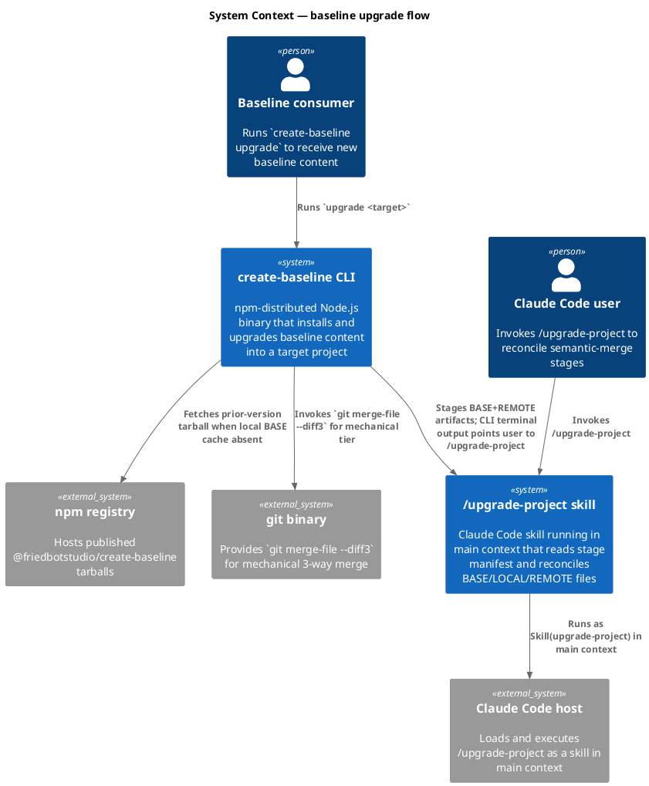

### C4 — Container

Deployable units inside the system boundary and how they communicate.

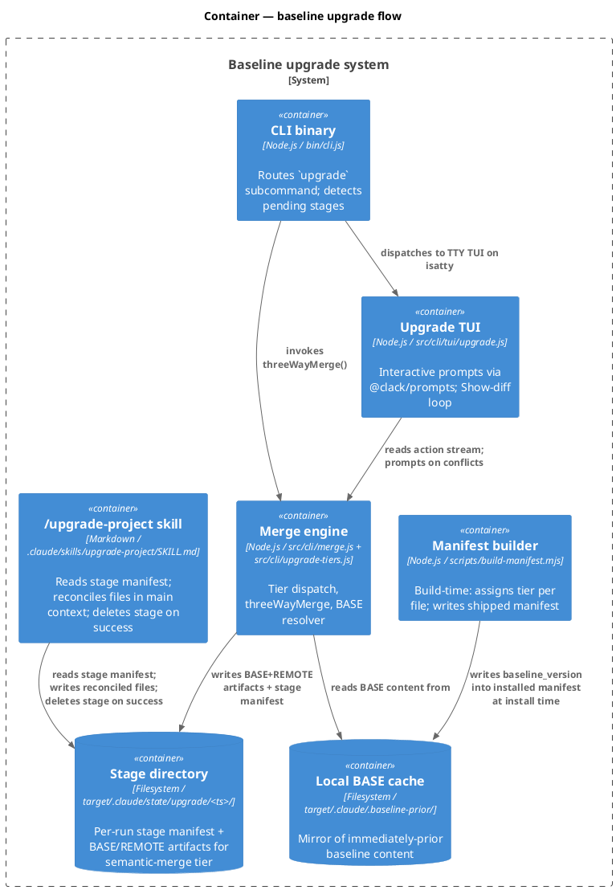

### C4 — Component (changed containers only)

Two containers change materially: the **Merge engine** and the **CLI binary**. The TUI changes are localized (verbiage + Show-diff loop) and reuse existing components; the manifest builder gains one helper. New `/upgrade-project` skill is a new container, diagrammed separately.

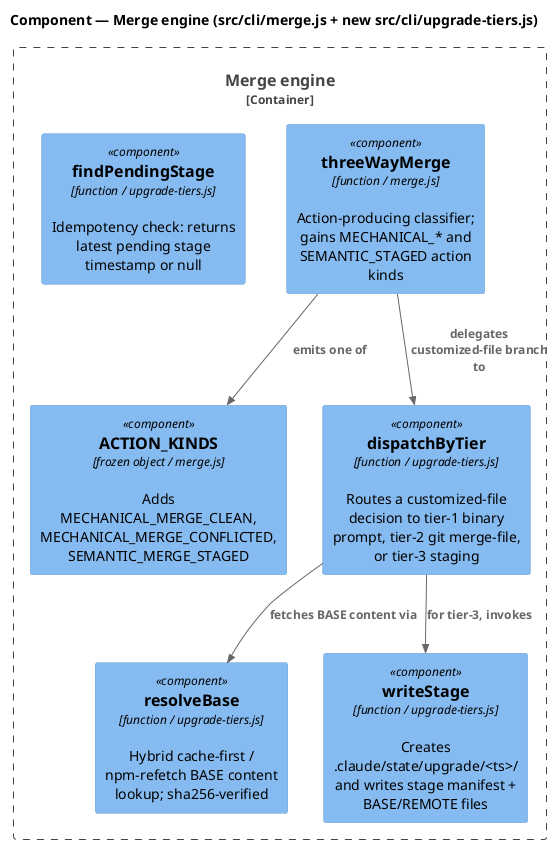

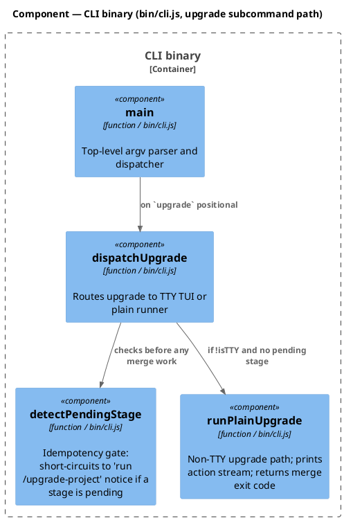

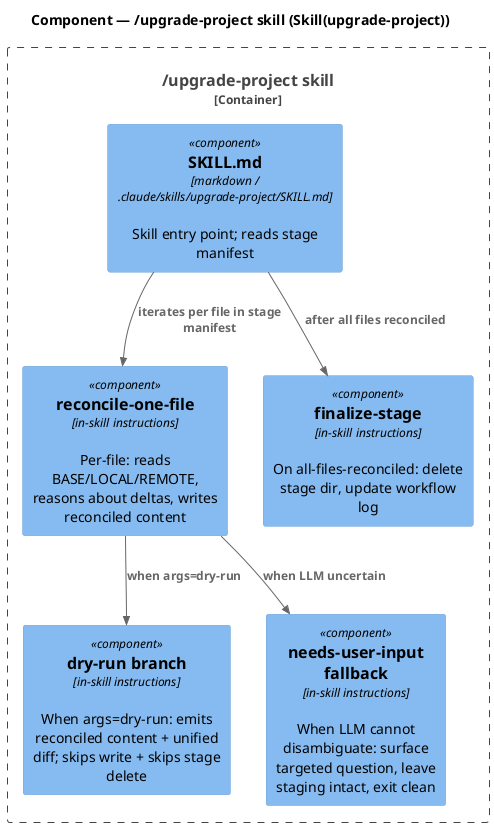

### Data model — class diagram

Two manifest shapes evolve, one new stage manifest appears.

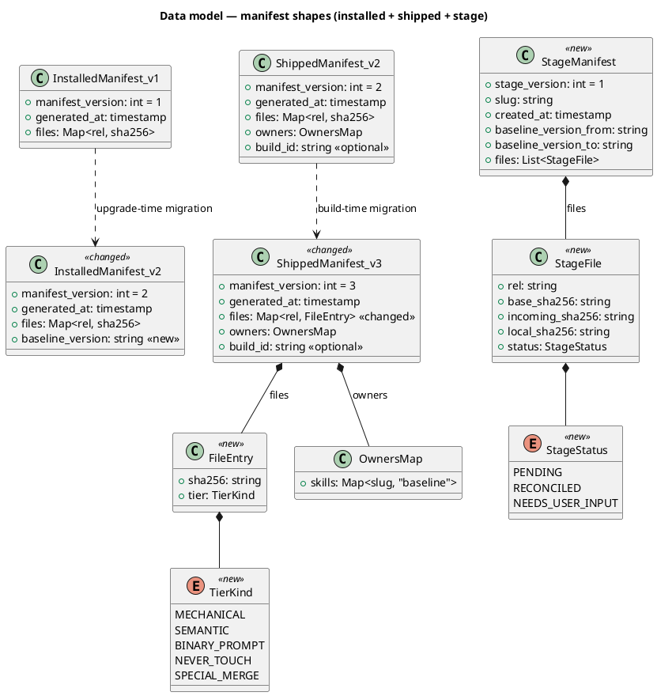

#### Migration DDL

No database in this system. The "migration" is on-disk JSON shape evolution:

```sql
-- forward (installed manifest, written by src/cli/merge.js → saveManifest)
-- pseudo-DDL: add baseline_version field
ALTER STRUCT InstalledManifest ADD FIELD baseline_version STRING;
-- forward (shipped manifest, written by scripts/build-manifest.mjs)
-- pseudo-DDL: change files entry from string-sha256 to {sha256, tier} object
ALTER STRUCT ShippedManifest CHANGE FIELD files MAP<STRING, FileEntry>;
ADD STRUCT FileEntry FIELDS (sha256 STRING, tier ENUM);

-- reverse (graceful read path; no destructive rollback)
-- Readers detect manifest_version on load and switch parsing strategy.
-- Writers always emit the newest shape. Old projects can be read by new code;
-- new manifests are not read by old code (consumer must upgrade CLI to
-- ≥ rework-version before installing rework-built tarballs).
```

### Behavior — sequence per AC

One sequence per AC group. Section anchors (`§Behavior #N`) are referenced from the AC table.

#### §Behavior #1 — Verbiage + Show-diff loop on a tier-1 binary-prompt file (covers AC-001)

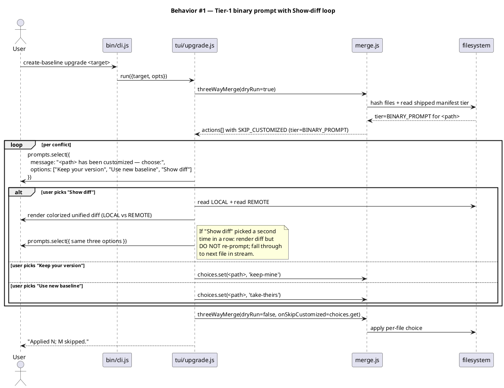

#### §Behavior #2 — Tier-2 mechanical merge, clean (covers AC-002)

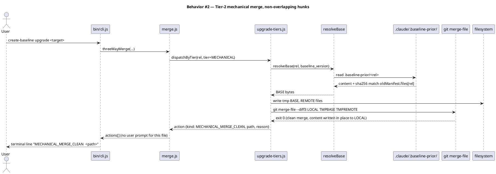

#### §Behavior #3 — Tier-2 mechanical merge, conflicted (covers AC-003)

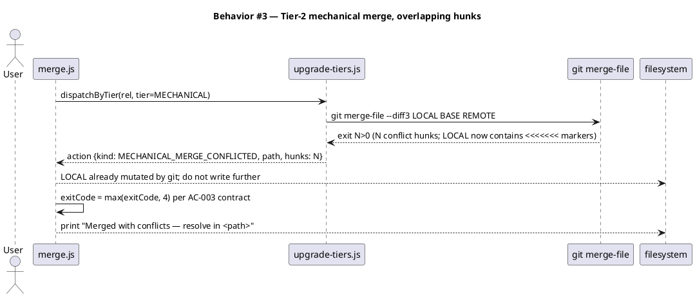

#### §Behavior #4 — Tier-3 semantic-merge staging + /upgrade-project reconciliation (covers AC-004, AC-005, AC-006)

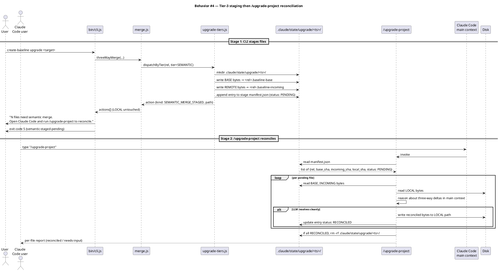

#### §Behavior #5 — Idempotency on re-invocation of `upgrade` while a stage is pending (covers AC-007)

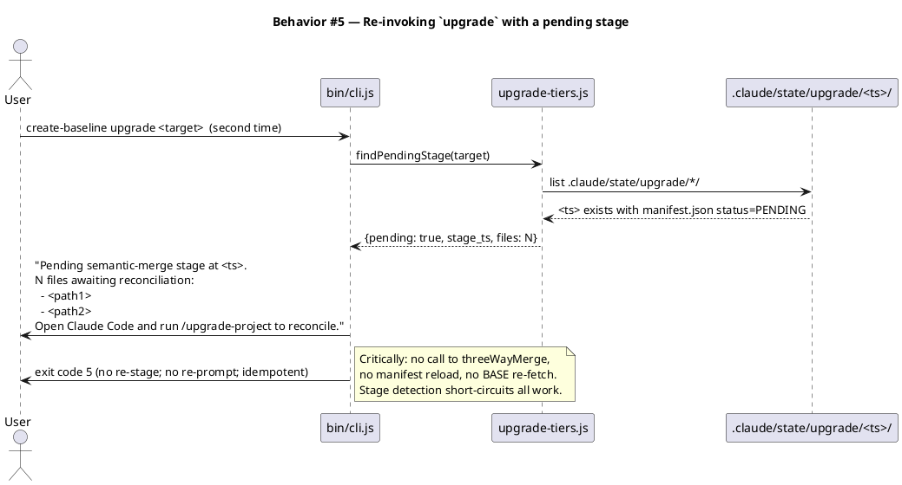

#### §Behavior #6 — BASE recovery failure + AC10 legacy fallback (covers AC-008, AC-010)

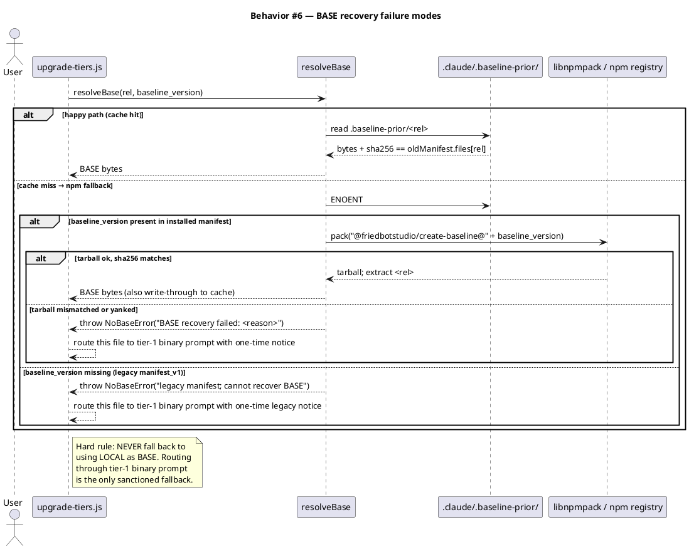

#### §Behavior #7 — User-added file is not read, staged, or modified (covers AC-009)

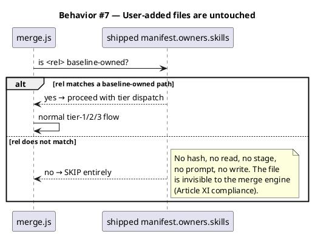

#### §Behavior #8 — `/upgrade-project --dry-run` (covers AC-011)

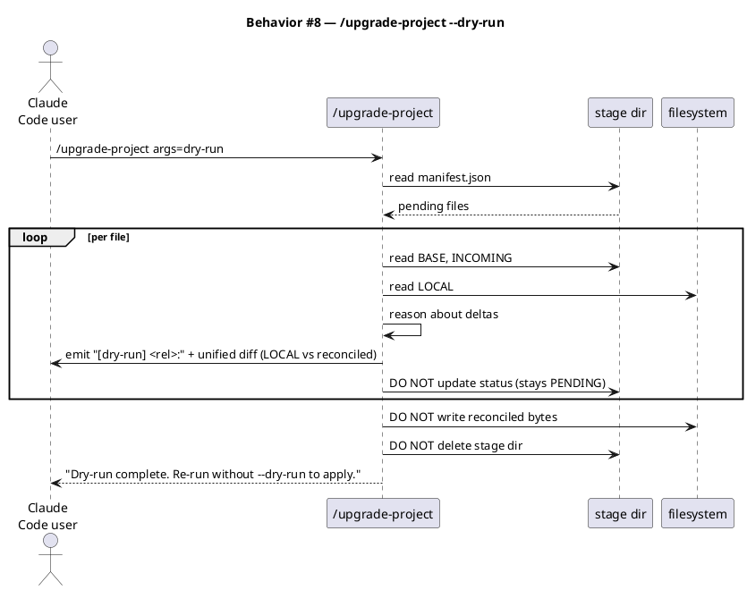

#### §Behavior #9 — `/upgrade-project` fallback when LLM cannot reconcile (covers AC-012)

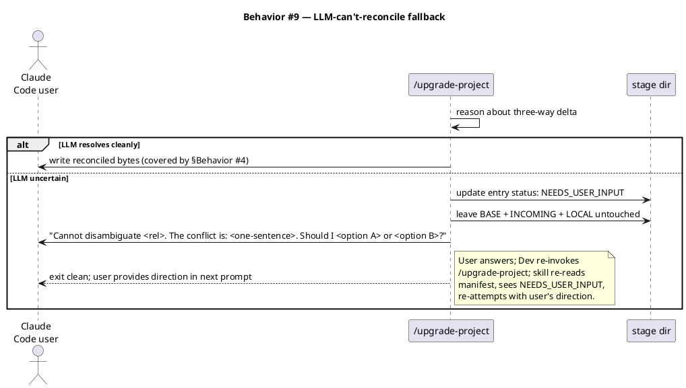

#### §Behavior #10 — Tier classification visible in shipped manifest (covers AC-013)

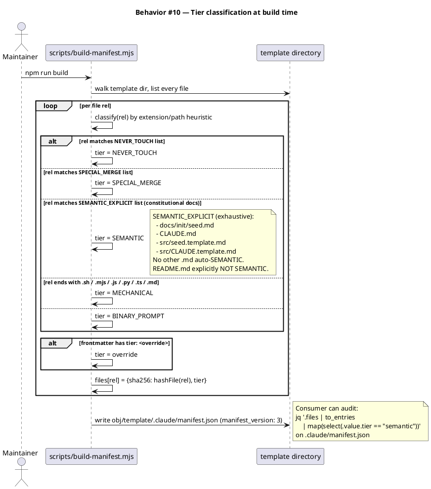

### State — core entity

Each StageFile entry in a stage manifest follows a small state machine.

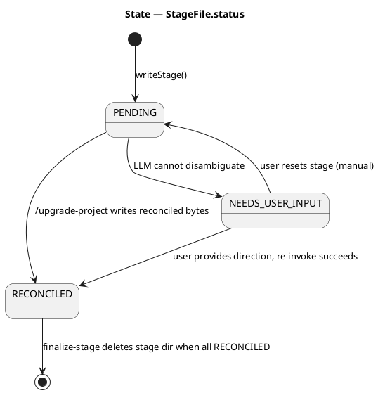

### Dependencies — graph

Directed graph of build/runtime dependencies among the files this rework touches. Edge `A --> B` reads "A depends on B".

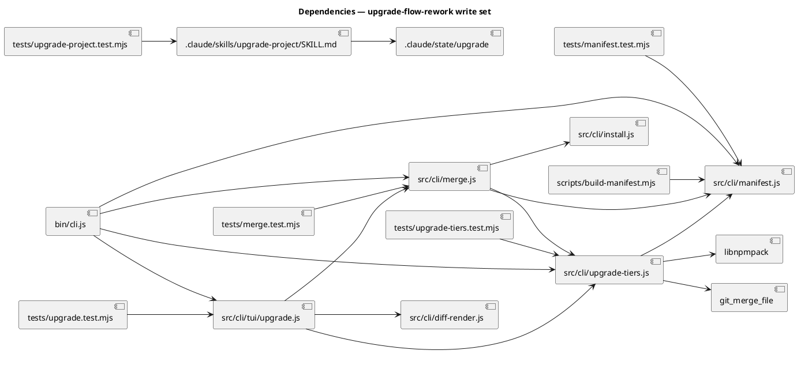

### Contracts

| Kind | Name | Input | Output | Errors | Idempotent |
|---|---|---|---|---|---|
| CLI | `create-baseline upgrade <target>` | target path | exit 0 (clean) / 1 (abort) / 2 (usage) / 3 (skip-customized for legacy tier-1 fallback) / 4 (mechanical-conflicted on disk) / 5 (semantic-staged-pending) | as exit codes | yes (stage-detection short-circuits re-runs; AC-007) |
| CLI | `create-baseline upgrade <target> --dry-run` | target path | enumeration of actions; no writes | none beyond above | yes (no side effects) |
| Skill | `/upgrade-project` | `args` (optional `dry-run`) | per-file status report; on success deletes stage | "no pending stage" early-exit; "needs user input" pause | yes for dry-run; for write mode, re-runs pick up NEEDS_USER_INPUT entries |
| Function | `threeWayMerge(templateDir, target, oldManifest, newManifest, opts)` | dirs + manifests + `{dryRun?, onSkipCustomized?}` | `{actions: Action[], exitCode: number}` | rethrows fs errors | yes (with dryRun=true) |
| Function | `dispatchByTier(rel, tier, ctx)` | rel, tier-kind, merge context | `Action` record | `NoBaseError` for tier-2/3 when BASE unrecoverable | yes within a single merge run |
| Function | `resolveBase(rel, baseline_version, target)` | rel + version + target dir | `Buffer` of BASE bytes | `NoBaseError` (cache miss + npm fail / sha mismatch) | yes |
| Function | `findPendingStage(target)` | target dir | `{stage_ts, files: string[]} \| null` | rethrows fs errors | yes |
| File | `.claude/state/upgrade/<ts>/manifest.json` | written by `writeStage` | read by `/upgrade-project` + `findPendingStage` | corrupt-JSON → treat as no-stage (warn) | yes (idempotent writes via O_CREAT + rename) |
| File | `.claude/.baseline-prior/<rel>` | written by `freshInstall` and after successful `upgrade` | read by `resolveBase` cache branch | sha256 mismatch → treat as cache miss; fall through to npm | yes |

### Libraries and versions

All third-party APIs cited below confirmed via `context7` MCP during research; no training-data recall.

| Library@version | Purpose | Key APIs | Confirmed via context7 |
|---|---|---|---|
| `@clack/prompts@1.4.0` | TTY prompts in upgrade TUI | `select({message, options})`, `isCancel(v)`, `intro`, `outro`, `cancel`, `log.*` | yes (resolved `/bombshell-dev/clack`) |
| `libnpmpack@latest` (via npm CLI bundle) | Programmatic BASE recovery from npm registry | `pack('@friedbotstudio/create-baseline@<v>')` → Buffer | yes (resolved `/npm/cli`, libnpmpack README) |
| `node:fs/promises` | All file IO | `readFile`, `writeFile`, `mkdir`, `rm`, `cp`, `readdir` | n/a (Node stdlib) |
| `node:crypto` | sha256 verification | `createHash('sha256').update(buf).digest('hex')` | n/a (Node stdlib) |
| `node:child_process` | `git merge-file --diff3` invocation | `spawnSync('git', ['merge-file', '--diff3', LOCAL, BASE, REMOTE])` | n/a (Node stdlib) |
| `git ≥ 1.6` (system binary) | 3-way text merge with diff3-style markers | `git merge-file [--diff3] [-p] LOCAL BASE REMOTE`; exit 0 clean / N conflicts | n/a (POSIX-stable since 2008) |

### Alternatives considered

| Alt | Summary | Rejected because |
|---|---|---|
| 1A (npm-only re-fetch) | No local BASE cache; always re-fetch prior version from registry at upgrade time | Offline upgrade impossible; registry yank breaks the flow even when content was previously present locally |
| 1B (cache-only) | Always read BASE from local cache; no npm fallback | Legacy cold-start (projects installed before this rework have no cache) has no recovery path other than tier-1 fallback for every file |
| 2A (sibling staging files) | `<path>.baseline-incoming` / `<path>.baseline-base` next to LOCAL | Scatters artifacts through project tree; risk of `git add .` committing them; per-file gitignore needed |
| 2B (subdirectory mirror only) | `.claude/upgrade-staging/<ts>/` without state manifest | No per-file status tracking; partial-completion + needs-user-input flow harder to implement |
| 3A (hardcoded `Object.freeze` arrays in install.js) | Mirror today's `NEVER_TOUCH`/`SPECIAL_MERGE` pattern | Tier classification invisible from manifest; auditability lower; two places to keep in sync for skill-shipped special files |
| 3C (hybrid extension-defaults + hardcoded list + frontmatter) | Defaults at runtime, not build-time | Three sources of truth for "what tier is this file?" — debugging cost higher than 3B's two sources |
| Q5 fallback option (a) — diff3-style conflict markers from LLM | When uncertain, write `<<<<<<<` markers | Loses the partial work the LLM already did; the rework's whole point is going beyond what `diff3` can do |
| Q5 fallback option (c) — write candidate, ask user to confirm | Always require user confirmation before any LLM-reconciled write | Adds friction to the happy path where LLM is confident; option (b) only surfaces when actually uncertain |
| /upgrade-project as a workflow phase | Run /upgrade-project inside the 11-phase pipeline | It's reactive maintenance triggered by an external CLI event, not part of a request→commit pipeline; standalone is the right shape |

## Design calls

The write_set for this rework does not intersect `project.json → tdd.ui_globs` (CLI TUI surfaces are not declared as UI globs in this project). No `Skill(design-ui)` invocations are required during `/tdd`. `spec_design_calls_guard` will not fire on this spec.

- *(none)*

## Acceptance criteria

Numbered, testable, traced. Each AC points to the §Behavior sequence that defines it.

| ID | Criterion (given / when / then) | Upstream AC | Sequence |
|---|---|---|---|
| AC-001 | given a customized file flagged as tier `BINARY_PROMPT`, when the TUI prompts the user, then the options are **"Keep your version"** / **"Use new baseline"** / **"Show diff"**, and "Show diff" renders a colorized unified diff (LOCAL vs REMOTE) before re-prompting with the same three options. Second consecutive "Show diff" pick renders diff then falls through without re-prompting (per research open Q). | intake AC 1 | §Behavior #1 |
| AC-002 | given a customized file flagged as tier `MECHANICAL` with non-overlapping local + upstream hunks, when `upgrade` runs, then `git merge-file --diff3 LOCAL BASE REMOTE` is invoked, exit 0 is observed, the merged content is written in place, and no user prompt fires. Action record is `MECHANICAL_MERGE_CLEAN`. | intake AC 2 | §Behavior #2 |
| AC-003 | given a customized file flagged as tier `MECHANICAL` with overlapping hunks, when `upgrade` runs, then `git merge-file --diff3` exits N>0, LOCAL on disk contains standard `<<<<<<<` / `=======` / `>>>>>>>` markers, the CLI prints `Merged with conflicts — resolve in <path>`, and the overall CLI exit code is 4 (mechanical-conflicted-on-disk). Action record is `MECHANICAL_MERGE_CONFLICTED`. | intake AC 3 | §Behavior #3 |
| AC-004 | given a customized file flagged as tier `SEMANTIC` with both local and upstream changes, when `upgrade` runs, then (a) LOCAL is untouched, (b) BASE bytes are written to `.claude/state/upgrade/<ts>/<rel>.baseline-base`, (c) REMOTE bytes to `.claude/state/upgrade/<ts>/<rel>.baseline-incoming`, (d) the stage manifest at `.claude/state/upgrade/<ts>/manifest.json` records the file with `status: PENDING`, and (e) the CLI prints `Open Claude Code and run /upgrade-project to reconcile` and exits 5. | intake AC 4 | §Behavior #4 |
| AC-005 | given staging artifacts present, when the user invokes `/upgrade-project` in Claude Code, then the skill iterates every file in the stage manifest, reads BASE/INCOMING/LOCAL, writes a reconciled file to the LOCAL path, updates `status: RECONCILED` in the stage manifest, and when all files are RECONCILED, deletes the stage directory and reports per-file status. | intake AC 5 | §Behavior #4 |
| AC-006 | given the **Article-XI reproducer** (v0.4.0→v0.5.0 `seed.md` upgrade where user previously added project-specific Article XI), when `/upgrade-project` runs, then the reconciled `seed.md` contains (a) the baseline's new Article XI at position XI, (b) the user's prior Article XI renumbered to the next available slot (Article XII), (c) every cross-reference to the renumbered article updated, and (d) no `diff3` conflict markers. **Zero-drift principle**: the renumbering choice (always-shift-user-content-to-next-slot, never fold) is binding because it minimizes the changeset for future upgrades — a subsequent `upgrade` against the reconciled file produces zero new staging entries for `seed.md`. The same rule applies recursively: if the baseline ships Article XII in a later version and the user's content is at XII, `/upgrade-project` shifts the user's content to XIII. | intake AC 6 | §Behavior #4 |
| AC-007 | given a pending stage written by a prior `upgrade` run, when `upgrade` is re-invoked, then `findPendingStage(target)` short-circuits all merge work, no file is re-staged or re-prompted, and the CLI re-prints the "run /upgrade-project" pointer with the same file list and exits 5. | intake AC 7 | §Behavior #5 |
| AC-008 | given a customized file in tier 2 or 3 when BASE cannot be recovered (cache miss + npm fetch error / sha256 mismatch / yanked version), when `upgrade` runs, then the CLI throws `NoBaseError`, the file is routed to tier-1 binary prompt with a one-time terminal notice naming the file + the recorded prior `baseline_version` + the recovery attempted + the remediation path. The CLI does NOT use LOCAL as BASE. | intake AC 8 | §Behavior #6 |
| AC-009 | given a file with no entry in `manifest.owners.skills` AND not located under any baseline-tracked path, when `upgrade` runs, then the file is not read, not staged, not prompted on, and not modified — regardless of any path collision with staging artifacts (Article XI compliance). | intake AC 9 | §Behavior #7 |
| AC-010 | given a project last installed with baseline `manifest_version: 1` (no `baseline_version` field on the installed manifest), when `upgrade` runs to a rework-built CLI, then `resolveBase` throws `NoBaseError("legacy manifest")` for every tier-2/3 candidate, and those files are routed to tier-1 binary prompt with a one-time terminal notice explaining BASE recovery was not possible. No destructive write happens. | intake AC 10 | §Behavior #6 |
| AC-011 | given staging artifacts present, when the user invokes `/upgrade-project` with `args=dry-run`, then the skill emits per-file `[dry-run]` lines containing a unified diff (LOCAL vs reconciled) to its output, writes nothing to LOCAL, updates no stage statuses, and does NOT delete the stage directory. | (new) | §Behavior #8 |
| AC-012 | given a file where the LLM cannot disambiguate reconciliation intent, when `/upgrade-project` reaches that file, then the file's stage entry is updated to `status: NEEDS_USER_INPUT`, the staging artifacts (BASE/INCOMING) are NOT deleted, the LOCAL file is NOT modified, the skill surfaces a targeted question naming the file and the ambiguity, and the skill exits clean. The user's next prompt provides direction and a re-invocation picks up the `NEEDS_USER_INPUT` entry. | (new) | §Behavior #9 |
| AC-013 | given the rework's `scripts/build-manifest.mjs` has run, when the shipped manifest at `obj/template/.claude/manifest.json` is read, then `manifest_version` is `3`, every `files[<rel>]` entry is an object `{sha256, tier}` (not a bare string), and every `tier` value is one of `MECHANICAL`/`SEMANTIC`/`BINARY_PROMPT`/`NEVER_TOUCH`/`SPECIAL_MERGE`. Consumer-side reads tolerate both shapes (string → infer tier by extension; object → use as declared). | (new) | §Behavior #10 |

## Test plan

Scenarios by category. Every row references at least one AC.

| Category | Scenario | Expected | Covers |
|---|---|---|---|
| Golden path | Tier-1 customized file, user picks "Keep your version" | LOCAL untouched, action `SKIP_CUSTOMIZED`, exit 3 | AC-001 |
| Golden path | Tier-1 customized file, user picks "Use new baseline" | LOCAL overwritten with REMOTE, action `OVERWRITE`, exit 0 | AC-001 |
| Golden path | Tier-1 customized file, user picks "Show diff" then "Use new baseline" | diff rendered to TTY, then re-prompt accepted; LOCAL overwritten | AC-001 |
| Golden path | Tier-2 mechanical, non-overlapping hunks | `git merge-file` exit 0, LOCAL has merged content, no prompt | AC-002 |
| Golden path | Tier-2 mechanical, overlapping hunks | `git merge-file` exit N>0, LOCAL has `<<<<<<<` markers, terminal prints conflict message, CLI exit 4 | AC-003 |
| Golden path | Tier-3 semantic, both sides changed | LOCAL untouched; stage dir + manifest written; CLI exit 5; terminal points to /upgrade-project | AC-004 |
| Golden path | `/upgrade-project` against staged Article-XI reproducer | seed.md reconciled with renumbered Article XII + updated cross-refs; stage dir deleted | AC-005, AC-006 |
| Idempotency | `upgrade` invoked twice with pending stage | second invocation matches first's output; no extra writes | AC-007 |
| Failure mode | BASE cache miss + npm fetch returns wrong sha256 | `NoBaseError` thrown; file routed to tier-1 binary prompt with notice | AC-008 |
| Failure mode | BASE cache miss + npm offline | `NoBaseError` thrown; routed to tier-1 | AC-008 |
| Failure mode | Legacy `manifest_version: 1` install | every tier-2/3 file routed to tier-1; one-time legacy notice | AC-010 |
| Input boundary | Show-diff picked twice consecutively | diff rendered both times; second time falls through without re-prompt | AC-001 |
| Contract violation | User-added file at a baseline-tracked path collision | file untouched; no read/stage/prompt | AC-009 |
| Concurrency | Two parallel `upgrade` runs against same target (out-of-scope safeguard) | second run sees pending stage from first; behaves idempotently | AC-007 |
| Failure mode | `/upgrade-project --dry-run` | reconciled diff emitted to skill output; stage untouched; LOCAL untouched | AC-011 |
| Failure mode | `/upgrade-project` hits LLM-uncertain file | stage entry → `NEEDS_USER_INPUT`; targeted question surfaced; skill exits clean | AC-012 |
| Regression trap | Shipped manifest after build has tier per file | every `files[<rel>]` is `{sha256, tier}`; tier values are valid enum members | AC-013 |
| Regression trap | Consumer reading legacy shipped manifest (`manifest_version: 2`) | tier inferred by extension; no crash | AC-013 |
| Regression trap | `threeWayMerge` invariants unchanged for non-customized files | ADD / NOOP / OVERWRITE / PRUNE actions emit identically to today | AC-002, AC-003 (regression baseline) |

**Test files to add or modify**:

| File | Add / modify | Coverage |
|---|---|---|
| `tests/upgrade.test.mjs` | modify | New "Show diff" loop tests; new tier-3 staging tests; new exit-code-5 assertion |
| `tests/merge.test.mjs` | modify | New `MECHANICAL_MERGE_CLEAN` / `MECHANICAL_MERGE_CONFLICTED` / `SEMANTIC_MERGE_STAGED` action tests; regression for unchanged kinds |
| `tests/manifest.test.mjs` | modify | New `tier` field per FileEntry; `MANIFEST_VERSION` bumped to 3 for shipped, 2 for installed; backward-compat read assertions |
| `tests/upgrade-tiers.test.mjs` | **new** | `dispatchByTier` decision matrix; `resolveBase` cache-hit / cache-miss-npm-hit / both-miss; `findPendingStage` true/false cases |
| `tests/upgrade-project.test.mjs` | **new** | `/upgrade-project` end-to-end with Article-XI reproducer fixture; dry-run mode; needs-user-input fallback |
| `tests/diff-render.test.mjs` | **new** | Colorized unified-diff render helper used by Show-diff |
| `tests/install.test.mjs` | modify | `freshInstall` now writes `.claude/.baseline-prior/` + `baseline_version` in installed manifest |
| `tests/build-template-build-id.test.mjs` | modify | Build emits `manifest_version: 3` shipped manifest with tier per file |

## Observability

CLI signals are stdout/stderr lines + exit codes (no metrics infrastructure in a one-shot CLI).

| Signal | Name | Shape | Purpose |
|---|---|---|---|
| stdout | `MECHANICAL_MERGE_CLEAN  <path>` | one line per file | audit per-file action |
| stdout | `MECHANICAL_MERGE_CONFLICTED  <path>` | one line per file | audit + visual scan for conflict markers |
| stdout | `SEMANTIC_MERGE_STAGED  <path>` | one line per file | audit + pointer to /upgrade-project |
| stdout | `Pending semantic-merge stage at <ts>` | one block on idempotent re-run | inform user nothing was re-staged |
| stderr | `BASE recovery failed for <path>: <reason>. Falling back to binary prompt.` | one line per failure | surface AC-008 fallback path |
| Exit code | `0` clean / `1` abort / `2` usage / `3` skip-customized-legacy / `4` mechanical-conflicted / `5` semantic-staged-pending | numeric | CI / automation integration |
| Stage log | `.claude/state/upgrade/<ts>/manifest.json → files[].status` | JSON file | `/upgrade-project` progress tracking |

## Rollout

- **Feature flag**: none. This is an opt-in upgrade — users only see the new behavior when they choose to run `create-baseline upgrade`.
- **Migration order**: 1. Ship rework-built tarball (new shipped manifest_version 3) → 2. consumer runs `npm i -g @friedbotstudio/create-baseline@<new>` → 3. consumer runs `create-baseline upgrade <target>` → 4. CLI bumps installed manifest_version 1→2 in place and writes `.claude/.baseline-prior/` on first post-rework upgrade.
- **Canary**: this baseline is solo-maintained; canary is the dogfood pass on this repository itself before publishing.

## Rollback

- **Kill-switch**: republish the prior CLI version (`npm publish @friedbotstudio/create-baseline@<prior>`). Users who installed the new CLI can `npm i -g @friedbotstudio/create-baseline@<prior>` to revert. The installed-manifest bump (1→2) is forward-compatible: prior-CLI versions ignore unknown fields, so reverting the CLI does not require reverting the on-disk manifest.
- **Signal to roll back**: any of (a) the dogfood pass against this repo produces a destructive write to a baseline file, (b) the integration tests for AC-008 / AC-010 (legacy fallback) fail in CI, (c) a consumer reports a stage that won't reconcile and cannot be manually unstuck.

## Archive plan

Default bundle — `archive` skill (Phase 10.5) will auto-discover and move into `docs/archive/<ship-date>/upgrade-flow-rework/`:

- Defaults *(automatic)*: `docs/intake/upgrade-flow-rework.md`, `docs/scout/upgrade-flow-rework.md`, `docs/research/upgrade-flow-rework.md`, `docs/specs/upgrade-flow-rework.md`, `docs/spec-rendered/upgrade-flow-rework.*` (if `/spec-render` was run), `.claude/state/spec_approvals/upgrade-flow-rework.approval`, any security report at `docs/security/upgrade-flow-rework-*.md`.
- Extras *(none)*: this rework produces no one-off files outside the slug convention. Test fixtures live under `tests/fixtures/` and stay there as durable test data, not workflow artifacts.

## Resolved decisions (post-research, pre-approval)

- **`baseline_version` source at install time** (resolved): the CLI reads its own version from its own `package.json` via `import.meta.url` (same pattern as the existing `readPackageVersion()` helper at `src/cli/tui/upgrade.js:97-105`) and writes that string into the target's `.claude/.baseline-manifest.json → baseline_version` field. The target project has no baseline-shipped `package.json` (only its own, which is unrelated), so the manifest IS the persistence layer for "what baseline version is installed here". On `upgrade`, the new CLI reads `baseline_version` from the target's installed manifest to drive `resolveBase`. Absence of the field → legacy `manifest_version: 1` → AC-010 fallback.
- **`.claude/.baseline-prior/` gitignore strategy** (resolved): `freshInstall()` writes `.claude/.baseline-prior/.gitignore` containing `*\n` on first install. The cache directory exists but is git-invisible per-project; zero touch to the project's root `.gitignore`. Test assertion lands in `tests/install.test.mjs`.
- **`.md` SEMANTIC default narrowed** (resolved per user direction): SEMANTIC tier is reserved for the exhaustive `SEMANTIC_EXPLICIT` list (`docs/init/seed.md`, `CLAUDE.md`, `src/seed.template.md`, `src/CLAUDE.template.md`). Every other `.md` file — including `README.md`, every `SKILL.md`, every `template.md` body, every command markdown, every memory file — defaults to MECHANICAL. Frontmatter `tier:` override remains available for the rare case a non-listed `.md` file needs SEMANTIC. Codified in §Behavior #10 and AC-013.
- **`/upgrade-project` is a standalone maintenance skill** (resolved per user direction): NOT a workflow phase. Invokable any time the CLI has staged files; does not slot into the 11-phase pipeline. No changes to `triage` / `harness` / `track_guard` required.
- **Cross-reference renumbering principle: zero-drift** (resolved per user direction): `/upgrade-project` always shifts user-added content to the next available numbering slot, never folds. AC-006 codifies this as the binding rule. The principle's payoff: a subsequent `upgrade` against the reconciled file produces zero new staging entries.

## Open questions

- **Cross-reference renumbering depth for `/upgrade-project`.** The spec commits to regex-based detection of `Article (Roman numeral)` cross-references for v1; structural-AST-aware reconciliation is deferred. If dogfooding the Article-XI reproducer shows the regex misses non-obvious references (e.g., "the prior Article" prose), file a follow-up.
- **`git merge-file` availability on Windows.** Git ships on Windows via Git for Windows; the binary is `git.exe`. `spawnSync('git', ...)` works in node when PATH resolves it. Confirm by running the rework's tests on a Windows runner if one exists; otherwise document as a known portability constraint.
- **Stage TTL.** A stage directory left around indefinitely is a constant noise source. Recommend the CLI emit a warning on stages older than 7 days (e.g., on next `upgrade` invocation). Out of scope for v1; file as backlog.
