# Spec — `.claude/workflows.jsonl` as the source of truth for workflow definitions, with amended Article IV as the meta-rule, selector-node alternates, LLM-driven classification, one-shot workflow.json migrator, and a new `/init-project doctor` sub-command

<!--
Technical spec. Produced by the `spec` skill.

Guard-enforced invariants:
  - Required ## headings (artifact_template_guard):
        Goal, Design, Acceptance criteria, Test plan.
  - Required diagram kinds inside ```plantuml``` fences
    (spec_diagram_presence_guard, configured in project.json →
     artifacts.required_diagrams.spec):
        c4_context, c4_container, c4_component,
        sequence, class, dependency_graph.
  - Every ```plantuml``` fence must parse (plantuml_syntax_guard).

Approval: NEVER add "Status: Approved" — spec_approval_guard blocks it.
Approval is a token written by /approve-spec.

This is the 3rd draft. Prior drafts:
  - Draft 1 (narrow): `additions.workflow_tasks` extension to project.json.
  - Draft 2 (track-graph v1): workflows.jsonl as canonical source.
  - This draft (v2): adds selector-node alternates + preconditions, LLM-driven
    classifier with always-AskUserQuestion confirm, workflow.json migrator,
    /init-project doctor sub-command, $schema field, .claude/ tooling
    convention, and the proposed seed.md §18 + Article IV text inline.
-->

## Context

| Input | Path |
|---|---|
| Intake | `docs/intake/workflow-extension-via-workflows-json.md` (Post-intake expansion AC-009..022) |
| BRD *(if any)* | — |
| Scout *(if any)* | `docs/scout/workflow-extension-via-workflows-json.md` |
| Research *(if any)* | `docs/research/workflow-extension-via-workflows-json.md` |

### How this spec relates to its predecessors

This is the **third draft** of this spec, at the same path. The previous drafts are preserved in git history. The progression:

1. **Draft 1 (narrow):** `additions.workflow_tasks` extension to `.claude/project.json`. Rejected at the first `/approve-spec` gate when the user surfaced the full track-graph architecture (intake §Post-intake expansion, AC-009..016).
2. **Draft 2 (track-graph v1):** `.claude/workflows.jsonl` as canonical source; track-selector triage; graph-executor harness; sub-tracks; can_parallel clusters. 10 open questions raised at the second `/approve-spec` gate.
3. **This draft (v2):** resolves all 10 questions. Adds selector nodes (alternates + preconditions), LLM-driven classification, always-AskUserQuestion confirmation, one-shot workflow.json migrator, `/init-project doctor`, `$schema` field, the `.claude/` tooling convention, and inline proposed constitutional text. (Intake §Post-intake expansion AC-017..022.)

The user's framing on YAGNI is binding: *"yagni at this point is more technical debt for future."* This draft specifies the full surface — including `invocation_prompt` / `output_formatter_prompt` (declared-now, used-later) and `$schema` — rather than deferring them.

## Goal

`.claude/workflows.jsonl` is the canonical source of truth for every workflow this baseline can execute. Tracks are DAGs of nodes. Selector nodes pick among alternates based on declarative preconditions. Triage classifies the user's request via Claude reading the workflows manifest, presents the picked track + alternates via `AskUserQuestion`, and materializes the chosen track's DAG into the TaskList. Harness executes the DAG: sequential dispatch by default, `can_parallel: true` cluster dispatch for declared swarm-style work, sub-track expansion for composed orchestration. Article IV is amended to be the meta-rule binding tracks to invariants. A one-shot migrator carries forward in-flight pre-§18 `workflow.json` files. `/init-project doctor` detects and fixes baseline drift.

## Non-goals

- **No procedural removal of consent gates.** The amended Article IV preserves all consent-gate semantics (commit, push, spec approval, swarm approval). Gates remain user-typed commands; triage and harness cannot forge consent.
- **No removal of `claude-automation-recommender`'s existing `additions` shape.** project.json's `additions.{agents,skills,hooks,mcp_servers,swarm_worker_skills}` are unchanged. Workflow tasks live in `workflows.jsonl`; baseline artifact extension stays in `project.json`.
- **No new third-party library dependencies.** Schema validation is inline instructions (matching `design-ui` reads `tdd.ui_globs`, `audit-baseline.sh` reads `additions.*`). No `ajv` / `zod` / `jq`.
- **No project-defined skills beyond `additions.skills`.** A track may name any skill in `EXPECTED_SKILLS ∪ additions.skills`. Adding new skills remains a separate concern.
- **No `invocation_prompt` / `output_formatter_prompt` actuation in v1.** The fields are declared in the schema and parsed by the validator. The harness ignores them. Future v2 actuates Handlebars-style templating with LLM interpolation.
- **No runtime mutation of `workflows.jsonl` by skills.** swarm-plan writes a separate runtime overlay at `.claude/state/swarm/<slug>.jsonl`; `workflows.jsonl` is read-only at runtime.
- **No backward-compat shim for the four hardcoded triage templates.** Once `workflows.jsonl` lands, the templates in triage SKILL.md are removed; the migrated tracks ARE the templates. AC-016 binds byte-equivalence; AC-018 binds the one-shot in-flight migrator.
- **No "user can override Article IV invariants" mechanism.** Tracks SHALL satisfy the declared invariants. Workflows.jsonl is policy under a constitutional ceiling, not a constitutional bypass.
- **No JSON Schema runtime validator dependency.** Per Article VI.4 / VI.5, validation is inline. The `$schema` field is a *reference* (URL/path string) for tooling — editors that fetch the schema, future audit-baseline extensions — not a runtime dispatch table.

## Design

Diagrams are the contract. Prose is only for things a diagram cannot say.

### C4 — System context

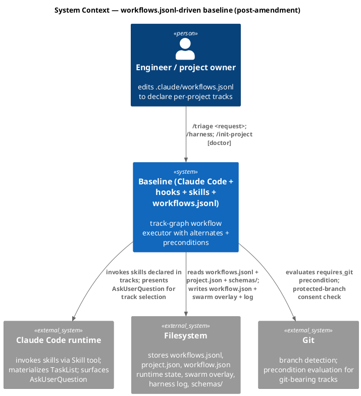

### C4 — Container

```plantuml
@startuml
!include <C4/C4_Container>
title Container — track-graph executor with alternates and migrator
System_Boundary(baseline, "Baseline") {
  Container(triage, "triage skill", "Markdown + Claude", "LLM-driven track selector; AskUserQuestion confirm; materializes TaskList")
  Container(harness, "harness skill", "Markdown + Claude", "graph executor: walk DAG; resolve alternates via preconditions; expand sub-tracks; dispatch can_parallel clusters; migrate pre-§18 workflow.json")
  Container(swarmplan, "swarm-plan skill", "Markdown + Claude", "writes runtime sub-track overlay to .claude/state/swarm/<slug>.jsonl")
  Container(initproject, "/init-project command", "Markdown + Claude", "seeds workflows.jsonl + schemas/ on first install")
  Container(doctor, "/init-project doctor", "Markdown + Claude", "interactive drift detector + fixer for workflows.jsonl + schemas/ + Article IV mirrors")
  Container(audit, "audit-baseline.sh", "Bash + Python3", "validates workflows.jsonl schema + Article IV invariants + four-way mirror")
  ContainerDb(workflows_jsonl, ".claude/workflows.jsonl", "JSONL file", "canonical track set (one Track per line)")
  ContainerDb(schemas_dir, ".claude/schemas/", "Directory", "JSON Schema documents referenced by Track.$schema")
  ContainerDb(project_json, ".claude/project.json", "JSON file", "per-project engineering config; additions block unchanged")
  ContainerDb(workflow_json, ".claude/state/workflow.json", "JSON file", "per-workflow runtime state: track_id, completed nodes, exceptions")
  ContainerDb(swarm_overlay, ".claude/state/swarm/<slug>.jsonl", "JSONL file", "runtime sub-track overlay; merged into workflows.jsonl view at load time")
  ContainerDb(seed_md, "docs/init/seed.md §3, §18", "Markdown", "constitutional schema declaration; .claude/ tooling convention")
  ContainerDb(claude_md, "CLAUDE.md Article IV", "Markdown", "binding invariants on every track (mirrors seed.md §18)")
}
Rel(triage, workflows_jsonl, "reads + validates; classifies user request via LLM; selects one track")
Rel(triage, schemas_dir, "dereferences Track.$schema for validation")
Rel(triage, workflow_json, "writes track_id + slug + exceptions + completed:[]")
Rel(harness, workflows_jsonl, "loads track from track_id")
Rel(harness, swarm_overlay, "loads runtime sub-track overlay if present")
Rel(harness, workflow_json, "reads + migrates pre-§18 shape; updates completed[] per node")
Rel(swarmplan, swarm_overlay, "writes sub-track entry at runtime")
Rel(initproject, workflows_jsonl, "writes canonical 4-track set on first install")
Rel(initproject, schemas_dir, "writes schema documents on first install")
Rel(doctor, workflows_jsonl, "validates + offers fixes")
Rel(doctor, schemas_dir, "validates + offers fixes")
Rel(doctor, claude_md, "checks four-way mirror integrity")
Rel(audit, workflows_jsonl, "validates schema + Article IV invariants")
Rel(audit, claude_md, "verifies Article-IV / §18 mirror")
@enduml
```

### C4 — Component (changed containers only)

Four containers change internally: triage (LLM-driven selector), harness (graph executor + migrator), swarm-plan (overlay writer), `/init-project doctor` (new).

#### Triage — LLM-driven track selector with AskUserQuestion confirm

```plantuml
@startuml
!include <C4/C4_Component>
title Component — triage skill (LLM-driven selector)
Container_Boundary(triage, "triage skill") {
  Component(load_workflows, "Step 1: Load workflows.jsonl", "instruction", "parse JSONL line-by-line; reject malformed lines with named errors citing line + schema rule")
  Component(load_overlay, "Step 2: Merge swarm overlay (if present)", "instruction", "load .claude/state/swarm/<slug>.jsonl into the same Track[] view if a prior workflow's swarm-plan emitted one")
  Component(validate_invariants, "Step 3: Validate Article IV invariants", "instruction", "I1-I11 checks: ids, skill/sub_track XOR, edge resolution, acyclicity, consent gate presence, sub_track selectability, skill resolution, gate ordering, alternates congruence, preconditions resolve")
  Component(git_detect, "Step 4: Git-repo detection", "instruction", "evaluates project-level preconditions: requires_git, etc.")
  Component(llm_classify, "Step 5: LLM-classify request", "instruction", "Claude reads each selectable Track's {track_id, name, description, selector_hints[]} and the user's natural-language request; picks the most-fitting track + ranks alternates by plausibility")
  Component(ask_user, "Step 6: AskUserQuestion (always)", "instruction", "present the picked track + top-N alternates via AskUserQuestion; user confirms or picks an alternate; never threshold-based auto-skip")
  Component(write_wf, "Step 7: Write workflow.json", "instruction", "persists track_id, slug, exceptions, entry node id, completed:[]")
  Component(materialize, "Step 8: Materialize TaskList", "instruction", "for each non-excepted node in dependency order: TaskCreate; TaskUpdate addBlockedBy")
  Component(next_step, "Step 9: Tell user next", "instruction", "names the entry node's skill or /harness")
}
Rel(load_workflows, load_overlay, "passes Track[]")
Rel(load_overlay, validate_invariants, "passes Track[] + overlay merge")
Rel(validate_invariants, git_detect, "passes")
Rel(git_detect, llm_classify, "passes precondition context")
Rel(llm_classify, ask_user, "passes picked track + ranked alternates")
Rel(ask_user, write_wf, "passes confirmed track")
Rel(write_wf, materialize, "passes")
Rel(materialize, next_step, "passes")
@enduml
```

#### Harness — graph executor + selector resolver + migrator

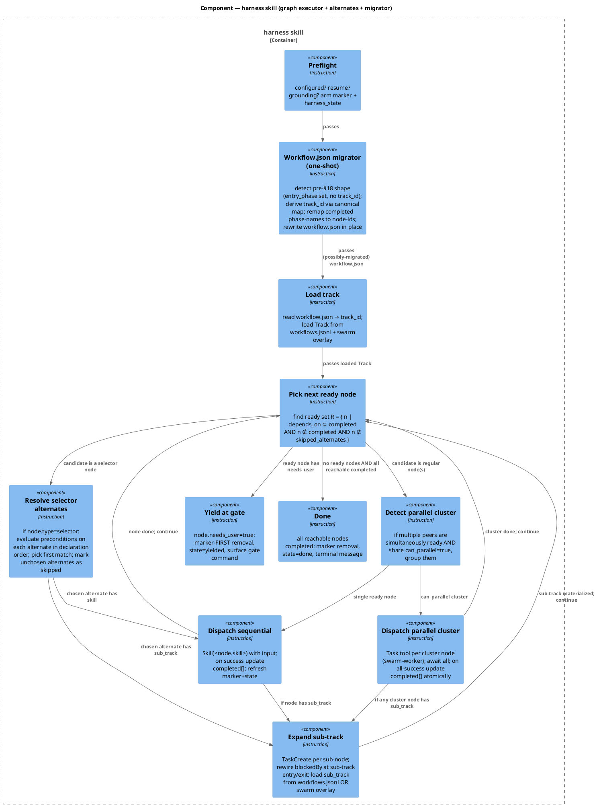

### Data model — class diagram

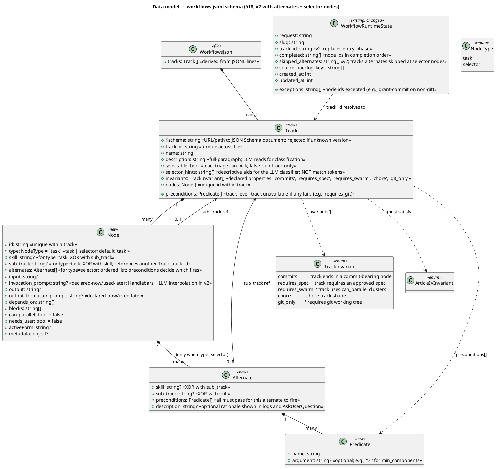

#### Schema migration

The "migration" is the new schema declaration in `seed.md §18` + Article IV amendment + new files. The class diagram above is the schema; the file's initial content is the migrated 4-track canonical set.

```sql
-- forward
-- 1. Declare schema in docs/init/seed.md §18 + mirror to src/seed.template.md.
-- 2. Add .claude/ tooling convention to docs/init/seed.md §3 (Directory structure) + mirror.
-- 3. Amend CLAUDE.md Article IV + mirror to src/CLAUDE.template.md.
-- 4. Add NEW DIRECTORY .claude/schemas/ with workflow-track.v1.json (JSON Schema document referenced by Track.$schema).
-- 5. Add NEW FILE .claude/workflows.jsonl with the migrated canonical track set:
--    Line 1: track_id="intake-full"           — canonical 11-phase pipeline; selector node at Phase 6 with [swarm, tdd] alternates
--    Line 2: track_id="spec-entry"            — bugfix-with-spec pipeline
--    Line 3: track_id="tdd-quickfix"          — quickfix pipeline (no spec)
--    Line 4: track_id="chore"                 — chore pipeline
--    Line 5: track_id="swarm-implementation"  — sub-track (selectable=false); {swarm-plan → approve-swarm → swarm-dispatch}; preconditions: requires_git, requires_min_components:3
--    Line 6: track_id="tdd-worker-chain"      — sub-track (selectable=false); {tdd} (with internal worker chain)
-- 6. Add NEW FILE src/.claude/workflows.template.jsonl (pristine 4 selectable + 2 sub).
-- 7. Add NEW FILE src/.claude/schemas/workflow-track.v1.json (pristine schema).
-- 8. Add .claude/workflows.jsonl, .claude/schemas/, .claude/state/swarm/*.jsonl to NEVER_TOUCH lists in src/cli/install.js + scripts/build-manifest.mjs.
-- 9. Modify .claude/skills/triage/SKILL.md: rewrite to be the LLM-driven selector (Component diagram above).
-- 10. Modify .claude/skills/harness/SKILL.md: rewrite to be the graph executor + migrator (Component diagram above).
-- 11. Modify .claude/skills/swarm-plan/SKILL.md: write runtime overlay to .claude/state/swarm/<slug>.jsonl.
-- 12. Modify .claude/commands/init-project.md: add Step 6.X for seeding workflows.jsonl + schemas/.
-- 13. Add NEW COMMAND .claude/commands/init-project-doctor.md (the /init-project doctor sub-command).
-- 14. Modify .claude/skills/audit-baseline/audit.sh: validate workflows.jsonl + four-way mirror.
-- 15. This repo's .claude/workflows.jsonl gets a cli-copy-review node in intake-full and tdd-quickfix tracks (between memory-flush and grant-commit).
-- 16. Update tests under tests/ per the Test plan section.

-- reverse
-- Single commit revert. Removes all new files; reverts skills.
-- In-flight workflow.json files written under the new shape are forward-incompatible after revert.
-- The one-shot migrator (AC-018) is forward-direction-only by design; a reverse migrator is YAGNI for the single-commit-revert path.
```

`.claude/workflows.jsonl` is `NEVER_TOUCH`. `.claude/schemas/` is `NEVER_TOUCH` at the directory level (a small generalization to NEVER_TOUCH semantics — currently it's exact-path; this work introduces glob-or-prefix matching in `install.js` and `build-manifest.mjs` to handle directories).

#### Proposed `docs/init/seed.md` §18 text (verbatim for the reviewer)

The full proposed text is too long to inline here verbatim; what follows is the structural skeleton the spec binds the TDD phase to write:

```markdown
## §18 — Workflow definitions and Article IV invariants

### 17.1 Source of truth
`.claude/workflows.jsonl` is the canonical source for every workflow this baseline can execute. One Track per line. The file is project-owned and NEVER_TOUCH.

### 17.2 Track schema (referenced by Track.$schema)
[Track record shape: $schema, track_id, name, description, selectable, selector_hints[], preconditions[], invariants[], nodes[]]
[Node record shape: id, type, skill, sub_track, alternates[], input, invocation_prompt, output, output_formatter_prompt, depends_on[], blocks[], can_parallel, needs_user, activeForm, metadata]
[Alternate record shape: skill, sub_track, preconditions[], description]
[Predicate record shape: name, argument]

### 17.3 Article IV invariants (I1..I11)
[I1-I11 verbatim per the class diagram]

### 17.4 Predicate vocabulary (v1)
- requires_git
- requires_user_override:<value>
- requires_min_components:<int>
- requires_phase_completed:<phase>
- requires_skill_present:<skill_id>

### 17.5 invocation_prompt / output_formatter_prompt — declared, deferred
Fields are part of the v1 schema; harness ignores them. v2 will actuate via Handlebars + LLM interpolation.

### 17.6 Migration from pre-§18 workflow.json
[Canonical entry_phase → track_id map + node-id remap rules]
```

#### Proposed `CLAUDE.md` Article IV text (verbatim for the reviewer)

Article IV is replaced wholesale. The new version is approximately:

```markdown
## Article IV — Workflow definition and invariants (MANDATORY)

`.claude/workflows.jsonl` is the source of truth for every workflow this baseline can execute. Tracks declared therein bind via the invariants below. Triage and harness ARE actuators of those tracks. The phase ordering rules previously embedded in this Article live now in the canonical Track records in workflows.jsonl.

### Invariants every Track SHALL satisfy
I1 — Unique track_id across workflows.jsonl.
I2 — Unique node.id within a track.
I3 — type=task nodes carry exactly one of {skill, sub_track}. type=selector nodes carry non-empty alternates[].
I4 — All depends_on / blocks references resolve to node ids in the same track.
I5 — The dependency DAG is acyclic.
I6 — Tracks with the 'commits' invariant SHALL include a needs_user 'grant-commit' node ordered in the DAG before the node whose skill is 'commit'.
I7 — sub_track references SHALL resolve to a Track with selectable=false.
I8 — Every skill: reference SHALL resolve to a skill in EXPECTED_SKILLS ∪ project.json additions.skills.
I9 — needs_user=true nodes SHALL appear in dependency order before any node that depends on their consent token.
I10 — A selector node's alternates SHALL share identical depends_on and blocks lists (interchangeable in the DAG).
I11 — Every Predicate.name SHALL resolve to a known v1 predicate.

### Constitutional precedence (extends Article I)
- `seed.md §18` declares the schema, invariants, and predicate vocabulary.
- `CLAUDE.md` Article IV (this Article) binds the invariants on every Track.
- `.claude/workflows.jsonl` IS the policy — every project owns its own.
- Triage and harness SHALL NOT carry hardcoded track templates.

### Validation
At three points: install/upgrade (workflows.jsonl + schemas/); triage time (selected track); harness time (per-node).

### git-conditional behavior
Tracks declaring 'git_only' or whose preconditions include 'requires_git' are unavailable on non-git projects. The LLM classifier excludes them; the user is not offered them via AskUserQuestion.

### Consent gates
needs_user=true nodes correspond to consent commands typed by the user (e.g., /approve-spec, /grant-commit). Claude SHALL NOT forge consent. Gate semantics are unchanged from the previous Article IV.
```

### Behavior — sequence per AC

#### §Behavior #1 — LLM-driven track selection with AskUserQuestion confirm

Covers `SP-001` (AC-009) + `SP-013` (AC-021).

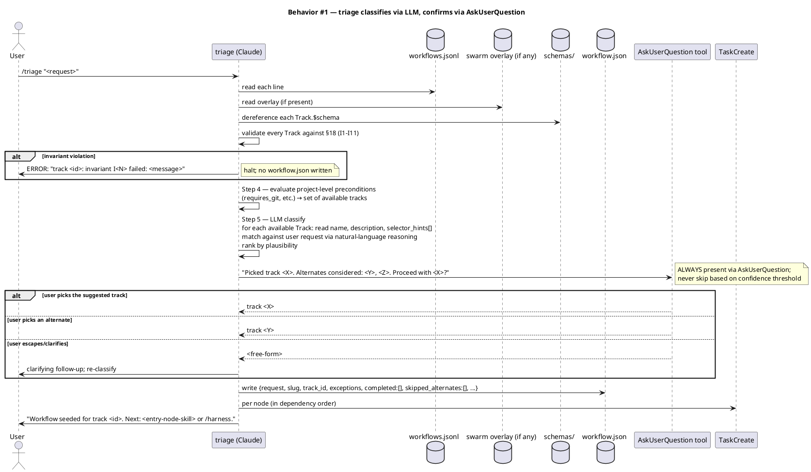

#### §Behavior #2 — Graph execution: sequential + parallel-cluster dispatch

Covers `SP-002` (AC-010).

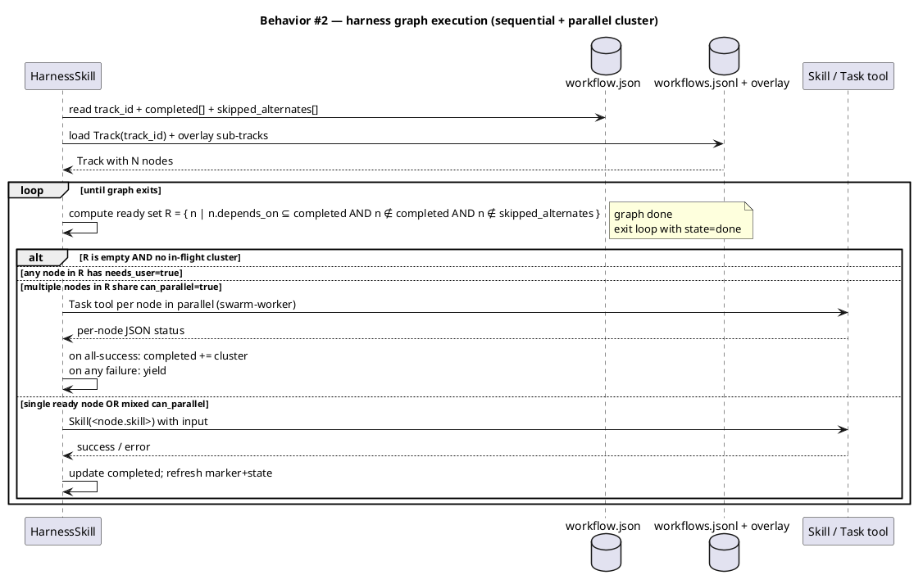

#### §Behavior #3 — Sub-track expansion

Covers `SP-003` (AC-011).

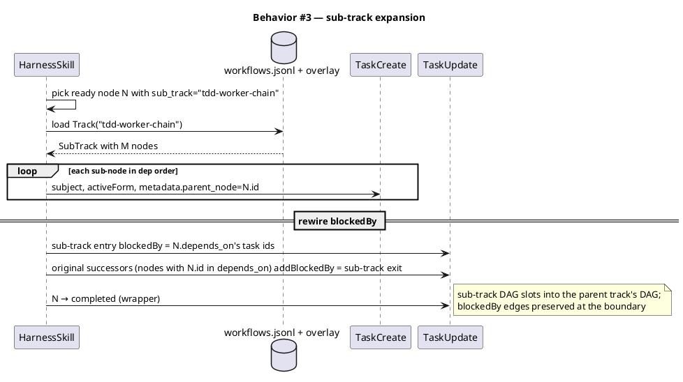

#### §Behavior #4 — Selector node resolution via preconditions

Covers `SP-014` (AC-017).

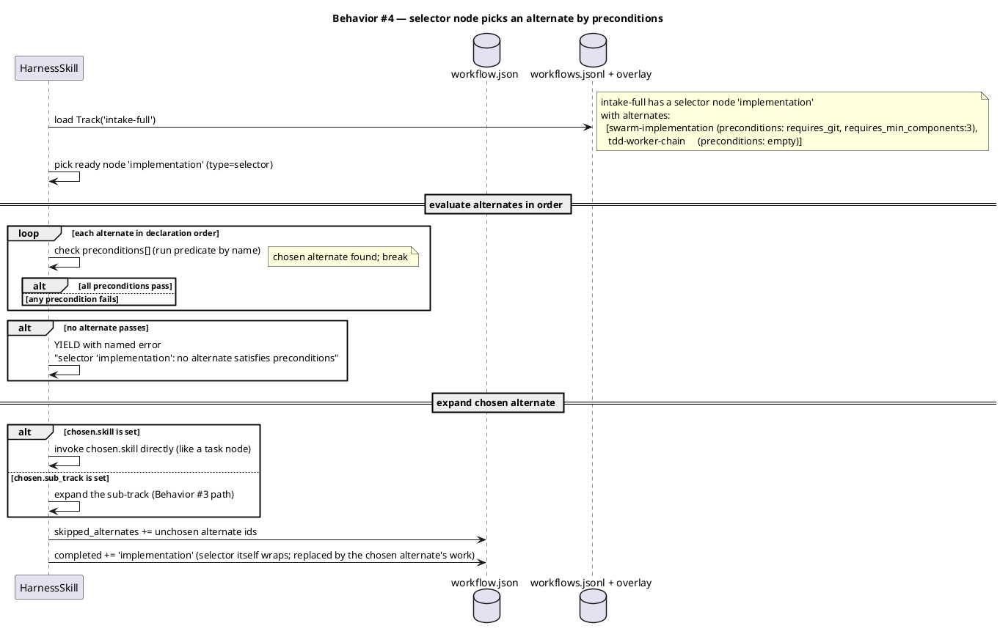

#### §Behavior #5 — Validation failures (schema + invariants)

Covers `SP-004` (AC-012), `SP-005` (AC-013), `SP-006` (AC-014), `SP-015` (AC-022).

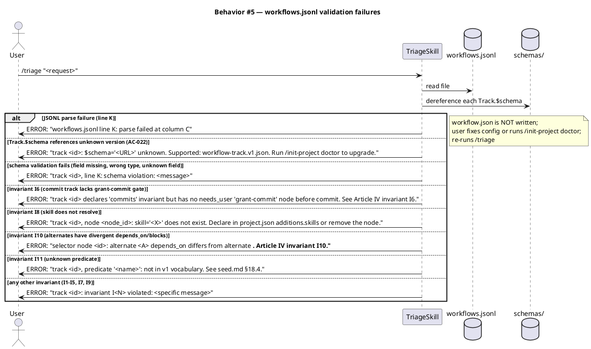

#### §Behavior #6 — Pre-§18 workflow.json migrator

Covers `SP-016` (AC-018).

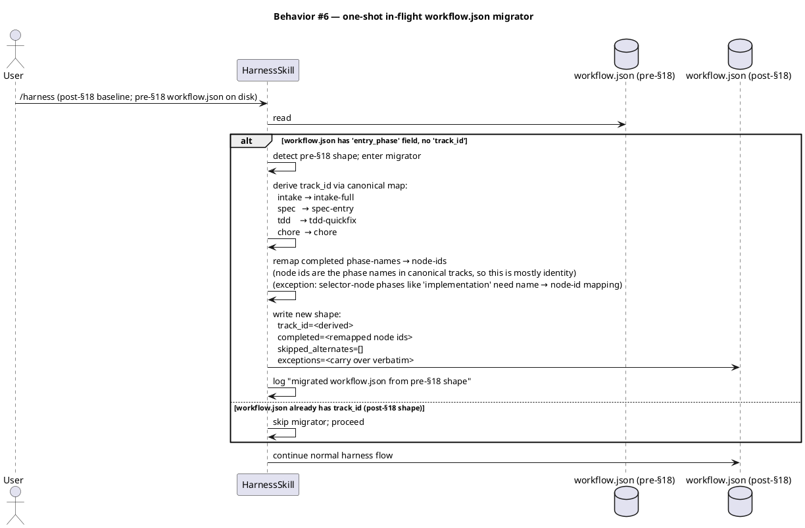

#### §Behavior #7 — `/init-project doctor` detects and fixes drift

Covers `SP-017` (AC-019), `SP-018` (AC-020).

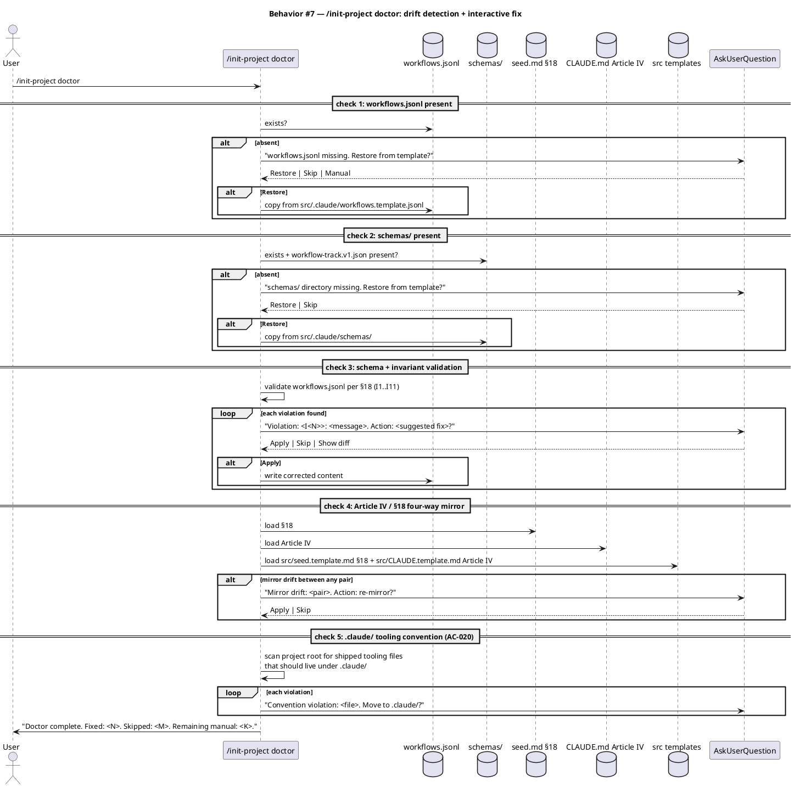

#### §Behavior #8 — Install + upgrade lifecycle

Covers `SP-011` (AC-007), `SP-012` (AC-008).

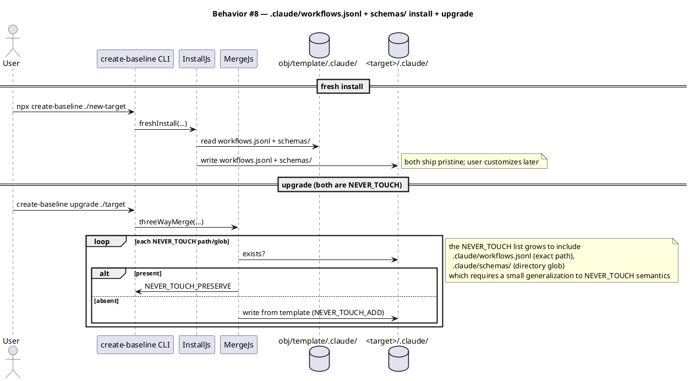

#### §Behavior #9 — Byte-equivalent migration + cli-copy-review retrofit

Covers `SP-008` (AC-016), `SP-009` (AC-002).

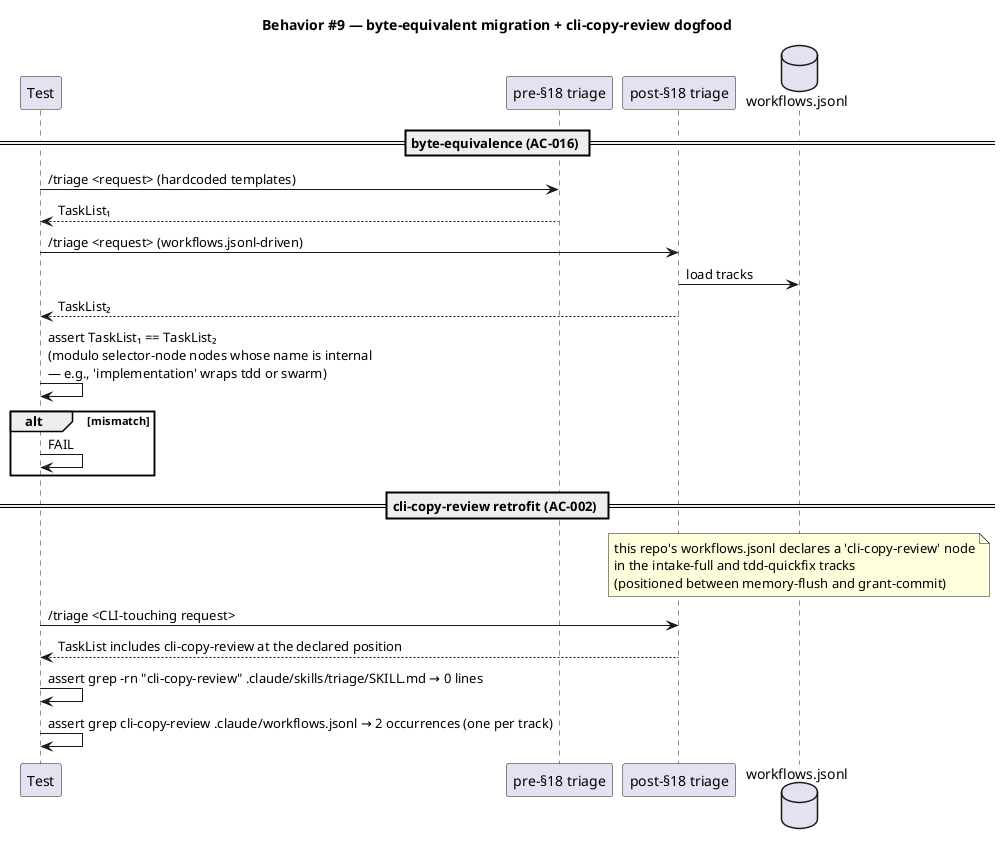

#### §Behavior #10 — Article IV mirror + audit-baseline

Covers `SP-007` (AC-015), `SP-010` (AC-006).

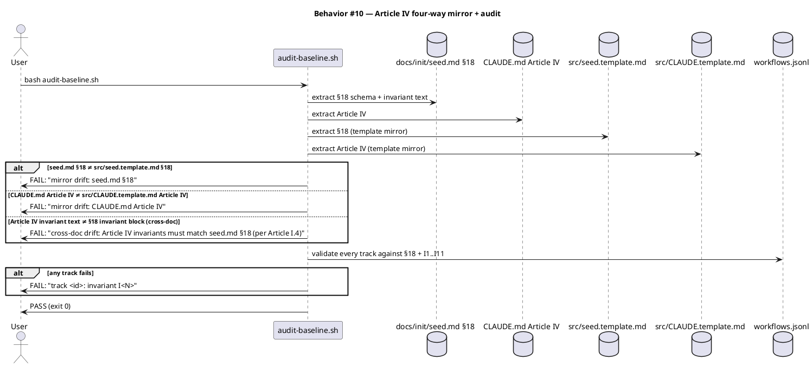

### State — core entity

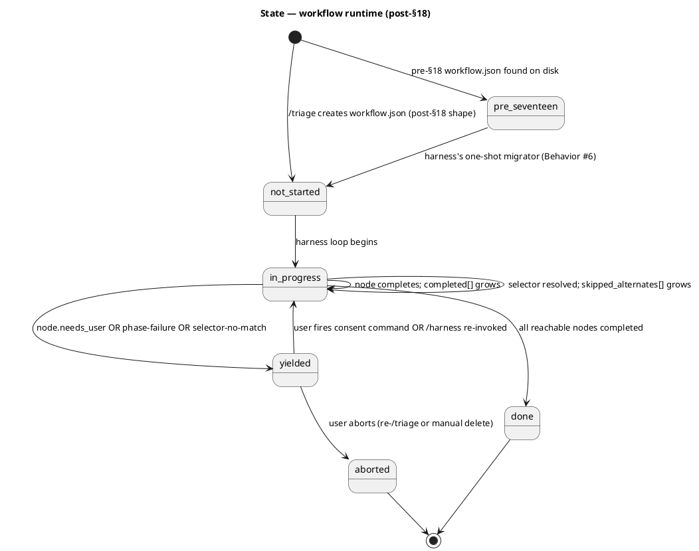

### Dependencies — graph

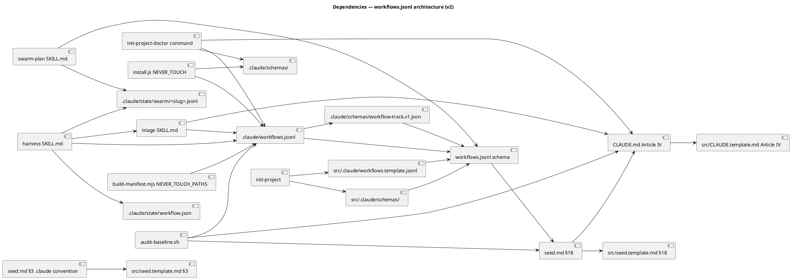

### Contracts

| Kind | Name | Input | Output | Errors | Idempotent |
|---|---|---|---|---|---|
| Config schema | `.claude/workflows.jsonl` | JSONL file | Track[] | parse / schema / invariant violations halt | yes |
| Track | one JSONL line | `{$schema, track_id, name, description, selectable, selector_hints[], preconditions[], invariants[], nodes[]}` | seedable when selectable + preconditions pass | I1-I11 | yes |
| Node | `Node` record | `{id, type, skill?, sub_track?, alternates?, ...}` | one TaskCreate (or selector resolution) | I3, I4, I8, I10, I11 | yes |
| Selector node | `Node{type:"selector", alternates[]}` | `alternates[].{skill OR sub_track, preconditions[]}` | one chosen alternate dispatched; others marked skipped_alternates | I10 (alternates congruence), no-match yields | yes |
| Predicate | `{name, argument?}` | named predicate in v1 vocabulary | bool (pass/fail) | I11 (unknown predicate) | yes (deterministic given inputs) |
| Migrator | harness preflight detector | pre-§18 workflow.json | post-§18 workflow.json (in place) | unrecognized entry_phase, no canonical map | yes (idempotent on already-migrated input) |
| Doctor | `/init-project doctor` | none (interactive) | repaired workflows.jsonl + schemas/ + Article IV mirrors; report of fixes/skips | per-check named errors | yes (re-running offers same set of fixes) |
| CLI command | `/triage <request>` | natural-language request | populated workflow.json + materialized TaskList | invariant violations | re-runs replace |
| CLI command | `/init-project` (existing) | (existing) | populated workflows.jsonl + schemas/ on first run | (existing) | yes |

### Libraries and versions

No new third-party library APIs. The schema validation is inline instructions; the migrator is inline instructions; the doctor's interactive UI uses `AskUserQuestion` (already available in Claude Code's tool surface). `$schema` is a reference, not a runtime dispatch — editors can fetch it; we don't.

| Library@version | Purpose | Key APIs | Confirmed via context7 |
|---|---|---|---|
| *(no third-party libraries introduced)* | — | — | n/a |

### Alternatives considered

| Alt | Summary | Rejected because |
|---|---|---|
| Narrow `additions.workflow_tasks` (Draft 1) | Inject tasks at named anchors in hardcoded triage templates | User chose track-graph architecture instead |
| Track-graph v1 (Draft 2 without alternates) | Single canonical track per work-kind; swarm-vs-tdd decision lives in harness code | User chose alternates + preconditions for cleaner declarative model |
| Algorithmic substring-match classifier | Rank tracks by selector_hint length matching the request | User chose LLM-driven classification — selector_hints become descriptive aids, not match tokens |
| Confidence-threshold auto-skip on classifier match | Skip AskUserQuestion when top match is high-confidence | User: "ask user question is the only way, and yes this happens a lot." Always confirm. |
| swarm-plan mutates workflows.jsonl | Append sub-track entries directly to the source file | Couples runtime to config; baseline upgrades that change canonical tracks would conflict with runtime mutations |
| Refuse + restart on pre-§18 workflow.json | Detect old shape and tell user to start over | User: "UX is important when we are building for other developers." Migrator path chosen. |
| Defer $schema field to v2 | YAGNI: don't add schema versioning until v2 needs it | User: "yagni at this point is more technical debt for future." Declare $schema now; rejecting unknown versions early prevents silent drift later. |

## Design calls

This spec's write set targets `.claude/skills/triage/SKILL.md`, `.claude/skills/harness/SKILL.md`, `.claude/skills/swarm-plan/SKILL.md`, `.claude/skills/audit-baseline/audit.sh`, `.claude/commands/init-project.md`, `.claude/commands/init-project-doctor.md` (new), `.claude/workflows.jsonl` (new), `.claude/schemas/workflow-track.v1.json` (new), `src/.claude/workflows.template.jsonl` (new), `src/.claude/schemas/workflow-track.v1.json` (new), `docs/init/seed.md` (§3 + §18), `src/seed.template.md` (mirror), `CLAUDE.md` (Article IV), `src/CLAUDE.template.md` (mirror), `src/cli/install.js` (NEVER_TOUCH), `scripts/build-manifest.mjs` (NEVER_TOUCH_PATHS), and `tests/`. None intersect `project.json → tdd.ui_globs`.

- *(none)*

## Acceptance criteria

| ID | Criterion (given / when / then) | Upstream AC | Sequence |
|---|---|---|---|
| SP-001 | Given `workflows.jsonl` declares a `tdd-quickfix` track with 4 nodes (`scenario → implement → verify → commit`), when triage classifies a request to it, then the seeded TaskList contains those 4 tasks with `addBlockedBy` matching `depends_on[]`. | AC-009 | §B#1 |
| SP-002 | Given a Track contains a `can_parallel: true` cluster of 3 peer nodes (identical `depends_on[]`), when harness reaches the cluster, then all 3 dispatch concurrently via `Task` tool (swarm-worker), and `completed[]` updates atomically on all-success. | AC-010 | §B#2 |
| SP-003 | Given a Track node `N` carries `sub_track: "tdd-worker-chain"`, when harness invokes `N`, then sub-track nodes are TaskCreate'd, blockedBy is rewired at entry/exit, and `N` is marked completed as a wrapper. | AC-011 | §B#3 |
| SP-004 | Given a Track declares `invariants: ["commits"]` but lacks a `needs_user: true` `grant-commit` node ordered before `commit`, when triage loads the file, then triage halts with Article IV invariant-I6 named error citing the track id. | AC-012 | §B#5 |
| SP-005 | Given a Track node declares `skill: "<unknown>"` not in EXPECTED_SKILLS ∪ additions.skills, when triage loads, then triage halts with invariant-I8 named error citing track/node ids. | AC-013 | §B#5 |
| SP-006 | Given a malformed JSONL line OR a Track that violates the §18 schema, when triage or harness reads it, then the read halts with a named error citing file path, line number, and schema rule. No `workflow.json` is written. | AC-014 | §B#5 |
| SP-007 | Given Article IV is amended in CLAUDE.md (§18 added to seed.md) and the mirrors in `src/CLAUDE.template.md` / `src/seed.template.md` are byte-equal, when `audit-baseline.sh` runs, then it exits 0 and mirror checks pass. Breaking one mirror SHALL fail audit. | AC-015 | §B#10 |
| SP-008 | Given the 4 canonical hardcoded triage templates are migrated to `workflows.jsonl`, when triage receives identical requests pre- vs post-amendment, then the seeded TaskList is byte-equivalent (modulo selector-node wrapper ids whose names are deliberately new). | AC-016 | §B#9 |
| SP-009 | Given this repo's `.claude/workflows.jsonl` declares a `cli-copy-review` node in `intake-full` and `tdd-quickfix` tracks (positioned between memory-flush and grant-commit), when triage selects either track, then the seeded TaskList includes cli-copy-review at the declared position AND `grep -rn "cli-copy-review" .claude/skills/triage/SKILL.md` returns 0 lines. | AC-002, AC-009 | §B#9 |
| SP-010 | Given the hardcoded "Conditional: CLI copy review" rule is removed from triage SKILL.md and the new track-selector logic is in place, when `audit-baseline.sh` runs, then it exits 0 and triage's hash matches the regenerated manifest entry. | AC-006 | §B#10 |
| SP-011 | Given an installed target with a user-customized `workflows.jsonl`, when `create-baseline upgrade <target>` runs, then the file is preserved verbatim via NEVER_TOUCH_PRESERVE; the user's tracks remain intact. | AC-007 | §B#8 |
| SP-012 | Given a fresh install, when it completes, then `<new-target>/.claude/workflows.jsonl` and `<new-target>/.claude/schemas/` exist and validate against §18. | AC-008 | §B#8 |
| SP-013 | Given triage classifies the request via LLM reasoning over track descriptions + selector_hints, when triage presents picked + alternate tracks via `AskUserQuestion`, then the user's pick (suggested OR alternate OR escape-to-clarify) is the track materialized into the TaskList. | AC-021 | §B#1 |
| SP-014 | Given a track contains a selector node with two alternates (swarm sub-track with preconditions `requires_git` + `requires_min_components:3`, tdd sub-track with empty preconditions), when harness reaches the selector AND `requires_git` fails (non-git project), then the swarm alternate goes to `skipped_alternates[]` and the tdd sub-track expands inline. | AC-017 | §B#4 |
| SP-015 | Given a Track carries `"$schema": "<URL>"` whose version is not in `{workflow-track.v1.json}`, when triage or doctor reads it, then it halts with named error citing unknown version + supported versions + remediation pointer to `/init-project doctor`. | AC-022 | §B#5 |
| SP-016 | Given an installed target has a pre-§18 `workflow.json` (`entry_phase` field set, no `track_id`), when the user runs `/harness` post-upgrade, then a one-shot migrator transforms it in place — track_id derived via canonical map, completed phase-names mapped to node ids — before harness loads it. | AC-018 | §B#6 |
| SP-017 | Given `.claude/workflows.jsonl` has schema/invariant violations OR is absent, when the user runs `/init-project doctor`, then the doctor detects each violation, reports each with remediation, and on user confirmation applies fixes; re-runs report pass/fail. | AC-019 | §B#7 |
| SP-018 | Given the `.claude/` tooling convention is documented in seed.md §3, when `/init-project doctor` runs on a project with shipped tooling outside `.claude/` (other than CLAUDE.md / .mcp.json), then doctor flags the convention violation and offers to move the file. | AC-020 | §B#7 |

## Test plan

| Category | Scenario | Expected | Covers |
|---|---|---|---|
| Golden path | Triage selects intake-full for a feature request | LLM picks it; AskUserQuestion presents picked + alternates; user confirms; TaskList seeded | SP-001, SP-013 |
| Golden path | Triage selects chore for a docs-edit request | LLM picks chore; AskUserQuestion confirms; chore-track TaskList | SP-001, SP-013 |
| Golden path | Selector resolves swarm alternate on git repo with 3+ components | swarm-implementation sub-track expanded; tdd alternate skipped | SP-014 |
| Golden path | Selector resolves tdd alternate on non-git repo | tdd-worker-chain sub-track expanded; swarm alternate skipped | SP-014 |
| Golden path | Selector resolves tdd alternate when user explicitly overrides ("use solo") | user override predicate flips selection; swarm skipped | SP-014 |
| Golden path | Harness reaches can_parallel cluster of 3 swarm-workers | All 3 dispatched via Task tool; completed[] updates after all-success | SP-002 |
| Golden path | Sub-track expansion: node has sub_track="tdd-worker-chain" | sub-nodes TaskCreate'd; blockedBy rewired; wrapper completed | SP-003 |
| Golden path | This repo's tracks include cli-copy-review nodes | TaskList contains them at the declared position; no hardcoded reference in triage SKILL.md | SP-009 |
| Golden path | audit-baseline post-amendment | exits 0; mirror checks pass; manifest hash matches | SP-007, SP-010 |
| Lifecycle | Fresh install creates workflows.jsonl + schemas/ from template | both present; schema-valid | SP-012 |
| Lifecycle | Upgrade preserves user-customized workflows.jsonl + schemas/ | NEVER_TOUCH_PRESERVE; bytes intact | SP-011 |
| Lifecycle | Pre-§18 workflow.json on disk; user runs /harness | migrator transforms in place; harness proceeds | SP-016 |
| Lifecycle | Pre-§18 workflow.json with unmapped entry_phase | migrator yields with named error; user runs /triage to restart | SP-016 |
| Lifecycle | /init-project doctor on a project with missing workflows.jsonl | offers restore-from-template; on accept, file present | SP-017 |
| Lifecycle | /init-project doctor on a project with shipped tooling at root | flags convention violation; offers move to .claude/ | SP-018 |
| Migration | Byte-equivalent: pre vs post triage on identical request | TaskLists match (subjects, metadata.phase, blockedBy edges) | SP-008 |
| Contract violation | JSONL malformed line K | named error citing line K | SP-006 |
| Contract violation | Track missing required field | named error citing track + field | SP-006 |
| Contract violation | Track with unknown field (strict schema) | named error citing unknown field | SP-006 |
| Contract violation | Node has both skill and sub_track | I3 named error | SP-006 |
| Contract violation | Node has neither skill nor sub_track AND not type=selector | I3 named error | SP-006 |
| Contract violation | type=selector node with empty alternates[] | I3 named error | SP-006 |
| Contract violation | Selector alternates have divergent depends_on | I10 named error | SP-006 |
| Contract violation | depends_on references unknown node id | I4 named error | SP-006 |
| Contract violation | DAG has a cycle | I5 named error | SP-006 |
| Contract violation | commits-track without grant-commit gate | I6 named error | SP-004 |
| Contract violation | Skill in node does not resolve | I8 named error | SP-005 |
| Contract violation | needs_user node ordered AFTER dependent node | I9 named error | SP-006 |
| Contract violation | Predicate name unknown | I11 named error | SP-006 |
| Contract violation | Track.$schema references unknown version | named error citing $schema + supported versions | SP-015 |
| Concurrency | Can_parallel cluster with mixed success/failure | yield on first failure; reason names the node | SP-002 |
| Concurrency | Sub-track expansion mid-flight | TaskList shows sub-nodes; no edge orphaning | SP-003 |
| Regression trap | After retrofit, grep cli-copy-review in baseline-owned skills returns 0 lines | confirms migration | SP-009, SP-010 |
| Regression trap | Article IV / §18 mirror drift introduced manually | audit detects + FAILS | SP-007 |
| Regression trap | Pre-§18 audit-baseline tests still pass | unchanged regression coverage | SP-007, SP-010 |

## Observability

| Signal | Name | Shape | Purpose |
|---|---|---|---|
| Log | `harness/<slug>.log:track-loaded` | `<UTC> track-loaded: track_id=<X> nodes=<N> overlay=<bool>` | Confirms load + overlay merge |
| Log | `harness/<slug>.log:selector-resolved` | `<UTC> selector: node=<id> chose=<alternate-id> reason=<predicate-name pass/fail summary>` | Per selector resolution |
| Log | `harness/<slug>.log:dispatch` | `<UTC> dispatch: node=<id> skill=<name> mode=sequential|parallel` | One per node dispatch |
| Log | `harness/<slug>.log:cluster-dispatch` | `<UTC> cluster: peers=<csv> mode=parallel` | When can_parallel fires |
| Log | `harness/<slug>.log:sub-track-expand` | `<UTC> expand: parent=<id> sub_track=<id> added=<N>` | One per expansion |
| Log | `harness/<slug>.log:migrate` | `<UTC> migrated: from=entry_phase=<X> to=track_id=<Y>` | Migrator fired |
| Log | `harness/<slug>.log:invariant-violation` | `<UTC> invariant: I<N> track=<id> node=<id> message=<text>` | Validation failure |
| Log | `init/<UTC>.doctor.log` | per-check pass/fail + per-fix accept/skip | Doctor session record |

## Rollout

This is a major refactor: triage rewrite, harness rewrite, swarm-plan rewrite, new /init-project doctor command, new files (workflows.jsonl, schemas/), constitutional amendment (CLAUDE.md Article IV + seed.md §18), four-way mirror, NEVER_TOUCH semantics generalization, byte-equivalence migration, in-flight workflow.json migrator. Lands as multiple commits in one workflow but as a single coordinated landing.

- **Feature flag**: none. Constitutional amendment; partial rollout = inconsistent state.
- **Migration order** (during /tdd, in dependency order):
  1. Write `.claude/schemas/workflow-track.v1.json` (the JSON Schema document referenced by Track.$schema).
  2. Add §3 + §18 to `docs/init/seed.md`; mirror to `src/seed.template.md`.
  3. Amend Article IV in `CLAUDE.md`; mirror to `src/CLAUDE.template.md`.
  4. Add `src/.claude/workflows.template.jsonl` + `src/.claude/schemas/` (pristine ship-time).
  5. Add `.claude/workflows.jsonl` (this repo's live config; 4 selectable + 2 sub + cli-copy-review insertions).
  6. Generalize NEVER_TOUCH semantics in `src/cli/install.js` + `scripts/build-manifest.mjs` to accept directory globs.
  7. Add `.claude/workflows.jsonl` + `.claude/schemas/` to NEVER_TOUCH; add `.claude/state/swarm/` to runtime-state exclusion.
  8. Rewrite `.claude/skills/triage/SKILL.md` to LLM-driven selector with AskUserQuestion confirm.
  9. Rewrite `.claude/skills/harness/SKILL.md` to graph executor + migrator + selector resolver.
  10. Rewrite `.claude/skills/swarm-plan/SKILL.md` to emit runtime sub-track overlay.
  11. Update `.claude/commands/init-project.md` to seed workflows.jsonl + schemas/.
  12. Add `.claude/commands/init-project-doctor.md` (new).
  13. Update `.claude/skills/audit-baseline/audit.sh` to validate workflows.jsonl + four-way mirror.
  14. Tests: per the Test plan; ≥1 per AC.
  15. Build template + run audit. Stage 4 gate is canary.
- **Canary**: the build's audit gate. Downstream installs only receive on next `create-baseline upgrade`.

## Rollback

- **Kill-switch**: `git revert <commit-set>`. Removes new files; reverts skill bodies.
- **In-flight workflows post-revert**: workflow.json files written under the new shape are forward-incompatible with the reverted (old) code. On revert, in-flight workflows restart via /triage. Acceptable for a constitutional change.
- **Signal to roll back**: audit fails OR any new-corpus test fails — both surface in build Stage 4 before commit lands.

## Archive plan

- Defaults *(automatic)*: intake, scout, research, spec, rendered diagrams, spec approval token.
- Extras *(list any non-default files)*:
  - *(none)*

## Open questions

The user resolved all 10 of the previous draft's open questions. The remaining items below are smaller and resolvable in /tdd rather than blocking /approve-spec.

- **OQ-A. Exact predicate vocabulary for v1.** Spec proposes `requires_git`, `requires_user_override:<value>`, `requires_min_components:<int>`, `requires_phase_completed:<phase>`, `requires_skill_present:<skill_id>`. Are all 5 needed for the canonical 4-track migration, or can we ship with 2-3 and add the rest when first needed? Lean: ship `requires_git` and `requires_min_components` for v1 (enough for the swarm-vs-tdd selector); declare the rest in seed.md §18.4 but reject them at parse time until implemented. YAGNI defaults pushback noted — could go either way.
- **OQ-B. Migrator's behavior on unmapped `entry_phase`.** Pre-§18 workflow.json could in principle carry an `entry_phase` that doesn't map cleanly (e.g., a custom track from a fork). Migrator should yield with named error and tell user to restart via /triage. Spec assumes this; called out for confirmation.
- **OQ-C. Doctor's exact UI surface.** Bash interactive (read line) OR via AskUserQuestion (single-question-per-fix)? Doctor lives under `.claude/commands/` which means it's user-typed slash command. AskUserQuestion is the more consistent UX. Lean AskUserQuestion.
- **OQ-D. JSON Schema document location.** `.claude/schemas/workflow-track.v1.json` proposed. Alternative: ship as a remote URL (e.g., `https://baseline.friedbotstudio.com/schemas/...`) for editor integration. Spec defaults local (offline-friendly); URL is opt-in via Track.$schema reference. Confirm.
- **OQ-E. `selector_hints[]` style guide.** Full-sentence descriptive phrases for the LLM, OR shorter keyword-style hints? Trade-off: longer = more accurate classification, shorter = faster Claude reads. Spec defaults full-sentence; defer to /tdd to settle the canonical examples.
