# Tier-1 "Merge" option — BASE-less stage + SessionStart nag

<!--
Technical spec. Produced by the `spec` skill.

Guard-enforced invariants:
  - Required ## headings: Goal, Design, Design calls, Acceptance criteria, Test plan.
  - Required diagram kinds: c4_context, c4_container, c4_component, sequence, class, dependency_graph.
  - Every ```plantuml``` fence must parse.

Approval: NEVER add "Status: Approved" — spec_approval_guard blocks it.
-->

## Context

| Input | Path |
|---|---|
| Intake | `docs/intake/tier1-merge-option.md` |
| BRD *(if any)* | — |
| Scout *(if any)* | `docs/scout/tier1-merge-option.md` |
| Research *(if any)* | `docs/research/tier1-merge-option.md` |

## Goal

After this spec ships, the tier-1 customization prompt offers a **Merge** option that defers reconciliation of a customized-but-BASE-less file to Claude Code: the CLI writes a BASE-less stage entry under `.claude/state/upgrade/<ts>/`, exits with the existing semantic-merge exit code (5), and the next Claude Code session surfaces a one-line nag pointing the user to `/upgrade-project`. The `/upgrade-project` skill reconciles BASE-less entries via a two-way (LOCAL-vs-INCOMING) procedure that runs alongside the existing three-way procedure.

## Non-goals

- **No in-tree `.upgrade` sidecar.** Staging is hidden under `.claude/state/upgrade/<ts>/` only.
- **No `project.json` field for pending-merge tracking.** Filesystem scan is truth.
- **No fifth tier-1 option.** Merge replaces Show diff; count stays at 4.
- **No tier-2 / tier-3 behavior changes.** Mechanical merge and three-way semantic staging continue unchanged.
- **No re-fetching BASE for tier-1 entries.** BASE is unrecoverable by construction; two-way reconciliation is the contract.
- **No non-TTY Merge.** The Merge option is TTY-only.
- **No audit trail for "Use new baseline" picks.** The "Use new baseline" choice continues to overwrite LOCAL with no stage record, as today. Writing a `RECONCILED` stage entry for audit symmetry with Merge is deferred to a future workflow (resolves intake open question IQ-4).

## Design

Diagrams are the contract. Prose is only for things a diagram cannot say.

### Per-entry classification rule

The stage manifest carries a per-entry discriminator: `base_sha256` is a **string of 64 hex chars** for three-way (tier-3 SEMANTIC) entries and `null` for two-way (tier-1 Merge) entries. `stage_version` stays at `1` — backward-compatible with v0.7.0 manifests (which never contain `null`, so the reader's branch routes those entries through the three-way path automatically).

### C4 — System context

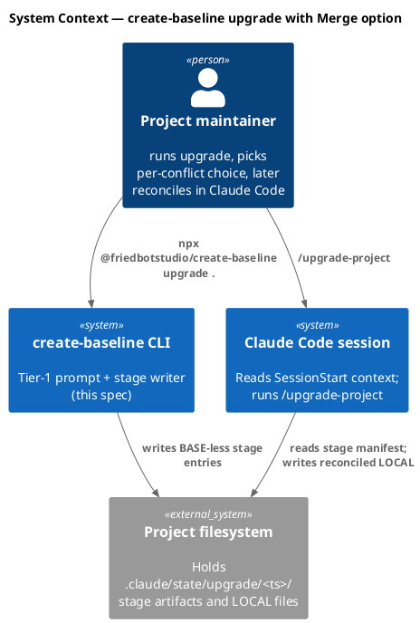

### C4 — Container

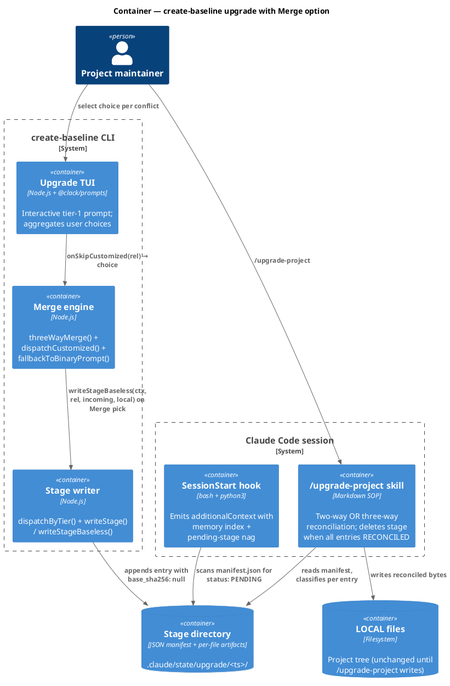

### C4 — Component (changed containers only)

#### Component — Upgrade TUI

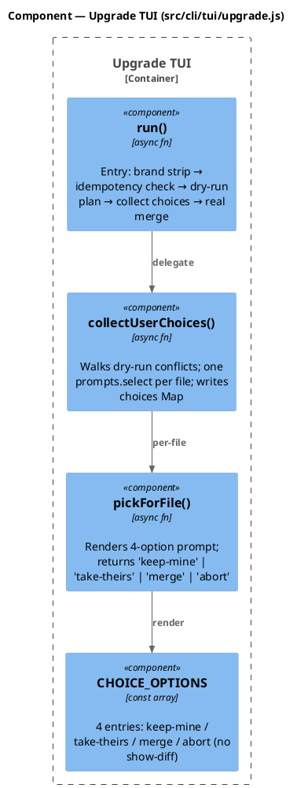

#### Component — Stage writer

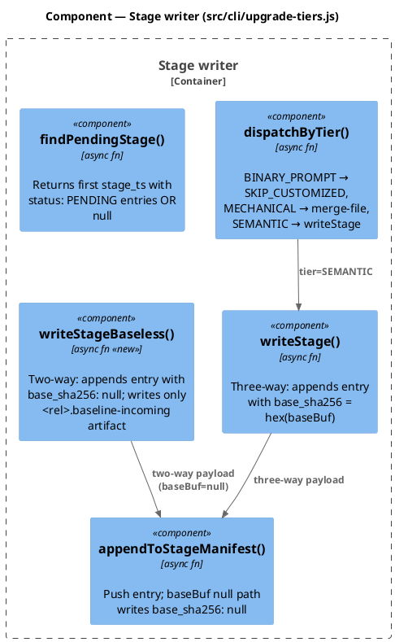

#### Component — /upgrade-project skill

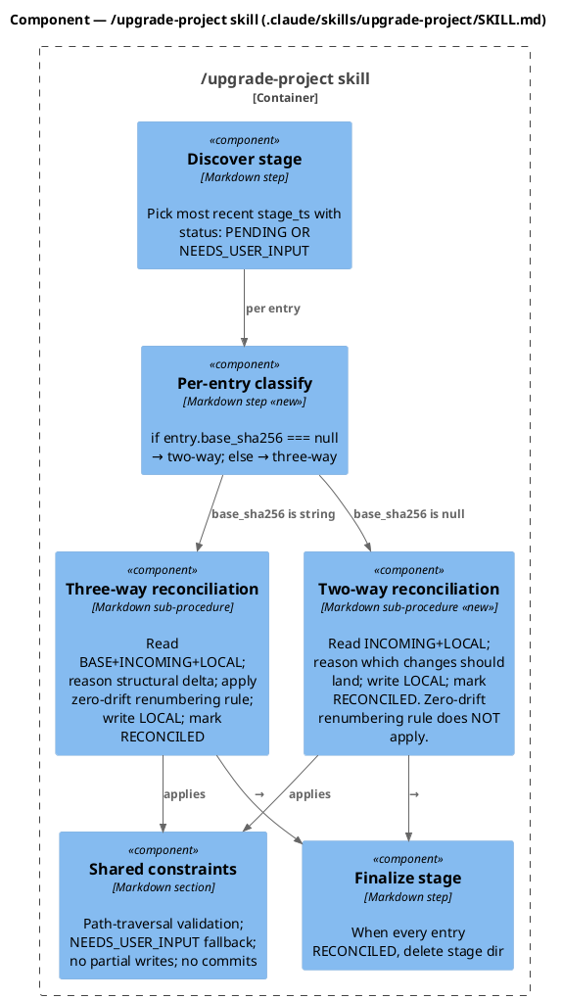

### Data model — class diagram

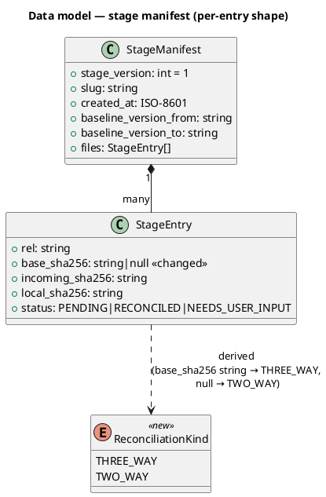

#### Migration DDL

The "DDL" for this spec is a schema change to the JSON stage manifest. No SQL migration; backward compat handled by the reader.

```sql
-- forward (conceptual; applied at runtime by the reader)
ALTER StageEntry COLUMN base_sha256 NULLABLE;

-- reverse (conceptual)
-- All v0.8.0 stages MUST be reconciled to RECONCILED + stage-deleted
-- before downgrading the CLI to v0.7.0. v0.7.0 reads base_sha256: null
-- as malformed and would crash on the first BASE-read attempt.
-- Operational rollback rule: drain all stages before downgrading.
```

### Behavior — sequence per AC

#### Behavior #1 — AC-001 four-option prompt

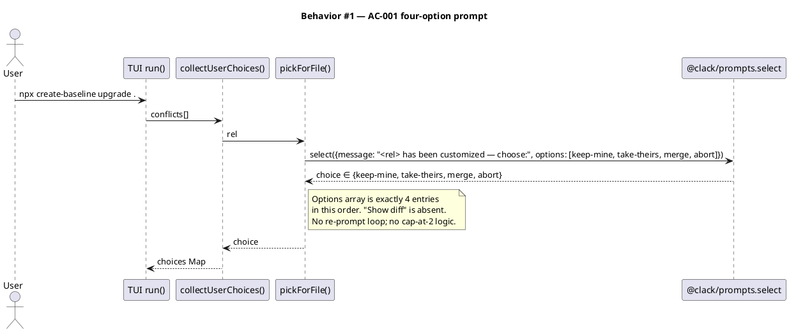

#### Behavior #2 — AC-002 Merge pick stages BASE-less

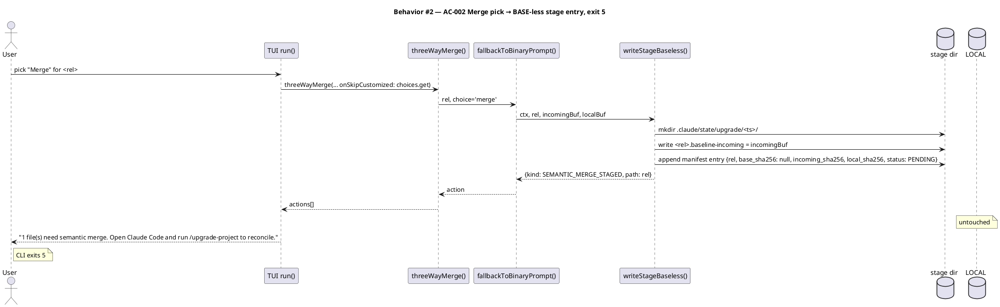

#### Behavior #3 — AC-003 /upgrade-project two-way reconciliation

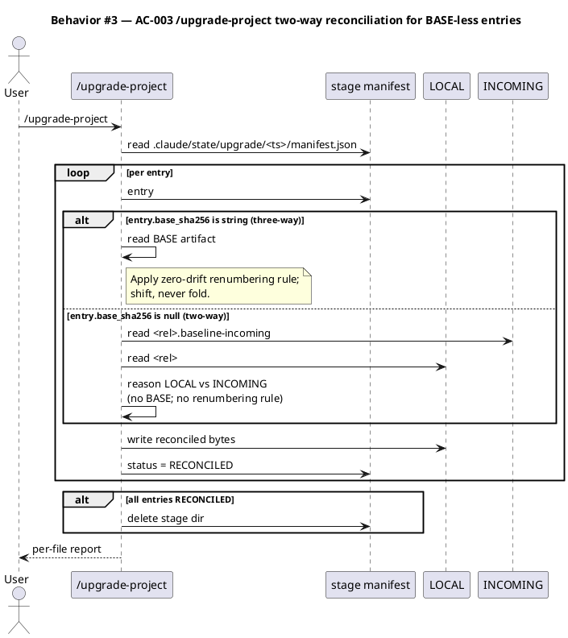

#### Behavior #4 — AC-004 SessionStart pending-stage nag

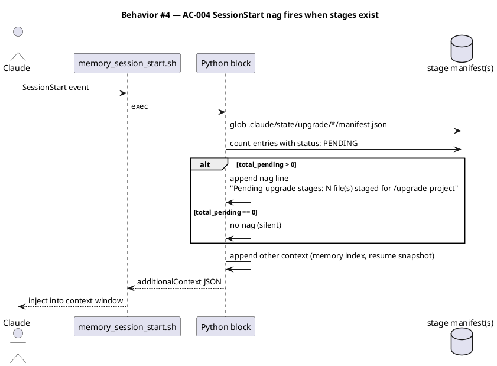

#### Behavior #5 — AC-005 fresh stage on subsequent upgrade

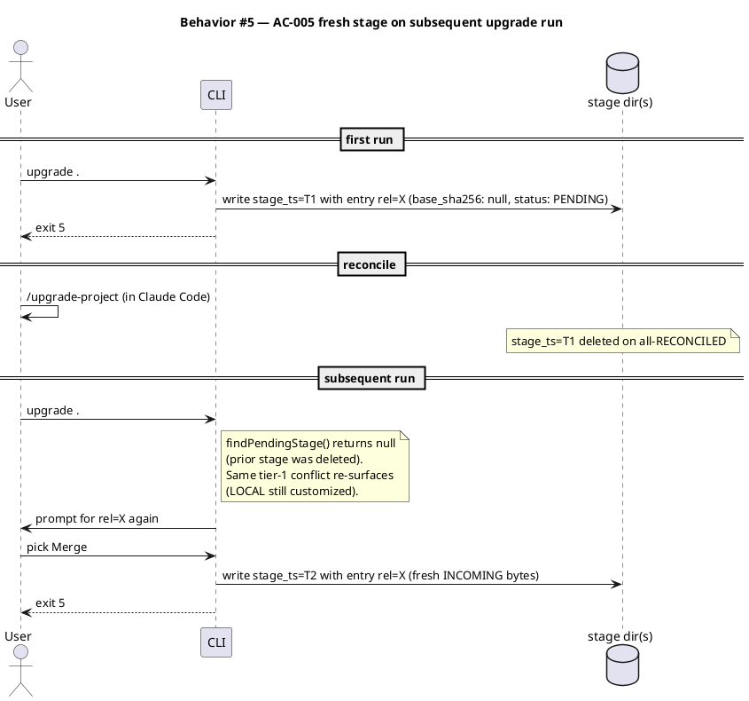

#### Behavior #6 — AC-006 non-TTY Merge unavailable

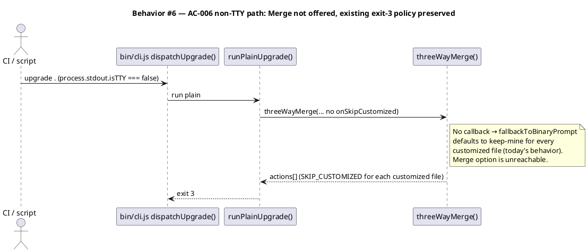

#### Behavior #7 — AC-007 CLI help + CHANGELOG updates

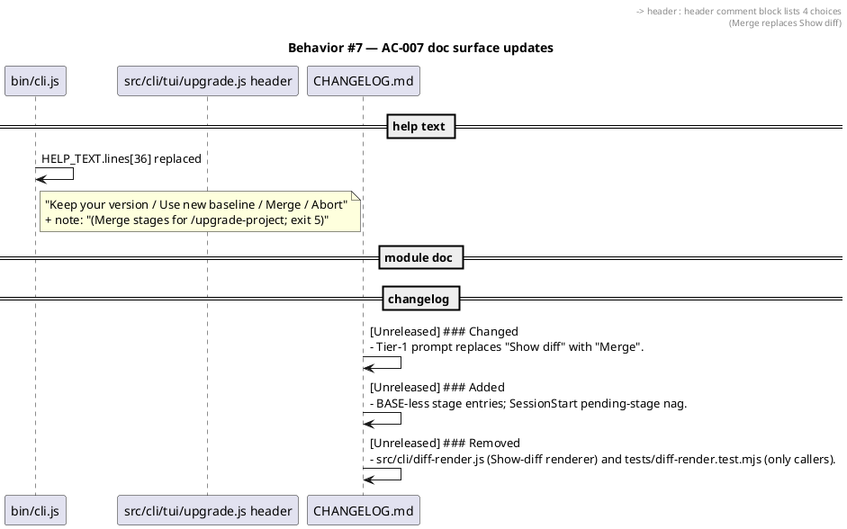

#### Behavior #8 — AC-008 SessionStart nag copy

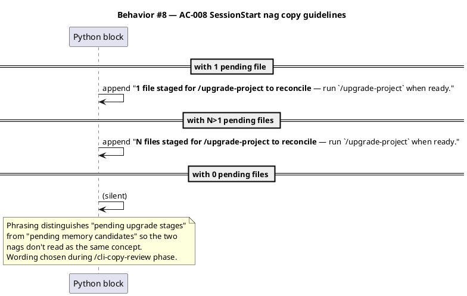

#### Behavior #9 — AC-009 backward compat with v0.7.0 stage manifests

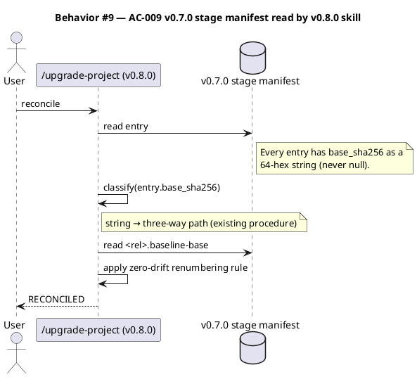

### State — core entity

A stage entry's lifecycle is unchanged by this spec; new only is the `base_sha256: null` value carried in the PENDING state.

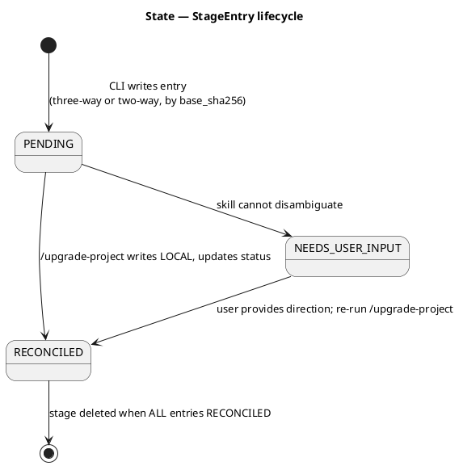

### Dependencies — graph

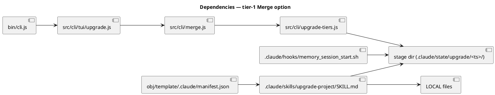

### Contracts

| Kind | Name | Input | Output | Errors | Idempotent |
|---|---|---|---|---|---|
| Function | `fallbackToBinaryPrompt({rel, onSkipCustomized, dryRun, tplPath, tgtPath, err?})` | choice ∈ `{keep-mine, take-theirs, merge}` from caller | Action: `OVERWRITE` (take-theirs), `SEMANTIC_MERGE_STAGED` (merge), `SKIP_CUSTOMIZED` (default) | — | per-call |
| Function | `writeStageBaseless(ctx, rel, incomingBuf, localBuf)` | `ctx.stageRunTs` initialized on first call this run | stage dir + manifest entry `{rel, base_sha256: null, incoming_sha256, local_sha256, status: PENDING}` | mkdir / writeFile failures bubble | append-only per `rel` (re-call appends new entry; AC-005 reachable only across runs after prior stage deleted) |
| Hook output | `memory_session_start.sh` additionalContext | — | Markdown index + optional nag line `**N file(s) staged for /upgrade-project to reconcile** — run \`/upgrade-project\` when ready.` | silent on glob failure | per-session (one fire) |
| Skill procedure | `/upgrade-project` classification | stage entry | branch = `two_way` if `base_sha256 === null` else `three_way` | NEEDS_USER_INPUT on ambiguity | per-entry |
| CLI option | `Merge` (tier-1 prompt) | user TTY pick | choice='merge' propagated to `onSkipCustomized` | clack cancel → abort | per-prompt |

### Libraries and versions

No third-party library APIs change. All edits are internal to the codebase. (Per the caller's brief, `context7` is intentionally not invoked.)

| Library@version | Purpose | Key APIs | Confirmed via context7 |
|---|---|---|---|
| `@clack/prompts` (pinned by `package.json`) | TUI prompt rendering | `select`, `intro`, `outro`, `cancel`, `log.info`, `isCancel` (existing usage, no API changes) | n/a — no new API surface |
| `node:fs/promises` (Node stdlib) | Stage file I/O | `mkdir`, `writeFile`, `readFile`, `readdir` (existing usage) | n/a — stdlib |
| `node:crypto` (Node stdlib) | sha256 digest of LOCAL/INCOMING | `createHash` (existing usage) | n/a — stdlib |

### Alternatives considered

| Alt | Summary | Rejected because |
|---|---|---|
| In-tree `<rel>.upgrade` sidecar | Write INCOMING bytes next to LOCAL in the project tree | Pollutes the project tree; user chose hidden staging via AskUserQuestion |
| `base_recoverable: false` discriminator | Add a new field to the per-entry record | Adds schema surface for a binary signal that `base_sha256: null` already carries (research D1-B) |
| New `BASELESS_MERGE_STAGED` action kind | Distinct ACTION_KIND for tier-1 Merge | YAGNI — terminal label already correct; per-tier classification lives in the stage manifest (research D3-B) |
| New sibling SessionStart hook | Ship `upgrade_stage_nag.sh` as a 23rd hook | Schema impact on settings.json + audit-baseline + seed.md + Article VIII table is significant for a 30-line script (research D2-B) |
| Two parallel procedure sections in SKILL.md | Duplicate Procedure section for BASE-less | Constraints duplication causes drift risk (research D4-B) |
| `project.json` field `upgrade.pending_merges` | Boolean tracked by CLI + read by hook | Drift risk vs filesystem truth; user chose filesystem-scan via AskUserQuestion |

## Design calls

This spec's `write_set` does not intersect `project.json → tdd.ui_globs` (no `.tsx/.jsx/.vue/.svelte/.html/.css/.scss` files; no `site-src/**`, `app/**`, `components/**`, `pages/**`). The CLI TUI is text-only via `@clack/prompts`. No design-ui rows needed.

- *(none)*

## Acceptance criteria

| ID | Criterion (given / when / then) | Upstream AC | Sequence |
|---|---|---|---|
| AC-001 | Given a tier-1 conflict in TTY mode, when the prompt renders, then the four options shown are exactly **"Keep your version"** / **"Use new baseline"** / **"Merge"** / **"Abort"** in that order; "Show diff" is absent; no re-prompt loop fires for any pick. | intake AC 1 | §Behavior #1 |
| AC-002 | Given the user picks "Merge", when the CLI completes, then a stage entry exists at `.claude/state/upgrade/<ts>/manifest.json` with `base_sha256: null`, `<rel>.baseline-incoming` is present, LOCAL is untouched, the terminal summary names the staged count + `/upgrade-project` pointer, and the CLI exits 5. | intake AC 2 | §Behavior #2 |
| AC-003 | Given a stage entry with `base_sha256: null`, when `/upgrade-project` runs, then the skill classifies via discriminator, executes the two-way reconciliation sub-procedure (no BASE read, no zero-drift renumbering rule), writes reconciled bytes to LOCAL, marks the entry RECONCILED, and deletes the stage when all entries RECONCILED. | intake AC 3 | §Behavior #3 |
| AC-004 | Given `.claude/state/upgrade/*/manifest.json` contains any `status: PENDING` entry, when the SessionStart hook fires, then the additionalContext output includes exactly one nag line. On zero pending entries, no nag fires. The nag fires regardless of `.claude/state/workflow.json` presence. | intake AC 4 | §Behavior #4 |
| AC-005 | Given the user runs upgrade twice against the same tier-1 customized file (with the prior stage already deleted via `/upgrade-project` reconciliation), when the user picks Merge on the second run, then a fresh stage entry is written carrying the latest INCOMING bytes. (AC-005 is reachable only across runs; AC-007 idempotency blocks within-run re-Merge.) | intake AC 5 | §Behavior #5 |
| AC-006 | Given a non-TTY invocation, when the CLI runs, then the Merge option is unavailable (no prompt fires), and the existing keep-mine + exit-3 policy applies unchanged. | intake AC 6 | §Behavior #6 |
| AC-007 | Given `bin/cli.js --help` is rendered AND `src/cli/tui/upgrade.js` header docs are read, when reviewed, then all "Show diff" references are removed; the new "Merge" option is documented in the 4-line enumeration; the CHANGELOG `[Unreleased]` section carries entries under `### Changed`, `### Added`, and `### Removed` (for `diff-render.js`). | intake AC 7 | §Behavior #7 |
| AC-008 | Given the SessionStart hook emits a pending-stage nag, when N=1 then the wording is singular ("1 file staged..."), when N>1 then plural ("N files staged..."); the message distinguishes upgrade stages from memory candidates; `/upgrade-project` is named in backticks. The exact copy is reviewed by `/cli-copy-review` before commit. | new (caller) | §Behavior #8 |
| AC-009 | Given a v0.7.0 stage manifest on disk (every entry's `base_sha256` is a 64-hex string), when v0.8.0 `/upgrade-project` reads it, then every entry routes through the three-way reconciliation sub-procedure; no BASE-less branch fires; no schema upgrade migration runs. | new (caller) | §Behavior #9 |

## Test plan

| Category | Scenario | Expected | Covers |
|---|---|---|---|
| Golden path | TTY upgrade with one tier-1 conflict; user picks Merge | stage entry written with `base_sha256: null`, LOCAL untouched, exit 5 | AC-001, AC-002 |
| Golden path | `/upgrade-project` against a BASE-less stage | two-way reconciliation writes LOCAL; entry RECONCILED; stage deleted | AC-003 |
| Golden path | SessionStart hook with one pending stage | nag emitted with singular wording | AC-004, AC-008 |
| Input boundary | Tier-1 prompt option set | options array is exactly `[keep-mine, take-theirs, merge, abort]`; no `show-diff` | AC-001 |
| Input boundary | Two pending entries across two stage dirs | nag wording uses plural and aggregate count | AC-004, AC-008 |
| Input boundary | Zero pending entries | hook emits no nag for upgrade stages | AC-004 |
| Contract violation | Re-Merge within a single CLI run (impossible to reach; protected by AC-007 short-circuit) | second invocation hits `findPendingStage` and exits 5 without re-prompting | AC-005, AC-007-idempotency invariant |
| Contract violation | Non-TTY upgrade with a tier-1 conflict | no Merge prompt; exit 3 with keep-mine default | AC-006 |
| Concurrency / ordering | Two stage_ts dirs from sequential CLI runs (one PENDING, one all-RECONCILED) | `findPendingStage` returns only the PENDING one; nag counts only PENDING | AC-004 |
| Failure mode | `/upgrade-project` cannot disambiguate two-way conflict | entry status → NEEDS_USER_INPUT; stage NOT deleted; user-targeted question surfaced | AC-003 |
| Failure mode | Stage manifest carries malformed `base_sha256` (neither null nor 64-hex) | `/upgrade-project` surfaces NEEDS_USER_INPUT with `reason: malformed-base-sha256` | AC-009 (backward-compat negative case) |
| Regression trap | v0.7.0 stage manifest fed into v0.8.0 `/upgrade-project` | every entry classified as three-way; existing zero-drift renumbering still applies | AC-009 |
| Regression trap | Tier-2 MECHANICAL clean merge | no prompt; auto-merge cleanly; exit 0 | (pre-existing test must continue to pass) |
| Regression trap | Tier-3 SEMANTIC dispatch | three-way stage entry with `base_sha256` as 64-hex; exit 5 | (pre-existing test must continue to pass) |
| Regression trap | `src/cli/diff-render.js` removed; `tests/diff-render.test.mjs` removed | test suite passes with both files absent | AC-007 |
| Regression trap | Article XI hash audit after editing `/upgrade-project` SKILL.md | `bash .claude/skills/audit-baseline/audit.sh` PASSes after manifest rebuild | landmines `baseline-skill-edit-needs-manifest-rebuild` |

### Write set

Files this work touches (explicit enumeration so swarm/solo plans agree):

- `src/cli/tui/upgrade.js` — replace `CHOICE_OPTIONS`; delete Show-diff loop + `renderConflictDiff`; remove `renderUnifiedDiff` import; pass `'merge'` choice through `onSkipCustomized`.
- `src/cli/merge.js` — extend `fallbackToBinaryPrompt` with the `'merge'` branch (calls `writeStageBaseless`, returns `SEMANTIC_MERGE_STAGED`).
- `src/cli/upgrade-tiers.js` — add `writeStageBaseless(ctx, rel, incomingBuf, localBuf)`; teach `appendToStageManifest` to write `base_sha256: null` when baseBuf is null.
- `src/cli/diff-render.js` — **DELETE**.
- `.claude/hooks/memory_session_start.sh` — extend Python block: scan `.claude/state/upgrade/*/manifest.json`, append nag line when total PENDING > 0; gating is presence-of-stages, not workflow-active.
- `.claude/skills/upgrade-project/SKILL.md` — restructure: classification preamble + three-way sub-procedure + two-way sub-procedure + shared Constraints; two-way procedure explicitly notes "zero-drift renumbering does not apply".
- `obj/template/.claude/manifest.json` — **regenerated** after SKILL.md edit (via `node scripts/build-manifest.mjs obj/template` per landmines workaround).
- `bin/cli.js` — replace `HELP_TEXT` line 36 ("Show diff" verbiage) with the new 4-option enumeration + Merge → exit-5 note.
- `tests/upgrade.test.mjs` — flip `Show diff` assertions to `Merge`; delete the cap-at-2 loop tests; add Merge-pick stage-write test.
- `tests/upgrade-tiers.test.mjs` — add BASE-less stage write/read tests; assert `base_sha256: null` in the manifest entry.
- `tests/upgrade-project.test.mjs` — add `body.includes("two-way")` and `body.includes("BASE-less")` assertions to the contract-presence test.
- `tests/diff-render.test.mjs` — **DELETE**.
- `CHANGELOG.md` — `[Unreleased]` section grows under `### Added`, `### Changed`, `### Removed`.

The write set does NOT touch: `seed.md`, `CLAUDE.md`, `src/CLAUDE.template.md`, `src/seed.template.md`, `.claude/settings.json`, `.claude/project.json`, `bin/cli.js` exit-code table (semantics unchanged), any other skill or hook.

## Observability

| Signal | Name | Shape | Purpose |
|---|---|---|---|
| Log | CLI per-file action report | `<ACTION_LABEL>  <path>` line per file | user audit at upgrade-time |
| Log | `/upgrade-project` per-file report | `- <rel>: <STATUS> [(N lines changed) \| <reason>]` | post-reconciliation audit |
| Hook stdout | SessionStart nag | one Markdown line in `additionalContext` | session-start awareness |
| Filesystem | stage_ts directories | `.claude/state/upgrade/<ts>/` | persistent state across sessions |

No metrics or alarms — this is a CLI + skill surface, no production deployment.

## Rollout

- **Feature flag**: none. The Merge option ships unconditionally as part of `npx @friedbotstudio/create-baseline@0.8.0`.
- **Migration order**: 1 build manifest update (after SKILL.md edit) → 2 test suite green → 3 CHANGELOG curated by `/changelog` → 4 release tag.
- **Canary**: none in the conventional sense — this is a developer CLI. The project owner dogfoods the upgrade flow against this repo's own `v0.7.0`-installed state before tagging `v0.8.0`.

## Rollback

- **Kill-switch**: revert the release tag. The CLI is consumed via `npx`, so users pulling a fixed `@0.7.0` keep the prior behavior; users pulling `@latest` after a rollback get the prior behavior too.
- **Signal to roll back**: a project that has already run v0.8.0 `create-baseline upgrade` and produced a BASE-less stage entry CANNOT be reconciled by v0.7.0 `/upgrade-project` (the v0.7.0 reader does not handle `base_sha256: null`). Operational rollback rule: any project running v0.8.0 SHALL drain all stages (run `/upgrade-project` to RECONCILED on every entry) BEFORE downgrading the CLI to v0.7.0. This is a manual operator step; no automated detection.

## Archive plan

- Defaults *(automatic)*: intake, scout, research, spec, spec-rendered (if `/spec-render` runs), spec approval token.
- Extras *(list any non-default files)*:
  - *(none)*

## Open questions

- **`/upgrade-project` SKILL.md edit triggers Article XI manifest rebuild**. The `/simplify` phase (or the `/tdd` finalize step) must regenerate `obj/template/.claude/manifest.json` per landmines `baseline-skill-edit-needs-manifest-rebuild`. Not a blocker; flagged here so the implementer doesn't get surprised by `audit-baseline` FAIL on the first verify.

Decisions locked at Gate A (no longer open):

- **Phase 6 routing**: solo `/tdd`, not swarm. Components are tightly coupled through the stage-manifest schema. Confirmed by maintainer 2026-05-22.
- **AC-005 reachability**: preserved as positive cross-run contract per Behavior #5. AC-007 idempotency makes within-run re-Merge unreachable; that is the correct behavior.
- **IQ-4 ("Use new baseline" audit trail)**: out of scope; deferred to a future workflow. See Non-goals.
