# Upgrade no-replay prompts — NEVER_TOUCH for runtime state + reconciliation marker

## Context

| Input | Path |
|---|---|
| Intake | `docs/intake/upgrade-no-replay-prompts.md` |
| BRD *(if any)* | — |
| Scout *(if any)* | `docs/scout/upgrade-no-replay-prompts.md` |
| Research *(if any)* | `docs/research/upgrade-no-replay-prompts.md` |

## Goal

`create-baseline upgrade` against an unchanged baseline produces zero prompts: runtime-state files (`_pending.md`, `_resume.md`) are preserved silently as NEVER_TOUCH, and files reconciled via `/upgrade-project` are not re-staged on subsequent upgrade runs until the upstream template's hash for that file actually changes.

## Non-goals

- Do not change the v3 shipped-manifest schema's existing fields (`sha256`, `tier`). Additive only.
- Do not fix scout landmine #1 (the v2/v3 shape mismatch at `.claude/.baseline-manifest.json` between `install.js:writeBaselineManifest` and `merge.js:154-157`). Carved out per research recommendation; tracked as a separate intake. This spec works around the inconsistency by introducing the reconciliation marker as a separate file rather than extending `.baseline-manifest.json`.
- Do not redesign how `/upgrade-project` performs three-way reconciliation. Its semantic-merge logic stays untouched; only its terminal "delete stage" step gains a marker-write sibling.
- Do not add network round-trips. The marker is written from local state available at reconciliation time.
- Do not change `audit-baseline`'s reading of `.claude/manifest.json` (the shipped v3 manifest). That file is unchanged by this work.
- Do not change `cli-copy-review` skill behavior. CLI copy lives in `src/cli/tui/upgrade.js`; copy changes (if any) get reviewed in Phase 10.6.5 of this workflow, not adjudicated here.

## Design

Diagrams are the contract. Prose only for what a diagram cannot say.

### C4 — System context

Who runs upgrade, and which external systems the CLI depends on.

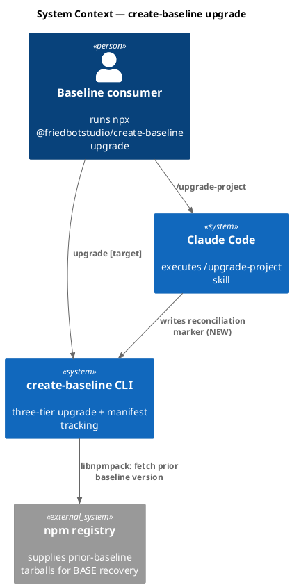

### C4 — Container

Deployable units and their communication paths.

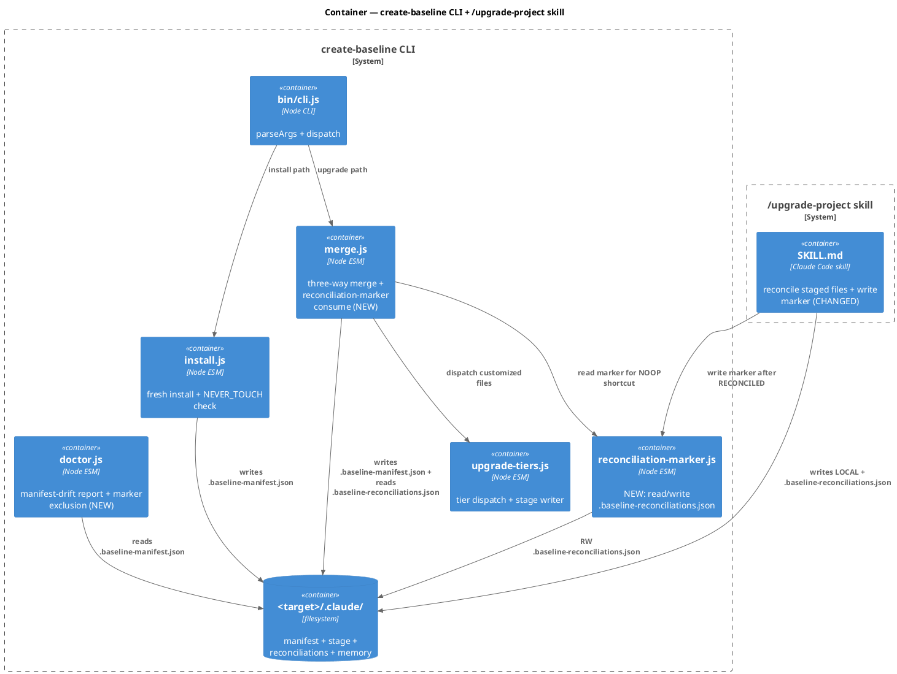

### C4 — Component (changed containers only)

`merge.js` gains a marker-consult step. `reconciliation-marker.js` is new. `doctor.js` gains an exclusion. `install.js` and `build-manifest.mjs` get NEVER_TOUCH list expansions.

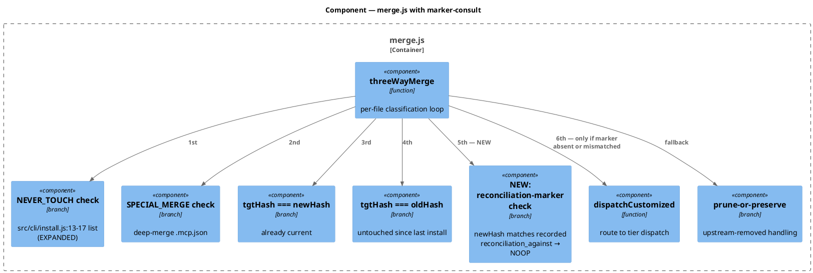

### Data model — class diagram

The reconciliations file's schema, and the marker module's exported surface.

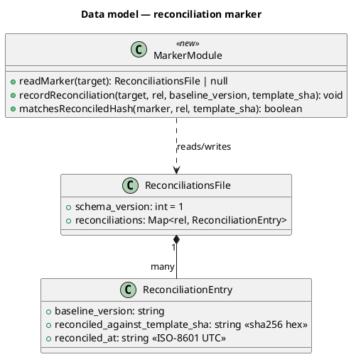

#### Migration DDL

Not applicable — no relational schema. The on-disk JSON file is the only "schema." Forward and reverse migrations:

```text
-- forward
Create file <target>/.claude/.baseline-reconciliations.json with:
  {"schema_version": 1, "reconciliations": {}}
Written lazily by reconciliation-marker.js on first recordReconciliation() call.
Absent file is the v0 state and is interpreted as "no reconciliations recorded."

-- reverse
Delete <target>/.claude/.baseline-reconciliations.json
merge.js silently falls back to "no marker" (treats every file as today).
No data loss; the next /upgrade-project run will re-populate.
```

### Behavior — sequence per AC

#### Behavior #1 — NEVER_TOUCH preserves _pending.md / _resume.md (AC-001, AC-002)

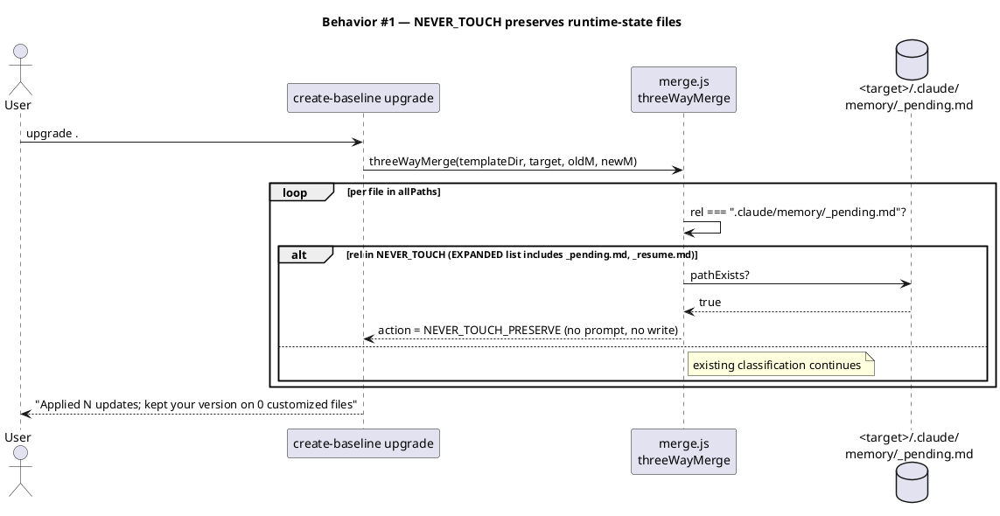

#### Behavior #2 — Reconciliation marker NOOPs same-hash post-reconciliation file (AC-003)

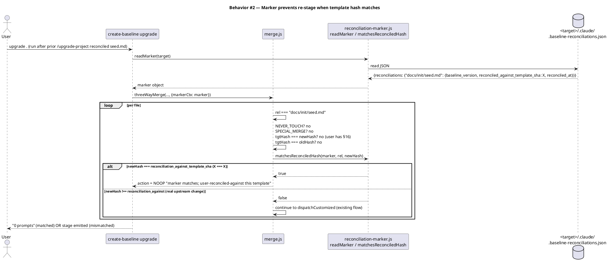

#### Behavior #3 — Real upstream change still stages (AC-004)

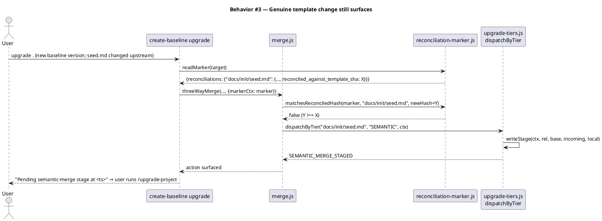

#### Behavior #4 — /upgrade-project writes marker post-reconciliation (AC-003 source)

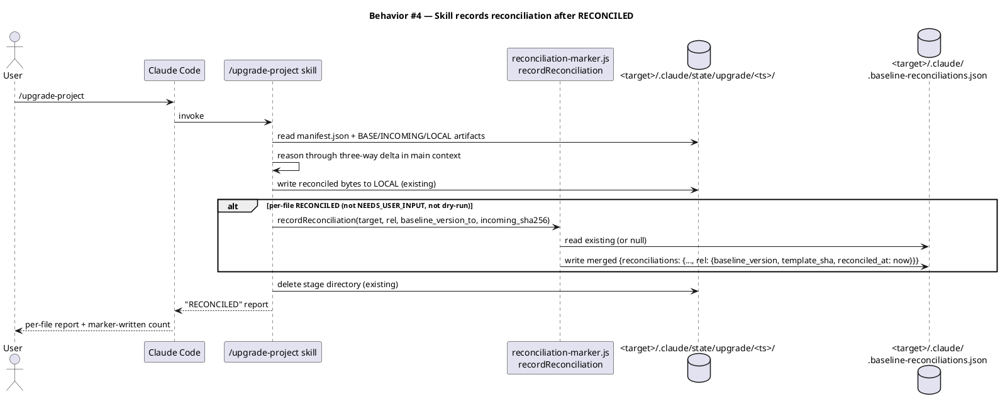

#### Behavior #5 — Legacy install (no marker file) graceful onboarding (AC-005)

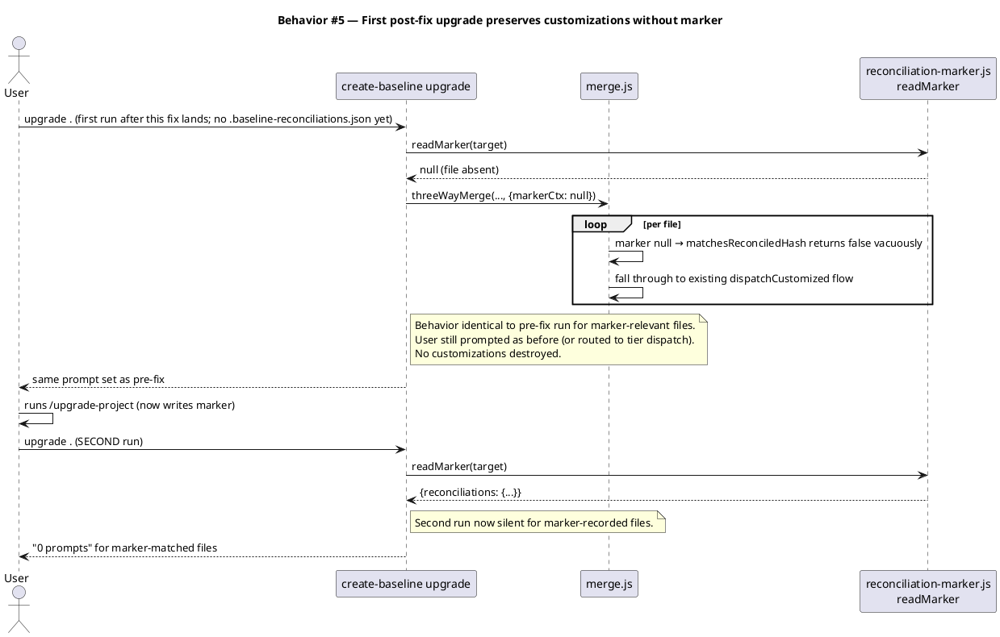

#### Behavior #6 — Audit + doctor unaffected (AC-006)

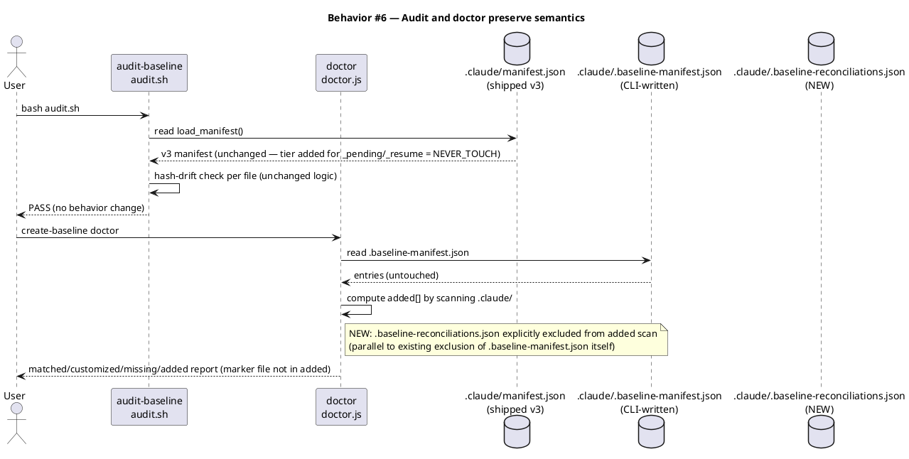

#### Behavior #7 — NEVER_TOUCH list sync invariant (AC-007)

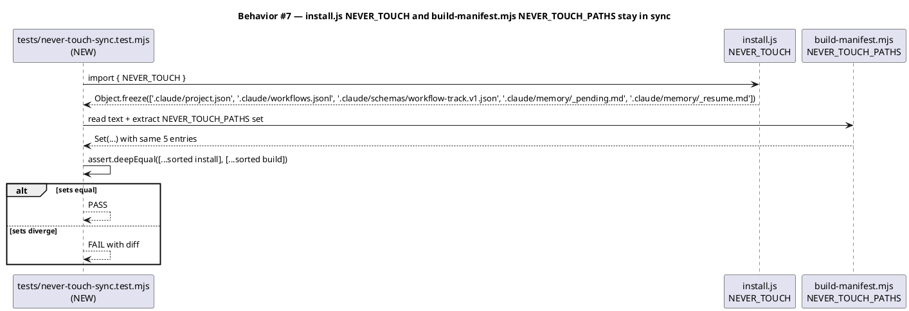

### State — core entity *(only if stateful)*

The reconciliation marker has a trivial lifecycle (absent → present-and-growing). Per-file entries have their own micro-state.

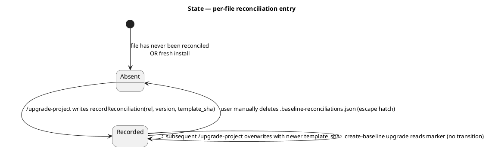

### Dependencies — graph

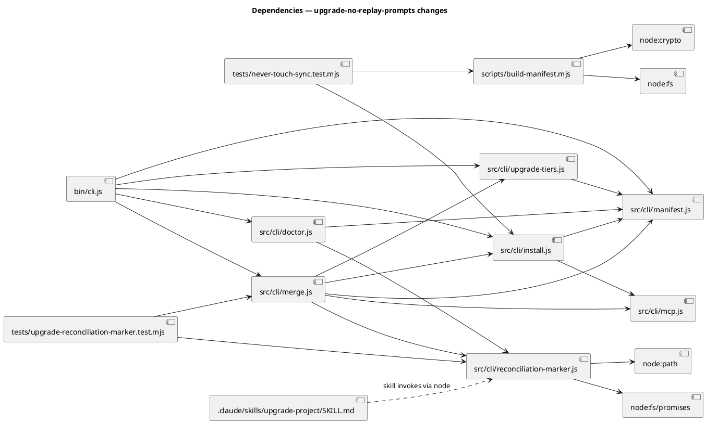

### Contracts

| Kind | Name | Input | Output | Errors | Idempotent |
|---|---|---|---|---|---|
| Module | `reconciliation-marker.js → readMarker(target)` | `target: string (absolute path)` | `ReconciliationsFile \| null` | filesystem read errors propagate; ENOENT → returns `null` | yes |
| Module | `reconciliation-marker.js → recordReconciliation(target, rel, baseline_version, template_sha)` | `target, rel, baseline_version, template_sha (sha256 hex)` | `void` | write errors propagate as `MarkerWriteError` | yes (overwrites entry for same `rel`) |
| Module | `reconciliation-marker.js → matchesReconciledHash(marker, rel, template_sha)` | `marker: ReconciliationsFile \| null`, `rel: string`, `template_sha: string` | `boolean` | none — null marker → `false` | yes |
| File | `<target>/.claude/.baseline-reconciliations.json` | per writer | `{schema_version: 1, reconciliations: {rel: {baseline_version, reconciled_against_template_sha, reconciled_at}}}` | malformed JSON → readMarker logs + returns `null` | n/a |
| Skill | `/upgrade-project` post-RECONCILED hook | `target, rel, baseline_version_to, incoming_sha256` | `void` (writes marker via module) | propagates write errors; does NOT roll back the reconciliation | yes |
| List | `src/cli/install.js → NEVER_TOUCH` | n/a (constant) | adds `.claude/memory/_pending.md`, `.claude/memory/_resume.md` | n/a | n/a |
| Set | `scripts/build-manifest.mjs → NEVER_TOUCH_PATHS` | n/a (constant) | adds same 2 paths | n/a | n/a |
| Copy | `src/cli/tui/upgrade.js:60` legacy-manifest warning | n/a (string literal) | revised to reflect post-fix behavior ("the next upgrade after `/upgrade-project` will be silent for marker-matched files") instead of "re-install … to enable three-way merges" | n/a | n/a — qualitative copy review in Phase 10.6.5 `/cli-copy-review` |

### Libraries and versions

No new third-party APIs introduced. All work uses Node core (`node:fs/promises`, `node:crypto`, `node:path`). The only runtime dependency in `package.json` (`@clack/prompts@1.4.0`) is not touched by this work.

| Library@version | Purpose | Key APIs | Confirmed via context7 |
|---|---|---|---|
| `node:fs/promises` (Node ≥ 20) | marker file read/write | `readFile`, `writeFile`, `mkdir` | n/a (Node core) |
| `node:crypto` (Node ≥ 20) | sha256 comparison (existing helper reused) | `createHash` | n/a (Node core) |
| `node:path` (Node ≥ 20) | path joining | `join`, `dirname` | n/a (Node core) |

### Alternatives considered

| Alt | Summary | Rejected because |
|---|---|---|
| Candidate 1 (research) | Extend `.baseline-manifest.json` to v3 with per-file `reconciled_against` field | Forces fixing scout landmine #1 (v2/v3 shape mismatch) in same workflow; inflates spec scope beyond "stop re-prompting." Carved out as separate intake per Non-goals. |
| Candidate 3 (research) | Change stage-manifest lifecycle: `/upgrade-project` marks RECONCILED instead of deleting; CLI cleans up | Constitutional amendment is larger (relaxes SHALL NOT + changes cleanup ownership); discoverability of "have I reconciled X?" is worse (requires scanning multiple stages); changes the meaning of memory_session_start.sh's "N pending stages" surface. |
| Option B (research) | CLI writes marker on next upgrade by detecting "stage was resolved since last run" | Requires "remember last staged ts" persistence — itself a new on-disk artifact, just spelled differently. Net complexity is higher than Option A's narrow SKILL.md amendment. |

## Design calls

The write_set (enumerated under Test plan / Rollout) intersects only `.js`, `.mjs`, and `.md` files. None of `site-src/**`, `app/**`, `components/**`, `pages/**`, `src/**/*.{tsx,jsx,vue,svelte}`, `**/*.html`, `**/*.css`, `**/*.scss`, `**/*.njk` (the project's `tdd.ui_globs`). No UI surfaces — design-ui invocation is not required.

CLI copy that *does* surface to users (in `src/cli/tui/upgrade.js` end-of-run summary at line 101-105) is reviewed in Phase 10.6.5 by the seeded `/cli-copy-review` task (TaskList #18). That is a separate review concern from product-UI design.

- *(none)*

## Acceptance criteria

| ID | Criterion (given / when / then) | Upstream AC | Sequence |
|---|---|---|---|
| AC-001 | given `.claude/memory/_pending.md` body has accumulated session candidates (sha differs from shipped template), when `create-baseline upgrade` runs against a baseline whose `_pending.md` template hash is unchanged, then no prompt fires for `_pending.md` AND the local body is byte-identical after the run | intake AC 1 | §Behavior #1 |
| AC-002 | given `.claude/memory/_resume.md` body has been overwritten by `memory_stop.sh` (sha differs from shipped template), when `create-baseline upgrade` runs against a baseline whose `_resume.md` template hash is unchanged, then no prompt fires for `_resume.md` AND the local body is byte-identical after the run | intake AC 2 | §Behavior #1 |
| AC-003 | given `docs/init/seed.md` was reconciled by `/upgrade-project` against template hash X (marker file records this) AND target shipped template hash is X, when `create-baseline upgrade` runs, then `seed.md` is not re-staged, no prompt fires, AND the upgrade reports the file as NOOP | intake AC 3 | §Behavior #2 |
| AC-004 | given `seed.md` was reconciled against template hash X (marker records X), when `create-baseline upgrade` runs against a NEW baseline with template hash Y ≠ X, then `seed.md` IS staged (SEMANTIC tier) for `/upgrade-project` exactly as today | intake AC 4 | §Behavior #3 |
| AC-005 | given a project installed before this fix lands (no `.baseline-reconciliations.json` on disk), when the user runs `create-baseline upgrade` for the first time post-fix, then no user customizations are destroyed AND the upgrade completes (same prompt set as pre-fix); a SECOND run after the user runs `/upgrade-project` produces zero prompts for marker-matched files | intake AC 5 | §Behavior #5 |
| AC-006 | given `audit-baseline` (`bash .claude/skills/audit-baseline/audit.sh`) AND `create-baseline doctor` running before and after this fix on the same target, then both tools exit with the same status code AND `doctor.report.added` does NOT include `.claude/.baseline-reconciliations.json` | intake AC 6 | §Behavior #6 |
| AC-007 | given the shipped manifest at `obj/template/.claude/manifest.json` after `npm run build`, then `files['.claude/memory/_pending.md'].tier === 'NEVER_TOUCH'` AND `files['.claude/memory/_resume.md'].tier === 'NEVER_TOUCH'` AND `src/cli/install.js → NEVER_TOUCH` Object.freeze list contains both paths | intake AC 7 | §Behavior #1 |
| AC-008 | given the `NEVER_TOUCH` constant in `src/cli/install.js` and the `NEVER_TOUCH_PATHS` set in `scripts/build-manifest.mjs`, then their member sets are equal (asserted via dedicated regression test) | (derived from intake constraints; prevents future drift) | §Behavior #7 |
| AC-009 | given `/upgrade-project --dry-run` running over a stage with PENDING files, when the skill produces its dry-run report, then NO write to `.baseline-reconciliations.json` occurs (dry-run preserves "no side effects" contract) | intake Q4 | §Behavior #4 (negative branch: dry-run skips recordReconciliation call) |
| AC-010 | given a malformed `.baseline-reconciliations.json` on disk (invalid JSON, missing schema_version, wrong shape), when `merge.js` calls `readMarker(target)`, then the function returns `null` AND a single stderr warning is logged AND `merge.js` proceeds as if no marker existed (graceful degradation) | (resilience requirement) | implied by §Behavior #2 alt-branch |

## Test plan

| Category | Scenario | Expected | Covers |
|---|---|---|---|
| Golden path | upgrade twice in succession against unchanged baseline, both runs after a fresh install + simulated `/upgrade-project` reconciliation of seed.md | second run produces 0 prompts; marker file unchanged between runs | AC-003 |
| Golden path | upgrade twice with `_pending.md` body grown by simulated `memory_stop` between runs | second run produces 0 prompts for `_pending.md`; body byte-identical | AC-001 |
| Golden path | upgrade twice with `_resume.md` body changed between runs | second run produces 0 prompts for `_resume.md`; body byte-identical | AC-002 |
| Input boundary | empty `.baseline-reconciliations.json` (`{"schema_version":1,"reconciliations":{}}`) | merge proceeds as if marker absent; no error | AC-010 |
| Input boundary | marker with entry pointing to a `rel` that no longer exists in the template | merge silently ignores the stale entry; processes other files normally | (resilience; derived) |
| Input boundary | marker `schema_version` is a future value (e.g., 2) | readMarker returns null with stderr warning; merge proceeds; no destructive action | AC-010 |
| Contract violation | malformed JSON in marker file | readMarker returns null with stderr warning; merge proceeds | AC-010 |
| Contract violation | marker file is a directory not a file (unusual filesystem state) | readMarker returns null with stderr warning; merge proceeds | AC-010 |
| Contract violation | recordReconciliation called with non-hex `template_sha` | writes the value verbatim (no validation); subsequent matchesReconciledHash works by string equality | (acceptance of "trust the caller"; documented limitation) |
| Concurrency / ordering | two `recordReconciliation` calls in same tick for different `rel`s | both entries land in the file; no lost-write race (write-then-rename) | (implementation detail) |
| Failure mode | filesystem read-only for marker write | recordReconciliation throws MarkerWriteError; `/upgrade-project` reports error per-file but does NOT roll back the reconciliation (LOCAL bytes already on disk) | AC-009 negative |
| Failure mode | template hash X recorded, then user manually edits seed.md AFTER reconciliation but BEFORE next upgrade | marker matches `newHash` against template hash, not against `tgtHash` — file flows through normal customized branch since `tgtHash !== newHash` AND `newHash === reconciled_against` → marker says "you reviewed against this template," so file is NOOP (user's manual edit is preserved) | edge case explicit |
| Regression trap | `NEVER_TOUCH` list in install.js equals `NEVER_TOUCH_PATHS` set in build-manifest.mjs | sets equal (sorted comparison) | AC-008 |
| Regression trap | doctor report on post-marker target does not list `.baseline-reconciliations.json` in `added` | absent from `added` array | AC-006 |
| Regression trap | audit-baseline PASS before vs after fix on dev repo + simulated consumer install | exit 0 both times | AC-006 |
| Regression trap | shipped manifest after `npm run build` declares `_pending.md` + `_resume.md` as `tier: NEVER_TOUCH` | tier values equal `NEVER_TOUCH` | AC-007 |

End-to-end fixture (resolves intake Q5): a programmatic helper in `tests/upgrade-reconciliation-marker.test.mjs` that:
1. Creates a fresh tmp tree via `mkdtemp`.
2. Runs `install.js → install()` to seed a baseline.
3. Modifies `docs/init/seed.md` in the tmp tree to simulate user customization.
4. Calls `threeWayMerge` with a synthesized new template — expects SEMANTIC_MERGE_STAGED.
5. Hand-writes `.baseline-reconciliations.json` with the new template hash (simulating `/upgrade-project`'s `recordReconciliation` call).
6. Calls `threeWayMerge` again with the same template — expects NOOP.
7. Calls `threeWayMerge` with a different template hash — expects SEMANTIC_MERGE_STAGED again.

This avoids invoking Claude inside a test while still exercising the full loop.

## Observability

| Signal | Name | Shape | Purpose |
|---|---|---|---|
| Log | `marker: read` | stderr line: `reconciliation-marker: read N entries from .baseline-reconciliations.json` (when N > 0; silent when 0 or absent) | debug: confirm marker is being consulted |
| Log | `marker: write` | stderr line: `reconciliation-marker: recorded <rel> against template_sha=<first8hex>... at <ts>` | debug: confirm `/upgrade-project` wrote |
| Log | `marker: malformed` | stderr warning: `reconciliation-marker: malformed .baseline-reconciliations.json (<reason>); proceeding without marker` | surface filesystem corruption |
| Metric | — | n/a (CLI tool, no metrics infra) | — |
| Alarm | — | n/a | — |

The CLI doesn't ship a metrics pipeline. Stderr logs are the only observability layer; they're surfaced to the user's terminal directly.

## Rollout

- **Feature flag**: none. The fix is additive (new file, new code path), backwards-compatible by construction (absent marker = pre-fix behavior). No flag needed — bug fix ships unconditionally.
- **Migration order**:
  1. Land the code changes (install.js NEVER_TOUCH expansion, build-manifest.mjs NEVER_TOUCH_PATHS expansion, new reconciliation-marker.js module, merge.js consult, doctor.js exclusion, /upgrade-project SKILL.md amendment).
  2. `npm run build` regenerates `obj/template/.claude/manifest.json` with new tier values for `_pending.md` and `_resume.md`.
  3. Test suite must pass green.
  4. Commit + push triggers semantic-release → npm publish.
  5. Consumers running `npx @friedbotstudio/create-baseline upgrade` next time will get the fix automatically.
- **Canary**: not applicable — npm publish is atomic. The CHANGELOG entry (Phase 11.5) is the user-facing notice.

## Rollback

- **Kill-switch**: users can `rm .claude/.baseline-reconciliations.json` to nuke all recorded reconciliations. `merge.js` falls back to pre-fix behavior for marker-relevant files. No customizations destroyed; user just re-runs `/upgrade-project` if needed.
- **Package-level revert**: standard semantic-release flow — bad version is unpublished or superseded by a patch release. No infrastructure rollback needed.
- **Signal to roll back**: if the published version reports a regression (e.g., user customizations destroyed despite marker present, or marker writes corrupting LOCAL bytes), revert via patch release within the same day. Detection mechanism: GitHub issues + the user's own usage (this project dogfoods every release).

## Archive plan

When this spec ships, the `archive` skill (Phase 10.5) moves the following into `docs/archive/<ship-date>/upgrade-no-replay-prompts/`:

- Defaults *(automatic)*: intake, scout, research, spec, spec-rendered/, spec approval, swarm plan + approval (if used), security reports (concatenated).
- Extras *(list any non-default files)*:
  - *(none)*

## Open questions

All resolved before approval.

- (Q1 from intake — resolved): landmine #1 (v2/v3 manifest shape) is out of scope per Non-goals. Carved to a separate intake.
- (Q2 from intake — resolved): `/upgrade-project` writes the marker (Option A) per research recommendation. SKILL.md:114 constitutional amendment narrowly relaxes the SHALL NOT to permit writes to `.claude/.baseline-reconciliations.json` specifically.
- (Q3 from intake — resolved): NEVER_TOUCH expansion lands in this spec alongside the marker fix; both ship together per user's bundled-ship request.
- (Q4 from intake — resolved): CLI copy in `src/cli/tui/upgrade.js:60` (legacy-manifest warning) is updated **in this workflow**. The current copy promises "re-install with the latest baseline to enable three-way merges next time"; the post-fix behavior is "the next upgrade after running `/upgrade-project` will be silent for marker-matched files." The seeded `/cli-copy-review` phase (TaskList #18) is the natural validation point. No new AC needed — qualitative copy review is the existing remit of that phase. Add this surface to its punch list.
- (Q5 from intake — resolved): end-to-end fixture is programmatic (option b from research), defined in the Test plan section. No new `tests/fixtures/post-reconciliation/` directory needed.
- (NEW-1 — resolved): `.claude/.baseline-reconciliations.json` is **committed to git** by default in consumer projects (rationale: behaves like `package-lock.json` — per-target state worth sharing across team members so the reconciliation history is a build-input not a per-clone secret). No change to the baseline's own `.gitignore`; no change to any shipped `.gitignore` template. Each consumer project decides per-project whether to commit or ignore.
- (NEW-2 — resolved): `recordReconciliation` does **not** validate `template_sha` format for v1. Trust the caller (`/upgrade-project` reads the value unmodified from `manifest.files[rel].sha256`, which is already validated by the manifest loader). Add validation if a second caller is ever introduced. AC-010 covers the read-side resilience (malformed marker → graceful null); write-side validation is intentionally out of scope.
