# Spec — Ship the reconciliation marker writer; block dev-tree refs in shipped SKILL.md prose

## Context

| Input | Path |
|---|---|
| Intake | *(skipped — spec-entry track per `.claude/state/workflow.json`)* |
| BRD *(if any)* | *(n/a)* |
| Scout *(if any)* | *(skipped — spec-entry)* |
| Research *(if any)* | *(skipped — spec-entry)* |

**Background (from the user's triage prompt).** End-user `/upgrade-project` runs in v0.8.2 hit `ERR_MODULE_NOT_FOUND` on the marker write because `.claude/skills/upgrade-project/SKILL.md:71` invokes `node -e "import('./src/cli/reconciliation-marker.js')..."` against the target's cwd, but consumer installs receive only `.claude/` + `docs/init/seed.md`, not `src/`. The reconciled LOCAL lands; the marker is never recorded; the next `create-baseline upgrade` re-stages the same file. The `spec-shippability-review` skill was built to catch exactly this class of bug, but it only validates spec drafts — never the shipped SKILL.md files themselves — so the broken procedure has shipped uncaught since v0.8.1.

## Goal

`/upgrade-project` records the reconciliation marker reliably in consumer installs via a shipped helper at `.claude/skills/upgrade-project/marker.mjs`, and the baseline build refuses to ship if any baseline-owned SKILL.md contains a dev-tree runtime reference.

## Non-goals

- Re-implementing the marker schema, atomic-write semantics, or read-side (`readMarker`, `matchesReconciledHash`). The CLI's `src/cli/reconciliation-marker.js` keeps its read-side identity for in-process use by `merge.js` and `doctor.js`; only the write side gains a shipped peer.
- Generalizing the shippability scanner to non-SKILL.md prose (e.g., `template.md`, `references/*.md`). SKILL.md is the only file whose shell fences are routinely treated as runnable procedures.
- Migrating `src/cli/reconciliation-marker.js` to `.claude/`. The CLI runs from the installed npm package; `src/cli/` is its native home.
- Backporting the fix to released v0.8.x via patch — fix lands on `main` and ships in the next minor.

## Design

Diagrams are the contract. Prose is only for things a diagram cannot say.

### C4 — System context

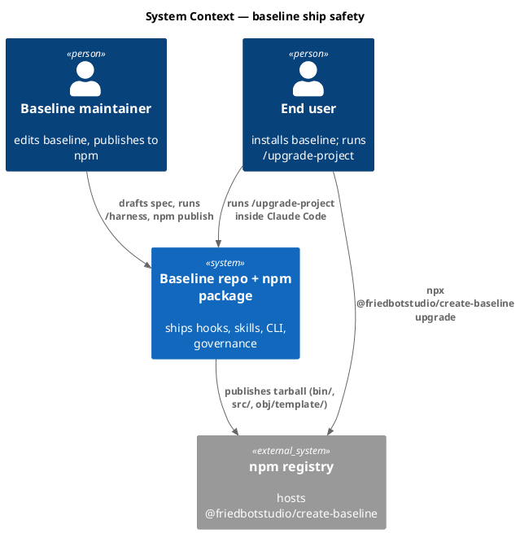

### C4 — Container

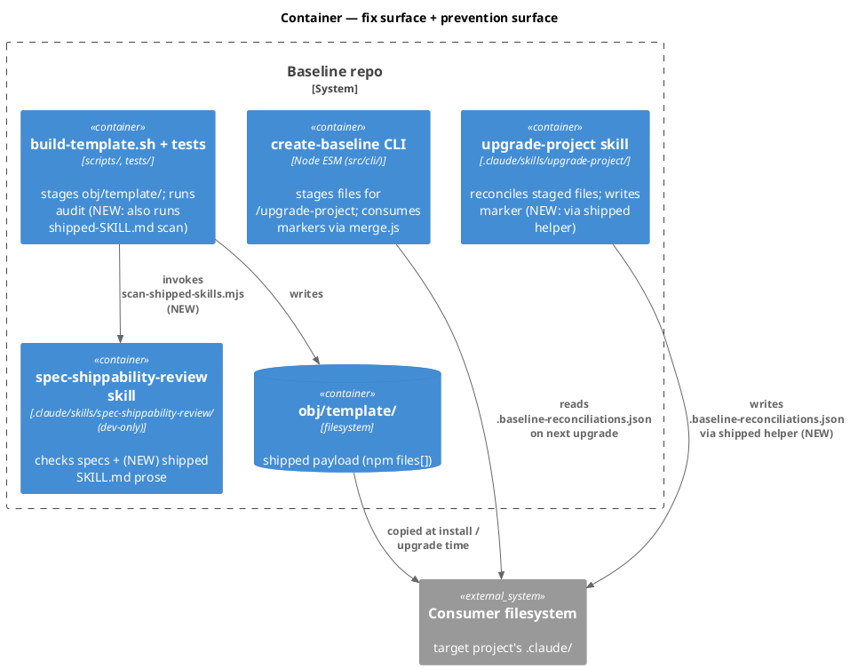

### C4 — Component (changed containers only)

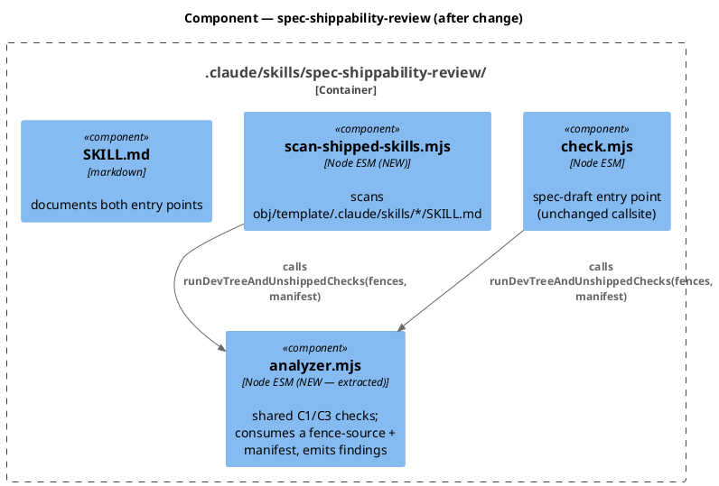

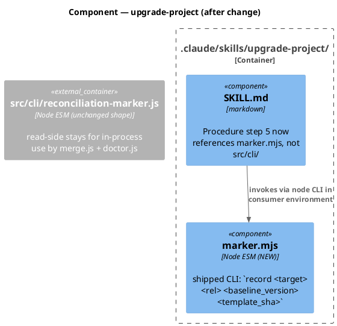

### Data model — class diagram

The "data model" here is the reconciliation marker JSON + the shippability finding/report shape. No DB — the JSON schemas ARE the contract.

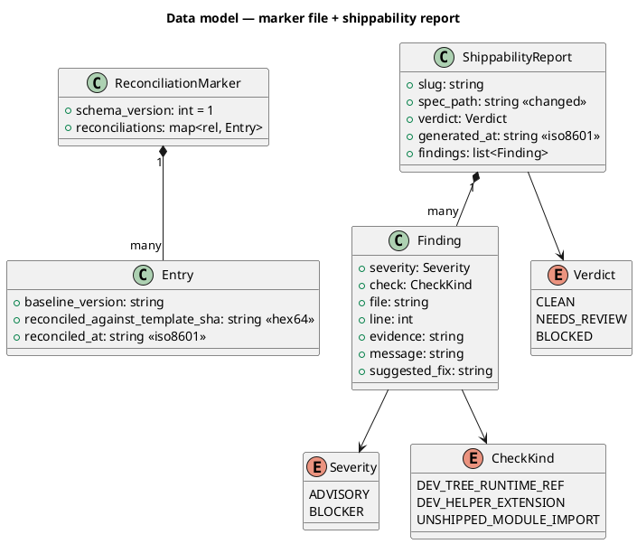

#### Migration DDL

```sql
-- no database. The "schema migration" for ShippabilityReport is:
-- `spec_path` becomes a free-form source identifier — for shipped-skill scans
-- it carries the SKILL.md path of the offending skill (or a synthetic
-- "shipped-skills:aggregate" sentinel when the report aggregates over many).
-- Pre-change values (spec paths under docs/specs/) remain valid; readers
-- treat the field as opaque. spec_approval_guard.sh already does (greps for
-- `"verdict": "BLOCKED"` only). No reader breaks.

-- reverse: revert is a code revert; no persisted state changes.
```

### Behavior — sequence per AC

#### Behavior #1 — Marker write succeeds in consumer install (AC-001)

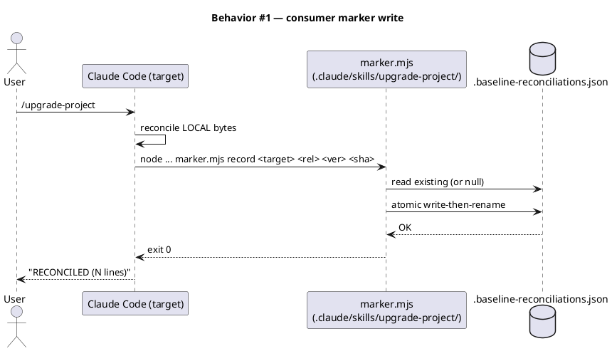

#### Behavior #2 — Byte-identical marker output across both writers (AC-002)

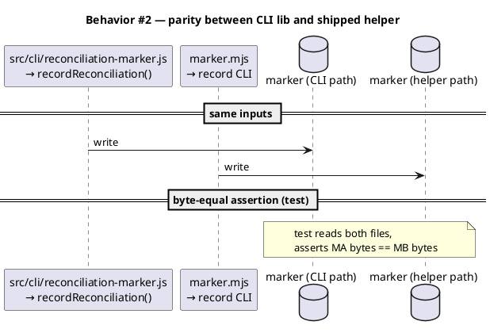

#### Behavior #3 — Shipped SKILL.md no longer references src/cli/ (AC-003)

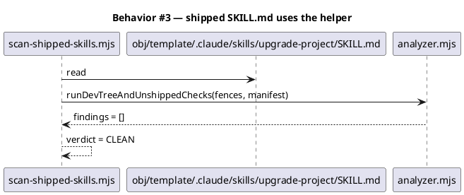

#### Behavior #4 — Scanner detects a planted dev-tree ref (AC-004)

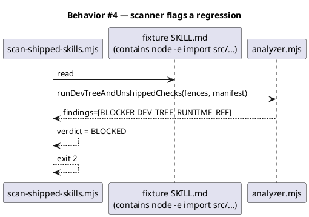

#### Behavior #5 — Build aborts on BLOCKER (AC-005)

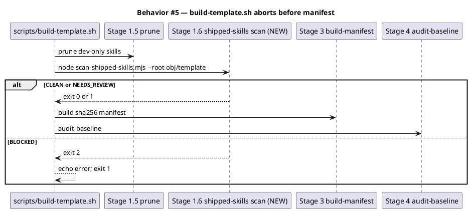

#### Behavior #6 — Test asserts zero BLOCKERs on current tree (AC-006)

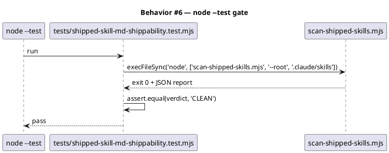

#### Behavior #7 — Report shape unchanged for spec_approval_guard (AC-007)

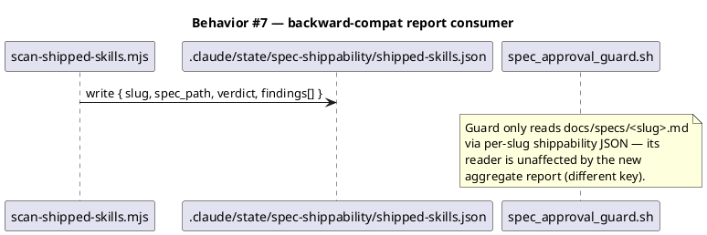

### Dependencies — graph

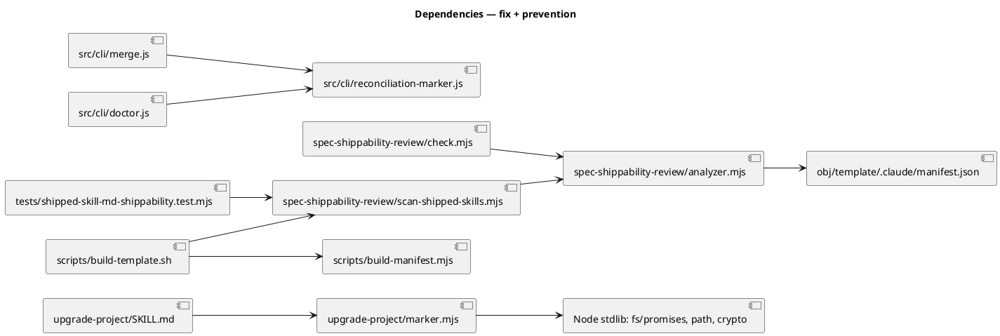

### Contracts

| Kind | Name | Input | Output | Errors | Idempotent |
|---|---|---|---|---|---|
| CLI | `node .claude/skills/upgrade-project/marker.mjs record <target> <rel> <baseline_version> <template_sha>` | 4 positional args | exit 0 on success; marker JSON updated at `<target>/.claude/.baseline-reconciliations.json` | exit 1 on `MarkerWriteError` (filesystem); exit 2 on bad args | yes (overwrites entry with same rel) |
| CLI | `node .claude/skills/spec-shippability-review/scan-shipped-skills.mjs [--root <dir>] [--report <path>]` | optional `--root` (defaults to `obj/template/.claude/skills`); optional `--report` (defaults to `.claude/state/spec-shippability/shipped-skills.json`) | exit 0 CLEAN / 1 NEEDS_REVIEW / 2 BLOCKED; report JSON at `--report` path; human-readable summary on stdout | exit 3 on missing root | yes (re-scan is pure) |
| Module API | `analyzer.mjs → runDevTreeAndUnshippedChecks(fences, manifest, sourcePath)` | `fences: [{startLine, body}]`, `manifest: {files: {...}}`, `sourcePath: string` | `findings: Finding[]` | none (pure) | yes |

### Libraries and versions

No third-party libraries introduced. All new code is Node ESM, stdlib only.

| Library@version | Purpose | Key APIs | Confirmed via context7 |
|---|---|---|---|
| Node stdlib `node:fs/promises` (built-in) | atomic marker write; spec/skill file reads | `readFile`, `writeFile`, `mkdir`, `rename`, `readdir` | n/a — built-in |
| Node stdlib `node:path` (built-in) | path joining | `join`, `dirname`, `resolve` | n/a — built-in |
| Node stdlib `node:crypto` (built-in) | atomic-write tmp suffix | `randomUUID` | n/a — built-in |
| Node stdlib `node:test` (built-in) | new shippability test | `test`, `describe`; assertions via `node:assert/strict` | n/a — built-in |

### Alternatives considered

| Alt | Summary | Rejected because |
|---|---|---|
| A | Make `src/cli/reconciliation-marker.js` reachable from the consumer by symlinking or build-copying it into `.claude/skills/upgrade-project/marker.mjs` at build time | Layering violation — the CLI's internal source tree leaks into the shipped skill payload. Future CLI refactors would silently break the consumer surface. Self-contained helper makes the dependency explicit. |
| B | Have SKILL.md invoke `npx @friedbotstudio/create-baseline mark-reconciled ...` and add a new CLI subcommand | Adds npx bootstrap latency (cold cache miss can prompt for install confirmation); makes the marker write contingent on the CLI being on PATH. The skill ought to be self-sufficient given that `.claude/` is the only dir we can assume on the target. |
| C | Inline the entire `recordReconciliation` body into the SKILL.md `node -e "..."` command | Works but produces an unreadable ~30-line shell string; can't be tested independently; future edits to marker semantics would diverge between the inlined string and `src/cli/reconciliation-marker.js`. The helper file is a tested, named surface. |
| D | Only fix SKILL.md; skip the shippability extension | Doesn't close the structural gap — the next SKILL.md edit could reintroduce the same class of bug. Spec-shippability already exists with the right C1/C3 checks; extending its scan target is a one-file change. Cheap insurance. |
| E | Add the prevention as a PreToolUse hook on Write to `.claude/skills/*/SKILL.md` | Hooks fire per-write, which would slow every interactive SKILL.md edit and produce noisy denials mid-draft. A build-time + test-time gate fails at the right moment (publish / CI), not during iteration. |

## Design calls

The write_set has no UI files (the project's `tdd.ui_globs` are `site-src/**`, `app/**/*.{tsx,jsx}`, etc.; this spec touches `.claude/`, `src/cli/`, `scripts/`, `tests/`, `docs/`). No design surfaces.

- *(none)*

## Acceptance criteria

| ID | Criterion (given / when / then) | Upstream AC | Sequence |
|---|---|---|---|
| AC-001 | given a consumer install (cwd has `.claude/` but no `src/`), when `/upgrade-project` reconciles a file and invokes the marker writer, then `<target>/.claude/.baseline-reconciliations.json` exists with a `reconciliations[<rel>]` entry whose `reconciled_against_template_sha` equals the staged `incoming_sha256` | user prompt | §Behavior #1 |
| AC-002 | given identical args `(target, rel, baseline_version, template_sha)`, when both `src/cli/reconciliation-marker.js → recordReconciliation` and `.claude/skills/upgrade-project/marker.mjs → record` write a marker, then the resulting JSON bytes are byte-identical modulo `reconciled_at` (the timestamp differs by call order) | user prompt | §Behavior #2 |
| AC-003 | given the shipped `.claude/skills/upgrade-project/SKILL.md`, when scanned by `scan-shipped-skills.mjs`, then verdict is CLEAN and zero findings cite `src/cli/...` | user prompt | §Behavior #3 |
| AC-004 | given a fixture SKILL.md containing `node -e "import('./src/foo.js')..."` inside a `bash` fence, when `scan-shipped-skills.mjs` runs, then it emits exactly one BLOCKER finding with `check: "DEV_TREE_RUNTIME_REF"`, the fixture path as `file`, and the offending line number, and exits 2 | user prompt | §Behavior #4 |
| AC-005 | given a baseline build, when `scan-shipped-skills.mjs` exits 2 on any baseline-owned SKILL.md, then `scripts/build-template.sh` exits non-zero before Stage 3 (manifest stamp), so `npm pack` / `npm publish` cannot produce a tarball containing the broken SKILL.md | user prompt | §Behavior #5 |
| AC-006 | given the current baseline tree after this spec ships, when `node --test tests/shipped-skill-md-shippability.test.mjs` runs, then it passes (verdict CLEAN); the same test against the pre-fix tree (SKILL.md still pointing at `src/cli/...`) fails with the expected BLOCKER finding | user prompt | §Behavior #6 |
| AC-007 | given a downstream reader (`spec_approval_guard.sh`) that consumes per-slug `.claude/state/spec-shippability/<slug>.json`, when `scan-shipped-skills.mjs` writes its aggregate report at `.claude/state/spec-shippability/shipped-skills.json`, then `spec_approval_guard.sh` is unaffected (different key; per-slug reads still resolve to the per-spec report) | user prompt | §Behavior #7 |

## Test plan

| Category | Scenario | Expected | Covers |
|---|---|---|---|
| Golden path | `marker.mjs record <tmp> docs/init/seed.md 0.9.0 abc...123` against an empty target | exit 0; marker file present with one entry; `reconciled_against_template_sha == abc...123` | AC-001 |
| Golden path | Both `recordReconciliation` (CLI lib) and `marker.mjs` invoked with same args; assert JSON parity ignoring `reconciled_at` field | both produce structurally identical markers (deep-equal modulo timestamp) | AC-002 |
| Golden path | `scan-shipped-skills.mjs --root .claude/skills` against current tree (after SKILL.md fix lands) | exit 0; verdict CLEAN; findings == [] | AC-003 |
| Failure mode (planted regression) | Fixture SKILL.md under `tests/fixtures/shipped-skill-blocker/<slug>/SKILL.md` containing `node -e "import('./src/foo.js')..."`; scan with `--root tests/fixtures/shipped-skill-blocker` | exit 2; verdict BLOCKED; exactly one BLOCKER finding with `check: "DEV_TREE_RUNTIME_REF"` and `evidence` containing `src/foo.js` | AC-004 |
| Failure mode (build gate) | Inject a planted SKILL.md into `$TEMPLATE_DIR` mid-build, then run the new Stage 1.6 step | Stage 1.6 exits non-zero with message `"build aborted: spec-shippability-review reported BLOCKER findings in shipped SKILL.md"`; Stage 3 manifest stamp never runs | AC-005 |
| Input boundary | `marker.mjs record` with 0/1/2/3 args (missing positional args) | exit 2; stderr names the missing arg(s); usage line on stderr | AC-001 (negative) |
| Input boundary | `marker.mjs record` with an existing marker file containing 5 prior entries; record a 6th `rel` not in the existing entries | exit 0; marker contains all 6 entries; schema_version unchanged | AC-001 |
| Input boundary | `marker.mjs record` with a `rel` that already exists in the marker | exit 0; entry replaced with new `template_sha` and refreshed `reconciled_at`; other entries untouched | AC-001 |
| Contract violation | `marker.mjs` invoked with subcommand other than `record` (e.g., `wat`) | exit 2; stderr names the unknown subcommand; usage line | AC-001 (negative) |
| Concurrency / ordering | Two `marker.mjs record` invocations against the same target with different `rel`s, run back-to-back (sequential) | both succeed; final marker contains both entries; no temp file left behind | AC-001 |
| Failure mode | `marker.mjs record` against a target whose `.claude/` is chmod 0555 (read-only) | exit 1; stderr matches `cannot write .claude/.baseline-reconciliations.json`; existing marker (if any) untouched | AC-001 (negative) |
| Failure mode | `scan-shipped-skills.mjs --root <nonexistent>` | exit 3; stderr names the missing root; no report file written | AC-004 (negative) |
| Regression trap | Direct test that `.claude/skills/upgrade-project/SKILL.md` contains zero `src/cli/` substrings inside any ```bash``` / ```sh``` / ```shell``` fence | unchanged (always zero); fails immediately if anyone reintroduces the dev-tree path | AC-003 |
| Regression trap | `tests/shipped-skill-md-shippability.test.mjs` passes against current `.claude/skills/` | always pass post-fix; failing means a shipped SKILL.md regressed | AC-006 |
| Contract violation | `scan-shipped-skills.mjs` finds a `.claude/skills/foo/helper.mjs` import that isn't in `obj/template/.claude/manifest.json → files` | exit 2; one BLOCKER finding `check: "UNSHIPPED_MODULE_IMPORT"` | AC-004 |
| Backward-compat | Existing spec-draft check.mjs invocation against a previously-CLEAN spec | exit 0; report shape unchanged (`spec_path` field present, `findings[]` shape unchanged) | AC-007 |

## Observability

| Signal | Name | Shape | Purpose |
|---|---|---|---|
| Log | `build: shipped-skill-md scan: <N> BLOCKER, <M> ADVISORY` | stderr line from `scripts/build-template.sh` Stage 1.6 | build operator + CI logs see exact counts |
| Log | `reconciliation-marker: cannot write .claude/.baseline-reconciliations.json: <err>` | stderr line from `marker.mjs` (matches existing `src/cli/reconciliation-marker.js` format) | parity with CLI log shape so future consolidated log scrapers don't need two patterns |
| Artifact | `.claude/state/spec-shippability/shipped-skills.json` | JSON `ShippabilityReport` with aggregate findings | post-mortem inspection when build aborts; consumed by the test |

No metrics, no alarms — both invocations are batch / build-time, not runtime serving paths.

## Rollout

- **Feature flag**: none — fix lands on `main`. The bug breaks consumer `/upgrade-project` marker recording; no value in flagging the fix off.
- **Migration order**: 1) land `marker.mjs` + SKILL.md edit + tests (Phase 6); 2) land `analyzer.mjs` refactor + `scan-shipped-skills.mjs` (Phase 6); 3) wire Stage 1.6 into `scripts/build-template.sh` (Phase 6); 4) run the full test suite (Phase 9 `/integrate`); 5) `/document` updates; 6) commit + release (Phase 11 — semantic-release auto-bumps minor on `feat:` commit prefix).
- **Canary**: n/a — the change is a build-time gate + a shipped helper. Real-world signal is the next end-user `/upgrade-project` run completing without `ERR_MODULE_NOT_FOUND` in its terminal output.

## Rollback

- **Kill-switch**: revert the commit. The marker write reverts to the broken `src/cli/...` invocation; the build-time gate disappears. Both surfaces revert atomically.
- **Signal to roll back**: any consumer report (or our own CI smoke run) showing a regression in `/upgrade-project` marker output, OR a build-time scan that wrongly blocks a clean SKILL.md edit. The 5-minute detection window applies to CI only — consumer reports surface via GitHub issues asynchronously. Concretely: the post-release `scripts/smoke-tarball.mjs` should grow a step that simulates a consumer install + `/upgrade-project` reconciliation + asserts the marker file exists (out of scope for this spec; tracked as a follow-up).

## Archive plan

- Defaults *(automatic)*: spec, spec-rendered/, spec approval, integrate report. No intake / scout / research / brd (spec-entry track skipped them); no swarm artifacts (Phase 6 routes solo per CLAUDE.md Article IV).
- Extras *(list any non-default files)*:
  - *(none)*

## Open questions

- *(none — design decisions in §Alternatives considered are settled in this spec)*
