# Spec — `create-baseline upgrade` version-aware no-op + manifest/project.json baseline_version stamping

## Context

| Input | Path |
|---|---|
| Intake | *(skipped — spec-entry track per `.claude/state/workflow.json`)* |
| BRD *(if any)* | *(n/a)* |
| Scout *(if any)* | *(skipped; main-context scouting captured in workflow.request)* |
| Research *(if any)* | *(skipped; no library question to resolve)* |

Driving observation (from the user's live repro on 2026-05-27):

```
$ npx @friedbotstudio/create-baseline upgrade .
▲  Your previous install predates version-tracked manifests, so this upgrade can't perform automatic three-way merges on customized files...
└  Applied 1 update(s).
```

This output appeared on the **second** consecutive upgrade against an unchanged template after the first upgrade's only customized file (`docs/init/seed.md`) had already been reconciled via `/upgrade-project`. Expected: "already on baseline X.Y.Z". Two root causes plus one missing contract:

- **Bug 1** — `src/cli/tui/upgrade.js:170` and `bin/cli.js:260` call `buildManifestFromDir(templateDir, tplFiles)` without `baseline_version`. The new manifest saved at `src/cli/merge.js:168` (end of every upgrade) therefore lacks the `baseline_version` field. `tui/upgrade.js:117-121 → isLegacyManifest` treats every manifest missing that field as legacy, so the warning fires on every subsequent run. The first-install path (`src/cli/install.js:61-62`) does pass `baseline_version` — the bug is asymmetry between install and upgrade.
- **Bug 2** — `src/cli/merge.js:101-106` runs `deepMergeMcpServers` unconditionally whenever `.mcp.json` exists in both template and target, and always pushes a `SPECIAL_MERGE` action (counted in `isApplied`). Idempotent re-runs against an unchanged template byte-rewrite `.mcp.json` to identical content and report "Applied 1 update(s)".
- **Missing contract** — the CLI has no "are we up to date?" path. Even after Bug 1 is fixed, a no-template-delta re-run runs the full three-way merge, byte-rewrites `.mcp.json`, and prints per-file action lines. The user-friendly outcome is a single line: "already on baseline X.Y.Z; nothing to do".

This spec adds `baseline_version` stamping to both write paths, surfaces the value in `<target>/.claude/project.json`, fixes the `.mcp.json` no-op detection, and introduces a version-aware fast-path at the upgrade entry point.

## Goal

After this spec ships, a `create-baseline upgrade` invocation against a target whose `<target>/.claude/.baseline-manifest.json → baseline_version` equals the running CLI's `package.json → version` prints `already on baseline X.Y.Z; nothing to do` and exits 0 with **zero filesystem writes** — no manifest rewrite, no `.mcp.json` rewrite, no `project.json` rewrite. Real upgrades (version mismatch) continue through the existing three-tier merge engine unchanged, with the saved manifest correctly stamped so the next re-run hits the fast-path.

## Non-goals

- **Semantic-merge engine changes.** Tier-3 SEMANTIC dispatch and the `/upgrade-project` skill stay untouched. The marker-matched short-circuit at `src/cli/merge.js:134-141` remains the per-file equivalence check; the new fast-path is the *whole-manifest* equivalence check, layered above it.
- **MANIFEST_VERSION bump.** The manifest schema stays at version 2 — `baseline_version` is an **additive** top-level field, already declared optional by `buildManifestFromDir` (`src/cli/manifest.js:38-40`). Legacy manifests without the field continue to load; the legacy-warning path keeps its existing role (one-shot during the first post-bug-fix upgrade).
- **New MCP servers, npm release process, install.js refactor.** Out of scope.
- **Re-fetching templates from npm.** Fast-path uses the on-disk manifest only.
- **`/upgrade-project` skill changes.** The reconciliation-marker contract (`src/cli/reconciliation-marker.js`, `.claude/skills/upgrade-project/marker.mjs`) is untouched. The marker still records per-file equivalence; the fast-path records whole-manifest equivalence.

## Design

Diagrams are the contract. Prose is only for things a diagram cannot say.

### C4 — System context

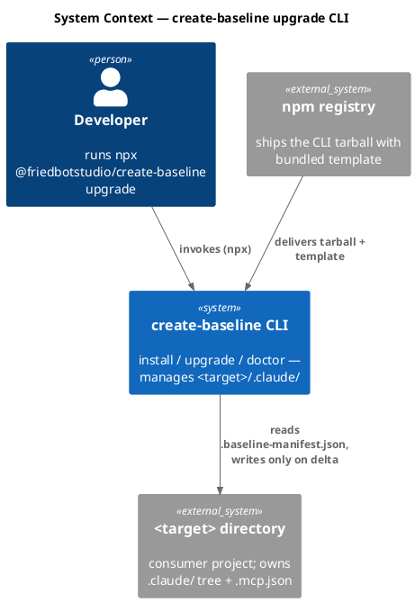

### C4 — Container

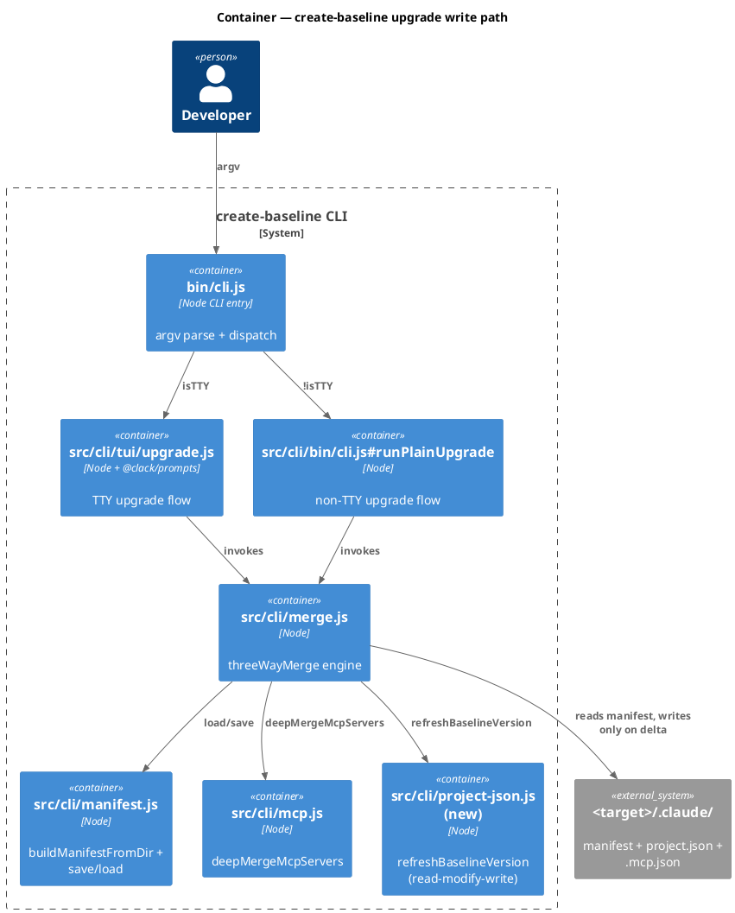

### C4 — Component (changed containers only)

`src/cli/tui/upgrade.js`, `src/cli/merge.js`, `src/cli/mcp.js` change. A new `src/cli/project-json.js` foundation module is introduced. `src/cli/install.js` is unchanged.

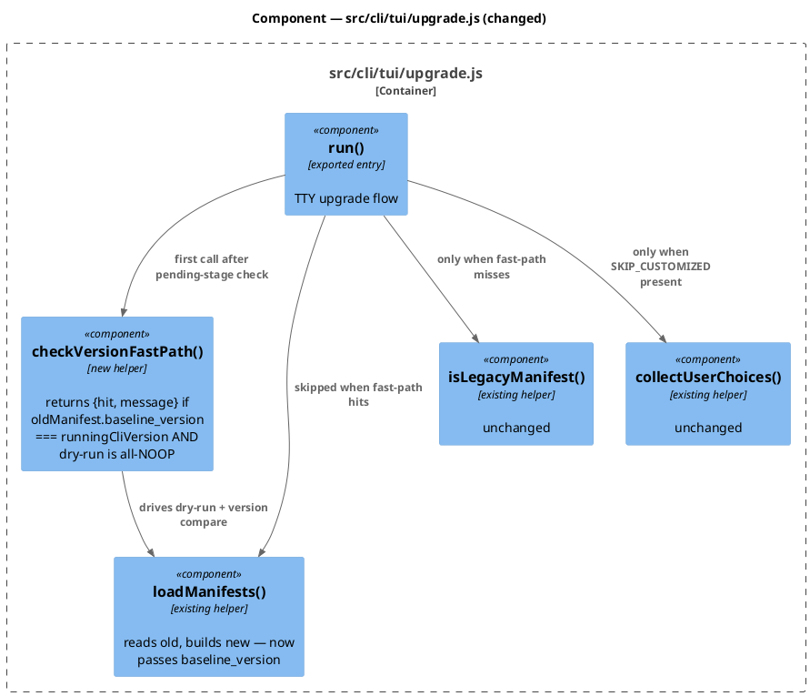

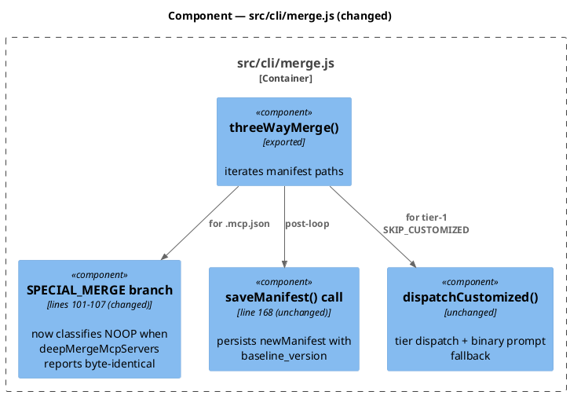

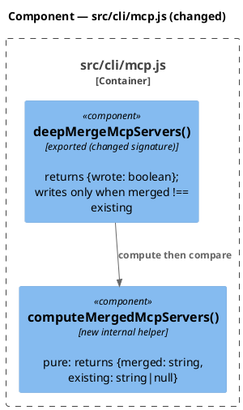

### Data model — class diagram

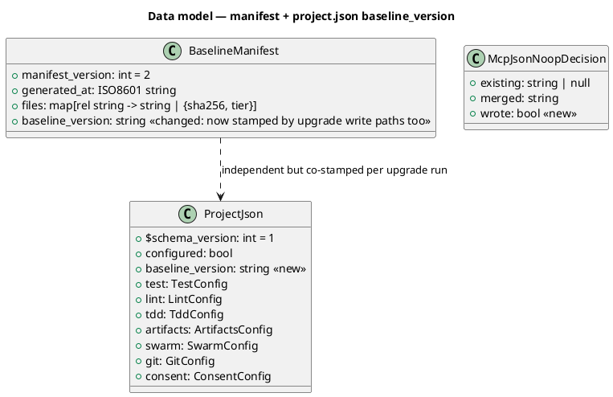

#### Schema migration (JSON, not SQL)

```sql
-- forward
-- (1) BaselineManifest gains required-when-present baseline_version on every save from upgrade write paths.
--     buildManifestFromDir already accepts opts.baseline_version (manifest.js:38-40); upgrade callers
--     must pass it. The forward migration is purely a write-side fix — no data migration is required for
--     existing on-disk manifests; their next upgrade run stamps the field.
-- (2) ProjectJson gains additive top-level field baseline_version: string.
--     Existing project.json files without the field load unchanged; the next install/upgrade refreshes it.

-- reverse
-- Remove baseline_version from new BaselineManifest writes and from ProjectJson refresh. Existing on-disk
-- files retain the field but it is ignored by older CLI builds. No destructive on-disk migration is needed
-- on rollback because the field is additive and read-tolerant.
```

### Behavior — sequence per AC

#### Behavior #1 — Install stamps baseline_version into manifest and project.json (AC-001)

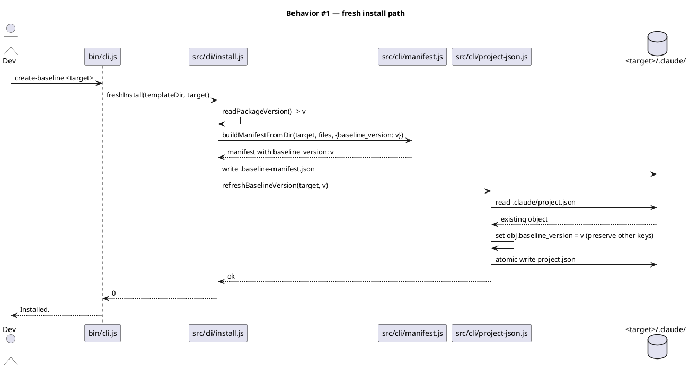

#### Behavior #2 — Upgrade write paths stamp baseline_version (AC-002)

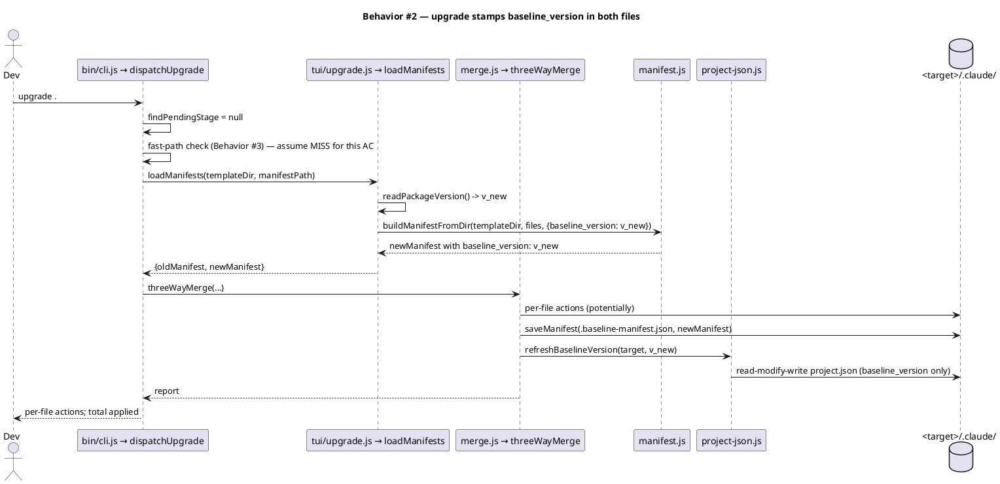

#### Behavior #3 — Version-aware fast-path (AC-003)

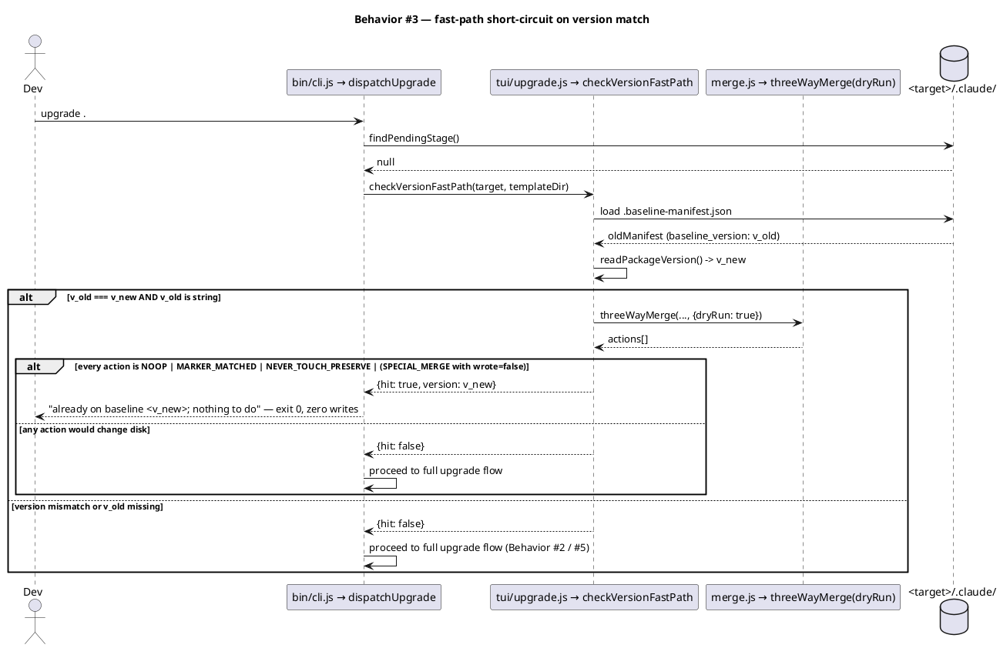

#### Behavior #4 — `.mcp.json` byte-identical deep-merge emits NOOP (AC-004)

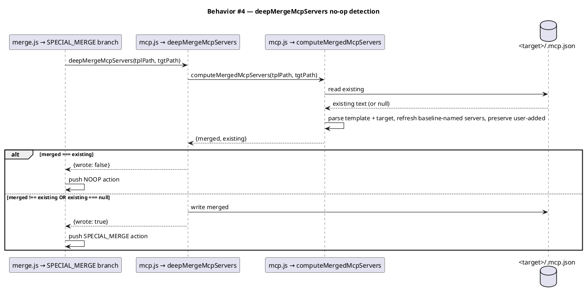

#### Behavior #5 — Legacy manifest first upgrade + subsequent fast-path (AC-005)

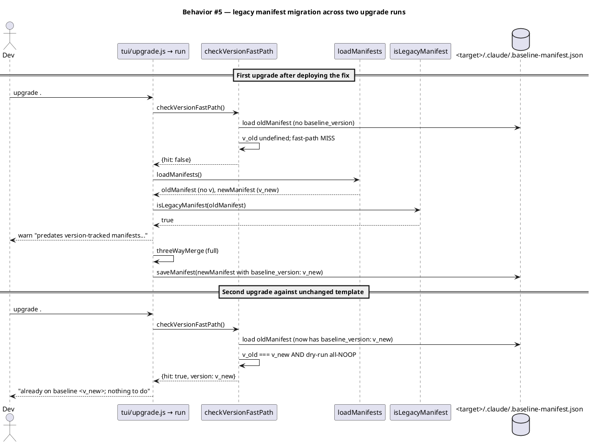

#### Behavior #6 — Pending stage takes precedence over fast-path (AC-006)

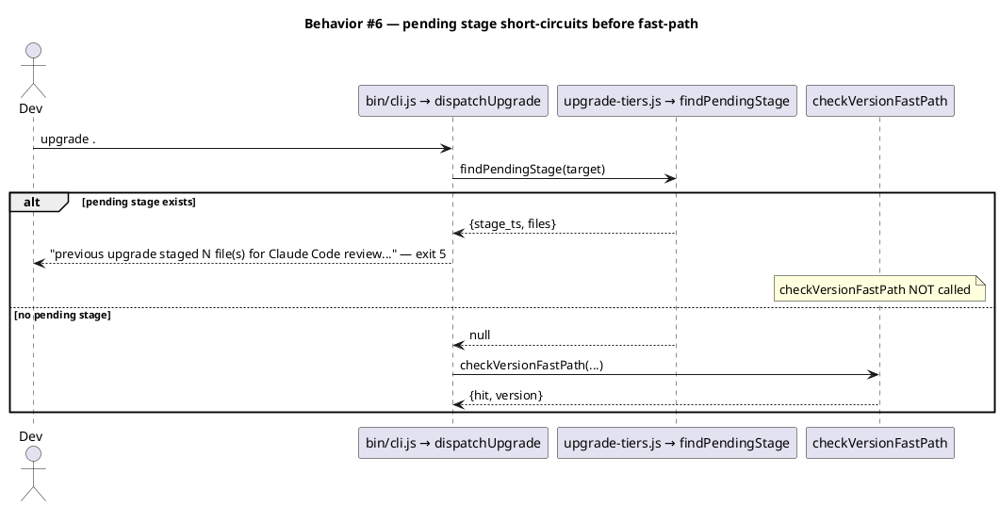

#### Behavior #7 — project.json refresh preserves user fields (AC-007)

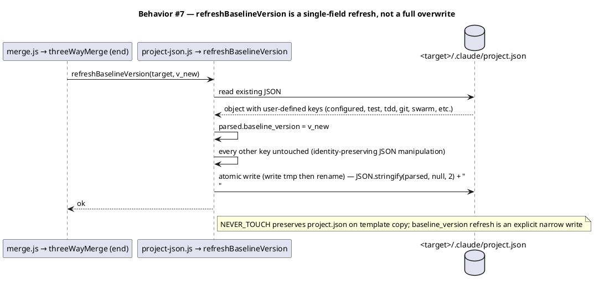

### Dependencies — graph

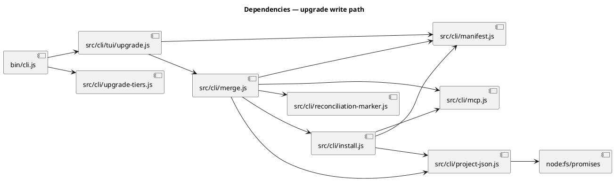

### Contracts

| Kind | Name | Input | Output | Errors | Idempotent |
|---|---|---|---|---|---|
| CLI | `create-baseline upgrade <target>` (fast-path hit) | target dir with `.baseline-manifest.json` whose `baseline_version` matches CLI's `package.json` version | stdout: `already on baseline <X.Y.Z>; nothing to do` — exit 0, zero filesystem writes | none (the fast-path path) | yes |
| CLI | `create-baseline upgrade <target>` (fast-path miss) | target dir; manifest version mismatch OR template delta OR pending stage | existing three-tier merge engine; per-file action lines + summary | per-file errors surface via existing exit-code map (3 customized, 4 mechanical-conflicted, 5 staged) | yes (re-running same template is safe) |
| Function | `deepMergeMcpServers(templatePath, targetPath)` | template `.mcp.json` path; target `.mcp.json` path (may be absent) | `{wrote: boolean}` — `wrote: false` iff merge would produce byte-identical output to existing target | filesystem errors propagate | yes |
| Function | `refreshBaselineVersion(target, version)` | target dir; version string (non-empty) | void; atomic write `<target>/.claude/project.json` with only the `baseline_version` field changed | throws if `project.json` is malformed JSON or `version` is not a non-empty string; absent `project.json` → skip (no-op) | yes (same version → identity write avoided iff merged === existing) |
| Function | `buildManifestFromDir(rootDir, fileList, opts)` | dir + file list + `{baseline_version: string}` | manifest object containing `baseline_version` when opt is set (already implemented — `manifest.js:38-40`) | none | yes |
| Function | `checkVersionFastPath({target, templateDir, oldManifest, newManifest})` | loaded inputs | `{hit: boolean, version?: string, reason?: string}` | none — `hit: false` on any uncertainty (legacy manifest, mismatched version, any non-NOOP action in dry-run) | yes |

### Libraries and versions

| Library@version | Purpose | Key APIs | Confirmed via context7 |
|---|---|---|---|
| `node:fs/promises` | atomic read/write for project.json | `readFile`, `writeFile`, `rename` | n/a (Node stdlib, no API surface change) |
| `node:path` | path joining for target/.claude/project.json | `join`, `dirname` | n/a (Node stdlib) |
| `node:crypto` | randomUUID for atomic-write tempfile names (mirroring `reconciliation-marker.js`) | `randomUUID` | n/a (Node stdlib) |
| `@clack/prompts@<existing pin in package.json>` | existing TUI prompts — used by new fast-path success message via `prompts.log.info` and `prompts.outro` | `log.info`, `outro` | n/a — already in use at `src/cli/tui/upgrade.js`; no new API call beyond what `run()` already invokes |

This spec introduces no new third-party library dependency. The context7 MCP rule (CLAUDE.md Article VI.5) is vacuously satisfied — there is no external library API to confirm. All new code uses node stdlib + `@clack/prompts` methods already in use within `src/cli/tui/upgrade.js`.

### Alternatives considered

| Alt | Summary | Rejected because |
|---|---|---|
| A | Bump `MANIFEST_VERSION` to 3 and treat absent `baseline_version` as schema-version mismatch | Forces a destructive migration; existing customer manifests would be flagged invalid. Additive field with read-tolerance is safer and aligned with `manifest.js:38-40`'s existing contract. |
| B | Detect equivalence by hashing every shipped template file and comparing to `oldManifest.files` instead of a string version compare | Strictly correct but slower (hashing every shipped file on every upgrade) and harder to message ("byte-identical templates" vs "already on baseline X.Y.Z"). String version compare is sufficient because the CLI's package version is the *causal* identity of the bundled template. |
| C | Add the fast-path check to `runPlainUpgrade` only, leave TTY path alone | The TTY path is the user-visible one in the bug report; this is the opposite of the right scope. Both paths must handle the fast-path; hoisting the check into `dispatchUpgrade` covers both. |
| D | Mark `.mcp.json` as NEVER_TOUCH instead of SPECIAL_MERGE | Loses the baseline-refresh semantic from `mcp.js`'s docstring (template-named servers should get arg/env updates). Wrong scope: the bug is misclassification of no-op merges, not the SPECIAL_MERGE contract itself. |
| E | Implement the fast-path inside `threeWayMerge` itself | Couples engine code to "should we even run the engine?" decision. Cleaner to ask the question *before* invoking the engine, in the dispatcher. |

## Design calls

No UI surfaces — this is CLI-only work. `project.json → tdd.ui_globs` does not intersect this spec's write_set.

- *(none)*

## Acceptance criteria

| ID | Criterion (given / when / then) | Upstream AC | Sequence |
|---|---|---|---|
| AC-001 | Given a target directory absent any `.claude/`, when the user runs `npx @friedbotstudio/create-baseline <target>`, then `<target>/.claude/.baseline-manifest.json` contains `"baseline_version": "<v>"` and `<target>/.claude/project.json` contains `"baseline_version": "<v>"` where `<v>` equals the running CLI's `package.json` `version` field. | workflow.request bullet (1) | §Behavior #1 |
| AC-002 | Given a target with an existing `.baseline-manifest.json` whose `baseline_version` differs from the running CLI's `version` (or is absent), when the user runs `create-baseline upgrade <target>` (both TTY and non-TTY paths), then on completion the saved `.baseline-manifest.json` carries the running CLI's `version` as `baseline_version`, and `project.json`'s `baseline_version` field is refreshed to the same value. | workflow.request bullet (1) + (3) | §Behavior #2 |
| AC-003 | Given a target whose `.baseline-manifest.json → baseline_version` equals the running CLI's `version` AND no pending stage exists under `.claude/state/upgrade/`, when the user runs `create-baseline upgrade <target>` AND every dry-run action would be `NOOP` / `MARKER_MATCHED` / `NEVER_TOUCH_PRESERVE` (or `SPECIAL_MERGE` with `wrote: false` per AC-004), then the CLI prints `already on baseline <version>; nothing to do`, exits 0, and performs zero filesystem writes (verified by mtime check on `.baseline-manifest.json`, `.mcp.json`, `project.json` before and after the run). | workflow.request bullet (3) | §Behavior #3 |
| AC-004 | Given a target whose `<target>/.mcp.json` deep-merge with the template's `.mcp.json` would produce byte-identical content to the existing target file, when `threeWayMerge` reaches the `.mcp.json` SPECIAL_MERGE branch, then the action emitted is `NOOP` (not `SPECIAL_MERGE`), the action is excluded from `isApplied`, and `<target>/.mcp.json` is not written (mtime preserved). | workflow.request bullet (4) | §Behavior #4 |
| AC-005 | Given a target whose `.baseline-manifest.json` lacks `baseline_version` (pre-fix manifest), when the user runs `create-baseline upgrade <target>` for the first time post-fix, then `isLegacyManifest` returns true and the warning `"predates version-tracked manifests..."` surfaces exactly once; the saved newManifest after that upgrade contains `baseline_version: <runningCliVersion>`; a subsequent upgrade against an unchanged template surfaces no warning and short-circuits via the fast-path (AC-003). | workflow.request bullet (5) | §Behavior #5 |
| AC-006 | Given a target with a pending stage at `.claude/state/upgrade/<ts>/manifest.json` whose `files[].status` includes at least one `PENDING` or `NEEDS_USER_INPUT`, when the user runs `create-baseline upgrade <target>` AND the version would otherwise match, then the CLI emits the existing pending-stage message and exits 5, and `checkVersionFastPath` is NOT invoked (verified by an absence of the "already on baseline" line). | workflow.request bullet (3) precedence | §Behavior #6 |
| AC-007 | Given a `<target>/.claude/project.json` containing user-defined top-level keys (`configured`, `test`, `tdd`, `git`, `swarm`, `artifacts`, etc.), when `refreshBaselineVersion(target, v)` runs, then every existing top-level key is preserved byte-for-byte (parse → set `baseline_version: v` → serialize), and the file's only mutation across the call is the addition or update of the `baseline_version` field. | workflow.request bullet (2) | §Behavior #7 |

## Test plan

| Category | Scenario | Expected | Covers |
|---|---|---|---|
| Golden path | Fresh install in clean temp dir; assert `.baseline-manifest.json.baseline_version` and `project.json.baseline_version` both equal `package.json.version` | both fields present; equal; semver string | AC-001 |
| Golden path | Upgrade against a manifest with `baseline_version: "0.0.0"`; assert post-run manifest + project.json have `baseline_version: <currentVersion>` | both fields refreshed | AC-002 |
| Golden path | Upgrade against unchanged template + matching `baseline_version`; assert stdout contains `already on baseline <v>; nothing to do`, exit code 0, mtime unchanged on `.baseline-manifest.json` / `.mcp.json` / `project.json` | fast-path hit | AC-003 |
| Golden path | Upgrade with `.mcp.json` whose deep-merge result is byte-identical to existing; assert action `NOOP`, file mtime preserved | no-op detection works | AC-004 |
| Golden path | Two-stage: first upgrade against legacy manifest (no `baseline_version`); assert legacy warning fires. Second upgrade against the saved post-fix manifest with unchanged template; assert fast-path hit, warning absent | migration completes | AC-005 |
| Golden path | Pending stage present + version equal; assert pending-stage message, exit 5, no fast-path message | pending precedence | AC-006 |
| Golden path | `refreshBaselineVersion` on a `project.json` with deeply-nested user keys; assert parse → set → serialize round-trip preserves every other key (deep-equal check) | identity-preserving | AC-007 |
| Input boundary | `oldManifest.baseline_version` is empty string `""` → fast-path treats as missing | falls through to full merge | AC-003, AC-005 |
| Input boundary | `oldManifest.baseline_version === "0.0.0"` but `package.json.version === "0.0.0"` → fast-path hits | string equality, no semver compare | AC-003 |
| Input boundary | `project.json` absent on target → `refreshBaselineVersion` is a no-op (does not create the file) | no-op | AC-007 |
| Input boundary | `project.json` is malformed JSON → `refreshBaselineVersion` throws with named error; upgrade flow surfaces it as a phase-failure | hard error | AC-007 |
| Contract violation | `.mcp.json` deep-merge result has a different ordering of keys but same semantic content | serializer normalization → either both stringify identically (NOOP) or treat as SPECIAL_MERGE; current behavior: JSON.stringify is deterministic for known key sets → NOOP. Document the chosen behavior in `mcp.js` so a future regression has a written contract. | AC-004 |
| Concurrency / ordering | Pending-stage check runs before fast-path check (order matters per AC-006) | concrete sequence: `findPendingStage` then `checkVersionFastPath` | AC-006 |
| Failure mode | Filesystem error during `refreshBaselineVersion` write (read-only fs) | atomic rename fails; throws; upgrade surfaces error; manifest write also surfaces (no partial state) | AC-002, AC-007 |
| Failure mode | `oldManifest` JSON is malformed | `loadManifest` already throws; existing behavior; not regressed | AC-002 |
| Regression trap | Existing tier-1 / tier-2 / tier-3 merge flows still work for version-mismatch upgrades (re-run the existing `tests/upgrade-tiers.test.mjs` suite) | no regression | AC-002 |
| Regression trap | NEVER_TOUCH preservation of `.claude/project.json` on template overlay still works (install.js path) — only `baseline_version` field gets refreshed | NEVER_TOUCH list unchanged | AC-001, AC-007 |
| Regression trap | `/upgrade-project` reconciliation marker continues to short-circuit per-file customization re-prompts after this spec | marker-matched branch in `merge.js:134-141` unchanged | AC-003 indirectly |

## Observability

| Signal | Name | Shape | Purpose |
|---|---|---|---|
| Log (stdout, TTY) | `already on baseline <version>; nothing to do` | string, prefixed by `@clack/prompts` outro frame | user-visible "you're caught up" — the missing message |
| Log (stdout, non-TTY) | identical string written via `console.log` / `io.log` | plain text line | non-TTY parity |
| Log (stdout, both) | existing per-file action lines (`NOOP`, `OVERWRITE`, etc.) | one per affected path | unchanged; SPECIAL_MERGE → NOOP reclassification surfaces here |
| Log (stderr) | `refreshBaselineVersion: cannot write project.json: <reason>` (only on failure) | one-line error | filesystem failure surface |

No new metrics or alarms — CLI invocations are interactive, not long-running services.

## Rollout

- **No feature flag.** This is a fix + additive contract; ship in the next semantic-release minor (the manifest schema change is additive). The version bump is the rollout signal: post-bump installs/upgrades stamp `baseline_version`, and the fast-path becomes active starting on each consumer's second upgrade against the bumped CLI.
- **Migration order**: (1) ship the fix — install + upgrade write paths stamp `baseline_version`. (2) On first consumer upgrade post-bump, legacy warning fires once (AC-005), new manifest stamps the field, project.json refreshes. (3) On second consumer upgrade against an unchanged template, fast-path hits and prints the new message. No DDL backfill; no dual-write window.
- **Canary**: maintainer reproduces the user's bug locally (the literal repro at the top of this spec) post-fix and confirms the new message; CI green for `tests/upgrade*.test.mjs` and `tests/cli-tui.test.mjs`.

## Rollback

- **Kill-switch**: pin the consumer's `@friedbotstudio/create-baseline` to the previous published version. The additive `baseline_version` field is read-tolerant — the old CLI ignores it gracefully. Existing `project.json` files with the new field stay valid against the old CLI (which never reads `baseline_version`).
- **Signal to roll back**: a regression in `tests/upgrade-tiers.test.mjs` mechanical-merge or semantic-stage paths (verified by `/integrate` re-run on the merge commit). Maintainer rolls back within the same dev session by reverting the merge commit.

## Archive plan

- Defaults *(automatic)*: spec, spec-rendered/, spec approval, security report (if produced).
- Extras *(list any non-default files)*:
  - *(none)*

## Open questions

- *(none — all design decisions are made in this spec; TDD will execute the recipe)*
