# Remove Python as a runtime dependency from the baseline

<!--
Technical spec. Produced by the `spec` skill.

Guard-enforced invariants:
  - Required ## headings (artifact_template_guard): Goal, Design, Design calls,
    Acceptance criteria, Test plan.
  - Required diagram kinds inside ```plantuml``` fences (spec_diagram_presence_guard):
    c4_context, c4_container, c4_component, sequence, class, dependency_graph.
  - Every ```plantuml``` fence must parse (plantuml_syntax_guard).
  - Design calls populated (spec_design_calls_guard) — write_set intersects ui_globs
    via site-src/memory.njk + site-src/skills/core.njk.

Approval: NEVER add "Status: Approved" — spec_approval_guard blocks it.
-->

## Context

| Input | Path |
|---|---|
| Intake | `docs/intake/remove-python-runtime-dep.md` |
| Scout | `docs/scout/remove-python-runtime-dep.md` |
| Research | `docs/research/remove-python-runtime-dep.md` |
| Backlog (auto-close target) | `migrate-bash-python-heredocs-to-javascript-d454` |

## Goal

A user can install the baseline and run the full 11-phase workflow on a machine where `python3` is absent from `PATH`. `node >= 18.17` is the only scripting-runtime requirement the baseline declares; `java` remains required only for `spec-render` (PlantUML).

## Non-goals

- Not changing the hook execution model, performance envelope, or guard semantics. Hooks were ported in commit `9b54561`; this spec covers only the residual skill-side Python.
- Not changing the external invocation contract of any skill — `/memory-flush`, `/tdd`, `/audit-baseline`, `/spec-render`, `/spec-lint`, `/swarm-plan`, `/swarm-dispatch` keep their user-facing slash commands and slug arguments unchanged.
- Not removing `python3` from third-party tooling under `.config/plugins/marketplaces/**` — that's installed Python plugins, out of scope of the baseline.
- Not removing the `process_lifecycle_guard` advisory matcher's `python.*http.server` pattern from documentation — Scout confirmed the matcher source has zero `python` references; the seed.md description is documentary and stays.
- Not addressing `improved-backlog-item-detection-046c` or `seed-template-md-pre-redesign-drift-a1f3` — separate backlog items.

## Design

Diagrams are the contract. Prose only fills the gaps a diagram cannot cover.

### C4 — System context

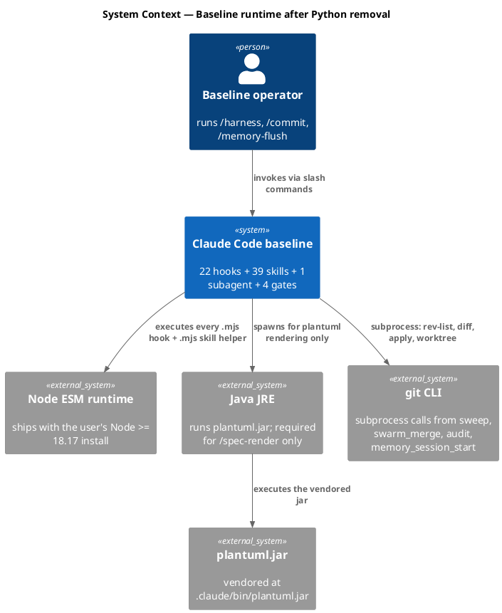

### C4 — Container

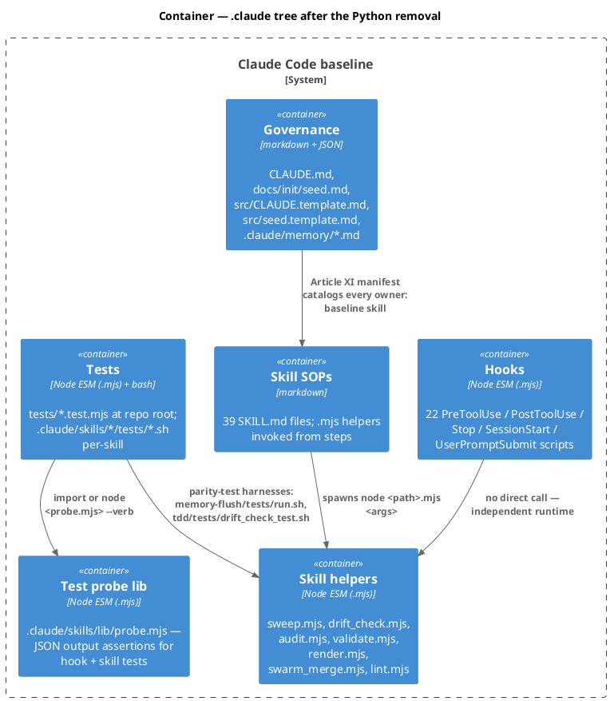

### C4 — Component (memory-flush skill — the largest port surface)

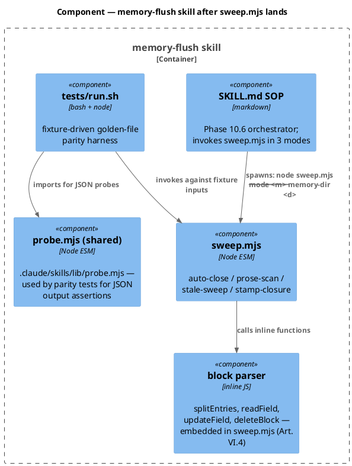

### Data model — class diagram

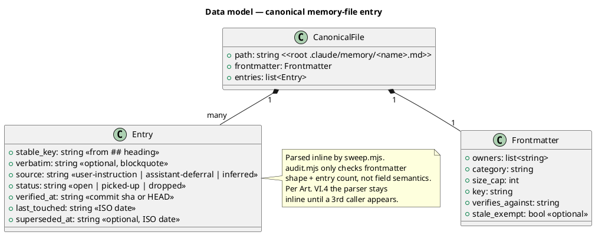

### Behavior — sequence per AC

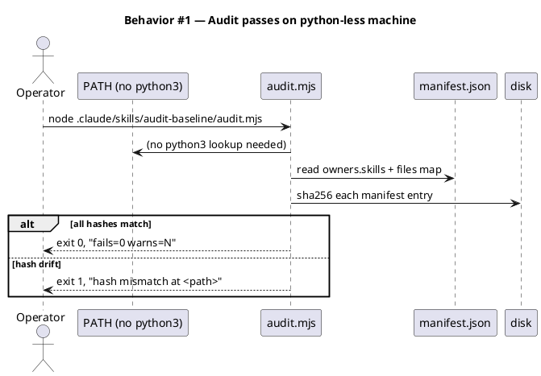

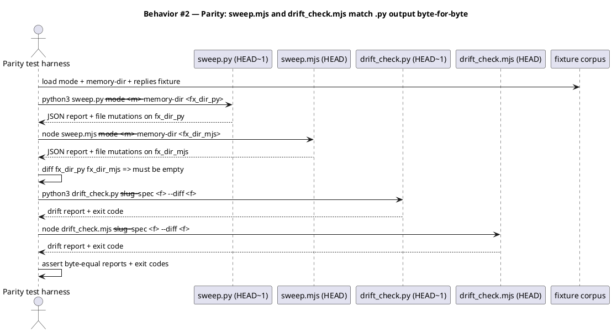

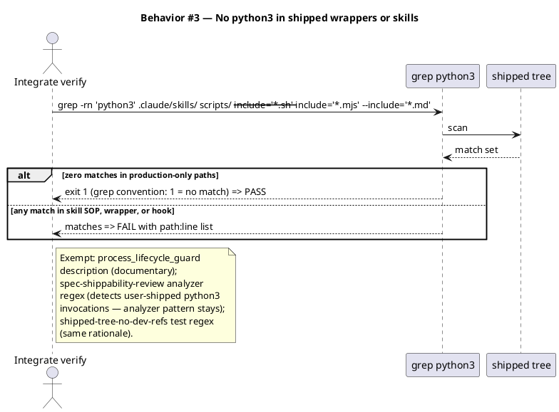

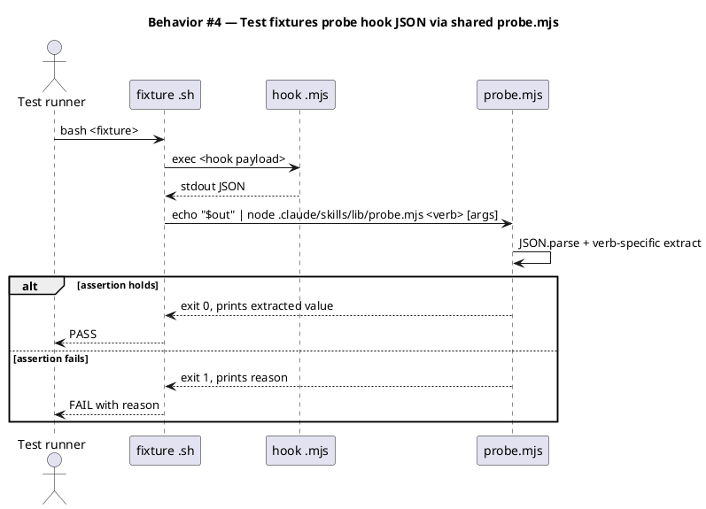

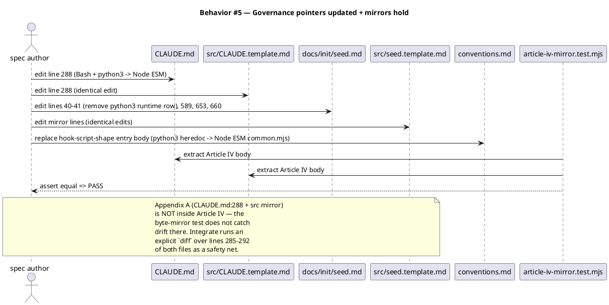

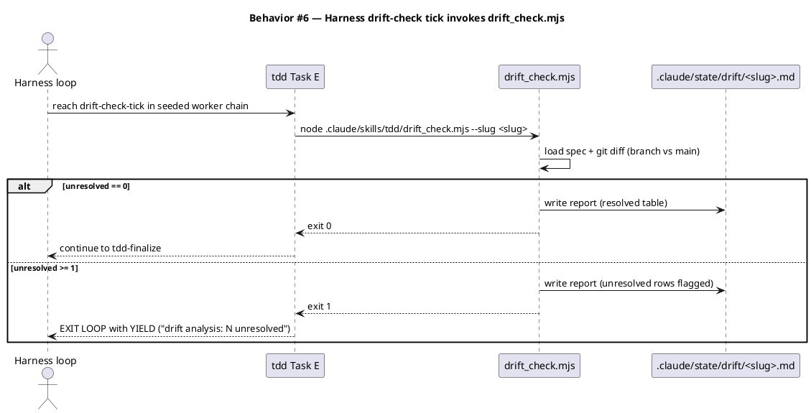

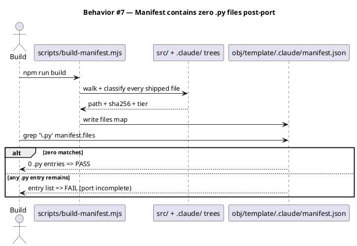

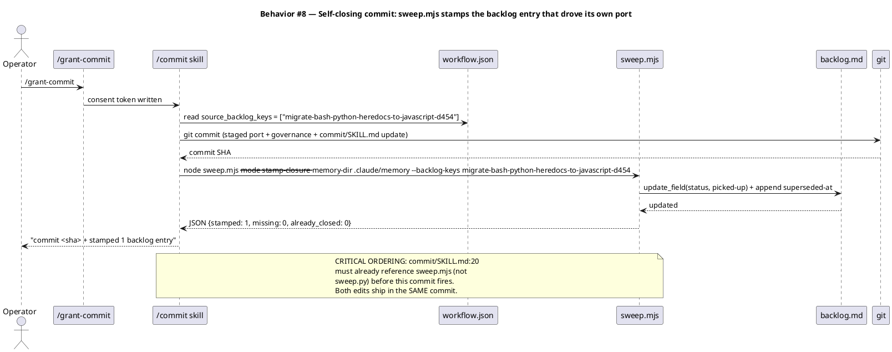

### State — runtime presence of python3

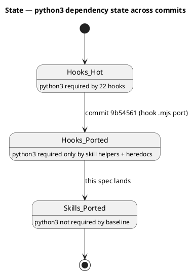

### Dependencies — graph

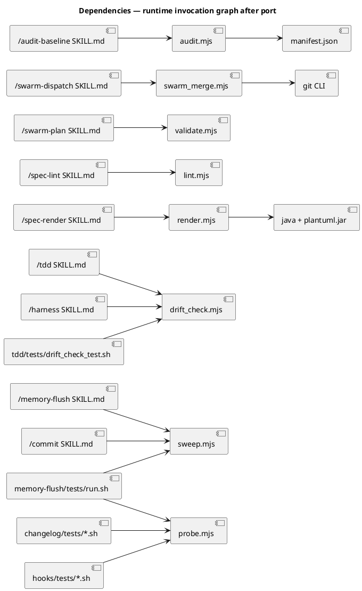

### Contracts

| Kind | Name | Input | Output | Errors | Idempotent |
|---|---|---|---|---|---|
| CLI | `node sweep.mjs --mode auto-close --memory-dir <dir>` | `<dir>` with 7 canonical memory files | JSON report `{closed, errors, invariant_violations}`; mutates files | exit 2 on bad args | yes (re-running on stamped entries no-ops) |
| CLI | `node sweep.mjs --mode prose-scan --memory-dir <dir>` (stdin: replies `\n`-separated) | `<dir>` + stdin replies | JSON report `{prompted, kept, discarded}` | exit 2 on bad args | yes (no `superseded-at` written by this mode) |
| CLI | `node sweep.mjs --mode stale-sweep --memory-dir <dir>` (stdin: replies) | `<dir>` + stdin | JSON report `{verified, deleted, marked_closed}` | exit 2 on bad args | yes |
| CLI | `node sweep.mjs --mode stamp-closure --memory-dir <dir> --backlog-keys <csv>` | `<dir>` + non-empty `<csv>` | JSON report `{stamped, missing, already_closed}` | exit 2 on missing `--backlog-keys` | yes (re-stamping a closed entry no-ops) |
| CLI | `node drift_check.mjs --slug <slug> [--spec <path>] [--diff <path>]` | spec + branch diff | report at `.claude/state/drift/<slug>.md`; exit 0 iff unresolved == 0 | exit 0 on missing spec ("no spec; skipped") | yes |
| CLI | `node audit.mjs [--file=<rel>]` | repo root via `$CLAUDE_PROJECT_DIR` | text table to stdout; exit 1 iff any FAIL | exit 0 if `--file` is out of baseline scope | yes |
| CLI | `node validate.mjs <spec> <plan.json>` | swarm plan path | rewrites plan with `waves`; exit 0 on success | exit 1 on schema/cycle violation, exit 2 on bad invocation | no (modifies file in place; designed for one-shot) |
| CLI | `node render.mjs <slug>` | slug | extracts plantuml blocks, writes `.puml` + `.svg` under `docs/specs/_rendered/<slug>/` + `index.md` | exit 1 on render failure | yes (clears `_rendered/<slug>/` first) |
| CLI | `node swarm_merge.mjs <plan> <task-id> <worktree>` | plan, task-id, worktree path | applies patch to main, removes worktree; exit 0 | exit 1 on audit fail or apply fail; exit 2 on bad inputs | no (mutates main + removes worktree) |
| CLI | `node lint.mjs <slug>` | slug | text table for 4 checks + exit code | exit 1 if any FAIL | yes |
| CLI | `node probe.mjs <verb> [args]` (stdin: hook JSON) | hook JSON on stdin + verb (`field`, `block`, `additional-context`) | extracted value to stdout | exit 1 on parse error / missing key | yes |

### Libraries and versions

This port uses only Node's standard library. No third-party packages are added.

| Library@version | Purpose | Key APIs | Confirmed via context7 |
|---|---|---|---|
| `node:util@built-in (Node 18.17+)` | argparse-equivalent | `parseArgs({args, options, strict, allowPositionals})` | verified via in-repo usage at `.claude/skills/changelog/changelog.mjs:17` (no third-party API; context7 not required per Art. VI.5) |
| `node:fs@built-in` | read/write files, sync stdin | `readFileSync(path, 'utf8')`, `readFileSync(0, 'utf8')`, `writeFileSync`, `existsSync` | in-repo usage at `.claude/hooks/lib/common.mjs:13` |
| `node:child_process@built-in` | spawn git / java / plantuml | `spawnSync(cmd, args, {encoding: 'utf8'})` | in-repo usage at `.claude/hooks/test_runner.mjs:70` |
| `node:crypto@built-in` | sha256 hashing | `createHash('sha256').update(buf).digest('hex')` | in-repo usage at `scripts/build-manifest.mjs:64` |
| `node:path@built-in` | path manipulation | `join`, `resolve`, `relative`, `dirname` | every `.mjs` file |

### Alternatives considered

| Alt | Summary | Rejected because |
|---|---|---|
| A | Keep `.sh` wrappers; only replace the python3 heredoc body with an inline `node -e '...'` block | Loses readability (multi-line JS inside a quoted heredoc) and forces every wrapper to keep two languages. Collapse to `.mjs` is cleaner and matches the user's option-A choice during triage scoping. |
| B | Introduce a shared `.claude/skills/lib/memory-block-parser.mjs` between `sweep.mjs` and `audit.mjs` | Art. VI.4: two callers, not three. Audit only needs shape checks; sweep needs full editing. Different surfaces — sharing would over-fit one and under-fit the other. Promote later if a third caller appears. |
| C | Hand-roll argv parsing per port (matches some existing skills) | `node:util.parseArgs` is stable on our Node floor and already in use; choosing it avoids 7× reimplementation drift on flag parsing. |
| D | Ship the port across two commits (port first; backlog stamp uses python3 once more) | Breaks the self-closing-commit invariant. The very commit that lands this workflow MUST invoke the new sweep.mjs (because commit/SKILL.md:20 has been updated). One atomic commit is structurally necessary. |

## Design calls

The write_set intersects `project.json → tdd.ui_globs` via `site-src/memory.njk` and `site-src/skills/core.njk`. Both surfaces describe `sweep.py stamp-closure` in user-facing copy and need the same rename to `sweep.mjs`. Two design calls:

| Slug | Intent | Target files | Write set | Register | References |
|---|---|---|---|---|---|
| memory-page-sweep-rename | Update the figcaption describing backlog auto-close to reference `sweep.mjs` (preserving the existing pedagogical narrative and visual frame). One copy edit, no layout change. | `site-src/memory.njk:182` | `site-src/memory.njk` | inherit | `docs/scout/remove-python-runtime-dep.md` Layer D site-src section |
| core-skills-list-sweep-rename | Update the `commit` skill bullet under the core-skills list to reference `sweep.mjs stamp-closure`. One copy edit; no list reflow. | `site-src/skills/core.njk:61` | `site-src/skills/core.njk` | inherit | `docs/scout/remove-python-runtime-dep.md` Layer D site-src section |

Both rows are pure copy renames (the user-facing word changes from `sweep.py` to `sweep.mjs`). Register inherits from the surrounding page per Art. X.1; em-dash bans apply at these surfaces (user-facing copy). No layout work — `design-ui` will Stage-0-classify both as `mixed_brief` or `not_a_design_task → correct_lane: copy`, route through the `copywriting` register check, and confirm the surrounding paragraphs still cohere.

## Acceptance criteria

| ID | Criterion (given / when / then) | Upstream AC | Sequence |
|---|---|---|---|
| AC-001 | given a freshly cloned baseline repo on a machine with `python3` absent from `PATH`, when the operator runs `node .claude/skills/audit-baseline/audit.mjs`, then the audit exits 0 with no `python3: command not found` error and no FAIL rows attributable to the port | intake AC 1 | §Behavior #1 |
| AC-002 | given the pre-port `.py` files captured as golden-file fixtures (4 sweep modes × ≥ 2 fixtures each + 4 drift_check scenarios), when `sweep.mjs` and `drift_check.mjs` are run against the same fixtures, then the diff between `.py` output and `.mjs` output is exactly 0 bytes per fixture (with canonical sorting applied where output order depends on filesystem iteration) | intake AC 2 | §Behavior #2 |
| AC-003 | given the shipped tree post-port, when `grep -rn 'python3' .claude/skills/ scripts/ --include='*.sh' --include='*.mjs' --include='*.md'` is run, then zero matches are returned in production paths (analyzer regexes that detect user-shipped `python3` invocations in `analyzer.mjs:24` and `tests/shipped-tree-no-dev-refs.test.mjs:38` are exempt and stay) | intake AC 3 | §Behavior #3 |
| AC-004 | given the 8 test fixtures (3 hook + 3 changelog + 2 parity harnesses) currently invoking `python3`, when the workflow has landed, then each fixture invokes `node .claude/skills/lib/probe.mjs <verb>` (probe) or `node <helper>.mjs <args>` (parity harness) and the test suite exits 0 on the same assertions | intake AC 4 | §Behavior #4 |
| AC-005 | given the 9 governance pointers naming `python3` (`CLAUDE.md:288` + mirror, `docs/init/seed.md:40-41,589,653,660` + mirror, `.claude/memory/conventions.md → hook-script-shape`, `.claude/memory/README.md:98`, `.claude/commands/init-project.md:31,132`, `.claude/commands/init-project-doctor.md:16`, 5 SKILL.md SOPs), when the workflow has landed, then none of them name `python3` as a baseline runtime requirement and the article-iv-mirror test continues to pass | intake AC 5 | §Behavior #5 |
| AC-006 | given the harness drift-check tick in `.claude/skills/harness/SKILL.md:124` (and the mirror reference in `.claude/skills/tdd/SKILL.md:80`), when the workflow has landed, then both reference `node .claude/skills/tdd/drift_check.mjs --slug <slug>` and a live harness invocation produces the report at `.claude/state/drift/<slug>.md` | intake AC 6 | §Behavior #6 |
| AC-007 | given the shipped manifest (`obj/template/.claude/manifest.json`), when the workflow has landed, then no entry in `manifest.files` has a `.py` suffix and every new `.mjs` file appears with a sha256 + tier | intake AC 7 | §Behavior #7 |
| AC-008 | given the seed.md runtime-requirements section, when the workflow has landed, then the `python3 on PATH (skill-only)` bullet at line 41 is removed (not downgraded), the mirror `src/seed.template.md` carries the identical removal, and the byte-mirror tests continue to pass | intake AC 8 | §Behavior #5 |
| AC-009 | given audit-baseline's helper-presence check at `audit.sh:533-550` (which hardcodes 6 `.sh` paths), when the workflow has landed, then the equivalent check inside `audit.mjs` expects the post-collapse paths (`validate.mjs`, `swarm_merge.mjs`, `render.mjs`, `lint.mjs`, `archive.sh` — unchanged, archive has no python heredoc — `audit.mjs`) and all listed files exist + are executable | intake AC 9 | §Behavior #1 |
| AC-010 | given the source_backlog_keys array on this workflow's `workflow.json` names `migrate-bash-python-heredocs-to-javascript-d454`, when the user runs `/grant-commit` then `/commit`, then `/commit` Step 6 invokes the new `sweep.mjs --mode stamp-closure` (NOT `sweep.py`) and stamps the backlog entry `status: picked-up` + `superseded-at: <today>` in the SAME commit that ships the port | new (lockstep) | §Behavior #8 |
| AC-011 | given `commit/SKILL.md:20`, when the workflow has landed, then the Step 6 invocation reads `node .claude/skills/memory-flush/sweep.mjs --mode stamp-closure ...` and the SKILL.md edit is in the SAME commit as `sweep.mjs` (atomic write_set per Component 5) | new (lockstep) | §Behavior #8 |
| AC-012 | given the byte-mirror invariants between CLAUDE.md ↔ src/CLAUDE.template.md and docs/init/seed.md ↔ src/seed.template.md, when the workflow has landed, then `tests/article-iv-mirror.test.mjs` passes AND a direct `diff` over Appendix A lines (CLAUDE.md:285-292 and the mirror) returns zero bytes | new (mirror safety net) | §Behavior #5 |
| AC-013 | given the 17 landmark entries in `.claude/memory/landmarks.md` that point to `.py` paths or cite `python3` in caveats, when the workflow has landed (and after Phase 10.6 /memory-flush has run), then every such entry either references the new `.mjs` path or is deleted as stale per Art. IX.2 re-verification rules | new (memory hygiene) | §Behavior #5 |

## Test plan

| Category | Scenario | Expected | Covers |
|---|---|---|---|
| Golden path | run `node sweep.mjs --mode auto-close --memory-dir <fx>` against a fixture with 2 entries carrying `superseded-at: <past-date>` | both deleted; JSON `{closed: 2, errors: 0}`; identical to `python3 sweep.py` output on the same fixture | AC-002 |
| Golden path | run `node sweep.mjs --mode stamp-closure --memory-dir <fx> --backlog-keys k1,k2` | both stamped; JSON `{stamped: 2, missing: 0, already_closed: 0}`; identical to py | AC-002, AC-010 |
| Golden path | run `node drift_check.mjs --slug <s>` against a synthetic spec where every AC has a matching test-name in the diff | exit 0; report rows all marked `resolved`; identical to py | AC-002, AC-006 |
| Golden path | run `node audit.mjs` on the current dev tree (post-port) | exit 0; same FAIL/WARN/PASS distribution as `python3 audit.sh` on the same tree | AC-001, AC-009 |
| Input boundary | run `node sweep.mjs --mode stamp-closure --backlog-keys ''` | exit 0, `stamped: 0` (empty no-op; matches py) | AC-002 |
| Input boundary | run `node sweep.mjs --mode stamp-closure` (no `--backlog-keys`) | exit 2 (argparse error; matches py) | AC-002 |
| Input boundary | run `node drift_check.mjs --slug nonexistent` | exit 0, stdout `no spec; skipped`, no report file written | AC-002, AC-006 |
| Contract violation | run `node validate.mjs <spec> <plan.json>` where plan has a self-dependency | exit 1 with named cycle | AC-003 |
| Contract violation | run `node swarm_merge.mjs <plan> <task-id> <worktree>` where worktree writes a file outside task's `write_set` | exit 1 with AUDIT FAIL list; worktree preserved | AC-003 |
| Failure mode | run `node render.mjs <slug>` with `.claude/bin/plantuml.jar` absent | exit 2 with named install guidance | AC-003 |
| Failure mode | run `node render.mjs <slug>` with malformed plantuml fence | exit 1, stderr names the failing block | AC-003 |
| Regression trap | `tests/article-iv-mirror.test.mjs` passes | unchanged | AC-005, AC-012 |
| Regression trap | `tests/audit-baseline-post-amendment.test.mjs` passes against the new `audit.mjs` | unchanged | AC-001, AC-009 |
| Regression trap | `tests/build-template-mirror-sync.test.mjs` passes | unchanged | AC-005 |
| Regression trap | `tests/spec-render-runtime.test.mjs` `NEEDED` array no longer contains `python3` AND the test still passes against a python-less PATH | passes | AC-005 |
| Regression trap | `tests/plantuml-syntax-guard-runtime.test.mjs` `NEEDED` array no longer contains `python3` AND the test still passes | passes | AC-005 |
| Lockstep | introduce a fixture workflow.json with `source_backlog_keys: [test-key]`; pre-stage edits to `commit/SKILL.md:20` + new `sweep.mjs`; run a mock `/commit` flow; assert `git commit` produces a SHA AND the stamp invocation succeeds AND the test-key is marked `picked-up` + `superseded-at: <today>` in the fixture's backlog.md | atomic — all happen in the same commit | AC-010, AC-011 |
| Self-test | this workflow's own `/commit` Phase 11 runs to completion; the `migrate-bash-python-heredocs-to-javascript-d454` entry in `.claude/memory/backlog.md` shows `status: picked-up` after the commit | end-to-end exercise of AC-010 | AC-010 |
| Memory hygiene | post-`/memory-flush` Phase 10.6: `grep -nE "sweep\.py\|drift_check\.py" .claude/memory/landmarks.md` returns zero matches | landmarks refreshed in-flight | AC-013 |

## Observability

| Signal | Name | Shape | Purpose |
|---|---|---|---|
| Log | `harness/<slug>.log` | append-only text, one transition per line | audit the loop's phase progression |
| Log | `.render.err` (transient, deleted on success) | stderr captured per failed `.puml` render | debug spec-render failures |
| Metric | manifest `files.<path>.sha256` | hex string | drift detection; consumed by `audit.mjs` |

## Rollout

- **No feature flag.** This is a single-commit port with structural ACs (parity tests + audit invariant) — flagging would force a dual-runtime period where both `.py` and `.mjs` paths must work, doubling the surface for ~zero benefit.
- **Migration order**: 1 add `sweep.mjs` + `drift_check.mjs` (parity-tested in place) → 2 collapse 5 wrappers + their callers → 3 add `probe.mjs` + flip 8 test fixtures → 4 governance + landmarks → 5 single `/grant-commit` + `/commit` (the same commit invokes `sweep.mjs --mode stamp-closure` on the backlog entry driving this workflow).
- **Canary**: not applicable — this is shipped to disk and tested via the parity corpus before commit. The first downstream consumer is the very next session that runs `/audit-baseline` or `/memory-flush`.

## Rollback

- **Kill-switch**: `git revert <commit>` restores the `.py` files, the `.sh` heredocs, the governance text, and `commit/SKILL.md:20`. The reverted commit reactivates `python3` as a runtime requirement; downstream consumers must have `python3` on PATH again.
- **Signal to roll back**: any of (a) `/audit-baseline` FAIL on a freshly installed baseline that previously passed; (b) `/memory-flush` Phase 0a sweep errors mid-workflow; (c) a regression in `tests/audit-baseline-post-amendment.test.mjs` traced to the port (not to unrelated drift). Threshold: any single failure post-merge that traces to a ported file. Window: ≤ 1 hour of CI after merge.

## Archive plan

- Defaults *(automatic)*: intake, scout, research, spec, spec-rendered/, spec approval, swarm plan + swarm approval (if /swarm-plan chooses that route), security report (Phase 8 if invoked).
- Extras *(list any non-default files)*:
  - *(none)*

## Open questions

- **Q-SP-01** — `probe.mjs` location. Three candidates from research: `.claude/hooks/tests/lib/probe.mjs`, `.claude/skills/lib/probe.mjs`, `.claude/hooks/lib/probe.mjs`. Recommendation in this spec: **`.claude/skills/lib/probe.mjs`** (cross-cuts hook-vs-skill naturally; the dependency-graph diagram already reflects this). Reviewer's call at /approve-spec — if `.claude/hooks/tests/lib/probe.mjs` is preferred, update the diagram + Component 3's write_set before approving.
- **Q-SP-02** — `audit.mjs` helper-list authoritative source. The current `audit.sh:533-550` is a hard-coded array. After collapse, the new `audit.mjs` either (a) keeps the same hardcoded array (now naming `.mjs` files) or (b) reads from `manifest.owners.skills` to derive helper paths. Option (b) eliminates a future drift surface but couples audit to manifest availability earlier in the check sequence. Recommend (a) for /spec; promote to (b) only if a follow-up workflow surfaces the duplication.
- **Q-SP-03** — `.claude/memory/landmarks.md` mass-update timing. The 17 entries can be refreshed either (i) by /document Phase 10 in lockstep with the port commit OR (ii) by /memory-flush Phase 10.6's normal stale-sweep + re-verify path after the port lands. The spec records option (ii) for cleanliness (the entries are stale-eligible after the port and memory-flush is the canonical curator); /document only needs to verify there's no broken pointer in the SHIPPED tree. Reviewer's call.
- **Q-SP-04** (carried from intake Q-IN-05) — `/swarm-plan` colocation policy for byte-mirror pairs. With 5 components and significant cross-file dependencies (Component 5 depends on outputs of Components 1-4), swarm-plan will need to decide how to layer waves. Each mirror pair (CLAUDE.md + src/CLAUDE.template.md; docs/init/seed.md + src/seed.template.md) is one logical edit in two files — treat as a single component-5 sub-task with both files in its write_set. /swarm-plan resolves at runtime.
