# Rendered diagrams — brainstorm-and-codesign

## 01. C4 — System context — `c4_context`

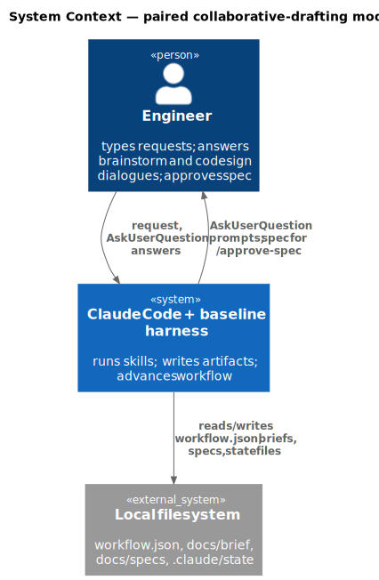

Source: [`01_c4_context.puml`](01_c4_context.puml)

## 02. C4 — Container — `c4_container`

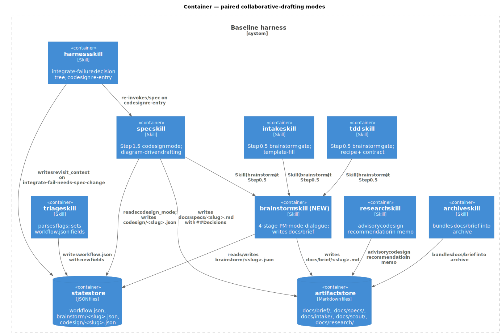

Source: [`02_c4_container.puml`](02_c4_container.puml)

## 03. C4 — Component (changed containers only) — `c4_component`

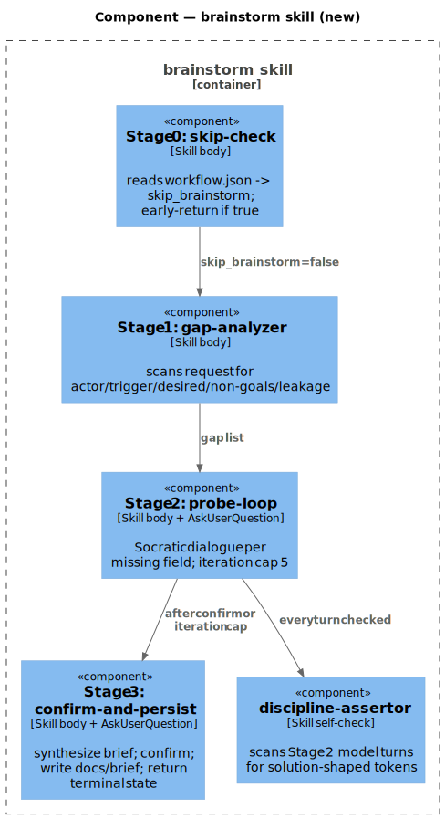

Source: [`03_c4_component.puml`](03_c4_component.puml)

## 04. C4 — Component (changed containers only) — `c4_component`

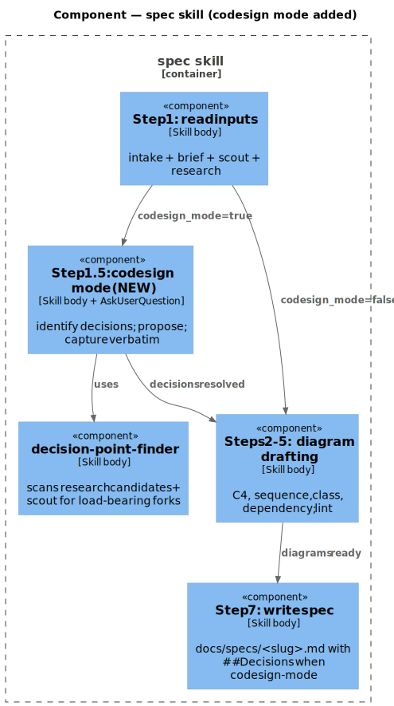

Source: [`04_c4_component.puml`](04_c4_component.puml)

## 05. Data model — class diagram — `class`

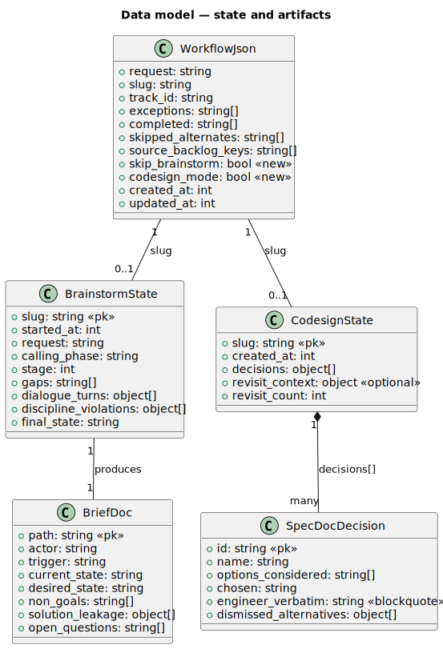

Source: [`05_class.puml`](05_class.puml)

## 06. §Behavior #1 — PM-mode brainstorm gate (covers AC-001, AC-002) — `sequence`

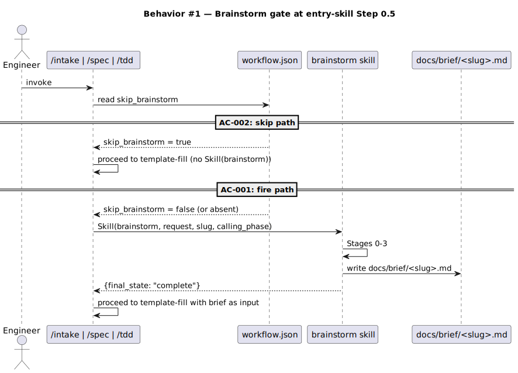

Source: [`06_sequence.puml`](06_sequence.puml)

## 07. §Behavior #2 — Brainstorm Stage 2 dialogue discipline (covers AC-003) — `sequence`

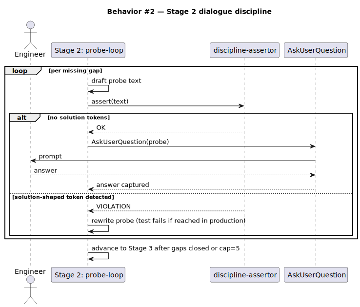

Source: [`07_sequence.puml`](07_sequence.puml)

## 08. §Behavior #3 — Brief synthesis, confirm, persist (covers AC-004) — `sequence`

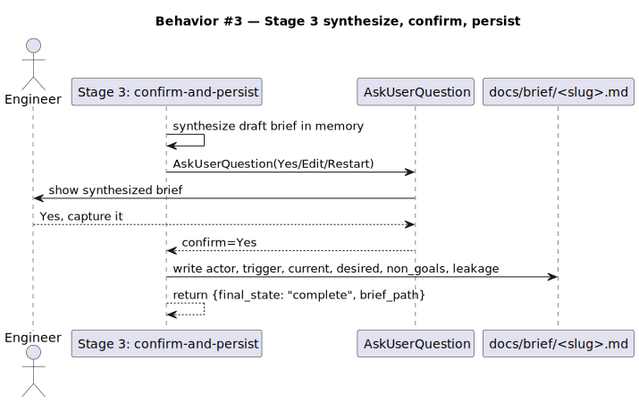

Source: [`08_sequence.puml`](08_sequence.puml)

## 09. §Behavior #4 — Codesign Step 1.5: decision capture (covers AC-005, AC-006) — `sequence`

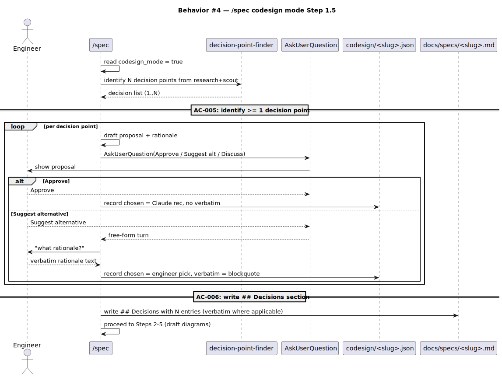

Source: [`09_sequence.puml`](09_sequence.puml)

## 10. §Behavior #5 — Codesign re-entry on integrate-failure (covers AC-007) — `sequence`

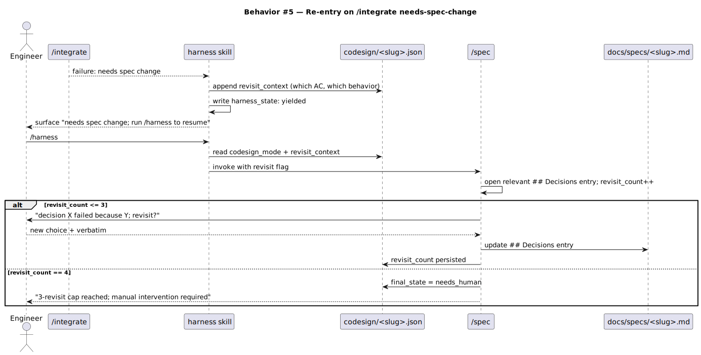

Source: [`10_sequence.puml`](10_sequence.puml)

## 11. §Behavior #6 — Workflow.json backward compatibility (covers AC-008) — `sequence`

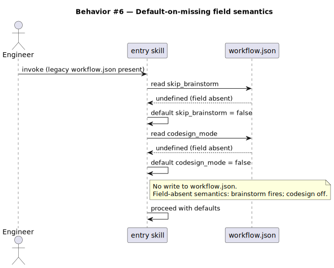

Source: [`11_sequence.puml`](11_sequence.puml)

## 12. §Behavior #7 — Audit picks up new skill via manifest (covers AC-009) — `sequence`

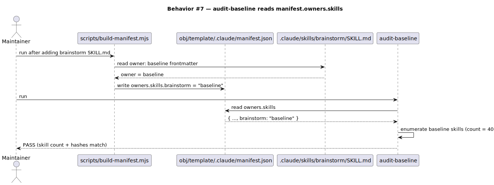

Source: [`12_sequence.puml`](12_sequence.puml)

## 13. §Behavior #8 — /triage parses flags (covers AC-010) — `sequence`

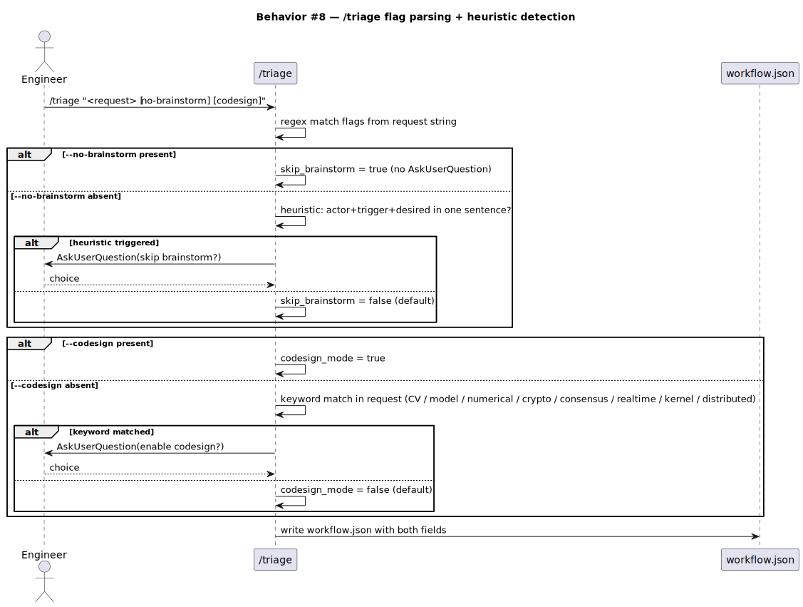

Source: [`13_sequence.puml`](13_sequence.puml)

## 14. §Behavior #9 — Archive bundles brief (covers AC-011) — `sequence`

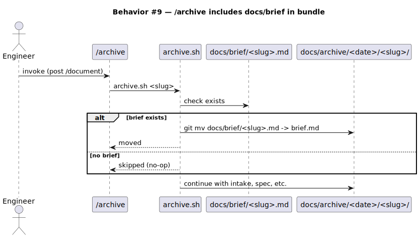

Source: [`14_sequence.puml`](14_sequence.puml)

## 15. State — core entity *(only if stateful)* — `state`

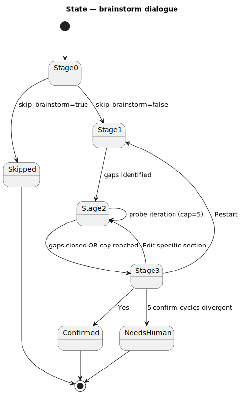

Source: [`15_state.puml`](15_state.puml)

## 16. Dependencies — graph — `dependency_graph`

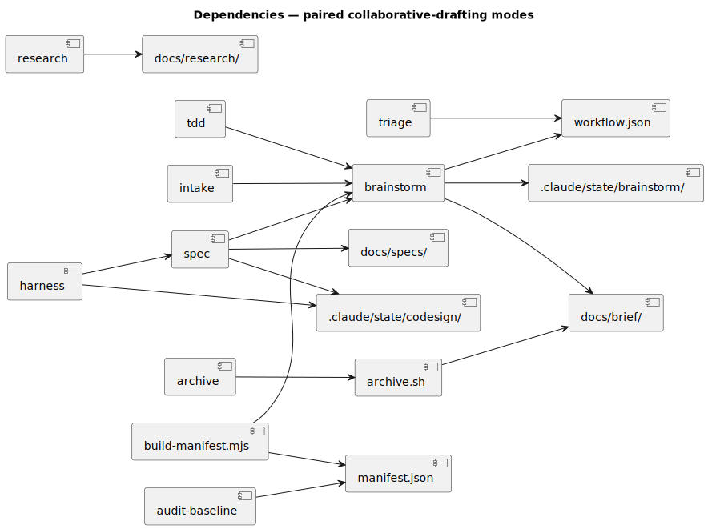

Source: [`16_dependency_graph.puml`](16_dependency_graph.puml)
