# Spec — paired collaborative-drafting modes: brainstorm helper (PM mode) and `/spec` codesign mode (Engineer mode)

## Context

| Input | Path |
|---|---|
| Intake | `docs/intake/brainstorm-and-codesign.md` |
| BRD *(if any)* | *(none)* |
| Scout *(if any)* | `docs/scout/brainstorm-and-codesign.md` |
| Research *(if any)* | `docs/research/brainstorm-and-codesign.md` |

## Goal

Entry-phase skills (`/intake`, `/spec`, `/tdd`) gain a Step 0.5 brainstorm gate that, when `workflow.json → skip_brainstorm` is false, invokes a new `brainstorm` skill to capture the requirement via Socratic dialogue before any template-fill; `/spec` gains a `codesign_mode` that, when active, runs a pre-drafting Step 1.5 to make load-bearing technical decisions through Claude-proposes + engineer-approves-or-overrides dialogue with verbatim rationale captured in a new `## Decisions` section of the spec.

## Non-goals

- A separate `/codesign` workflow phase or artifact. Codesign is a mode of `/spec`; the spec absorbs it.
- A new write-boundary hook to validate `docs/brief/<slug>.md` structure. The brainstorm skill owns brief shape; no `artifact_template_guard` extension.
- Auto-modification of `workflow.json` by `/research`. Recommendation lives in the memo only; user opts in via subsequent `/triage --codesign` or manual edit.
- Brainstorm dialogue routed through a subagent. Article II — decisions live in main context.
- Mandatory brainstorm on `chore` / `freeform` tracks (no entry-skill seam exists there).
- Brainstorm state file archival. Scratch state at `.claude/state/brainstorm/<slug>.json` lives only for the dialogue lifetime; only `docs/brief/<slug>.md` survives to the archive bundle.

## Design

Diagrams are the contract. Prose is only for things a diagram cannot say.

### C4 — System context

The "system" here is the baseline harness itself — the engineer interacts with Claude Code (slash commands and conversation); Claude Code runs skills that read and write workflow state and artifacts on the local filesystem.

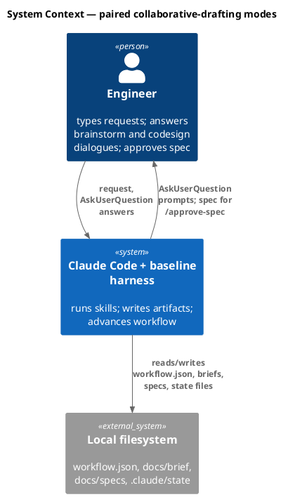

### C4 — Container

Deployable units inside the baseline harness boundary. Each "container" is a skill (or skill-internal mode) plus the state surfaces it owns.

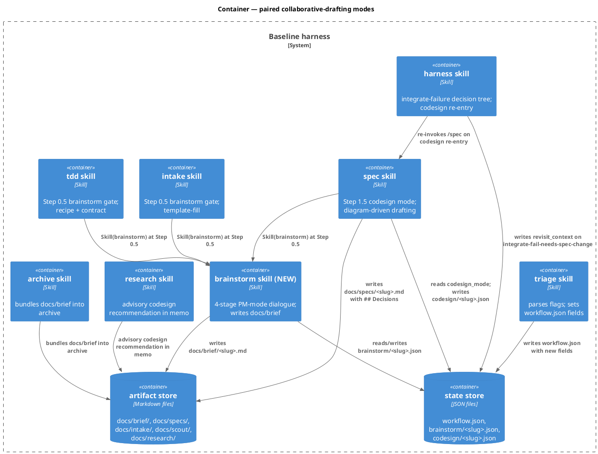

### C4 — Component (changed containers only)

The two containers whose internals change substantively: `brainstorm` (new) and `spec` (codesign mode added).

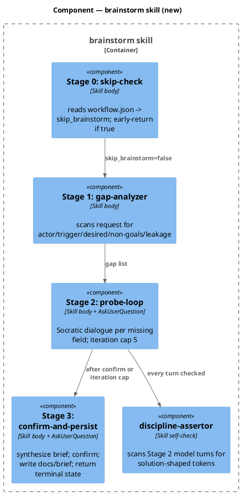

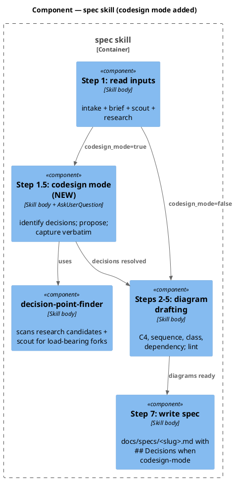

### Data model — class diagram

State files and artifact shapes. `workflow.json` gains two optional fields; `brainstorm/<slug>.json` is new; `codesign/<slug>.json` is new; `docs/brief/<slug>.md` is a new artifact kind with skill-enforced shape (NOT hook-enforced).

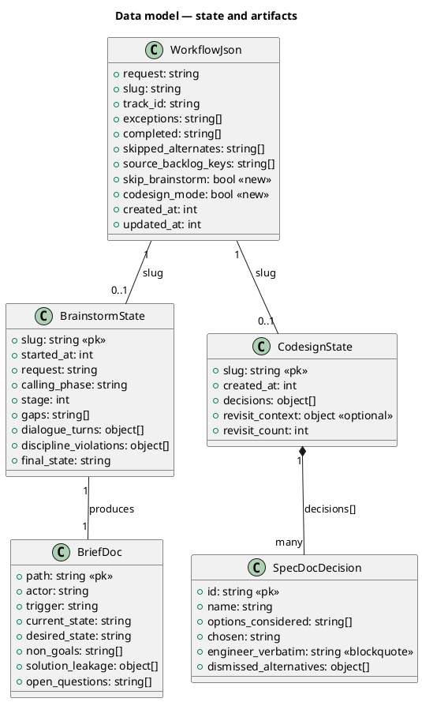

#### Migration DDL

No relational schema. State files are JSON; migrations are read-time defaults:

```sql
-- forward (read-time, no on-disk migration)
-- workflow.json: missing skip_brainstorm  -> default false
-- workflow.json: missing codesign_mode    -> default false
-- (no write step; in-flight workflow.json files remain unchanged on disk
--  until /triage rewrites them on the next workflow)

-- reverse (read-time, no on-disk migration)
-- entry skills tolerate absent fields; reverse = remove field-aware code
```

### Behavior — sequence per AC

Nine sequence diagrams cover the 11 acceptance criteria. ACs grouped by shared actor flow use `==` dividers.

#### §Behavior #1 — PM-mode brainstorm gate (covers AC-001, AC-002)

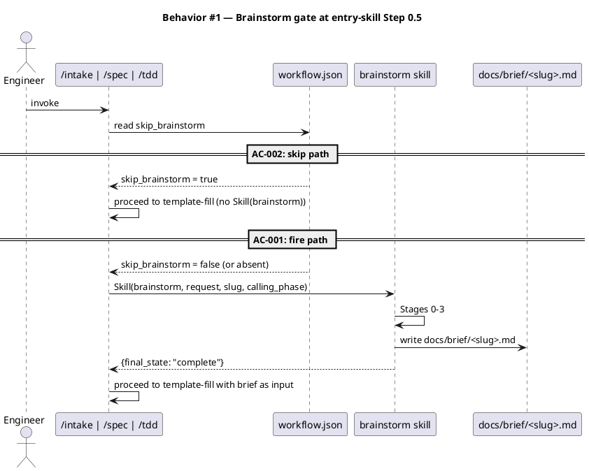

#### §Behavior #2 — Brainstorm Stage 2 dialogue discipline (covers AC-003)

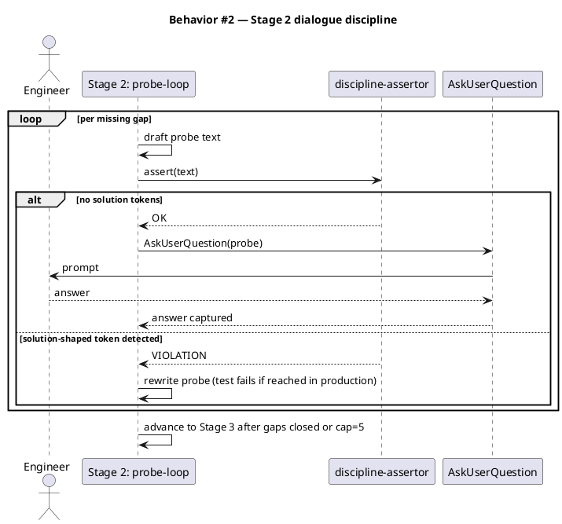

#### §Behavior #3 — Brief synthesis, confirm, persist (covers AC-004)

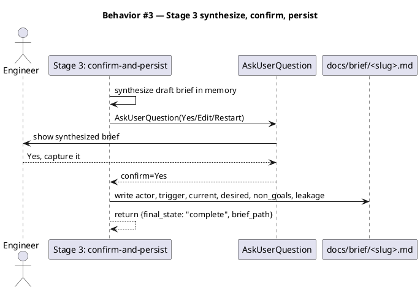

#### §Behavior #4 — Codesign Step 1.5: decision capture (covers AC-005, AC-006)

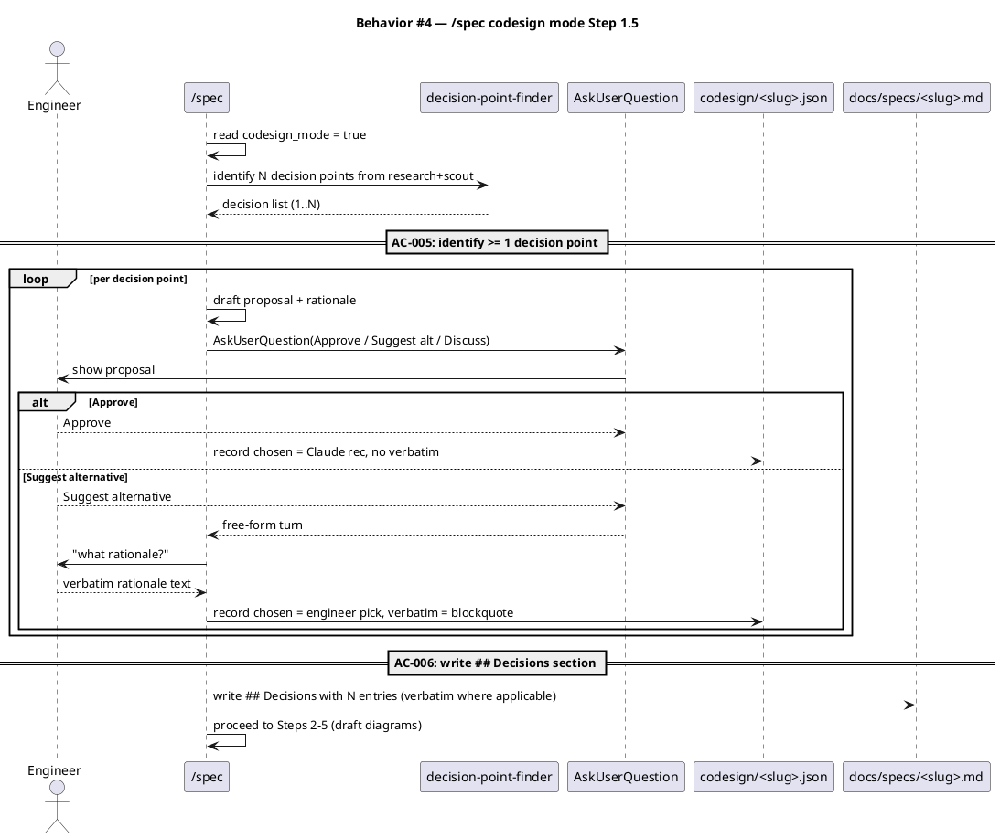

#### §Behavior #5 — Codesign re-entry on integrate-failure (covers AC-007)

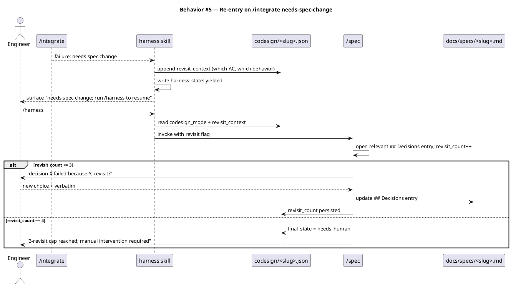

#### §Behavior #6 — Workflow.json backward compatibility (covers AC-008)

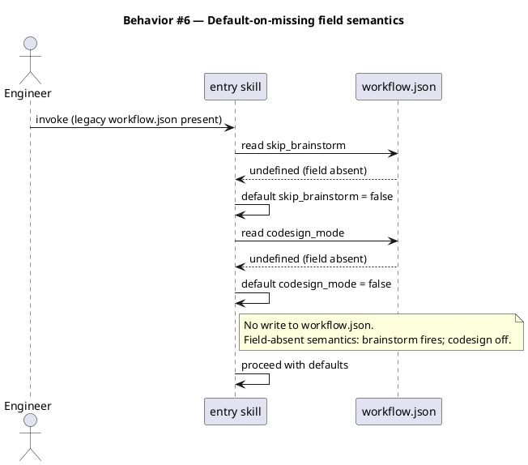

#### §Behavior #7 — Audit picks up new skill via manifest (covers AC-009)

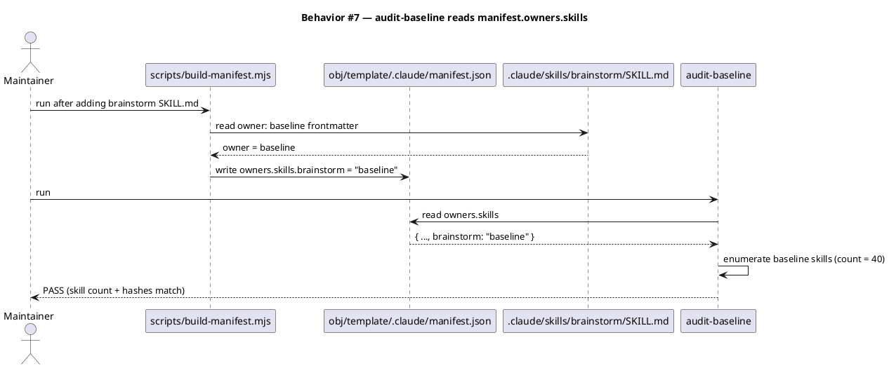

#### §Behavior #8 — /triage parses flags (covers AC-010)

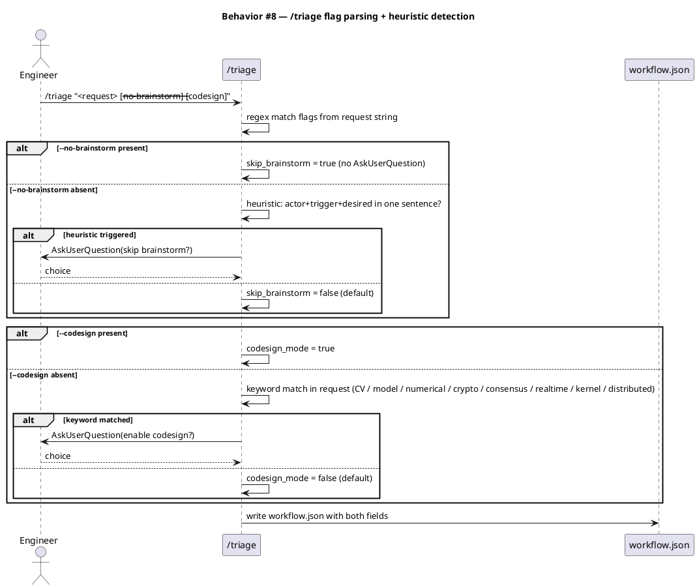

#### §Behavior #9 — Archive bundles brief (covers AC-011)

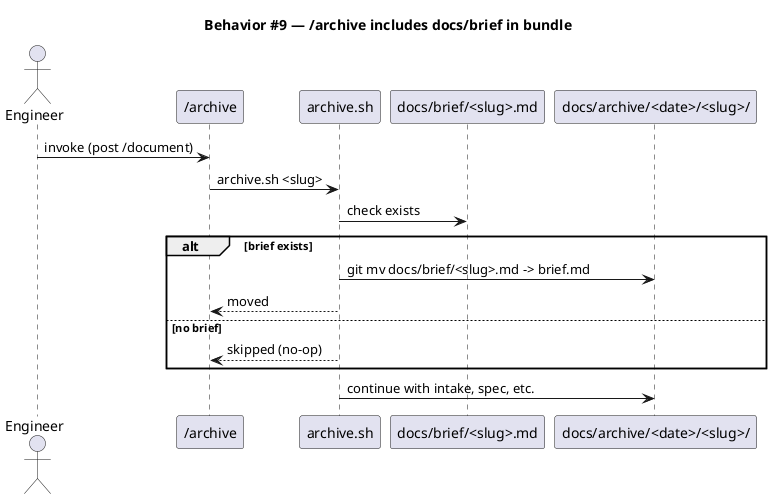

### State — core entity *(only if stateful)*

Brainstorm state file lifecycle:

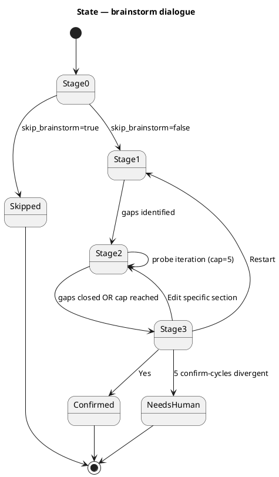

### Dependencies — graph

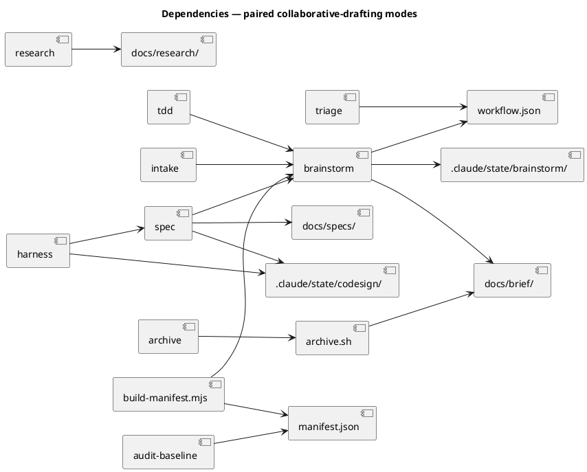

### Contracts

| Kind | Name | Input | Output | Errors | Idempotent |
|---|---|---|---|---|---|
| Skill | `Skill(brainstorm, {request, slug, calling_phase})` | request:string, slug:kebab≤40, calling_phase:"intake"\|"spec"\|"tdd" | `{final_state: "complete"\|"skipped"\|"needs_human", brief_path:string\|null}` | invalid calling_phase → final_state=needs_human | yes — re-invoke reads existing brief if present (short-circuit path) |
| Skill | `/spec` Step 1.5 (codesign mode) | `workflow.json → codesign_mode: true`, scout+research present | `## Decisions` section in `docs/specs/<slug>.md`, `codesign/<slug>.json` state file | revisit_count > 3 → final_state=needs_human | yes — re-running reads existing `## Decisions` and resumes from revisit_count |
| Skill | `/triage` flag parsing | request string with optional `--no-brainstorm` / `--codesign` | `workflow.json` with `skip_brainstorm` and `codesign_mode` fields | both flags present → both honored, no conflict | yes |
| Artifact | `docs/brief/<slug>.md` | written by brainstorm | structured fields: actor, trigger, current, desired, non-goals, leakage, open-questions | malformed → `/spec` reads what's present; missing fields surface as Open questions | yes — re-writes overwrite |
| Artifact | `docs/specs/<slug>.md → ## Decisions` | written by `/spec` codesign mode | one entry per decision; engineer verbatim as `>` blockquote when override taken | absent section when codesign_mode=true → `/spec-lint` flags (post-feature; lint update needed) | yes |
| State | `.claude/state/brainstorm/<slug>.json` | written by brainstorm Stages 1-3 | dialogue progress, gap list, terminal state | crash mid-dialogue → on re-invocation, resume from stage marker | yes |
| State | `.claude/state/codesign/<slug>.json` | written by `/spec` Step 1.5 and by harness on integrate-fail | decisions array + revisit_context | revisit_count > 3 → harness writes final_state=needs_human | yes |

### Libraries and versions

**This spec introduces no third-party library dependencies.** All work is internal protocol design + skill orchestration + state-file management using the baseline's existing Claude Code tools (`Skill`, `AskUserQuestion`, `Read`, `Write`, `Bash`). The `context7` MCP is not applicable for this spec.

| Library@version | Purpose | Key APIs | Confirmed via context7 |
|---|---|---|---|
| *(none)* | — | — | N/A — internal only |

### Alternatives considered

| Alt | Summary | Rejected because |
|---|---|---|
| A — Mirror design-ui's 5-stage skeleton verbatim | Brainstorm uses Stage 0/1/2/3/4 with Stage 2 named "translate" | Stage 2 semantic mismatch (brainstorm probes multi-turn; design-ui translates to recipe). Documented in research/Candidate A. |
| B — Linear protocol (no stages) | Brainstorm body is a flat step list like current `/intake` | Loses structural skip-fast-path; iteration cap becomes a soft convention; harder to test discipline at stage boundaries. Documented in research/Candidate C. |
| C — Inline codesign mid-`/spec` drafting | `/spec` pauses mid-diagram to ask about decisions as they arrive | Breaks `/spec`'s "draft each diagram first" invariant (`spec/SKILL.md:31`); harder to compose with `/spec-lint` and the diagram guards. Documented in research/Candidate E. |
| D — Separate `/codesign` skill before `/spec` | Phase 3.5 with its own artifact `docs/codesign/<slug>.md` | User rejected this in pre-triage architectural conversation; adds a phase, artifact, state file, triage logic for marginal separation. Documented in research/Candidate F. |
| E — Auto-modify `workflow.json` from `/research` when codesign recommended | Research flips `codesign_mode: true` automatically | Violates "decisions live in main context" (Article II); user must remain the decider. Memo-only recommendation chosen. |
| F — Extend `artifact_template_guard` to watch `docs/brief/<slug>.md` | Hook enforces required sections on briefs | Brief is internal scratch; structural validity is the brainstorm skill's responsibility, not the write boundary's. Keeps surface small. |

## Design calls

The write_set for this spec touches no UI files. `tdd.ui_globs` in `.claude/project.json` does not match any of the planned writes. No design surfaces.

| Slug | Intent | Target files | Write set | Register | References |
|---|---|---|---|---|---|

- *(none)*

## Acceptance criteria

Numbered, testable, traced. Each AC points to the §Behavior sequence that defines it.

| ID | Criterion (given / when / then) | Upstream AC | Sequence |
|---|---|---|---|
| AC-001 | given `track_id` ∈ {intake-full, spec-entry, tdd-quickfix} AND `skip_brainstorm` is false or absent, when the entry skill (`/intake`, `/spec`, or `/tdd`) is invoked, then the skill invokes `Skill(brainstorm)` as Step 0.5 before opening its `template.md` | intake AC 1 | §Behavior #1 |
| AC-002 | given `skip_brainstorm: true`, when the entry skill is invoked, then `Skill(brainstorm)` is NOT invoked and the skill proceeds directly to its existing drafting flow with no behavior change vs the pre-feature baseline | intake AC 2 | §Behavior #1 |
| AC-003 | given brainstorm Stage 2 is running, when any model-generated dialogue turn is produced, then the turn contains no proposed solution, technical recommendation, library name, or implementation verb (`add`, `use`, `implement`, `refactor to`); a test asserts this by scanning a recorded dialogue transcript for solution-shaped tokens and failing on hit | intake AC 3 | §Behavior #2 |
| AC-004 | given a brainstorm dialogue confirmed via Stage 3 (`AskUserQuestion → Yes, capture it`), when the brainstorm skill exits, then `docs/brief/<slug>.md` exists with these fields populated from the dialogue: actor, trigger, current state, desired state, non-goals, solution-leakage detections | intake AC 4 | §Behavior #3 |
| AC-005 | given `codesign_mode: true` and `/spec` is invoked, when `/spec` begins drafting, then `/spec` identifies ≥1 load-bearing technical decision point AND presents a proposal + rationale + `AskUserQuestion` per decision point before drafting Steps 2-5 (C4/sequence/class/dependency sections) | intake AC 5 | §Behavior #4 |
| AC-006 | given codesign mode is active AND the user selects "Suggest alternative" for any decision point, when `/spec` writes `docs/specs/<slug>.md`, then the spec contains a `## Decisions` section AND the engineer's verbatim rationale is present as a `>` markdown blockquote AND the chosen option recorded is the engineer's, not Claude's recommendation | intake AC 6 | §Behavior #4 |
| AC-007 | given `/integrate` fails with "spec change needed" classification per Article V AND the original workflow ran in `codesign_mode: true`, when the user re-invokes `/harness` to resume, then `/spec` re-enters codesign mode AND surfaces the integrate-failure context AND `AskUserQuestion`s whether to revisit the relevant `## Decisions` entry; revisit caps at 3 per decision point before terminating with `final_state: "needs_human"` | intake AC 7 | §Behavior #5 |
| AC-008 | given a workflow already in flight before this feature ships (workflow.json lacks `skip_brainstorm` and `codesign_mode` fields), when any entry skill reads workflow.json, then both fields default to false without erroring AND the workflow proceeds with brainstorm firing and codesign off | intake AC 8 | §Behavior #6 |
| AC-009 | given the new `brainstorm` skill ships in `.claude/skills/brainstorm/` with `owner: baseline` frontmatter AND `scripts/build-manifest.mjs` has run, when `audit-baseline` runs, then the audit reports skill count = 40 AND `manifest.owners.skills` includes `"brainstorm": "baseline"` AND the audit exits 0 | intake AC 9 | §Behavior #7 |
| AC-010 | given `/triage` parses `--no-brainstorm` or `--codesign` substrings in the request string, when `/triage` writes workflow.json, then `skip_brainstorm: true` or `codesign_mode: true` is set respectively in the written JSON; flags are independent (both can be set simultaneously) | intake AC 10 | §Behavior #8 |
| AC-011 | given `/archive` runs at Phase 10.5 AND `docs/brief/<slug>.md` exists, when archive.sh bundles workflow artifacts to `docs/archive/<date>/<slug>/`, then `brief.md` is present in the bundle alongside intake.md, scout.md, research.md, spec.md | intake AC 11 | §Behavior #9 |

## Test plan

| Category | Scenario | Expected | Covers |
|---|---|---|---|
| Golden path | brainstorm fires on `/intake` with skip_brainstorm=false; dialogue completes; brief written | docs/brief/<slug>.md present with structured fields | AC-001, AC-004 |
| Golden path | `/spec` with codesign_mode=true identifies 2 decision points; engineer overrides one; spec has `## Decisions` with one verbatim blockquote | spec contains `## Decisions` with 2 entries; one has `>` blockquote | AC-005, AC-006 |
| Golden path | `/triage --no-brainstorm --codesign "<req>"` writes both fields true | workflow.json contains skip_brainstorm: true, codesign_mode: true | AC-010 |
| Input boundary | brainstorm called with empty request | final_state=needs_human (cannot probe absent content) | AC-001 |
| Input boundary | codesign Stage 1.5 finds zero decision points | spec writes empty `## Decisions` section (heading present, body `*(none)*`) | AC-005 |
| Input boundary | brainstorm reaches iteration cap=5 in Stage 2 without closing gaps | advance to Stage 3 with partial brief; open_questions populated | AC-004 |
| Contract violation | `Skill(brainstorm)` called with calling_phase outside {intake, spec, tdd} | final_state=needs_human; no brief written | AC-001 |
| Contract violation | Stage 2 probe contains solution token `use Redux` | discipline test fails; CI red | AC-003 |
| Contract violation | spec written with codesign_mode=true but no `## Decisions` section | `/spec-lint` flags missing section (post-feature lint update) | AC-005 |
| Concurrency / ordering | `/intake` invoked twice in same session (idempotency) | second invocation short-circuits if docs/brief/<slug>.md exists | AC-001 |
| Failure mode | `/integrate` fails with needs-spec-change; harness writes revisit_context | re-invoking `/harness` enters /spec with revisit context surfaced | AC-007 |
| Failure mode | codesign revisit_count reaches 4 | spec writes final_state=needs_human; surfaces to user | AC-007 |
| Failure mode | legacy workflow.json (pre-§18 shape, no new fields) | entry skill reads → defaults applied → no error | AC-008 |
| Regression trap | `skip_brainstorm: true` produces byte-identical `/intake` behavior vs current baseline | diff of docs/intake/<slug>.md is empty against pre-feature baseline for same request | AC-002 |
| Regression trap | `codesign_mode: false` produces byte-identical `/spec` behavior vs current baseline | diff of docs/specs/<slug>.md (minus `## Decisions` heading) is empty against pre-feature baseline | AC-005 |
| Regression trap | manifest count drift detection | audit reports skill count 40 after build-manifest; FAILs if skill removed | AC-009 |
| Regression trap | archive.sh PAIRS includes brief.md row | shell test asserts brief.md mapping present | AC-011 |

## Observability

| Signal | Name | Shape | Purpose |
|---|---|---|---|
| Log | `brainstorm.stage_transition` | fields: slug, from_stage, to_stage, ts | debug dialogue progression |
| Log | `brainstorm.discipline_violation` | fields: slug, turn_index, violation_token, redacted_text | surface CI failures with context |
| Log | `codesign.decision_captured` | fields: slug, decision_name, chosen, has_verbatim, revisit_count | audit which decisions the engineer overrode |
| Log | `codesign.revisit_triggered` | fields: slug, decision_name, integrate_failure_reason, revisit_count | trace re-entry paths |
| Metric | — | — | not metricized in v1 (single-user baseline; no aggregate signal) |
| Alarm | — | — | none in v1 |

Logging destination: append to `.claude/state/harness/<slug>.log` (existing harness log file; reuse rather than introduce new sink).

## Rollout

- **Feature flag**: none. This spec introduces opt-in (`codesign_mode`) and opt-out (`skip_brainstorm`) flags directly in `workflow.json`; they ARE the rollout mechanism. No additional gating.
- **Migration order**: 1 ship brainstorm skill → 2 modify entry skills (intake/spec/tdd Step 0.5) → 3 modify `/spec` codesign mode + `## Decisions` template → 4 modify `/triage` flag parsing → 5 modify `/research` advisory recommendation → 6 modify `/archive` bundle → 7 update CLAUDE.md + seed.md + audit + manifest. Steps 1-6 are skill-internal; step 7 is constitutional. All ship in one commit per intake's "ship together" decision.
- **Canary**: not applicable. This is a developer-facing feature shipping into a single-user baseline; first production exercise is the next workflow after merge.

## Rollback

- **Kill-switch**: setting `skip_brainstorm: true` and `codesign_mode: false` in `.claude/state/workflow.json` (or omitting the fields entirely on a new workflow via `/triage --no-brainstorm`) restores pre-feature behavior for any single workflow. Revert is per-workflow, not global.
- **Full revert**: `git revert <commit>` removes the brainstorm skill, restores entry skills, removes `## Decisions` section logic. All artifacts under `docs/brief/` produced before the revert remain on disk (no destructive cleanup); they are simply unreachable by any downstream phase.
- **Signal to roll back**: brainstorm/codesign skill failure rate inferred from `harness/<slug>.log` `final_state: needs_human` count > 50% across the first 5 workflows post-ship. Detection window: 5 minutes after each workflow completes. (Single-user baseline — alarm is conversational, not paged.)

## Archive plan

- Defaults *(automatic)*: intake.md, scout.md, research.md, spec.md, spec-rendered/, spec.approved (when present)
- Extras *(list any non-default files)*:
  - `docs/brief/brainstorm-and-codesign.md` — added to archive.sh PAIRS table (AC-011); becomes default once the feature ships. For THIS workflow (the meta-workflow building the feature), no brief exists because the pre-feature intake skill drafted the intake; archive.sh handles missing files gracefully (no-op).

## Open questions

*(none — all 6 research-memo open questions resolved during spec drafting; resolutions encoded in the design and acceptance criteria above. Summary of resolutions for reviewer convenience:)*

- **Q1 (artifact_template_guard extension to docs/brief/)** — Resolved: NO. Brief shape is brainstorm-skill-enforced; no hook extension. See Alternatives F.
- **Q2 (3-revisit cap location)** — Resolved: hardcoded constant in `/spec` SKILL.md, parallel to design-ui's 3-iteration cap. See §Behavior #5 + Contracts row.
- **Q3 (`/triage` heuristic for codesign_mode)** — Resolved: fixed keyword list (`computer vision`, `model architecture`, `numerical`, `cryptographic`, `consensus`, `realtime`, `kernel`, `distributed`, `algorithm design`). Plus `AskUserQuestion` confirmation when detected. See §Behavior #8.
- **Q4 (`/intake` re-invocation on existing workflow)** — Resolved: short-circuit if `docs/brief/<slug>.md` exists; skill reads existing brief and skips re-brainstorm. Manual re-brainstorm requires deleting the brief or re-running `/triage`. See AC-001 idempotency note + Contracts row.
- **Q5 (brainstorm state file archive)** — Resolved: NO. Scratch state at `.claude/state/brainstorm/<slug>.json` is not archived; only `docs/brief/<slug>.md` survives. See Archive plan.
- **Q6 (`/research` auto-flag for codesign_mode)** — Resolved: memo-only advisory; user opts in via subsequent `/triage --codesign` or manual workflow.json edit. No auto-modification of flow state. See Alternatives E.
