# Spec — Durable local conversation-trail with context-switch shelving

## Context

| Input | Path |
|---|---|
| Intake | `docs/intake/conversation-thread-shelving.md` |
| BRD *(if any)* | *(none)* |
| Scout *(if any)* | `docs/scout/conversation-thread-shelving.md` |
| Research *(if any)* | `docs/research/conversation-thread-shelving.md` |
| Brainstorm brief | `docs/brief/conversation-thread-shelving.md` |
| Codesign decisions | `.claude/state/codesign/conversation-thread-shelving.json` |

> **Note on intake non-goals.** Two intake non-goals are deliberately superseded by codesign decisions D6 and D4: the work now **does** amend `seed.md` + `CLAUDE.md` (D6), and shelve/resume are **Claude-Code-internal operations, not user-facing skills** (D4) — so the skill/command counts stay unchanged not by avoiding the surface but by never creating one.

## Decisions

### Decision: Switch-detection mechanism at the Stop event

**Options considered:** 1A passive heuristic collector (chosen) / 1B dedicated Stop hook emitting a block decision / 1C heuristic-in-hook vs LLM-assisted detection
**Chosen:** 1A passive heuristic collector — a Stop-side detector compares the current turn's subject against the active-thread marker and, on a heuristic-detected switch, STAGES a switch-candidate to disk. It emits no stdout control-flow decision, so it does not collide with harness_continuation's block. The confirm surfaces later (SessionStart injection or resume). Passive = no control-flow signal, NOT inert: it still collects, exactly like memory_stop's passive-collector contract.

**Dismissed alternatives:**
- 1B dedicated Stop hook emitting block — Collides with harness_continuation, which owns the single Stop-event block decision; two hooks racing to re-prompt is a correctness hazard.

### Decision: Shelve compose model (the 'background worker')

**Options considered:** 2A inline main-context compose / 2B mechanical background-only (run_in_background, no model) / 2C background subagent with model (requires amending Article II + seed.md) / 2D hybrid: mechanical-verbatim capture at shelve + inline transform at resume (chosen)
**Chosen:** 2D hybrid — On SHELVE: a mechanical capture (no model, no subagent) extracts conversation verbatim + raw signals (in-flight files, recent prompts, walk() extraction) instantly, zero blocking. On RESUME: the resume path does the inline main-context quality transform — turning staged verbatim into a summary + selected cues, where latency is acceptable. Judgment stays in main context (Article II clean); the capture piece is purely mechanical; no second subagent; no amendment of Article II.
**Engineer rationale (verbatim):**
> 2D is better and actually interesting because what we are doing now is, extracting conversation verbatim during shelve and only transform it during resume giving us more control over granularity. Clean

**Dismissed alternatives:**
- 2C background subagent + amend Article II — Best raw TAT+quality but ships a SECOND subagent, which Article II forbids ('exactly one subagent: swarm-worker') — requires amending Article II + seed.md and would fail audit-baseline's agent-count check until then. Engineer noted a memory-management worker is 'a different story' than Article II's development-delegation bar, but 2D reaches the TAT goal without the amendment, so the amendment was not taken.
- 2A inline-only — Blocks ~1 turn at shelve time — the exact latency to avoid when pivoting away from a thread.
- 2B mechanical-only — Fast shelve but no quality summary even at resume; 2D keeps 2B's fast mechanical shelve and adds the inline quality transform at resume.

### Decision: Capture-window boundary at shelve time

**Options considered:** Moving cursor since last shelve (chosen) / Fixed last-k turns / Whole session since start / End boundary at 'now' (v1-simple) / End boundary at detected switch-point (chosen)
**Chosen:** Moving cursor + switch-point end. START = a persisted thread-start cursor {transcript_path, last_event_uuid, timestamp} = the position of the last shelve, or session/workflow start if no prior shelve. END = the D1 detector's staged switch-point message-id for an AUTO-shelve; END = 'now' for a model-initiated immediate shelve (no detected switch). The mechanical worker extracts structured signals over the span [cursor -> end] via resume_writer.walk() (verbatim user prompts, skill calls, file writes, last assistant text), bounded by a safety cap (resume_writer's MAX_* limits) — NOT a fixed message count. After shelving, the cursor advances to END. Cross-session fallback: if the cursor's transcript_path differs from the current transcript, capture the whole current transcript. This couples D1->D2: the passive detector must stage the boundary message-id, not just a boolean switch flag.

**Dismissed alternatives:**
- Fixed last-k turns — k is arbitrary — over-captures the prior (already-shelved) thread or truncates a long one; needs a config knob nobody can set correctly.
- Whole session since start — Over-captures on long multi-thread sessions — the exact case shelving exists to handle.
- End boundary at 'now' (v1-simple) — Engineer chose the tighter switch-point end now instead of deferring; keeps new-topic turns out of the old thread's shelve from v1.

### Decision: Invocation surface — internal Claude-Code operation, not a user-facing skill/command

**Options considered:** Two user-facing skills /shelve + /resume (research D4 — REVERSED) / Claude-Code-internal lib + hook/behavior orchestration, no skill, no command (chosen)
**Chosen:** shelve/resume are Claude-Code-internal operations the MODEL performs automatically — NOT human-invokable, NOT registered as skills or commands. 'harness' in the engineer's framing means Claude Code itself, not the /harness skill: so the behavior fires whenever Claude Code runs, including plain conversation (covering the original motivating case), and is never typed by the human. Implementation: the mechanical shelve is lib helpers (thread_store.mjs + shelve_capture.mjs + shelve_detect.mjs) driven by the Stop-hook path; the resume transform is inline main-context work Claude Code performs when surfacing a shelved thread (orchestrated via SessionStart injection + a constitutional behavior rule). Because no .claude/skills/shelve|resume/ dirs and no .claude/commands/ entries are created, the audited '40 skills' / '6 commands' governance counts are unchanged by construction. Structural enforcement of 'no user invocation' is moot — there is no invocation surface, and the model is the intended invoker.
**Engineer rationale (verbatim):**
> ideally, shelve and resume will be used internally by harness and not by end-user and so we don't need to increase skill count (this is my take)
> harness means claude-code; i.e. not by human directly
> shelve and resume are for internal use only model invocation by user is not allowed
> [on structural enforcement] I think this will be moot

**Dismissed alternatives:**
- Two user-facing skills (research D4) — Would bump the audited skill count and expose a human invocation surface the engineer explicitly disallows; shelve/resume are model-internal, so a skill/command surface is wrong.

### Decision: Resume transform caching

**Options considered:** Always re-transform from verbatim (prior lean) / Cache the transform with a TTL (chosen)
**Chosen:** Cache the resume transform with a TTL. On resume: if a cached transform exists and is within TTL, serve it; past TTL (or absent), re-transform from the immutable verbatim and refresh the cache + cached_at. Cache lives at a gitignored state path (.claude/state/thread_transform_cache.json). TTL is a project.json knob (default to a sensible value, e.g. 86400s/24h). Because the shelved verbatim is immutable, the TTL is a regenerate-for-freshness/granularity knob (pick up improved transform logic, or a re-summarization at a different granularity), not a source-staleness knob.
**Engineer rationale (verbatim):**
> ideally, it should cache with a TTL

**Dismissed alternatives:**
- Always re-transform — Recomputes model work every resume; the engineer wants a cache, bounded by a TTL so it isn't permanently stale.

### Decision: Documentation / constitutional surface

**Options considered:** README.md only (intake non-goal — SUPERSEDED) / Amend seed.md + CLAUDE.md + mirrors + annex + README (chosen)
**Chosen:** Codify the new local memory class + the shelve/resume behavior as a constitutional amendment: seed.md (genesis, governs per Art. I.4), then CLAUDE.md Article IX (binding rule, terse — respects the 40k-char cap), then the byte-mirrors src/seed.template.md + src/CLAUDE.template.md, with detail in the .claude/CONSTITUTION.md annex and the schema in .claude/memory/README.md. This SUPERSEDES the intake non-goal 'no seed.md amendment' — the engineer explicitly authorized the amendment. Sequence: seed.md first (precedence), then CLAUDE.md + mirrors, then implementation.
**Engineer rationale (verbatim):**
> I think we need to add to seed.md and CLAUDE.md as well

**Dismissed alternatives:**
- README-only (intake non-goal) — Engineer wants the behavior codified constitutionally, not just documented in the memory README; since the model performs shelve/resume automatically, the rule belongs in the constitution.

## Goal

Claude Code automatically maintains a durable, local, gitignored single rolling trail (`_thread.md`): it mechanically shelves the active work-thread on a detected switch (or on its own initiative), and on resume transforms the most-recent verbatim section into a surfaced summary — so a developer regains continuity across `/clear`, compaction, and `/memory-flush` without manual reconstruction, and without ever typing a command.

## Non-goals

- No commit of trail content (local-only; `.gitignore` keeps content out, only the `src/memory/_thread.template.md` structure ships).
- No whole-transcript dump — structured signals over the cursor span only.
- No multiple discrete threads — one rolling `_thread.md`.
- No second subagent; Article II is not amended (Decision D2).
- No new hook file — the detector folds into the existing `memory_stop.mjs` Stop hook (audited "22 hooks" count unchanged).
- No new user-facing skill or command — shelve/resume are Claude-Code-internal (Decision D4); "40 skills" / "6 commands" counts unchanged.
- Companion `cf4a` (LLM-assisted capture-time extraction/routing) is out of scope.

## Design

Diagrams are the contract. Prose is only for what a diagram cannot say.

### C4 — System context

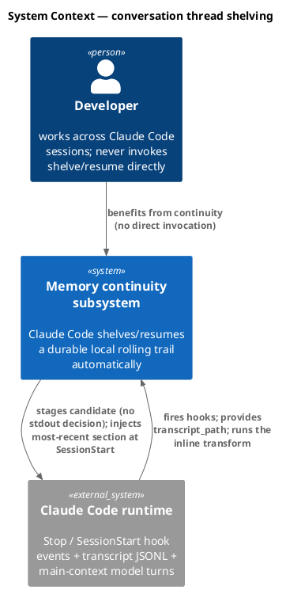

### C4 — Container

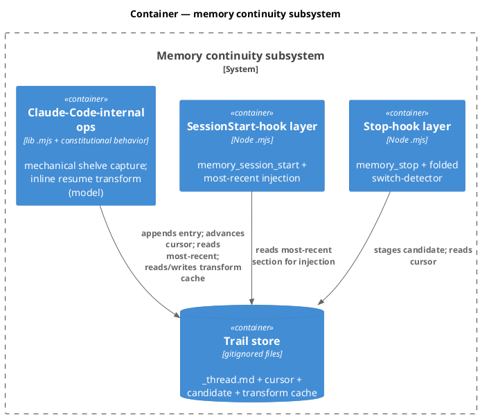

### C4 — Component (changed containers only)

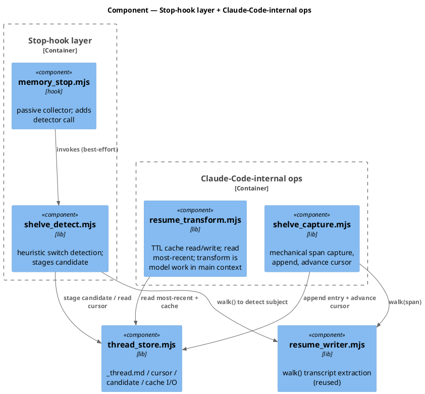

### Data model — class diagram

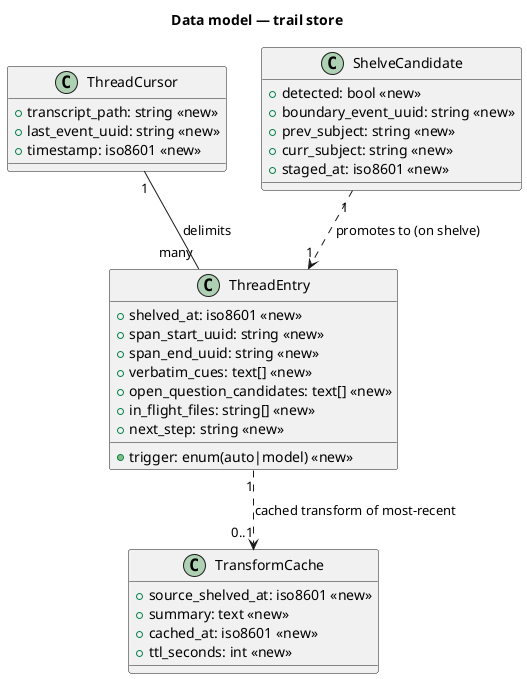

#### Migration DDL

There is no database. The "migration" is filesystem structure + a config knob:

```sql
-- forward (filesystem + config)
--  CREATE  src/memory/_thread.template.md             (committed pristine structure)
--  CREATE  .claude/memory/_thread.md                  (runtime, from template; gitignored content)
--  APPEND  .gitignore: ".claude/memory/_thread.md"    (content never staged)
--  CREATE  .claude/state/thread_cursor.json           (gitignored under .claude/state/)
--  CREATE  .claude/state/shelve_candidate.json        (gitignored under .claude/state/)
--  CREATE  .claude/state/thread_transform_cache.json  (gitignored under .claude/state/)
--  ADD     project.json: memory.thread_transform_ttl_seconds = 86400
--  UPDATE  obj/template/.claude/manifest.json          (new baseline-owned lib .mjs + edited hooks)
-- reverse (filesystem + config)
--  Remove lib helpers, template, gitignore line, project.json knob, manifest entries.
--  Runtime _thread.md/cursor/cache are local + gitignored; reverse leaves them (harmless).
```

### Behavior — sequence per AC

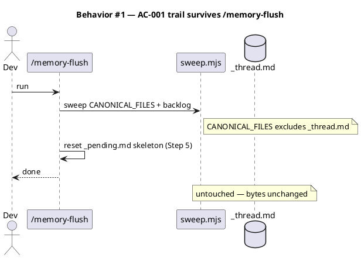

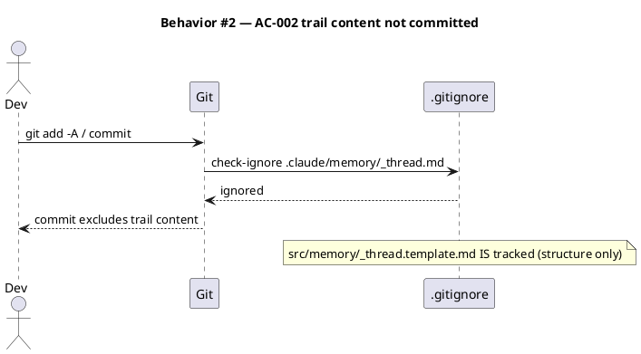

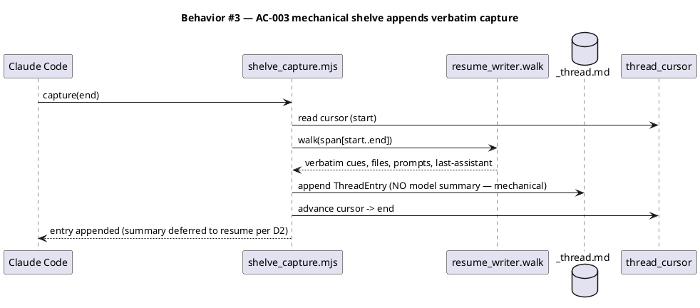

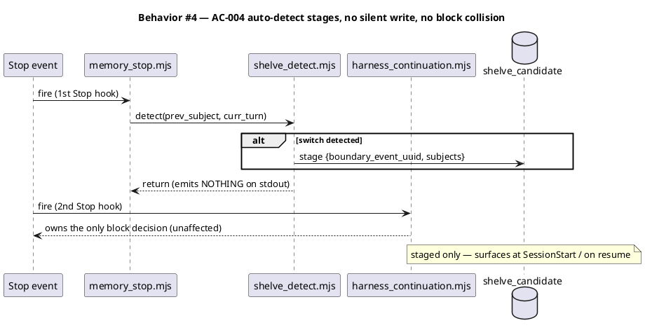

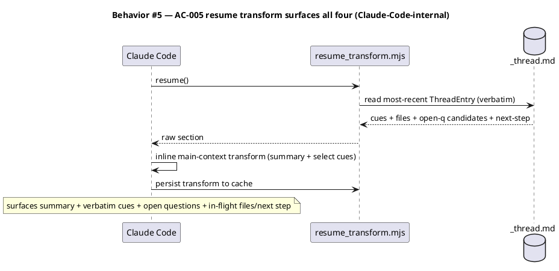

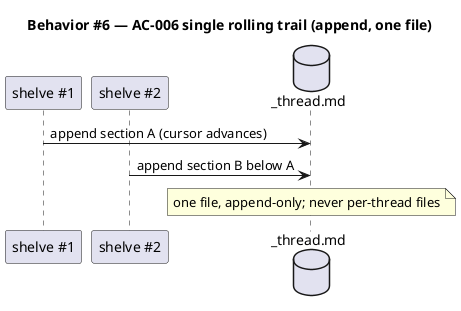

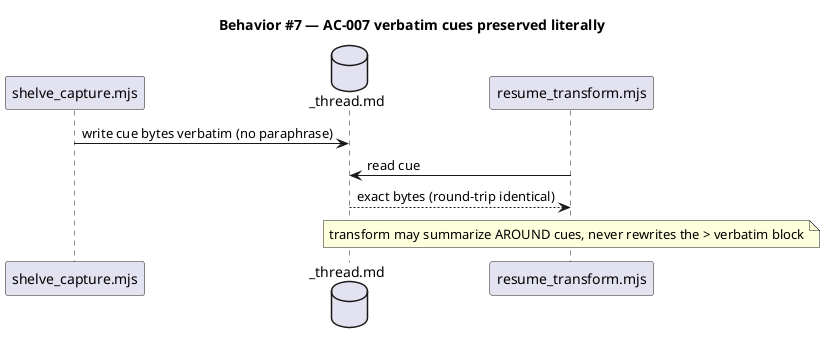

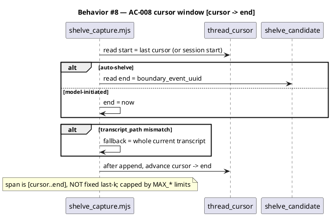

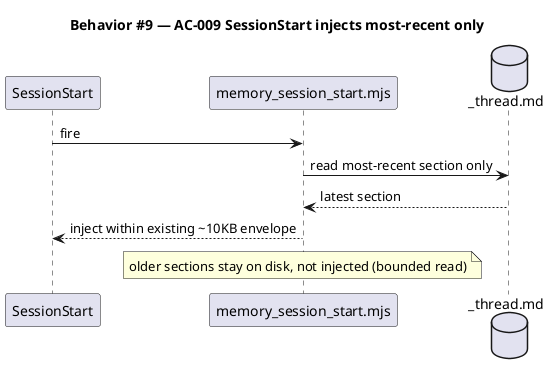

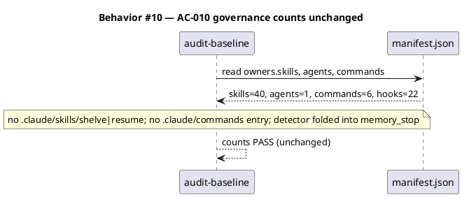

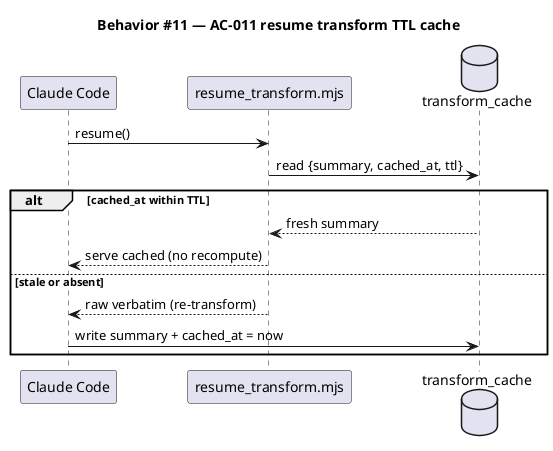

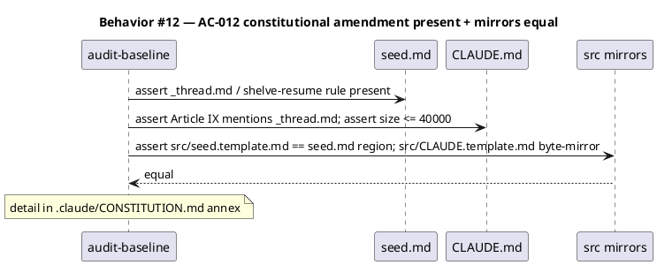

### State — switch-candidate lifecycle

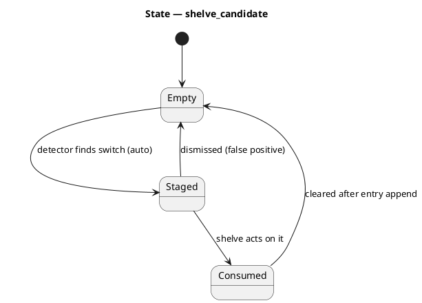

### Dependencies — graph

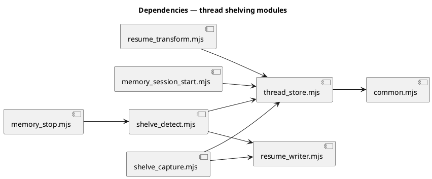

### Contracts

| Kind | Name | Input | Output | Errors | Idempotent |
|---|---|---|---|---|---|
| Internal op | shelve (model-initiated or auto-consumed) | end boundary | appended `ThreadEntry`; cursor advanced | no transcript → no-op | no (each call appends) |
| Internal op | resume | — | surfaces most-recent (cached or fresh transform) | empty trail → "nothing to resume" | yes (read; cache write is idempotent per source) |
| Hook fn | `shelve_detect.detect({transcript, cursor, prevSubject})` | transcript + cursor | stages `ShelveCandidate` or no-op | best-effort; never throws to hook | yes (re-stage overwrites) |
| Lib | `thread_store.appendEntry(entry)` | `ThreadEntry` | new section in `_thread.md` | write failure → throw (caller handles) | no |
| Lib | `thread_store.readMostRecent()` | — | last `ThreadEntry` or null | parse failure → null | yes |
| Lib | `thread_store.{read,write}Cursor()` | `ThreadCursor` | persisted cursor | — | yes |
| Lib | `resume_transform.readCache({ttl})` | ttl seconds | cached summary or `{stale:true}` | absent → `{stale:true}` | yes |
| Lib | `resume_transform.writeCache(summary)` | summary text | persisted cache + cached_at | — | yes |

### Libraries and versions

No third-party libraries. Implementation uses Node built-ins (`node:fs`, `node:path`, `node:util`) already pervasive in `.claude/hooks/`. context7 not applicable (no external API surface).

| Library@version | Purpose | Key APIs | Confirmed via context7 |
|---|---|---|---|
| *(none — Node built-ins only)* | — | `fs.appendFileSync`, `fs.readFileSync` | n/a |

### Alternatives considered

| Alt | Summary | Rejected because |
|---|---|---|
| A | Reuse `_resume.md`, stop overwriting it | `_resume` is overwritten by two hooks every turn; durability + append semantics differ fundamentally (scout risk #2). |
| B | Per-thread files under `threads/` | Intake rejected multiple discrete threads (duplicates backlog's role). |
| C | New dedicated Stop hook | Collides with `harness_continuation` block decision (Decision D1). |
| D | User-facing `/shelve` + `/resume` skills | Reversed by Decision D4 — shelve/resume are Claude-Code-internal, not human-invokable. |

## Design calls

This spec's `write_set` does not intersect `project.json → tdd.ui_globs` (no `site-src/**` or UI files). No design surfaces.

- *(none)*

## Acceptance criteria

| ID | Criterion (given / when / then) | Upstream AC | Sequence |
|---|---|---|---|
| AC-001 | given a populated `_thread.md`, when `/memory-flush` runs (incl. `_pending` reset), then `_thread.md` bytes are unchanged | intake AC-1 | §Behavior #1 |
| AC-002 | given `_thread.md` with content, when committing, then `git check-ignore` reports it ignored and no content is staged; `src/memory/_thread.template.md` IS tracked | intake AC-2 | §Behavior #2 |
| AC-003 | given an active thread, when a shelve runs, then one `ThreadEntry` is appended with verbatim cues + open-question candidates + in-flight files + next-step (mechanical; summary deferred to resume per D2) | intake AC-3 (refined per D2 — summary moves to AC-005) | §Behavior #3 |
| AC-004 | given a turn-end whose subject diverges from the active thread, when the Stop detector runs, then a `ShelveCandidate` is staged to disk, no stdout decision is emitted, and `harness_continuation` still fires unaffected | intake AC-4 | §Behavior #4 |
| AC-005 | given a populated trail, when resume runs, then the most-recent entry is transformed inline into a summary and surfaced with verbatim cues + open questions + in-flight files/next step | intake AC-5 | §Behavior #5 |
| AC-006 | given multiple shelve-events, when recorded, then all append to one `_thread.md` (no per-thread files) | intake AC-6 | §Behavior #6 |
| AC-007 | given verbatim cues captured at shelve, when surfaced at resume, then the cue bytes are identical (round-trip preserved; transform never rewrites the `>` verbatim block) | intake AC-7 | §Behavior #7 |
| AC-008 | given a prior cursor, when a shelve runs, then the captured span is `[cursor → end]` (end = staged switch-point for auto, `now` for model-initiated), NOT a fixed message count, with a cross-session whole-transcript fallback, and the cursor advances to `end` | resolves intake OQ-1 / Decision D3 | §Behavior #8 |
| AC-009 | given a populated trail, when a new session starts, then only the most-recent section is injected at SessionStart, within the existing ~10KB envelope | resolves intake OQ-1 (bounding) | §Behavior #9 |
| AC-010 | given the build, when `audit-baseline` runs, then skills=40, commands=6, agents=1, hooks=22 are all unchanged (no shelve/resume skill or command; detector folded into `memory_stop`) | Decision D4 | §Behavior #10 |
| AC-011 | given a resume, when a cached transform exists within TTL then it is served without recompute; when stale/absent then the transform is recomputed from verbatim and the cache refreshed | Decision D5 | §Behavior #11 |
| AC-012 | given the amendment, when `audit-baseline` runs, then `seed.md` + `CLAUDE.md` Article IX reference `_thread.md`, `CLAUDE.md` ≤ 40000 chars, and `src/seed.template.md` + `src/CLAUDE.template.md` mirror their targets | Decision D6 | §Behavior #12 |

## Test plan

| Category | Scenario | Expected | Covers |
|---|---|---|---|
| Golden path | populate `_thread.md`, run `sweep.mjs` all modes + `_pending` reset | `_thread.md` byte-identical | AC-001 |
| Golden path | `git check-ignore` on `_thread.md` and on `src/memory/_thread.template.md` | first ignored, second NOT ignored | AC-002 |
| Golden path | `shelve_capture` over a fixture transcript span | entry has 4 buckets, no model summary field | AC-003 |
| Golden path | `resume_transform.readMostRecent` over a fixture trail | returns most-recent section intact | AC-005 |
| Contract violation | detector emits to stdout | assert empty stdout (no JSON decision) | AC-004 |
| Concurrency / ordering | both Stop hooks run; detector stages | `harness_continuation` decision unchanged | AC-004 |
| Input boundary | cursor span: empty / huge (cap) / cross-session transcript mismatch | empty→no-op; huge→capped; mismatch→whole-current-transcript | AC-008 |
| Input boundary | trail with N sections, session start | only most-recent injected; envelope ≤ budget | AC-009 |
| State | TTL cache: fresh hit, expired miss, absent miss | fresh→served; expired/absent→recompute + refresh | AC-011 |
| Governance | run `audit-baseline` | skills=40, commands=6, agents=1, hooks=22 | AC-010 |
| Governance | grep `seed.md`/`CLAUDE.md` for `_thread.md`; `CLAUDE.md` char count; mirror byte-equality tests | rule present; ≤40000; mirrors equal | AC-012 |
| Regression trap | verbatim cue with markdown/unicode/quotes | round-trip byte-identical | AC-007 |
| Regression trap | two sequential shelves | one file, appended; cursor advanced both times | AC-006, AC-008 |
| Regression trap | existing `memory-session-start-size-cap` + `memory-stop-dedup` suites | still pass | AC-009, AC-004 |

## Observability

| Signal | Name | Shape | Purpose |
|---|---|---|---|
| Log | `shelve_detect: staged candidate` | `.claude/state/` log line + boundary uuid | debug auto-detection |
| Log | `shelve: appended entry` | path + span uuids + trigger | audit shelve actions |
| Log | `resume: served cache / recomputed` | source_shelved_at + cache age | audit resume + TTL behavior |

## Rollout

- **Feature flag**: none required — additive local feature; absence of `_thread.md` (no shelve yet) is a clean no-op for resume and SessionStart injection.
- **Migration order (precedence-respecting)**: 1 amend `seed.md` (genesis governs) → 2 amend `CLAUDE.md` Article IX + `.claude/CONSTITUTION.md` annex → 3 sync byte-mirrors `src/seed.template.md` + `src/CLAUDE.template.md` → 4 ship `src/memory/_thread.template.md` + `.gitignore` + `project.json` TTL knob → 5 land lib helpers (`thread_store`, `shelve_detect`, `shelve_capture`, `resume_transform`) → 6 fold detector call into `memory_stop.mjs` → 7 wire SessionStart injection → 8 update `obj/template/.claude/manifest.json` + `scripts/build-template.sh`.
- **Canary**: dogfood on this repo's own next session; confirm an auto-staged switch produces a shelve, a resume surfaces it (cached on second resume), and `/memory-flush` leaves the trail intact.

## Rollback

- **Kill-switch**: remove the `shelve_detect` call line from `memory_stop.mjs` (detector goes dormant; resume/inject inert without trail content). Full revert deletes the lib helpers + template + project.json knob + manifest entries + the constitutional amendment (in reverse precedence order: implementation → mirrors → CLAUDE.md → seed.md).
- **Signal to roll back**: any Stop-hook regression — `harness_continuation` failing to fire, or `memory_stop` throwing — within the first session. The detector is best-effort/try-caught, so a detector fault must never fail the turn; if it does, that is the rollback trigger.

## Archive plan

- Defaults *(automatic)*: intake, scout, research, brief, spec, spec-rendered/, spec approval, codesign state.
- Extras *(list any non-default files)*:
  - *(none)*

## Open questions

- *(none — the three prior open questions were resolved by codesign decisions D6 (seed.md + CLAUDE.md amendment), D4 (internal-only, no count bump), and D5 (TTL cache).)*
