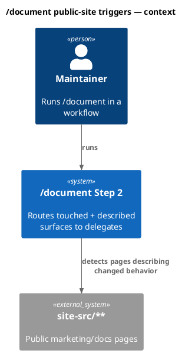
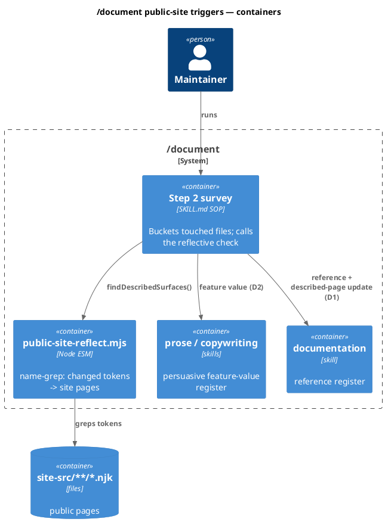
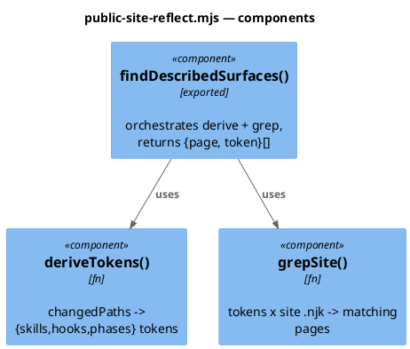
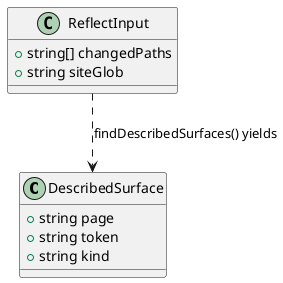
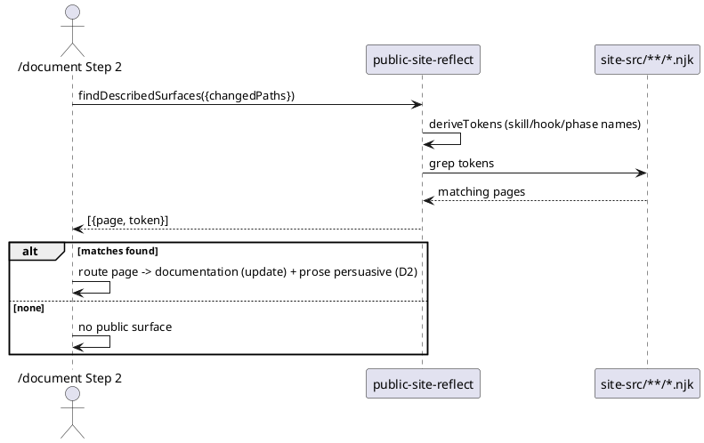
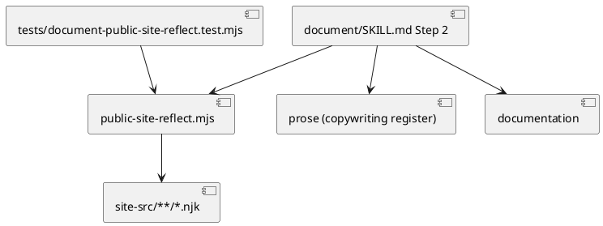

# Spec — /document public-site triggers (feature framing + reflective behavior-change check)

<!--
Required ## headings: Goal, Design, Design calls, Acceptance criteria, Test plan.
Required plantuml diagram kinds: c4_context, c4_container, c4_component, sequence, class, dependency_graph.
Upstream: backlog 7b3e (user-feedback, verbatim canonical), 5e07 (assistant-deferral).
-->

## Context

`/document` Step 2 surveys the diff and routes touched files into delegate buckets (`documentation` / `technical-tutorials` / `prose`). Two gaps surfaced, both live:

- **7b3e (user, verbatim canonical):** *"the current document only describes technical aspect but on public website we need to describe features not just the behavior."* When a public page (`site-src/**`) is in scope, Step 2 routes its prose through the reference register only — it documents WHAT/HOW (mechanism), not the user-facing FEATURE VALUE. The `_thread.md` row on `memory.njk` described the shelve/resume mechanism but not the value ("never lose your train of thought across a pivot, /clear, or flush").
- **5e07 (assistant-deferral):** Step 2 classifies by file-PRESENCE. When a change alters behavior that an existing public page *describes* but touches no `site-src/**` file itself, Step 2 concludes "no site work" — backwards. The site DESCRIBES behavior; a behavior change implies a docs-surface update even when no site file is in the diff. The trigger must be REFLECTIVE.

## Goal

`/document` Step 2 (a) routes public-site surfaces through a feature/value (persuasive) register in addition to the reference register, and (b) reflectively detects when a behavior change implies a public page that describes it — even when no `site-src/**` file is in the diff — and routes that page for update.

## Non-goals

- Rewriting the existing delegate buckets or the `prose`/`documentation`/`technical-tutorials` split.
- Auto-editing `site-src/**` content (the trigger surfaces the page + register; the actual prose still flows through `prose`/`copywriting` with the humanizer pass).
- Touching `site-src/**` in this change (the work is to the `/document` skill + a helper; no public page content changes here).
- A general NLP "does this page describe this behavior" model — the reflective check is a deterministic name-grep (skill/phase/hook tokens), not semantic.

## Decisions

- **D1 (5e07) — reflective name-grep helper.** New `.claude/skills/document/public-site-reflect.mjs` exporting `findDescribedSurfaces({ changedPaths, siteGlob })`: derive the governance tokens the diff touches (skill slug from a changed `.claude/skills/<slug>/…`, hook name from `.claude/hooks/<name>.mjs`, the phase name from a phase skill), grep `site-src/**/*.njk` for those tokens, return the matching pages. Deterministic, read-only, no deps. `/document` Step 2 calls it and routes any matches through the `documentation` delegate (description update) AND, per D2, the persuasive register — even when the diff contains no `site-src/**` file.
- **D2 (7b3e) — feature/value register for public surfaces.** `/document` Step 2 gains an explicit rule: a `site-src/**` target (in the diff OR surfaced by D1) routes through TWO registers — `documentation` (reference: what/how) AND `prose` in the persuasive/`copywriting` register (the user-facing feature VALUE). The SKILL.md delegate table and Step 2 narrative state this split; the verbatim user feedback is recorded as the binding rationale.
- **D3 — surface, don't auto-write.** The helper and Step 2 only *identify* the page + register; the prose is still authored via the `prose` delegate (humanizer always). No `site-src/**` write happens inside `/document` itself.

## Design

### C4 — System context

### C4 — Container

### C4 — Component (changed container)

### Data model — class diagram

### Behavior — sequences

### Behavior #1 — reflective detection finds a described page with no site file in the diff

### Behavior #2 — public-site target routes through the feature/value register

A `site-src/**` surface (in the diff or surfaced by #1) is routed through `prose` in the persuasive/`copywriting` register for feature VALUE, in addition to `documentation` for reference — per the canonical user feedback (7b3e).

### Behavior #3 — no false trigger on internal-only change

When the diff touches only internal files whose tokens appear in no `site-src/**` page, `findDescribedSurfaces` returns empty and Step 2 reports no public surface (no spurious routing).

### State — core entity *(not stateful; omitted)*

### Dependencies — graph

### Contracts

- `findDescribedSurfaces({ changedPaths, siteGlob = 'site-src/**/*.njk' })` → `Array<{ page, token, kind }>`. Pure read of the repo tree; deterministic; no network/writes. `kind ∈ {skill, hook, phase}`. A token is the skill slug for a changed `.claude/skills/<slug>/…` path, the hook basename for `.claude/hooks/<name>.mjs`, etc. Returns `[]` when no page references any derived token.
- `/document` Step 2 SOP: after the file-presence survey, call the helper with the diff's changed paths; for each returned page, route it through `documentation` (reference update) AND, because it is a `site-src/**` surface, `prose` in the persuasive register (feature value). Surface only — no `site-src/**` write inside `/document`.

### Libraries and versions

- Node ≥ 18.17 (`.mjs`, `node:fs`); no third-party API.

### Alternatives considered

Spec-Archive-plan enumeration of affected public pages (cure ii in 5e07) — rejected as the primary mechanism: it shifts the burden to every spec author and misses ad-hoc/quickfix changes. The reflective name-grep at `/document` time catches all tracks. The Archive-plan note can complement later (out of scope).

## Design calls

The write_set is `.claude/skills/document/**` + `tests/**` — it does not intersect `project.json → tdd.ui_globs` (no `site-src/**`, `.njk`, or component files are written). No UI surface is designed here.

- *(none)*

## Acceptance criteria

| ID | Criterion (given / when / then) | Upstream | Sequence |
|---|---|---|---|
| AC-001 | given a diff that changes `.claude/skills/<slug>/…` whose `<slug>` (or phase name) appears in a `site-src/**/*.njk` page but no site file is in the diff, when `findDescribedSurfaces` runs, then it returns that page (reflective; not file-presence) | backlog 5e07 | §Behavior #1 |
| AC-002 | given a returned described page, when `/document` Step 2 processes it, then SKILL.md routes it through BOTH `documentation` (reference) AND `prose` persuasive/`copywriting` (feature value) | backlog 7b3e | §Behavior #2 |
| AC-003 | given a diff whose changed tokens appear in no `site-src/**` page, when `findDescribedSurfaces` runs, then it returns `[]` (no false trigger) | backlog 5e07 | §Behavior #3 |
| AC-004 | given `document/SKILL.md`, when read, then Step 2 documents the reflective behavior-change check AND the public-site feature/value register split, citing the canonical user feedback | backlog 7b3e | §Behavior #2 |
| AC-005 | given the helper, when invoked, then it performs only reads (no writes, no network) and is deterministic for a fixed repo state | spec D1 | §Behavior #1 |

## Test plan

- `tests/document-public-site-reflect.test.mjs` (new): fixture repo tree with a `site-src/x.njk` mentioning a known skill slug; assert `findDescribedSurfaces({changedPaths:['.claude/skills/<slug>/SKILL.md']})` returns that page (AC-001); assert a changed path whose token is absent from any page returns `[]` (AC-003); assert no writes occur (AC-005). Real fs, mkdtemp, no mocks.
- SKILL.md assertion test (extend an existing skill-SOP test or add one): assert `document/SKILL.md` Step 2 mentions the reflective check + the persuasive-register split for `site-src/**` (AC-002, AC-004).
- Binding: `node .claude/skills/audit-baseline/audit.mjs` exits 0; full serial suite green. After baseline-owned edits, `npm run build`.

## Observability

`/document`'s terminal message names any public pages surfaced by the reflective check and the registers each was routed through.

## Rollout

Single commit on `main` (protected) via gate C. No migration; the new Step 2 logic takes effect on the next `/document` run. Silent prerequisite: `npm run build` after the baseline-owned edits (manifest hash).

## Rollback

Revert the commit. The helper disappears and Step 2 returns to file-presence-only routing. No data migration.

## Archive plan

Bundle at `docs/archive/<date>/document-skill-public-site-triggers/`: spec, security, workflow.json. Per D2 the `/document` run on THIS change should itself surface whether any public page describes `/document` behavior (dogfood) — expected: the site's workflow/skill pages may reference `document`, so the reflective check should flag them for a feature-value pass.

## Open questions

- Whether to also implement cure (ii) (spec Archive-plan enumeration of affected public pages) as a complement — deferred; the reflective `/document`-time check is the primary fix and covers all tracks.
