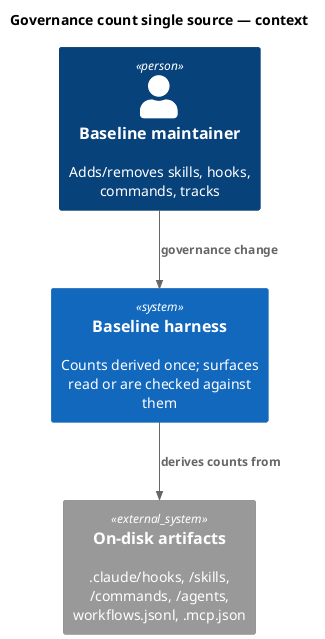
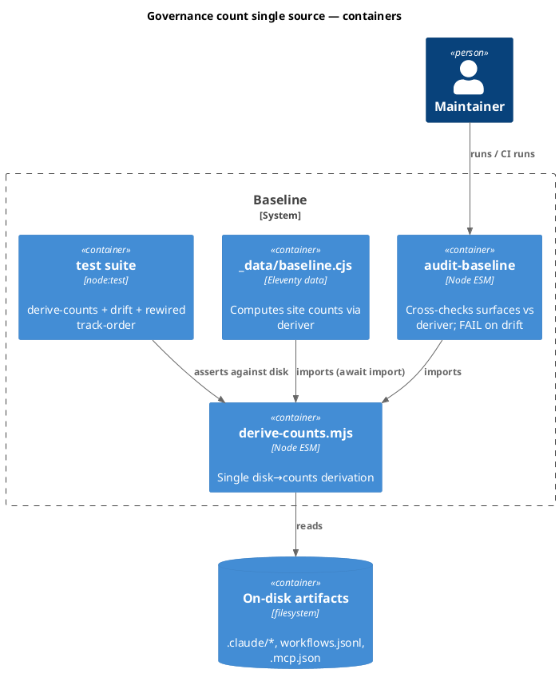
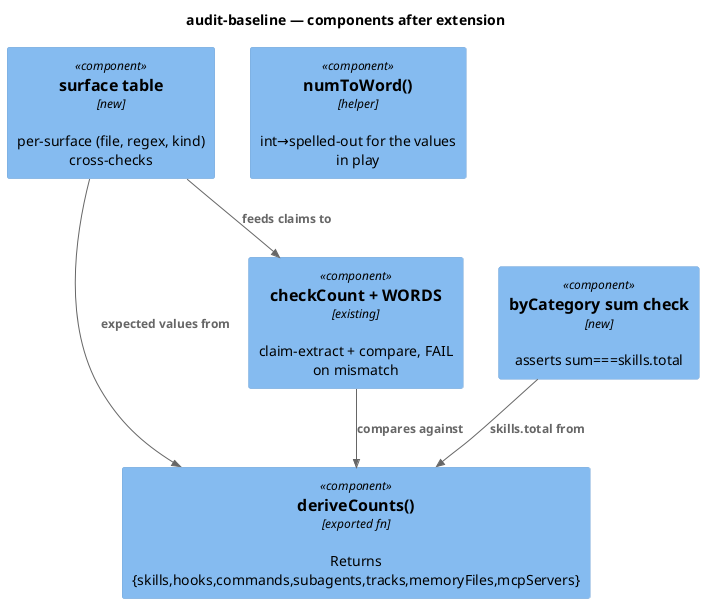
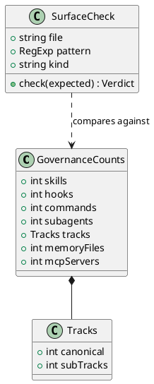
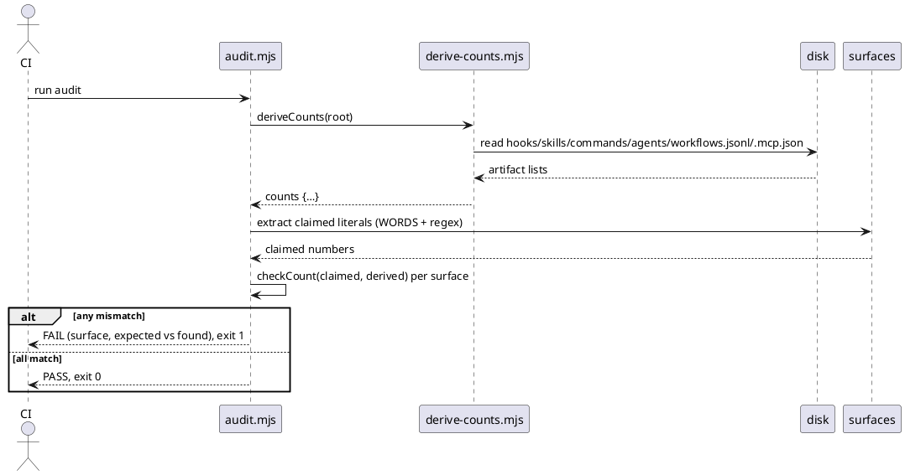
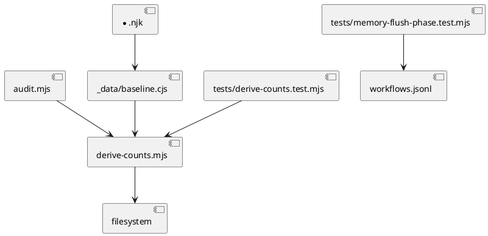

# Spec — Single source of truth for harness governance counts

<!--
Spec produced by the `spec` skill. Required ## headings: Goal, Design, Design calls,
Acceptance criteria, Test plan. Required plantuml diagram kinds: c4_context,
c4_container, c4_component, sequence, class, dependency_graph.
Upstream: docs/intake/, docs/scout/, docs/research/ for governance-count-single-source.
-->

## Context

The harness states its own size as literal numbers ("22 hooks, 1 subagent, 40 skills", "6 commands", "5 selectable tracks") across roughly ten surfaces, none derived from the artifacts on disk. Every governance change forces a manual sweep, and the audit cannot catch a stale literal. Scout found a live instance: `site-src/_data/baseline.json` claims `commands: 5` while disk has 6, and the site renders that stale number.

The audit (`.claude/skills/audit-baseline/audit.mjs`) **already** derives counts from disk (`diskBaselineHooks/Skills/Agents`, `diskCommands`, `manifest.owners.skills`) and cross-checks them — but only against `docs/init/seed.md`, and only for hooks/agents/skills/commands. This work extends that existing engine and adds a derived site-data source so every surface reads from, or is checked against, one derivation.

## Goal

A governance count is derived in exactly one place; the rendered site reads the derived value; and `audit-baseline` FAILs the build when any enforced surface disagrees with the artifacts on disk.

## Non-goals

- Changing any actual count (numbers stay what the artifacts truly are; `baseline.json:commands` going 5→6 is a *correction to match disk*, not a governance change).
- Redesigning the manifest format or the Article XI ownership model.
- Touching vendored / user-owned skills.
- A CLI subcommand or end-user feature.
- Templating binding constitutional prose (the `CLAUDE.md` Article III greeting stays static; it is cross-checked, not generated).
- Parsing compound addend decompositions (e.g. seed.md "seventeen guards plus four lifecycle plus one input-boundary") — totals only.

## Decisions

Captured from `docs/research/governance-count-single-source.md`; these are load-bearing and ride gate-A approval (codesign_mode off).

- **D1 (DP-1) — one shared deriver, two consumers.** New `.claude/skills/audit-baseline/derive-counts.mjs` exports `deriveCounts(root)` returning `{ skills, hooks, commands, subagents, tracks: {canonical, subTracks}, memoryFiles, mcpServers }`. `audit.mjs` imports it (replacing its inline derivation); the site `_data` imports it. Rejected: a build-emitted JSON (reintroduces a stale-able artifact and breaks the audit's run-anytime guarantee) and independent re-derivation (two drifting code paths).
- **D2 (DP-2) — site data becomes computed.** `site-src/_data/baseline.json` → `site-src/_data/baseline.cjs` (async CJS wrapper using `await import()` of the ESM deriver, matching the existing `_data/site.cjs` precedent that already replaced a drifting static `site.json`). Numeric fields and word-forms are derived (`numToWord` helper in the deriver for the values in play: 1,3,5,6,7,11,22,40); `skills.byCategory` stays hand-authored but the audit asserts `sum(byCategory) === skills.total`. `phases`/`gates` stay static (not artifact counts).
- **D3 (DP-3) — commands canonical = 6** (count `.claude/commands/*.md`; `init-project-doctor.md` is its own command file; `CLAUDE.md` already says 6). `baseline.json:commands:5` is corrected to 6 automatically by derivation. The audit's count engine is generalized from "seed.md only" to a per-surface table; hard-FAIL surfaces: the `CLAUDE.md`+mirror orientation line, the Article III greeting, `PRODUCT.md:40`, `README.md:44`. Totals only.
- **D4 (DP-4) — test rewire.** `tests/memory-flush-phase.test.mjs` AC-006 is repointed from `triage/SKILL.md` prose to `.claude/workflows.jsonl` node order; then the `triage/SKILL.md` "Reference: canonical track shapes" subsection is deleted. AC-001 (harness fenced block) is untouched.

## Design

The change has one Foundation module (the deriver) and three consumers (audit cross-check, site data, the test/triage cleanup). Consumers depend on the deriver, so this is a **solo** `/tdd` change (the components are not independent — they share the deriver edge — so the Phase-6 swarm independence test resolves to solo).

### C4 — System context

### C4 — Container

### C4 — Component (changed containers only)

### Data model — class diagram

### Behavior #1 — site renders a derived count

The eleventy build invokes `_data/baseline.cjs`, which returns the derived counts; `{{ baseline.commands }}` renders **6** (the corrected value), not a hand-typed literal. Every existing `{{ baseline.* }}` reference resolves unchanged.

### Behavior #2 — deriveCounts reads disk (audit + tests + site share it)

### Behavior #3 — audit cross-checks a prose surface

For each enforced prose surface, the audit extracts the literal (numeric or via the `WORDS` map) and compares it to the derived count; a disagreement is a FAIL row.

### Behavior #4 — drift / assertion FAILs the audit (clean audit gates the rest)

Any surface mismatch, or a `byCategory` sum that does not equal `skills.total`, makes the audit emit FAIL and exit 1. When everything matches, the audit exits 0 — which is the condition AC-006 (suite green after the triage-prose deletion), AC-007 (mirror byte-equality confirmed), and AC-008 (byCategory sum) observe.

### State — core entity *(not stateful; omitted)*

### Dependencies — graph

### Contracts

- `deriveCounts(root = repoRoot)` → object above. Pure read of the filesystem; deterministic; no network; no writes. Skills count = directories under `.claude/skills` whose `SKILL.md` declares `owner: baseline` (matches `manifest.owners.skills`). Hooks = top-level `.claude/hooks/*.mjs` (excludes `lib/`). Commands = `.claude/commands/*.md`. Subagents = `.claude/agents/*.md`. Tracks = `workflows.jsonl` lines split by `selectable`. memoryFiles = canonical 7. mcpServers = `.mcp.json` server keys.
- `numToWord(n)` → spelled-out string for n ∈ {1,3,5,6,7,11,12,22,40}; throws on an unmapped value (so a new count forces the map to be updated rather than silently emitting a number where a word is expected).
- Audit surface-check: for each `(file, pattern, kind)`, FAIL if the extracted literal ≠ derived[kind]; WARN if the literal cannot be extracted (never silently pass).

### Libraries and versions

- `@11ty/eleventy@3.1.5` (devDep) — eleventy data files may be `.cjs` exporting an async function; eleventy awaits it. Confirmed in-repo by `site-src/_data/site.cjs`. No API recalled from memory.
- Node ≥ 18.17 (`.mjs`/`.cjs`, `node:fs`, `node:test`).

### Alternatives considered

Build-emitted `governance-counts.json` (rejected — stale-able, breaks run-anytime audit) and independent re-derivation (rejected — duplicate drift). See research memo.

## Design calls

The write_set touches `site-src/**` (`_data/baseline.cjs`, possibly narrative `.njk`), which intersects `tdd.ui_globs`. The change is a **data-source swap with byte-identical rendered output** — the same numbers reach the same `{{ baseline.* }}` slots — so there is no visual design move. The row below routes at `/tdd` Step 6 to `design-ui`, which is expected to return `not_a_design_task` (`correct_lane: development`); recorded honestly rather than omitted.

| Slug | Intent | Target files | Write set | Register | References |
|---|---|---|---|---|---|
| site-counts-datasource | Swap site count data from a static JSON literal to a computed data file; no visual change, identical rendered numbers | `site-src/_data/baseline.cjs` (+ narrative `.njk` token swaps) | `site-src/_data/**`, `site-src/**/*.njk` | inherit | docs/research §DP-2 |

## Acceptance criteria

| ID | Criterion (given / when / then) | Upstream AC | Sequence |
|---|---|---|---|
| AC-001 | given the on-disk artifacts, when `deriveCounts()` runs, then it returns the correct `{skills:40, hooks:22, commands:6, subagents:1, tracks:{canonical:5,subTracks:2}, memoryFiles:7, mcpServers:3}` with no network/writes | intake AC 1 | §Behavior #2 |
| AC-002 | given the site builds, when a page states a governance count, then the number comes from `_data/baseline` (derived), not a hand-typed literal; `baseline.commands` renders 6 | intake AC 2 | §Behavior #1 |
| AC-003 | given a non-generatable prose surface (orientation line, Article III greeting, PRODUCT.md:40, README:44), when `audit-baseline` runs, then it parses the literal and FAILs if it disagrees with the derived count | intake AC 3 | §Behavior #3 |
| AC-004 | given any enforced count is made stale on disk-vs-surface, when `audit-baseline` runs, then it exits non-zero naming the surface and expected-vs-found | intake AC 4 | §Behavior #4 |
| AC-005 | given `tests/memory-flush-phase.test.mjs`, when it asserts canonical track ordering, then it reads `.claude/workflows.jsonl` node order (not `triage/SKILL.md` prose); AC-001's harness fenced-block test is unchanged | intake AC 5 | §Behavior #2 |
| AC-006 | given AC-005 holds, when the `triage/SKILL.md` "Reference: canonical track shapes" subsection is deleted, then the full suite stays green and `audit-baseline` exits 0 | intake AC 6 | §Behavior #4 |
| AC-007 | given the mirror pairs, when this lands, then `CLAUDE.md`↔`src/CLAUDE.template.md` and `docs/init/seed.md`↔`src/seed.template.md` stay byte-equal and audit confirms | intake AC 7 | §Behavior #4 |
| AC-008 | given the deriver, when `byCategory` is summed, then the audit asserts it equals `skills.total` (40) and FAILs otherwise | spec D2 | §Behavior #4 |

## Test plan

- `tests/derive-counts.test.mjs` (new): `deriveCounts()` returns each field equal to a live re-count of the real repo tree (no mocks; reads actual `.claude/`). Asserts `commands===6`, `skills===40`, etc. Covers AC-001.
- `tests/governance-count-drift.test.mjs` (new) OR extend `tests/audit-baseline*.test.mjs`: write a temp fixture surface with a deliberately wrong literal and assert the audit's surface-check reports FAIL; assert a correct literal PASSes. Covers AC-003, AC-004, AC-008.
- Site: assert `_data/baseline.cjs` resolves (async) and `commands===6`, numeric fields match `deriveCounts()`. Covers AC-002.
- `tests/memory-flush-phase.test.mjs`: rewired AC-006 reads `workflows.jsonl`; assert `idx(archive)<idx(memory-flush)<idx(grant-commit)` for intake-full and `idx(chore)<idx(memory-flush)<idx(grant-commit)` for chore. Covers AC-005. Confirm AC-001 (harness block) still asserts against `harness/SKILL.md`.
- Binding: `node .claude/skills/audit-baseline/audit.mjs` exits 0; full serial suite green; mirror byte-equality tests green (AC-006, AC-007). After any baseline-owned edit, `npm run build` regenerates `obj/template/.claude/manifest.json`.

## Observability

The audit's existing PASS/FAIL/WARN report gains rows per enforced surface (e.g. `count: CLAUDE.md orientation — PASS 22 hooks`). A drift prints `FAIL <surface>: expected <derived>, found <literal>`.

## Rollout

Single commit on `main` (protected) via the normal gate-C flow. No migration, no flag — the derived data file and audit checks take effect immediately on build. Silent prerequisite: `npm run build` must run after the baseline-owned edits so the manifest hash matches (audit enforces this).

## Rollback

Revert the commit. The static `baseline.json` returns; the audit's extra checks disappear. No data migration to undo. Blast radius is the build + site only (no runtime/consumer behavior changes).

## Archive plan

Bundle at `docs/archive/<date>/governance-count-single-source/`: intake, scout, research, this spec, security report, workflow.json. No public-docs page documents the derivation internals (the `/document` reflective check should confirm no site page describes "how counts are derived" — the site only *shows* the counts).

## Open questions

- ESM `_data/baseline.mjs` vs async `_data/baseline.cjs` — spec picks `.cjs` (style continuity with `site.cjs`); reviewer may override at gate A.
- Exact hard-FAIL surface set (D3) — spec picks orientation line + greeting + PRODUCT.md:40 + README:44; reviewer may widen/narrow at gate A.
