# Spec — rename `changelog` → `whatsnew`, an on-demand generator with an optional per-project routing seam (CHANGELOG.md becomes semantic-release-only)

<!--
Technical spec. Produced by the `spec` skill.
Approval is a token written by /approve-spec — never inline.
-->

## Context

| Input | Path |
|---|---|
| Intake | `docs/intake/changelog-generator-routing.md` |
| BRD *(if any)* | *(none)* |
| Scout *(if any)* | `docs/scout/changelog-generator-routing.md` |
| Research *(if any)* | `docs/research/changelog-generator-routing.md` |

## Goal

The `changelog` skill is renamed `whatsnew` and reshaped into an on-demand generator that emits a structured JSON "what's new" fragment to a gitignored conventional path and is reclassified out of the mandatory 11-phase pipeline; an optional `project.json → whatsnew.route_workflow` knob names a per-project routing workflow (offered actively at `/init-project`); and `CHANGELOG.md` is written only by semantic-release in CI.

## Non-goals

- Building this repo's own "what's new" Eleventy page (a project-scoped routing target, designed later).
- Any "upcoming"/unreleased bucket or next-version forecasting — version is read at publish time by the routing target, never stored in the fragment.
- Changing semantic-release's ownership of versioned `CHANGELOG.md` blocks, the release workflow, or the conventional-commit contract.
- Prescribing CHANGELOG tooling for consumer projects.
- Pruning the orphaned gitignored `.claude/state/changelog/` directory (decided: leave it; it is local-only, ignored, and harmless).

## Design

Diagrams are the contract. Prose is only for things a diagram cannot say.

The change is a **subtraction plus one small additive seam**: remove the mandatory `changelog` node from every track and the `## [Unreleased]` curation machinery; rename the skill `changelog` → `whatsnew` and reshape it into a generator that writes a gitignored JSON fragment; add an optional routing knob offered at onboarding.

**Rename blast radius (in scope).** Renaming `changelog` → `whatsnew` touches: the skill dir `.claude/skills/changelog/` → `.claude/skills/whatsnew/`; its `SKILL.md` frontmatter `name:`; the manifest key `owners.skills.changelog` → `owners.skills.whatsnew` (per-file hashes re-derived by `scripts/build-template.sh` at build); the `SKILL_CATEGORIES` map; the site skill-index page; and the CONSTITUTION Appendix B skill index. There is **no** `/changelog` command file (it is a skill), so no command rename is required.

**Bootstrapping self-exception.** This workflow runs under *current* rules, so its own TaskList carries a Phase 11.5 `changelog` node (between `/grant-commit` and `/commit`). Because `/tdd` retires that skill mid-workflow, this workflow SHALL add `changelog` to `workflow.json → exceptions` before the harness reaches that node, so the closing sequence becomes `grant-commit → commit` directly — exactly the post-amendment shape.

### C4 — System context

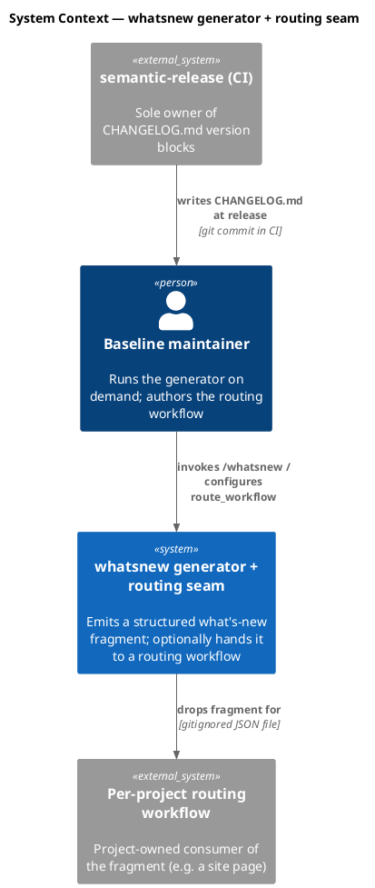

CHANGELOG.md is reached only by semantic-release; the generator never touches it.

### C4 — Container

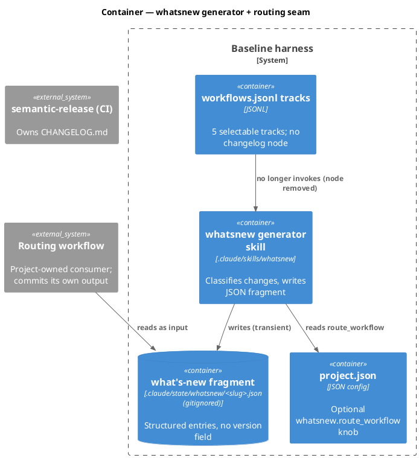

### C4 — Component (changed containers only)

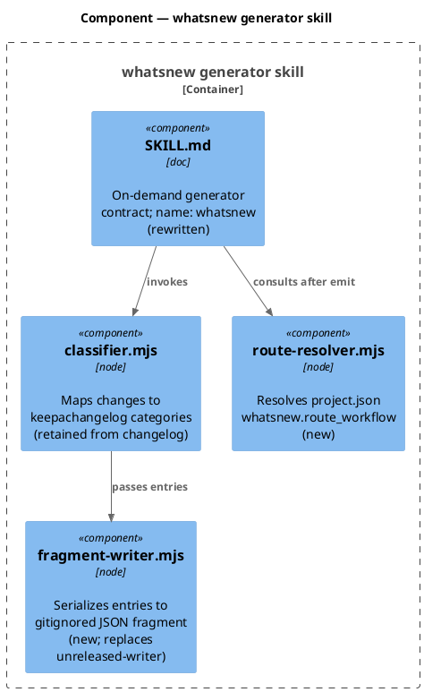

Retired components: `unreleased-writer.mjs`, `version-preview.mjs`, and `tests/keepachangelog-unreleased-preserved_test.mjs`.

### Data model — class diagram

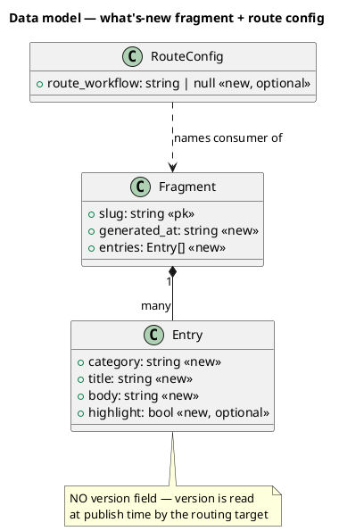

#### Data migration (file-structure, no SQL database)

This system has no relational store; "migration" is a one-time file-structure transformation, performed as part of this workflow's own commit:

```text
-- forward --
1. CHANGELOG.md      : delete the "## [Unreleased]" heading AND its body
                       (the duplicated 0.13.0 content). Leave "# Changelog"
                       + intro + version blocks untouched (semantic-release
                       prepend point is independent of the deleted heading,
                       per the pinned plugin test).
2. .claude/skills/changelog/ -> .claude/skills/whatsnew/ : git mv the dir;
                       remove unreleased-writer.mjs, version-preview.mjs,
                       tests/keepachangelog-unreleased-preserved_test.mjs;
                       add fragment-writer.mjs, route-resolver.mjs;
                       rewrite SKILL.md (name: whatsnew, generator contract).
3. project.json + src/project.template.json : add optional
                       "whatsnew": { "route_workflow": null }.
4. manifest          : owners.skills.changelog -> owners.skills.whatsnew
                       (rebuilt by scripts/build-template.sh; hashes re-derived).
5. .claude/state/whatsnew/  : new gitignored conventional drop dir
                       (.claude/state/ already gitignored at .gitignore:5).

-- reverse --
git revert the feature commit: restores the changelog skill name, the helpers,
and the ## [Unreleased] section. The fragment is regenerable; no data loss.

-- explicitly NOT touched --
.claude/state/changelog/  : orphaned gitignored local artifacts; left in place.
```

### Behavior — sequence per AC

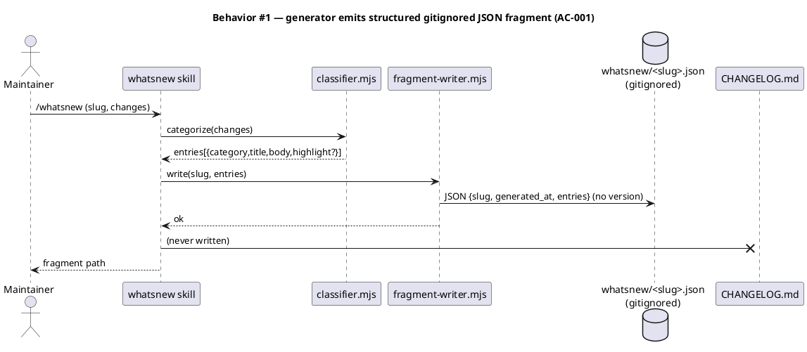

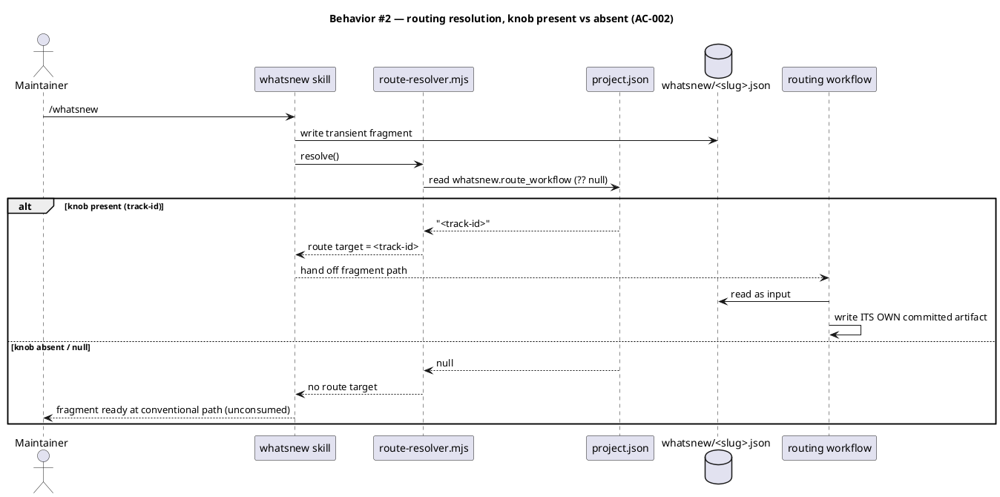

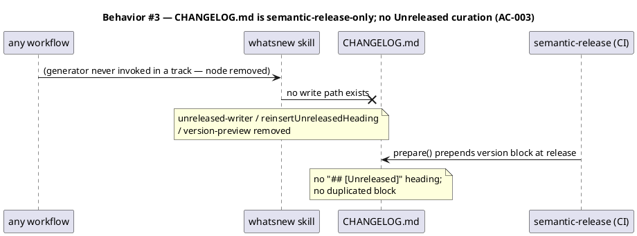

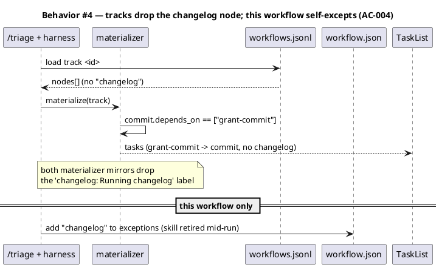

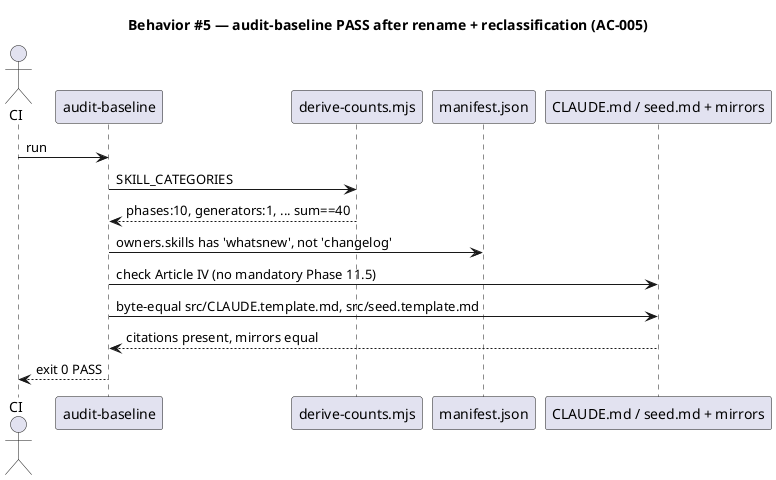

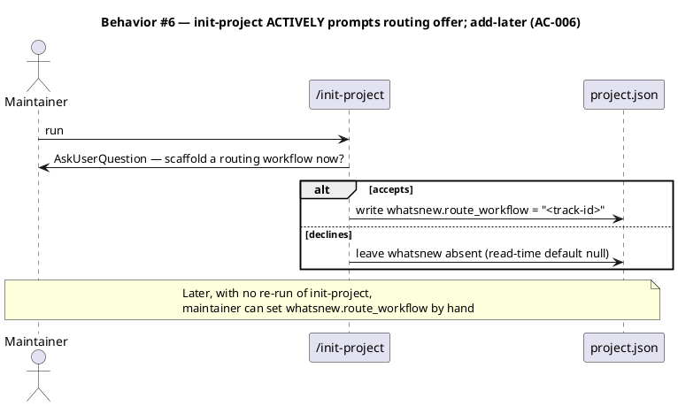

### State — core entity *(only if stateful)*

Omitted deliberately — the generator is stateless per invocation (it reads changes, writes a fragment); there is no non-trivial state machine. The fragment is regenerable and carries no lifecycle.

### Dependencies — graph

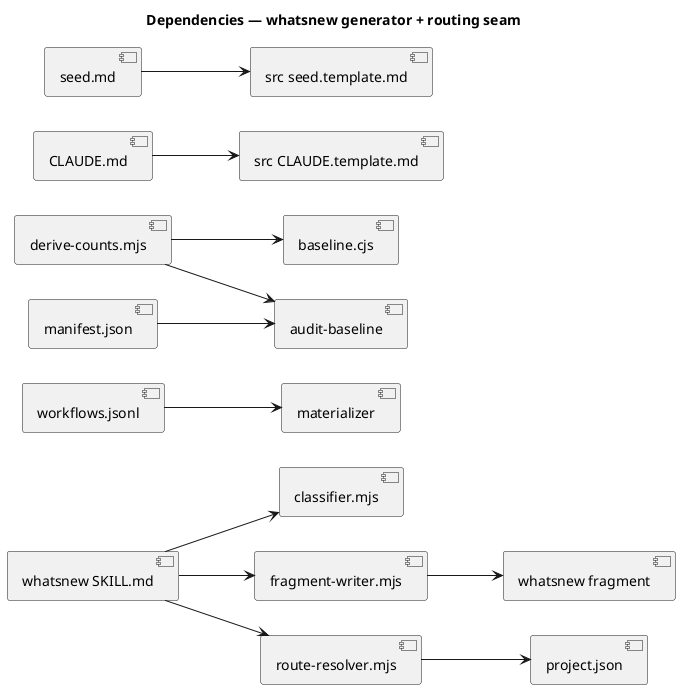

### Contracts

| Kind | Name | Input | Output | Errors | Idempotent |
|---|---|---|---|---|---|
| CLI/Skill | `/whatsnew` generate | `{slug, changes}` | `.claude/state/whatsnew/<slug>.json` (gitignored) | invalid slug, empty changes → clear error | yes (re-run replaces fragment) |
| Config | `project.json → whatsnew.route_workflow` | `string \| null` | resolved route target | malformed value → error with key path | n/a |
| File | `.claude/state/whatsnew/<slug>.json` | — | `{slug, generated_at, entries[]}` | — | regenerable, transient |

### Libraries and versions

No new third-party libraries are introduced. The change removes the local fight with `@semantic-release/changelog` (no API call from our code). JSON handling is Node built-in.

| Library@version | Purpose | Key APIs | Confirmed via context7 |
|---|---|---|---|
| *(none — no new third-party API)* | — | — | n/a |

Grounding for the unchanged plugin behavior relied upon: the repo's version-pinned empirical test for `@semantic-release/changelog@6.0.3` (`prepare` prepends above existing headings, independent of `## [Unreleased]`). context7 has no coverage for `@semantic-release/changelog`/`@semantic-release/git`; the pinned on-disk test is the authoritative reference.

### Alternatives considered

| Alt | Summary | Rejected because |
|---|---|---|
| A | YAML fragment | adds a YAML dependency the repo avoids; output is machine-written so editability gain is moot |
| B | Fold into `sharedGlobals` category | semantically blurs that category; a dedicated `generators` category is honest |
| C | Keep an empty `## [Unreleased]` heading | vestigial once curation is gone; plugin prepends above it so it drifts to the bottom |
| D | Required routing knob | violates "neither path mandatory" (intake AC-5) |
| E | Keep the skill named `changelog` | confusing once CHANGELOG.md is machine-only; rename to `whatsnew` is clearer (chosen) |
| F | Commit the fragment (track it) | git churn + duplicates routing-target content; the gitignored transient buffer keeps the generator generic (chosen: transient) |

## Design calls

The write_set intersects `project.json → tdd.ui_globs` (`site-src/**`, `**/*.njk`): `site-src/skills/core.njk` must change because it describes the `changelog` skill as "Phase 11.5" and narrates category sections. A new `§ Generators` section is added matching the existing category-section pattern, and the entry is renamed `whatsnew`.

| Slug | Intent | Target files | Write set | Register | References |
|---|---|---|---|---|---|
| skills-index-generators | Add a `§ Generators` category section, move the renamed `whatsnew` entry out of `§ Phase skills`, matching existing category sections (no new visual idiom) | `site-src/skills/core.njk` | `site-src/skills/core.njk` | inherit | existing `§ Phase helpers` / `§ Memory` sections on the same page |

## Acceptance criteria

| ID | Criterion (given / when / then) | Upstream AC | Sequence |
|---|---|---|---|
| AC-001 | given a set of changes, when `/whatsnew` runs, then it writes `.claude/state/whatsnew/<slug>.json` (gitignored) with `{slug, generated_at, entries[{category,title,body,highlight?}]}`, no version field, and writes nothing to `CHANGELOG.md` | intake AC-3 | §Behavior #1 |
| AC-002 | given `whatsnew.route_workflow` set, when `/whatsnew` runs, then it resolves that named route target and hands off the fragment path; given it is absent/null, then the generator still succeeds and the fragment sits at the conventional path unconsumed | intake AC-4 | §Behavior #2 |
| AC-003 | given the cutover, when the tree is inspected, then `CHANGELOG.md` has no `## [Unreleased]` heading and no duplicated version block, and `unreleased-writer.mjs` + `version-preview.mjs` + `keepachangelog-unreleased-preserved_test.mjs` are removed with no remaining `## [Unreleased]` curation path | intake AC-1, AC-7 | §Behavior #3 |
| AC-004 | given any of the 5 selectable tracks, when materialized, then it contains no `changelog` node and `commit.depends_on == ["grant-commit"]`, in both `.claude/workflows.jsonl` and `src/.claude/workflows.template.jsonl`, neither materializer mirror emits a `changelog` label, and this workflow has `changelog` in `workflow.json → exceptions` | intake AC-2 | §Behavior #4 |
| AC-005 | given the amendment, when `audit-baseline` runs, then it exits 0: `SKILL_CATEGORIES` has `phases:10` + `generators:1` summing to 40, `manifest.owners.skills` lists `whatsnew` (not `changelog`), Article IV lists no mandatory Phase 11.5, and `src/CLAUDE.template.md` + `src/seed.template.md` are byte-equal to their canonical files | intake AC-6 | §Behavior #5 |
| AC-006 | given `/init-project`, when it runs, then it actively prompts (AskUserQuestion) to scaffold a routing workflow but does not require one; `project.json → whatsnew.route_workflow` defaults to `null` when absent; and a project can set it later without re-running init-project | intake AC-5 | §Behavior #6 |

## Test plan

| Category | Scenario | Expected | Covers |
|---|---|---|---|
| Golden path | `/whatsnew` runs on a change set | gitignored fragment JSON at `.claude/state/whatsnew/<slug>.json`, schema valid, no CHANGELOG.md write | AC-001 |
| Input boundary | empty entries / missing title / unicode body | clear validation error or well-formed minimal fragment | AC-001 |
| Contract | `route_workflow` set vs null vs malformed | resolved target / unconsumed success / keypath error | AC-002 |
| Regression trap | `CHANGELOG.md` contains no `## [Unreleased]`; grep finds no `appendUnderUnreleased`/`reinsertUnreleasedHeading`/`version-preview` callers | unchanged invariant holds | AC-003 |
| Contract | each of 5 tracks (both files) | no `changelog` node; `commit.depends_on==["grant-commit"]` | AC-004 |
| Regression trap | both materializer mirrors | no `changelog` activeForm label | AC-004 |
| Golden path | `node audit-baseline` | exit 0; counts sum 40; manifest lists `whatsnew`; mirrors byte-equal; Article IV has no Phase 11.5 | AC-005 |
| Contract | read-time default for `whatsnew.route_workflow` absent | resolves to `null`, no throw | AC-006 |
| Contract | skill dir renamed | `.claude/skills/whatsnew/SKILL.md` exists with `name: whatsnew`; `.claude/skills/changelog/` gone | AC-005 |

## Observability

| Signal | Name | Shape | Purpose |
|---|---|---|---|
| Log | `whatsnew.fragment.written` | fields: `slug`, `entry_count`, `path` | confirm generator emit |
| Log | `whatsnew.route.resolved` | fields: `slug`, `route_workflow` (or `null`) | confirm routing decision |
| Audit | `audit-baseline` exit code | 0/1 | governance-drift gate (CI) |

This is a dev-tooling change with no runtime service; metrics/alarms are not applicable. The audit exit code is the operative health signal.

## Rollout

- **Feature flag**: none — governance + skill refactor landed atomically in one commit; partial state would leave the constitution inconsistent.
- **Migration order**: 1 amend `seed.md` → 2 `CLAUDE.md` (+ `src` mirrors) → 3 remove `changelog` node from tracks + materializers → 4 reclassify in `SKILL_CATEGORIES` + site/annex → 5 `git mv` skill `changelog`→`whatsnew`, reshape as generator + add knob + init-project prompt → 6 clean `CHANGELOG.md` → 7 rebuild template (manifest) → 8 `audit-baseline` + `npm test` green.
- **Canary**: `audit-baseline` PASS + full `npm test` green on the feature branch before Gate C.

## Rollback

- **Kill-switch**: `git revert` of the single feature commit — restores Phase 11.5, the `changelog` name, the curation helpers, and the `## [Unreleased]` section.
- **Signal to roll back**: `audit-baseline` FAIL or `npm test` red post-merge — both surface within one CI run (well under 5 minutes).

## Archive plan

- Defaults *(automatic)*: intake, scout, research, spec, spec-rendered/, spec approval, security report.
- Extras *(list any non-default files)*:
  - *(none)*

## Open questions

All four prior open questions are resolved by reviewer decision at Gate A:

- **Skill rename** → renamed `changelog` → `whatsnew` (resolved).
- **Fragment commit policy** → transient gitignored buffer; routing workflows commit their own output (resolved).
- **Stale `.claude/state/changelog/*`** → leave in place; gitignored and harmless (resolved).
- **`/init-project` offer depth** → actively prompt via AskUserQuestion as part of onboarding (resolved).

No open questions remain blocking approval.
