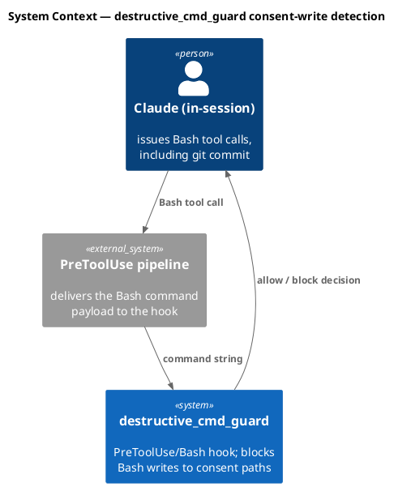
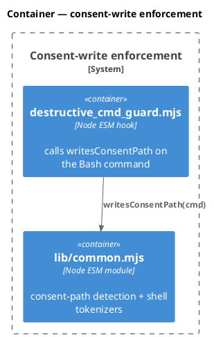
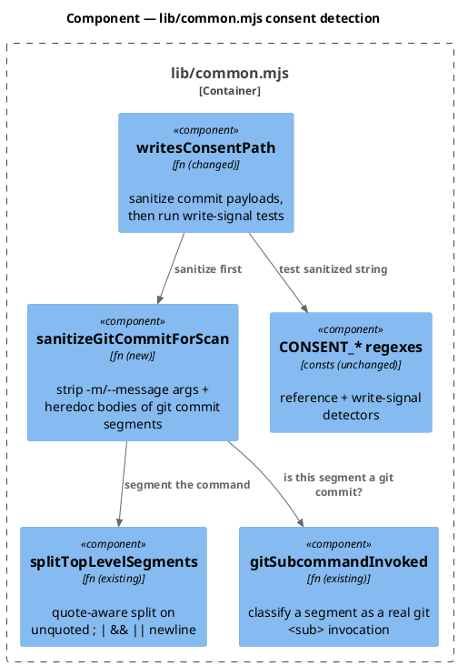
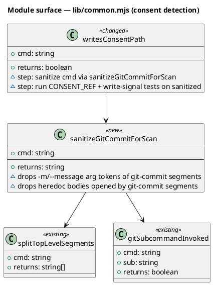
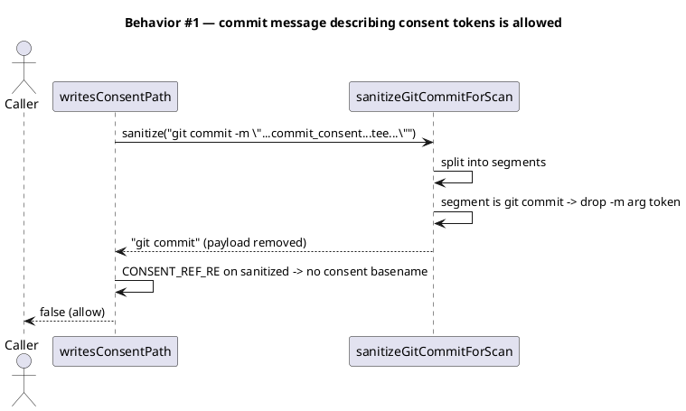
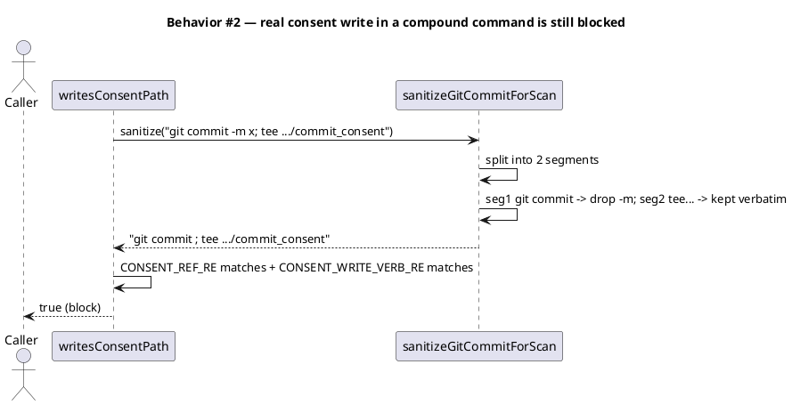
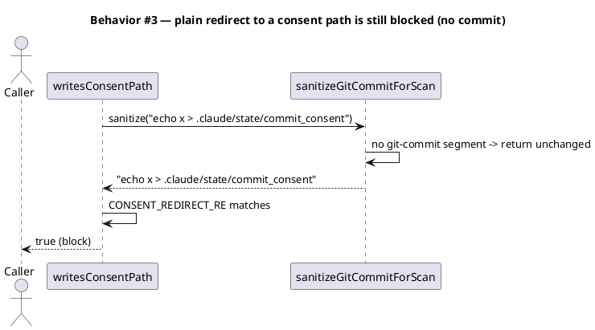
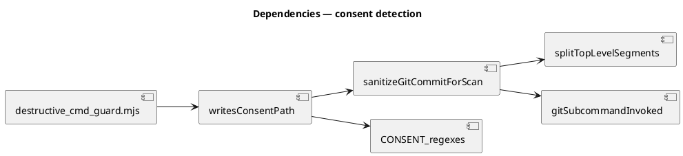

# Spec — git-commit message payload carve-out in `writesConsentPath`

## Context

| Input | Path |
|---|---|
| Intake | *(none — entered via `/triage` → spec; request captured in `.claude/state/workflow.json`)* |
| BRD *(if any)* | *(none)* |
| Scout *(if any)* | *(none — single-file change, scout excepted)* |
| Research *(if any)* | *(none — research excepted; design grounded in reading `lib/common.mjs`)* |

## Goal

`writesConsentPath(cmd)` ignores the message payload of a `git commit` invocation (an inline `-m`/`--message` argument and a heredoc body feeding the commit) when scanning for consent-path writes, so a governance commit whose message merely *describes* consent tokens is allowed — while every real Bash write to a consent path, including one in a compound command alongside a `git commit`, is still blocked.

## Non-goals

- Changing the consent basename set, the write-verb set, or any other guard semantics.
- Touching `git_commit_guard.mjs` (the commit-consent enforcement) — this is purely the `destructive_cmd_guard` consent-path detector in `lib/common.mjs`.
- Suppressing detection for any command other than a `git commit` (e.g. `git tag -m`, `git stash`) — out of scope; only `git commit` is carved out.
- Handling `-F <file>` filename arguments specially: the file's *content* is never in the command string, so it already passes; only `-F -` heredoc bodies need stripping.

## Design

Diagrams are the contract. Prose is only for things a diagram cannot say.

The root cause: `writesConsentPath` runs `CONSENT_WRITE_VERB_RE` / `CONSENT_REDIRECT_RE` against the **entire** command string. A `git commit` message that contains a consent basename (e.g. `commit_consent`) and a write-verb word (e.g. `tee`) satisfies both the reference test and a write-signal test, so the command is wrongly classified as a consent-path write. The fix sanitizes the command — removing only `git commit` message payloads — before the existing write-signal tests run. Non-commit segments are preserved verbatim, so a real write after a separator is still caught.

The fix reuses existing Foundation helpers in `lib/common.mjs`: `splitTopLevelSegments` (quote-aware separator split) and `gitSubcommandInvoked` (segment-aware git subcommand classifier). The only new code is a sanitizer that, per top-level segment classified as `git commit`, drops `-m`/`--message[=]` argument tokens and any heredoc body the segment opens.

### C4 — System context

Who interacts with the system, and which external systems it depends on.

### C4 — Container

Deployable units inside the system boundary and how they communicate.

### C4 — Component (changed containers only)

One diagram per container whose internals change. Only `lib/common.mjs` changes.

### Data model — class diagram

No database. The "data model" here is the module's function surface. Mark new/changed with `<<new>>` / `<<changed>>`.

#### Migration DDL

No schema. No data migration. *(section retained so the absence is explicit)*

### Behavior — sequence per AC

One sequence per behavior. The sequence is the contract.

### State — core entity *(only if stateful)*

No state machine. `writesConsentPath` and `sanitizeGitCommitForScan` are pure functions of the command string. *(heading retained to record the explicit choice)*

### Dependencies — graph

Directed graph; edge `A --> B` reads "A depends on B".

### Contracts

| Kind | Name | Input | Output | Errors | Idempotent |
|---|---|---|---|---|---|
| Fn | `writesConsentPath(cmd)` | `cmd: string` | `boolean` (true = blocks) | non-string → `false` | yes (pure) |
| Fn | `sanitizeGitCommitForScan(cmd)` | `cmd: string` | `string` (commit message payloads removed) | non-string → returns input coerced/empty safely | yes (pure) |

### Libraries and versions

No third-party libraries. The fix uses only Node built-ins already imported by `lib/common.mjs` and existing in-module helpers.

| Library@version | Purpose | Key APIs | Confirmed via context7 |
|---|---|---|---|
| *(none)* | — | — | n/a |

### Alternatives considered

| Alt | Summary | Rejected because |
|---|---|---|
| A | In `destructive_cmd_guard.mjs`, skip the consent check entirely when the command starts with `git commit`. | Opens a bypass: `git commit -m x; tee .../commit_consent` would skip the check. Must sanitize per-segment, not whole-command. |
| B | Always require `commit/SKILL.md` to write the message to a temp file (`-F <file>`) and never inline/heredoc. | SOP-only band-aid; leaves the guard wrong for every other caller (ad-hoc commits, other skills). The guard is the right layer. |
| C | Strip ALL quoted strings from the command before scanning. | Over-broad: a real `tee ".../commit_consent"` uses quotes too; would open a bypass. |

## Design calls

*(none)* — write_set has no UI files.

## Acceptance criteria

| ID | Criterion (given / when / then) | Upstream AC | Sequence |
|---|---|---|---|
| AC-001 | given `git commit -m "<msg containing commit_consent and tee>"`, when `writesConsentPath` runs, then it returns `false` (allowed). | request | §Behavior #1 |
| AC-002 | given `git commit -F - <<EOF ... commit_consent ... tee ... EOF`, when `writesConsentPath` runs, then it returns `false` (allowed). | request | §Behavior #1 |
| AC-003 | given `git commit --message="...push_consent... cp ..."`, when `writesConsentPath` runs, then it returns `false` (allowed). | request | §Behavior #1 |
| AC-004 | given `git commit -m x; tee .claude/state/commit_consent`, when `writesConsentPath` runs, then it returns `true` (blocked). | request | §Behavior #2 |
| AC-005 | given `git commit -m x && echo y > .claude/state/push_consent`, when `writesConsentPath` runs, then it returns `true` (blocked). | request | §Behavior #2 |
| AC-006 | given `echo x > .claude/state/commit_consent` (no git commit), when `writesConsentPath` runs, then it returns `true` (blocked) — unchanged behavior. | request | §Behavior #3 |
| AC-007 | given `tee .claude/state/.commit_consent_grant < /dev/null` (no git commit), when `writesConsentPath` runs, then it returns `true` (blocked) — unchanged behavior. | request | §Behavior #3 |
| AC-008 | given the existing consent-write and tokenizer test suites, when the fix lands, then every previously-passing assertion still passes (no regression). | request | §Behavior #3 |

## Test plan

| Category | Scenario | Expected | Covers |
|---|---|---|---|
| Golden path | `git commit -m` with consent basename + write-verb in message | `writesConsentPath` → false | AC-001 |
| Golden path | `git commit -F -` heredoc body with consent basename + write-verb | false | AC-002 |
| Golden path | `git commit --message="..."` form (long flag, `=` joined) | false | AC-003 |
| Contract violation | compound: real `tee .../commit_consent` after `;` following a commit | true | AC-004 |
| Contract violation | compound: real redirect to `push_consent` after `&&` | true | AC-005 |
| Regression trap | plain `echo x > .../commit_consent` (no commit) | true (unchanged) | AC-006 |
| Regression trap | plain `tee` to a `*_grant` marker (no commit) | true (unchanged) | AC-007 |
| Input boundary | non-string input; empty string; bare `git commit` with no `-m` | false; no throw | AC-001 |
| Input boundary | message text that itself contains a `;` or `EOF`-like token inside quotes | classified correctly (quote-aware) | AC-002 |
| Regression trap | full existing `destructive-consent-write-block` + `git-commit-guard-tokenize` suites | unchanged | AC-008 |

## Observability

No new runtime signals. `destructive_cmd_guard` already logs `BLOCKED consent-path write via Bash: <cmd>` on a block; that line is unchanged and now fires only on genuine consent-path writes.

| Signal | Name | Shape | Purpose |
|---|---|---|---|
| Log | `destructive_cmd_guard` block line | existing `logLine` | audit which command was blocked (unchanged) |

## Rollout

- **Feature flag**: none — a guard correctness fix ships directly; a flag would leave the false-positive live.
- **Migration order**: n/a (single pure-function change + tests).
- **Canary**: the full test suite + `audit-baseline` is the gate; no runtime canary.

## Rollback

- **Kill-switch**: revert the `lib/common.mjs` change (single commit). `writesConsentPath` returns to whole-command scanning.
- **Signal to roll back**: any new test in `destructive-consent-write-block` / `git-commit-guard-tokenize` fails in CI, or a real consent-path write is observed passing the guard. Detectable within one test run.

## Archive plan

- Defaults *(automatic)*: spec, spec-rendered/, spec approval, security report.
- Extras *(list any non-default files)*:
  - *(none)*

## Open questions

- *(none — design is fully determined by the existing helper surface and the eight ACs.)*
