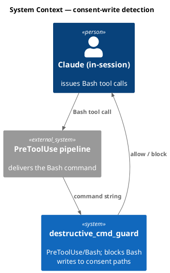
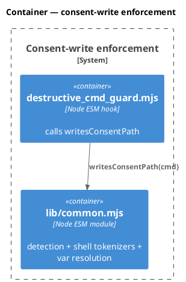
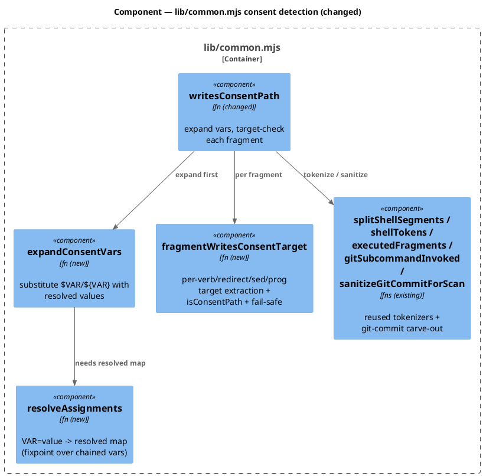
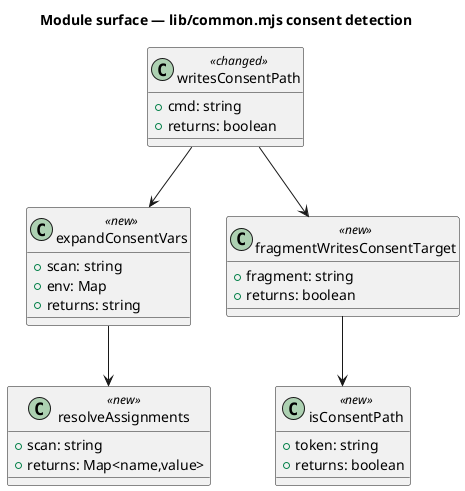
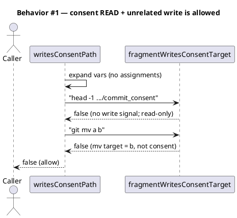
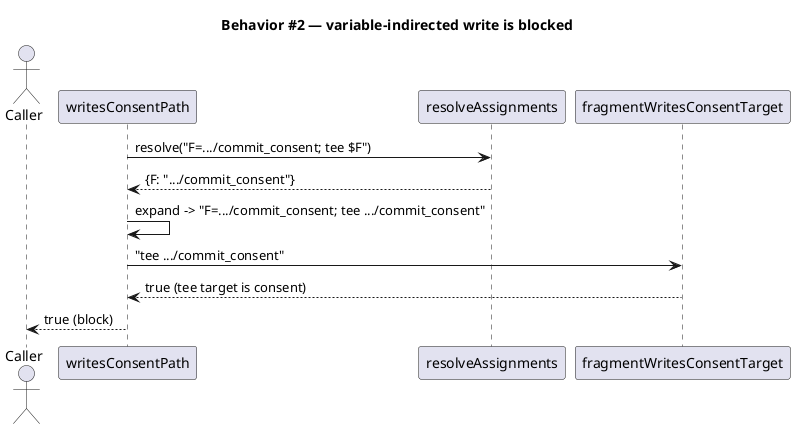
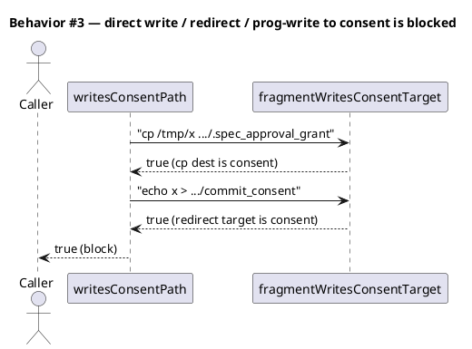
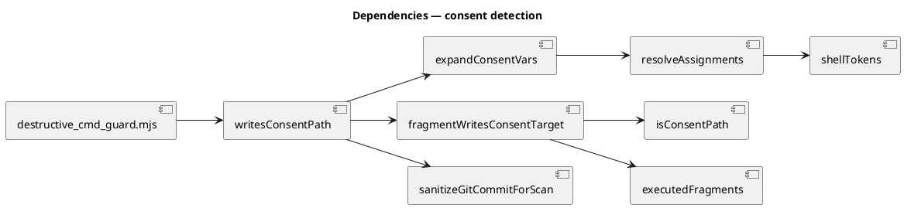

# Spec — anchor consent write-signals to the write's resolved target

## Context

| Input | Path |
|---|---|
| Intake | *(none — `/triage` → spec)* |
| BRD *(if any)* | *(none)* |
| Scout *(if any)* | *(none — single-file change)* |
| Research *(if any)* | *(none — research excepted)* |
| Security (prior finding) | `docs/security/anchor-consent-write-target-2026-06-03.md` — the bypass matrix from the abandoned tdd-quickfix |

## Goal

`writesConsentPath(cmd)` blocks a Bash command iff a **write whose resolved target is a consent path** is present — so it stops false-blocking commands that merely *read* a consent path (e.g. `head .claude/state/commit_consent; git mv a b`), while still blocking every real forge, including variable-indirected ones (`F=.claude/state/commit_consent; tee $F`).

## Non-goals

- Tracing consent paths that enter a variable through `command substitution`, `read`, function parameters, or the process environment. Those carry **no literal consent basename** in the command string, so no literal scanner (the current guard included) can see them; they are outside this guard's threat model and unchanged by this spec.
- Changing the consent basename set, the write-verb set, the git-commit message carve-out (`sanitizeGitCommitForScan` is retained), or any other guard.
- Touching `git_commit_guard.mjs` or any consumer of `writesConsentPath` besides the function itself.

## Design

Diagrams are the contract. Prose is only for what a diagram cannot say.

**Soundness model.** The security property is *"no command that actually writes a consent path is allowed."* The current guard achieves this coarsely (block if a consent basename AND any write-signal both appear anywhere) at the cost of false-positives when the consent reference is a *read* and the write-signal targets something else. This spec replaces "write-signal anywhere" with "write-signal whose **resolved target** is a consent path", computed in three steps:

1. **Resolve assignments** — scan `VAR=value` tokens left-to-right; each `value` is itself var-expanded against the map built so far (so `G=$F` inherits `F`'s value). A variable is *consent-tainted* when its resolved value contains a consent basename.
2. **Expand** — textually replace `$VAR` / `${VAR}` in the (git-commit-sanitized) command with resolved values where known; unknown vars are left literal.
3. **Target-check** — for each executed fragment of the expanded command, extract each write-signal's target(s) and block iff any target is a consent path. Fail-safe: a recognized write-signal whose target cannot be extracted, in a fragment that also carries a consent reference, blocks.

Because expansion turns `tee $F` into `tee .claude/state/commit_consent` before target-checking, variable indirection (single- and multi-level) is caught. Because target-checking ignores consent references that are *read* operands, the false-positives are dropped. Unknown vars (no literal consent basename) are allowed — identical to the current scanner's blind spot, so no real forge that the current guard catches is newly allowed.

### C4 — System context

### C4 — Container

### C4 — Component (changed container only)

### Data model — class diagram

No database; the module's function surface. `<<new>>` / `<<changed>>` marked.

#### Migration DDL

No schema. No data migration.

### Behavior — sequence per AC

### State — core entity *(only if stateful)*

No state machine; all functions are pure of the command string.

### Dependencies — graph

### Contracts

| Kind | Name | Input | Output | Errors | Idempotent |
|---|---|---|---|---|---|
| Fn | `writesConsentPath(cmd)` | `string` | `boolean` (true blocks) | non-string → `false` | yes (pure) |
| Fn | `resolveAssignments(scan)` | `string` | `Map<name,resolvedValue>` | — | yes |
| Fn | `expandConsentVars(scan, env)` | `string, Map` | `string` | — | yes |
| Fn | `fragmentWritesConsentTarget(fragment)` | `string` | `boolean` | unknown target + consent ref → `true` (fail-safe) | yes |
| Fn | `isConsentPath(token)` | `string` | `boolean` | — | yes |

**Per-verb target extraction (the heart of `fragmentWritesConsentTarget`):**

| Signal | Target operand(s) |
|---|---|
| redirect `>`/`>>`/`>\|` | the redirect target token (reuse `CONSENT_REDIRECT_RE` on the expanded text) |
| `tee` | all non-flag operands |
| `cp` / `mv` / `install` | the last non-flag operand (destination) |
| `ln` | the last non-flag operand (link name created) |
| `truncate` | non-flag operands after `-s SIZE` |
| `dd` | the `of=` operand value |
| `sed -i` | trailing file operands |
| prog-write (`writeFileSync`/`appendFileSync`/`createWriteStream`/`open(...,'w'\|'a')`/`open(...,'>')`) | the path literal in the call |

Fail-safe: if a fragment matches a write-signal regex but the verb is unrecognized (no target rule) AND the fragment contains a consent reference, return `true` (block).

### Libraries and versions

No third-party libraries; Node built-ins + existing in-module helpers only.

| Library@version | Purpose | Key APIs | Confirmed via context7 |
|---|---|---|---|
| *(none)* | — | — | n/a |

### Alternatives considered

| Alt | Summary | Rejected because |
|---|---|---|
| A (abandoned quickfix) | Per-fragment co-occurrence: block iff consent-ref + write-signal in the SAME fragment. | Under-blocks variable indirection — the basename lives in the `F=` fragment, the verb in the `tee $F` fragment (HIGH, see prior security report). |
| B | Keep coarse whole-scan; subtract consent refs that are args to read-only commands. | Must preserve redirect targets while stripping read args — fiddly; and doesn't generalize to var indirection. Target-resolution is cleaner and complete. |
| C | Full shell parser / AST. | Over-engineered for a guard; new dependency or hundreds of lines. Token-level resolution + per-verb rules suffice for the threat model. |

## Design calls

*(none)* — no UI files in the write_set.

## Acceptance criteria

The security invariant: **every command that actually writes a consent path BLOCKS; only genuine reads flip to ALLOW.** Each row below is asserted in the test matrix.

| ID | Criterion (given / when / then) | Sequence |
|---|---|---|
| AC-001 | `head -1 .claude/state/commit_consent; git mv a b` → **false** (read + unrelated write) | §Behavior #1 |
| AC-002 | `cat .claude/state/commit_consent && cp x y` → **false** | §Behavior #1 |
| AC-003 | `grep x .claude/state/commit_consent \| tee /tmp/log` → **false** | §Behavior #1 |
| AC-004 | `F=.claude/state/commit_consent; tee $F` → **true** (single-level var) | §Behavior #2 |
| AC-005 | `F=.claude/state/commit_consent; G=$F; tee $G` → **true** (multi-level var) | §Behavior #2 |
| AC-006 | `F=.claude/state/commit_consent; echo x > $F` → **true** (redirect to var) | §Behavior #2 |
| AC-007 | `D=.claude/state; tee $D/commit_consent` → **true** (dir var + literal basename) | §Behavior #2 |
| AC-008 | `tee .claude/state/commit_consent` → **true** (direct) | §Behavior #3 |
| AC-009 | `cp /tmp/x .claude/state/.spec_approval_grant` → **true** (cp dest) | §Behavior #3 |
| AC-010 | `mv /tmp/y .claude/state/.commit_consent_grant` → **true** (mv dest) | §Behavior #3 |
| AC-011 | `echo x > .claude/state/commit_consent` → **true** (redirect) | §Behavior #3 |
| AC-012 | `node -e "require('fs').writeFileSync('.claude/state/push_consent','1')"` → **true** (prog-write) | §Behavior #3 |
| AC-013 | `sed -i s/a/b/ .claude/state/commit_consent` → **true** (sed -i) | §Behavior #3 |
| AC-014 | `dd if=/dev/null of=.claude/state/commit_consent` → **true** (dd of=) | §Behavior #3 |
| AC-015 | `( tee .claude/state/commit_consent )` and `eval "tee .claude/state/commit_consent"` → **true** (subshell / eval peeled by executedFragments) | §Behavior #3 |
| AC-016 | `git commit -m "fix commit_consent via tee"` → **false** (carve-out retained); `git commit -m "$(tee .claude/state/commit_consent)"` → **true** | §Behavior #1 / #3 |
| AC-017 | existing `destructive-consent-write-block`, `destructive-guard-residuals`, `git-commit-guard-tokenize`, `guard-commit-msg-falsepos` suites unchanged | §Behavior #3 |
| AC-018 | `cp .claude/state/commit_consent /tmp/backup` → **true** (read-OUT conservatively blocks: cp's last-arg rule sees a consent SOURCE not dest, but a consent token in a cp invocation is treated as a write per fail-safe — documented conservative over-block, not a forge) | §Behavior #3 |

## Test plan

The exhaustive bypass matrix. `node --test tests/anchor-consent-write-target.test.mjs` (redirect output to a repo-local file; harness /tmp is space-constrained).

| Category | Scenario | Expected | Covers |
|---|---|---|---|
| False-positive → ALLOW | read + unrelated write (`;`, `&&`, `\|`) | false | AC-001..003 |
| Var indirection → BLOCK | single / multi-level / redirect-to-var / dir-var | true | AC-004..007 |
| Direct write → BLOCK | tee / cp / mv / ln / install / truncate | true | AC-008..010 |
| Redirect → BLOCK | `>` / `>>` / `>\|` to consent | true | AC-011 |
| Prog-write → BLOCK | writeFileSync / open(...,'w') / python open | true | AC-012 |
| In-place / dd → BLOCK | `sed -i` / `dd of=` | true | AC-013, AC-014 |
| Wrappers → BLOCK | subshell `( )`, `eval "..."`, `sh -c "..."` around a consent write | true | AC-015 |
| Carve-out | commit message prose vs substitution | false / true | AC-016 |
| Regression | full existing guard suites | unchanged | AC-017 |
| Conservative | read-out `cp consent /tmp` | true (documented over-block) | AC-018 |
| Boundary | null / '' / bare verb / unknown var (`tee $X`, no literal consent) | false, no throw | — |

## Observability

No new runtime signals; `destructive_cmd_guard`'s existing block log line is unchanged and now fires only on genuine consent-target writes.

| Signal | Name | Shape | Purpose |
|---|---|---|---|
| Log | `destructive_cmd_guard` block line | existing `logLine` | audit (unchanged) |

## Rollout

- **Feature flag**: none — a guard correctness fix ships directly.
- **Migration order**: n/a (pure-function change + tests).
- **Canary**: full suite + audit + the bypass matrix is the gate.

## Rollback

- **Kill-switch**: revert the `lib/common.mjs` change (single commit) → returns to the coarse whole-scan guard (sound, over-blocks).
- **Signal to roll back**: any bypass-matrix BLOCK case regresses to ALLOW in CI, or a real consent write is observed passing. Detectable within one test run.

## Archive plan

- Defaults *(automatic)*: spec, spec approval, security report (the prior `anchor-consent-write-target-2026-06-03.md` + the new one this workflow produces).
- Extras: *(none)*

## Open questions

- *(none — the threat-model boundary, §Non-goals, fixes the only ambiguity: paths entering a variable without a literal consent basename are unreachable by any literal scanner and are explicitly out of scope.)*
