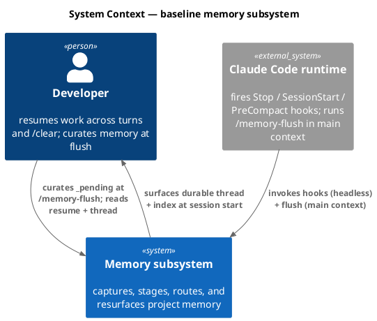
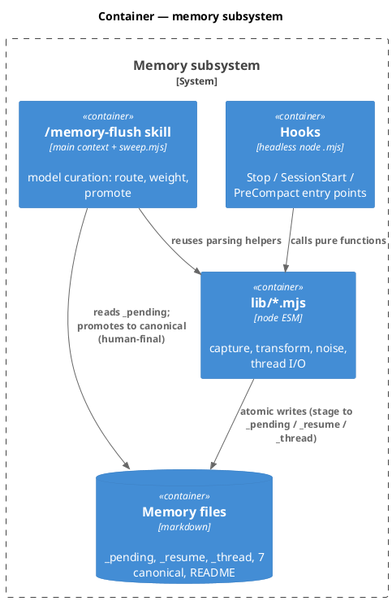
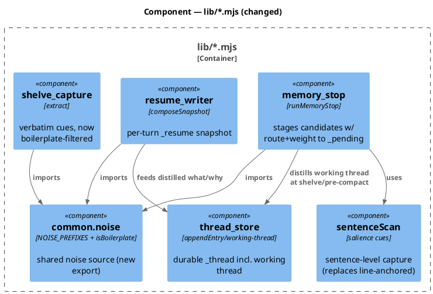
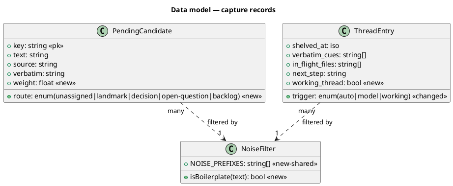
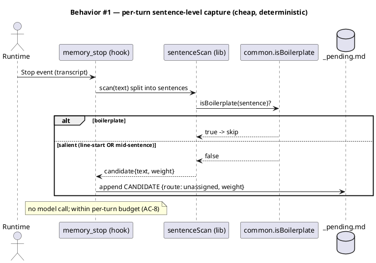
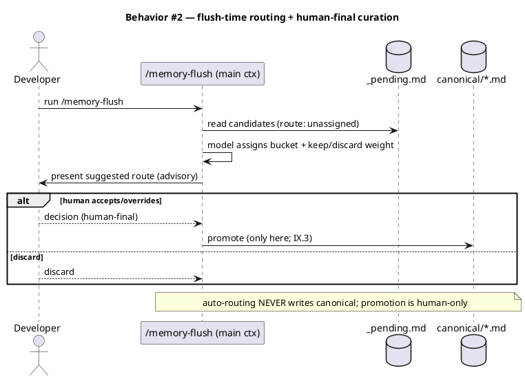
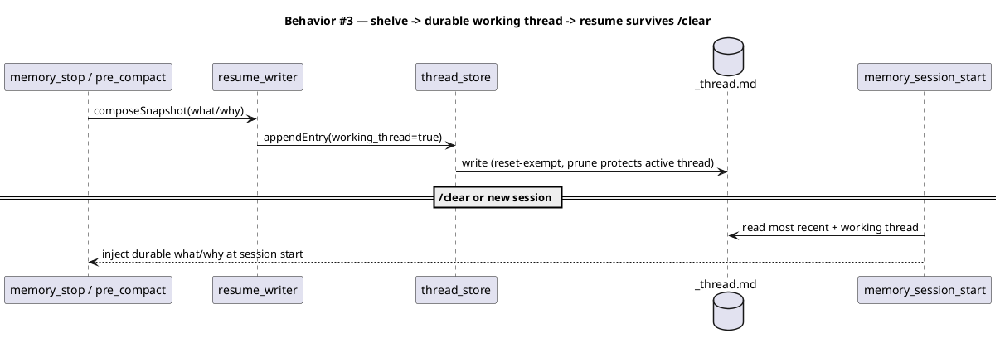
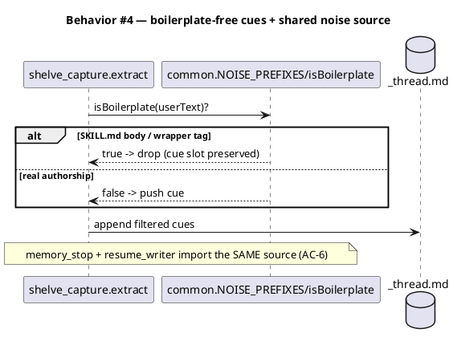
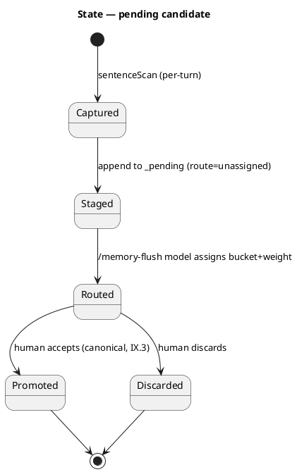
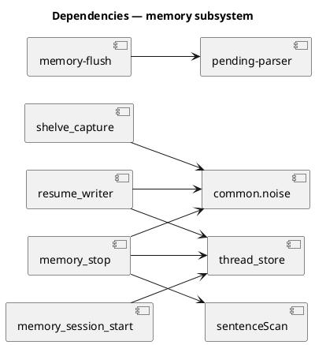

# Spec — LLM-assisted memory capture, routing, durable resume thread, and boilerplate-free cues

## Context

| Input | Path |
|---|---|
| Intake | `docs/intake/llm-assisted-memory-capture-routing.md` |
| BRD *(if any)* | *(none)* |
| Scout *(if any)* | `docs/scout/llm-assisted-memory-capture-routing.md` |
| Research *(if any)* | `docs/research/llm-assisted-memory-capture-routing.md` |
| Brief | `docs/brief/llm-assisted-memory-capture-routing.md` |

## Goal

End-of-turn capture surfaces salient intent regardless of sentence position, stages it to `_pending` with a routing suggestion the model assigns at `/memory-flush`, a durable working thread survives `/clear`, and injected SOP boilerplate never lands as a cue — all without an LLM call in any headless hook and without bypassing human curation.

## Non-goals

- The canonical entry schema (`landmarks`/`decisions`/`landmines`/`conventions`/`pending-questions`/`backlog` shapes) is unchanged. Only capture and routing into `_pending` change.
- This is not the baseline-v1 agent-team / thought-compiler epoch.
- The human-curation gate (Article IX.3) is unchanged: auto-routing stages to `_pending` only; canonical promotion stays human-only via `/memory-flush`.
- No LLM/API call is added to any headless hook (Article IX.3 + the cheap-per-turn budget).

## Decisions

Advisory summary (codesign mode off). Picks adopted from `docs/research/...` decision points:

- **DP1 — capture/routing split (1A), heuristic = Option C (hybrid).** Correction to the original premise: the current matcher (`memory_stop.iterIntentMatches`) splits text into **lines** and runs each trigger with `pat.test(line)` — triggers match **anywhere in a line**, not only line-start — and the trigger set already includes a broad `we (need to|should|must…)`. So the genuine per-turn gaps are (a) **trigger-vocabulary coverage** (intent phrased with no trigger word is missed) and (b) **capture granularity** (a salient sentence in a multi-sentence paragraph is captured as the whole line). **Option C (hybrid):** per-turn capture gets a *modest deterministic* win — **sentence granularity** (capture the salient sentence, not the whole line) + a **small expanded cue set** (decision/approach phrasings: "the (right|cleanest|better) (approach|move|fix) is", "going to", "the fix is", "the plan is") — AND the **`/memory-flush` model pass is the recall backstop**, re-reading the turn/transcript material (not only `_pending`) to recover intent the deterministic pass missed and to assign bucket + weight. **Flush-input sub-decision:** the flush routing/recall pass reads **transcript material + `_pending`** (so it can recover missed intent), not `_pending` alone. No model call in any headless hook (the flush pass is main-context / delegable). **Routing tier (Q5):** the flush-time classification MAY run **Sonnet-tier** (delegable pre-decided recipe per Article II); human final (IX.3). **Routing UX (Q3):** suggested bucket is an **accept/override default**; promotion human-final.
- **DP2 — durable thread (2A via 2C) + `_resume` rework (Q6).** Extend `_thread.md` / `thread_store.mjs` to carry a durable curated "what/why" working thread sourced by distilling the resume snapshot at shelve/pre-compact/stop. **The active working-thread entry is pinned — exempt from the 20-section prune (Q2)** so a busy session cannot evict it. `_resume.md` is **reworked (Q6)**: it keeps the cheap per-turn snapshot for in-session continuity, but the durable "what/why" continuity now lives in the pinned working-thread entry (so it survives `/clear`); `resume_writer` gains the distill-to-thread step and `memory_session_start` surfaces the pinned working thread on resume.
- **DP3 — boilerplate filter (3A) + shared noise list.** Filter boilerplate at capture in `shelve_capture.extract` (cue caps make render-time filtering lossy); lift `NOISE_PREFIXES` (+ a `^Base directory for this skill:` marker) into `lib/common.mjs` as the single source imported by `memory_stop`, `resume_writer`, `shelve_capture`.
- **DP4 — measurement (Q1).** A labeled fixture corpus with recall / zero-known-boilerplate-noise / routing-accuracy metrics, encoded as ACs. **Targets (Q1): mid-sentence recall floor = 80%; known-boilerplate noise rate = 0** (deterministic, so 0 is achievable); general `_pending` false-positive volume is reported (advisory), not gated, in the first iteration.
- **Build scope (Q4, revised 2026-06-03):** **only Tier 1 ships in this workflow** — the deterministic shared-noise + capture-time boilerplate filter (the 91a3 win), which has no heuristic ambiguity. **Tier 2** (sentence-granularity + expanded cue set + `_pending` route/weight + fixture corpus) and **Tier 3** (flush-time routing/weighting reading transcript+`_pending`, durable working thread, `_resume` rework) are **designed here as Option C and split into their own follow-up workflows** so the capture-more heuristic is built deliberately, not improvised in a worker. Solo `/tdd`. The Tier 2/Tier 3 ACs (AC-001/002/004/007/008/011/012/013/014) are carried forward as the follow-up scope; this workflow satisfies AC-005, AC-006, AC-009.

## Design

Diagrams are the contract. Prose only for what a diagram cannot say.

### C4 — System context



### C4 — Container



### C4 — Component (changed container: lib/*.mjs)



### Data model — class diagram

No relational DB. These are the on-disk markdown record shapes the change touches.



#### Migration DDL

No SQL. The "migration" is additive and backward-compatible:

```text
-- forward: _pending CANDIDATE blocks MAY carry optional `route:` + `weight:` fields.
--          Absent fields default to route=unassigned, weight=null (old blocks still parse).
-- forward: NOISE_PREFIXES moves to lib/common.mjs; memory_stop/resume_writer/shelve_capture import it.
-- forward: _thread entries MAY carry working_thread=true; readers default false when absent.
-- reverse: ignore route/weight/working_thread fields; importers fall back to local literals.
-- README.md (.claude/memory/) documents the new optional fields (schema doc, not entry schema change).
```

### Behavior — sequence per AC









### State — candidate lifecycle



### Dependencies — graph



### Contracts

| Kind | Name | Input | Output | Errors | Idempotent |
|---|---|---|---|---|---|
| Function | `sentenceScan(text)` | transcript text | `candidate[]` `{text, weight}` | none (returns `[]`) | yes (pure) |
| Function | `isBoilerplate(text)` | string | bool | none | yes (pure) |
| Const | `NOISE_PREFIXES` (common.mjs) | — | `string[]` | — | — |
| File | `_pending` CANDIDATE block | — | adds optional `route:`/`weight:` | parser tolerates absence | append-dedup |
| File | `_thread` entry | — | adds optional `working_thread` | reader defaults false | append + prune |

### Libraries and versions

No third-party library is added. Only Node stdlib (`node:fs`, `node:path`, `node:test`). Option 1C (Anthropic SDK per-turn) was rejected (see Alternatives); no context7 lookup required because no external API is used.

| Library@version | Purpose | Key APIs | Confirmed via context7 |
|---|---|---|---|
| *(none added)* | — | — | n/a |

### Alternatives considered

| Alt | Summary | Rejected because |
|---|---|---|
| DP1-C | per-turn Haiku API call in the hook | violates cheap-per-turn budget; network/key dep in headless hooks; offline-fragile |
| DP1-B | async/batched model queue | new stateful queue + out-of-band trigger with no home in the hook model; YAGNI vs 1A |
| DP2-B | new sibling durable file | duplicates `_thread.md` durability/prune machinery |
| DP3-B | filter boilerplate at render | cue caps (`MAX_CUES=8`) already displaced at capture; render-time is lossy |

## Design calls

- *(none)* — write_set is hooks/lib + skills/memory-flush + tests + memory README; no UI surface (no intersection with `tdd.ui_globs`).

## Acceptance criteria

| ID | Criterion (given / when / then) | Upstream AC | Sequence |
|---|---|---|---|
| AC-001 | given salient intent stated mid-sentence, when Stop capture runs, then a candidate is emitted to `_pending` | intake AC-1 | §Behavior #1 |
| AC-002 | given a staged candidate, when written, then it carries `route` (default `unassigned`) + `weight` and lands only in `_pending` | intake AC-2 | §Behavior #1 |
| AC-003 | given any auto-capture/auto-routing, when it runs, then no canonical file is modified without `/memory-flush` | intake AC-3 | §Behavior #2 |
| AC-004 | given work then `/clear`, when a new session starts, then the durable "what/why" working thread is available | intake AC-4 | §Behavior #3 |
| AC-005 | given a transcript with a SKILL.md body + wrapper tags, when cues are extracted, then none appear as cues | intake AC-5 | §Behavior #4 |
| AC-006 | given noise filtering, when memory_stop/resume_writer/shelve_capture filter, then all three import one shared `common.mjs` source | intake AC-6 | §Behavior #4 |
| AC-007 | given mixed decision text + SOP boilerplate, when `/memory-flush` weights candidates, then decision text is favored | intake AC-7 | §Behavior #2 |
| AC-008 | given Stop capture, when it runs, then no model/API call is invoked synchronously (per-turn budget) | intake AC-8 | §Behavior #1 |
| AC-009 | given the existing memory suite, when this lands, then it still passes (schema + curation contract unchanged) | intake AC-9 | §Behavior #2 |
| AC-010 | given a user-instruction/feedback candidate, when captured + routed, then its verbatim is preserved | intake AC-10 | §Behavior #1 |
| AC-011 | given the labeled fixture corpus, when the scanner runs, then mid-sentence recall ≥ 80% and known-boilerplate noise rate = 0 | DP4 | §Behavior #1 |
| AC-012 | given the fixture corpus bucket labels, when flush routing runs, then routing accuracy is measured and reported | DP4 | §Behavior #2 |
| AC-013 | given a routed candidate at `/memory-flush`, when presented, then the suggested bucket is an accept/override default and promotion remains human-final | Q3 | §Behavior #2 |
| AC-014 | given the resume rework, when a new session starts after `/clear`, then the pinned working-thread entry is surfaced and was not evicted by the 20-section prune | Q2, Q6 | §Behavior #3 |

## Test plan

| Category | Scenario | Expected | Covers |
|---|---|---|---|
| Golden path | mid-sentence intent ("…we need to fix…") | captured to `_pending` w/ route=unassigned | AC-001, AC-002 |
| Golden path | `/memory-flush` over unassigned candidates | model assigns bucket; human-final promote | AC-003, AC-007 |
| Golden path | shelve → working thread → simulate `/clear` → session start | working thread present | AC-004 |
| Input boundary | SKILL.md body + `<system-reminder>`/`<command-name>`/`<local-command-*>` | zero cues captured | AC-005 |
| Contract violation | attempt canonical write outside flush | no canonical mutation (IX.3) | AC-003 |
| Regression trap | existing memory suite (dedup/recall/session-start/thread/flush) | unchanged | AC-009 |
| Regression trap | old `_pending` block without route/weight | still parses | AC-002 |
| Regression trap | per-turn capture invokes no network/model | none invoked | AC-008 |
| Failure mode | verbatim preservation through capture+route | verbatim intact | AC-010 |
| Metric | fixture corpus recall (line-start + mid-sentence) + noise rate | mid-sentence recall ≥ 80%; known-boilerplate noise = 0 | AC-011 |
| Metric | fixture corpus routing accuracy | reported | AC-012 |
| Golden path | flush presents suggested bucket; press-through accepts, override changes it | human-final; default = suggestion | AC-013 |
| Concurrency / ordering | busy session appends > 20 thread sections while a working thread is active | working thread NOT evicted (pinned) | AC-014 |

## Observability

| Signal | Name | Shape | Purpose |
|---|---|---|---|
| Log | `memory_stop.capture` | fields: `candidates`, `skipped_boilerplate`, `ms` | confirm cheap per-turn + capture volume |
| Log | `shelve.filtered` | fields: `cues_kept`, `boilerplate_dropped` | confirm AC-5 noise drop |
| Metric (test-only) | `capture.recall` | ratio over fixture corpus | AC-011 gate in CI |

## Rollout

Build-scope phasing (the `/approve-spec` reassessment point — the user asked to decide what builds first):

- **Tier 1 (smallest shippable slice)**: DP3 — shared `NOISE_PREFIXES`/`isBoilerplate` in `common.mjs` + capture-time filter in `shelve_capture` (+ converge `resume_writer`/`memory_stop` imports). Deterministic, ~low risk; satisfies AC-005, AC-006. This is the existing 91a3 Tier-1.
- **Tier 2**: DP1 sentence-level scanner + `_pending` `route`/`weight` fields (AC-001, AC-002, AC-008) + the fixture corpus (AC-011).
- **Tier 3 (larger)**: flush-time routing + weighting at `/memory-flush` (AC-007, AC-012) and the durable working thread in `thread_store` (AC-004).
- **Feature flag**: none required — changes are additive and backward-compatible (old blocks/entries parse). Behavior is gated by code presence, not a runtime flag.
- **Migration order**: ship shared noise list → import sites → capture filter (Tier 1); then scanner + fields (Tier 2); then flush routing + thread (Tier 3). Each tier is independently green.

## Rollback

- **Kill-switch**: revert the tier's commit. Because all changes are additive/backward-compatible, reverting any tier leaves prior tiers and old `_pending`/`_thread` files valid.
- **Signal to roll back**: the memory suite goes red, OR `_pending` candidates stop appearing (capture regression), OR known-boilerplate noise rate > 0 on the fixture corpus. Detect via the serial memory suite (`node --test --test-concurrency=1 tests/memory-*.test.mjs tests/thread-*.test.mjs`) in CI.

## Archive plan

- Defaults *(automatic)*: intake, scout, research, brief, spec, spec-rendered/, spec approval, security reports.
- Extras *(list any non-default files)*:
  - *(none)*

## Open questions

All gate-A open questions were resolved with the reviewer (2026-06-03):

- **Recall floor / noise (Q1)** — RESOLVED: mid-sentence recall ≥ 80%; known-boilerplate noise = 0; general `_pending` false-positives reported (advisory) in iteration 1. → AC-011.
- **`_thread.md` working-thread vs shelve (Q2)** — RESOLVED: one trail; the active working-thread entry is pinned/exempt from the 20-section prune. → AC-014.
- **Flush routing UX (Q3)** — RESOLVED: accept/override default; promotion human-final (IX.3). → AC-013.
- **Build scope (Q4)** — RESOLVED: build all three tiers in this workflow; solo `/tdd`.
- **Routing model tier (Q5)** — RESOLVED: flush-time classification may run Sonnet-tier (delegable pre-decided recipe per Article II); human final.
- **`_resume.md` (Q6)** — RESOLVED: rework `_resume` — keep the cheap per-turn snapshot, move durable "what/why" continuity into the pinned working-thread entry.

None remain blocking; ready for `/approve-spec`.
