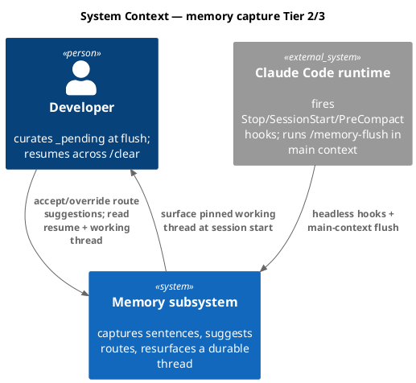
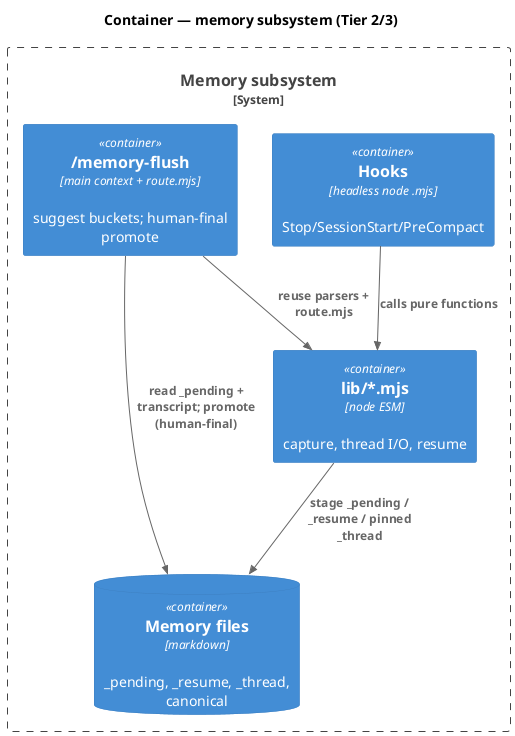
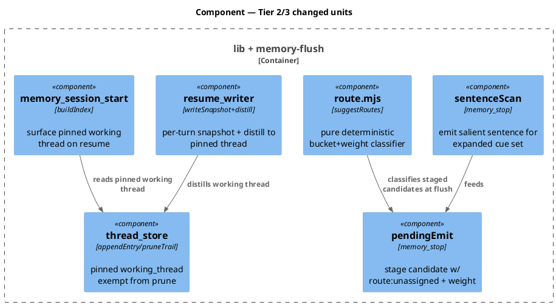
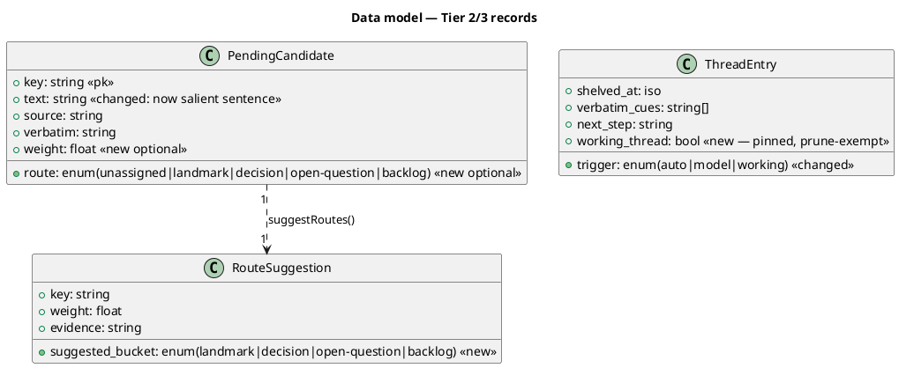
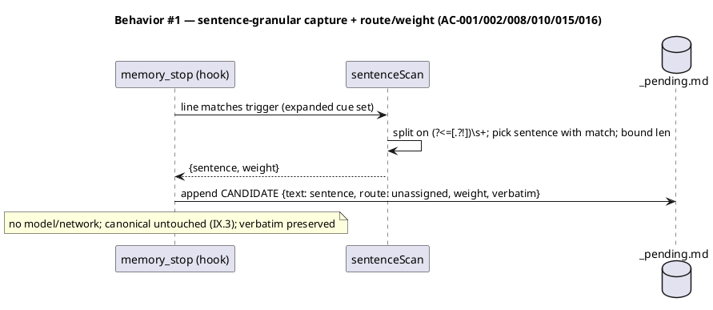
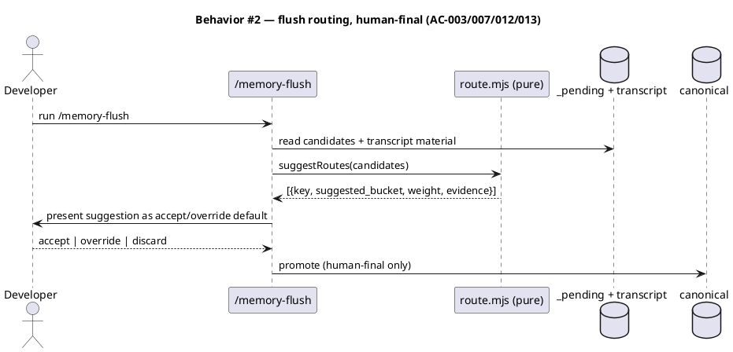
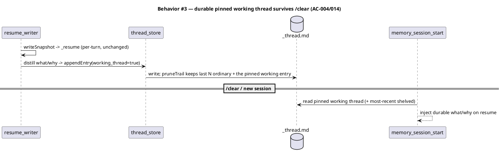
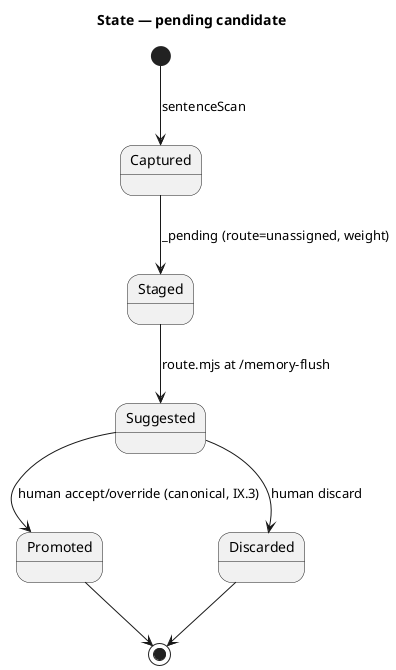
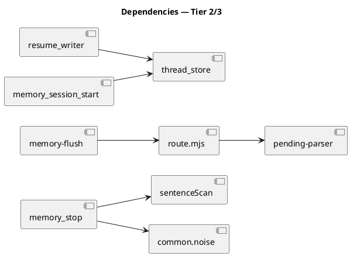

# Spec — Memory capture Tier 2 (sentence capture + route/weight) and Tier 3 (flush routing + durable working thread + resume rework)

## Context

| Input | Path |
|---|---|
| Intake | *(excepted — continuation of an approved epoch)* |
| BRD *(if any)* | *(none)* |
| Scout *(if any)* | `docs/archive/2026-06-03/llm-assisted-memory-capture-routing/scout.md` |
| Research *(if any)* | `docs/archive/2026-06-03/llm-assisted-memory-capture-routing/research.md` |
| Design (approved, archived) | `docs/archive/2026-06-03/llm-assisted-memory-capture-routing/spec.md` (Option C) |

Tier 1 of this epoch shipped in commit `8e6fecf` (shared `NOISE_PREFIXES`/`isBoilerplate`, capture-time boilerplate filter). This spec builds Tier 2 + Tier 3 against the same approved Option C design, sharpened into concrete contracts. Closes backlog `llm-assisted-memory-capture-routing-cf4a`.

## Goal

End-of-turn capture emits the salient *sentence* (not the whole line) for a broadened deterministic cue set and stages it to `_pending` with optional `route`/`weight` fields; `/memory-flush` gets a pure deterministic `route.mjs` classifier whose bucket suggestions the human accepts or overrides; and a durable pinned working thread (sourced by reworking `_resume`) survives `/clear` — with no model or network call in any headless hook.

## Non-goals

- Canonical entry schema unchanged (only `_pending` candidate fields + `_thread` entry shape gain optional additive fields).
- No LLM/API/network call in any headless hook. `route.mjs` is a pure classifier; the optional Sonnet-tier pass is a main-context `/memory-flush` delegation, not in a hook.
- Human-curation gate (Article IX.3) unchanged: routing only suggests; promotion to canonical stays human-only via `/memory-flush`.
- Not the baseline-v1 agent-team epoch. Tier 1 noise filter is already shipped and is not re-touched here.

## Decisions

Sharpened contracts over the archived Option C design:

- **Sentence-granularity capture (Tier 2).** `memory_stop` emits the matching *sentence* (line split on `/(?<=[.?!])\s+/`, the sentence containing the trigger match), bounded by `MAX_INTENT_TEXT_LEN`, instead of the whole line.
- **Expanded cue set (Tier 2).** Additive decision/approach phrasings appended to `INTENT_TRIGGERS`: `the (right|cleanest|cleaner|better|simplest) (approach|move|fix|option) is`, `(i'm|i am|we're|we are) going to`, `the (fix|plan|approach) is`, `let'?s (go with|do)`, `decided to`. No existing trigger removed.
- **`_pending` route/weight (Tier 2).** Emitted intent candidates carry optional `- route: unassigned` and `- weight: <0..1>` lines. Old blocks without them still parse (`splitEntries` tolerant). `weight` is a deterministic trigger-class score.
- **`route.mjs` (Tier 3).** Pure module: `suggestRoutes(candidates) -> [{key, suggested_bucket, weight, evidence}]`, buckets `{landmark, decision, open-question, backlog}` by deterministic rules. Writes nothing. Accept/override default at `/memory-flush`; human-final.
- **Durable pinned working thread (Tier 3).** `thread_store` recognizes `entry.working_thread === true`; `pruneTrail` retains the most-recent working-thread entry in addition to the last N ordinary sections.
- **`_resume` rework (Tier 3).** `resume_writer` keeps the per-turn `_resume` snapshot AND distills the durable what/why into the pinned working thread at stop/pre-compact; `memory_session_start` surfaces it on resume.

## Design

Diagrams are the contract. Prose only for what a diagram cannot say.

### C4 — System context



### C4 — Container



### C4 — Component (changed units)



### Data model — class diagram



#### Migration DDL

```text
-- forward (additive, backward-compatible — no SQL DB):
--   _pending CANDIDATE blocks MAY carry `route:` + `weight:`; absent => unassigned/null.
--   _thread entries MAY carry working_thread=true; absent => false (ordinary section).
--   route.mjs is a new shipped helper under .claude/skills/memory-flush/.
-- reverse: ignore route/weight/working_thread; readers default; remove route.mjs.
```

### Behavior — sequence per AC







### State — pending candidate lifecycle



### Dependencies — graph



### Contracts

| Kind | Name | Input | Output | Errors | Idempotent |
|---|---|---|---|---|---|
| Function | `suggestRoutes(candidates)` | `[{key,text,...}]` | `[{key,suggested_bucket,weight,evidence}]` | none (returns `[]`) | yes (pure) |
| Function | `sentenceScan(line, patterns)` | line + triggers | salient sentence or `null` | none | yes (pure) |
| File | `_pending` CANDIDATE | — | + optional `route:`/`weight:` | parser tolerates absence | append-dedup |
| File | `_thread` entry | — | + optional `working_thread` | reader defaults false | append + prune (pin-aware) |
| Function | `readWorkingThread({memDir})` | memDir | pinned entry or `null` | none | yes |

### Libraries and versions

No third-party library added. Node stdlib only (`node:fs`, `node:path`, `node:crypto`, `node:test`). No `@anthropic-ai/sdk` / network (the Sonnet-tier flush pass is a main-context delegation, not a module dependency).

| Library@version | Purpose | Key APIs | Confirmed via context7 |
|---|---|---|---|
| *(none added)* | — | — | n/a |

### Alternatives considered

| Alt | Summary | Rejected because |
|---|---|---|
| route.mjs calls a model | per-candidate LLM bucketing in the helper | violates no-network-in-helper; flush delegation (main context) covers the semantic case |
| New durable file for working thread | separate artifact | duplicates `_thread.md` durability/prune; pin reuses it |
| Whole-line capture kept | emit the whole matched line | loses the granularity win; multi-sentence lines bloat `_pending` |

## Design calls

- *(none)* — no UI surface (write_set does not intersect `tdd.ui_globs`).

## Acceptance criteria

| ID | Criterion (given / when / then) | Upstream AC | Sequence |
|---|---|---|---|
| AC-001 | given salient intent mid-line, when capture runs, then the emitted candidate text is the salient SENTENCE (not the whole line) | epoch AC-001 | §Behavior #1 |
| AC-002 | given a staged candidate, when written, then it carries `route: unassigned` + `weight` and only `_pending` is written | epoch AC-002 | §Behavior #1 |
| AC-003 | given routing at flush, when it runs, then no canonical file is written without human action | epoch AC-003 | §Behavior #2 |
| AC-004 | given work then `/clear`, when a new session starts, then the pinned working thread is surfaced | epoch AC-004 | §Behavior #3 |
| AC-007 | given decision text vs boilerplate, when `suggestRoutes` weights them, then decision text scores higher | epoch AC-007 | §Behavior #2 |
| AC-008 | given any headless hook + route.mjs, when run, then no model/network call occurs | epoch AC-008 | §Behavior #1 |
| AC-010 | given a user-instruction candidate, when captured, then its verbatim is preserved | epoch AC-010 | §Behavior #1 |
| AC-011 | given the fixture corpus, when the scanner runs, then mid-sentence recall ≥ 80% and known-boilerplate noise = 0 | epoch AC-011 | §Behavior #1 |
| AC-012 | given the corpus bucket labels, when `suggestRoutes` runs, then routing accuracy is computed and reported | epoch AC-012 | §Behavior #2 |
| AC-013 | given a routed candidate, when presented at flush, then the suggested bucket is an accept/override default and promotion is human-final | epoch AC-013 | §Behavior #2 |
| AC-014 | given >20 sections with an active working thread, when pruned, then the pinned working entry is not evicted | epoch AC-014 | §Behavior #3 |
| AC-015 | given an expanded-cue phrasing with no legacy trigger word, when capture runs, then it is captured | new (Tier 2 cue set) | §Behavior #1 |
| AC-016 | given an old `_pending` block lacking route/weight, when parsed, then it still parses (backward-compat) | new (regression) | §Behavior #1 |

## Test plan

| Category | Scenario | Expected | Covers |
|---|---|---|---|
| Golden path | mid-line intent in a multi-sentence line | only the salient sentence captured | AC-001 |
| Golden path | candidate staged | block has route:unassigned + weight; canonical untouched | AC-002, AC-003 |
| Golden path | expanded-cue phrase ("the cleanest approach is to …") | captured | AC-015 |
| Golden path | suggestRoutes over labeled candidates | bucket+weight per candidate; nothing written | AC-007, AC-013 |
| Golden path | shelve→working thread→simulate /clear→session start | pinned thread surfaced | AC-004 |
| Concurrency | >20 sections + active working thread | working thread not evicted | AC-014 |
| Metric | fixture corpus recall + noise | mid-sentence recall ≥ 80%; boilerplate noise = 0 | AC-011 |
| Metric | fixture corpus routing accuracy | computed + reported | AC-012 |
| Failure mode | verbatim through capture | verbatim intact | AC-010 |
| Contract | route.mjs / hooks run offline | no network/model call | AC-008 |
| Regression | old _pending block w/o route/weight | parses | AC-016 |
| Regression | existing memory/thread/flush suite | unchanged | epoch AC-009 |

## Observability

| Signal | Name | Shape | Purpose |
|---|---|---|---|
| Log | `memory_stop.capture` | `{candidates, sentence_emitted, ms}` | confirm cheap per-turn + granularity |
| Metric (test) | `capture.recall` | ratio over corpus | AC-011 CI gate |
| Metric (test) | `route.accuracy` | ratio over labeled buckets | AC-012 |

## Rollout

- Additive + backward-compatible; no feature flag. Behavior gated by code presence.
- Order: Tier 2 (sentence scan + cue set + route/weight + corpus) → Tier 3 (route.mjs + thread pin + resume distill + session-start surface). Each independently green.
- This workflow ships both tiers (Q4 from the prior workflow, revised: build all remaining tiers now).

## Rollback

- **Kill-switch**: revert this commit; all changes are additive so old `_pending`/`_thread` files and Tier 1 stay valid.
- **Signal to roll back**: memory/thread/flush suite goes red, OR capture stops emitting, OR corpus recall < 80% / boilerplate noise > 0. Detect via serial memory suite `node --test --test-concurrency=1 tests/memory-*.test.mjs tests/thread-*.test.mjs`.

## Archive plan

- Defaults *(automatic)*: spec, spec-rendered/, spec approval, security reports.
- Extras *(list any non-default files)*:
  - *(none)*

## Open questions

- None blocking. The capture-more heuristic (cue set + sentence pick) and the deterministic bucketing rules are concrete here; the recall floor (80%) and zero-boilerplate-noise targets were settled at the prior gate. Routing's semantic backstop (Sonnet-tier) remains a `/memory-flush` main-context concern, out of the helper's pure scope.
