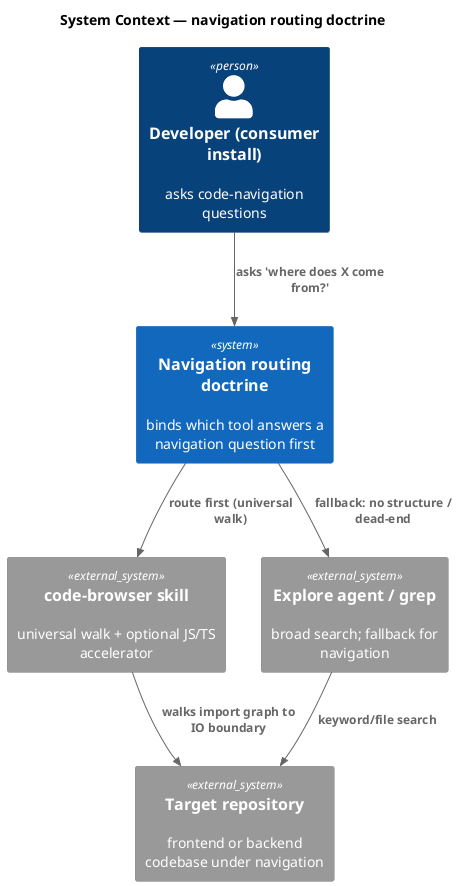
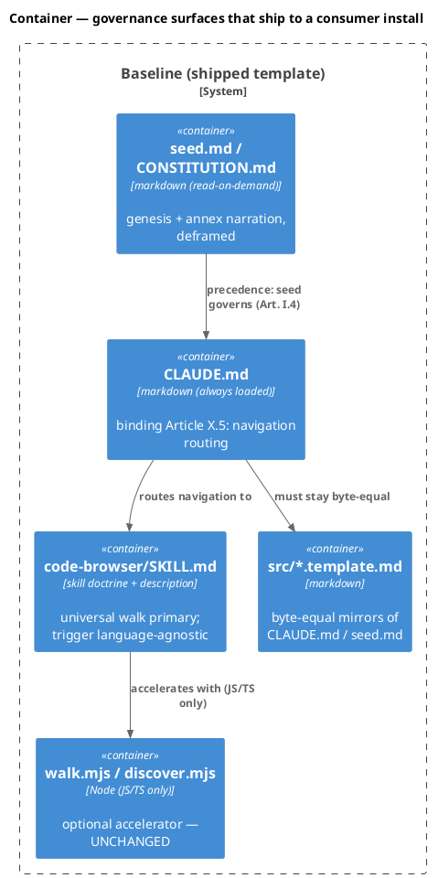
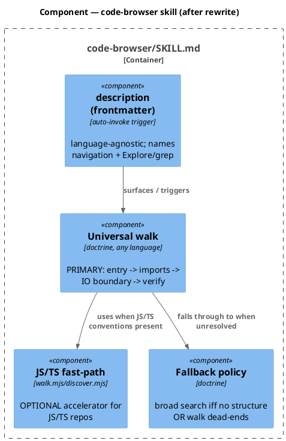
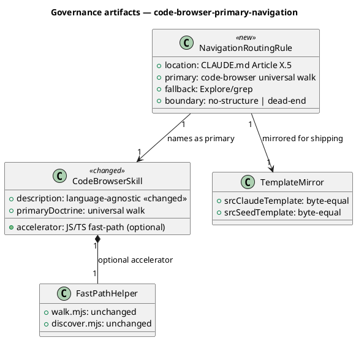
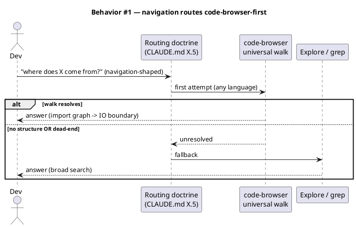
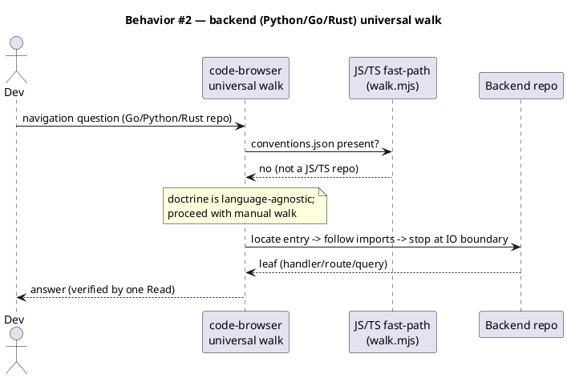
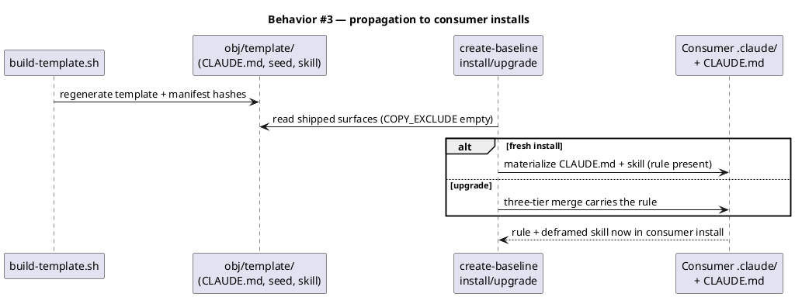
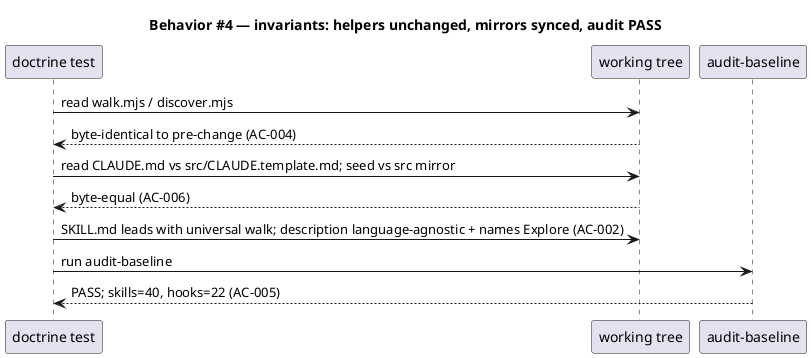
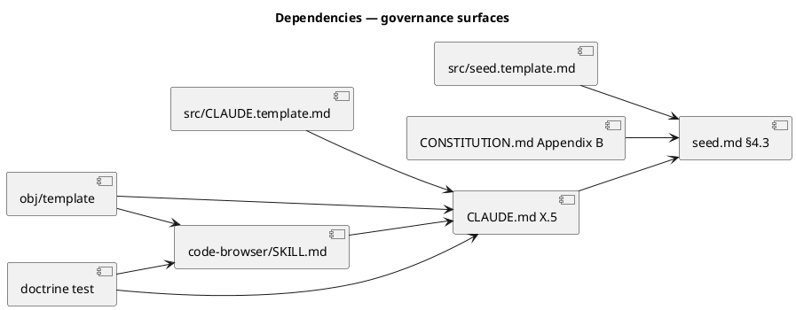

# Spec — code-browser as the primary navigation path (doctrine relocation + deframe)

## Context

| Input | Path |
|---|---|
| Intake | `docs/intake/code-browser-primary-navigation.md` |
| BRD *(if any)* | *(none)* |
| Scout *(if any)* | `docs/scout/code-browser-primary-navigation.md` |
| Research *(if any)* | `docs/research/code-browser-primary-navigation.md` |
| Brief | `docs/brief/code-browser-primary-navigation.md` |

## Goal

For code-navigation questions in any repository, the always-loaded constitution binds code-browser's language-agnostic universal walk as the first attempt, with Explore/grep as fallback only on no-resolvable-structure or a dead-ended walk — and this rule, plus a deframed (language-agnostic) skill, ships to consumer installs.

## Non-goals

- Building per-language fast-path adapters (Python/Go/Rust) — deferred to follow-on workflows.
- Changing `walk.mjs` / `discover.mjs` (the JS/TS accelerator stays byte-identical).
- Removing the skill or changing the 40-skill / 22-hook governance counts.
- Adding a hook (the chosen mechanism is research Candidate A — prose/doctrine in the binding layer; no new matcher surface).

## Design

Diagrams are the contract. This is a governance/doctrine change: **no database, no HTTP API, no deployable runtime container.** The C4/class diagrams therefore model the *governance-artifact system* (the rule and the skill and how they reach a consumer), and the sequences model the *navigation decision flow* the rule produces. The "migration DDL" block is explicitly empty — there is no schema.

**Enabling change (reviewer decision).** `CLAUDE.md` is at 39,367 / 40,000 chars (633 free) — too tight to seat a new Article, and any future amendment hits the same wall. This spec therefore includes a **binding-preserving compression** of `CLAUDE.md`: tighten redundant/verbose prose only, with **no change, weakening, or removal** of any rule in Articles I–XI or the audit-checked citations (§16 in seed-mirrored config, §17, the Article XI citation). The byte-equal mirror `src/CLAUDE.template.md` is synced in the same change. Target: ≥ 1,500 chars of headroom after Article X.5 lands (CLAUDE.md ≤ ~38,500 chars), giving durable room for future amendments.

**Carve-out preservation (reviewer decision).** The SKILL.md rewrite makes code-browser primary for *navigation-shaped* questions only. The existing grep carve-outs stay explicit and intact: **pure full-text search** ("find every file containing string X") and **direct type/util definition lookups** remain grep's domain — they are not navigation questions, so the "primary when possible" doctrine does not route them through a walk.

### C4 — System context



### C4 — Container

The governing surfaces as deployable units (all ship to consumers; scout: `COPY_EXCLUDE` empty).



### C4 — Component (changed containers only)

The `code-browser` skill internals after the rewrite. Only this container's internals change.



### Data model — class diagram

No persistent entities — this models the governance-artifact relationships. `<<new>>` = added by this spec; `<<changed>>` = reframed.



#### Migration DDL

```sql
-- No schema change. This is a governance/doctrine spec; there is no database.
-- forward:  (none)
-- reverse:  (none)
```

### Behavior — sequence per AC

#### §Behavior #1 — navigation routes to the universal walk first



#### §Behavior #2 — backend repo (no JS/TS fast path) still navigates via the doctrine



#### §Behavior #3 — the rule reaches a consumer install



#### §Behavior #4 — governance invariants hold (verification flow)



### State — core entity *(only if stateful)*

Omitted — the routing doctrine has no non-trivial state machine; navigation routing is a stateless per-question decision.

### Dependencies — graph



Edge `A --> B` = "A depends on / must agree with B". Acyclic: seed.md is the precedence root (Article I.4); everything else conforms to it.

### Contracts

No HTTP/CLI/event contracts change. The "contract" is the documented routing rule and the skill description trigger.

| Kind | Name | Input | Output | Errors | Idempotent |
|---|---|---|---|---|---|
| Doctrine | `CLAUDE.md Article X.5` | a navigation-shaped question | code-browser-first routing decision, with fallback boundary | n/a | yes (stateless) |
| Skill trigger | `code-browser description:` | navigation question (any language) | skill auto-surfaced | n/a | yes |

### Libraries and versions

No third-party library is touched (internal governance + skill markdown + an internal test). **context7 N/A** — nothing to verify against an external API.

| Library@version | Purpose | Key APIs | Confirmed via context7 |
|---|---|---|---|
| *(none)* | — | — | n/a (no third-party API) |

### Alternatives considered

| Alt | Summary | Rejected because |
|---|---|---|
| B (research) | A + advisory navigation nudge folded into a hook | No existing hook matches Task/Grep → would be a de-facto 23rd hook; breaches the 22-cap for uncertain benefit. Deferred unless A proves insufficient. |
| C (research) | Description-only trigger change | Subset of A; leaves the binding rule in the read-on-demand layer where it already failed to bind. Insufficient. |

## Design calls

This spec's write_set has no UI files (it touches governance markdown, a SKILL.md, and a test). No design surface.

- *(none)*

## Acceptance criteria

| ID | Criterion (given / when / then) | Upstream AC | Sequence |
|---|---|---|---|
| AC-001 | Given a navigation-shaped question in any repo, when routing is decided, then `CLAUDE.md` (Article X.5) binds code-browser's universal walk as the first attempt and names broad search (Explore/grep) as fallback only on no-resolvable-structure or a dead-ended walk. | intake AC-1 | §Behavior #1 |
| AC-002 | Given `code-browser/SKILL.md`, when read, then the language-agnostic universal walk is presented as the primary path, the JS/TS `walk.mjs`/`discover.mjs` are framed as an optional accelerator, and the `description:` is language-agnostic and names Explore alongside grep. | intake AC-2 | §Behavior #1, §Behavior #2 |
| AC-003 | Given the shipped template, when a consumer installs/upgrades, then the navigation-routing rule and deframed skill are present in the consumer's `CLAUDE.md` + `.claude/skills/code-browser/` (not confined to this repo's working copy). | intake AC-3 | §Behavior #3 |
| AC-004 | Given the JS/TS fast path, when this workflow completes, then `walk.mjs` and `discover.mjs` are byte-identical to their pre-change content. | intake AC-4 | §Behavior #4 |
| AC-005 | Given the governance counts, when `audit-baseline` runs, then it exits PASS, skill count is 40, and hook count is 22. | intake AC-5 | §Behavior #4 |
| AC-006 | Given the constitution change, when the tree is inspected, then `docs/init/seed.md` carries the §4.3 deframe **and** `src/seed.template.md` carries the same deframe (both updated in lockstep — NOT byte-equal overall, since §16 diverges by design), and `CLAUDE.md` carries Article X.5 and is byte-equal to `src/CLAUDE.template.md` (audit-enforced). | intake AC-6 | §Behavior #4 |
| AC-007 | Given the char-cap pressure, when Article X.5 is added, then `CLAUDE.md` is compressed binding-preservingly (every Article I–XI rule and the §16/§17/Article-XI citations intact, `src/CLAUDE.template.md` byte-equal) such that `CLAUDE.md` ≤ 38,500 chars (≥ 1,500 headroom) and `audit-baseline` PASSes. | new (reviewer) | §Behavior #4 |
| AC-008 | Given the SKILL.md rewrite, when read, then the grep carve-outs for pure full-text search and direct type/util definition lookups are preserved as explicit non-navigation cases (code-browser-first applies to navigation-shaped questions only). | new (reviewer) | §Behavior #1 |
| AC-009 | Given baseline `.mjs` files as the navigation eval corpus, when the fixture is checked, then a checked-in fixture pairs navigation questions with expected leaf answers (file + symbol) and a fixture-validity test asserts each expected answer resolves to a real file+symbol. Evidence + language-agnostic-walk demonstration on plain `.mjs` (which `walk.mjs` does not handle); NOT a gate on model navigation behavior. | new (reviewer) | §Behavior #2 |

## Test plan

A `tests/code-browser-primary-navigation.test.mjs` asserts the artifact-level invariants (deterministic). The behavioral "primacy" outcome (correctness / fewer calls / backend coverage) is documented as success-metric evidence in the intake, not gated as a unit test — navigation is model-judgment, not a deterministic unit (intake open question resolved this way).

| Category | Scenario | Expected | Covers |
|---|---|---|---|
| Golden path | Parse `CLAUDE.md` for Article X.5 navigation-routing rule | rule present; states code-browser-first + fallback boundary (no-structure/dead-end) | AC-001 |
| Golden path | Read `code-browser/SKILL.md` body + frontmatter | universal walk presented before/above the JS/TS helper; helper labeled optional; `description:` has no JS/TS-only framing and names Explore | AC-002 |
| Golden path | Read `code-browser` `description:` | language-agnostic (no "page/component/hook"-only shape); covers backend navigation phrasing | AC-002 |
| Contract violation | `CLAUDE.md` Article X.5 missing or omits the fallback boundary | test FAILS (guards the rule's presence + completeness) | AC-001 |
| Regression trap | `walk.mjs` / `discover.mjs` content hash | unchanged vs pre-change baseline hash captured in the test | AC-004 |
| Regression trap | `CLAUDE.md` ≡ `src/CLAUDE.template.md` (byte-equal); deframe text present in BOTH `seed.md` and `src/seed.template.md` (seed NOT byte-equal overall — §16 diverges by design) | as stated | AC-006 |
| Failure mode | run `audit-baseline` after the change | exit 0 PASS; counts 40 skills / 22 hooks | AC-005 |
| Input boundary | seed.md §4.3 + CONSTITUTION Appendix B navigation entries | deframed to language-agnostic; no contradiction with CLAUDE.md X.5 | AC-001, AC-006 |
| Golden path | `CLAUDE.md` size + citations after compression + X.5 | ≤ 38,500 chars; §16/§17/Article-XI citations present; all Article headings I–XI intact; mirror byte-equal | AC-007 |
| Golden path | `code-browser/SKILL.md` carve-out section | "pure full-text search" and "type/util definition" still routed to grep | AC-008 |
| Golden path | navigation eval fixture over baseline `.mjs` | fixture parses; every expected answer (file + symbol) resolves to a real file+symbol in the repo | AC-009 |
| Regression trap | binding rules count/headings in `CLAUDE.md` pre vs post compression | every Article I–XI heading still present; no rule text dropped | AC-007 |

## Observability

Not applicable — no runtime signal. The "observable" is the doctrine test verdict + `audit-baseline` exit code in CI.

| Signal | Name | Shape | Purpose |
|---|---|---|---|
| Test | `code-browser-primary-navigation.test.mjs` | pass/fail | gate the artifact invariants |
| Audit | `audit-baseline` exit | 0 PASS / 1 FAIL | gate governance counts + citations + hashes |

## Rollout

- **Feature flag**: none — doctrine change, not a runtime toggle. It lands with the commit.
- **Migration order**: 0) **compress `CLAUDE.md`** binding-preservingly to free headroom (verify all Article I–XI headings + §16/§17/Article-XI citations intact) → 1) edit `docs/init/seed.md` (deframe §4.3) → 2) edit `CLAUDE.md` (add terse Article X.5; body detail in the annex) → 3) sync `src/seed.template.md` + `src/CLAUDE.template.md` mirrors → 4) deframe `CONSTITUTION.md` Appendix B → 5) rewrite `code-browser/SKILL.md` + description (preserve grep carve-outs) → 6) add the baseline-`.mjs` navigation eval fixture + fixture-validity test → 7) rebuild `obj/template` (`scripts/build-template.sh`) so shipped surfaces + manifest hashes match → 8) consumers receive it via `create-baseline upgrade`.
- **Canary**: the doctrine test + `audit-baseline` in CI; an eval set (one frontend, one backend repo) is the qualitative success-metric evidence, run manually, not a gate.

## Rollback

- **Kill-switch**: `git revert` of the commit — pure doctrine/markdown + one test; no runtime state to unwind.
- **Signal to roll back**: `audit-baseline` FAIL or the doctrine test red in CI (trips immediately, well within 5 minutes).

## Archive plan

- Defaults *(automatic)*: intake, scout, research, brief, spec, spec-rendered/, spec approval.
- Extras *(list any non-default files)*:
  - *(none)*

## Open questions

- *(none blocking)*. Intake open questions resolved: consumer inheritance = the shipped `CLAUDE.md` + skill (scout-confirmed); mechanism = research Candidate A (binding-layer prose, no hook); AC testability = artifact checks gate, eval set is non-gating evidence.
- Reviewer decisions folded in: (1) `CLAUDE.md` gets a binding-preserving compression to seat Article X.5 + leave ≥ 1,500 chars headroom (AC-007); (2) the SKILL.md rewrite preserves the existing grep carve-outs (AC-008); (3) the navigation eval uses baseline `.mjs` files as the corpus — evidence + language-agnostic demonstration, not a model-behavior gate (AC-009).
- Accepted bet (not blocking): no test gates *model* navigation behavior — artifact checks confirm the rule and skill are correct, the `.mjs` eval demonstrates the walk reaches correct leaves, but whether the model defaults to code-browser is observed via evidence, not gated. If A proves insufficient in practice, research Candidate B (hook nudge) is the deferred fallback.
