# Spec — Declare/detect/guard-enforce a git workflow topology model

## Context

| Input | Path |
|---|---|
| Intake | `docs/intake/git-workflow-topology-model.md` |
| BRD *(if any)* | *(none)* |
| Scout *(if any)* | `docs/scout/git-workflow-topology-model.md` |
| Research *(if any)* | `docs/research/git-workflow-topology-model.md` |
| Brief | `docs/brief/git-workflow-topology-model.md` |

## Goal

A project declares its branching practice in `project.json → git.workflow_model`; `git_commit_guard` then structurally **blocks** any primary-tree `git commit` whose branch contradicts that model, so an automated agent's generic branching instinct can never override an established practice.

## Non-goals

- The push/PR/merge/release lifecycle (still governed by `/grant-push` consent + CI).
- Enforcement behavior for `gitflow` / `trunk` — reserved enum values that resolve to `ask`.
- Human-contributor-specific flows (commit-boundary enforcement covers them only incidentally).
- A new (23rd) hook — enforcement extends `git_commit_guard`; the count stays 22.
- Diff-intent classification (e.g. "allow docs-only commits on main under github-flow") — github-flow hard-blocks **all** default-branch commits.

## Design

Diagrams are the contract. Prose is only for things a diagram cannot say.

The enforcement adds one pure decision function (`topologyDecision`) and one shared git primitive (`isPrimaryWorkTree`); the model-resolver and detection classifier are pure functions over config/text. Nothing else in `git_commit_guard` changes — topology runs as an **additional block branch**, ordered after the detached-HEAD gate and before the existing `branchPolicy`/consent path, so a topology PASS falls through to the unchanged consent logic.

### C4 — System context

Who interacts with the system, and which external systems it depends on.

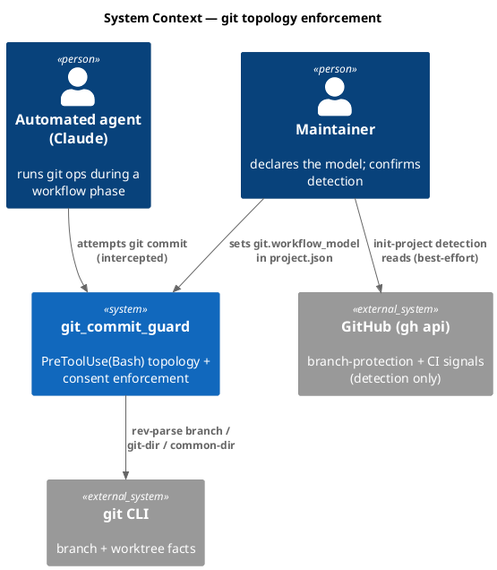

### C4 — Container

Deployable units inside the system boundary and how they communicate.

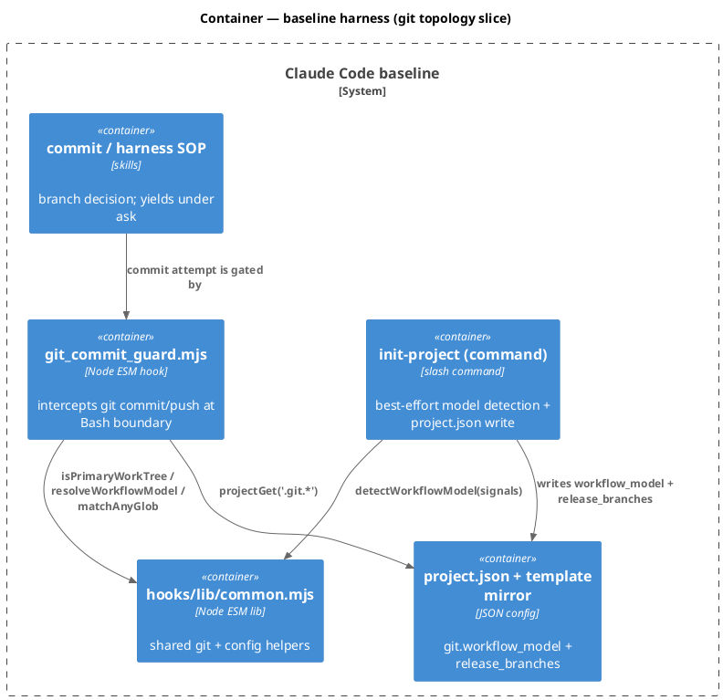

### C4 — Component (changed containers only)

Only `git_commit_guard` changes internals (plus new exports in `common.mjs`).

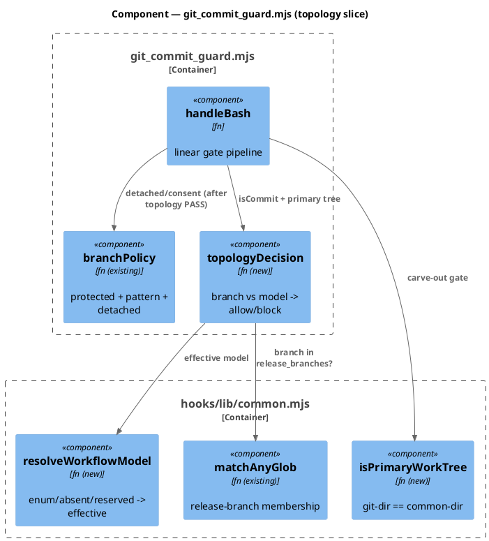

### Data model — class diagram

Config schema and the in-memory decision result. `<<new>>` marks fields/types this spec adds.

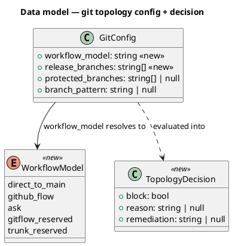

#### Migration "DDL" — config schema diff (no SQL DB; this is a JSON config change)

```text
# src/project.template.json  (shipped default for NEW consumers)
- "git": { "protected_branches": null, "branch_pattern": null }
+ "git": { "workflow_model": "ask", "release_branches": ["main"],
+          "protected_branches": null, "branch_pattern": null }

# .claude/project.json  (THIS repo's migration)
- "git": { "protected_branches": null, "branch_pattern": null }
+ "git": { "workflow_model": "direct-to-main", "release_branches": ["main", "next"],
+          "protected_branches": null, "branch_pattern": null }

# reverse: drop workflow_model + release_branches keys; absent -> resolves to "ask" (no-op behavior)
```

### Behavior — sequence per AC

One sequence per behavior; the AC table maps each `AC-NNN` to a `§Behavior #N`.

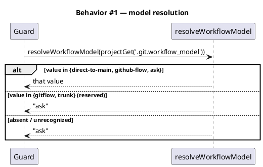

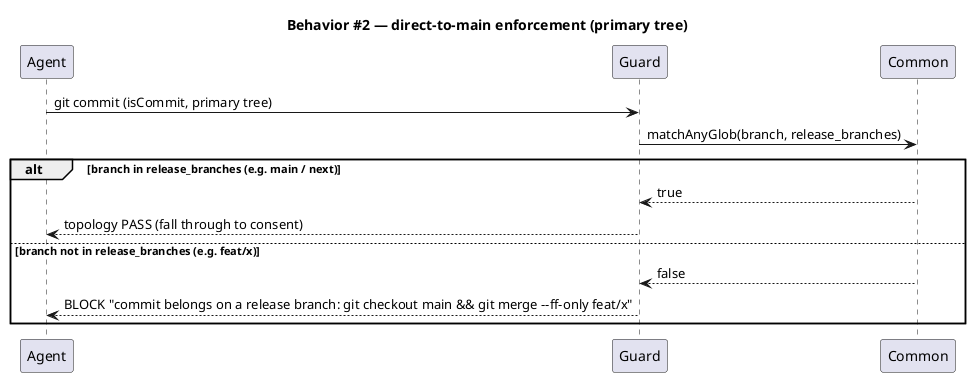

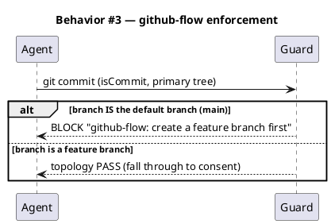

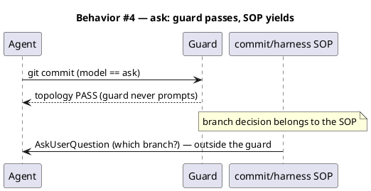

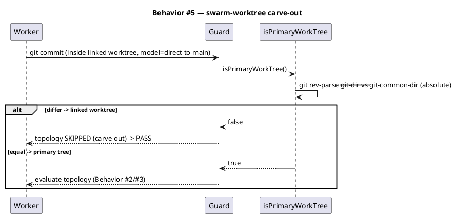

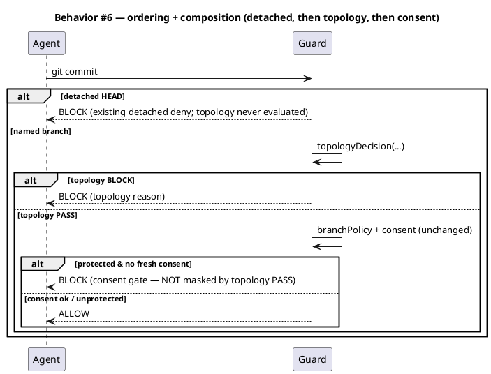

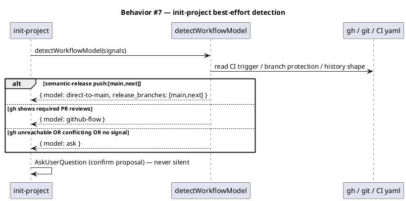

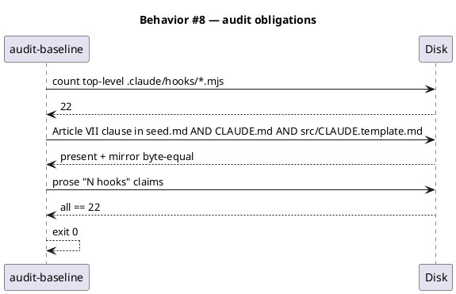

### State — core entity *(only if stateful)*

The effective model is a pure resolution of config; there is no persisted state machine. Heading kept to record the explicit choice. (`workflow_model` config value → effective model is the Behavior #1 resolution, not a runtime FSM.)

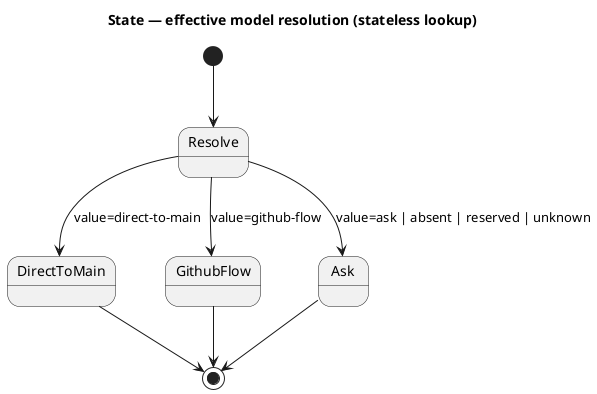

### Dependencies — graph

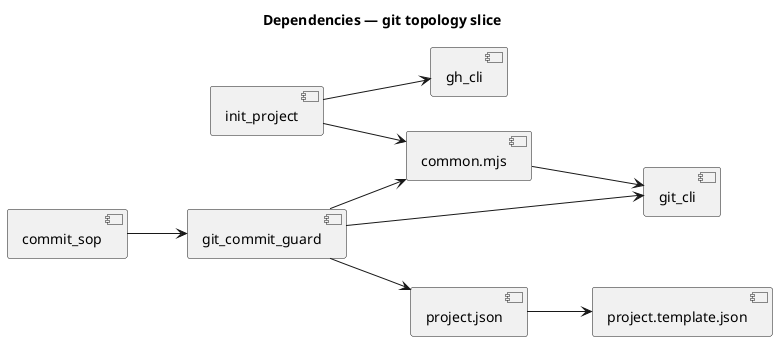

### Contracts

One row per function/CLI surface (no HTTP/event surfaces in this feature).

| Kind | Name | Input | Output | Errors | Idempotent |
|---|---|---|---|---|---|
| Fn | `resolveWorkflowModel(value)` | string \| null \| undefined | `"direct-to-main" \| "github-flow" \| "ask"` | none (total fn; unknown→`ask`) | yes |
| Fn | `isPrimaryWorkTree(cwd?)` | optional cwd | bool | git failure → `true` (fail toward enforcing on primary; never false-skip) | yes |
| Fn | `topologyDecision({model, branch, releaseBranches, defaultBranch, isPrimary})` | object | `{block, reason, remediation}` | none (total fn) | yes |
| Fn | `detectWorkflowModel({ciText, ghProtection, historyShape})` | object | `{model, release_branches?}` | any read failure → `{model:"ask"}` | yes |
| Guard | `git_commit_guard` Bash leg | hook payload (cmd) | `emitBlock` \| `emitAllow` | malformed → fail-safe `emitAllow` (existing) | n/a |

### Libraries and versions

No third-party libraries. The guard and helpers use Node's built-in `node:child_process` (`execFileSync`) over the system `git` CLI, and `node:fs`. `gh` is invoked only at detection time (best-effort, optional). The one external behavior verified empirically (not from training recall): git worktree plumbing — `git rev-parse --git-dir` vs `--git-common-dir` differ in a linked worktree, confirmed on git 2.50.1 in this repo (research memo). context7 not applicable (no library API surface).

| Library@version | Purpose | Key APIs | Confirmed via context7 |
|---|---|---|---|
| *(none — Node built-ins + git CLI)* | — | `execFileSync`, `git rev-parse` | n/a |

### Alternatives considered

| Alt | Summary | Rejected because |
|---|---|---|
| New 23rd hook | Separate `git_topology_guard.mjs` | breaks `derive-counts.mjs:109` count==22; intake forbids |
| Topology logic in `common.mjs` only | move policy out of the guard | policy is guard-specific, no cross-hook reuse (YAGNI); only `isPrimaryWorkTree` is genuinely reusable |
| Single default branch (no list) | `direct-to-main` permits only `main` | false-blocks `next` (semantic-release releases on both) |
| CI-parse at guard time | derive release set per commit from YAML | slow/brittle in PreToolUse; CI parsing belongs in detection, not enforcement |
| github-flow diff carve-out | allow docs-only on main | guard cannot reliably classify diff intent at commit time |

## Design calls

This spec's `write_set` does not intersect `project.json → tdd.ui_globs` (no UI files). No design calls.

- *(none)*

## Acceptance criteria

| ID | Criterion (given / when / then) | Upstream AC | Sequence |
|---|---|---|---|
| AC-001 | given `git.workflow_model` set to any enum value, when resolved, then `direct-to-main`/`github-flow`/`ask` map to themselves and `gitflow`/`trunk`/absent/unknown map to `ask` | intake AC-1 | §Behavior #1 |
| AC-002 | given `direct-to-main` and current branch NOT in `release_branches` on the primary tree, when `git commit`, then BLOCK with remediation `git checkout <release> && git merge --ff-only <branch>` | intake AC-2 | §Behavior #2 |
| AC-003 | given `direct-to-main` and current branch IN `release_branches` (`main` or `next`) on the primary tree, when `git commit`, then topology PASS (falls through) | intake AC-2 | §Behavior #2 |
| AC-004 | given `github-flow` and current branch IS the default branch (`main`), when `git commit`, then BLOCK "create a feature branch first" | intake AC-3 | §Behavior #3 |
| AC-005 | given `github-flow` and current branch is a feature branch, when `git commit`, then topology PASS | intake AC-3 | §Behavior #3 |
| AC-006 | given `ask` (explicit, absent, or ambiguous-resolved), when `git commit` on any branch, then topology PASS; the guard never prompts | intake AC-4 | §Behavior #4 |
| AC-007 | given a reserved value (`gitflow`/`trunk`), when `git commit`, then behaves as `ask` (PASS) | intake AC-5 | §Behavior #1 |
| AC-008 | given `direct-to-main` and a commit inside a linked worktree (`--git-dir` ≠ `--git-common-dir`), when `git commit`, then topology is skipped (carve-out → PASS) | intake AC-6 | §Behavior #5 |
| AC-009 | given `direct-to-main` on a protected `main` with no fresh `commit_consent`, when `git commit`, then still BLOCKED by the consent check — topology PASS does not mask consent | intake AC-7 | §Behavior #6 |
| AC-010 | given a detached HEAD, when `git commit`/`push`, then the existing detached-HEAD deny is preserved and topology is never evaluated (ordered after the detached gate) | intake AC-8 | §Behavior #6 |
| AC-011 | given `/init-project` against a repo with semantic-release `push:[main,next]`, when detection runs, then it proposes `direct-to-main` + `release_branches` from the trigger; given `gh` unreachable/ambiguous, then `ask` (never silent) | intake AC-9 | §Behavior #7 |
| AC-012 | given the completed change, when `audit-baseline` runs, then exit 0 with hook count == 22, the Article VII precedence clause present in `seed.md` + `CLAUDE.md` + `src/CLAUDE.template.md` (mirror byte-equal), and prose "N hooks" claims consistent | intake AC-10 (corrected) | §Behavior #8 |
| AC-013 | given this repo migrated to `direct-to-main` with `release_branches:["main","next"]`, when a normal `/commit` on `main` and a `/swarm-dispatch` worktree commit are exercised, then both pass the new guard | intake AC-11 | §Behavior #2, #5 |

## Test plan

| Category | Scenario | Expected | Covers |
|---|---|---|---|
| Golden path | `direct-to-main`, branch `main`, primary tree | topology PASS → consent path | AC-003 |
| Golden path | `direct-to-main`, branch `feat/x`, primary tree | BLOCK + `merge --ff-only` remediation | AC-002 |
| Golden path | `github-flow`, branch `main` | BLOCK "create a feature branch first" | AC-004 |
| Golden path | `github-flow`, branch `feat/x` | topology PASS | AC-005 |
| Input boundary | `workflow_model` = each of {direct-to-main, github-flow, ask, gitflow, trunk, "", absent, "DIRECT-TO-MAIN", junk} | resolves per Behavior #1 | AC-001, AC-007 |
| Input boundary | `release_branches` = `["main","next"]` vs `["main"]` vs `[]` | membership via matchAnyGlob; `[]`→ block all non-default | AC-002, AC-003 |
| Contract violation | `ask` model, any branch | guard PASS, no prompt emitted | AC-006 |
| Concurrency / ordering | detached HEAD under `direct-to-main` | detached deny fires first; topologyDecision not called | AC-010 |
| Failure mode | `git rev-parse` for worktree detection fails | `isPrimaryWorkTree` → true (enforce; never false-skip) | AC-008 |
| Concurrency / ordering | linked worktree commit under `direct-to-main` on `feat/x` | carve-out → PASS (would block on primary tree) | AC-008, AC-013 |
| Regression trap | existing `branch-aware-git-policy.test.mjs` cases | unchanged: topology PASS still reaches consent/pattern | AC-009 |
| Failure mode | detection: `gh` absent + no CI yaml | `{model:"ask"}` | AC-011 |
| Golden path | detection: CI yaml with semantic-release `push:[main,next]` | `{model:"direct-to-main", release_branches:["main","next"]}` | AC-011 |
| Regression trap | `audit-baseline` after change | exit 0, hooks==22, Article VII present in all 3 files, mirror byte-equal | AC-012 |
| Regression trap | this repo: `/commit` on `main` + swarm worktree commit | both pass new guard | AC-013 |

## Observability

| Signal | Name | Shape | Purpose |
|---|---|---|---|
| Log | `git_commit_guard` log line | `BLOCKED topology model=<m> branch=<b>` / `ALLOWED topology PASS …` | audit which model + branch tripped/passed (extends existing `logLine(HOOK, …)`) |
| Log | detection trace | `detectWorkflowModel -> <model> (signal: <ci|gh|history|none>)` | explain the init-project proposal |

## Rollout

- **No runtime feature flag** — the model is the flag: a fresh consumer ships `workflow_model: "ask"` (behavior identical to today, since `ask` = topology PASS), so the change is inert until a project opts in. This repo opts in by setting `direct-to-main`.
- **Order**: 1) `seed.md` Article VII clause + §4.1 row (precedence Art. I.4) → 2) `CLAUDE.md` clause + `src/CLAUDE.template.md` byte-mirror → 3) `src/project.template.json` schema defaults → 4) `common.mjs` helpers + `git_commit_guard.mjs` topology block (+ tests) → 5) `.claude/commands/init-project.md` detection + `commit` SOP yield → 6) this repo's `.claude/project.json` migration → 7) `audit-baseline` green.
- **Canary**: this repo IS the canary — exercise a real `/commit` on `main` and a swarm dispatch under `direct-to-main` before declaring done (AC-013).

## Rollback

- **Kill-switch**: set `git.workflow_model` back to `"ask"` (or delete the key) in `project.json` — topology enforcement goes inert immediately; no other behavior changes.
- **Signal to roll back**: any false-block of a legitimate commit on a release branch or inside a swarm worktree (caught by AC-013 before ship; if it escapes, a single blocked `/commit` on `main` is the signal). Reverting is a one-line config edit, well under 5 minutes.

## Archive plan

- Defaults *(automatic)*: intake, scout, research, spec, brief, spec-rendered/, spec approval, security report.
- Extras *(list any non-default files)*:
  - *(none)*

## Open questions

- *(none — the three prior open design calls were settled: flat `git.release_branches` glob list (default `["main"]`); github-flow hard-blocks all default-branch commits; this repo migrates with `release_branches: ["main","next"]`.)*
