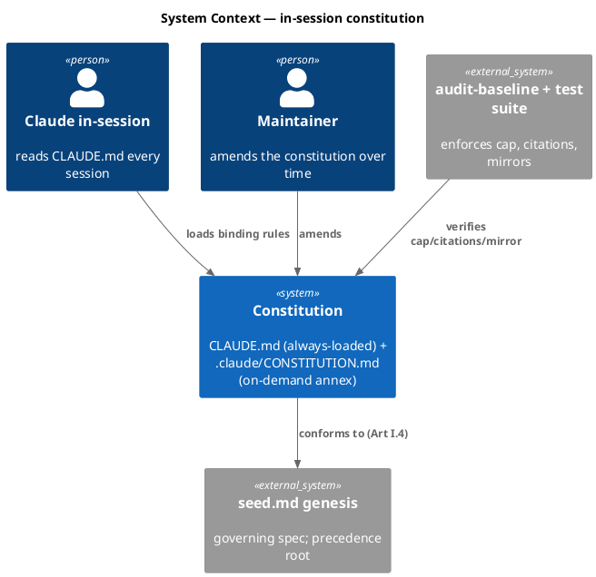
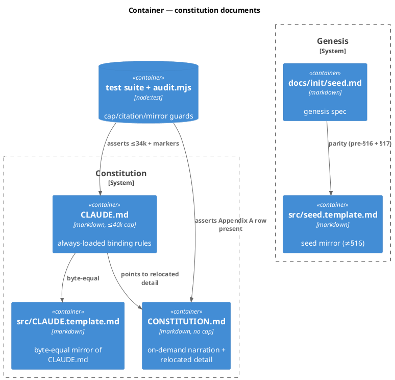
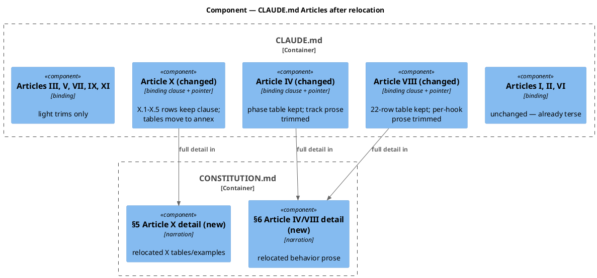
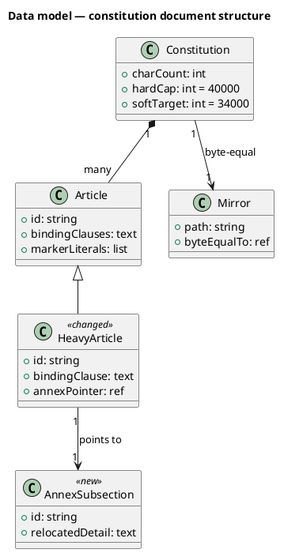
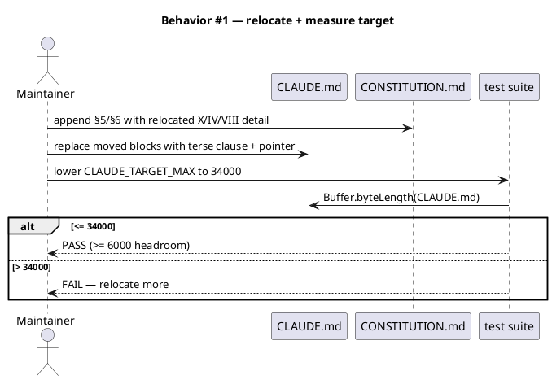
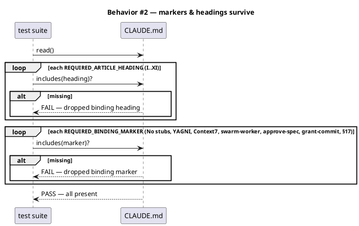
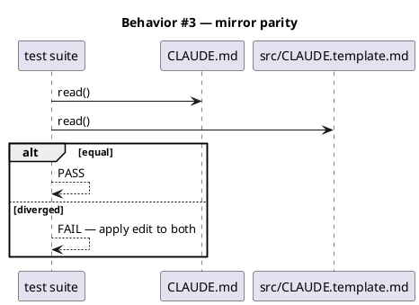
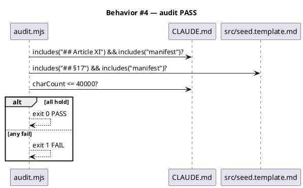
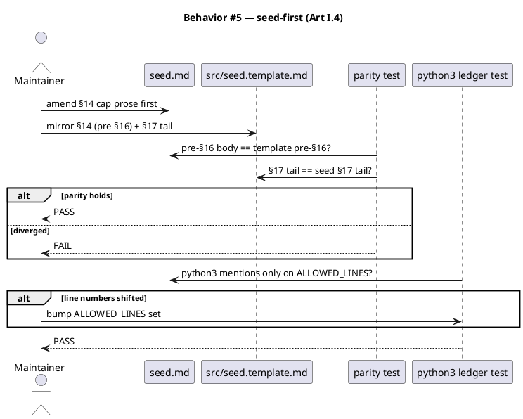
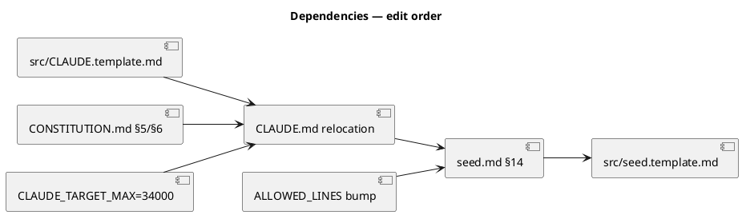

# Spec — Restore CLAUDE.md headroom via hybrid relocation to the annex

<!--
Technical spec. Produced by the `spec` skill.
Approval is a token written by /approve-spec — never add "Status: Approved".
-->

## Context

| Input | Path |
|---|---|
| Intake | `docs/intake/claude-md-pointer-rewrite.md` |
| Scout | `docs/scout/claude-md-pointer-rewrite.md` |
| Research | `docs/research/claude-md-pointer-rewrite.md` |
| Brief | `docs/brief/claude-md-pointer-rewrite.md` |

## Goal

CLAUDE.md drops from 38,479 to ≤ 34,000 chars by relocating the elaborative bulk of Articles X, IV, and VIII into new annex subsections — every binding rule, marker literal, and Article heading preserved verbatim, all mirrors and audits still green.

## Non-goals

- Changing the precedence chain (seed.md > CLAUDE.md > implementation, Art I.4).
- Changing the 22-hook → Article enforcement mapping (Art VIII); no enforcement weakens.
- Downgrading any rule to advisory by moving its elaboration to the annex.
- Adding quick-reference cards (deferred to a follow-up; out of scope here).
- Touching the already-terse Articles I, II, VI (YAGNI — negligible chars).

## Decisions

> Captured from the maintainer via AskUserQuestion during `/spec` (codesign_mode off; recorded here for traceability).

| # | Decision point | Chosen | Rationale |
|---|---|---|---|
| D1 | Relocation strategy | **C — hybrid** | Effort follows the chars: Article X is 26% of the file. Convert heavy Articles (X, IV/VIII prose) to terse-clause + annex pointer; leave terse Articles alone. Avoids the whole-file blast radius of strategy A. |
| D2 | Enforced headroom target | **≤ 34,000 (~6k)** | 4× today's 1,521 margin; reachable with strategy C without strategy-A risk. Lower `CLAUDE_TARGET_MAX` (single site); 40,000 hard cap unchanged. |
| D3 | Quick-reference cards | **Deferred** | Cards live in the uncapped annex and don't affect CLAUDE.md headroom — orthogonal to this goal. File as a separate backlog item. |

## Design

Diagrams are the contract. Prose is only for what a diagram cannot say.

### Write set

- `docs/init/seed.md` — amend §14 cap prose to describe the new target/relocation (seed-first, Art I.4).
- `src/seed.template.md` — mirror the seed §14 + §17 edits (pre-§16 + §17-tail byte parity).
- `CLAUDE.md` — relocate elaboration out of Articles X, IV, VIII; keep binding clauses + markers + pointers.
- `src/CLAUDE.template.md` — byte-equal mirror of CLAUDE.md.
- `.claude/CONSTITUTION.md` — new subsections receiving the relocated Article detail.
- `tests/code-browser-primary-navigation.test.mjs` — lower `CLAUDE_TARGET_MAX` 38500 → 34000.
- `tests/governance-no-python3-runtime.test.mjs` — bump `ALLOWED_LINES` line numbers IFF seed.md line insertions shift them.

No file in the write set matches `project.json → tdd.ui_globs` — there is no UI surface.

### C4 — System context

Who interacts with the governance system and which external systems enforce it.



### C4 — Container

Deployable document units inside the constitution boundary and their mirrors.



### C4 — Component (changed container: CLAUDE.md)

CLAUDE.md internals: heavy Articles convert to terse-clause + annex pointer; terse Articles untouched.



### Data model — class diagram

Document-structure model. `<<changed>>` = Article losing elaboration to the annex; `<<new>>` = annex subsection created.



#### Migration DDL

```sql
-- No database in scope. This is a documentation/governance restructure.
-- "Migration" = the ordered edit sequence in §Rollout (seed first, then CLAUDE.md + mirror, then annex, then test constant).
```

### Behavior — sequence per AC

#### §Behavior #1 — relocate heavy-Article detail, then measure ≤ 34,000



#### §Behavior #2 — binding-rule + marker survival



#### §Behavior #3 — CLAUDE.md ↔ template byte-equality



#### §Behavior #4 — audit-baseline citations + counts



#### §Behavior #5 — seed-first amendment + parity + python3 ledger



### State — N/A

The system has no non-trivial runtime state machine; the edit order is captured in §Rollout.

### Dependencies — graph

Edit-order dependencies. `A --> B` reads "A must land before/with B".



### Contracts

No runtime endpoints. The "contracts" are the invariants CI enforces post-change.

| Kind | Name | Input | Output | Errors | Idempotent |
|---|---|---|---|---|---|
| Test | `code-browser-primary-navigation` | CLAUDE.md bytes | ≤ 34000 + markers present | FAIL if over/missing | yes |
| Test | `seed-template-parity` | seed.md, template | pre-§16 + §17 byte-equal | FAIL on drift | yes |
| Test | `governance-no-python3-runtime` | seed.md lines | python3 only on ALLOWED_LINES | FAIL on unlisted line | yes |
| Audit | `audit-baseline` | repo tree | exit 0 | exit 1 on cap/citation/count fail | yes |

### Libraries and versions

No third-party libraries are involved (documentation/governance restructure). context7 not applicable — no external API to confirm.

| Library@version | Purpose | Key APIs | Confirmed via context7 |
|---|---|---|---|
| *(none)* | — | — | n/a |

### Alternatives considered

| Alt | Summary | Rejected because |
|---|---|---|
| A | Thin pointer per Article (whole-file rewrite) | Whole-file blast radius + high risk of orphaning a marker, for headroom beyond what's needed. |
| B | Narration-only trim, no structural change | Leaves Article X (26% of file) intact; reaches only ~34-35k — thin payoff. |

## Design calls

No write-set file intersects `project.json → tdd.ui_globs`; there is no UI surface.

- *(none)*

## Acceptance criteria

| ID | Criterion (given / when / then) | Upstream AC | Sequence |
|---|---|---|---|
| AC-001 | given the relocation, when `wc -c < CLAUDE.md` is measured, then it is ≤ 34,000 (≥ 6,000 headroom under 40k). | intake AC 1 | §Behavior #1 |
| AC-002 | given the change, when the marker/heading test runs, then every `## Article I..XI` heading and every `REQUIRED_BINDING_MARKER` is present verbatim in CLAUDE.md. | intake AC 2 | §Behavior #2 |
| AC-003 | given a CLAUDE.md edit, when compared, then `src/CLAUDE.template.md` is byte-identical. | intake AC 3 | §Behavior #3 |
| AC-004 | given the change, when `audit-baseline` runs, then it exits 0 — Article XI+manifest in CLAUDE.md, §17+manifest in src/seed.template.md, counts intact. | intake AC 4 | §Behavior #4 |
| AC-005 | given the change, when reviewed, then the precedence chain (Art I.4) and the hook→Article mapping (Art VIII) are unchanged in substance. | intake AC 5 | §Behavior #2 |
| AC-006 | given Art I.4, when this lands, then seed.md §14 + src/seed.template.md are amended (parity held) before CLAUDE.md conforms, and the python3 ALLOWED_LINES ledger is bumped iff line numbers shift. | intake AC 6 | §Behavior #5 |
| AC-007 | given the suite, when run, then all governance tests pass and `CLAUDE_TARGET_MAX` is 34000 at its single site with all cap-asserting sites reconciled. | intake AC 7 | §Behavior #1 |

## Test plan

| Category | Scenario | Expected | Covers |
|---|---|---|---|
| Golden path | run full `npm test` after relocation | all green | AC-001, AC-007 |
| Golden path | run `node .claude/skills/audit-baseline/audit.mjs` | exit 0 PASS | AC-004 |
| Input boundary | CLAUDE.md exactly at 34,000 | PASS (≤ boundary) | AC-001 |
| Input boundary | remove one `REQUIRED_BINDING_MARKER` (mutation) | test FAILs | AC-002 |
| Contract violation | edit CLAUDE.md without mirroring template | byte-equal test FAILs | AC-003 |
| Contract violation | drop `## Article XI` citation | audit FAILs | AC-004 |
| Failure mode | insert seed.md line above an ALLOWED_LINES entry without bumping | python3 test FAILs | AC-006 |
| Regression trap | seed.md pre-§16 / §17 parity with template | unchanged (byte-equal) | AC-006 |
| Regression trap | Appendix A `.claude/hooks/` row stays in annex | unchanged | AC-002 |

## Observability

Not applicable — no runtime component. "Observability" is the CI signal set.

| Signal | Name | Shape | Purpose |
|---|---|---|---|
| CI | `npm test` | pass/fail | governance invariants |
| CI | `audit-baseline` exit code | 0/1 | cap + citations + counts |

## Rollout

- **Feature flag**: none — governance edit, not a runtime feature.
- **Migration order**: 1 seed.md §14 → 2 src/seed.template.md mirror → 3 CONSTITUTION.md §5/§6 (receive detail) → 4 CLAUDE.md relocation → 5 src/CLAUDE.template.md mirror → 6 lower `CLAUDE_TARGET_MAX` to 34000 → 7 bump python3 `ALLOWED_LINES` if shifted.
- **Canary**: run `npm test` + `audit-baseline` locally before `/grant-commit`; both must be green.

## Rollback

- **Kill-switch**: `git revert` the single commit — all edits ship together, so revert restores the prior constitution atomically.
- **Signal to roll back**: any governance test FAIL or `audit-baseline` exit 1 in CI within one run of landing.

## Archive plan

- Defaults *(automatic)*: intake, scout, research, brief, spec, spec-rendered/, spec approval, security report.
- Extras *(list any non-default files)*:
  - *(none)*

## Open questions

- *(none — D1/D2/D3 resolved the prior open questions; relocation row-by-row judgment for Article X happens during `/tdd` within the strategy-C envelope.)*
