# Spec — seed.md §II.A bounded maker/checker charter (definitive, `-c732` absorbing `-9360`)

## Context

| Input | Path |
|---|---|
| Intake | `docs/intake/maker-checker-amendment.md` |
| Brief (brainstorm) | `docs/brief/maker-checker-amendment.md` |
| Scout | `docs/scout/maker-checker-amendment.md` |
| Research | `docs/research/maker-checker-amendment.md` |
| Prior PoC spec (archived, unapproved) | `docs/archive/2026-06-05/maker-checker-poc/spec.md` |

This amendment is the **definitive** maker/checker charter. The backlog (`.claude/memory/backlog.md`) split the work as minimal-now (`-c732`) + real-charter-later (`-9360`, recorded as *superseding* `-c732`). The brainstorm reversed that split: with the PoC evidence already in hand, the maintainer writes **one** charter now — `-c732` **absorbs** `-9360`. The full multi-agent scaling (multiple makers/checkers, durable plan schema `-424f`, tier dial `-1a2d`, mutation oracle `-f029`, gate taxonomy `-9008`) is **not** this charter; it is the *graduation target* the charter names. seed.md currently carries **no** maker/checker text — the PoC's minimal carve-out was archived without approval, so this lands fresh.

## Goal

Ratify a `seed.md §II.A` charter that legalizes exactly one governed maker + one oracle-bound checker on the Workflow runtime as a **bounded exception** — hard-capped, hook-governed, with an evidence-keyed graduation gate — propagated byte-faithfully into the four mirror files with a green `audit-baseline` as the mechanical oracle.

## Non-goals

- More than one maker or one checker; any fan-out, waves, or panel. (These are the graduation *target*, gated behind a future permanent Article II rewrite.)
- The downstream architecture pieces: tier dial (`-1a2d`), mutation oracle (`-f029`), durable plan schema (`-424f`), gate taxonomy / v2 (`-9008`).
- Authoring the future permanent Article II rewrite itself — `§II.A` only *names* its graduation criteria.
- Any new hook, subagent, skill, or product code. This is governance text + mirrors only.

## Design

Diagrams are the contract. The change is constitutional text plus its byte-faithful mirrors; the "system" the diagrams model is the carve-out's governance structure, not a runtime service.

### The amendment text (`§II.A`, lands in `seed.md §4.2` first per Art. I.4)

> **§II.A — Bounded maker/checker charter (v1).** Notwithstanding §II's general rule that subagents only execute pre-decided recipes, ONE bounded maker/checker round-trip MAY execute on Claude Code's dynamic Workflow runtime, subject to **all** of:
> 1. **Pre-decided contract.** The maker implements a contract decided in main context, within an explicit `write_set`; it makes no design or scope decisions.
> 2. **Oracle-bound checker.** Findings rank by evidence: a finding backed by a **mechanical** artifact (failing test, guard block, structural violation) is **blocking**; a finding backed by **research/documentation** evidence is **advisory** (surfaced, labeled lower-confidence, never blocking on its own); a bare opinion is not a finding. The checker's grounding test or relation SHALL derive from intended behavior or the spec, **never from the maker's implementation** (no self-confirming oracle). A non-mechanical finding is advisory by construction, because maker and checker may share a model family (self-preference bias).
> 3. **Hook governance is mandatory.** All workflow-agent writes remain under the live PreToolUse hooks; `tdd_order_guard`, `verify_pass_guard`, and `swarm_boundary_guard` were observed firing on workflow agents.
> 4. **Escalation bounces up.** Any scope or `write_set` escalation returns to the main-context orchestrator; workers never widen scope themselves.
> 5. **Fallback.** When the Workflow runtime is unavailable or disabled, the round-trip falls back to the Mirror-lite turn-by-turn swarm.
> 6. **Bounded — exactly one maker, one checker.** This charter authorizes a single maker and a single checker: no second maker/checker, no fan-out, waves, or panel. Lifting this cap requires a future permanent Article II rewrite, gated on clause 7.
> 7. **Graduation gate.** `§II.A` remains a bounded exception until **all** hold: (a) ≥ 3 governed maker→checker round-trips in which every blocking finding was mechanically grounded; (b) **zero** false-positive blocking findings across that window; (c) a clean `/security` review of the checker's oracle artifacts; (d) explicit maintainer ratification of a future permanent Article II rewrite. Until that rewrite lands, the caps in clause 6 bind.

**Placement (byte-budget forced).** `CLAUDE.md` carries only a terse binding pointer in Article II (a single sentence: the bounded round-trip is permitted under `§II.A`; see seed.md §4.2 / annex). The full seven clauses live in `seed.md §4.2`; the narrative + corroboration rationale live in the `.claude/CONSTITUTION.md` annex (no byte cap). Net `CLAUDE.md` delta SHALL be ≤ 0 — the binding-pointer sentence is offset by trimming equivalent verbose prose elsewhere in `CLAUDE.md`; the 38500-byte test is the mechanical oracle.

### C4 — System context

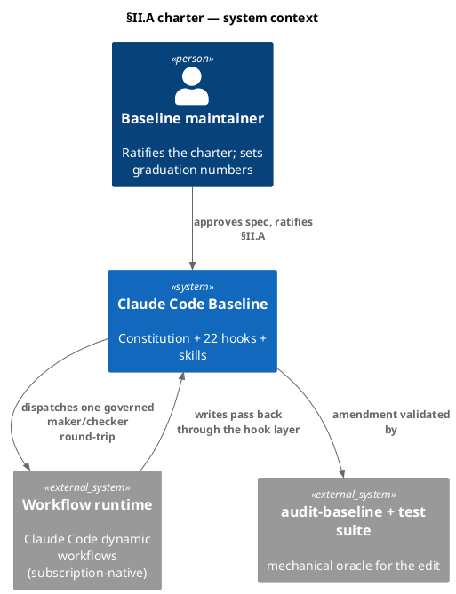

### C4 — Container

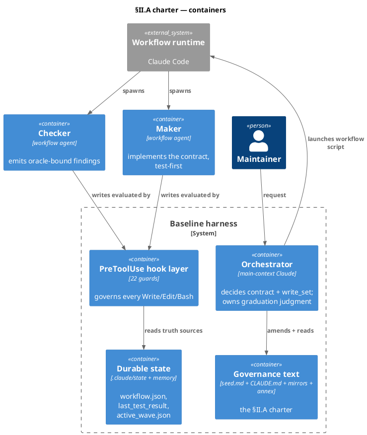

### C4 — Component (changed containers only)

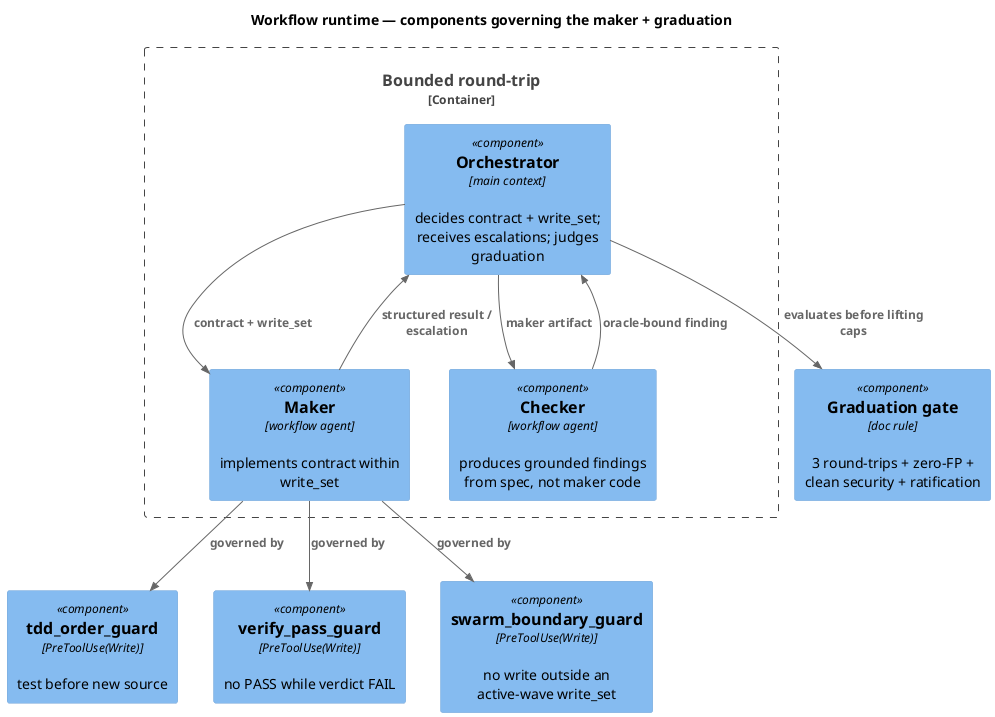

### Data model — class diagram

No datastore — this is a governance change. The class diagram models the charter's conceptual structure (the rule, not a schema).

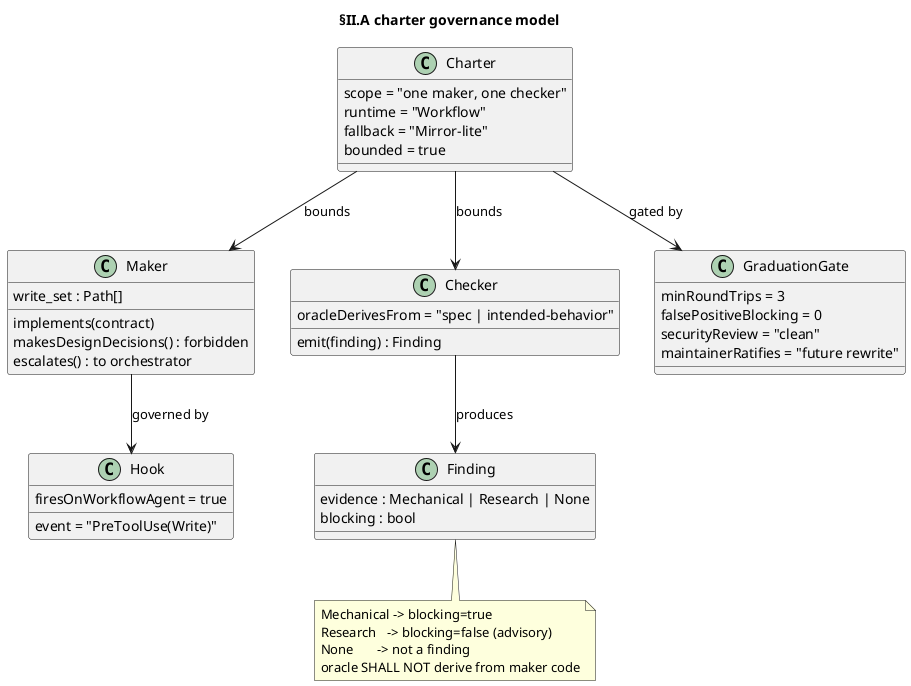

#### Migration DDL

None. This change touches governance documents (`seed.md`, `CLAUDE.md`, the annex) and their byte-faithful mirrors; there is no schema or data migration.

### Behavior — sequence per AC

#### Behavior #1 — amendment applies and the audit is the oracle

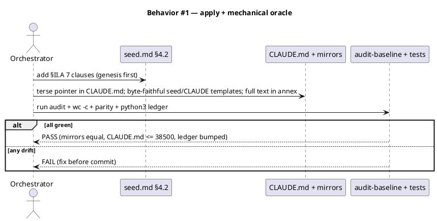

#### Behavior #2 — maker is governed (test-first)

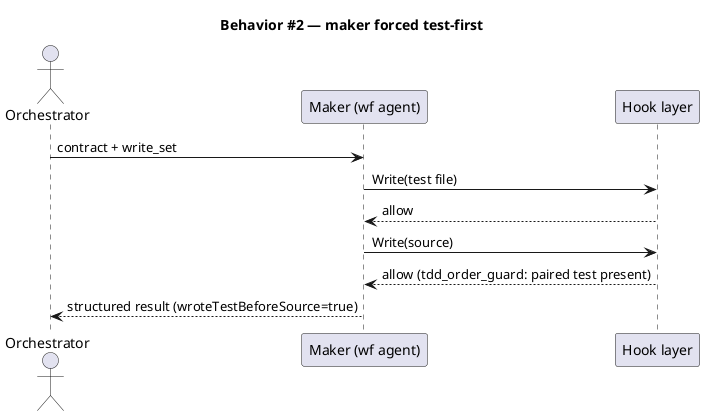

#### Behavior #3 — verify_pass_guard fires in the maker context

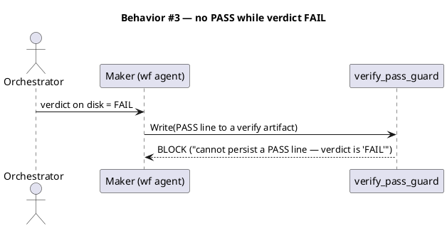

#### Behavior #4 — swarm_boundary_guard fires in the maker context

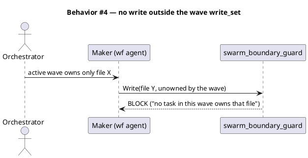

#### Behavior #5 — checker emits an oracle-bound finding (anti-circularity)

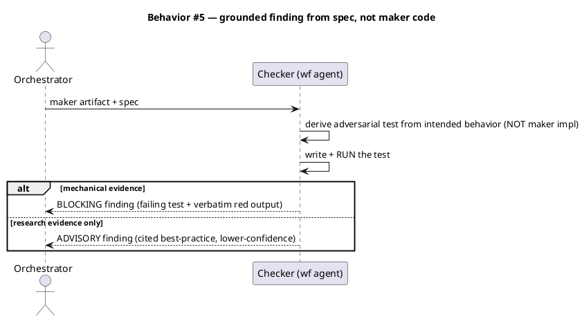

#### Behavior #6 — graduation gate evaluation

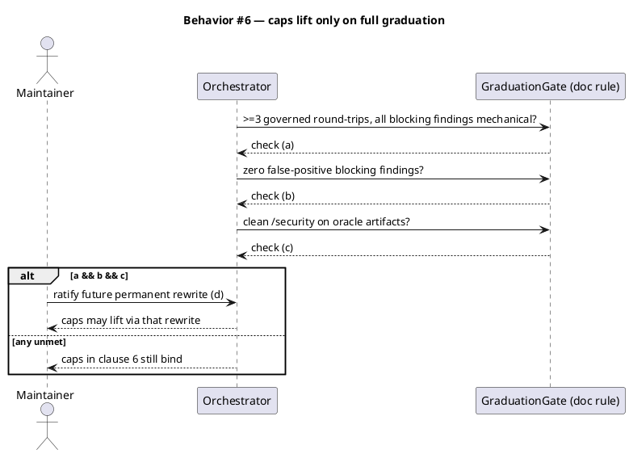

### State — core entity *(only if stateful)*

Not stateful in the product sense. The carve-out relies on existing state truth-sources only: `.claude/state/last_test_result` (verify_pass_guard) and `.claude/state/swarm/active_wave.json` (swarm_boundary_guard). No new state entity is introduced.

### Dependencies — graph

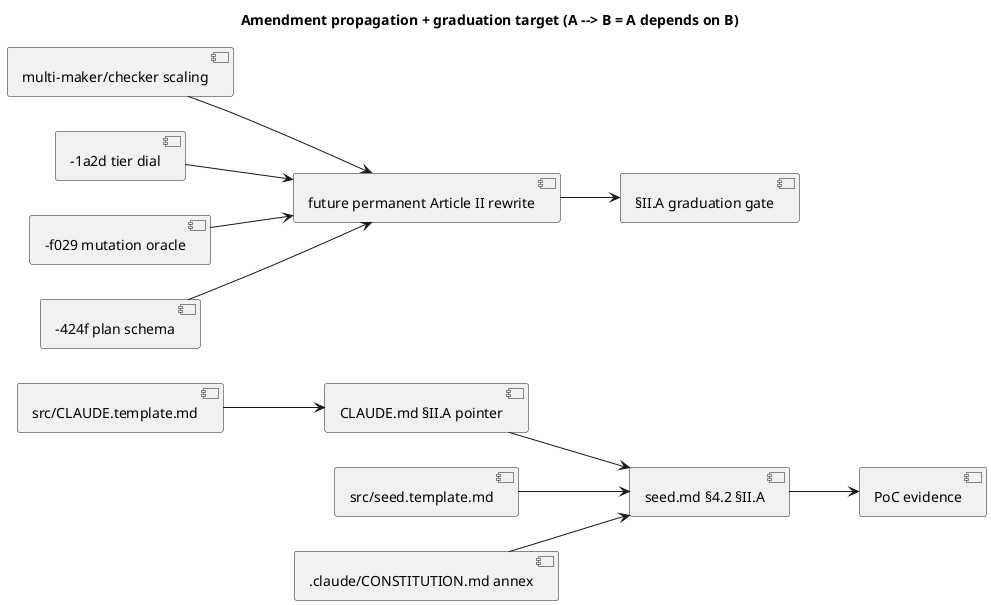

### Contracts

| Surface | Contract |
|---|---|
| `seed.md §4.2 (§II.A)` | The seven-clause charter, verbatim above. Genesis source of truth (Art. I.4); edited first. |
| `CLAUDE.md` Article II | Terse binding pointer to `§II.A` (one sentence). Net byte delta ≤ 0. |
| `src/CLAUDE.template.md` | Byte-equal mirror of `CLAUDE.md` (audit enforces equality + 40000-char cap; test enforces ≤ 38500 bytes). |
| `src/seed.template.md` | Byte-identical to `seed.md` in the pre-§16 region (where §4.2 lives) and the §17+ tail. |
| `.claude/CONSTITUTION.md` (annex) | Full narrative + corroboration rationale + graduation detail. No size cap. |
| `tests/governance-no-python3-runtime.test.mjs` | `ALLOWED_LINES['docs/init/seed.md']` line-652 entry bumped to 652+N for the seed insertion offset. |
| Maker (workflow agent) | Implements a main-context contract within `write_set`; returns structured result or escalation; no design decisions. |
| Checker (workflow agent) | Returns a schema-validated finding; `blocking` iff evidence is mechanical and the oracle derives from spec/intended-behavior, never the maker's code; research evidence is advisory. |

### Libraries and versions

| Library@version | Purpose | Key APIs | Confirmed via context7 |
|---|---|---|---|
| Claude Code dynamic Workflows | execution substrate (`agent()` with `schema`/`isolation`) | platform feature | N/A — platform, not a third-party package; `context7` does not index it. Exercised empirically across the PoC's three workflow runs. |
| Node.js `node:assert/strict` (bundled) | the grounded-finding test harness | `assert.deepStrictEqual` | stdlib — no context7 lookup applies. |

No third-party package APIs are introduced, so `context7` has no applicable lookup (consistent with the PoC spec).

### Alternatives considered

| Alt | Summary | Rejected because |
|---|---|---|
| Temporal / sunset backstop | `§II.A` auto-lapses on a date or commit-count | Boundedness here is capability-shaped, not calendar-shaped; a sunset adds an expiry-cliff failure mode with no evidentiary basis (research Candidate C). |
| Graduation gate with no numeric floor | Pure maintainer judgment | Loses a cheap, unambiguous, telemetry-free floor; research Candidate A is viable but B's one-line floor costs almost nothing and adds rigor. |
| Keep `-c732` minimal + write `-9360` later | Two-step minimal-now / charter-later | The PoC evidence already exists; a second amendment cycle is redundant. The maintainer chose one definitive charter (brainstorm). |
| Full charter in `CLAUDE.md` Article II | Inline all seven clauses | Busts the 38500-byte budget (16 bytes slack). Annex-pointer pattern is forced, not preferred. |

## Design calls

*(none — `write_set` is governance docs + mirrors + annex + one test file; it does not intersect `tdd.ui_globs`, so there is no UI surface.)*

## Acceptance criteria

| ID | Criterion (given / when / then) | Upstream AC | Sequence |
|---|---|---|---|
| AC-001 | Given the amended `seed.md §4.2`, when read, then `§II.A` contains all seven clauses including the anti-circularity rule and self-preference caveat (clause 2) and the graduation gate (clause 7). | intake AC-1, AC-3 | §Behavior #1 |
| AC-002 | Given a maker on the Workflow runtime, when it writes source before a paired test, then `tdd_order_guard` forces test-first. | intake AC (PoC evidence) | §Behavior #2 |
| AC-003 | Given a workflow-agent write of `PASS` to a verify artifact while the verdict is FAIL, then `verify_pass_guard` blocks it. | intake AC (PoC evidence) | §Behavior #3 |
| AC-004 | Given a workflow-agent write to a file no active-wave task owns, then `swarm_boundary_guard` blocks it. | intake AC (PoC evidence) | §Behavior #4 |
| AC-005 | Given the maker's artifact + spec, when the checker grounds a finding, then ≥1 mechanical finding is blocking, research evidence is advisory, opinion is not a finding, and the grounding oracle derives from the spec, not the maker's code. | intake AC-6 | §Behavior #5 |
| AC-006 | Given the Workflow runtime is unavailable/disabled, then the round-trip falls back to Mirror-lite. | intake AC (clause 5) | §Behavior #1 |
| AC-007 | Given `§II.A`, when read for the end-condition, then clause 7 names all four graduation criteria with the numeric floor (≥3 round-trips, zero-FP blocking) and states the caps bind until a future rewrite. | intake AC-3 | §Behavior #6 |
| AC-008 | Given the amendment is applied across the four mirror files + annex, when the audit and pre-checks run, then `audit-baseline` is PASS, `CLAUDE.md` ≤ 38500 bytes and == `src/CLAUDE.template.md`, seed pre-§16/§17 parity holds, the python3 ledger is bumped, the "one subagent" count and every `## Article` heading + `REQUIRED_BINDING_MARKER` survive. | intake AC-4, AC-5 | §Behavior #1 |

## Test plan

The mechanical oracle for a governance amendment is a green audit + the cheap pre-checks; the behavioral ACs (002–005) are already demonstrated empirically by the PoC and are not re-run.

| Category | Scenario | Expected | Covers |
|---|---|---|---|
| Golden path | Apply `§II.A` to seed.md first, mirror to CLAUDE.md (pointer) + both `src/*.template.md`, narrative to annex | `audit-baseline` exit 0 | AC-001, AC-008 |
| Byte budget | `wc -c CLAUDE.md` after edit | ≤ 38500 (net delta ≤ 0 via offsetting trim) | AC-008 |
| Mirror parity | `diff -q CLAUDE.md src/CLAUDE.template.md`; `diff` of pre-§16 and §17-tail regions seed.md ↔ src/seed.template.md | identical | AC-008 |
| python3 ledger | `grep -n '\bpython3\b' docs/init/seed.md` vs `ALLOWED_LINES` after the insertion offset | ledger 652→652+N updated; test green | AC-008 |
| Markers intact | Every `## Article I..XI` heading + `REQUIRED_BINDING_MARKERS` + `## §17` citation present after CLAUDE.md trim | all present | AC-008 |
| Count intact | `audit.mjs` subagent count + `findCount("N subagents")` | still 1 (`swarm-worker`); maker/checker prose carries no numeral+"subagents" collocation | AC-008 |
| Text presence | `§II.A` clause-by-clause grep (7 clauses incl. anti-circularity, self-preference, graduation) | all present | AC-001, AC-005, AC-007 |
| Failure mode (PoC) | maker test-first / PASS-while-FAIL / unowned-write / grounded finding | guards fire / finding grounded (PoC verbatim evidence) | AC-002..AC-005 |
| Regression trap | No product code touched; no toy code remains from the PoC | nothing to regress | — |

## Observability

No production telemetry. The graduation gate's evidence is read from the `/workflows` run record (per-agent token + tool counts) and the verbatim guard/finding messages in agent results — maintainer-audited, not auto-computed. The amendment's own observability is the `audit-baseline` verdict + the four cheap pre-checks.

## Rollout

1. Edit `docs/init/seed.md §4.2` to add `§II.A` (genesis first, Art. I.4).
2. Add the terse binding pointer to `CLAUDE.md` Article II and apply an offsetting trim so net byte delta ≤ 0; mirror byte-equal into `src/CLAUDE.template.md`.
3. Apply the identical seed edit to `src/seed.template.md` (pre-§16 region).
4. Write the full narrative + graduation rationale into `.claude/CONSTITUTION.md` (annex, no cap).
5. Bump `ALLOWED_LINES['docs/init/seed.md']` 652→652+N in `tests/governance-no-python3-runtime.test.mjs`.
6. Run the cheap pre-checks, then `audit-baseline`; resolve any FAIL before commit.
7. No flag — the charter is constitutional text, in force on merge. Its scope is self-limiting (clause 6 + the graduation gate clause 7).

## Rollback

- **Kill-switch**: revert the `§II.A` edits across the four mirror files + annex + the test ledger bump in one commit.
- **Signal to roll back**: `audit-baseline` FAIL or any of the four pre-checks red after merge — confirms the mirrors are out of equality; revert restores them. No data or runtime state to unwind (text-only, bounded).

## Archive plan

- Defaults *(automatic)*: every `maker-checker-amendment.*` file in `docs/intake/`, `docs/brief/`, `docs/scout/`, `docs/research/`, `docs/specs/`, the spec approval, and any `/security` report.
- Extras *(list any non-default files)*:
  - *(none)* — the four mirror-file edits + annex + test ledger bump are committed product, not archived artifacts.

## Open questions

- **Graduation numbers (reviewer-confirm at gate A).** The spec sets ≥ 3 governed round-trips and **zero** false-positive blocking findings. Confirm or adjust before ratifying — these become constitutional text. The literature offers a reference point (metamorphic prompt testing: 75% detection at 8.6% FP) but no baseline-specific target; the zero-FP bar applies to *blocking* (mechanically grounded) findings specifically, where a wrong block implies an anti-circularity violation.
- **`-9360` / `-c732` backlog reconciliation (RESOLVED — rescope).** `-c732` is the delivered charter (closes on commit; no second charter is written). `-9360` is **rescoped** from "the real Article II amendment after prototype" to "**the graduation-gated permanent Article II rewrite that lifts the 1-maker/1-checker cap to multi-agent**" — i.e. clause 7's named future rewrite. The downstream children (`-1a2d`, `-f029`, `-424f`, `-9008`) keep depending on `-9360`; it stays open, now blocked on `§II.A`'s graduation criteria. The `.claude/memory/backlog.md` edit lands at `/memory-flush` (Phase 10.6) per Article IX.3.
- **CLAUDE.md offsetting trim site (DECIDED — minimal trim, decoupled).** The net-≤0 byte budget requires trimming ~one sentence of existing CLAUDE.md prose to offset the `§II.A` pointer (~94 bytes over). The exact trim is chosen at `/tdd` against the 38500-byte oracle; it SHALL NOT drop a `REQUIRED_BINDING_MARKER` or an `## Article` heading. The broader idea of restructuring CLAUDE.md as a lean pointer to `.claude/CONSTITUTION.md` (and reclaiming budget for quick-reference cards) is **explicitly decoupled** from `-c732` — it is a seed.md-architecture change (Art. I.4) that risks CLAUDE.md's always-loaded guarantee and deserves its own workflow.
- **Follow-up to capture at `/memory-flush`.** New backlog item: "Rebalance CLAUDE.md ↔ `.claude/CONSTITUTION.md`: decide what must stay always-loaded (binding rules) vs move to the on-demand annex, and spend reclaimed CLAUDE.md budget on quick-reference cards (e.g. memory system). Seed.md-architecture amendment; own intake→spec→approve cycle." Maintainer-requested 2026-06-06.
