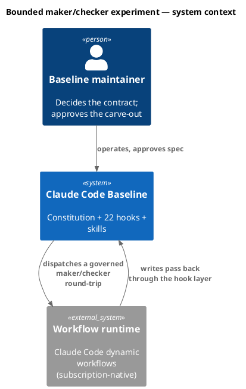
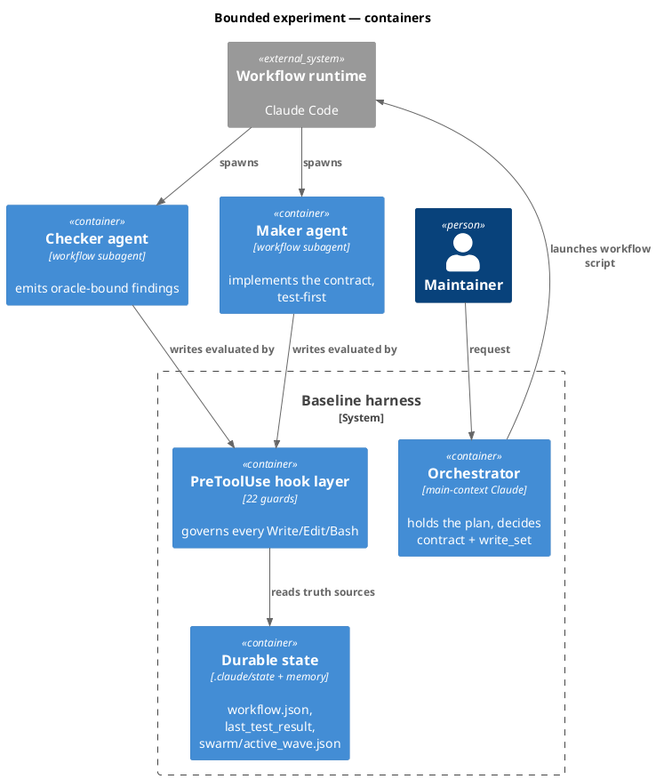
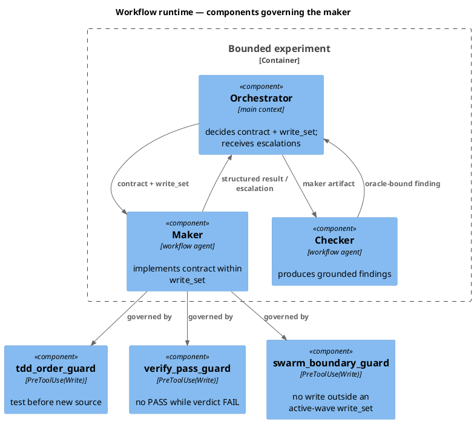
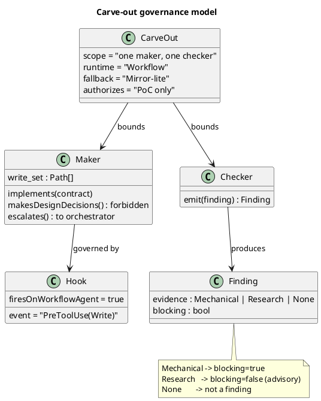
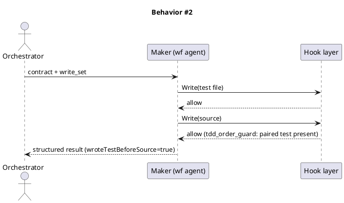
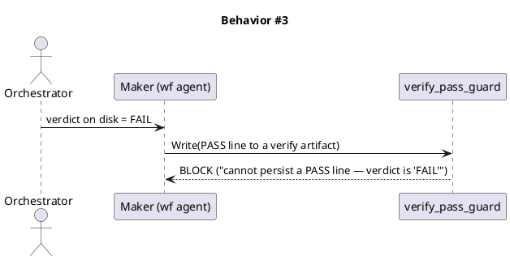
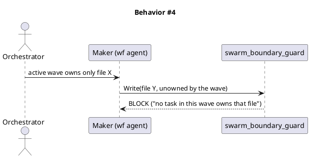
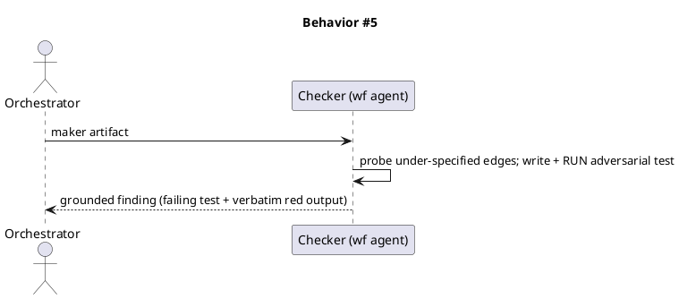
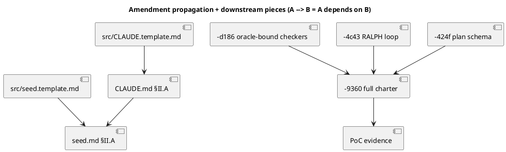

# Spec — maker-checker-poc

Retrospective spec (freeform track). Written **after** the proof-of-concept, grounded in results. Primary input: `docs/brief/maker-checker-poc.md`. Carries (a) a minimal constitutional amendment and (b) the PoC evidence that justifies it.

## Context

The v1 "thought compiler" backlog (`docs/vision/baseline-v1-thought-compiler.md` Part 5) needs an execution substrate for a governed maker/checker loop. Two candidates were eliminated this session:

- **Agent teams** — teammates cannot spawn subagents (verified against the docs), so a maker-swarm-inside-a-teammate is impossible. Agent teams also share one working dir with no worktree isolation.
- **Agent-SDK orchestrator (Mirror-true)** — would require either subscription credentials for programmatic SDK use (a ToS problem) or per-token **API billing**, which detonates the economics of a token-heavy multi-agent loop. The baseline's whole proposition is flat-rate execution inside a Claude Code session.

That leaves **Claude Code's dynamic Workflow runtime**, which is **subscription-native** (runs as normal plan usage, *not* API billing — this is *why* it was chosen over the SDK), gives deterministic code-driven control flow, worktree isolation per agent, and structured (schema-validated) output. The open risk was governance: *does the constitution's hook layer reach workflow agents?* If not, makers would write code ungoverned. This spec records the PoC that answered that, and the minimal Article II carve-out that legalizes it.

Article II currently forbids subagents from making design decisions and ships exactly one subagent (`swarm-worker`). A bounded maker/checker experiment needs a narrow, explicit exception — written minimally now, with the full charter deferred to backlog `-9360`.

## Goal

Land a **minimal Article II carve-out** (`§II.A`) that permits ONE bounded maker/checker experiment on the Workflow runtime under full hook governance, and record the empirical evidence that the substrate is functional, governable, and oracle-capable.

## Non-goals

- The full agent-team architecture, the tier dial (`-1a2d`), the mutation oracle (`-f029`), the durable plan schema (`-424f`), the gate taxonomy / debugging skill / v2 (`-9008`).
- More than one maker and one checker; fan-out, waves, panels.
- Finalizing the real Article II amendment — that is `-9360`, written *from* this PoC's evidence.

## Design

The change is governance text plus its byte-equal mirrors. The amendment lands in `docs/init/seed.md §Article II` **first** (genesis governs, Art. I.4), then mirrors into `CLAUDE.md §Article II`, `src/CLAUDE.template.md`, and `src/seed.template.md`.

### The amendment text (`§II.A`)

> **§II.A — Bounded maker/checker experiment (v1 PoC carve-out).** Notwithstanding §II's general rule that subagents only execute pre-decided recipes, ONE bounded maker/checker experiment MAY execute on Claude Code's dynamic Workflow runtime, subject to **all** of:
> 1. **Pre-decided contract.** The maker implements a contract decided in main context, within an explicit `write_set`; it makes no design or scope decisions.
> 2. **Oracle-bound checker.** Findings are ranked by evidence: a finding backed by a **mechanical** artifact (failing test, guard block, structural violation) is **blocking**; a finding backed by **research/documentation** evidence (a cited best-practice or API contract) is **advisory** — surfaced and labeled lower-confidence, never blocking on its own; a bare opinion with no evidence is not a finding.
> 3. **Hook governance is mandatory.** All workflow-agent writes remain under the live PreToolUse hooks. Empirically confirmed this PoC: `tdd_order_guard`, `verify_pass_guard`, and `swarm_boundary_guard` fire on workflow agents.
> 4. **Escalation bounces up.** Any scope or `write_set` escalation returns to the main-context orchestrator; workers never widen scope themselves.
> 5. **Fallback.** When the Workflow runtime is unavailable or disabled, the experiment falls back to Mirror-lite turn-by-turn swarm.
> 6. **Bounded.** This authorizes the PoC only — one maker, one checker. The general agent-team charter (multiple makers/checkers, plan schema, tier dial) requires the full amendment, backlog `-9360`.

### C4 — System context

### C4 — Container

### C4 — Component (changed containers only)

### Data model — class diagram

No datastore — this is a governance change. The class diagram models the carve-out's conceptual structure (the rule, not a schema).

#### Migration DDL

None. This change touches governance documents (`seed.md`, `CLAUDE.md`) and their byte-equal mirrors; there is no schema or data migration.

### Behavior — sequence per AC

#### Behavior #2 — maker is governed (test-first)

#### Behavior #3 — verify_pass_guard fires in the maker context

#### Behavior #4 — swarm_boundary_guard fires in the maker context

#### Behavior #5 — checker emits an oracle-bound finding

### State — core entity *(only if stateful)*

Not stateful in the product sense. The PoC relied on existing state truth-sources only: `.claude/state/last_test_result` (verify_pass_guard) and `.claude/state/swarm/active_wave.json` (swarm_boundary_guard, synthesized for the probe then torn down).

### Dependencies — graph

### Contracts

| Surface | Contract |
|---|---|
| `seed.md §II.A` | The six-clause carve-out, verbatim above. Genesis source of truth (Art. I.4). |
| `CLAUDE.md §II.A` | Byte-equal mirror of the seed clause (constitutional voice may use em dashes per X.1 scope-out). |
| `src/CLAUDE.template.md` | Byte-equal mirror of `CLAUDE.md` (audit-baseline enforces equality + 40,000-char cap). |
| `src/seed.template.md` | Byte-equal mirror of `seed.md`. |
| Maker (workflow agent) | Implements a main-context contract within `write_set`; returns structured result or escalation; no design decisions. |
| Checker (workflow agent) | Returns a schema-validated finding; `blocking` iff evidence is mechanical; research evidence is advisory. |

### Libraries and versions

| Library / platform | Version | Use | Verified |
|---|---|---|---|
| Claude Code dynamic Workflows | research preview, CLI ≥ v2.1.154 | execution substrate (`agent()` with `schema`/`isolation`) | Platform feature, not a third-party package — `context7` does not index it; confirmed against `code.claude.com/docs/en/workflows` this session and by running three workflows. |
| Node.js `node:assert/strict` | bundled (Node v25.8.1 observed) | the PoC's grounded-finding test harness | stdlib |

No third-party package APIs are introduced, so `context7` has no applicable lookup; the only external surface is the Claude Code platform itself, exercised empirically.

### Alternatives considered

| Alternative | Rejected because |
|---|---|
| Agent teams host the maker swarm | Teammates cannot spawn subagents (verified); no worktree isolation. |
| Agent-SDK orchestrator (Mirror-true) | Subscription ToS / API-billing economics break the flat-rate model. |
| Mirror-lite only (model-driven turn-by-turn) | Keeps control flow model-driven; forgoes deterministic code-driven orchestration the constitution wants. Retained as the **fallback**, not the substrate. |

## Design calls

(none — `write_set` is governance docs + mirrors; it does not intersect `tdd.ui_globs`, so there is no UI surface.)

## Acceptance criteria

| AC | Statement | Behavior | Evidence |
|---|---|---|---|
| AC-001 | `seed.md §II.A` contains all six clauses; `CLAUDE.md`, `src/CLAUDE.template.md`, `src/seed.template.md` mirror it; CLAUDE.md stays ≤ 40,000 chars. | Rollout | Verified by audit-baseline (mirror equality + size cap) at apply time. |
| AC-002 | A maker on the Workflow runtime is forced test-first. | §Behavior #2 | PoC: `wroteTestBeforeSource=true`; tdd_order_guard message captured in an earlier probe. |
| AC-003 | A workflow-agent write of `PASS` to a verify artifact while the verdict is FAIL is blocked. | §Behavior #3 | PoC verbatim: *"Verify Pass Guard: cannot persist a PASS line — the latest test verdict is 'FAIL'…"* |
| AC-004 | A workflow-agent write to a file no active-wave task owns is blocked. | §Behavior #4 | PoC verbatim: *"Swarm Boundary Guard: write to 'docs/__boundary_probe__.md' denied…"* |
| AC-005 | The checker emits ≥1 oracle-bound (mechanical) finding; research evidence is advisory; opinion is not a finding. | §Behavior #5 | PoC: `parseIntList("1,,2") → [1,0,2]`, failing test reproduced independently (`EXIT=1`, `[1,0,2] ≠ [1,2]`). |
| AC-006 | When the runtime is unavailable/disabled, the experiment falls back to Mirror-lite. | §II.A clause 5 | Stated rule; not exercised in the PoC. |

## Test plan

- **Amendment (AC-001):** apply `§II.A` to `seed.md` first, then mirror into `CLAUDE.md` + both `src/*.template.md`. Run `audit-baseline` — it FAILs on mirror drift or the 40,000-char CLAUDE.md cap, so a green audit is the mechanical oracle for the edit. Confirm Article XI citations remain intact.
- **AC-002..AC-005:** already demonstrated empirically this session (three workflow runs); evidence is recorded above, not re-run. The grounded finding (AC-005) was independently reproduced outside the workflow.
- **AC-006:** documented rule; deferred to `-9360` for an exercised fallback test.
- **Regression:** the throwaway toy code (`src/poc`, `tests/poc`) was deleted; no product code remains from the PoC, so there is nothing to regress.

## Observability

The PoC's observability is the workflow run record (`/workflows` view: per-agent token + tool counts) and the verbatim guard messages captured in agent results. No production telemetry is introduced.

## Rollout

1. Edit `docs/init/seed.md §Article II` to add `§II.A` (genesis first).
2. Mirror byte-equal into `CLAUDE.md §Article II`, then `src/CLAUDE.template.md` and `src/seed.template.md`.
3. Run `audit-baseline`; resolve any mirror/size FAIL before commit.
4. No flag — the carve-out is constitutional text, in force on merge. Its scope is self-limiting (clause 6: PoC only).

## Rollback

Revert the `§II.A` edits across the four files in one commit; `audit-baseline` confirms the mirrors return to equality. No data or runtime state to unwind. Because the carve-out is text-only and bounded, rollback is a clean revert with no migration.

## Archive plan

Default bundle: every `maker-checker-poc.*` file in the workflow directories (`docs/brief/`, `docs/specs/`). Extras: *(none)* — the toy code was already discarded; the workflow scripts are session-transient under `.config/`.

## Open questions

- **`swarm_boundary_guard` is swarm-wave-scoped** (inert unless `.claude/state/swarm/active_wave.json` exists). It fired only when wave-state was synthesized. The full architecture (`-9360`) must add **either** synthesized wave-state for workflow makers **or** a dedicated workflow-maker `write_set` guard. Captured as a finding, not a blocker (maintainer decision).
- Prototype disposition resolved: toy code discarded; evidence preserved here.
