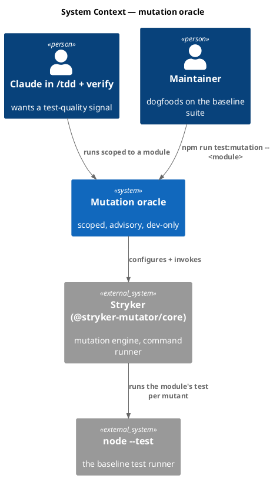
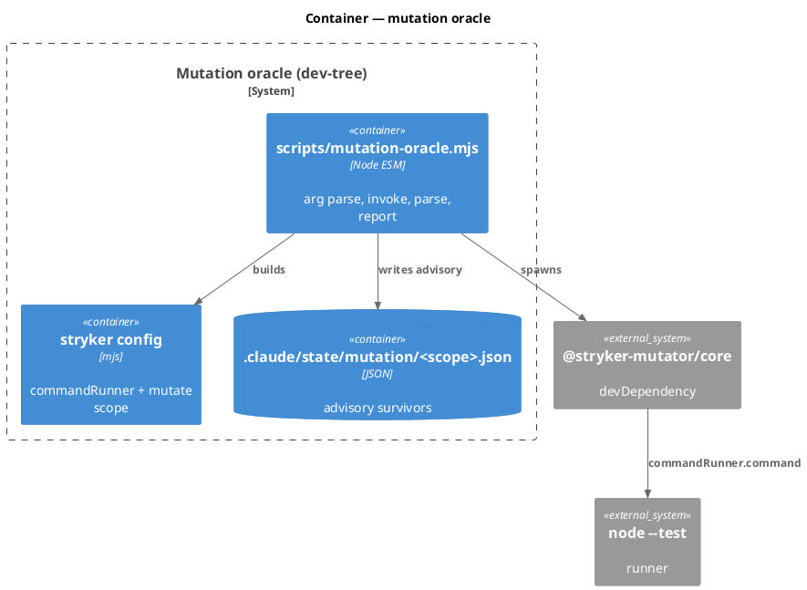
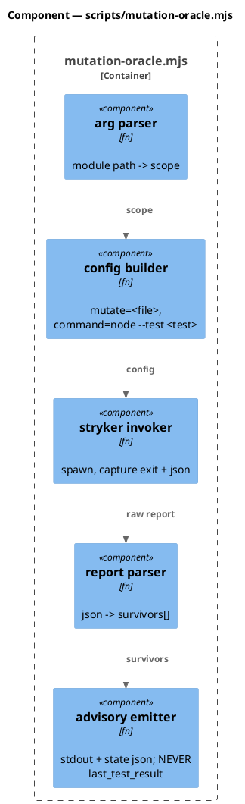
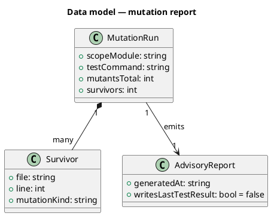
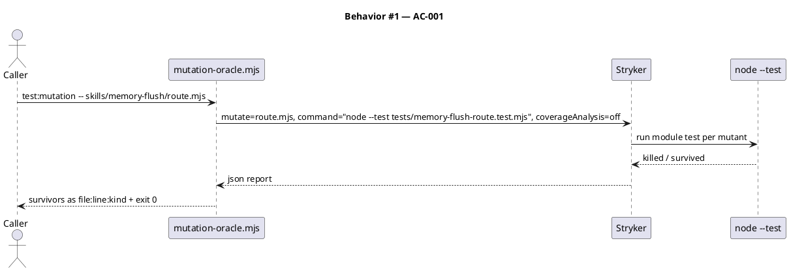
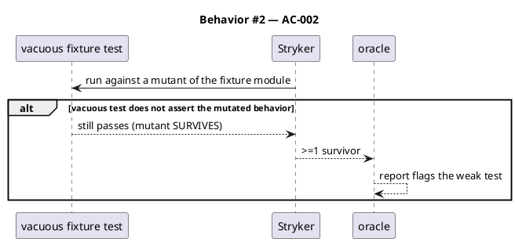
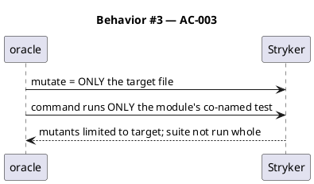
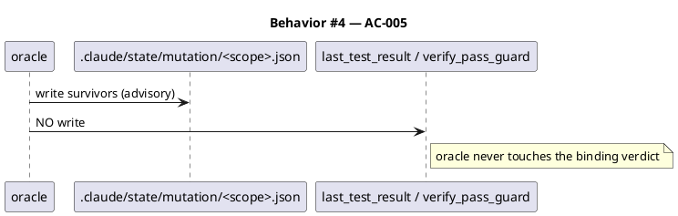
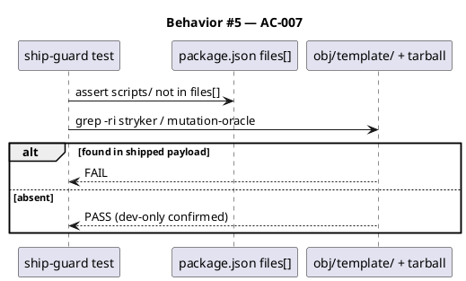
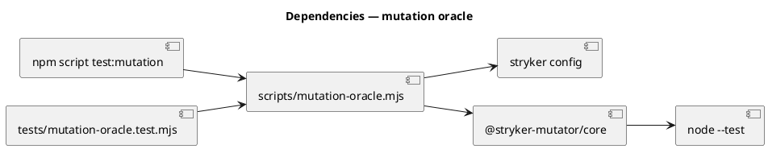

# Spec — Scoped mutation-testing oracle (advisory, dev-only)

<!-- Technical spec. Approval is the /approve-spec token — never write Status: Approved. -->

## Context

| Input | Path |
|---|---|
| Intake | `docs/intake/mutation-testing-oracle.md` |
| Scout | `docs/scout/mutation-testing-oracle.md` |
| Research | `docs/research/mutation-testing-oracle.md` |
| Brief | `docs/brief/mutation-testing-oracle.md` |
| Codesign state | `.claude/state/codesign/mutation-testing-oracle.json` |

## Goal

A scoped, dev-only mutation-testing oracle (`npm run test:mutation -- <module>`) drives Stryker over one target module against the baseline's `node --test` suite, prints surviving mutants as `file:line:mutation-kind`, and writes an advisory JSON report — never touching `last_test_result` and never shipping to consumers.

## Non-goals

- Whole-repo mutation per run (perTest is unavailable with Stryker's command runner — scope is mandatory).
- Blocking commits/CI on a mutation score (advisory only).
- The configurable tier dial (`-1a2d`) — defaults hardcoded; read from one obvious place so the dial can override later.
- Replacing `node --test` or adding coverage tooling.
- Shipping the oracle to consumer projects (explicitly dev-only this cut).

## Decisions

### Decision: D1 — Mutation tool / dependency strategy

**Options considered:** Stryker @stryker-mutator/core (dev-dep) / Home-grown AST mutator (zero-dep)
**Chosen:** Stryker @stryker-mutator/core as a dev-dependency, with a tested non-shipping invariant (consumer-exposure guard).
**Engineer rationale (verbatim):**
> I accept 1 but how will you ensure it is not shipped to consumers?

**Resolution (baked into AC-007):** three enforced layers — (1) Stryker is a `devDependency`, never installed by `npx create-baseline` consumers; (2) the wrapper lives in `scripts/`, absent from the npm `files` whitelist `["bin/","src/","obj/template/","README.md"]`; (3) it is not a `.claude/` skill, so nothing in the shipped template references it. AC-007 asserts `obj/template/` and the packed tarball contain no `stryker` / wrapper reference.

**Dismissed alternatives:**
- Home-grown AST mutator — Reimplements a mature tool (against seed.md reuse rule); needs a parser dep anyway; inferior operators/reporting. Kept as the fallback only if the Stryker tree were judged unacceptable.

### Decision: D2 — Scope unit

**Chosen:** Named target module — the oracle takes a module path arg, mutates that one file, and runs only its co-named test. Bounds per-mutant cost. Changed-files can layer on later.

### Decision: D3 — Integration seam

**Chosen:** Standalone `npm run test:mutation` → a pure `scripts/` `.mjs` wrapper that shells Stryker, parses its JSON, prints survivors, and writes `.claude/state/mutation/<scope>.json`. Never writes `last_test_result`; does not bump skill/hook/command governance counts.

### Decision: D4 — AC-002 dogfood target

**Chosen:** `.claude/skills/memory-flush/route.mjs` — pure routing logic, no I/O, co-named test; fast per-mutant runs.

## Design

Diagrams are the contract.

### Write set

- `package.json` — add `@stryker-mutator/core` to `devDependencies`; add `"test:mutation"` script.
- `scripts/mutation-oracle.mjs` — NEW. The wrapper (arg parse → Stryker config → invoke → parse report → advisory output). Dev-tree, not shipped.
- `stryker.config.mjs` (or inline config built by the wrapper) — NEW. Command runner + `mutate` scoping. Dev-tree.
- `tests/mutation-oracle.test.mjs` — NEW. Unit tests for the wrapper's pure parts (arg→config mapping, report parsing, advisory-shape) + AC-007 ship-guard assertion.
- `tests/fixtures/mutation-oracle/` — NEW. A deliberately-vacuous test fixture for AC-002.

No write-set file matches `project.json → tdd.ui_globs` — no UI surface.

### C4 — System context



### C4 — Container



### C4 — Component (changed container: the wrapper)



### Data model — class diagram



#### Migration DDL

```sql
-- No database in scope. "Migration" = npm install of the new devDependency + the new dev-tree files.
```

### Behavior — sequence per AC

#### §Behavior #1 — scoped run reports survivors



#### §Behavior #2 — vacuous test surfaces a survivor



#### §Behavior #3 — scope is bounded (no whole-repo)



#### §Behavior #4 — advisory only, never flips the gate



#### §Behavior #5 — non-shipping invariant



### State — N/A

No runtime state machine; the advisory report is a flat artifact.

### Dependencies — graph



### Contracts

| Kind | Name | Input | Output | Errors | Idempotent |
|---|---|---|---|---|---|
| CLI | `npm run test:mutation -- <module>` | a module path | survivors to stdout + `.claude/state/mutation/<scope>.json` | exit≠0 on stryker/internal error (not on survivors) | yes |
| Test | `mutation-oracle.test.mjs` | wrapper pure fns + fixtures | pass | FAIL on regression | yes |
| Test | ship-guard (AC-007) | repo build output | pass | FAIL if stryker/wrapper in shipped payload | yes |

### Libraries and versions

| Library@version | Purpose | Key APIs | Confirmed via context7 |
|---|---|---|---|
| `@stryker-mutator/core` (latest major; pins at install) | mutation engine | `commandRunner.command`, `mutate`, `coverageAnalysis:"off"` (perTest unsupported by command runner), `--incremental` | yes (`/stryker-mutator/stryker-js`) |

### Alternatives considered

| Alt | Summary | Rejected because |
|---|---|---|
| Home-grown AST mutator | zero-dep custom mutator | reimplements a mature tool; needs a parser dep anyway (D1) |
| Custom Stryker node:test runner | unlocks perTest | large maintenance surface; upgrade path, not first cut |

## Design calls

No write-set file intersects `project.json → tdd.ui_globs`.

- *(none)*

## Acceptance criteria

| ID | Criterion (given / when / then) | Upstream AC | Sequence |
|---|---|---|---|
| AC-001 | given a target module with a real test, when `test:mutation -- <module>` runs, then it reports survivors as `file:line:mutation-kind` and exits 0. | intake AC-001 | §Behavior #1 |
| AC-002 | given a deliberately-vacuous test fixture, when the oracle runs on it, then ≥1 surviving mutant is reported. | intake AC-002 | §Behavior #2 |
| AC-003 | given the scope arg, when the oracle runs, then only the target file is mutated and only its co-named test is run (not the whole suite). | intake AC-003 | §Behavior #3 |
| AC-004 | given the bare `node --test` runner, when the oracle runs, then it drives that runner via Stryker's command runner with no Jest/Mocha/Vitest dependency added. | intake AC-004 | §Behavior #1 |
| AC-005 | given the oracle produces findings, when it finishes, then `.claude/state/last_test_result` is unchanged and no verify/commit gate flips. | intake AC-005 | §Behavior #4 |
| AC-006 | given the full suite + `audit-baseline`, when the change lands, then both stay green/PASS and the new helper is `.mjs` (no new Python). | intake AC-006 | §Behavior #1 |
| AC-007 | given the npm `files` whitelist + build output, when packed, then `obj/template/` and the tarball contain no `stryker` reference and no `scripts/mutation-oracle.mjs` (dev-only confirmed). | D1 verbatim | §Behavior #5 |

## Test plan

| Category | Scenario | Expected | Covers |
|---|---|---|---|
| Golden path | oracle on memory-flush/route.mjs (real test) | survivors listed, exit 0 | AC-001, AC-004 |
| Golden path | vacuous fixture | ≥1 survivor | AC-002 |
| Input boundary | scope arg points at one file | only that file mutated; only its test run | AC-003 |
| Contract violation | oracle run | last_test_result byte-identical before/after | AC-005 |
| Failure mode | stryker missing/errors | non-zero exit + clear message, no partial report | AC-001 |
| Regression trap | ship-guard: files[] excludes scripts/; tarball/obj free of stryker+wrapper | unchanged | AC-007 |
| Regression trap | full suite + audit-baseline | green/PASS | AC-006 |

## Observability

| Signal | Name | Shape | Purpose |
|---|---|---|---|
| Report | `.claude/state/mutation/<scope>.json` | `{scopeModule, mutantsTotal, survivors[], generatedAt}` | advisory test-quality |
| Stdout | survivor list | `file:line:kind` lines | human/loop read |

## Rollout

- **Feature flag**: none — additive dev tool, off unless invoked.
- **Migration order**: 1 add devDependency + `npm install` → 2 add `scripts/mutation-oracle.mjs` + config → 3 add `test:mutation` script → 4 add tests + vacuous fixture → 5 dogfood on route.mjs.
- **Canary**: run `npm run test:mutation -- .claude/skills/memory-flush/route.mjs` locally; confirm survivors print and `last_test_result` is untouched.

## Rollback

- **Kill-switch**: `git revert` the commit + `npm install` (drops the devDependency). No runtime surface to disable.
- **Signal to roll back**: ship-guard test FAIL (stryker leaked to shipped payload) or any suite/audit regression.

## Archive plan

- Defaults *(automatic)*: intake, brief, scout, research, spec, spec approval, security report.
- Extras *(list any non-default files)*:
  - *(none)*

## Open questions

- *(none — D1–D4 resolved at codesign; changed-files scoping and a custom perTest runner are explicit deferred upgrades, not open questions for this cut.)*
