# Spec — Deterministic, fast default test tier (always-on isolated smoke + gated heavy publish tier, isolate live-tree readers, skip redundant build re-hash)

## Context

| Input | Path |
|---|---|
| Intake | `docs/intake/reduce-test-suite-runtime.md` |
| Brief | `docs/brief/reduce-test-suite-runtime.md` |
| Scout | `docs/scout/reduce-test-suite-runtime.md` |
| Research | `docs/research/reduce-test-suite-runtime.md` |

## Goal

`node --test tests/*.test.mjs` runs a **default tier** that is deterministic (green on repeated parallel runs) and materially faster than today's ~94s, by: (1) keeping a single **always-on packaging smoke** that runs **once and in an isolated tmp clone** (so it is never a live-`obj/template` writer); (2) moving the heavy install/publish tests behind a `PUBLISH_TESTS=1` gate (on-demand); (3) isolating every remaining live-`obj/template` reader; and (4) skipping the redundant post-fresh-build hash re-computation — with zero loss of coverage or verdict fidelity.

## Non-goals

- Not deleting, weakening, or permanently disabling any test — gated tests still run on demand and in CI (coverage + verdict-fidelity non-goals).
- Not migrating off `node:test` or adding a test framework.
- Not redesigning `scripts/build-template.sh` / `build-manifest.mjs` beyond the single redundant-rehash skip.
- Not the `--test-global-setup` "build once" rework (research Candidate B) — held as future work; out of scope unless A+C miss target.
- Not a hard ≤60s contractual ceiling — the target is directional (brief: "push as far as practical").

## Design

Diagrams are the contract. Prose is only for things a diagram cannot say.

The "system" is the local test-suite execution pipeline. The change splits the existing flat test set into:

- a **default tier** — fast, deterministic, **no live-tree writers**. It includes an **always-on packaging smoke** (one isolated `npm pack` in a tmp clone, run once, asserting the tarball file list) plus the existing fast static checks (`check-files-diff`, `release-workflow`, site/eleventy tests);
- an **opt-in heavy tier** (`PUBLISH_TESTS=1`) — the slow install/publish tests (`publish-check`, `smoke-tarball`), run on demand / on recommendation.

It also makes every default-tier test that needs the built tree read an **isolated build** rather than the live `obj/template`, and removes one redundant hash pass inside `build-template.sh`. The always-on smoke avoids the race cheaply: a bare `npm pack` triggers `prepack` → `build-template.sh`, which rebuilds the live `obj/template` — the exact race writer — so the smoke runs `npm pack --dry-run --ignore-scripts`, which skips `prepack` entirely. The file list is read from the already-built tree, so the smoke stays always-on, deterministic, and cheap (no rebuild, no rsync) — strictly better than a tmp-clone rebuild for satisfying "never writes the live tree."

### C4 — System context

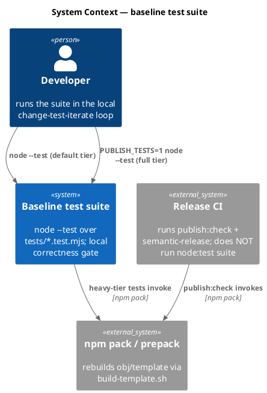

### C4 — Container

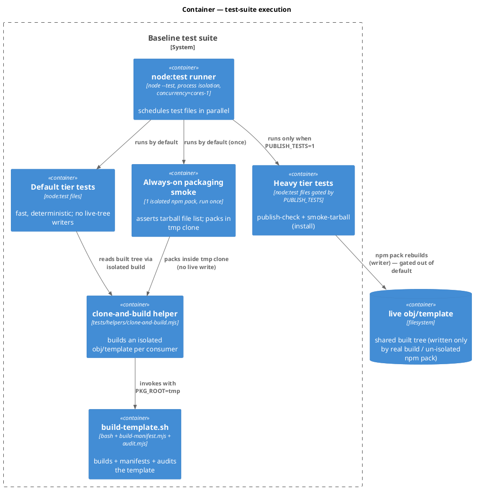

### C4 — Component (changed container: the test set + build script)

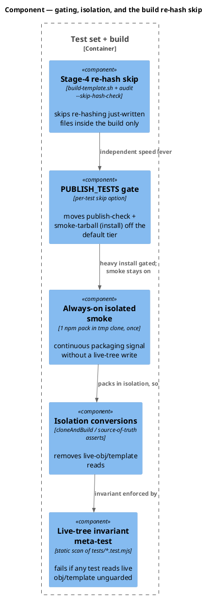

### Data model — class diagram

Models the test-execution taxonomy and the build re-hash contract (no database; see DDL note).

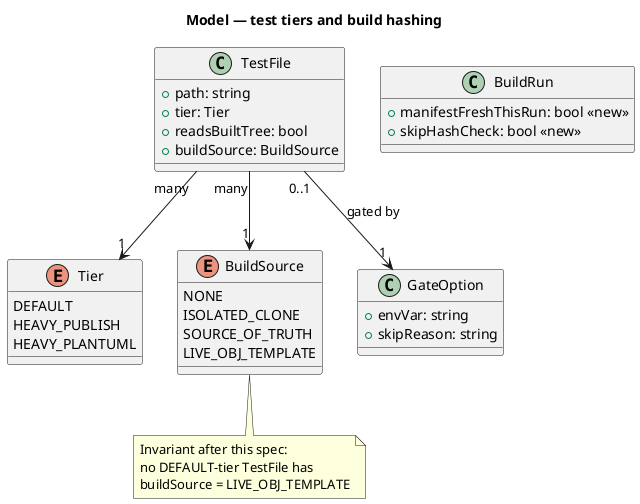

#### Migration DDL

```sql
-- N/A — no database. The "schema" is the test-tier + build-flag model above.
-- The <<new>> fields map to: a `--skip-hash-check` flag on audit.mjs and the
-- build-internal decision in build-template.sh Stage 4 (no persisted state).
```

### Behavior — sequence per AC

#### §Behavior #1 — default tier always runs the isolated smoke; heavy install tests gated

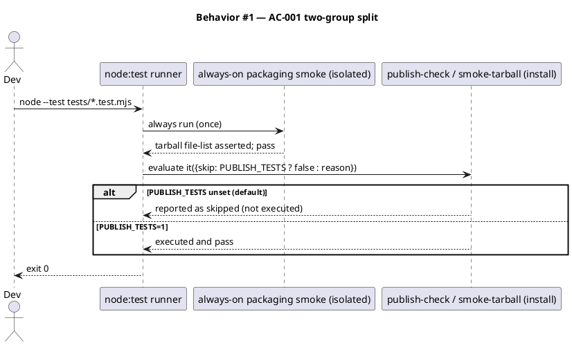

#### §Behavior #2 — no live-tree writer in the default run (smoke packs in isolation)

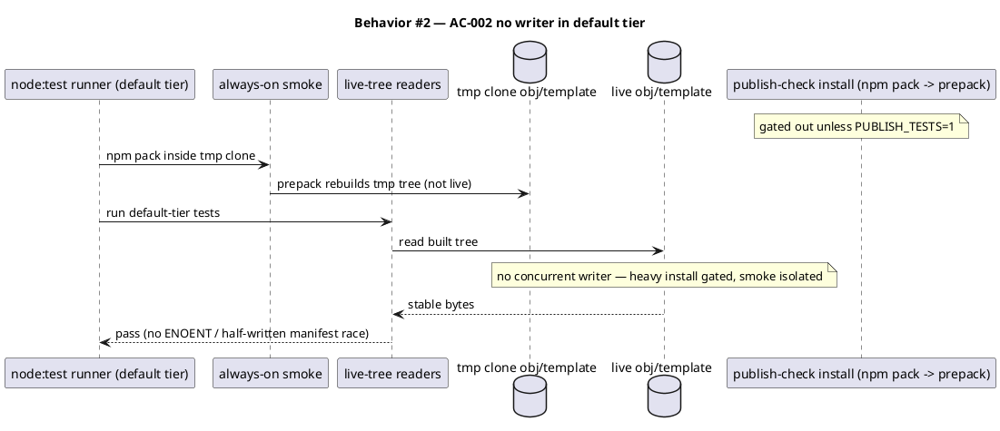

#### §Behavior #3 — no default-tier test reads the live built tree

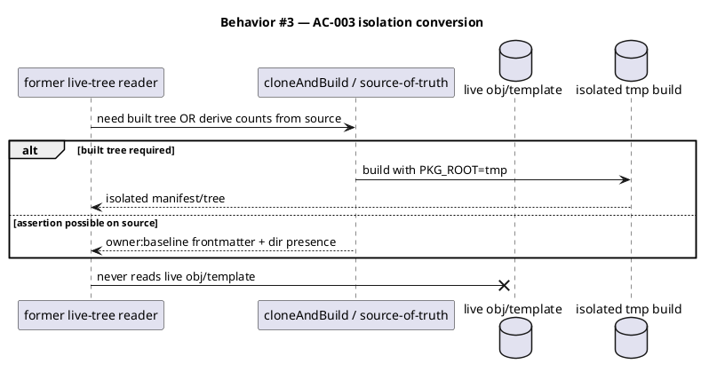

#### §Behavior #4 — meta-test enforces the live-tree-read invariant

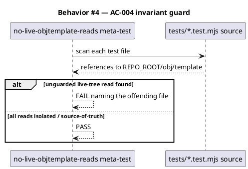

#### §Behavior #5 — parallel determinism across repeated runs

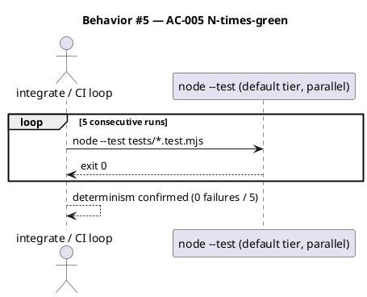

#### §Behavior #6 — build skips redundant re-hash; standalone audit keeps full hashing

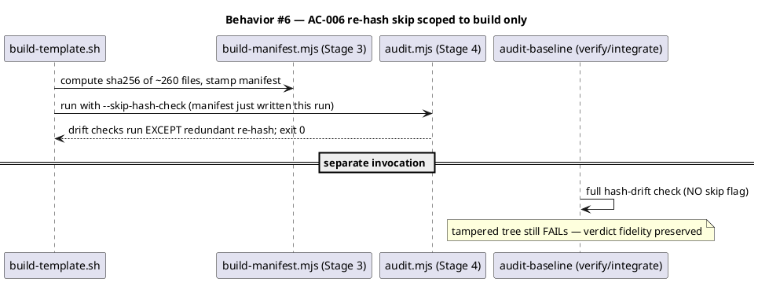

### State — core entity

No non-trivial runtime state machine. The only stateful artifact is the build's per-run `manifestFreshThisRun` decision, which lives entirely within one `build-template.sh` invocation and is not persisted. Heading retained to record the explicit choice.

### Dependencies — graph

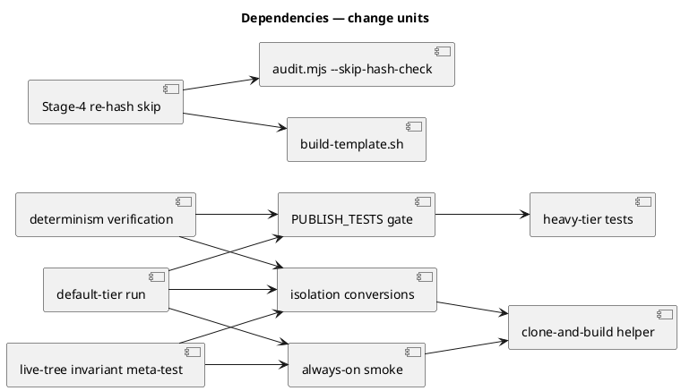

### Contracts

| Kind | Name | Input | Output | Errors | Idempotent |
|---|---|---|---|---|---|
| Env flag | `PUBLISH_TESTS` | `"1"` to run heavy install tier (`publish-check`, `smoke-tarball`); unset → skip | heavy tests run or report skipped | — | yes |
| Env flag | `PLANTUML_TESTS` | (unchanged) existing JVM-tier gate | — | — | yes |
| Test | always-on packaging smoke | runs by default, once | `npm pack --dry-run --ignore-scripts` (skips prepack/live write); asserts tarball excludes `obj/site`/`site-src`, includes template + bin | fail on missing/extra file | yes (no live write; idempotent) |
| CLI flag | `audit.mjs --skip-hash-check` | present → skip per-file hash re-compute | other drift checks unchanged | none | yes |
| npm script | `npm test` | — | default tier only | exit 1 on failure | yes |
| npm script | `npm run test:full` | sets `PUBLISH_TESTS=1 PLANTUML_TESTS=1` | every tier | exit 1 on failure | yes |

### Libraries and versions

| Library@version | Purpose | Key APIs | Confirmed via context7 |
|---|---|---|---|
| `node@25.8.1` (`node:test`) | test runner | `it({skip})` option; `--test-concurrency` default `os.availableParallelism()-1`; `--test-isolation=process` | yes (`/nodejs/node/v25.9.0`) |

No third-party libraries are added. `--test-global-setup` was evaluated (research Candidate B) and deliberately deferred.

### Alternatives considered

| Alt | Summary | Rejected because |
|---|---|---|
| B: `--test-global-setup` build-once | Build template once into a shared fixture | Largest effort + most shared-state risk; YAGNI if A+C hit target. Deferred, not discarded. |
| Serial-only verdict (status quo) | Keep `--test-concurrency=1` as the only trusted path | Leaves the inner-loop slowness unaddressed; the brief's whole point. |
| Delete/skip slow tests | Drop the heavy tests | Violates coverage + verdict-fidelity non-goals. |

## Design calls

*(none)* — the write_set touches `tests/**`, `scripts/build-template.sh`, `.claude/skills/audit-baseline/audit.mjs`, and `package.json`; none intersect `project.json → tdd.ui_globs`.

## Acceptance criteria

| ID | Criterion (given / when / then) | Upstream AC | Sequence |
|---|---|---|---|
| AC-001 | given default `node --test tests/*.test.mjs`, when run, then the always-on packaging smoke executes and the heavy install tests (`publish-check`, `smoke-tarball`) report as skipped; given `PUBLISH_TESTS=1`, when run, then the heavy install tests also execute and pass | intake AC-1, AC-4 | §Behavior #1 |
| AC-002 | given the default tier, when it runs, then no test in it writes the live `obj/template` — the heavy `npm pack` install tests are gated out, and the always-on smoke packs inside a tmp clone — so readers see a stable tree | intake AC-2 | §Behavior #2 |
| AC-003 | given any default-tier test that needs the built tree, when it runs, then it reads an isolated build (`cloneAndBuild`/`PKG_ROOT=tmp`) or asserts source-of-truth — never `<root>/obj/template` | intake AC-2, AC-5 | §Behavior #3 |
| AC-004 | given the test set, when the live-tree-invariant meta-test runs, then it FAILs iff any test file reads `<root>/obj/template` unguarded | intake AC-2 | §Behavior #4 |
| AC-005 | given the default tier run 5 consecutive times in parallel, when measured, then all 5 exit 0 (zero intermittent failures) | intake AC-1, AC-3 | §Behavior #5 |
| AC-006 | given a fresh build, when Stage 4 audit runs with `--skip-hash-check`, then it skips re-hashing just-written files but still exits 0; given standalone `audit-baseline` on a tampered tree, when run, then it still FAILs (no `--skip-hash-check`) | intake AC-5 | §Behavior #6 |
| AC-007 | given the default tier before/after this change on the same machine, when wall-clock is measured, then after-time is materially below the ~94s baseline and trends toward ~60s | intake AC-3 | §Behavior #5 |
| AC-008 | given the union of default ∪ `PUBLISH_TESTS` ∪ `PLANTUML_TESTS` tiers, when enumerated, then every assertion that runs today still runs in exactly one tier (no coverage deleted; the heavy tests' packaging assertions are preserved across the always-on smoke + the gated tier) | intake AC-1 | §Behavior #1 |
| AC-009 | given the always-on packaging smoke, when the default tier runs, then it performs its `npm pack` exactly once with `--ignore-scripts` (skips prepack → never rebuilds/writes the live `obj/template`) | intake AC-2, AC-5 | §Behavior #2 |

## Test plan

| Category | Scenario | Expected | Covers |
|---|---|---|---|
| Golden path | default `node --test` run | exit 0; always-on smoke runs; `publish-check`+`smoke-tarball` skipped | AC-001 |
| Golden path | `PUBLISH_TESTS=1 node --test` heavy tier | heavy install tests execute and pass | AC-001 |
| Golden path | always-on smoke packs once in tmp clone | tarball file-list assertions pass; live `obj/template` untouched | AC-009 |
| Contract | each gated file declares `{skip: process.env.PUBLISH_TESTS ? false : <reason>}` | gate present + reason string non-empty | AC-001, AC-008 |
| Invariant | meta-test scans `tests/*.test.mjs` for unguarded `obj/template` reads | FAIL on any offender, PASS when all isolated | AC-003, AC-004 |
| Concurrency | default tier run 5× in parallel | 5/5 exit 0 | AC-002, AC-005 |
| Failure mode | standalone `audit-baseline` on a tampered shipped file | FAILs (hash check intact) | AC-006 |
| Golden path | `build-template.sh` with Stage-4 `--skip-hash-check` | build exits 0, manifest correct | AC-006 |
| Regression trap | test-file count across all tiers unchanged vs HEAD | equal count (no test lost) | AC-008 |
| Regression trap | `whatsnew-counts` / `derive-counts` after isolation | same counts as source-of-truth | AC-003 |

## Observability

| Signal | Name | Shape | Purpose |
|---|---|---|---|
| Metric | default-tier wall-clock | `time node --test tests/*.test.mjs` real seconds | track AC-007 trend |
| Metric | determinism rate | failures / 5 consecutive parallel runs | AC-005 gate (must be 0/5) |
| Log | gated-skip notice | `it` skip reason string in reporter output | makes the heavy tier visible, not silently dropped |

## Rollout

- **Feature flag**: `PUBLISH_TESTS` (default unset → fast tier). Opt-in to the full local run; `npm run test:full` sets it.
- **CI parity**: `.github/workflows/release.yml` already runs `npm run publish:check` (which exercises npm pack / tarball / files-diff independently of the node:test suite), so gating those tests *locally* removes nothing from the path that actually gates publishing. No CI change required; document the tier split in the test README/CONTRIBUTING.
- **Order**: 1) add the always-on isolated packaging smoke (refactor today's `npm-pack-tarball` to pack in a tmp clone, once) and add the `PUBLISH_TESTS` gate to `publish-check` + `smoke-tarball`; 2) convert live-tree readers to isolated/source-of-truth + add the invariant meta-test; 3) add `--skip-hash-check` to `audit.mjs` and wire it into `build-template.sh` Stage 4; 4) add `test:full` script; 5) re-measure (5× determinism + wall-clock) and update the landmine.

## Rollback

- **Kill-switch**: unset `PUBLISH_TESTS` is already the default; to revert the gate, delete the `{skip}` options (one-line per test). To revert C, drop `--skip-hash-check` from the Stage-4 invocation — the audit then re-hashes as before. Each lever is independently revertible.
- **Signal to roll back**: if the default tier shows any failure in the 5× determinism check (determinism rate > 0/5), or if standalone `audit-baseline` stops failing on a tampered tree (verdict-fidelity regression), revert the offending lever immediately. Both are observable within one suite run (<2 min).

## Decisions

> **Q1 — residual live-tree writers (owner delegated the call to Claude).** Decision: proceed on the analysis that the live-`obj/template` writers are confined to the gated heavy `npm pack` install tests, with the always-on smoke isolated to a tmp clone. This is not asserted as proven — it is verified empirically as the FIRST task of Phase 6: re-run the default tier 5× (AC-005) and let the live-tree-read invariant meta-test (AC-004) surface any residual reader/writer. If a non-gated writer is found, isolate it before claiming AC-005. The spec's acceptance bar (5/5 green + meta-test) is the safety net regardless of the answer, so the risk of "missed a writer" is bounded to "D's scope grows by one isolation," not "the design is wrong."

> **Q2 — two-group split of the publish/pack tests (owner's call).** Decision: split into (a) an **always-on packaging smoke** that runs once with `npm pack --dry-run --ignore-scripts`, asserting the tarball file list (the single highest-value packaging signal) — it stays in the default tier and is deterministic because `--ignore-scripts` skips prepack so it never rebuilds/writes the live tree (cheaper than a tmp-clone rebuild; chosen during implementation as the better mechanism for the same AC intent); and (b) a **gated heavy tier** (`PUBLISH_TESTS=1`) holding the slow install/publish tests (`publish-check` — the 46s tent-pole — and `smoke-tarball`), run on demand / on recommendation. The fast static checks (`check-files-diff`, `release-workflow`) and the eleventy/site tests (`site-relative-paths`, `ga4-built-site`) are neither slow nor live-tree writers, so they stay in the default tier unchanged. Coverage is preserved (AC-008): the heavy tests' assertions remain runnable, and the always-on smoke keeps continuous packaging signal in every default run.

> **Verdict-path policy (deferred to spec time by the user at the scope gate).** Decision: **adopt the fast parallel default tier as the canonical `/integrate` + local verdict once AC-005 holds (5/5 green), and KEEP the serial `--test-concurrency=1` command documented as a fallback** rather than retiring it outright. Rationale: the serial path is the current safety net the landmine prescribes; retiring it the same change that introduces the parallel guarantee removes the fallback before the new guarantee has soak time. The landmine `live-objtemplate-rebuild-races-parallel-test-readers` is updated to: "default parallel tier is deterministic after the npm-pack writers are gated and live-tree readers isolated; serial run remains a fallback." A later workflow may retire the serial guidance once the parallel tier has proven stable in practice. This is the conservative, reversible choice consistent with the brief's verdict-fidelity non-goal.

## Archive plan

- Defaults *(automatic)*: intake, brief, scout, research, spec, spec-rendered/, spec approval, security report.
- Extras *(list any non-default files)*:
  - *(none)*

## Open questions

- Both prior open questions are now settled in `## Decisions` (Q1 residual-writers → proceed + verify 5×/meta-test; Q2 group split → always-on isolated smoke + gated heavy install tier). No remaining blockers.
- **Candidate B attempted and reverted (implementation finding).** After A+D+C achieved determinism (8/8 green) but wall-clock stayed ~90s, Candidate B (`--test-global-setup` build-once + cp-from-shared-clone) was attempted to cut the per-test build cost. It REGRESSED badly (~421s for 5 files). Root cause: `scripts/build-template.sh` holds a **machine-global mkdir mutex** (`$TMPDIR/create-baseline-build.lock.d`), so every build serializes machine-wide; the shared-clone cp path could not reliably eliminate enough builds to beat the contention, and fallback builds storm-serialized on the one lock. B was reverted. A future speed workflow must FIRST redesign that global mutex (per-PKG_ROOT lock, or a genuinely build-free shared fixture) before build-once can pay off. Re-backlog with this finding.
- Minor, settle in TDD: whether "once" for the always-on smoke means once-per-file (module-level memo, the spec's target) or strictly once-across-the-whole-suite (would require `--test-global-setup`, i.e. research Candidate B). The spec targets once-per-file isolation; strict once-across-suite is a future optimization, not required for determinism.
