# Spec — Hook-level enforcement of atomic backlog closure stamping

## Context

| Input | Path |
|---|---|
| Intake | *(none — spec-entry track)* |
| BRD *(if any)* | *(none)* |
| Scout *(if any)* | *(none)* |
| Research *(if any)* | *(none)* |
| Brief | `docs/brief/commit-closure-stamp-carry.md` |
| RCA (driver) | `docs/rca/2026-06-06-backlog-closure-stamp-stranded-post-commit.md` (AI-02/03/04) |

## Goal

`git_commit_guard` hard-blocks any `git commit` that stages a closing `workflow.json` (one with non-empty `source_backlog_keys`) unless the same commit also stages `backlog.md` with each of those keys stamped `status: picked-up` + `superseded-at` — making atomic closure unbypassable on every commit, while `/commit` stamps pre-stage and adds the `Closes <key>` reconciliation and clean-tree report at SOP level.

## Non-goals

- Not weakening the `--amend` hard-block or any existing `FORBIDDEN_RE` flag — the closure check runs only after those still deny.
- Not parsing the commit **message** inside the guard — message-dependent logic (`Closes <key>` reconciliation) stays at SOP level to avoid the `git-commit-guard-tokenize` classification-bug surface (see landmines).
- Not changing which keys are obligations — the staged `workflow.json → source_backlog_keys` is the sole signal; `/triage` still populates it.
- Not introducing a separate durable marker — the obligation is self-contained in the staged tree (D1).
- Not retaining the SHA-bearing `SHIPPED (commit X)` note — atomicity forbids a self-referential SHA, so it is dropped.

## Decisions

> **D1 — The obligation lives in the staged tree, not a marker.** At `git commit` time the live `.claude/state/workflow.json` is already archived (commit SOP Step 1) — but Step 3 *stages* the archived copy. The guard reads `source_backlog_keys` from the index (`git show :<staged workflow.json>`), so the obligation is exactly "this commit stages a closing workflow.json." No marker, no TTL, no clearing race. Commits that don't stage such a file (residue chores, swarm-worktree commits, CI, ordinary commits) are a clean no-op.

> **D2 — The guard inspects only the staged tree; never the message.** The unbypassable atomicity check (`workflow.json` keys ⊆ stamped staged `backlog.md`) needs no message parsing. The `Closes <key>` reconciliation (AI-04) is message-dependent, so it is enforced by `/commit`'s preflight helper, not the hard-block guard. This keeps the security-critical guard free of the quoting-blind message-parsing that the `git-commit-guard-*` landmines document as repeatedly bypass-prone.

> **D3 — Stamp logic lives in one shared lib.** `.claude/hooks/lib/closure-check.mjs` holds the "is key K stamped in this backlog text?" reader. Both `git_commit_guard` (enforcement) and `/commit`'s preflight helper (friendly pre-guard error + reconciliation) import it. Single source of truth; independently unit-testable.

> **D4 — This modifies a hook, so it carries a seed.md §4.1 amendment.** Per Article VIII, changing `git_commit_guard` requires explicit user approval (given at this gate) **and** a `seed.md` §4.1 amendment, mirrored to `src/seed.template.md`, with the CLAUDE.md Article VIII row updated and mirrored to `src/CLAUDE.template.md`. The amendment lands in the same `/tdd` pass as the guard change.

## Design

Diagrams are the contract. Prose is only for things a diagram cannot say.

### C4 — System context

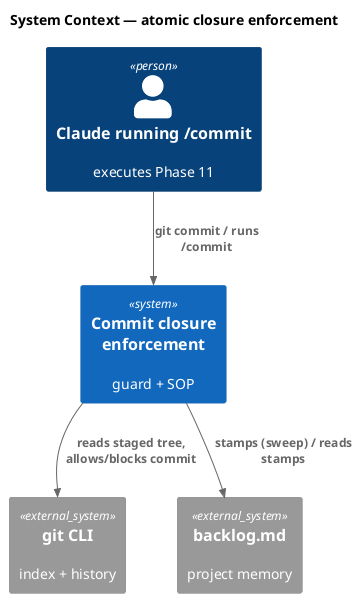

### C4 — Container

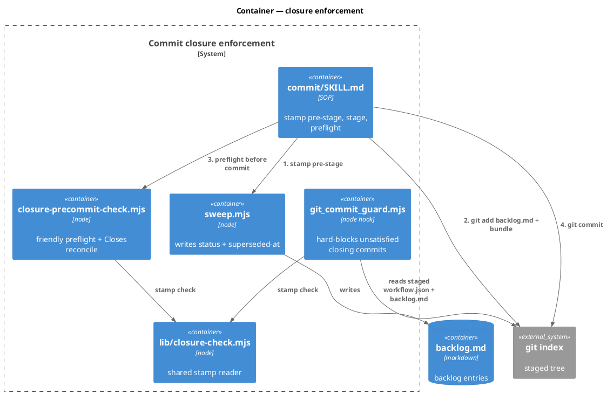

### C4 — Component (changed container only)

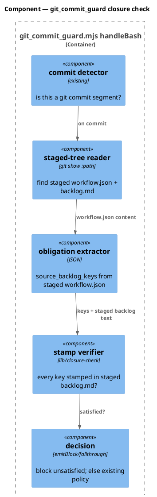

### Data model — class diagram

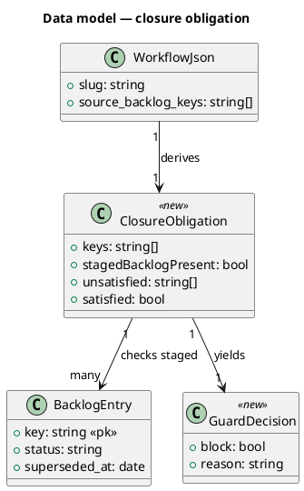

#### Migration DDL

```sql
-- No relational schema. backlog.md / workflow.json are flat files;
-- the class diagram models in-memory structures only. No DDL.
```

### Behavior — sequence per AC

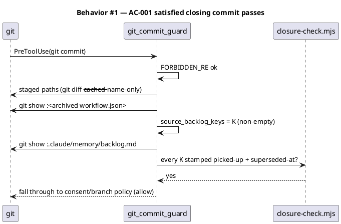

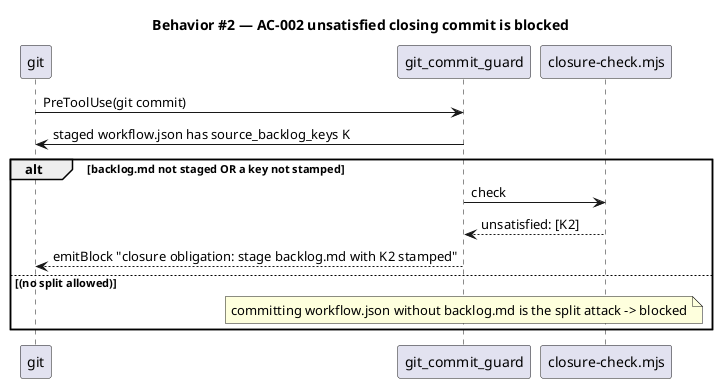

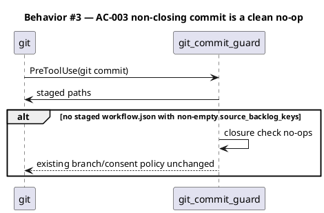

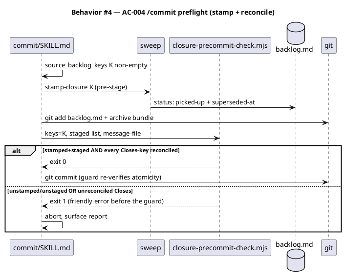

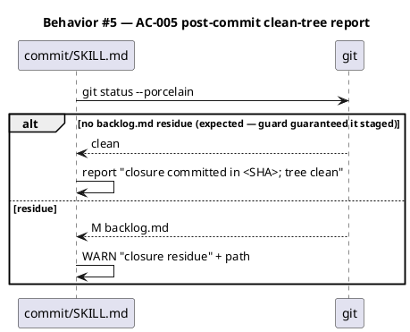

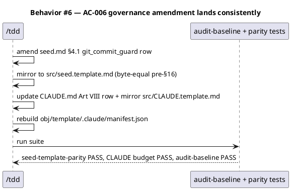

### State — core entity *(backlog entry closure)*

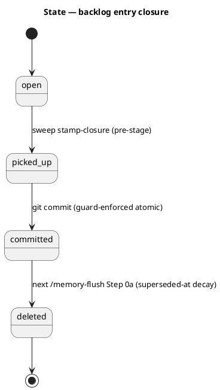

### Dependencies — graph

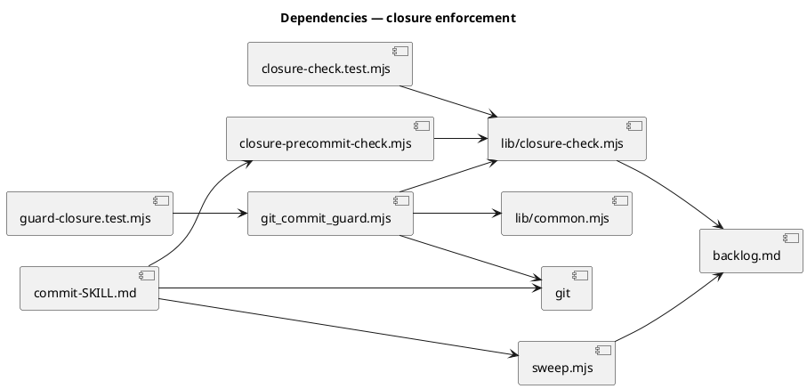

### Contracts

| Kind | Name | Input | Output | Errors | Idempotent |
|---|---|---|---|---|---|
| Hook | `git_commit_guard` Bash matcher, closure leg | the `git commit` cmd + staged index | `emitBlock` on unsatisfied closing commit; else fall through to existing consent/branch policy | block reason names the unsatisfied keys + remediation | yes (read-only on index) |
| Lib | `lib/closure-check.mjs → unsatisfiedKeys(backlogText, keys)` | staged backlog text + key list | `string[]` of keys not stamped `picked-up`+`superseded-at` (or absent) | — | yes (pure) |
| CLI | `closure-precommit-check.mjs --memory-dir <d> --backlog-keys <csv> --staged-file <p> [--message-file <p>]` | flags | JSON report; exit `0`/`1`/`2` | unreconciled `Closes`, unstamped, unstaged → 1; usage → 2 | yes (read-only) |
| CLI | `sweep.mjs --mode stamp-closure …` *(unchanged; header comment corrected)* | flags | `{stamped, missing, already_closed}` | usage → 2 | yes |

Closure-key grammar (preflight `Closes` parser only): `/\bCloses\s+(?:backlog\s+)?([a-z0-9][a-z0-9-]*-[0-9a-f]{4})\b/gi`. Staged-path globs the guard scans for an obligation: any staged path ending `workflow.json` (covers `docs/archive/*/*/workflow.json` and a directly-staged `.claude/state/workflow.json`).

### Libraries and versions

| Library@version | Purpose | Key APIs | Confirmed via context7 |
|---|---|---|---|
| *(none — node stdlib + git CLI)* | `node:fs`, `node:util` `parseArgs`, `node:child_process` `spawnSync` (git, read-only) | — | n/a (no third-party API) |

### Alternatives considered

| Alt | Summary | Rejected because |
|---|---|---|
| A | Separate durable `closure_pending` marker the guard reads | Needs a write/clear/TTL lifecycle and an over-block window if the closing commit is deferred. The staged archived `workflow.json` (D1) is a self-clearing signal already in the tree. |
| B | Put `Closes <key>` reconciliation in the guard too | Re-opens the quoting-blind message-parsing surface the `git-commit-guard-tokenize` / consent-msg landmines document as repeatedly bypass-prone in this exact guard. Kept at SOP (D2). |
| C | SOP-helper only (no guard) — the prior spec | User chose unbypassable hook-level enforcement; SOP-only repeats the unenforced-rule root cause. |
| D | Duplicate stamp-reader in guard and helper | Two readers drift. One shared `lib/closure-check.mjs` (D3). |

## Design calls

The write_set has no UI files (it does not intersect `project.json → tdd.ui_globs`).

- *(none)*

## Acceptance criteria

| ID | Criterion (given / when / then) | Upstream AC | Sequence |
|---|---|---|---|
| AC-001 | given a `git commit` staging a `workflow.json` with non-empty `source_backlog_keys` K AND a staged `backlog.md` where every K is stamped `picked-up`+`superseded-at`, when the guard runs, then the closure leg passes and control falls through to the existing consent/branch policy | RCA AI-02 | §Behavior #1 |
| AC-002 | given such a commit where `backlog.md` is not staged OR any K is unstamped/absent, when the guard runs, then it `emitBlock`s naming the unsatisfied keys (the split attack — committing `workflow.json` without `backlog.md` — is blocked) | RCA AI-02 | §Behavior #2 |
| AC-003 | given a `git commit` that stages no `workflow.json` with non-empty `source_backlog_keys`, when the guard runs, then the closure leg no-ops and existing behavior is byte-for-byte unchanged | back-compat | §Behavior #3 |
| AC-004 | given `/commit` with non-empty `source_backlog_keys`, when it runs, then it stamps pre-stage, stages `backlog.md`, and the preflight helper aborts with a friendly error (before the guard) on an unstamped/unstaged key or an unreconciled `Closes <key>` | RCA AI-02/AI-04 | §Behavior #4 |
| AC-005 | given `/commit` finished, when it reports, then it runs `git status --porcelain` and surfaces any residual `backlog.md` dirtiness (expected none) | RCA AI-03 | §Behavior #5 |
| AC-006 | given the guard change, when `/tdd` lands it, then `seed.md §4.1` + `CLAUDE.md` Art VIII are amended with byte-equal `src/` mirrors and a rebuilt manifest, and `seed-template-parity` / CLAUDE-budget / `audit-baseline` all pass | Art. VIII (D4) | §Behavior #6 |

## Test plan

| Category | Scenario | Expected | Covers |
|---|---|---|---|
| Golden path | staged `workflow.json` keys=[K]; staged `backlog.md` has K `picked-up`+`superseded-at` | closure leg passes; decision falls through | AC-001 |
| Contract violation | staged `workflow.json` keys=[K]; `backlog.md` NOT in staged set (split attack) | `emitBlock`, reason lists K, remediation | AC-002 |
| Contract violation | staged `workflow.json` keys=[K]; `backlog.md` staged but K `status: open` | `emitBlock`, unsatisfied:[K] | AC-002 |
| Contract violation | staged `workflow.json` keys=[K1,K2]; only K1 stamped | `emitBlock`, unsatisfied:[K2] | AC-002 |
| No-op | commit stages code only, no `workflow.json` | closure leg silent; existing policy result unchanged | AC-003 |
| No-op | commit stages `workflow.json` with empty `source_backlog_keys` | closure leg silent | AC-003 |
| Adversarial | `git commit -F <file>` and heredoc `-m` forms | closure leg reads index, not message; verdict unaffected by message form | AC-001/002 |
| Adversarial | `--amend` present | FORBIDDEN_RE blocks first; closure leg never reached | non-goal guard |
| Interaction | unsatisfied closure on a non-protected branch (no consent needed) | still blocked by closure leg (closure precedes/!=consent) | AC-002 |
| Lib unit | `unsatisfiedKeys(text, [K])` over stamped/unstamped/absent fixtures | correct key lists | AC-001/002 |
| Preflight | helper: unreconciled `Closes other-aaaa` not in keys | exit 1 | AC-004 |
| Preflight | helper: `Closes` parser variants (`Closes K`, `Closes backlog K`, case, punctuation) | extracts K; no false key from prose | AC-004 |
| Regression | `sweep.mjs modeStampClosure` still writes only `status`+`superseded-at` (no SHA/caveat) | unchanged | AC-004 |
| Regression (governance) | `seed-template-parity`, CLAUDE 34k-budget + binding-markers, `audit-baseline`, no-python3 ledger | all PASS after amendment + manifest rebuild | AC-006 |
| Regression (SOP scan) | `commit/SKILL.md`: stamp/stage precedes `git commit`; no `SHIPPED (commit` literal; post-commit status report present | invariant holds | AC-004/005 |

## Observability

| Signal | Name | Shape | Purpose |
|---|---|---|---|
| Log | `git_commit_guard` closure block | `logLine(HOOK, "BLOCKED closure obligation keys=…")` | audit a blocked closing commit |
| Log | `closure-precommit-check` JSON report | `{ok, unstamped, unstaged, unreconciledCloses}` | friendly preflight verdict |
| Log | `/commit` post-commit status line | `closure committed in <SHA>; tree clean` / `WARN residue` | operator visibility (AI-03) |

No metrics/alarms — dev-time tooling.

## Rollout

- **Feature flag**: none. The guard leg activates only when a commit stages a `workflow.json` with non-empty `source_backlog_keys`; all other commits are unchanged (AC-003).
- **Migration order**: 1) add `lib/closure-check.mjs` + tests; 2) add closure leg to `git_commit_guard.mjs` + tests; 3) `closure-precommit-check.mjs` + `commit/SKILL.md` edits; 4) `sweep.mjs` header comment; 5) amend `seed.md §4.1` + mirror `src/seed.template.md`; update `CLAUDE.md` Art VIII row + mirror `src/CLAUDE.template.md`; 6) rebuild `obj/template/.claude/manifest.json`; run full suite + `/security`.
- **Canary**: this workflow's own `/commit` has empty `source_backlog_keys`, so it exercises the AC-003 no-op path end-to-end; the enforcement paths are covered by guard unit fixtures.

## Rollback

- **Kill-switch**: `git revert` the landing commit. The guard leg is read-only; reverting restores the prior guard + SOP. No runtime state to unwind.
- **Signal to roll back**: a legitimate closing commit is blocked (guard false-positive) — observed immediately at the commit attempt; revert restores the SOP-only path.

## Archive plan

- Defaults *(automatic)*: brief, spec, spec approval, security report.
- Extras *(list any non-default files)*:
  - `docs/rca/2026-06-06-backlog-closure-stamp-stranded-post-commit.md` (the driving RCA).

## Open questions

- **Guard change is `/security`-mandatory.** `git_commit_guard` is a hard-block consent guard with repo-wide blast radius and a documented bypass history (`git-commit-guard-tokenize`, consent-msg landmines). The Phase-8 `/security` review is required, not optional, and its test plan SHALL include the adversarial rows above. *(Process note — does not block approval.)*
- **Manifest rebuild + seed/CLAUDE mirrors are mandatory build steps.** Editing baseline-owned hooks + `seed.md` + `CLAUDE.md` diverges from the manifest and the `src/` mirrors; `/tdd` rebuilds the manifest and applies both mirror edits in the same pass, heeding the `seed.md`-amendment tripwires (CLAUDE 34k budget + binding markers, seed-template parity, python3 line-ledger, `code-browser` deframe slice). *(Resolved as build steps — surfaced so the reviewer expects them.)*
