# Spec — `standup` recap skill (release + backlog state, on-demand and at session start)

## Context

| Input | Path |
|---|---|
| Intake | `docs/intake/standup-skill.md` |
| BRD *(if any)* | *(none)* |
| Scout *(if any)* | `docs/scout/standup-skill.md` |
| Research *(if any)* | `docs/research/standup-skill.md` |
| Brainstorm brief | `docs/brief/standup-skill.md` |

## Goal

A baseline-owned read-only `standup` skill produces a deterministic, structured recap — last release, commits-since-tag classified by conventional-commit type with the semver bump they trigger and pushed-vs-origin state, backlog bucketed (open/picked-up/dropped with epic parent→child nesting), and condensed open questions — on demand (full recap + a main-context next-pickup recommendation) and at session start (compact mechanical recap appended to the existing memory greeting).

## Non-goals

- Not a maintained roadmap; not a workflow phase; never enters Track Guard ordering.
- Does not write `CHANGELOG.md` (semantic-release owns it) and does not auto-start, stage, or commit work.
- Does not add a hook (the 22-hook count is unchanged) and does not replace or mutate the existing resume snapshot / memory index — it appends a separate, delimited section.
- The judgment-based next-pickup recommendation is **not** produced by the helper or the session-start hook; it is assembled in main context per Article II.

## Design

Diagrams are the contract. Prose is only for things a diagram cannot say.

### C4 — System context

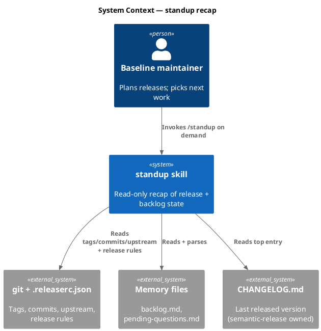

### C4 — Container

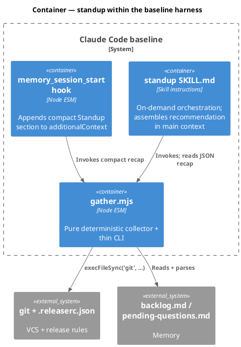

### C4 — Component (changed containers only)

`gather.mjs` is new; `memory_session_start` is changed. Both shown.

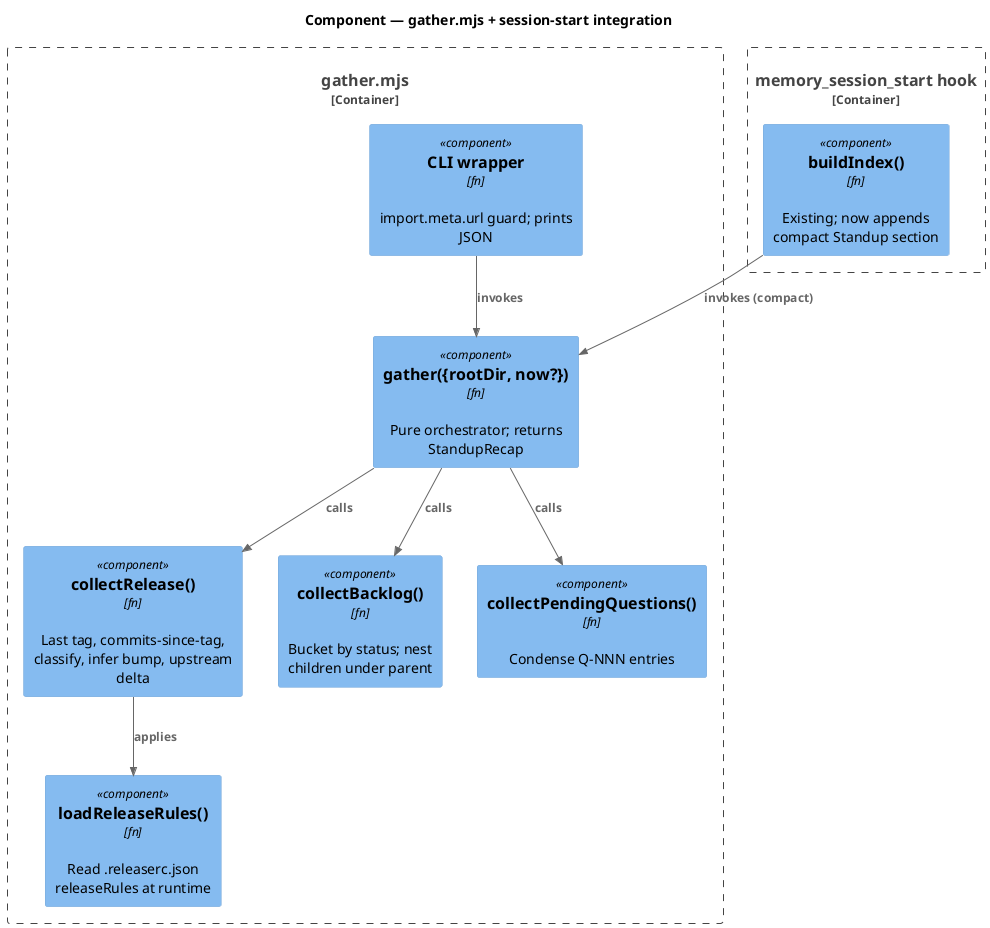

### Data model — class diagram

The "data model" is the in-memory `StandupRecap` object that `gather()` returns. No database.

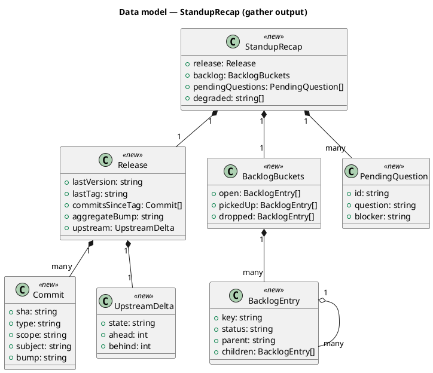

#### Migration DDL

```sql
-- No schema migration: this change introduces no database tables or columns.
-- forward: (none)
-- reverse: (none)
```

### Behavior — sequence per AC

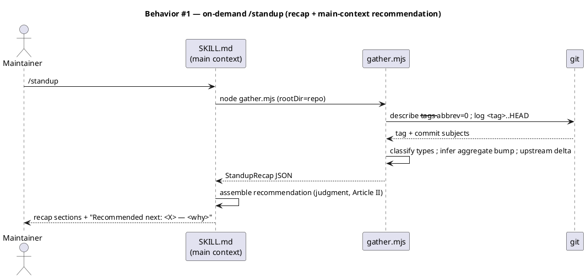

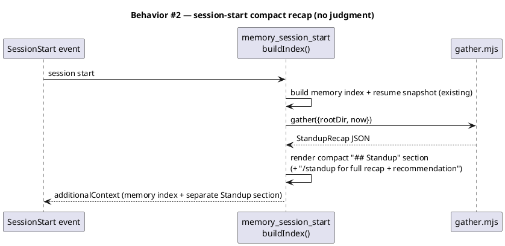

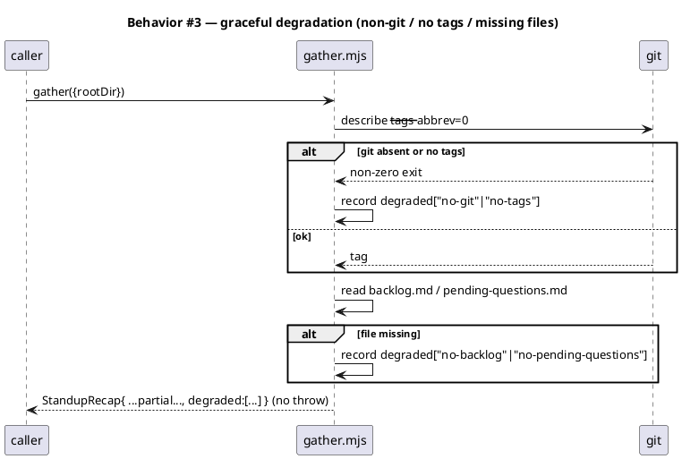

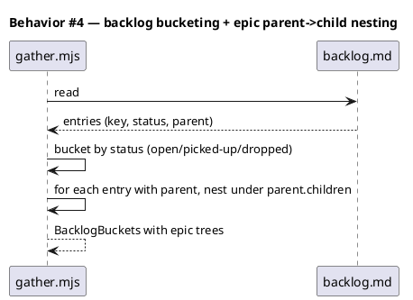

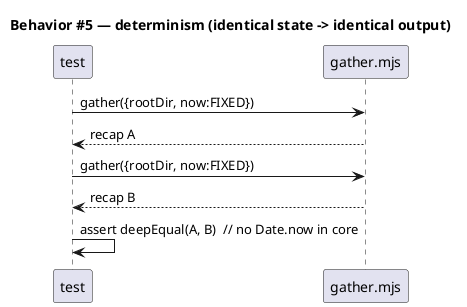

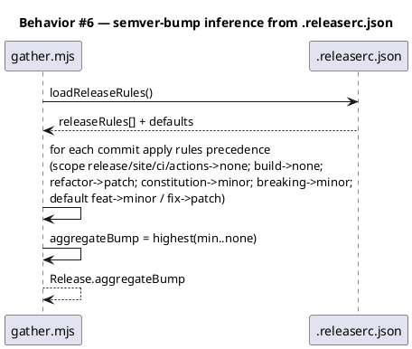

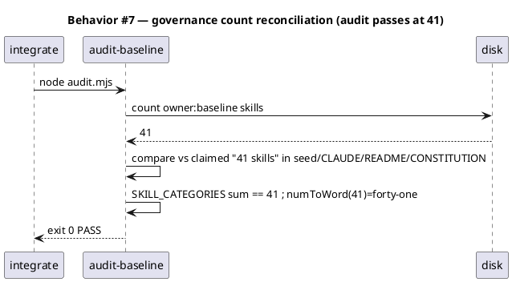

### State — core entity *(only if stateful)*

No non-trivial state machine — `gather()` is a pure stateless transform from repo+memory state to a recap object. Heading retained to record the explicit choice.

### Dependencies — graph

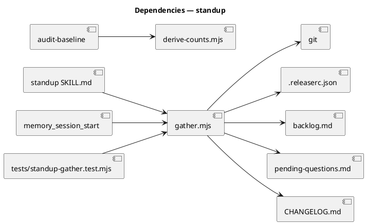

### Contracts

| Kind | Name | Input | Output | Errors | Idempotent |
|---|---|---|---|---|---|
| CLI | `node .claude/skills/standup/gather.mjs` | argv: optional `--root <dir>` | JSON `StandupRecap` on stdout | exit 0 always (degraded states reported in `degraded[]`, not thrown) | yes (read-only) |
| Module | `gather({ rootDir, now? })` | `{rootDir: string, now?: number}` | `StandupRecap` object | throws only on programmer error (bad arg type), never on missing git/files | yes |
| Skill | `/standup` (SKILL.md) | none | recap sections + main-context recommendation | — | yes (read-only) |
| Hook section | `buildIndex()` Standup append | existing payload | `additionalContext` gains a delimited `## Standup` section | hook never fails on gather error — degrades to omitting the section | yes |

### Libraries and versions

No third-party library is introduced. Only Node builtins (`node:child_process` `execFileSync`, `node:fs`, `node:path`) on `engines.node >=18.17.0`, plus the `git` CLI already required by the repo. context7 not applicable (no external API).

| Library@version | Purpose | Key APIs | Confirmed via context7 |
|---|---|---|---|
| *(none — Node builtins + git CLI)* | — | `execFileSync`, `readFileSync` | n/a |

### Alternatives considered

| Alt | Summary | Rejected because |
|---|---|---|
| New SessionStart hook | A 23rd hook surfaces standup at session start | Triggers a parallel 22→23 hook governance cascade for cosmetic separation; A1 reuses the existing injection path at zero hook-count cost |
| New `reporting` skill category | Dedicated category for standup | Violates YAGNI (one member); changes README's "thirteen categories"; `generators` is an honest sibling of `whatsnew` |
| Inline prose helper (no gather.mjs) | Model runs git/parse by hand each invocation | Fails the determinism AC and re-introduces ad-hoc variance the skill exists to remove |
| Hard-code semver rules | Bake feat→minor/fix→patch into gather.mjs | Drifts from `.releaserc.json`; reading the rules at runtime keeps them in lockstep |

## Design calls

No UI surface — `write_set` does not intersect `project.json → tdd.ui_globs`.

- *(none)*

## Acceptance criteria

| ID | Criterion (given / when / then) | Upstream AC | Sequence |
|---|---|---|---|
| AC-001 | given a repo with latest tag `vX.Y.Z` and N commits to HEAD, when `gather()` runs, then it returns `lastVersion` + `commitsSinceTag[]` each with a conventional-commit `type` | intake AC 1 | §Behavior #1 |
| AC-002 | given those commits, when `gather()` runs, then `aggregateBump` reflects `.releaserc.json` rules (scope release/site/ci/actions→none, build→none, refactor→patch, constitution→minor, breaking→minor, default feat→minor/fix→patch) | intake AC 2 | §Behavior #6 |
| AC-003 | given local commits vs `origin`, when `gather()` runs, then `upstream` reports `ahead`/`behind`/`all-pushed`/`no-upstream` | intake AC 3 | §Behavior #1 |
| AC-004 | given `backlog.md` with statuses + a parent epic with `parent:` children, when `gather()` parses it, then entries bucket by status and children nest under their parent | intake AC 4 | §Behavior #4 |
| AC-005 | given `pending-questions.md` with N entries, when `gather()` runs, then each is condensed to id + question + blocker | intake AC 5 | §Behavior #1 |
| AC-006 | given a non-git dir / no tags / missing memory files, when `gather()` runs, then it returns a well-formed recap naming the missing precondition in `degraded[]` and does not throw | intake AC 6 | §Behavior #3 |
| AC-007 | given identical repo+memory state and a fixed `now`, when `gather()` runs twice, then the two outputs are deep-equal (no clock read in the core) | intake AC 7 | §Behavior #5 |
| AC-008 | given the skill + helper land with `owner: baseline`, when `audit-baseline` runs, then it exits 0 with the skill count reconciled at 41 across seed.md, CLAUDE.md, README, CONSTITUTION, SKILL_CATEGORIES, and `numToWord(41)` | intake AC 8 | §Behavior #7 |
| AC-009 | given the skill is installed, when invoked via `/standup` it produces a main-context recommendation, and at session start `buildIndex()` appends a delimited `## Standup` section separate from the resume snapshot | intake AC 9 | §Behavior #2 |

## Test plan

| Category | Scenario | Expected | Covers |
|---|---|---|---|
| Golden path | fixture repo: tag `v0.1.0` + feat/fix/chore commits | `commitsSinceTag` typed; `aggregateBump = minor` | AC-001, AC-002 |
| Golden path | `.releaserc` rule edges: `refactor`, `chore(release)`, `feat(constitution)` | bumps = patch, none, minor respectively | AC-002 |
| Input boundary | upstream ahead by 2 / all-pushed / no upstream configured | `upstream.state` correct each case | AC-003 |
| Contract violation | `backlog.md` with epic `-9d4c` + children `-1a2d`,`-d186` | children nested under parent; buckets correct | AC-004 |
| Input boundary | `pending-questions.md` with Q-002, Q-007 | condensed id+question+blocker | AC-005 |
| Failure mode | non-git temp dir | `degraded` includes `no-git`; no throw | AC-006 |
| Failure mode | git repo with zero tags; missing `backlog.md` | `degraded` includes `no-tags`,`no-backlog`; no throw | AC-006 |
| Concurrency / ordering | run `gather()` twice with fixed `now` | `deepEqual` | AC-007 |
| Regression trap | no `Date.now()`/`new Date()` in gather.mjs core path | grep assertion: clock calls absent from diffable core | AC-007 |
| Regression trap | `audit-baseline` after all count edits | exit 0; skills=41 reconciled | AC-008 |
| Golden path | session-start integration: `buildIndex()` output contains a delimited `## Standup` section distinct from resume snapshot | section present + separate | AC-009 |

## Observability

| Signal | Name | Shape | Purpose |
|---|---|---|---|
| Log | gather degraded states | `degraded[]` array in output | surfaces missing preconditions to the reader |
| n/a | — | read-only dev tool; no metrics/alarms | — |

## Rollout

- **Feature flag**: none — additive, read-only tooling. The skill exists or it doesn't.
- **Migration order**: 1) add `.claude/skills/standup/{SKILL.md,gather.mjs}` + `tests/standup-gather.test.mjs`; 2) bump all count surfaces + `SKILL_CATEGORIES` + number-word maps + regexes in the same change-set; 3) edit `lib/memory_session_start.mjs`; 4) run `scripts/build-template.sh` to regenerate `obj/template/.claude/manifest.json`; 5) `audit-baseline` must exit 0 before commit.
- **Canary**: n/a (local dev tool). The integrate gate (`audit-baseline` + `npm test`) is the success signal.

## Rollback

- **Kill-switch**: remove `.claude/skills/standup/`, revert the count-surface edits + `memory_session_start.mjs` change, re-run `scripts/build-template.sh` to restamp the manifest at 40.
- **Signal to roll back**: `audit-baseline` FAIL or `npm test` red after merge — both trip in CI within one run, well under any 5-minute window.

## Archive plan

- Defaults *(automatic)*: intake, scout, research, brief, spec, spec-rendered/, spec approval.
- Extras *(list any non-default files)*:
  - *(none)*

## Open questions

- *(none blocking — research forks A1/B1/C1 adopted; intake OQ-1 resolved as: session-start = compact mechanical recap + pointer, judgment recommendation on-demand only; intake OQ-2 resolved as A1 = extend existing hook, no new hook.)*
