# Spec — feature the standup skill on the marketing site (/standup page + homepage teaser)

## Context

| Input | Path |
|---|---|
| Intake | `docs/intake/standup-site-feature.md` |
| BRD *(if any)* | *(none)* |
| Scout *(if any)* | `docs/scout/standup-site-feature.md` |
| Research *(if any)* | `docs/research/standup-site-feature.md` |
| Brainstorm brief | `docs/brief/standup-site-feature.md` |

## Goal

A developer evaluating the baseline can discover `/standup`, see the real recap it produces, and copy the command to try it, reached from a dedicated `/standup` feature page, a homepage teaser, and site navigation.

## Non-goals

- Not a features-page rewrite or a redesign of existing homepage sections.
- Does not change `standup` skill behavior (shipped in `3fffd06`).
- No email capture, signup, lead-gen, scarcity, or fake-urgency widgets.

## Design

Diagrams are the contract. Prose is only for things a diagram cannot say. This is an eleventy static-site change: new nunjucks pages reusing on-disk components (`.dc-*` dev-console, `.cli-strip` copy pill, `docs.njk` layout). No runtime service, no database.

### C4 — System context

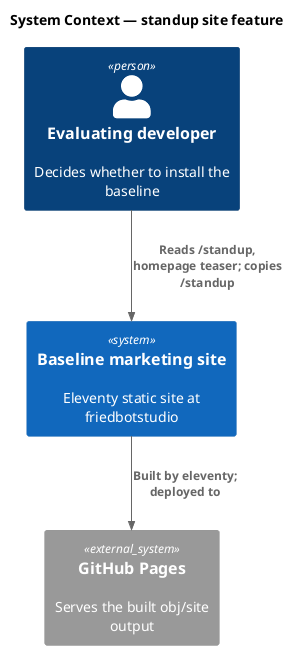

### C4 — Container

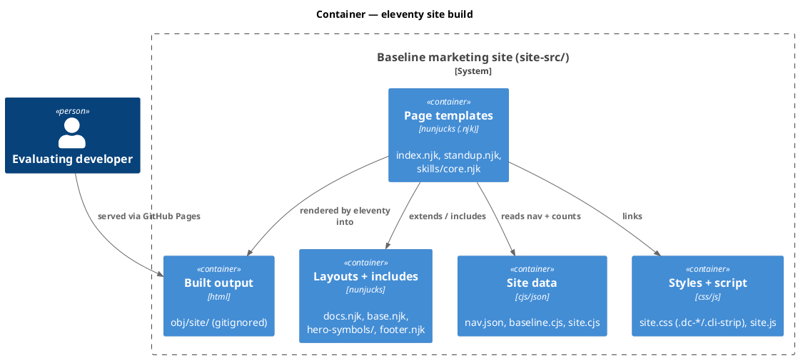

### C4 — Component (changed containers only)

The Page-templates container changes (new page + teaser); the Layout container gains one hero-symbol partial.

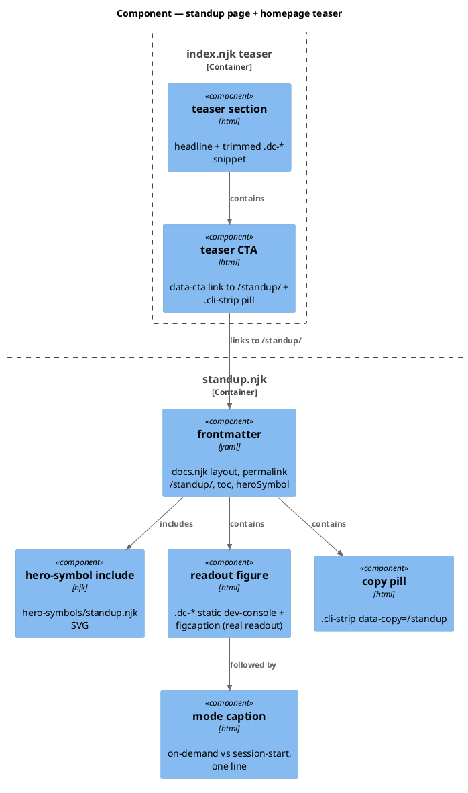

### Data model — class diagram

No database. The "data model" is the static content composition rendered into HTML.

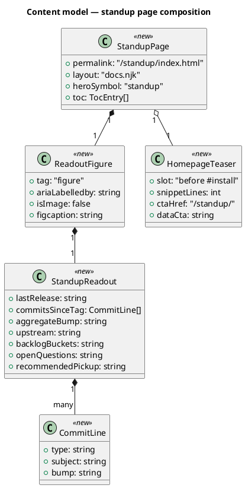

#### Migration DDL

```sql
-- No schema migration: this is a static-site change with no database.
-- forward: (none)
-- reverse: (none)
```

### Behavior — sequence per AC

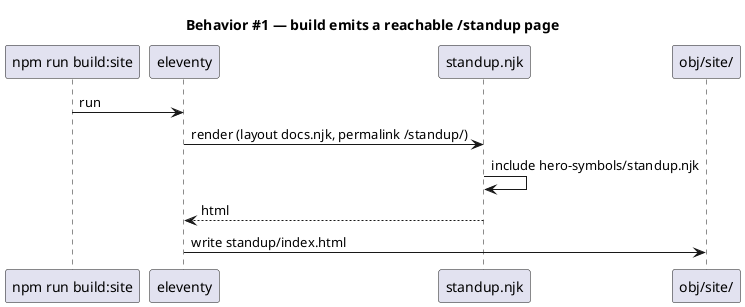

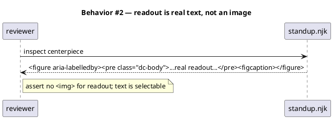

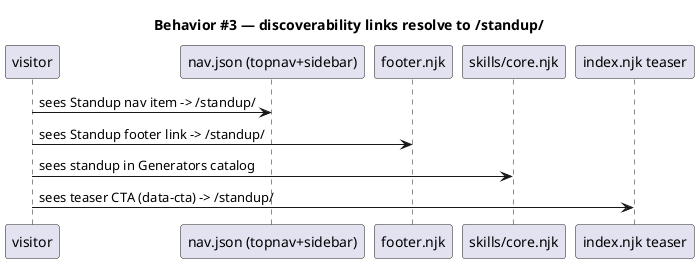

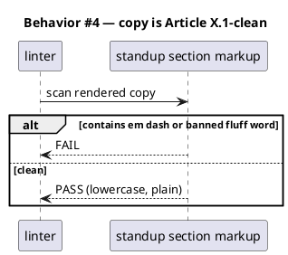

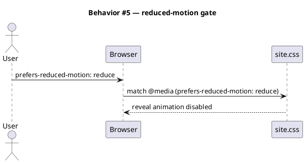

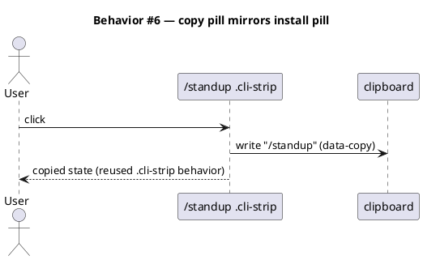

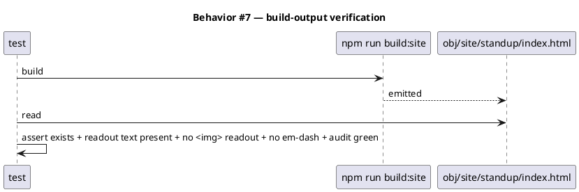

### State — core entity *(only if stateful)*

No state machine. Static pages rendered once per build. Heading retained to record the explicit choice.

### Dependencies — graph

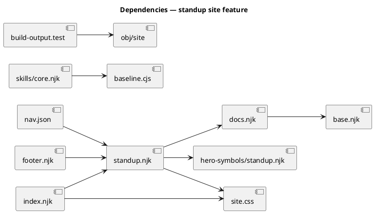

### Contracts

| Kind | Name | Input | Output | Errors | Idempotent |
|---|---|---|---|---|---|
| Build | `npm run build:site` | `site-src/**` | `obj/site/standup/index.html` + rebuilt pages | non-zero on missing include / template error | yes |
| Route | `/standup/` | GET | the feature page | 404 if not built | yes |
| Attr | teaser CTA `data-cta` | click | GA4 event (measurability) | — | yes |
| Attr | `.cli-strip` `data-copy="/standup"` | click | clipboard write + copied state | — | yes |

### Libraries and versions

No new dependency. Eleventy + nunjucks are already present in the site toolchain. No third-party API surface is introduced, so context7 is not applicable.

| Library@version | Purpose | Key APIs | Confirmed via context7 |
|---|---|---|---|
| *(none — existing eleventy/nunjucks toolchain)* | — | — | n/a |

### Alternatives considered

| Alt | Summary | Rejected because |
|---|---|---|
| Animated streamed console | Reuse hero `#dc-stream` JS to type the readout | Adds JS + motion/a11y burden; dilutes the hero's animated moment; static text scans better as proof |
| New bespoke terminal component | Author fresh CSS for the block | Violates reuse-before-create; `.dc-*` exists on disk with full tokens |
| Image of a terminal (.cli-preview) | Screenshot the readout like cli.njk | AC-4 forbids an image; not AT-readable/selectable |
| Words-only teaser (no readout) | Tease in prose, full readout only on /standup | Loses the demonstration hook where attention is highest |

## Design calls

UI surfaces under `site-src/**` (∈ `tdd.ui_globs`). `/tdd` Step 6 runs `Skill(design-ui, task_brief)` once per row; design-ui routes through `impeccable`.

| Slug | Intent | Target files | Write set | Register | References |
|---|---|---|---|---|---|
| standup-page | A /standup feature page whose centerpiece is the real terminal readout as proof-by-demonstration, in the existing docs.njk + `.dc-*` design system and lowercase disciplined voice; authority-via-competence + liking-via-shared-pain, no scarcity/urgency | `site-src/standup.njk`, `site-src/_includes/hero-symbols/standup.njk` | `site-src/**` | inherit | `.dc-*` component `site-src/index.njk:33-39`; frontmatter exemplar `site-src/swarm.njk:1-22`; figure a11y `site-src/index.njk:55,86` |
| standup-teaser | A compact homepage teaser section before Adoption with a trimmed 3-4 line `.dc-*` readout snippet, a `data-cta` link to /standup/, and a click-to-copy `/standup` pill reusing `.cli-strip` | `site-src/index.njk` | `site-src/index.njk`, `site-src/assets/site.css` | inherit | Adoption boundary `site-src/index.njk:519`; `.cli-strip` pill `site-src/index.njk:552`; `data-cta` pattern `site-src/index.njk:21` |

## Acceptance criteria

| ID | Criterion (given / when / then) | Upstream AC | Sequence |
|---|---|---|---|
| AC-001 | given the eleventy build runs, when it completes, then `obj/site/standup/index.html` is emitted and reachable at `/standup/` | intake AC 1 | §Behavior #1 |
| AC-002 | given `/standup`, when rendered, then it uses `layout: docs.njk` with toc, eyebrow, lead, heroSymbol, consistent with swarm.njk/memory.njk | intake AC 2 | §Behavior #1 |
| AC-003 | given the page, when rendered, then `site-src/_includes/hero-symbols/standup.njk` exists and the include resolves (no build error) | intake AC 3 | §Behavior #1 |
| AC-004 | given the centerpiece, when rendered, then the readout is semantic text in a `<figure>` (`.dc-*` `<pre>` + `<figcaption>`), not an ``, and is selectable | intake AC 4 | §Behavior #2 |
| AC-005 | given the homepage, when rendered, then a compact teaser section appears before the Adoption section and links to `/standup/` | intake AC 5 | §Behavior #3 |
| AC-006 | given navigation, when rendered, then nav.json (topnav+sidebar) and footer.njk link to `/standup/`, and skills/core.njk names `standup` | intake AC 6 | §Behavior #3 |
| AC-007 | given the rendered standup page + teaser copy, when scanned, then no em dash and no Article X.1 banned fluff word | intake AC 7 | §Behavior #4 |
| AC-008 | given `prefers-reduced-motion: reduce`, when the page loads, then any reveal-on-scroll animation is disabled (CSS-gated) | intake AC 8 | §Behavior #5 |
| AC-009 | given the build, when the terminal block is populated, then its content is a representative REAL `/standup` readout (captured from an actual repo state), labeled as an example | intake AC 9 | §Behavior #2 |
| AC-010 | given the page and teaser, when rendered, then the primary CTA is a click-to-copy `/standup` pill reusing `.cli-strip`/`data-copy` (no signup) | intake AC 10 | §Behavior #6 |
| AC-011 | given the full change, when `/integrate` runs, then the test suite and `audit-baseline` stay green | intake AC 11 | §Behavior #7 |

## Test plan

| Category | Scenario | Expected | Covers |
|---|---|---|---|
| Golden path | build site; stat `obj/site/standup/index.html` | file exists | AC-001 |
| Golden path | built standup html contains the readout text inside `<pre class="dc-body">` | present | AC-004, AC-009 |
| Contract violation | built standup readout region contains `` immediately before Adoption (`index.njk:519`) vs right after "How it flows" (`:184`). Resolved in the standup-teaser design call; default is before Adoption.
- Homepage snippet vs words-only: research recommends a trimmed `.dc-*` snippet (B1); confirm acceptable given homepage length, else fall back to words-only (B2).
- Test-glob placement: add the build-output test to the default `npm test` glob vs gate it behind a build-tests flag (per the existing publish-check convention) to control suite time.
